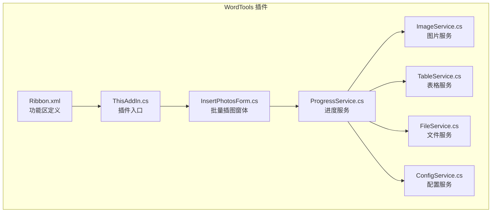
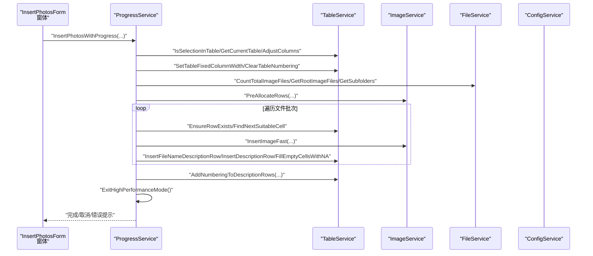
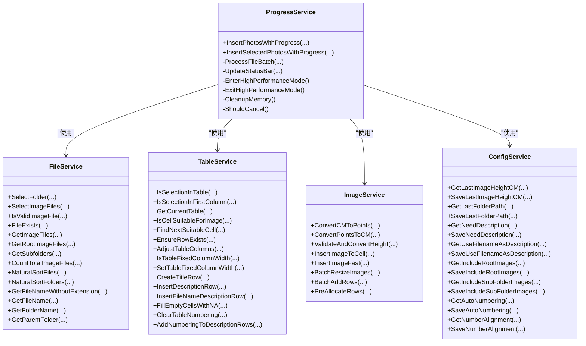

# API 参考

<cite>
**本文引用的文件**
- [ImageService.cs](file://WordTools/Services/ImageService.cs)
- [TableService.cs](file://WordTools/Services/TableService.cs)
- [ConfigService.cs](file://WordTools/Services/ConfigService.cs)
- [FileService.cs](file://WordTools/Services/FileService.cs)
- [ProgressService.cs](file://WordTools/Services/ProgressService.cs)
- [InsertPhotosForm.cs](file://WordTools/Forms/InsertPhotosForm.cs)
- [README.md](file://README.md)
</cite>

## 目录
1. [简介](#简介)
2. [项目结构](#项目结构)
3. [核心组件](#核心组件)
4. [架构总览](#架构总览)
5. [详细组件分析](#详细组件分析)
6. [依赖关系分析](#依赖关系分析)
7. [性能考量](#性能考量)
8. [故障排查指南](#故障排查指南)
9. [结论](#结论)
10. [附录](#附录)

## 简介
本文件为 WordTools 插件的 API 参考文档，覆盖所有公共接口、方法签名与参数说明，重点聚焦以下服务类：
- ImageService：图片尺寸转换、插入、批量调整与预分配行
- TableService：表格验证、单元格适配、标题/描述行、自动编号
- ConfigService：文档自定义属性与注册表配置读写
- FileService：文件夹/图片文件选择、校验、自然排序与统计
- ProgressService：批量插入流程控制、进度更新、性能优化与取消机制

文档同时提供调用序列图、类图与流程图，帮助开发者快速理解 API 的使用方式、异常处理策略与最佳实践。

## 项目结构
- 插件采用 COM 加载项（IDTExtensibility2）实现，功能区通过 Ribbon.xml 定义，主窗体 InsertPhotosForm 提供交互界面。
- 服务层位于 WordTools/Services 目录，形成清晰的职责分离：文件系统与 UI 交互由窗体负责，业务逻辑由服务类承担。

图表来源
- [InsertPhotosForm.cs:1-618](file://WordTools/Forms/InsertPhotosForm.cs#L1-L618)
- [ProgressService.cs:1-571](file://WordTools/Services/ProgressService.cs#L1-L571)
- [ImageService.cs:1-325](file://WordTools/Services/ImageService.cs#L1-L325)
- [TableService.cs:1-756](file://WordTools/Services/TableService.cs#L1-L756)
- [FileService.cs:1-310](file://WordTools/Services/FileService.cs#L1-L310)
- [ConfigService.cs:1-362](file://WordTools/Services/ConfigService.cs#L1-L362)

章节来源
- [README.md:1-85](file://README.md#L1-L85)

## 核心组件
- ImageService：提供厘米与磅单位换算、图片插入与尺寸调整、批量图片尺寸重设、预分配表格行等能力。
- TableService：提供表格/单元格验证、确保行/列存在、固定列宽、标题行/描述行创建、自动编号与对齐设置。
- ConfigService：提供文档自定义属性与注册表的配置读写，涵盖图片高度、文件夹路径、描述行策略、文件范围、自动编号与对齐等。
- FileService：提供文件夹选择、图片文件选择、文件有效性校验、图片文件枚举、自然排序与统计。
- ProgressService：封装批量插入主流程，包含性能优化（关闭屏幕刷新、禁用提示）、进度条更新、内存清理、取消控制（ESC）以及最终编号追加。

章节来源
- [ImageService.cs:10-325](file://WordTools/Services/ImageService.cs#L10-L325)
- [TableService.cs:11-756](file://WordTools/Services/TableService.cs#L11-L756)
- [ConfigService.cs:11-362](file://WordTools/Services/ConfigService.cs#L11-L362)
- [FileService.cs:13-310](file://WordTools/Services/FileService.cs#L13-L310)
- [ProgressService.cs:14-571](file://WordTools/Services/ProgressService.cs#L14-L571)

## 架构总览
下图展示批量插图主流程中各服务之间的协作关系与调用方向。

图表来源
- [InsertPhotosForm.cs:525-561](file://WordTools/Forms/InsertPhotosForm.cs#L525-L561)
- [ProgressService.cs:148-306](file://WordTools/Services/ProgressService.cs#L148-L306)
- [TableService.cs:18-40](file://WordTools/Services/TableService.cs#L18-L40)
- [ImageService.cs:287-320](file://WordTools/Services/ImageService.cs#L287-L320)
- [FileService.cs:117-158](file://WordTools/Services/FileService.cs#L117-L158)

## 详细组件分析

### ImageService API 规范
- 单位转换
  - ConvertCMToPoints(float): 将厘米转换为磅
  - ConvertPointsToCM(float): 将磅转换为厘米
  - ValidateAndConvertHeight(string, out float): 验证并转换高度输入（厘米）
- 图片插入
  - InsertImageToCell(Cell, string, float=-1): 插入图片到单元格并按单元格尺寸与最小高度约束调整
  - InsertImageFast(Cell, string, float=-1): 快速插入（最小化内存占用）
- 批量操作
  - BatchResizeImages(Table, int, int, float=-1): 批量调整表格内图片尺寸
  - BatchAddRows(Table, int, Application=null): 批量添加行（带状态栏更新）
  - PreAllocateRows(Table, int, int=2, bool=false, Application=null): 预分配行数（限制最大1000）

参数与返回值要点
- 参数类型均为基本类型或 Office Interop 类型；返回值多为布尔或 Office 对象（如 InlineShape）。
- 大多数方法内部使用 try/catch 忽略异常，保证流程稳定性。

异常处理与健壮性
- 方法内部普遍捕获异常并返回空值或直接返回，避免影响上层流程。
- 建议调用方在必要处自行包装异常或进行前置校验。

使用示例（路径参考）
- 插入图片到单元格：[ImageService.InsertImageToCell:73-134](file://WordTools/Services/ImageService.cs#L73-L134)
- 快速插入图片：[ImageService.InsertImageFast:142-180](file://WordTools/Services/ImageService.cs#L142-L180)
- 批量调整图片尺寸：[ImageService.BatchResizeImages:193-239](file://WordTools/Services/ImageService.cs#L193-L239)
- 预分配行数：[ImageService.PreAllocateRows:287-320](file://WordTools/Services/ImageService.cs#L287-L320)

章节来源
- [ImageService.cs:10-325](file://WordTools/Services/ImageService.cs#L10-L325)

### TableService API 规范
- 表格验证
  - IsSelectionInTable(Selection): 当前选择是否在表格中
  - IsSelectionInFirstColumn(Selection): 是否在第一列
  - GetCurrentTable(Selection): 获取当前表格对象
- 单元格适配
  - IsCellSuitableForImage(Cell): 检查单元格是否适合插入图片（含自动编号清理与文本清理）
  - FindNextSuitableCell(Table, int, out int, out int, int=1): 寻找下一个适合的单元格
- 表格操作
  - EnsureRowExists(Table, int): 确保指定行存在
  - AdjustTableColumns(Table, int): 调整列数
  - IsTableFixedColumnWidth(Table): 是否固定列宽
  - SetTableFixedColumnWidth(Table): 设置固定列宽
- 标题/描述行
  - CreateTitleRow(Table, ref int, string): 创建标题行
  - InsertDescriptionRow(Table, ref int): 插入描述行
  - InsertFileNameDescriptionRow(Table, ref int, string[]): 插入文件名描述行
  - FillEmptyCellsWithNA(Table, int, int, int): 填充空单元格为 N/A
- 自动编号
  - ClearTableNumbering(Table, int=1): 清除表格自动编号并返回原对齐方式
  - AddNumberingToDescriptionRows(Table, Document, int=1, int=1, bool=false): 为描述行添加自动编号

参数与返回值要点
- 多数方法返回 bool 或修改传入对象（ref/传引用）。
- 自动编号相关方法返回原对齐方式以便恢复。

使用示例（路径参考）
- 检查单元格是否适合插入图片：[TableService.IsCellSuitableForImage:45-123](file://WordTools/Services/TableService.cs#L45-L123)
- 确保行存在：[TableService.EnsureRowExists:205-229](file://WordTools/Services/TableService.cs#L205-L229)
- 添加自动编号：[TableService.AddNumberingToDescriptionRows:564-737](file://WordTools/Services/TableService.cs#L564-L737)

章节来源
- [TableService.cs:11-756](file://WordTools/Services/TableService.cs#L11-L756)

### ConfigService API 规范
- 文档属性与注册表读写
  - GetDocumentProperty(Document, string, string="")
  - SetDocumentProperty(Document, string, string)
  - GetRegistryValue(string, string="")
  - SetRegistryValue(string, string)
- 图片高度配置
  - GetLastImageHeightCM(Document=null): 读取最后使用的图片高度（厘米）
  - SaveLastImageHeightCM(string, Document=null): 保存图片高度（空值使用特殊标记）
- 文件夹路径配置
  - GetLastFolderPath(Document=null): 读取最后文件夹路径
  - SaveLastFolderPath(string, Document=null): 保存文件夹路径
- 描述行配置
  - GetNeedDescription(Document=null): 是否需要描述行
  - SaveNeedDescription(bool, Document=null): 保存描述行策略
  - GetUseFilenameAsDescription(Document=null): 是否使用文件名作为描述
  - SaveUseFilenameAsDescription(bool, Document=null): 保存描述行策略
- 文件范围配置
  - GetIncludeRootImages(Document=null): 是否包含根目录图片
  - SaveIncludeRootImages(bool, Document=null): 保存根目录包含策略
  - GetIncludeSubFolderImages(Document=null): 是否包含子目录图片
  - SaveIncludeSubFolderImages(bool, Document=null): 保存子目录包含策略
- 自动编号配置
  - GetAutoNumbering(): 读取自动编号开关
  - SaveAutoNumbering(bool): 保存自动编号开关
- 编号对齐配置
  - GetNumberAlignment(): 读取编号对齐方式（1=靠左, 2=居中）
  - SaveNumberAlignment(int): 保存编号对齐方式

参数与返回值要点
- 优先从文档自定义属性读取，回退到注册表。
- 空值统一使用特殊标记 "__EMPTY__" 以规避 COM 空字符串问题。

使用示例（路径参考）
- 保存图片高度：[ConfigService.SaveLastImageHeightCM:169-178](file://WordTools/Services/ConfigService.cs#L169-L178)
- 读取自动编号开关：[ConfigService.GetAutoNumbering:320-331](file://WordTools/Services/ConfigService.cs#L320-L331)

章节来源
- [ConfigService.cs:11-362](file://WordTools/Services/ConfigService.cs#L11-L362)

### FileService API 规范
- 文件夹选择
  - SelectFolder(string="请选择文件夹...", string=""): 选择文件夹（返回路径或空字符串）
- 图片文件选择
  - SelectImageFiles(string="请选择图片文件...", string=""): 选择图片文件（多选，返回路径数组或 null）
- 文件验证
  - IsValidImageFile(string): 判断是否为支持的图片格式（.jpg/.jpeg/.png）
  - FileExists(string): 判断文件是否存在
- 文件列表获取
  - GetImageFiles(string, bool=false): 获取文件夹中的图片文件（自然排序）
  - GetRootImageFiles(string): 获取根目录图片（不包含子文件夹）
  - GetSubfolders(string): 获取子文件夹列表（自然排序）
  - CountTotalImageFiles(string, bool, bool): 统计总图片数量（根目录/子目录可选）
- 自然排序
  - NaturalSortFiles(string[]): 自然排序文件路径
  - NaturalSortFolders(string[]): 自然排序文件夹路径
- 辅助方法
  - GetFileNameWithoutExtension(string): 获取不含扩展名的文件名
  - GetFileName(string): 获取文件名（含扩展名）
  - GetFolderName(string): 获取文件夹名称
  - GetParentFolder(string): 获取父文件夹路径

参数与返回值要点
- 自然排序算法支持数字段比较，行为类似资源管理器。
- 统计函数根据配置组合根目录与子目录计数。

使用示例（路径参考）
- 选择图片文件：[FileService.SelectImageFiles:57-78](file://WordTools/Services/FileService.cs#L57-L78)
- 获取根目录图片：[FileService.GetRootImageFiles:139-142](file://WordTools/Services/FileService.cs#L139-L142)
- 自然排序文件：[FileService.NaturalSortFiles:254-259](file://WordTools/Services/FileService.cs#L254-L259)

章节来源
- [FileService.cs:13-310](file://WordTools/Services/FileService.cs#L13-L310)

### ProgressService API 规范
- 构造
  - ProgressService(Application): 以 Word Application 初始化
- 批量插入（文件夹）
  - InsertPhotosWithProgress(string, float, bool, bool, bool, bool, bool, int=2): 主入口（带进度与取消）
- 批量插入（选中文件）
  - InsertSelectedPhotosWithProgress(string[], float, bool, bool, bool, int=2): 主入口（带进度与取消）
- 内部流程
  - ProcessFileBatch(string[], Table, ref int, float, bool, bool, ref int, ref int, ref int, int, DateTime): 处理文件批次
  - UpdateStatusBar(int, int, string, DateTime): 更新状态栏
  - EnterHighPerformanceMode()/ExitHighPerformanceMode(): 进入/退出高性能模式（关闭屏幕刷新、禁用提示）
  - CleanupMemory(): 定期清理内存
  - ShouldCancel(): 检查 ESC 取消

参数与返回值要点
- 支持按文件数量动态调整刷新/内存清理/保存间隔。
- 支持在插入过程中按 ESC 键取消。
- 结束时自动恢复 Word 性能设置并追加描述行编号（可选）。

使用示例（路径参考）
- 批量插入文件夹：[ProgressService.InsertPhotosWithProgress:151-306](file://WordTools/Services/ProgressService.cs#L151-L306)
- 批量插入选中文件：[ProgressService.InsertSelectedPhotosWithProgress:315-403](file://WordTools/Services/ProgressService.cs#L315-L403)

章节来源
- [ProgressService.cs:14-571](file://WordTools/Services/ProgressService.cs#L14-L571)

## 依赖关系分析
- ProgressService 依赖 FileService、TableService、ImageService、ConfigService 与 Word Interop。
- TableService 依赖 Word Interop 的 Selection/Document/Table/Cell 等对象。
- ImageService 依赖 Word Interop 的 InlineShape 与单元格尺寸。
- ConfigService 依赖 Word 自定义属性与 Windows 注册表。
- FileService 依赖 .NET 文件系统与 WinForms 对话框。

图表来源
- [ProgressService.cs:14-571](file://WordTools/Services/ProgressService.cs#L14-L571)
- [TableService.cs:11-756](file://WordTools/Services/TableService.cs#L11-L756)
- [ImageService.cs:10-325](file://WordTools/Services/ImageService.cs#L10-L325)
- [FileService.cs:13-310](file://WordTools/Services/FileService.cs#L13-L310)
- [ConfigService.cs:11-362](file://WordTools/Services/ConfigService.cs#L11-L362)

## 性能考量
- 高性能模式
  - 关闭 ScreenUpdating 与 DisplayAlerts，减少 UI 刷新与提示弹窗，显著提升批量插入性能。
  - 在 finally 中恢复原始设置，避免影响用户体验。
- 进度与内存
  - 根据文件总数动态调整刷新间隔、内存清理间隔与保存间隔，平衡流畅度与性能。
  - 定期触发 Application.DoEvents() 与 GC.Collect()，缓解长时间批处理的内存压力。
- 取消机制
  - 通过 ESC 键实时检测取消，及时中断后续处理，避免无效等待。
- UI 交互
  - 状态栏显示百分比、已用时间、剩余时间与当前文件名，便于用户感知进度。

最佳实践
- 批量插入前确保表格固定列宽，避免自动调整导致的额外计算。
- 合理设置最小高度与描述行策略，减少后续重排与编号开销。
- 大规模批处理时建议开启“自动编号”与“文件名描述”，并选择合适的对齐方式。

章节来源
- [ProgressService.cs:73-142](file://WordTools/Services/ProgressService.cs#L73-L142)
- [ProgressService.cs:212-304](file://WordTools/Services/ProgressService.cs#L212-L304)

## 故障排查指南
- 常见问题
  - 无法插入图片：检查单元格是否已有图片、是否处于自动编号状态；使用 IsCellSuitableForImage 进行预检。
  - 表格未固定列宽：调用 SetTableFixedColumnWidth，避免插入后列宽变化。
  - 高度输入无效：ValidateAndConvertHeight 返回 false 时提示用户输入大于 0 的数字。
  - 插入过程卡顿：确认已进入高性能模式；适当增大刷新/内存清理间隔。
  - 取消无效：确保 ESC 键未被其他快捷键占用；确认 DoEvents 能够执行。
- 异常处理策略
  - 服务层普遍使用 try/catch 忽略异常，保证流程继续；调用方可在关键步骤增加显式校验与异常包装。
- 配置丢失
  - 若文档自定义属性不可用，ConfigService 会回退到注册表；确认注册表路径与权限。

章节来源
- [TableService.cs:45-123](file://WordTools/Services/TableService.cs#L45-L123)
- [ImageService.cs:43-60](file://WordTools/Services/ImageService.cs#L43-L60)
- [ProgressService.cs:51-64](file://WordTools/Services/ProgressService.cs#L51-L64)

## 结论
本 API 参考文档系统梳理了 WordTools 的核心服务类及其公共接口，明确了参数、返回值、异常处理与使用场景。通过合理的性能优化与健壮的错误处理，这些服务能够稳定支撑批量图片插入、表格自动编号与配置持久化等核心功能。建议在生产环境中结合实际数据规模调整刷新与内存策略，并在关键流程中增加必要的前置校验与日志记录。

## 附录

### 版本兼容性与变更历史
- 本仓库未提供明确的版本号与变更日志文件。基于源码分析，以下为可观察到的功能演进线索：
  - 配置存储策略：优先使用文档自定义属性，回退到注册表，体现跨文档共享与本地持久化的双重设计。
  - 性能优化：引入高性能模式与动态间隔策略，适配不同规模的批量任务。
  - 用户体验：状态栏进度、ESC 取消、自然排序等细节增强。
- 建议在后续迭代中补充：
  - 版本号与发布说明
  - API 稳定性声明与弃用策略
  - 更详细的异常类型与错误码映射

章节来源
- [ConfigService.cs:14-24](file://WordTools/Services/ConfigService.cs#L14-L24)
- [ProgressService.cs:117-125](file://WordTools/Services/ProgressService.cs#L117-L125)