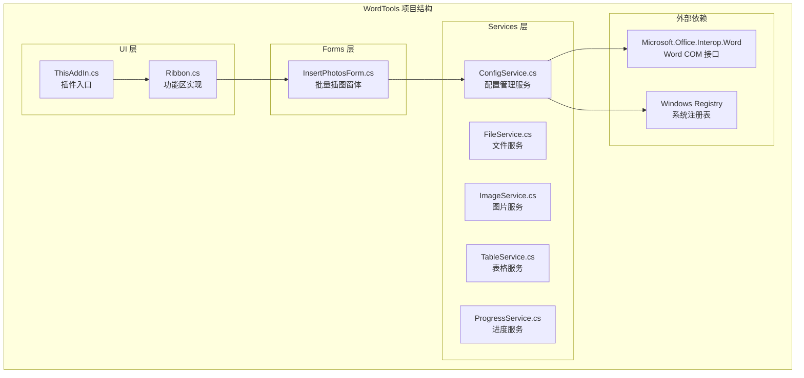
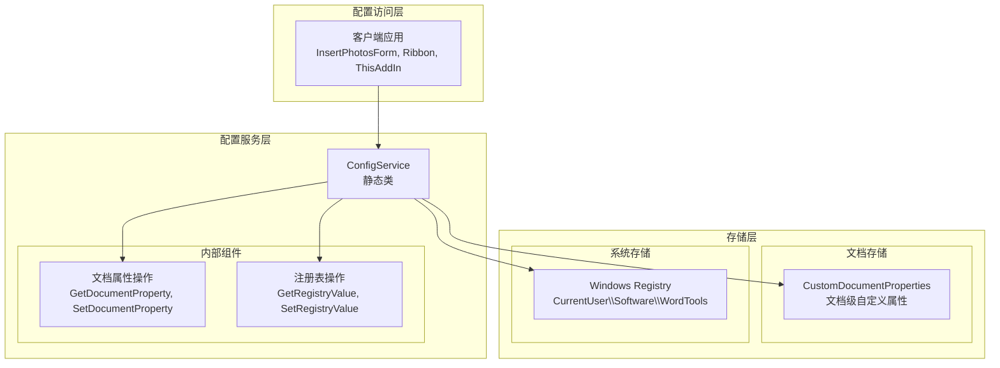
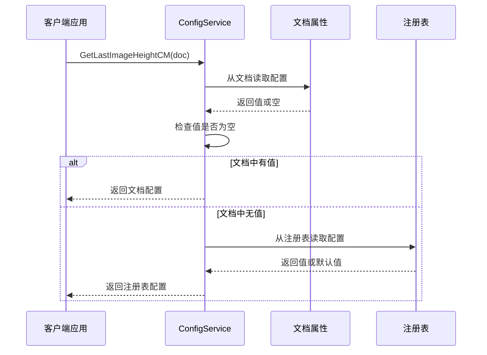
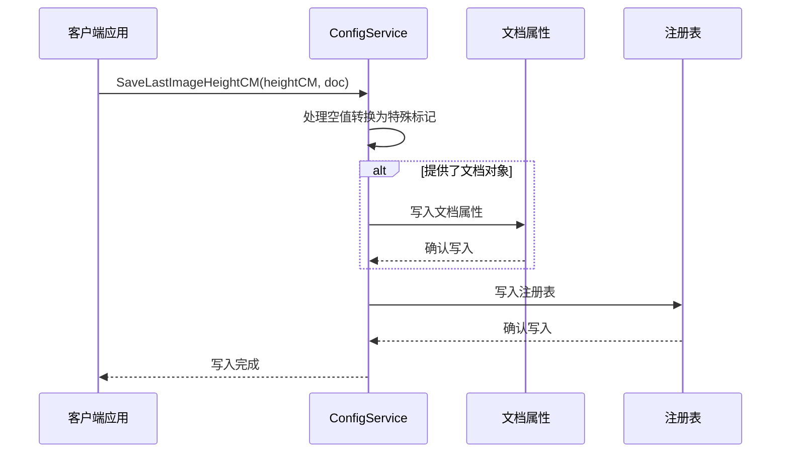
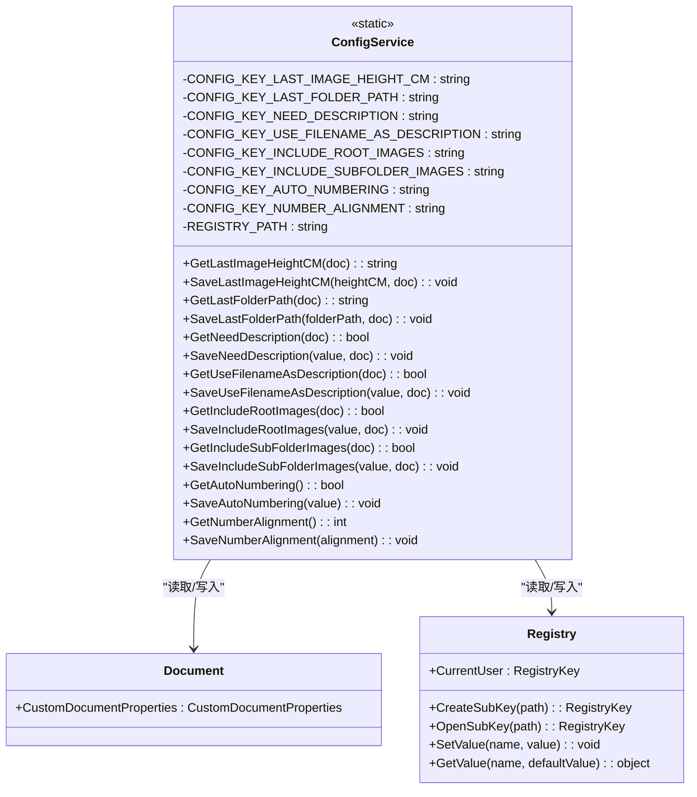
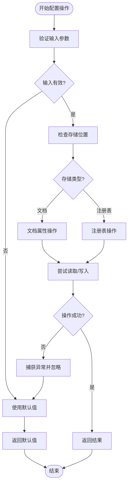
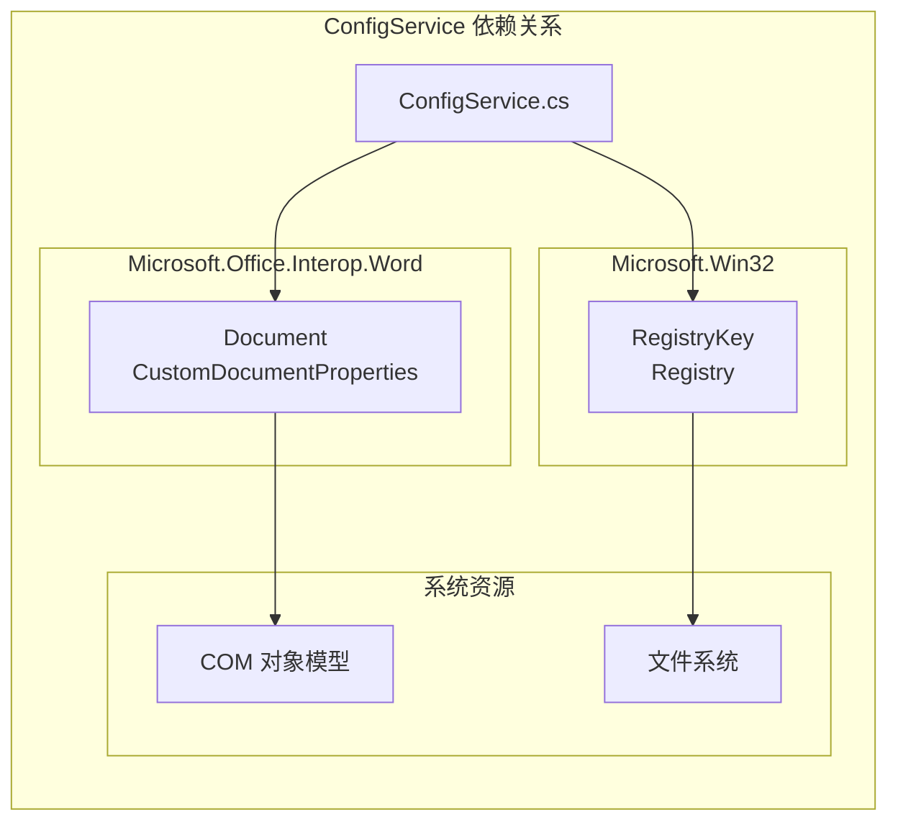

# ConfigService API 文档

<cite>
**本文档引用的文件**
- [ConfigService.cs](file://WordTools/Services/ConfigService.cs)
- [InsertPhotosForm.cs](file://WordTools/Forms/InsertPhotosForm.cs)
- [README.md](file://README.md)
- [ThisAddIn.cs](file://WordTools/ThisAddIn.cs)
- [Ribbon.cs](file://WordTools/Ribbon.cs)
</cite>

## 目录
1. [简介](#简介)
2. [项目结构](#项目结构)
3. [核心组件](#核心组件)
4. [架构概览](#架构概览)
5. [详细组件分析](#详细组件分析)
6. [依赖关系分析](#依赖关系分析)
7. [性能考虑](#性能考虑)
8. [故障排除指南](#故障排除指南)
9. [结论](#结论)

## 简介

ConfigService 是 WordTools 插件中的配置管理服务，负责管理文档自定义属性和应用程序设置的保存与读取。该服务采用双存储策略，结合文档级自定义属性和注册表备份，确保配置数据的持久化和跨文档共享。

该服务主要服务于批量图片插入功能，管理用户偏好设置如图片高度、文件夹路径、描述行配置、文件范围设置、自动编号配置和编号对齐方式等。

## 项目结构

WordTools 项目采用典型的 COM 加载项架构，ConfigService 位于 Services 目录中，作为独立的服务层组件。

**图表来源**
- [ConfigService.cs:1-362](file://WordTools/Services/ConfigService.cs#L1-L362)
- [InsertPhotosForm.cs:410-609](file://WordTools/Forms/InsertPhotosForm.cs#L410-L609)
- [ThisAddIn.cs:17-156](file://WordTools/ThisAddIn.cs#L17-L156)

**章节来源**
- [README.md:47-61](file://README.md#L47-L61)
- [ConfigService.cs:1-362](file://WordTools/Services/ConfigService.cs#L1-L362)

## 核心组件

ConfigService 采用静态类设计，提供统一的配置访问接口。其核心特点包括：

### 存储策略
- **文档级存储**：使用 Word 文档的 CustomDocumentProperties 存储文档特定配置
- **注册表备份**：使用 Windows Registry.CurrentUser 存储全局应用配置
- **优先级机制**：文档配置优先于注册表配置

### 配置键值管理
服务定义了 8 个主要配置键：
- LastImageHeightCM：最后使用的图片高度（厘米）
- LastFolderPath：最后选择的文件夹路径
- NeedDescription：是否需要描述行
- UseFilenameAsDescription：是否使用文件名作为描述
- IncludeRootImages：是否包含根目录图片
- IncludeSubFolderImages：是否包含子目录图片
- AutoNumbering：是否启用自动编号
- NumberAlignment：编号对齐方式（1=靠左, 2=居中）

### 数据类型处理
- 字符串类型：直接存储和读取
- 布尔类型：转换为 "True"/"False" 字符串存储
- 整数类型：转换为字符串存储，带默认值和有效性检查

**章节来源**
- [ConfigService.cs:13-24](file://WordTools/Services/ConfigService.cs#L13-L24)
- [ConfigService.cs:149-178](file://WordTools/Services/ConfigService.cs#L149-L178)

## 架构概览

ConfigService 的整体架构采用分层设计，实现了配置数据的持久化和跨组件共享。

**图表来源**
- [ConfigService.cs:11-362](file://WordTools/Services/ConfigService.cs#L11-L362)
- [InsertPhotosForm.cs:415-482](file://WordTools/Forms/InsertPhotosForm.cs#L415-L482)

## 详细组件分析

### 配置读取流程

ConfigService 实现了智能的配置读取机制，确保数据的一致性和可靠性。

**图表来源**
- [ConfigService.cs:149-164](file://WordTools/Services/ConfigService.cs#L149-L164)
- [ConfigService.cs:31-54](file://WordTools/Services/ConfigService.cs#L31-L54)

### 配置写入流程

配置写入采用双存储策略，确保数据的可靠性和一致性。

**图表来源**
- [ConfigService.cs:169-178](file://WordTools/Services/ConfigService.cs#L169-L178)
- [ConfigService.cs:59-92](file://WordTools/Services/ConfigService.cs#L59-L92)

### 配置键值管理

ConfigService 通过常量定义管理所有配置键，确保键值的一致性和可维护性。

**图表来源**
- [ConfigService.cs:11-362](file://WordTools/Services/ConfigService.cs#L11-L362)

### 配置验证机制

ConfigService 实现了多层次的配置验证和错误处理机制。

**图表来源**
- [ConfigService.cs:31-54](file://WordTools/Services/ConfigService.cs#L31-L54)
- [ConfigService.cs:101-119](file://WordTools/Services/ConfigService.cs#L101-L119)

**章节来源**
- [ConfigService.cs:28-140](file://WordTools/Services/ConfigService.cs#L28-L140)

## 依赖关系分析

ConfigService 的依赖关系相对简单，主要依赖于 Word Interop 和 Windows Registry。

**图表来源**
- [ConfigService.cs:1-3](file://WordTools/Services/ConfigService.cs#L1-L3)

### 组件耦合度分析

ConfigService 与其他组件的耦合关系如下：

- **低耦合**：与业务逻辑组件（如 InsertPhotosForm）通过公开 API 交互
- **中等耦合**：与 Word Interop 有直接依赖，但封装在内部方法中
- **低耦合**：与注册表操作通过内部方法隔离

**章节来源**
- [InsertPhotosForm.cs:415-482](file://WordTools/Forms/InsertPhotosForm.cs#L415-L482)
- [ConfigService.cs:149-357](file://WordTools/Services/ConfigService.cs#L149-L357)

## 性能考虑

ConfigService 在设计时充分考虑了性能和可靠性：

### 存储性能优化
- **延迟加载**：仅在需要时才访问文档属性和注册表
- **异常容错**：所有存储操作都包含异常处理，避免影响主流程
- **空值处理**：使用特殊标记（如 "__EMPTY__"）处理空值，避免 COM 对象不兼容问题

### 内存管理
- **静态类设计**：减少实例化开销
- **局部变量**：所有内部方法使用局部变量，避免内存泄漏
- **资源释放**：注册表操作使用 using 语句确保资源正确释放

### 并发安全性
- **线程安全**：静态类设计天然支持多线程访问
- **原子操作**：单个配置项的读写操作是原子性的
- **数据一致性**：双存储策略确保数据一致性

## 故障排除指南

### 常见问题及解决方案

#### 配置读取失败
**症状**：配置总是返回默认值
**可能原因**：
- 文档属性访问权限不足
- 注册表访问被系统策略限制
- COM 对象初始化失败

**解决方法**：
- 检查 Word 应用程序状态
- 验证用户权限和注册表访问权限
- 确保 COM 组件正确注册

#### 配置保存失败
**症状**：配置修改后重启后丢失
**可能原因**：
- 注册表写入权限不足
- COM 对象属性添加失败
- 异常被静默捕获

**解决方法**：
- 以管理员权限运行 Word
- 检查注册表路径权限
- 查看系统日志获取详细错误信息

#### 空值处理问题
**症状**：空字符串配置无法正确保存
**原因**：Word COM 对象不接受空字符串
**解决方法**：使用 "__EMPTY__" 特殊标记进行转换

**章节来源**
- [ConfigService.cs:169-178](file://WordTools/Services/ConfigService.cs#L169-L178)
- [ConfigService.cs:31-54](file://WordTools/Services/ConfigService.cs#L31-L54)

## 结论

ConfigService 作为 WordTools 插件的核心配置管理组件，成功实现了以下目标：

### 设计优势
- **双存储策略**：文档级和注册表级存储确保配置的持久性和可移植性
- **智能优先级**：文档配置优先于注册表配置，满足个性化需求
- **异常容错**：完善的异常处理机制确保系统稳定性
- **类型安全**：统一的数据类型转换和验证机制

### 使用场景
ConfigService 主要服务于批量图片插入功能，包括：
- 用户偏好设置的持久化存储
- 跨文档的配置共享
- 应用程序级别的全局配置管理

### 扩展建议
- 可以考虑添加配置版本控制机制
- 支持配置导入导出功能
- 增加配置同步和冲突解决机制
- 提供配置重置和恢复功能

该服务为 WordTools 插件提供了稳定可靠的配置管理基础，是整个插件架构的重要组成部分。