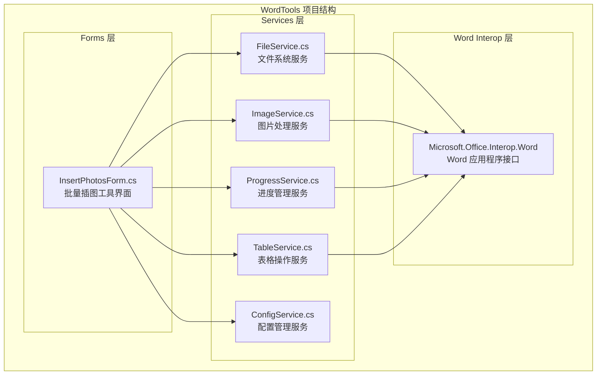
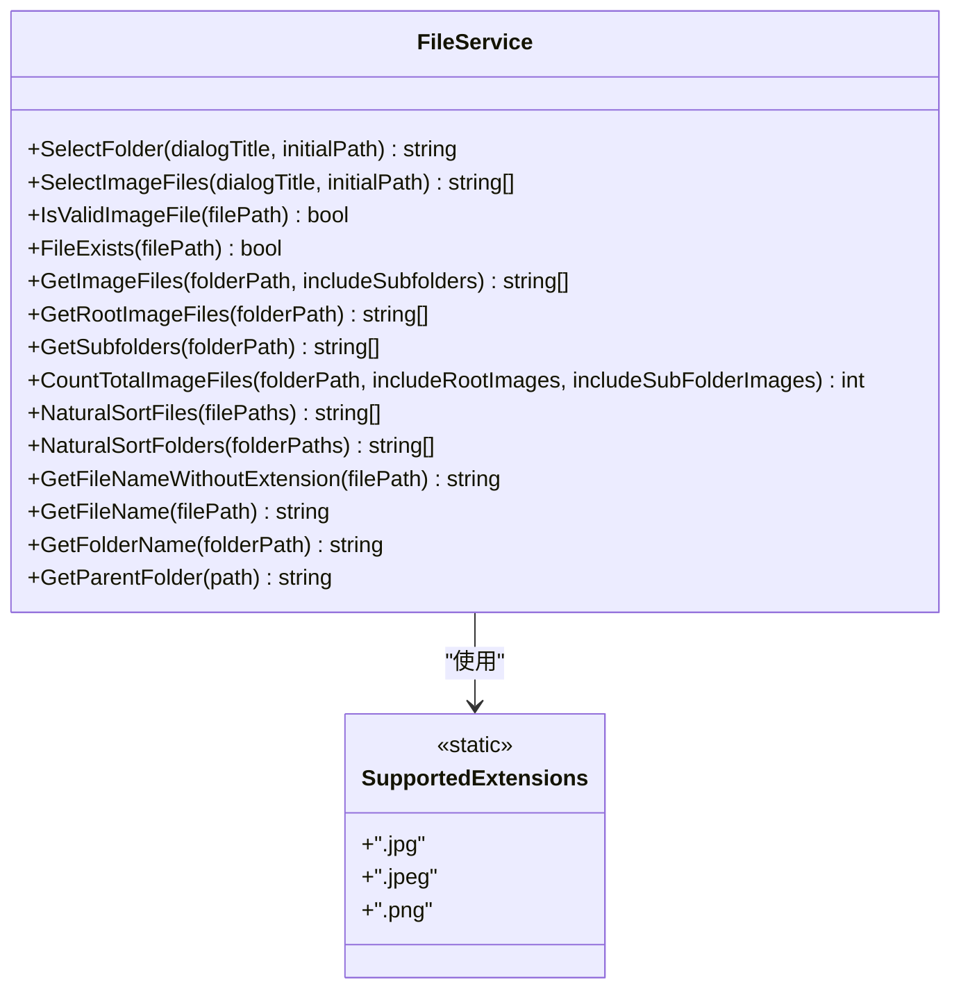
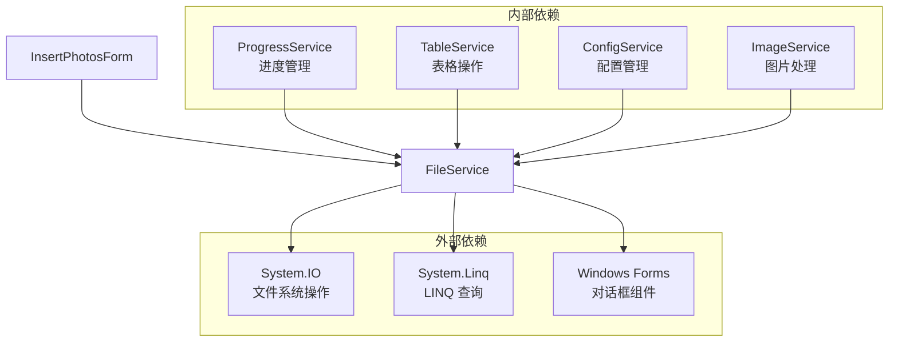

# FileService API

<cite>
**本文引用的文件**
- [FileService.cs](file://WordTools/Services/FileService.cs)
- [InsertPhotosForm.cs](file://WordTools/Forms/InsertPhotosForm.cs)
- [ConfigService.cs](file://WordTools/Services/ConfigService.cs)
- [ImageService.cs](file://WordTools/Services/ImageService.cs)
- [ProgressService.cs](file://WordTools/Services/ProgressService.cs)
- [TableService.cs](file://WordTools/Services/TableService.cs)
- [README.md](file://README.md)
</cite>

## 目录
1. [简介](#简介)
2. [项目结构](#项目结构)
3. [核心组件](#核心组件)
4. [架构概览](#架构概览)
5. [详细组件分析](#详细组件分析)
6. [依赖关系分析](#依赖关系分析)
7. [性能考虑](#性能考虑)
8. [故障排除指南](#故障排除指南)
9. [结论](#结论)
10. [附录](#附录)

## 简介

FileService 是 WordTools 项目中的核心文件系统操作服务类，专门负责处理图片文件的选择、验证、排序和目录遍历等操作。该服务为批量图片插入功能提供了基础的数据访问层，支持多种文件格式验证、自然排序算法和高效的目录扫描功能。

该项目是一个基于 COM 加载项的 Word 插件，通过 FileService 实现了强大的批量图片管理和插入功能，特别适用于需要处理大量图片文件的场景。

## 项目结构

WordTools 项目采用分层架构设计，主要包含以下核心模块：



**图表来源**
- [FileService.cs:1-310](file://WordTools/Services/FileService.cs#L1-L310)
- [InsertPhotosForm.cs:1-618](file://WordTools/Forms/InsertPhotosForm.cs#L1-L618)

**章节来源**
- [README.md:47-61](file://README.md#L47-L61)

## 核心组件

FileService 作为静态类，提供了以下核心功能模块：

### 主要功能模块

1. **文件夹选择功能** - 提供直观的文件夹选择对话框
2. **图片文件选择** - 支持多选图片文件的对话框
3. **文件验证功能** - 验证文件存在性和格式有效性
4. **文件列表获取** - 获取指定目录下的图片文件列表
5. **自然排序算法** - 实现类似资源管理器的智能排序
6. **辅助路径处理** - 提供文件名和路径信息提取功能

### 支持的文件格式

- JPEG/JPG 格式
- PNG 格式

这些格式的选择基于项目的具体需求，主要用于 Word 文档中的图片插入场景。

**章节来源**
- [FileService.cs:15-16](file://WordTools/Services/FileService.cs#L15-L16)
- [FileService.cs:89-95](file://WordTools/Services/FileService.cs#L89-L95)

## 架构概览

FileService 在整个系统架构中扮演着数据访问层的角色，为上层业务逻辑提供统一的文件系统操作接口：


**图表来源**
- [InsertPhotosForm.cs:509-523](file://WordTools/Forms/InsertPhotosForm.cs#L509-L523)
- [InsertPhotosForm.cs:570-613](file://WordTools/Forms/InsertPhotosForm.cs#L570-L613)
- [FileService.cs:26-45](file://WordTools/Services/FileService.cs#L26-L45)
- [FileService.cs:57-78](file://WordTools/Services/FileService.cs#L57-L78)

## 详细组件分析

### 文件夹选择功能

FileService 提供了简洁高效的文件夹选择功能，支持自定义对话框标题和初始路径设置：


**图表来源**
- [FileService.cs:26-45](file://WordTools/Services/FileService.cs#L26-L45)

### 图片文件选择功能

支持多选图片文件的对话框，内置文件类型过滤器：



**图表来源**
- [FileService.cs:13-308](file://WordTools/Services/FileService.cs#L13-L308)

### 文件验证机制

FileService 实现了双重验证机制：

1. **存在性验证** - 检查文件路径是否有效且文件存在
2. **格式验证** - 基于扩展名的格式验证


**图表来源**
- [FileService.cs:89-105](file://WordTools/Services/FileService.cs#L89-L105)

### 目录遍历和文件收集

FileService 提供了灵活的目录遍历功能，支持根目录和子目录的组合查询：


**图表来源**
- [FileService.cs:117-134](file://WordTools/Services/FileService.cs#L117-L134)

### 自然排序算法

FileService 实现了高级的自然排序算法，模拟 Windows 资源管理器的行为：


**图表来源**
- [FileService.cs:197-269](file://WordTools/Services/FileService.cs#L197-L269)

**章节来源**
- [FileService.cs:26-134](file://WordTools/Services/FileService.cs#L26-L134)
- [FileService.cs:197-269](file://WordTools/Services/FileService.cs#L197-L269)

## 依赖关系分析

FileService 与其他组件之间的依赖关系如下：



**图表来源**
- [FileService.cs:1-6](file://WordTools/Services/FileService.cs#L1-L6)
- [InsertPhotosForm.cs:1-12](file://WordTools/Forms/InsertPhotosForm.cs#L1-L12)

**章节来源**
- [FileService.cs:1-6](file://WordTools/Services/FileService.cs#L1-L6)
- [InsertPhotosForm.cs:1-12](file://WordTools/Forms/InsertPhotosForm.cs#L1-L12)

## 性能考虑

FileService 在设计时充分考虑了性能优化，特别是在处理大量文件时的表现：

### 性能优化策略

1. **延迟加载和按需搜索**
   - 支持仅搜索根目录或递归搜索子目录
   - 避免不必要的文件系统访问

2. **高效的文件过滤**
   - 使用扩展名预过滤减少文件系统调用
   - 避免重复的文件存在性检查

3. **内存优化**
   - 使用迭代器模式处理大型文件列表
   - 及时释放临时对象和集合

4. **自然排序优化**
   - 预分配数组容量
   - 避免不必要的字符串操作

### 大文件处理建议

对于超大目录结构，建议：
- 优先使用根目录搜索而非递归搜索
- 实施分批处理策略
- 考虑使用异步操作避免界面冻结

**章节来源**
- [FileService.cs:117-134](file://WordTools/Services/FileService.cs#L117-L134)
- [FileService.cs:197-269](file://WordTools/Services/FileService.cs#L197-L269)

## 故障排除指南

### 常见问题和解决方案

1. **文件路径无效**
   - 确保传入的路径存在且可访问
   - 检查路径中是否包含非法字符

2. **文件格式验证失败**
   - 确认文件扩展名符合支持列表
   - 检查文件是否被其他进程占用

3. **目录遍历性能问题**
   - 避免在包含大量子目录的根目录中使用递归搜索
   - 考虑实施文件数量上限

4. **自然排序异常**
   - 确保文件名中包含有效的数字序列
   - 检查文件名编码格式

### 错误处理机制

FileService 采用了健壮的错误处理策略：

- **空值检查** - 所有公共方法都检查输入参数的有效性
- **异常捕获** - 在关键操作中使用 try-catch 包装
- **降级处理** - 当部分操作失败时，系统会优雅降级
- **资源清理** - 使用 using 语句确保资源正确释放

**章节来源**
- [FileService.cs:89-105](file://WordTools/Services/FileService.cs#L89-L105)
- [FileService.cs:117-134](file://WordTools/Services/FileService.cs#L117-L134)

## 结论

FileService 作为 WordTools 项目的核心文件系统服务，展现了优秀的架构设计和实现质量。其主要特点包括：

1. **功能完整性** - 提供了从文件选择到自然排序的完整文件操作链
2. **性能优化** - 通过多种策略优化了大文件处理能力
3. **易用性** - 简洁的 API 设计和清晰的方法命名
4. **可靠性** - 完善的错误处理和边界情况处理

该服务为 WordTools 的批量图片插入功能奠定了坚实的基础，能够高效处理各种复杂的文件管理场景。

## 附录

### API 方法参考

#### 文件夹操作
- `SelectFolder(string dialogTitle, string initialPath)` - 选择文件夹
- `GetSubfolders(string folderPath)` - 获取子文件夹列表
- `GetFolderName(string folderPath)` - 获取文件夹名称
- `GetParentFolder(string path)` - 获取父文件夹路径

#### 文件操作
- `SelectImageFiles(string dialogTitle, string initialPath)` - 选择图片文件
- `GetImageFiles(string folderPath, bool includeSubfolders)` - 获取图片文件列表
- `GetRootImageFiles(string folderPath)` - 获取根目录图片文件
- `CountTotalImageFiles(string folderPath, bool includeRootImages, bool includeSubFolderImages)` - 统计图片总数

#### 验证功能
- `IsValidImageFile(string filePath)` - 验证图片文件
- `FileExists(string filePath)` - 检查文件存在性

#### 排序功能
- `NaturalSortFiles(string[] filePaths)` - 文件自然排序
- `NaturalSortFolders(string[] folderPaths)` - 文件夹自然排序

#### 辅助功能
- `GetFileNameWithoutExtension(string filePath)` - 获取文件名（无扩展名）
- `GetFileName(string filePath)` - 获取文件名（含扩展名）

### 使用示例

#### 基本文件夹选择
```csharp
// 选择图片文件夹
string folderPath = FileService.SelectFolder("选择图片文件夹", @"C:\Images");
if (!string.IsNullOrEmpty(folderPath))
{
    // 获取该文件夹下的所有图片文件
    string[] imageFiles = FileService.GetImageFiles(folderPath);
    
    // 处理每个图片文件
    foreach (string file in imageFiles)
    {
        // 验证文件格式
        if (FileService.IsValidImageFile(file))
        {
            // 处理图片文件
        }
    }
}
```

#### 大型目录处理
```csharp
// 处理包含大量子目录的大型目录
string largeFolder = @"\\network\large\image\collection";
string[] images = FileService.GetImageFiles(largeFolder, false);

// 实施分批处理
const int BATCH_SIZE = 1000;
for (int i = 0; i < images.Length; i += BATCH_SIZE)
{
    int endIndex = Math.Min(i + BATCH_SIZE, images.Length);
    var batch = images.Skip(i).Take(endIndex - i).ToArray();
    
    // 处理当前批次
    ProcessImageBatch(batch);
}
```

#### 自然排序应用
```csharp
// 获取并排序图片文件
string[] unsortedFiles = FileService.GetImageFiles(@"C:\Photos");
string[] sortedFiles = FileService.NaturalSortFiles(unsortedFiles);

// 输出排序结果
foreach (string file in sortedFiles)
{
    Console.WriteLine(Path.GetFileName(file));
}
```