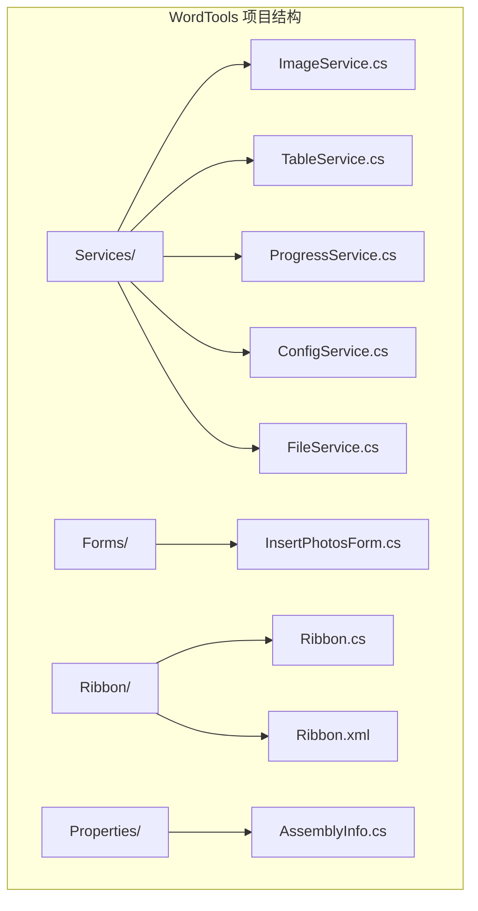
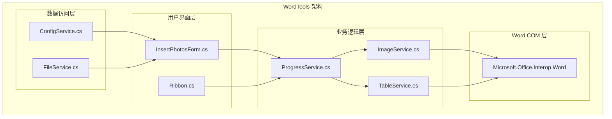
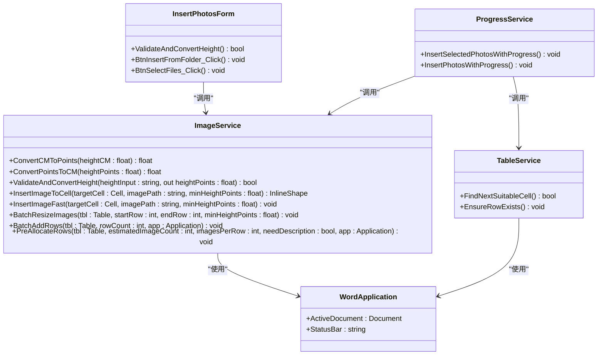

# ImageService API 文档

<cite>
**本文档引用的文件**
- [ImageService.cs](file://WordTools/Services/ImageService.cs)
- [InsertPhotosForm.cs](file://WordTools/Forms/InsertPhotosForm.cs)
- [ProgressService.cs](file://WordTools/Services/ProgressService.cs)
- [README.md](file://README.md)
</cite>

## 目录
1. [简介](#简介)
2. [项目结构](#项目结构)
3. [核心组件](#核心组件)
4. [架构概览](#架构概览)
5. [详细组件分析](#详细组件分析)
6. [依赖关系分析](#依赖关系分析)
7. [性能考虑](#性能考虑)
8. [故障排除指南](#故障排除指南)
9. [结论](#结论)

## 简介

ImageService 是 WordTools 项目中的核心图片处理服务类，专门负责在 Microsoft Word 表格中进行图片的插入、尺寸调整和批量操作。该服务提供了完整的厘米与磅单位转换、图片尺寸智能调整算法以及内存优化策略，是批量图片插入功能的核心组件。

## 项目结构

WordTools 项目采用模块化设计，ImageService 位于 Services 目录下，与其他服务组件协同工作：



**图表来源**
- [README.md:47-60](file://README.md#L47-L60)

**章节来源**
- [README.md:1-85](file://README.md#L1-L85)

## 核心组件

ImageService 作为静态类提供以下核心功能模块：

### 主要功能模块
1. **尺寸转换模块** - 处理厘米与磅的双向转换
2. **图片插入模块** - 支持标准插入和快速插入两种模式
3. **批量操作模块** - 提供批量图片调整和表格预分配功能

### 核心常量
- `CM_TO_POINTS`: 28.35f - 厘米到磅的转换系数
- `BATCH_SIZE`: 100 - 批量操作的批次大小
- `MAX_PREALLOCATE_ROWS`: 1000 - 预分配的最大行数限制

**章节来源**
- [ImageService.cs:10-325](file://WordTools/Services/ImageService.cs#L10-L325)

## 架构概览

ImageService 在整个 WordTools 架构中扮演着关键的数据处理层角色：



**图表来源**
- [InsertPhotosForm.cs:1-618](file://WordTools/Forms/InsertPhotosForm.cs#L1-L618)
- [ProgressService.cs:282-571](file://WordTools/Services/ProgressService.cs#L282-L571)

## 详细组件分析

### 尺寸转换方法

#### ConvertCMToPoints 方法
将厘米单位转换为 Word 的磅单位。

**方法签名**: `public static float ConvertCMToPoints(float heightCM)`

**参数**:
- `heightCM`: float - 输入的高度值（厘米）

**返回值**:
- `float` - 转换后的高度值（磅）

**使用示例**:
```csharp
// 将 5 厘米转换为磅
float points = ImageService.ConvertCMToPoints(5f);
// 结果约为 141.75 磅
```

**性能特点**:
- 时间复杂度: O(1)
- 空间复杂度: O(1)
- 无异常处理需求

**章节来源**
- [ImageService.cs:22-25](file://WordTools/Services/ImageService.cs#L22-L25)

#### ConvertPointsToCM 方法
将磅单位转换为厘米。

**方法签名**: `public static float ConvertPointsToCM(float heightPoints)`

**参数**:
- `heightPoints`: float - 输入的高度值（磅）

**返回值**:
- `float` - 转换后的高度值（厘米）

**使用示例**:
```csharp
// 将 141.75 磅转换为厘米
float cm = ImageService.ConvertPointsToCM(141.75f);
// 结果约为 5 厘米
```

**性能特点**:
- 时间复杂度: O(1)
- 空间复杂度: O(1)

**章节来源**
- [ImageService.cs:32-35](file://WordTools/Services/ImageService.cs#L32-L35)

#### ValidateAndConvertHeight 方法
验证并转换用户输入的高度值。

**方法签名**: `public static bool ValidateAndConvertHeight(string heightInput, out float heightPoints)`

**参数**:
- `heightInput`: string - 用户输入的高度字符串（厘米）
- `heightPoints`: out float - 转换后的高度值（磅）

**返回值**:
- `bool` - 验证结果，true 表示输入有效

**异常处理**:
- 空输入被视为有效（不设置最小高度限制）
- 非法数值格式返回 false
- 非正值返回 false

**使用示例**:
```csharp
float minHeight;
bool isValid = ImageService.ValidateAndConvertHeight("5", out minHeight);
// isValid = true, minHeight ≈ 141.75
```

**性能特点**:
- 时间复杂度: O(1)
- 空间复杂度: O(1)
- 包含字符串解析和数值验证

**章节来源**
- [ImageService.cs:43-60](file://WordTools/Services/ImageService.cs#L43-L60)

### 图片插入方法

#### InsertImageToCell 方法
标准图片插入方法，提供完整的尺寸调整和约束检查。

**方法签名**: `public static InlineShape InsertImageToCell(Cell targetCell, string imagePath, float minHeightPoints = -1)`

**参数**:
- `targetCell`: Cell - 目标单元格对象
- `imagePath`: string - 图片文件路径
- `minHeightPoints`: float - 最小高度限制（磅），-1 表示不限制

**返回值**:
- `InlineShape` - 插入的图片对象，失败时返回 null

**异常处理**:
- 返回 null 而非抛出异常
- 内部 try-catch 包装，确保方法稳定性

**尺寸调整算法**:
1. 获取单元格尺寸并减去 6 磅边距
2. 计算基于宽度的缩放比例
3. 根据高度限制调整缩放比例
4. 应用最终缩放比例
5. 应用最小高度限制

**使用示例**:
```csharp
// 插入图片并设置最小高度
InlineShape image = ImageService.InsertImageToCell(
    targetCell, 
    @"C:\Images\photo.jpg", 
    100f  // 最小高度 100 磅
);
```

**性能特点**:
- 时间复杂度: O(1)
- 空间复杂度: O(1)
- 包含完整的尺寸计算和约束检查

**章节来源**
- [ImageService.cs:73-134](file://WordTools/Services/ImageService.cs#L73-L134)

#### InsertImageFast 方法
快速图片插入方法，专注于内存效率和性能优化。

**方法签名**: `public static void InsertImageFast(Cell targetCell, string imagePath, float minHeightPoints = -1)`

**参数**:
- `targetCell`: Cell - 目标单元格对象
- `imagePath`: string - 图片文件路径
- `minHeightPoints`: float - 最小高度限制（磅），-1 表示不限制

**返回值**:
- `void` - 无返回值

**异常处理**:
- 静默失败，忽略所有异常
- 适用于批量操作场景

**优化策略**:
1. 直接清空单元格内容而非逐个删除
2. 仅检查宽度限制，避免复杂的尺寸计算
3. 最小化对象创建和内存分配

**使用示例**:
```csharp
// 快速插入大量图片
ImageService.InsertImageFast(targetCell, @"C:\Images\photo.jpg");
```

**性能特点**:
- 时间复杂度: O(1)
- 空间复杂度: O(1)
- 最大化内存使用效率

**章节来源**
- [ImageService.cs:142-180](file://WordTools/Services/ImageService.cs#L142-L180)

### 批量操作方法

#### BatchResizeImages 方法
批量调整表格中已插入图片的尺寸。

**方法签名**: `public static void BatchResizeImages(Table tbl, int startRow, int endRow, float minHeightPoints = -1)`

**参数**:
- `tbl`: Table - 目标表格对象
- `startRow`: int - 开始行索引
- `endRow`: int - 结束行索引
- `minHeightPoints`: float - 最小高度限制（磅）

**返回值**:
- `void` - 无返回值

**异常处理**:
- 外层 try-catch 包装整个批量操作
- 单元格级别的异常被内部捕获并忽略

**处理流程**:
1. 遍历指定范围内的所有单元格
2. 检查每个单元格是否包含图片
3. 对每个图片应用宽度限制
4. 应用最小高度限制

**使用示例**:
```csharp
// 批量调整第 1 到 10 行的图片尺寸
ImageService.BatchResizeImages(table, 1, 10, 50f);
```

**性能特点**:
- 时间复杂度: O(n*m*k)，其中 n 为行数，m 为列数，k 为每单元格图片数量
- 空间复杂度: O(1)
- 包含三层嵌套循环的优化

**章节来源**
- [ImageService.cs:193-239](file://WordTools/Services/ImageService.cs#L193-L239)

#### BatchAddRows 方法
批量添加表格行，支持进度状态更新。

**方法签名**: `public static void BatchAddRows(Table tbl, int rowCount, Application app = null)`

**参数**:
- `tbl`: Table - 目标表格对象
- `rowCount`: int - 要添加的行数
- `app`: Application - Word 应用程序对象，用于更新状态栏

**返回值**:
- `void` - 无返回值

**优化策略**:
1. 批次处理：每 100 行更新一次状态栏
2. 异步事件处理：调用 `Application.DoEvents()` 处理 UI 更新
3. 进度反馈：实时更新状态栏显示处理进度

**使用示例**:
```csharp
// 批量添加 500 行并显示进度
ImageService.BatchAddRows(table, 500, wordApp);
```

**性能特点**:
- 时间复杂度: O(n)
- 空间复杂度: O(1)
- 包含 UI 线程同步机制

**章节来源**
- [ImageService.cs:247-277](file://WordTools/Services/ImageService.cs#L247-L277)

#### PreAllocateRows 方法
预分配表格行数，优化批量插入性能。

**方法签名**: `public static void PreAllocateRows(Table tbl, int estimatedImageCount, int imagesPerRow = 2, bool needDescription = false, Application app = null)`

**参数**:
- `tbl`: Table - 目标表格对象
- `estimatedImageCount`: int - 预计图片数量
- `imagesPerRow`: int - 每行图片数量，默认 2
- `needDescription`: bool - 是否需要描述行
- `app`: Application - Word 应用程序对象

**返回值**:
- `void` - 无返回值

**算法逻辑**:
1. 计算所需行数：`(estimatedImageCount + imagesPerRow - 1) / imagesPerRow`
2. 如果需要描述行，行数翻倍
3. 限制最大预分配行数为 1000
4. 调用 `BatchAddRows` 执行预分配

**使用示例**:
```csharp
// 预分配足够空间给 100 张图片，每行 2 张，需要描述行
ImageService.PreAllocateRows(table, 100, 2, true, wordApp);
```

**性能特点**:
- 时间复杂度: O(1)
- 空间复杂度: O(1)
- 预计算优化，避免动态扩容

**章节来源**
- [ImageService.cs:287-320](file://WordTools/Services/ImageService.cs#L287-L320)

## 依赖关系分析

ImageService 与其他组件的依赖关系如下：



**图表来源**
- [ImageService.cs:10-325](file://WordTools/Services/ImageService.cs#L10-L325)
- [InsertPhotosForm.cs:525-613](file://WordTools/Forms/InsertPhotosForm.cs#L525-L613)
- [ProgressService.cs:315-533](file://WordTools/Services/ProgressService.cs#L315-L533)

**章节来源**
- [ImageService.cs:10-325](file://WordTools/Services/ImageService.cs#L10-L325)

## 性能考虑

### 内存优化策略

1. **快速插入模式**: `InsertImageFast` 方法通过简化尺寸计算和直接清空单元格来最大化内存效率
2. **批量预分配**: `PreAllocateRows` 方法避免频繁的表格扩容操作
3. **批次处理**: `BatchAddRows` 方法每 100 行更新一次状态栏，平衡性能和用户体验
4. **异常隔离**: 所有公共方法都包含 try-catch 包装，防止单个操作影响整体性能

### 算法复杂度分析

- **尺寸转换**: O(1) 时间复杂度，O(1) 空间复杂度
- **标准图片插入**: O(1) 时间复杂度，包含完整的尺寸计算
- **快速图片插入**: O(1) 时间复杂度，最小化计算开销
- **批量尺寸调整**: O(n*m*k) 时间复杂度，n 行数，m 列数，k 平均每单元格图片数

### 最佳实践建议

1. **大批量操作优先使用快速插入**: 当处理大量图片时，使用 `InsertImageFast` 获得最佳性能
2. **预分配表格空间**: 在批量插入前调用 `PreAllocateRows` 预分配足够的行数
3. **合理设置最小高度**: 使用 `ValidateAndConvertHeight` 验证用户输入，确保合理的高度限制
4. **分批处理大数据集**: 对于超过 1000 张图片的批量操作，考虑分批处理以避免内存峰值

## 故障排除指南

### 常见问题及解决方案

#### 图片无法插入
**可能原因**:
- 目标单元格为 null
- 图片路径为空或无效
- Word COM 对象访问权限不足

**解决方法**:
```csharp
// 检查参数有效性
if (targetCell == null || string.IsNullOrEmpty(imagePath))
{
    throw new ArgumentException("目标单元格或图片路径无效");
}

// 验证文件存在性
if (!File.Exists(imagePath))
{
    throw new FileNotFoundException("图片文件不存在", imagePath);
}
```

#### 尺寸调整异常
**可能原因**:
- 单元格尺寸计算错误
- 图片对象属性访问失败

**解决方法**:
```csharp
try
{
    // 使用标准插入方法获取返回的图片对象
    InlineShape image = ImageService.InsertImageToCell(cell, path, minHeight);
    
    if (image == null)
    {
        // 处理插入失败的情况
        LogError($"图片插入失败: {path}");
    }
}
catch (Exception ex)
{
    LogError($"图片处理异常: {ex.Message}");
}
```

#### 内存使用过高
**解决方法**:
1. 使用 `InsertImageFast` 替代 `InsertImageToCell` 进行大批量操作
2. 实施定期内存清理机制
3. 分批处理大数据集

**章节来源**
- [ImageService.cs:75-76](file://WordTools/Services/ImageService.cs#L75-L76)
- [ImageService.cs:144-145](file://WordTools/Services/ImageService.cs#L144-L145)

## 结论

ImageService 提供了完整的 Word 表格图片处理解决方案，具有以下优势：

1. **功能完整性**: 覆盖从尺寸转换到批量操作的完整流程
2. **性能优化**: 提供快速插入模式和内存优化策略
3. **易用性**: 简洁的 API 设计和完善的错误处理
4. **扩展性**: 模块化的架构便于功能扩展

该服务在 WordTools 项目中发挥着核心作用，为用户提供高效、稳定的批量图片插入体验。通过合理的参数配置和最佳实践，可以充分发挥其性能优势，满足各种规模的图片处理需求。