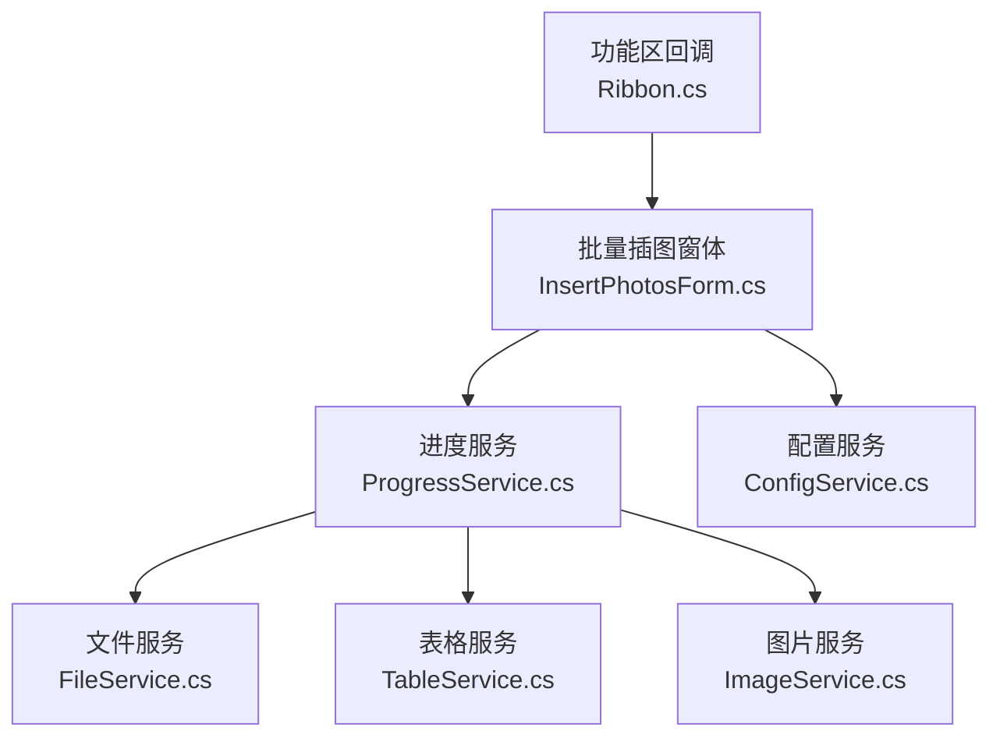
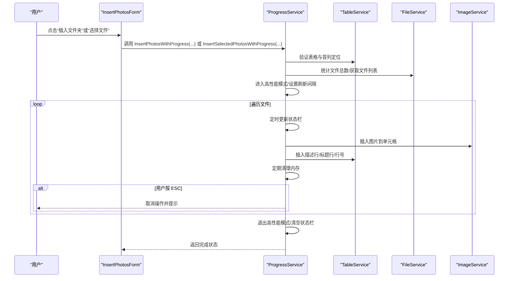
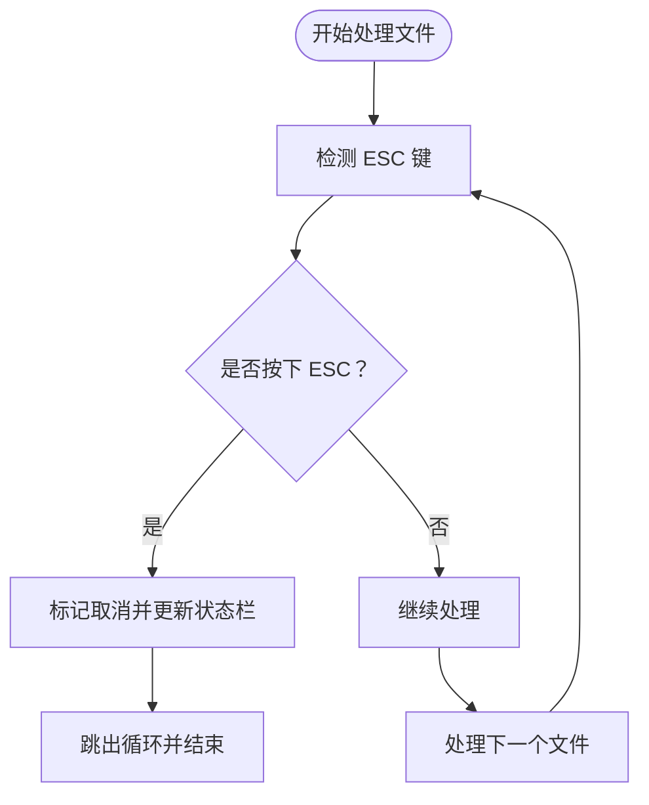
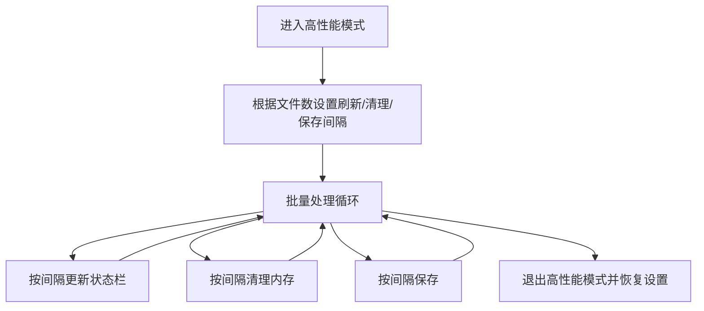
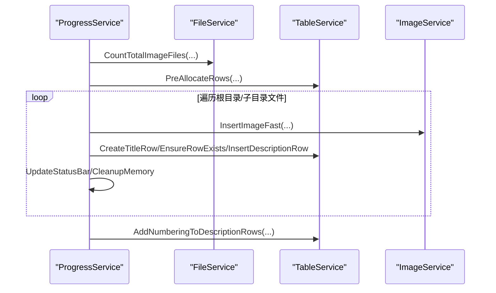
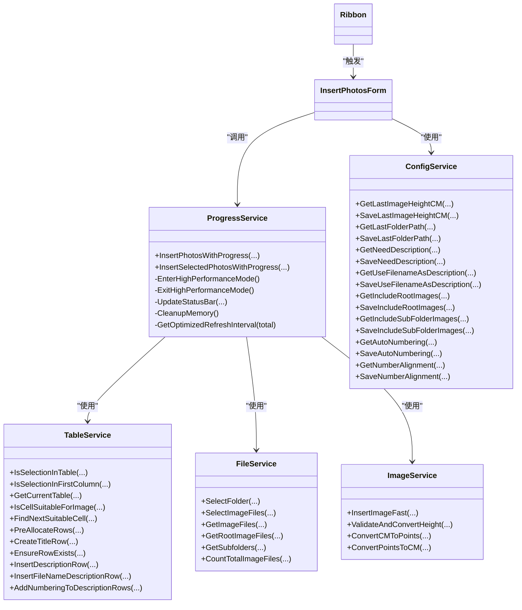

# ProgressService API

<cite>
**本文引用的文件**
- [ProgressService.cs](file://WordTools/Services/ProgressService.cs)
- [InsertPhotosForm.cs](file://WordTools/Forms/InsertPhotosForm.cs)
- [TableService.cs](file://WordTools/Services/TableService.cs)
- [FileService.cs](file://WordTools/Services/FileService.cs)
- [ImageService.cs](file://WordTools/Services/ImageService.cs)
- [ConfigService.cs](file://WordTools/Services/ConfigService.cs)
- [Ribbon.cs](file://WordTools/Ribbon.cs)
- [README.md](file://README.md)
</cite>

## 目录
1. [简介](#简介)
2. [项目结构](#项目结构)
3. [核心组件](#核心组件)
4. [架构概览](#架构概览)
5. [详细组件分析](#详细组件分析)
6. [依赖关系分析](#依赖关系分析)
7. [性能考量](#性能考量)
8. [故障排查指南](#故障排查指南)
9. [结论](#结论)
10. [附录](#附录)

## 简介
ProgressService 是 Word 工具箱插件中的进度控制与性能监控核心服务类，负责：
- 批量图片插入过程中的进度更新与状态报告
- 用户交互（如 ESC 取消）与长时操作优化
- 性能统计与内存管理策略
- 在复杂批量操作中提供精确的进度跟踪与用户体验优化

该服务通过状态栏实时反馈、定时刷新、内存回收与 Word 性能模式切换，确保在大量图片插入场景下的稳定性与流畅性。

## 项目结构
- 插件采用 COM 加载项架构，功能区按钮触发批量图片插入流程
- 进度服务位于 Services 目录，配合文件、表格、图片与配置服务协同工作
- 窗体层负责收集用户输入并调用进度服务执行批量操作

图表来源
- [Ribbon.cs:1-196](file://WordTools/Ribbon.cs#L1-L196)
- [InsertPhotosForm.cs:1-618](file://WordTools/Forms/InsertPhotosForm.cs#L1-L618)
- [ProgressService.cs:1-571](file://WordTools/Services/ProgressService.cs#L1-L571)
- [FileService.cs:1-310](file://WordTools/Services/FileService.cs#L1-L310)
- [TableService.cs:1-756](file://WordTools/Services/TableService.cs#L1-L756)
- [ImageService.cs:1-325](file://WordTools/Services/ImageService.cs#L1-L325)
- [ConfigService.cs:1-362](file://WordTools/Services/ConfigService.cs#L1-L362)

章节来源
- [README.md:1-85](file://README.md#L1-L85)

## 核心组件
- 进度服务 ProgressService：提供批量图片插入的进度控制、状态栏更新、取消机制与性能优化
- 文件服务 FileService：提供文件夹选择、图片文件筛选与统计
- 表格服务 TableService：提供表格验证、单元格适配、标题行与描述行插入
- 图片服务 ImageService：提供图片插入、尺寸转换与快速插入
- 配置服务 ConfigService：提供文档级与注册表级配置读写
- 窗体 InsertPhotosForm：收集用户输入并调用进度服务执行批量操作

章节来源
- [ProgressService.cs:14-36](file://WordTools/Services/ProgressService.cs#L14-L36)
- [FileService.cs:13-200](file://WordTools/Services/FileService.cs#L13-L200)
- [TableService.cs:11-200](file://WordTools/Services/TableService.cs#L11-L200)
- [ImageService.cs:10-200](file://WordTools/Services/ImageService.cs#L10-L200)
- [ConfigService.cs:11-362](file://WordTools/Services/ConfigService.cs#L11-L362)
- [InsertPhotosForm.cs:18-618](file://WordTools/Forms/InsertPhotosForm.cs#L18-L618)

## 架构概览
ProgressService 的工作流分为两大入口：
- 从文件夹批量插入：统计文件总数、进入高性能模式、预分配行数、分批处理、定期更新状态栏与内存回收
- 从选中文件批量插入：与上述流程一致，但直接使用传入的文件数组

图表来源
- [InsertPhotosForm.cs:525-613](file://WordTools/Forms/InsertPhotosForm.cs#L525-L613)
- [ProgressService.cs:148-306](file://WordTools/Services/ProgressService.cs#L148-L306)
- [ProgressService.cs:312-403](file://WordTools/Services/ProgressService.cs#L312-L403)
- [ProgressService.cs:409-533](file://WordTools/Services/ProgressService.cs#L409-L533)

## 详细组件分析

### 进度服务 API 概览
- 构造函数
  - 参数：Application（Word 应用实例）
  - 作用：持有应用实例以进行状态栏更新与性能模式切换
- 公共方法
  - InsertPhotosWithProgress：从文件夹批量插入图片（带进度）
  - InsertSelectedPhotosWithProgress：从选中文件批量插入图片（带进度）

章节来源
- [ProgressService.cs:33-36](file://WordTools/Services/ProgressService.cs#L33-L36)
- [ProgressService.cs:148-306](file://WordTools/Services/ProgressService.cs#L148-L306)
- [ProgressService.cs:312-403](file://WordTools/Services/ProgressService.cs#L312-L403)

### 取消机制
- ESC 键检测：通过 Windows API 检测 ESC 是否被按下
- ShouldCancel：若已标记取消或检测到 ESC，则标记取消并更新状态栏
- 在每个文件处理循环中检查取消标志，及时中断

图表来源
- [ProgressService.cs:40-64](file://WordTools/Services/ProgressService.cs#L40-L64)

章节来源
- [ProgressService.cs:40-64](file://WordTools/Services/ProgressService.cs#L40-L64)

### 性能优化与内存管理
- 高性能模式
  - 关闭屏幕更新与显示警告，减少 UI 刷新开销
  - 备份原始设置以便退出时恢复
- 刷新间隔自适应
  - 根据文件总数动态设置刷新间隔，平衡 UI 响应与 CPU 开销
- 内存清理
  - 定期触发 Application.DoEvents 与 GC.Collect，降低内存峰值
- 保存间隔
  - 定期保存中间结果，避免长时间操作导致的内存压力

图表来源
- [ProgressService.cs:73-112](file://WordTools/Services/ProgressService.cs#L73-L112)
- [ProgressService.cs:117-125](file://WordTools/Services/ProgressService.cs#L117-L125)
- [ProgressService.cs:130-142](file://WordTools/Services/ProgressService.cs#L130-L142)
- [ProgressService.cs:208-210](file://WordTools/Services/ProgressService.cs#L208-L210)

章节来源
- [ProgressService.cs:73-112](file://WordTools/Services/ProgressService.cs#L73-L112)
- [ProgressService.cs:117-125](file://WordTools/Services/ProgressService.cs#L117-L125)
- [ProgressService.cs:130-142](file://WordTools/Services/ProgressService.cs#L130-L142)
- [ProgressService.cs:208-210](file://WordTools/Services/ProgressService.cs#L208-L210)

### 状态栏更新与进度计算
- 百分比：当前进度占总进度的比例
- 已用时间：从开始到现在的时间
- 剩余时间：基于已用时间与当前进度估算剩余秒数
- 当前文件名：截断显示，避免状态栏过长

图表来源
- [ProgressService.cs:542-566](file://WordTools/Services/ProgressService.cs#L542-L566)

章节来源
- [ProgressService.cs:542-566](file://WordTools/Services/ProgressService.cs#L542-L566)

### 批量插入流程（文件夹）
- 表格验证与定位：确保选中区域在表格首列
- 预分配行数：根据文件总数提前创建表格行，减少动态扩展开销
- 分批处理：按文件数组逐个处理，插入图片并维护行列索引
- 描述行与标题行：按需插入标题行与描述行
- 自动编号：完成后对描述行进行编号

图表来源
- [ProgressService.cs:194-216](file://WordTools/Services/ProgressService.cs#L194-L216)
- [ProgressService.cs:224-259](file://WordTools/Services/ProgressService.cs#L224-L259)
- [ProgressService.cs:409-533](file://WordTools/Services/ProgressService.cs#L409-L533)

章节来源
- [ProgressService.cs:194-216](file://WordTools/Services/ProgressService.cs#L194-L216)
- [ProgressService.cs:224-259](file://WordTools/Services/ProgressService.cs#L224-L259)
- [ProgressService.cs:409-533](file://WordTools/Services/ProgressService.cs#L409-L533)

### 批量插入流程（选中文件）
- 与文件夹流程基本一致，但直接使用传入的文件数组
- 无需统计总数，直接按数组长度设置刷新间隔

章节来源
- [ProgressService.cs:312-403](file://WordTools/Services/ProgressService.cs#L312-L403)

### 用户交互与最佳实践
- 输入校验：窗体层对高度输入进行校验，避免无效参数
- 配置持久化：使用配置服务保存用户偏好，提升复用体验
- 取消提示：在取消时给出明确提示，避免用户困惑
- 错误处理：捕获异常并提示，保证流程可控

章节来源
- [InsertPhotosForm.cs:537-543](file://WordTools/Forms/InsertPhotosForm.cs#L537-L543)
- [InsertPhotosForm.cs:585-591](file://WordTools/Forms/InsertPhotosForm.cs#L585-L591)
- [ConfigService.cs:149-178](file://WordTools/Services/ConfigService.cs#L149-L178)

## 依赖关系分析
- ProgressService 依赖：
  - TableService：表格验证、单元格适配、标题行与描述行插入
  - FileService：文件统计与列表获取
  - ImageService：图片插入与尺寸控制
  - ConfigService：配置读写（由窗体层调用）
  - Ribbon：功能区回调（触发窗体）

图表来源
- [ProgressService.cs:14-571](file://WordTools/Services/ProgressService.cs#L14-L571)
- [TableService.cs:11-756](file://WordTools/Services/TableService.cs#L11-L756)
- [FileService.cs:13-310](file://WordTools/Services/FileService.cs#L13-L310)
- [ImageService.cs:10-325](file://WordTools/Services/ImageService.cs#L10-L325)
- [ConfigService.cs:11-362](file://WordTools/Services/ConfigService.cs#L11-L362)
- [InsertPhotosForm.cs:18-618](file://WordTools/Forms/InsertPhotosForm.cs#L18-L618)
- [Ribbon.cs:1-196](file://WordTools/Ribbon.cs#L1-L196)

## 性能考量
- 刷新频率自适应：根据文件总数动态调整刷新间隔，避免频繁 UI 更新造成卡顿
- 内存回收策略：定期触发 Application.DoEvents 与 GC.Collect，降低内存峰值
- Word 性能模式：关闭屏幕更新与显示警告，减少 UI 刷新与弹窗开销
- 批处理优化：预分配行数、按需插入描述行与标题行，减少动态扩展次数
- 时间估算：基于已用时间与当前进度估算剩余时间，提供更准确的进度反馈

章节来源
- [ProgressService.cs:117-125](file://WordTools/Services/ProgressService.cs#L117-L125)
- [ProgressService.cs:130-142](file://WordTools/Services/ProgressService.cs#L130-L142)
- [ProgressService.cs:73-112](file://WordTools/Services/ProgressService.cs#L73-L112)
- [ProgressService.cs:542-566](file://WordTools/Services/ProgressService.cs#L542-L566)

## 故障排查指南
- 进度不更新
  - 检查刷新间隔设置与文件总数，确认是否达到刷新阈值
  - 确认状态栏权限与 Word 设置未被其他插件覆盖
- 内存占用过高
  - 确认已启用内存清理间隔，并适当缩短刷新间隔
  - 检查是否有异常导致循环中断，从而未触发清理
- 插入失败
  - 检查图片路径有效性与文件格式
  - 确认目标单元格是否为空或已被编号占用
- 取消无效
  - 确认 ESC 键未被系统或其他软件拦截
  - 检查循环中是否正确调用 ShouldCancel

章节来源
- [ProgressService.cs:409-533](file://WordTools/Services/ProgressService.cs#L409-L533)
- [TableService.cs:45-123](file://WordTools/Services/TableService.cs#L45-L123)
- [ImageService.cs:142-180](file://WordTools/Services/ImageService.cs#L142-L180)

## 结论
ProgressService 提供了完整的批量图片插入进度控制与性能优化能力，结合文件、表格、图片与配置服务，实现了在复杂批量操作中的精确进度跟踪与良好的用户体验。通过自适应刷新、内存回收与 Word 性能模式切换，确保在大量图片处理场景下的稳定与高效。

## 附录

### API 方法参考

- InsertPhotosWithProgress(folderPath, minHeight, needDescription, useFileNameAsDescription, includeRootImages, includeSubFolderImages, needAutoNumbering, numberAlignment)
  - 功能：从文件夹批量插入图片，支持根目录与子目录扫描、描述行与自动编号
  - 参数：
    - folderPath：文件夹路径
    - minHeight：最小高度（厘米），-1 表示不限制
    - needDescription：是否插入描述行
    - useFileNameAsDescription：是否使用文件名作为描述
    - includeRootImages：是否包含根目录图片
    - includeSubFolderImages：是否包含子目录图片
    - needAutoNumbering：是否启用自动编号
    - numberAlignment：编号对齐方式（1=靠左，2=居中）
  - 返回：无
  - 异常：捕获并提示错误信息

- InsertSelectedPhotosWithProgress(files, minHeight, needDescription, useFileNameAsDescription, needAutoNumbering, numberAlignment)
  - 功能：从选中文件批量插入图片
  - 参数：
    - files：文件路径数组
    - minHeight：最小高度（厘米），-1 表示不限制
    - needDescription：是否插入描述行
    - useFileNameAsDescription：是否使用文件名作为描述
    - needAutoNumbering：是否启用自动编号
    - numberAlignment：编号对齐方式（1=靠左，2=居中）
  - 返回：无
  - 异常：捕获并提示错误信息

章节来源
- [ProgressService.cs:148-306](file://WordTools/Services/ProgressService.cs#L148-L306)
- [ProgressService.cs:312-403](file://WordTools/Services/ProgressService.cs#L312-L403)

### 实际使用示例（路径）
- 从文件夹批量插入图片
  - 触发入口：窗体按钮事件
  - 调用路径：[InsertPhotosForm.cs:557-561](file://WordTools/Forms/InsertPhotosForm.cs#L557-L561)
  - 进度服务入口：[ProgressService.cs:148-306](file://WordTools/Services/ProgressService.cs#L148-L306)

- 从选中文件批量插入图片
  - 触发入口：窗体按钮事件
  - 调用路径：[InsertPhotosForm.cs:603-606](file://WordTools/Forms/InsertPhotosForm.cs#L603-L606)
  - 进度服务入口：[ProgressService.cs:312-403](file://WordTools/Services/ProgressService.cs#L312-L403)