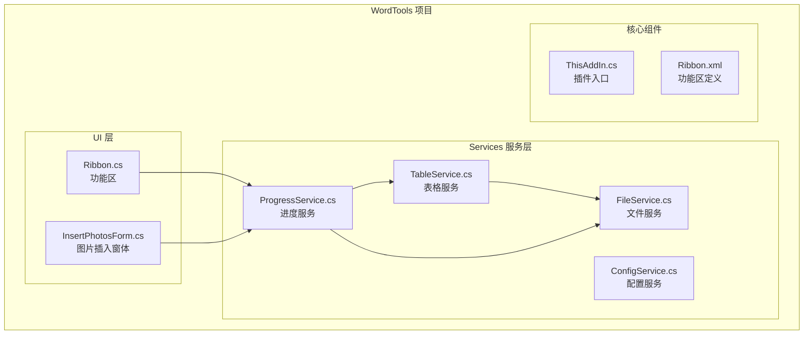
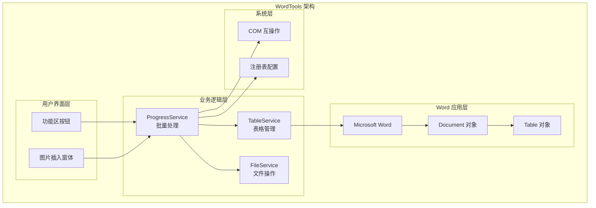
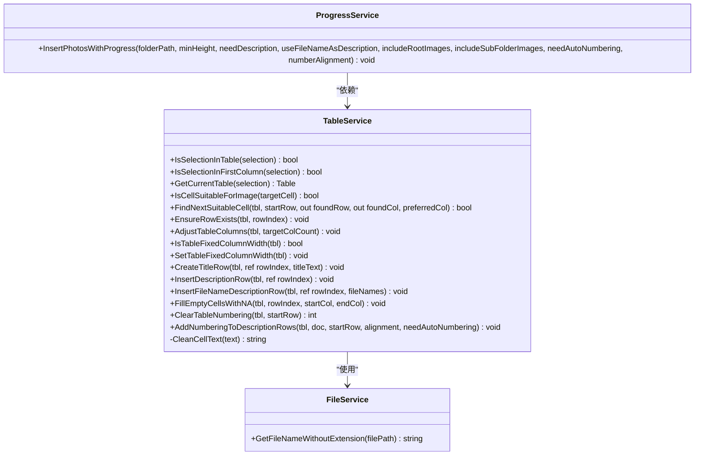
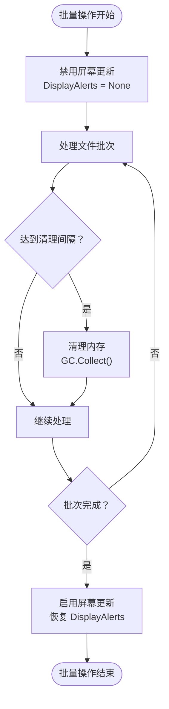

# TableService API 文档

<cite>
**本文档引用的文件**
- [TableService.cs](file://WordTools/Services/TableService.cs)
- [ProgressService.cs](file://WordTools/Services/ProgressService.cs)
- [FileService.cs](file://WordTools/Services/FileService.cs)
- [README.md](file://README.md)
</cite>

## 目录
1. [简介](#简介)
2. [项目结构](#项目结构)
3. [核心组件](#核心组件)
4. [架构概览](#架构概览)
5. [详细组件分析](#详细组件分析)
6. [依赖关系分析](#依赖关系分析)
7. [性能考虑](#性能考虑)
8. [故障排除指南](#故障排除指南)
9. [结论](#结论)

## 简介

TableService 是 WordTools 项目中的核心表格管理服务类，专门负责处理 Word 文档中的表格相关操作。该类提供了完整的表格验证、结构管理、自动编号、标题行和描述行处理等功能，是批量图片插入和表格管理功能的重要支撑组件。

该服务采用静态类设计，通过 Microsoft.Office.Interop.Word 库与 Word 应用程序进行交互，实现了对表格的完整生命周期管理。

## 项目结构

WordTools 项目是一个基于 COM 加载项的 Word 插件，主要包含以下关键组件：



**图表来源**
- [TableService.cs:1-756](file://WordTools/Services/TableService.cs#L1-L756)
- [ProgressService.cs:1-571](file://WordTools/Services/ProgressService.cs#L1-L571)

**章节来源**
- [README.md:1-85](file://README.md#L1-L85)

## 核心组件

TableService 类是整个表格管理功能的核心，提供了以下主要功能模块：

### 主要功能模块

1. **表格验证模块** - 验证当前选择状态和表格有效性
2. **表格操作模块** - 基础表格结构管理
3. **标题行和描述行模块** - 表格头部和描述行处理
4. **自动编号模块** - 表格自动编号管理和清理
5. **辅助工具模块** - 内部工具方法

### 设计特点

- **静态类设计**：所有方法均为静态，便于全局访问
- **异常安全**：大量使用 try-catch 包装，确保操作稳定性
- **参数验证**：对输入参数进行严格验证
- **Word Interop 集成**：深度集成 Microsoft.Office.Interop.Word

**章节来源**
- [TableService.cs:11-756](file://WordTools/Services/TableService.cs#L11-L756)

## 架构概览

TableService 在 WordTools 项目中的架构位置如下：



**图表来源**
- [ProgressService.cs:146-571](file://WordTools/Services/ProgressService.cs#L146-L571)
- [TableService.cs:11-756](file://WordTools/Services/TableService.cs#L11-L756)

## 详细组件分析

### 表格验证模块

#### IsSelectionInTable 方法
验证当前 Word 选择是否位于表格内部。

**方法签名**
```csharp
public static bool IsSelectionInTable(Selection selection)
```

**参数说明**
- `selection`: Microsoft.Office.Interop.Word.Selection 对象，表示当前 Word 选择区域

**返回值**
- `bool`: true 表示选择位于表格内，false 表示不在表格内

**异常情况**
- 当 selection 参数为 null 时，直接返回 false
- Word Interop 异常时返回 false

**使用场景**
- 批量图片插入前的预检查
- 表格操作的安全性验证

#### IsSelectionInFirstColumn 方法
验证当前选择是否位于表格的第一列。

**方法签名**
```csharp
public static bool IsSelectionInFirstColumn(Selection selection)
```

**参数说明**
- `selection`: Selection 对象，当前 Word 选择区域

**返回值**
- `bool`: true 表示选择位于第一列，false 表示不在第一列

**异常情况**
- 依赖 IsSelectionInTable 的结果
- Word 对象模型访问异常时返回 false

**使用场景**
- 确保批量操作从表格左上角开始

#### GetCurrentTable 方法
获取当前选中的表格对象。

**方法签名**
```csharp
public static Table GetCurrentTable(Selection selection)
```

**参数说明**
- `selection`: Selection 对象，当前 Word 选择区域

**返回值**
- `Table`: 返回当前表格对象，如果不在表格内则返回 null

**异常情况**
- selection 为 null 时返回 null
- 表格对象获取失败时返回 null

**使用场景**
- 获取目标表格进行后续操作

**章节来源**
- [TableService.cs:15-40](file://WordTools/Services/TableService.cs#L15-L40)

### 单元格验证和查找模块

#### IsCellSuitableForImage 方法
检查指定单元格是否适合插入图片。

**方法签名**
```csharp
public static bool IsCellSuitableForImage(Cell targetCell)
```

**参数说明**
- `targetCell`: Cell 对象，要检查的目标单元格

**返回值**
- `bool`: true 表示单元格适合插入图片，false 表示不适合

**验证逻辑**
1. 检查单元格是否已包含图片
2. 检查是否使用了自动编号格式
3. 清理单元格文本（移除换行符、制表符等）
4. 判断是否为空单元格或纯数字序号格式

**异常情况**
- targetCell 为 null 时返回 false
- Word 对象模型访问异常时返回 true（保守策略）

**使用场景**
- 批量图片插入前的单元格适配检查

#### FindNextSuitableCell 方法
在指定范围内查找下一个适合插入图片的单元格。

**方法签名**
```csharp
public static bool FindNextSuitableCell(Table tbl, int startRow, 
    out int foundRow, out int foundCol, int preferredCol = 1)
```

**参数说明**
- `tbl`: Table 对象，目标表格
- `startRow`: int，开始搜索的行号
- `foundRow`: out int，找到的行号
- `foundCol`: out int，找到的列号
- `preferredCol`: int，首选列号（默认为 1）

**返回值**
- `bool`: true 表示找到合适的单元格，false 表示未找到

**搜索策略**
- 最多向上搜索 10 行
- 优先检查首选列，然后检查另一列
- 跳过不适合的整行

**异常情况**
- tbl 为 null 时返回 false
- 搜索过程中异常时返回 false

**使用场景**
- 自动寻找可用的图片插入位置

**章节来源**
- [TableService.cs:45-196](file://WordTools/Services/TableService.cs#L45-L196)

### 表格结构管理模块

#### EnsureRowExists 方法
确保指定索引的行存在。

**方法签名**
```csharp
public static void EnsureRowExists(Table tbl, int rowIndex)
```

**参数说明**
- `tbl`: Table 对象，目标表格
- `rowIndex`: int，要确保存在的行索引

**返回值**
- `void`: 无返回值

**功能逻辑**
1. 计算需要添加的行数
2. 逐行添加缺失的行
3. 确保表格至少有 2 列

**异常情况**
- tbl 为 null 时直接返回
- Word 对象模型操作异常时忽略

**使用场景**
- 批量插入前的表格准备

#### AdjustTableColumns 方法
调整表格列数到指定数量。

**方法签名**
```csharp
public static void AdjustTableColumns(Table tbl, int targetColCount)
```

**参数说明**
- `tbl`: Table 对象，目标表格
- `targetColCount`: int，目标列数

**返回值**
- `void`: 无返回值

**功能逻辑**
1. 比较当前列数与目标列数
2. 删除多余列或添加缺少的列
3. 保持表格结构完整性

**异常情况**
- tbl 为 null 时直接返回
- 列操作异常时忽略

**使用场景**
- 确保表格具有正确的列数

#### IsTableFixedColumnWidth 和 SetTableFixedColumnWidth 方法
检查和设置表格固定列宽模式。

**方法签名**
```csharp
public static bool IsTableFixedColumnWidth(Table tbl)
public static void SetTableFixedColumnWidth(Table tbl)
```

**参数说明**
- `tbl`: Table 对象，目标表格

**返回值**
- `IsTableFixedColumnWidth`: bool，true 表示使用固定列宽
- `SetTableFixedColumnWidth`: void，无返回值

**功能逻辑**
- AllowAutoFit 属性控制列宽调整行为
- 固定列宽有利于批量图片插入的稳定性

**异常情况**
- tbl 为 null 时返回 false 或直接返回
- 属性访问异常时返回 false

**使用场景**
- 批量图片插入前的表格优化

**章节来源**
- [TableService.cs:205-295](file://WordTools/Services/TableService.cs#L205-L295)

### 标题行和描述行处理模块

#### CreateTitleRow 方法
创建标题行，合并两列并设置居中对齐。

**方法签名**
```csharp
public static void CreateTitleRow(Table tbl, ref int rowIndex, string titleText)
```

**参数说明**
- `tbl`: Table 对象，目标表格
- `rowIndex`: ref int，当前行索引（引用传递）
- `titleText`: string，标题文本内容

**返回值**
- `void`: 无返回值

**功能逻辑**
1. 确保表格至少有 2 列
2. 检查当前行是否为空
3. 如果当前行非空，插入新行
4. 合并两列为标题行
5. 设置标题文本和居中对齐
6. 移动到下一行

**异常情况**
- tbl 为 null 时直接返回
- 行操作异常时忽略

**使用场景**
- 创建表格的标题行

#### InsertDescriptionRow 方法
插入描述行占位符。

**方法签名**
```csharp
public static void InsertDescriptionRow(Table tbl, ref int rowIndex)
```

**参数说明**
- `tbl`: Table 对象，目标表格
- `rowIndex`: ref int，当前行索引

**返回值**
- `void`: 无返回值

**功能逻辑**
- 确保行存在并调整到 2 列
- 用于标记描述行的位置

**使用场景**
- 标记描述行的起始位置

#### InsertFileNameDescriptionRow 方法
插入文件名描述行，显示文件基础名称。

**方法签名**
```csharp
public static void InsertFileNameDescriptionRow(Table tbl, ref int rowIndex, string[] fileNames)
```

**参数说明**
- `tbl`: Table 对象，目标表格
- `rowIndex`: ref int，当前行索引
- `fileNames`: string[]，文件路径数组

**返回值**
- `void`: 无返回值

**功能逻辑**
1. 确保行存在并调整到 2 列
2. 从文件路径提取基础名称
3. 将文件名插入到对应单元格
4. 设置居中对齐和垂直居中
5. 如果只有一个文件，第二列留空

**异常情况**
- tbl 为 null 时直接返回
- 文件名处理异常时忽略

**使用场景**
- 显示图片文件的文件名

#### FillEmptyCellsWithNA 方法
将指定范围内的空单元格填充为 "N/A"。

**方法签名**
```csharp
public static void FillEmptyCellsWithNA(Table tbl, int rowIndex, int startCol, int endCol)
```

**参数说明**
- `tbl`: Table 对象，目标表格
- `rowIndex`: int，行索引
- `startCol`: int，开始列索引
- `endCol`: int，结束列索引

**返回值**
- `void`: 无返回值

**功能逻辑**
1. 验证行索引和列索引的有效性
2. 遍历指定范围的单元格
3. 将空单元格设置为 "N/A"
4. 设置居中对齐和垂直居中
5. 清除可能存在的编号格式

**异常情况**
- 参数无效时直接返回
- 单元格操作异常时忽略

**使用场景**
- 填充表格末尾的占位单元格

**章节来源**
- [TableService.cs:304-434](file://WordTools/Services/TableService.cs#L304-L434)

### 自动编号管理模块

#### ClearTableNumbering 方法
清除表格中的自动编号格式。

**方法签名**
```csharp
public static int ClearTableNumbering(Table tbl, int startRow = 1)
```

**参数说明**
- `tbl`: Table 对象，目标表格
- `startRow`: int，开始清理的行号（默认为 1）

**返回值**
- `int`: 原来的编号对齐方式（1=居左, 2=居中, 3=居右）

**功能逻辑**
1. 检测原始编号的对齐方式
2. 遍历指定范围的行
3. 移除列表格式编号
4. 清理编号行的文本内容
5. 特殊处理纯文本形式的序号

**异常情况**
- tbl 为 null 时返回 0
- 检测对齐方式异常时返回 1（默认值）

**使用场景**
- 批量图片插入前的编号清理

#### AddNumberingToDescriptionRows 方法
在描述行添加自动编号。

**方法签名**
```csharp
public static void AddNumberingToDescriptionRows(Table tbl, Document doc, 
    int startRow = 1, int alignment = 1, bool needAutoNumbering = false)
```

**参数说明**
- `tbl`: Table 对象，目标表格
- `doc`: Document 对象，Word 文档
- `startRow`: int，开始行号
- `alignment`: int，编号对齐方式（1=左对齐, 2=居中, 3=右对齐）
- `needAutoNumbering`: bool，是否需要自动编号

**返回值**
- `void`: 无返回值

**功能逻辑**
1. 查找包含图片的最后一行
2. 创建或获取列表模板
3. 遍历描述行并应用编号
4. 设置段落对齐方式
5. 支持继续之前的编号序列

**异常情况**
- 参数无效时直接返回
- 模板创建或应用异常时忽略

**使用场景**
- 为描述行添加自动编号格式

**章节来源**
- [TableService.cs:446-737](file://WordTools/Services/TableService.cs#L446-L737)

### 辅助工具模块

#### CleanCellText 方法
清理单元格文本内容。

**方法签名**
```csharp
private static string CleanCellText(string text)
```

**参数说明**
- `text`: string，要清理的文本

**返回值**
- `string`: 清理后的文本

**清理规则**
- 移除换行符、回车符、制表符
- 移除响铃符和不间断空格
- 去除首尾空白字符

**使用场景**
- 文本验证和比较前的预处理

**章节来源**
- [TableService.cs:746-751](file://WordTools/Services/TableService.cs#L746-L751)

## 依赖关系分析

### 内部依赖关系



**图表来源**
- [TableService.cs:11-756](file://WordTools/Services/TableService.cs#L11-L756)
- [FileService.cs:278-281](file://WordTools/Services/FileService.cs#L278-L281)
- [ProgressService.cs:146-571](file://WordTools/Services/ProgressService.cs#L146-L571)

### 外部依赖关系

TableService 依赖于以下外部组件：

1. **Microsoft.Office.Interop.Word**：Word 应用程序对象模型
2. **System**：基础 .NET 类型和集合
3. **System.Text.RegularExpressions**：正则表达式支持

**章节来源**
- [TableService.cs:1-3](file://WordTools/Services/TableService.cs#L1-L3)

## 性能考虑

### 性能优化策略

#### 批量操作优化
- **延迟执行**：通过 ProgressService 实现批量处理
- **内存管理**：定期调用 GC.Collect() 进行内存清理
- **屏幕更新控制**：在批量操作期间禁用屏幕更新

#### 内存管理策略



**图表来源**
- [ProgressService.cs:128-142](file://WordTools/Services/ProgressService.cs#L128-L142)

#### 性能监控指标
- **刷新间隔**：根据文件数量动态调整（5-200）
- **内存清理间隔**：每处理 50 个文件清理一次
- **保存间隔**：每处理 200 个文件保存一次

**章节来源**
- [ProgressService.cs:117-142](file://WordTools/Services/ProgressService.cs#L117-L142)

## 故障排除指南

### 常见问题及解决方案

#### 表格操作失败
**问题现象**：表格操作抛出异常或返回 null

**可能原因**
1. Word 对象模型访问异常
2. 表格对象已被释放
3. 权限不足

**解决方法**
- 检查参数是否为 null
- 确保 Word 应用程序处于活动状态
- 重新获取表格对象

#### 单元格验证失败
**问题现象**：IsCellSuitableForImage 返回 false

**可能原因**
1. 单元格已包含图片
2. 单元格使用了自动编号格式
3. 单元格包含不可编辑内容

**解决方法**
- 使用 FindNextSuitableCell 寻找替代单元格
- 先调用 ClearTableNumbering 清理编号
- 检查单元格的保护状态

#### 自动编号问题
**问题现象**：编号格式异常或编号丢失

**可能原因**
1. 编号模板损坏
2. 行格式冲突
3. 编号范围计算错误

**解决方法**
- 调用 ClearTableNumbering 重新初始化
- 检查前一行的编号格式
- 验证编号对齐方式设置

**章节来源**
- [TableService.cs:45-196](file://WordTools/Services/TableService.cs#L45-L196)
- [TableService.cs:446-737](file://WordTools/Services/TableService.cs#L446-L737)

## 结论

TableService 类为 WordTools 项目提供了完整的表格管理能力，具有以下特点：

### 设计优势
- **模块化设计**：功能清晰分组，职责单一
- **异常安全**：大量 try-catch 包装，提高稳定性
- **参数验证**：严格的输入验证机制
- **Word 集成**：深度集成 Word 对象模型

### 使用建议
1. **批量操作**：结合 ProgressService 进行大规模表格操作
2. **错误处理**：始终检查返回值和异常情况
3. **性能优化**：合理设置刷新间隔和内存清理策略
4. **兼容性**：注意不同 Word 版本的兼容性问题

### 扩展方向
- 支持更多表格格式和样式
- 增加表格数据验证功能
- 提供表格模板管理
- 支持表格数据导出和导入

该服务为 Word 批量图片插入和表格管理功能奠定了坚实的基础，是 WordTools 项目的核心组件之一。