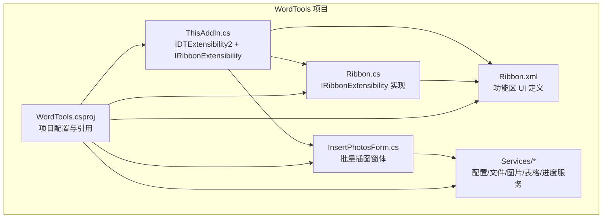
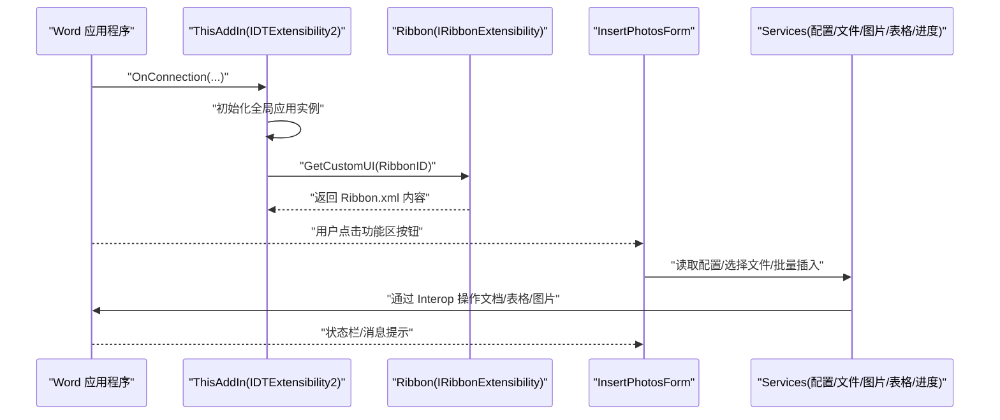
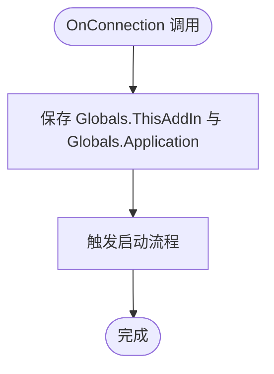
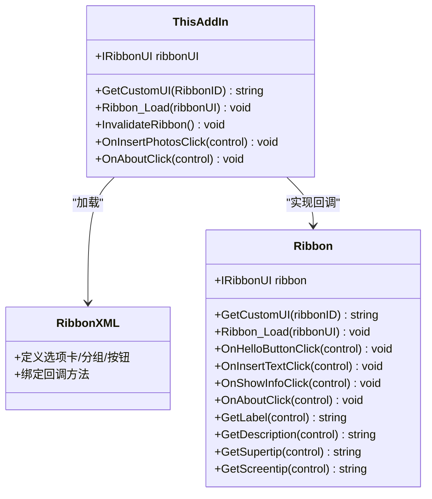
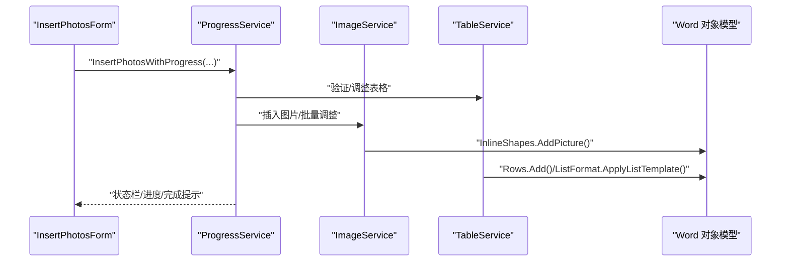
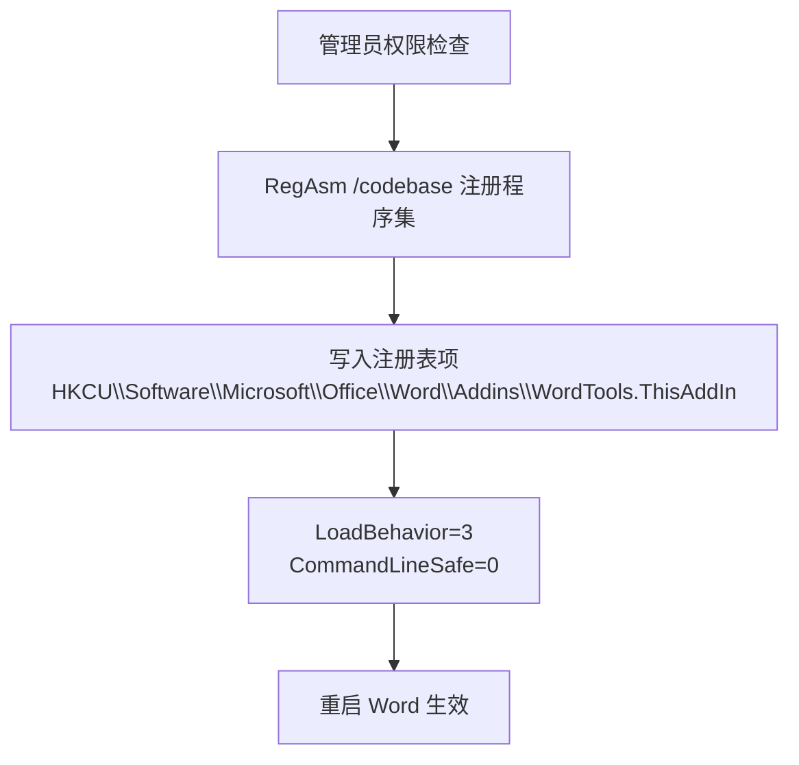
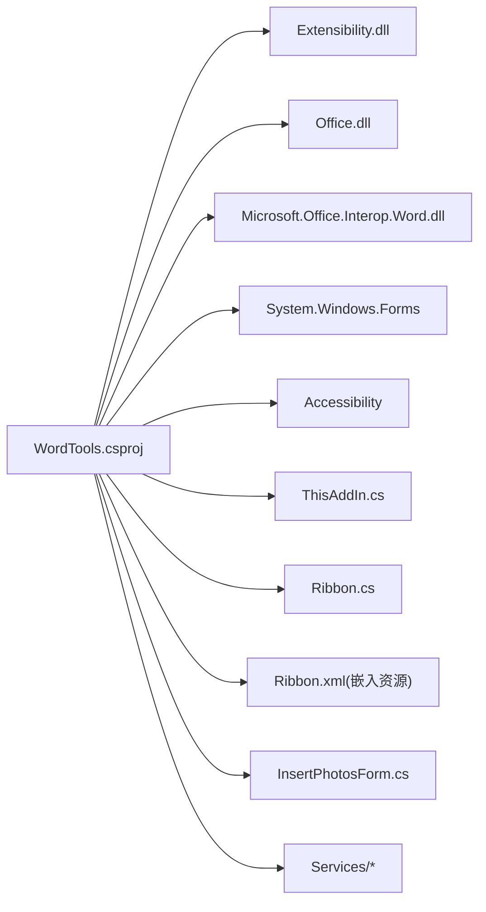

# COM 集成

<cite>
**本文引用的文件**
- [ThisAddIn.cs](file://WordTools/ThisAddIn.cs)
- [Ribbon.cs](file://WordTools/Ribbon.cs)
- [Ribbon.xml](file://WordTools/Ribbon.xml)
- [WordTools.csproj](file://WordTools/WordTools.csproj)
- [README.md](file://README.md)
- [RegisterPlugin.bat](file://RegisterPlugin.bat)
- [RegisterPlugin.ps1](file://RegisterPlugin.ps1)
- [build.bat](file://build.bat)
- [InsertPhotosForm.cs](file://WordTools/Forms/InsertPhotosForm.cs)
- [ConfigService.cs](file://WordTools/Services/ConfigService.cs)
- [FileService.cs](file://WordTools/Services/FileService.cs)
- [ImageService.cs](file://WordTools/Services/ImageService.cs)
- [ProgressService.cs](file://WordTools/Services/ProgressService.cs)
- [TableService.cs](file://WordTools/Services/TableService.cs)
</cite>

## 目录
1. [简介](#简介)
2. [项目结构](#项目结构)
3. [核心组件](#核心组件)
4. [架构总览](#架构总览)
5. [详细组件分析](#详细组件分析)
6. [依赖关系分析](#依赖关系分析)
7. [性能考量](#性能考量)
8. [故障排查指南](#故障排查指南)
9. [结论](#结论)
10. [附录](#附录)

## 简介
本文件面向 WordTools 的 COM 加载项实现，聚焦以下主题：
- IDTExtensibility2 接口的实现与 Word 应用程序生命周期管理
- COM 加载项的注册机制、安全与部署策略
- 与 Microsoft.Office.Interop.Word 的集成方式与对象模型使用
- 功能区扩展的实现原理（IRibbonExtensibility 接口与回调方法）
- COM 互操作最佳实践（内存管理、异常处理）
- 常见问题排查与调试技巧
- 与 Office 应用程序的兼容性与版本管理

## 项目结构
该项目采用“COM 加载项 + 功能区 XML + WinForms 窗体”的组合架构，通过 IDTExtensibility2 实现加载项生命周期管理，通过 IRibbonExtensibility 提供功能区 UI，并在功能区回调中触发 WinForms 窗体执行批量图片插入等任务。

**图表来源**
- [ThisAddIn.cs:13-17](file://WordTools/ThisAddIn.cs#L13-L17)
- [Ribbon.cs:14](file://WordTools/Ribbon.cs#L14)
- [Ribbon.xml:1-39](file://WordTools/Ribbon.xml#L1-L39)
- [WordTools.csproj:60-98](file://WordTools/WordTools.csproj#L60-L98)

**章节来源**
- [README.md:47-60](file://README.md#L47-L60)
- [WordTools.csproj:100-119](file://WordTools/WordTools.csproj#L100-L119)

## 核心组件
- ThisAddIn：实现 IDTExtensibility2 与 IRibbonExtensibility，负责加载项连接、断开、功能区 UI 提供以及 Ribbon 回调（如打开窗体、刷新状态）。
- Ribbon：实现 IRibbonExtensibility，加载 Ribbon.xml 并提供回调方法（如按钮点击、动态标签/描述、关于信息）。
- Ribbon.xml：功能区 UI 定义，声明选项卡、分组与按钮及其回调映射。
- InsertPhotosForm：WinForms 窗体，提供批量插图的交互界面与配置。
- Services：封装配置持久化、文件选择与校验、图片插入与尺寸调整、表格操作与自动编号、进度与性能优化等。

**章节来源**
- [ThisAddIn.cs:17-18](file://WordTools/ThisAddIn.cs#L17-L18)
- [Ribbon.cs:14](file://WordTools/Ribbon.cs#L14)
- [Ribbon.xml:2-38](file://WordTools/Ribbon.xml#L2-L38)
- [InsertPhotosForm.cs:18-57](file://WordTools/Forms/InsertPhotosForm.cs#L18-L57)

## 架构总览
COM 加载项通过 IDTExtensibility2 与 Word 应用程序建立连接；功能区 UI 由 Ribbon.xml 定义并通过 IRibbonExtensibility 注入；回调方法在 C# 中实现，触发窗体与服务层逻辑，最终通过 Microsoft.Office.Interop.Word 对象模型操作文档。

**图表来源**
- [ThisAddIn.cs:37-41](file://WordTools/ThisAddIn.cs#L37-L41)
- [ThisAddIn.cs:65-80](file://WordTools/ThisAddIn.cs#L65-L80)
- [Ribbon.cs:24-27](file://WordTools/Ribbon.cs#L24-L27)
- [InsertPhotosForm.cs:525-561](file://WordTools/Forms/InsertPhotosForm.cs#L525-L561)

## 详细组件分析

### IDTExtensibility2 生命周期与全局状态
- OnConnection：保存全局 ThisAddIn 与 Word.Application 引用，触发启动流程。
- OnDisconnection：触发关闭流程。
- 其他回调（OnAddInsUpdate、OnStartupComplete、OnBeginShutdown）当前为空实现或占位。

**图表来源**
- [ThisAddIn.cs:37-41](file://WordTools/ThisAddIn.cs#L37-L41)

**章节来源**
- [ThisAddIn.cs:35-61](file://WordTools/ThisAddIn.cs#L35-L61)

### 功能区扩展：IRibbonExtensibility 与 Ribbon.xml
- GetCustomUI：从嵌入资源读取 Ribbon.xml 字符串。
- Ribbon_Load：缓存 IRibbonUI 引用以便后续刷新。
- InvalidateRibbon：主动刷新功能区状态。
- 回调方法：OnInsertPhotosClick、OnAboutClick 等，分别打开窗体或显示关于信息。
- Ribbon.cs：提供额外的回调（如动态标签/描述、插入文本、显示文档信息等），展示对象模型与异常处理实践。

**图表来源**
- [ThisAddIn.cs:65-100](file://WordTools/ThisAddIn.cs#L65-L100)
- [Ribbon.cs:24-146](file://WordTools/Ribbon.cs#L24-L146)
- [Ribbon.xml:2-38](file://WordTools/Ribbon.xml#L2-L38)

**章节来源**
- [ThisAddIn.cs:63-100](file://WordTools/ThisAddIn.cs#L63-L100)
- [Ribbon.cs:22-146](file://WordTools/Ribbon.cs#L22-L146)
- [Ribbon.xml:1-39](file://WordTools/Ribbon.xml#L1-L39)

### 与 Microsoft.Office.Interop.Word 的集成
- 通过 Microsoft.Office.Interop.Word 引用访问 Application、Document、Selection、Table、Cell、InlineShape 等对象。
- 在服务层（ImageService、TableService、ProgressService）中封装对象模型操作，保证健壮性与可维护性。
- 示例：插入图片、调整尺寸、批量添加行、自动编号、状态栏更新等。

**图表来源**
- [ProgressService.cs:151-306](file://WordTools/Services/ProgressService.cs#L151-L306)
- [ImageService.cs:73-134](file://WordTools/Services/ImageService.cs#L73-L134)
- [TableService.cs:364-407](file://WordTools/Services/TableService.cs#L364-L407)

**章节来源**
- [InsertPhotosForm.cs:525-613](file://WordTools/Forms/InsertPhotosForm.cs#L525-L613)
- [ProgressService.cs:146-403](file://WordTools/Services/ProgressService.cs#L146-L403)
- [ImageService.cs:64-182](file://WordTools/Services/ImageService.cs#L64-L182)
- [TableService.cs:18-41](file://WordTools/Services/TableService.cs#L18-L41)

### COM 加载项注册机制、安全与部署
- 注册方式：使用 RegAsm 将程序集注册为 COM 组件，并向 HKCU\Software\Microsoft\Office\Word\Addins\WordTools.ThisAddIn 写入友好名称、描述、LoadBehavior、CommandLineSafe 等键值。
- 安全：脚本要求以管理员身份运行；批处理与 PowerShell 脚本均包含管理员权限检查与错误处理。
- 部署：提供批处理与 Inno Setup 脚本，支持一键安装/卸载与 COM 注册/反注册。

**图表来源**
- [RegisterPlugin.bat:8-62](file://RegisterPlugin.bat#L8-L62)
- [RegisterPlugin.ps1:11-70](file://RegisterPlugin.ps1#L11-L70)
- [Setup.iss:40-49](file://Setup.iss#L40-L49)

**章节来源**
- [RegisterPlugin.bat:1-80](file://RegisterPlugin.bat#L1-L80)
- [RegisterPlugin.ps1:1-87](file://RegisterPlugin.ps1#L1-L87)
- [README.md:30-75](file://README.md#L30-L75)

### COM 互操作最佳实践
- 异常处理：在功能区回调与窗体事件中统一捕获异常并提示用户，避免崩溃。
- 内存管理：在长时间批量操作中定期触发 Application.DoEvents 与 GC.Collect，降低内存峰值。
- 性能优化：进入高性能模式（关闭 ScreenUpdating、DisplayAlerts、Spelling/Grammar 校验），减少 UI 刷新与警告对话。
- 取消机制：通过检测 ESC 键实现用户取消操作，及时恢复环境状态。

**章节来源**
- [Ribbon.cs:40-48](file://WordTools/Ribbon.cs#L40-L48)
- [InsertPhotosForm.cs:563-567](file://WordTools/Forms/InsertPhotosForm.cs#L563-L567)
- [ProgressService.cs:43-64](file://WordTools/Services/ProgressService.cs#L43-L64)
- [ProgressService.cs:73-112](file://WordTools/Services/ProgressService.cs#L73-L112)
- [ProgressService.cs:130-142](file://WordTools/Services/ProgressService.cs#L130-L142)

### 服务层详解
- ConfigService：结合文档自定义属性与注册表存储配置，提供跨文档与全局设置。
- FileService：文件夹/文件选择、扩展名校验、自然排序、统计等。
- ImageService：图片插入、尺寸转换、快速插入、批量调整与预分配行。
- TableService：表格验证、列数调整、固定列宽、标题/描述行、自动编号与对齐。
- ProgressService：批量插入主流程、进度更新、性能优化、取消与内存回收。

**章节来源**
- [ConfigService.cs:11-362](file://WordTools/Services/ConfigService.cs#L11-L362)
- [FileService.cs:13-310](file://WordTools/Services/FileService.cs#L13-L310)
- [ImageService.cs:10-325](file://WordTools/Services/ImageService.cs#L10-L325)
- [TableService.cs:11-756](file://WordTools/Services/TableService.cs#L11-L756)
- [ProgressService.cs:14-571](file://WordTools/Services/ProgressService.cs#L14-L571)

## 依赖关系分析
- 项目引用 Office Interop 与 Office PIA，使用 EmbedInteropTypes 以简化部署。
- 通过嵌入资源（Ribbon.xml）与反射读取，避免外部文件依赖。
- 服务层解耦 UI 与对象模型操作，提升可测试性与可维护性。

**图表来源**
- [WordTools.csproj:62-88](file://WordTools/WordTools.csproj#L62-L88)
- [WordTools.csproj:123-126](file://WordTools/WordTools.csproj#L123-L126)

**章节来源**
- [WordTools.csproj:60-98](file://WordTools/WordTools.csproj#L60-L98)
- [WordTools.csproj:123-126](file://WordTools/WordTools.csproj#L123-L126)

## 性能考量
- 批量操作：分批处理、定期清理内存、减少状态栏刷新频率。
- UI 交互：在长耗时操作中使用 DoEvents 保持 UI 响应。
- Word 环境：关闭不必要的屏幕更新与警告，避免拼写/语法检查干扰。

**章节来源**
- [ProgressService.cs:117-125](file://WordTools/Services/ProgressService.cs#L117-L125)
- [ProgressService.cs:130-142](file://WordTools/Services/ProgressService.cs#L130-L142)
- [ProgressService.cs:73-112](file://WordTools/Services/ProgressService.cs#L73-L112)

## 故障排查指南
- 注册失败：确认以管理员身份运行脚本；检查 RegAsm 路径与 DLL 是否存在；查看错误输出。
- Word 未显示功能区：确认注册表项 LoadBehavior=3；完全关闭 Word 后重启；在“文件 → 选项 → 加载项”中启用 COM 加载项。
- 插入图片失败：检查表格选择与第一列定位；确认图片文件扩展名与路径有效性；查看异常提示。
- 性能问题：启用高性能模式；减少状态栏频繁刷新；合理设置刷新/内存清理间隔。

**章节来源**
- [RegisterPlugin.bat:8-62](file://RegisterPlugin.bat#L8-L62)
- [RegisterPlugin.ps1:11-70](file://RegisterPlugin.ps1#L11-L70)
- [README.md:62-75](file://README.md#L62-L75)
- [InsertPhotosForm.cs:525-567](file://WordTools/Forms/InsertPhotosForm.cs#L525-L567)

## 结论
本项目通过 IDTExtensibility2 与 IRibbonExtensibility 实现了稳定的 Word COM 加载项，配合服务层封装对象模型操作，提供了良好的用户体验与可维护性。通过完善的注册机制、异常处理与性能优化策略，能够在不同 Office 版本与环境中稳定运行。

## 附录
- 构建与发布：使用 build.bat 一键构建 Release 并生成部署文件；支持 Inno Setup 安装包。
- 兼容性：目标框架 .NET Framework 4.8；Office 版本要求 2010+；Windows 7+。

**章节来源**
- [build.bat:1-125](file://build.bat#L1-L125)
- [README.md:15-20](file://README.md#L15-L20)