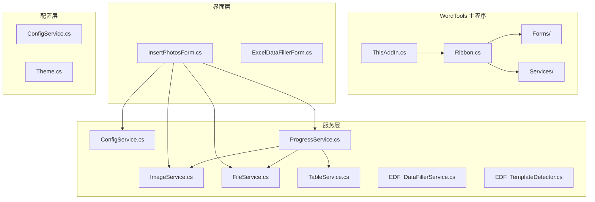
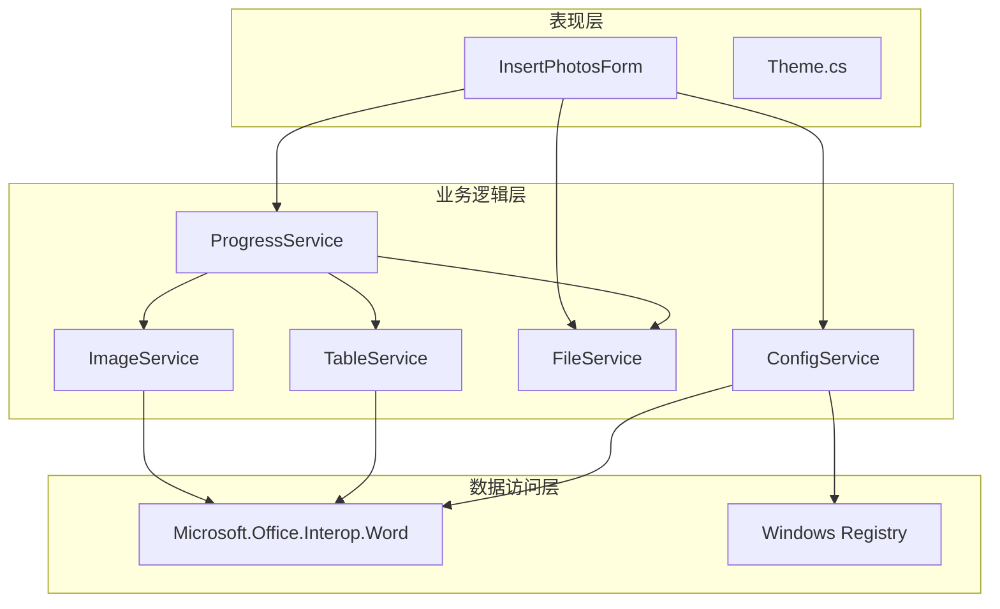
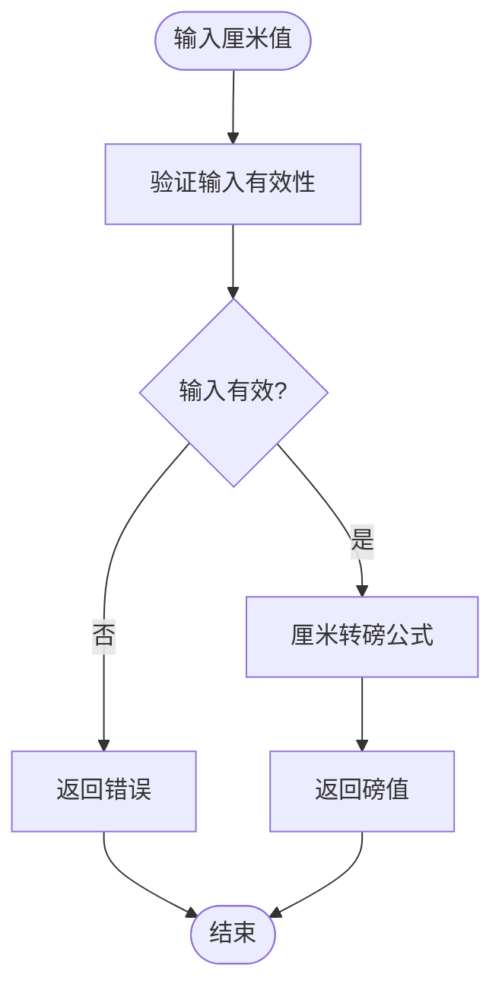
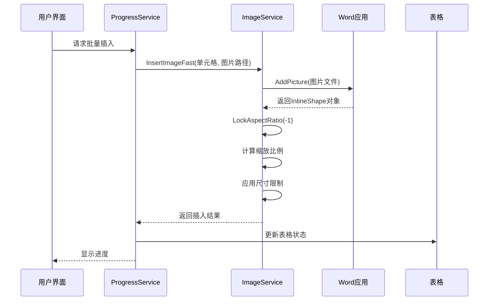
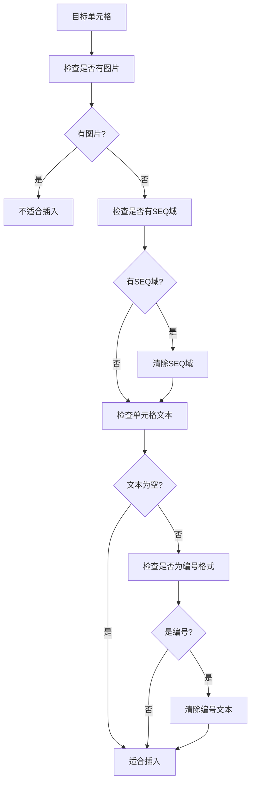
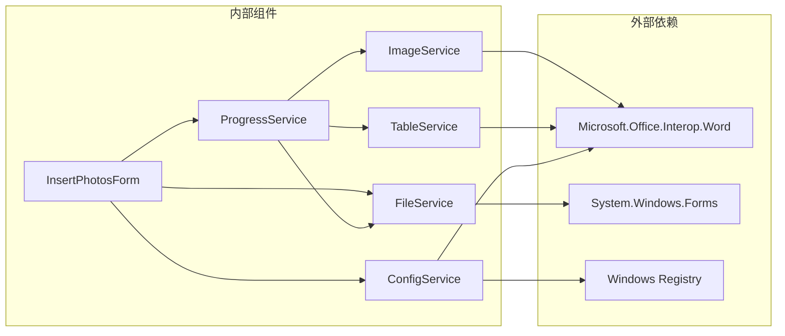

# 图片服务

<cite>
**本文档引用的文件**
- [ImageService.cs](file://WordTools/Services/ImageService.cs)
- [InsertPhotosForm.cs](file://WordTools/Forms/InsertPhotosForm.cs)
- [ConfigService.cs](file://WordTools/Services/ConfigService.cs)
- [FileService.cs](file://WordTools/Services/FileService.cs)
- [ProgressService.cs](file://WordTools/Services/ProgressService.cs)
- [TableService.cs](file://WordTools/Services/TableService.cs)
- [README.md](file://README.md)
- [WordTools.csproj](file://WordTools/WordTools.csproj)
</cite>

## 目录
1. [简介](#简介)
2. [项目结构](#项目结构)
3. [核心组件](#核心组件)
4. [架构概览](#架构概览)
5. [详细组件分析](#详细组件分析)
6. [依赖关系分析](#依赖关系分析)
7. [性能考虑](#性能考虑)
8. [故障排除指南](#故障排除指南)
9. [结论](#结论)

## 简介

WordTools 是一个基于 COM 加载项的 Microsoft Word 插件，专门用于批量插入图片到 Word 表格中。该系统提供了完整的图片处理功能，包括图片插入、尺寸调整、批量操作和进度跟踪等核心功能。

本项目采用 C# 编写，使用 Microsoft Office Interop Word API 进行 Word 文档操作，支持 Windows 7+ 和 Microsoft Office 2010+ 系统环境。

## 项目结构

项目采用模块化的架构设计，主要分为以下几个核心模块：

**图表来源**
- [WordTools.csproj:100-122](file://WordTools/WordTools.csproj#L100-L122)

**章节来源**
- [README.md:47-60](file://README.md#L47-L60)
- [WordTools.csproj:99-123](file://WordTools/WordTools.csproj#L99-L123)

## 核心组件

### 图片服务 (ImageService)

ImageService 是整个系统的核心组件，负责处理所有与图片相关的操作。它提供了完整的图片处理功能，包括尺寸转换、图片插入、批量操作等。

#### 主要功能特性

1. **尺寸转换系统**
   - 厘米到磅的精确转换
   - 输入验证和错误处理
   - 动态单位转换支持

2. **图片插入机制**
   - 标准图片插入功能
   - 快速插入优化
   - 自动尺寸调整
   - 最小高度限制

3. **批量处理能力**
   - 批量图片尺寸调整
   - 行数预分配
   - 性能优化策略

**章节来源**
- [ImageService.cs:10-334](file://WordTools/Services/ImageService.cs#L10-L334)

### 用户界面 (InsertPhotosForm)

InsertPhotosForm 提供了直观的用户界面，允许用户通过图形界面批量插入图片到 Word 表格中。

#### 界面功能

1. **配置管理**
   - 图片高度设置
   - 文件夹范围选择
   - 描述行配置
   - 自动编号设置

2. **操作控制**
   - 文件夹浏览
   - 文件选择
   - 批量插入
   - 进度监控

**章节来源**
- [InsertPhotosForm.cs:19-574](file://WordTools/Forms/InsertPhotosForm.cs#L19-L574)

## 架构概览

系统采用分层架构设计，各层职责明确，耦合度低，便于维护和扩展。

**图表来源**
- [InsertPhotosForm.cs:49-54](file://WordTools/Forms/InsertPhotosForm.cs#L49-L54)
- [ProgressService.cs:15-38](file://WordTools/Services/ProgressService.cs#L15-L38)

## 详细组件分析

### ImageService 详细分析

ImageService 采用了静态类设计，提供了完整的图片处理功能。

#### 尺寸转换系统

**图表来源**
- [ImageService.cs:37-60](file://WordTools/Services/ImageService.cs#L37-L60)

#### 图片插入流程

**图表来源**
- [ProgressService.cs:514-516](file://WordTools/Services/ProgressService.cs#L514-L516)
- [ImageService.cs:143-189](file://WordTools/Services/ImageService.cs#L143-L189)

**章节来源**
- [ImageService.cs:64-189](file://WordTools/Services/ImageService.cs#L64-L189)

### ProgressService 批量处理机制

ProgressService 实现了复杂的批量处理逻辑，包括性能优化、内存管理和进度跟踪。

#### 性能优化策略

1. **高性能模式**
   - 禁用屏幕更新
   - 关闭显示警告
   - 跳过拼写检查

2. **内存管理**
   - 分级垃圾回收
   - 定期内存清理
   - 大对象堆保护

3. **进度监控**
   - 实时进度更新
   - 剩余时间估算
   - 取消操作支持

**章节来源**
- [ProgressService.cs:75-157](file://WordTools/Services/ProgressService.cs#L75-L157)
- [ProgressService.cs:161-337](file://WordTools/Services/ProgressService.cs#L161-L337)

### TableService 表格操作

TableService 提供了完整的表格操作功能，包括表格验证、单元格检查和自动编号。

#### 单元格适配检查

**图表来源**
- [TableService.cs:44-126](file://WordTools/Services/TableService.cs#L44-L126)

**章节来源**
- [TableService.cs:12-800](file://WordTools/Services/TableService.cs#L12-L800)

## 依赖关系分析

系统采用松耦合的设计，各组件之间的依赖关系清晰明确。

**图表来源**
- [WordTools.csproj:63-88](file://WordTools/WordTools.csproj#L63-L88)
- [InsertPhotosForm.cs:1-13](file://WordTools/Forms/InsertPhotosForm.cs#L1-L13)

**章节来源**
- [WordTools.csproj:60-98](file://WordTools/WordTools.csproj#L60-L98)

## 性能考虑

系统在设计时充分考虑了性能优化，特别是在处理大量图片时的性能表现。

### 内存管理策略

1. **垃圾回收优化**
   - 分级垃圾回收策略
   - 定期内存清理
   - 大对象堆保护

2. **对象生命周期管理**
   - 及时释放 COM 对象
   - 避免内存泄漏
   - 最小化对象创建

### 性能监控指标

- **处理速度**: 支持数千张图片的批量处理
- **内存使用**: 优化的内存使用策略，避免内存溢出
- **响应性**: 实时进度反馈，用户体验良好

## 故障排除指南

### 常见问题及解决方案

#### 图片插入失败

**问题症状**: 图片无法插入到表格中

**可能原因**:
1. 单元格已被占用
2. 单元格包含 SEQ 域
3. 文件路径无效

**解决步骤**:
1. 检查目标单元格是否为空
2. 清除单元格中的 SEQ 域
3. 验证图片文件路径

#### 性能问题

**问题症状**: 处理大量图片时速度缓慢

**解决方案**:
1. 确保启用了高性能模式
2. 检查系统内存使用情况
3. 考虑分批处理大量图片

#### 配置问题

**问题症状**: 配置无法保存或加载

**解决步骤**:
1. 检查注册表权限
2. 验证文档属性访问权限
3. 重启 Word 应用程序

**章节来源**
- [TableService.cs:44-126](file://WordTools/Services/TableService.cs#L44-L126)
- [ConfigService.cs:100-144](file://WordTools/Services/ConfigService.cs#L100-L144)

## 结论

WordTools 的图片服务系统是一个设计精良、功能完整的解决方案。它通过模块化的设计、清晰的架构和完善的错误处理机制，为用户提供了可靠的图片批量处理功能。

### 主要优势

1. **功能完整性**: 提供了从图片选择到最终输出的完整工作流
2. **性能优化**: 采用多种优化策略确保处理大量图片时的性能
3. **用户体验**: 直观的界面设计和实时进度反馈
4. **稳定性**: 完善的错误处理和异常恢复机制

### 技术特点

- 基于 COM 加载项架构，无需额外运行时组件
- 支持多种图片格式和尺寸规格
- 提供灵活的配置选项和自定义功能
- 具备良好的扩展性和维护性

该系统为 Word 用户提供了强大的图片管理能力，特别适用于需要批量处理图片的场景，如产品展示、相册制作、文档美化等应用。