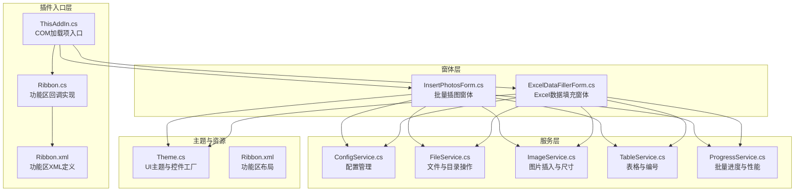
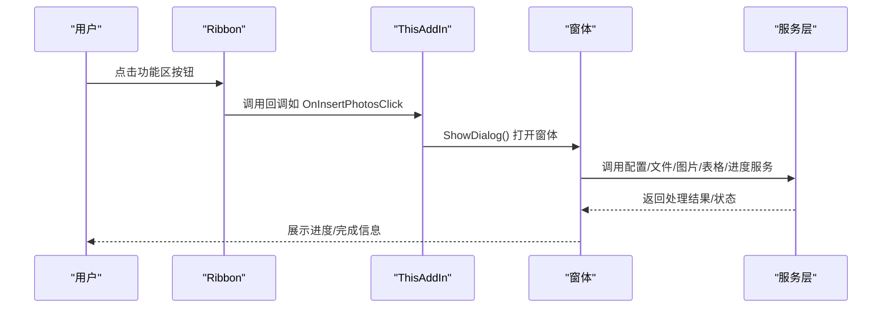
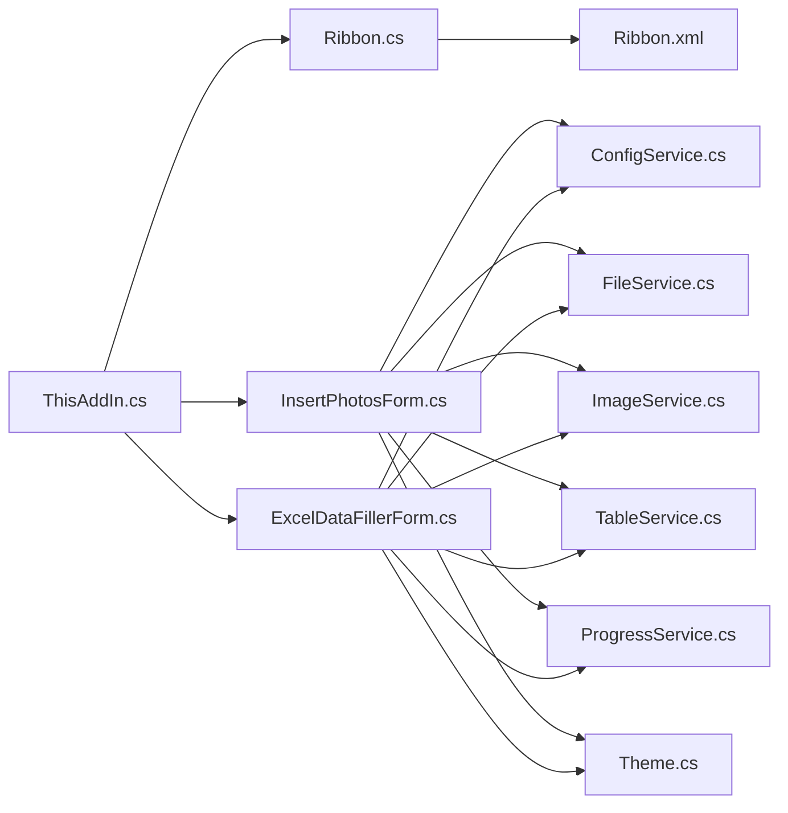

# 代码结构说明

<cite>
**本文引用的文件**
- [WordTools.csproj](file://WordTools/WordTools.csproj)
- [ThisAddIn.cs](file://WordTools/ThisAddIn.cs)
- [Ribbon.cs](file://WordTools/Ribbon.cs)
- [Ribbon.xml](file://WordTools/Ribbon.xml)
- [Theme.cs](file://WordTools/Theme.cs)
- [ConfigService.cs](file://WordTools/Services/ConfigService.cs)
- [FileService.cs](file://WordTools/Services/FileService.cs)
- [ImageService.cs](file://WordTools/Services/ImageService.cs)
- [TableService.cs](file://WordTools/Services/TableService.cs)
- [ProgressService.cs](file://WordTools/Services/ProgressService.cs)
- [InsertPhotosForm.cs](file://WordTools/Forms/InsertPhotosForm.cs)
- [ExcelDataFillerForm.cs](file://WordTools/Forms/ExcelDataFillerForm.cs)
- [README.md](file://README.md)
</cite>

## 目录
1. [简介](#简介)
2. [项目结构](#项目结构)
3. [核心组件](#核心组件)
4. [架构总览](#架构总览)
5. [详细组件分析](#详细组件分析)
6. [依赖关系分析](#依赖关系分析)
7. [性能考量](#性能考量)
8. [故障排查指南](#故障排查指南)
9. [结论](#结论)
10. [附录](#附录)

## 简介
本项目是一个基于 COM 加载项（IDTExtensibility2）的 Word 插件，通过功能区（Ribbon）提供“批量插图”和“Excel 数据填充”两大核心功能。项目采用清晰的分层架构：插件入口层（ThisAddIn、Ribbon）、窗体层（Forms）、服务层（Services），以及统一的主题与配置管理。本文档旨在帮助新加入的开发者快速理解项目结构、职责划分、依赖关系与交互模式，并提供导航路径与最佳实践建议。

## 项目结构
项目采用“按职责分层 + 按功能分组”的组织方式：
- 插件入口层：ThisAddIn.cs、Ribbon.cs、Ribbon.xml
- 窗体层：Forms/InsertPhotosForm.cs、Forms/ExcelDataFillerForm.cs
- 服务层：Services/*（配置、文件、图片、表格、进度、Excel数据填充）
- 主题与资源：Theme.cs、Ribbon.xml、Properties/AssemblyInfo.cs
- 项目配置：WordTools/WordTools.csproj、README.md

图表来源
- [ThisAddIn.cs:1-175](file://WordTools/ThisAddIn.cs#L1-L175)
- [Ribbon.cs:1-190](file://WordTools/Ribbon.cs#L1-L190)
- [Ribbon.xml:1-53](file://WordTools/Ribbon.xml#L1-L53)
- [InsertPhotosForm.cs:1-574](file://WordTools/Forms/InsertPhotosForm.cs#L1-L574)
- [ExcelDataFillerForm.cs:1-432](file://WordTools/Forms/ExcelDataFillerForm.cs#L1-L432)
- [ConfigService.cs:1-463](file://WordTools/Services/ConfigService.cs#L1-L463)
- [FileService.cs:1-310](file://WordTools/Services/FileService.cs#L1-L310)
- [ImageService.cs:1-325](file://WordTools/Services/ImageService.cs#L1-L325)
- [TableService.cs:1-756](file://WordTools/Services/TableService.cs#L1-L756)
- [ProgressService.cs:1-571](file://WordTools/Services/ProgressService.cs#L1-L571)
- [Theme.cs:1-358](file://WordTools/Theme.cs#L1-L358)

章节来源
- [WordTools.csproj:1-149](file://WordTools/WordTools.csproj#L1-L149)
- [README.md:47-61](file://README.md#L47-L61)

## 核心组件
- 插件入口（ThisAddIn）：实现 IDTExtensibility2 与 IRibbonExtensibility，负责插件生命周期、功能区UI加载、按钮回调与窗体展示。
- 功能区（Ribbon）：承载 Ribbon.xml 的UI定义，提供按钮回调逻辑（如打开窗体、显示信息、关于）。
- 窗体层：InsertPhotosForm 与 ExcelDataFillerForm，分别封装批量插图与Excel数据填充的用户交互与业务流程。
- 服务层：
  - ConfigService：文档级与应用级配置持久化（注册表与文档自定义属性）。
  - FileService：文件夹选择、图片文件筛选、自然排序、统计计数。
  - ImageService：图片插入、尺寸转换、批量调整、预分配行数。
  - TableService：表格校验、列宽设置、标题/描述行、自动编号。
  - ProgressService：批量处理进度、取消控制、性能优化（关闭屏幕更新、禁用警告、定期GC）。
- 主题系统（Theme）：统一颜色、字体、布局与控件工厂，支持DPI缩放与控件样式。

章节来源
- [ThisAddIn.cs:17-175](file://WordTools/ThisAddIn.cs#L17-L175)
- [Ribbon.cs:14-190](file://WordTools/Ribbon.cs#L14-L190)
- [Ribbon.xml:1-53](file://WordTools/Ribbon.xml#L1-L53)
- [InsertPhotosForm.cs:19-574](file://WordTools/Forms/InsertPhotosForm.cs#L19-L574)
- [ExcelDataFillerForm.cs:12-432](file://WordTools/Forms/ExcelDataFillerForm.cs#L12-L432)
- [ConfigService.cs:11-463](file://WordTools/Services/ConfigService.cs#L11-L463)
- [FileService.cs:13-310](file://WordTools/Services/FileService.cs#L13-L310)
- [ImageService.cs:10-325](file://WordTools/Services/ImageService.cs#L10-L325)
- [TableService.cs:11-756](file://WordTools/Services/TableService.cs#L11-L756)
- [ProgressService.cs:14-571](file://WordTools/Services/ProgressService.cs#L14-L571)
- [Theme.cs:11-358](file://WordTools/Theme.cs#L11-L358)

## 架构总览
插件采用“入口 -> 窗体 -> 服务”的调用链路，服务之间通过静态服务类解耦，窗体通过服务组合完成复杂业务。功能区负责UI与入口，窗体负责交互与流程编排，服务负责具体能力与数据持久化。

图表来源
- [ThisAddIn.cs:108-170](file://WordTools/ThisAddIn.cs#L108-L170)
- [Ribbon.cs:113-125](file://WordTools/Ribbon.cs#L113-L125)
- [InsertPhotosForm.cs:513-563](file://WordTools/Forms/InsertPhotosForm.cs#L513-L563)
- [ExcelDataFillerForm.cs:333-354](file://WordTools/Forms/ExcelDataFillerForm.cs#L333-L354)

## 详细组件分析

### 插件入口层（ThisAddIn）
- 职责：实现 IDTExtensibility2 生命周期；实现 IRibbonExtensibility 加载 Ribbon.xml；提供按钮回调（打开窗体、关于）。
- 关键点：
  - 通过 Globals.ThisAddIn 与 Globals.Application 共享全局状态。
  - GetCustomUI 动态读取嵌入的 Ribbon.xml。
  - OnInsertPhotosClick、OnExcelDataFillerClick 打开对应窗体。
  - InvalidateRibbon 刷新功能区状态。

章节来源
- [ThisAddIn.cs:17-175](file://WordTools/ThisAddIn.cs#L17-L175)

### 功能区（Ribbon + Ribbon.xml）
- 职责：定义功能区布局与按钮行为；通过回调触发插件逻辑。
- 关键点：
  - Ribbon.xml 定义选项卡、组与按钮，设置图标与提示。
  - Ribbon.cs 实现回调（插入文本、显示信息、打开窗体、关于）。
  - 与 ThisAddIn 的 IRibbonExtensibility 协同工作。

章节来源
- [Ribbon.cs:14-190](file://WordTools/Ribbon.cs#L14-L190)
- [Ribbon.xml:1-53](file://WordTools/Ribbon.xml#L1-L53)

### 窗体层

#### InsertPhotosForm（批量插图）
- 职责：提供批量插图的UI与流程控制，支持从文件夹或选中文件插入图片，支持描述行与自动编号。
- 关键点：
  - 通过 Theme 统一控件样式与DPI缩放。
  - 读取/保存配置（ConfigService）。
  - 调用 ProgressService 执行批量插入，ImageService 插入图片，TableService 管理表格与编号。
  - 事件驱动：浏览文件夹、插入文件夹、选择文件、描述选项切换等。

图表来源
- [InsertPhotosForm.cs:371-563](file://WordTools/Forms/InsertPhotosForm.cs#L371-L563)
- [ProgressService.cs:151-306](file://WordTools/Services/ProgressService.cs#L151-L306)
- [ImageService.cs:73-180](file://WordTools/Services/ImageService.cs#L73-L180)
- [TableService.cs:446-737](file://WordTools/Services/TableService.cs#L446-L737)

章节来源
- [InsertPhotosForm.cs:19-574](file://WordTools/Forms/InsertPhotosForm.cs#L19-L574)

#### ExcelDataFillerForm（Excel数据填充）
- 职责：提供Excel数据批量填充到Word表格的UI与流程控制。
- 关键点：
  - 读取/保存配置（ConfigService）。
  - 校验输入（Excel路径、锚定字段、目标列、Sample Size列）。
  - 通过 EDF_DataFillerService 执行填充（未在本仓库中实现，但接口已预留）。
  - 动态更新状态文本框，支持取消与错误提示。

章节来源
- [ExcelDataFillerForm.cs:12-432](file://WordTools/Forms/ExcelDataFillerForm.cs#L12-L432)

### 服务层

#### ConfigService（配置管理）
- 职责：统一管理文档级与应用级配置（注册表与文档自定义属性），支持图片高度、文件夹路径、描述行、范围、自动编号、编号对齐、Excel数据填充相关配置。
- 设计要点：优先读取文档属性，回退到注册表；空值使用特殊标记避免COM空字符串问题。

章节来源
- [ConfigService.cs:11-463](file://WordTools/Services/ConfigService.cs#L11-L463)

#### FileService（文件与目录）
- 职责：文件夹选择、图片文件选择、文件验证、自然排序、统计计数。
- 设计要点：支持根目录与子目录扫描；自然排序算法；安全的文件存在性判断。

章节来源
- [FileService.cs:13-310](file://WordTools/Services/FileService.cs#L13-L310)

#### ImageService（图片插入与尺寸）
- 职责：图片插入、尺寸转换（厘米↔磅）、批量调整、预分配行数。
- 设计要点：保持宽高比、最小高度限制、快速插入策略。

章节来源
- [ImageService.cs:10-325](file://WordTools/Services/ImageService.cs#L10-L325)

#### TableService（表格与编号）
- 职责：表格校验、列宽设置、标题/描述行、自动编号（含对齐与延续编号）。
- 设计要点：清除旧编号、识别描述行、创建自定义列表模板、对齐方式设置。

章节来源
- [TableService.cs:11-756](file://WordTools/Services/TableService.cs#L11-L756)

#### ProgressService（批量进度与性能）
- 职责：批量处理进度、取消控制（ESC键）、性能优化（关闭屏幕更新、禁用警告、定期GC）、状态栏更新。
- 设计要点：动态刷新间隔、内存清理周期、批量文件处理批处理逻辑。

章节来源
- [ProgressService.cs:14-571](file://WordTools/Services/ProgressService.cs#L14-L571)

### 主题系统（Theme）
- 职责：统一颜色、字体、布局与控件工厂；支持DPI缩放；提供控件样式（按钮、文本框、分隔线）。
- 设计要点：控件工厂方法、垂直居中、启用/禁用状态样式切换。

章节来源
- [Theme.cs:11-358](file://WordTools/Theme.cs#L11-L358)

## 依赖关系分析

图表来源
- [ThisAddIn.cs:17-175](file://WordTools/ThisAddIn.cs#L17-L175)
- [Ribbon.cs:14-190](file://WordTools/Ribbon.cs#L14-L190)
- [Ribbon.xml:1-53](file://WordTools/Ribbon.xml#L1-L53)
- [InsertPhotosForm.cs:19-574](file://WordTools/Forms/InsertPhotosForm.cs#L19-L574)
- [ExcelDataFillerForm.cs:12-432](file://WordTools/Forms/ExcelDataFillerForm.cs#L12-L432)
- [ConfigService.cs:11-463](file://WordTools/Services/ConfigService.cs#L11-L463)
- [FileService.cs:13-310](file://WordTools/Services/FileService.cs#L13-L310)
- [ImageService.cs:10-325](file://WordTools/Services/ImageService.cs#L10-L325)
- [TableService.cs:11-756](file://WordTools/Services/TableService.cs#L11-L756)
- [ProgressService.cs:14-571](file://WordTools/Services/ProgressService.cs#L14-L571)
- [Theme.cs:11-358](file://WordTools/Theme.cs#L11-L358)

章节来源
- [WordTools.csproj:99-123](file://WordTools/WordTools.csproj#L99-L123)

## 性能考量
- 性能优化：关闭 ScreenUpdating、DisplayAlerts，减少COM调用带来的UI刷新与警告弹窗。
- 内存管理：定期触发 GC 并清理事件队列，避免长时间批量处理导致内存膨胀。
- 批处理策略：根据文件总数动态调整刷新间隔与内存清理周期，平衡用户体验与性能。
- 图片插入：快速插入策略（仅宽度限制）与预分配行数，减少多次调整带来的开销。

章节来源
- [ProgressService.cs:73-142](file://WordTools/Services/ProgressService.cs#L73-L142)
- [ProgressService.cs:117-125](file://WordTools/Services/ProgressService.cs#L117-L125)
- [ImageService.cs:287-320](file://WordTools/Services/ImageService.cs#L287-L320)

## 故障排查指南
- 功能区不可见或按钮无响应
  - 检查插件是否正确注册（regasm /codebase）。
  - 确认 ThisAddIn 实现 IRibbonExtensibility 的 GetCustomUI 是否能读取 Ribbon.xml。
- 批量插图无反应或报错
  - 确认已选中表格且光标位于第一列。
  - 检查图片高度输入是否为正数。
  - 观察状态栏进度与ESC取消键。
- Excel数据填充失败
  - 确认Excel文件路径、锚定字段、目标列与Sample Size列配置正确。
  - 查看状态文本框输出的错误信息。

章节来源
- [ThisAddIn.cs:66-81](file://WordTools/ThisAddIn.cs#L66-L81)
- [InsertPhotosForm.cs:481-524](file://WordTools/Forms/InsertPhotosForm.cs#L481-L524)
- [ExcelDataFillerForm.cs:300-354](file://WordTools/Forms/ExcelDataFillerForm.cs#L300-L354)

## 结论
本项目通过清晰的分层与职责划分，实现了稳定可靠的Word插件功能。入口层负责生命周期与UI加载，窗体层聚焦用户交互与流程编排，服务层提供可复用的能力与数据持久化。主题系统统一了UI风格，性能服务保障了大批量操作的稳定性。建议后续补充 ExcelDataFillerService 的实现，完善数据填充功能。

## 附录

### 命名约定与代码组织规范
- 命名空间：根命名空间为 WordTools，子模块按目录划分（Forms、Services）。
- 类命名：采用名词短语（如 InsertPhotosForm、ConfigService），服务类以 Service 结尾。
- 方法命名：动词+名词（如 InsertImageToCell、ValidateAndConvertHeight），布尔方法以 Is/Can/Have 前缀。
- 资源命名：Ribbon.xml、Ribbon.resx、AssemblyInfo.cs，资源文件与对应类一一对应。
- 项目文件：WordTools.csproj 统一引用与平台目标框架（.NET Framework 4.8）。

章节来源
- [WordTools.csproj:4-14](file://WordTools/WordTools.csproj#L4-L14)
- [WordTools.csproj:100-123](file://WordTools/WordTools.csproj#L100-L123)

### 代码导航路径与关键入口点
- 插件入口：ThisAddIn.cs（IDTExtensibility2、IRibbonExtensibility）
- 功能区：Ribbon.cs（回调）、Ribbon.xml（布局）
- 窗体入口：InsertPhotosForm.cs、ExcelDataFillerForm.cs
- 服务入口：ConfigService.cs、FileService.cs、ImageService.cs、TableService.cs、ProgressService.cs
- 主题入口：Theme.cs（控件工厂与样式）

章节来源
- [ThisAddIn.cs:17-175](file://WordTools/ThisAddIn.cs#L17-L175)
- [Ribbon.cs:14-190](file://WordTools/Ribbon.cs#L14-L190)
- [Ribbon.xml:1-53](file://WordTools/Ribbon.xml#L1-L53)
- [InsertPhotosForm.cs:19-574](file://WordTools/Forms/InsertPhotosForm.cs#L19-L574)
- [ExcelDataFillerForm.cs:12-432](file://WordTools/Forms/ExcelDataFillerForm.cs#L12-L432)
- [ConfigService.cs:11-463](file://WordTools/Services/ConfigService.cs#L11-L463)
- [FileService.cs:13-310](file://WordTools/Services/FileService.cs#L13-L310)
- [ImageService.cs:10-325](file://WordTools/Services/ImageService.cs#L10-L325)
- [TableService.cs:11-756](file://WordTools/Services/TableService.cs#L11-L756)
- [ProgressService.cs:14-571](file://WordTools/Services/ProgressService.cs#L14-L571)
- [Theme.cs:11-358](file://WordTools/Theme.cs#L11-L358)

### 设计模式应用实例与最佳实践
- 服务层静态工厂（静态类）：ConfigService、FileService、ImageService、TableService、ProgressService，便于跨模块调用与测试隔离。
- 窗体与服务解耦：窗体仅负责UI与流程编排，具体能力委托给服务层，提升可维护性。
- 主题工厂模式：Theme 提供控件工厂与样式统一，减少重复代码与视觉不一致。
- 取消与进度：ProgressService 提供取消控制与性能优化，适合长耗时任务。
- 配置持久化：ConfigService 同时支持文档级与应用级配置，兼顾个性化与通用性。

章节来源
- [ConfigService.cs:11-463](file://WordTools/Services/ConfigService.cs#L11-L463)
- [Theme.cs:159-358](file://WordTools/Theme.cs#L159-L358)
- [ProgressService.cs:14-571](file://WordTools/Services/ProgressService.cs#L14-L571)