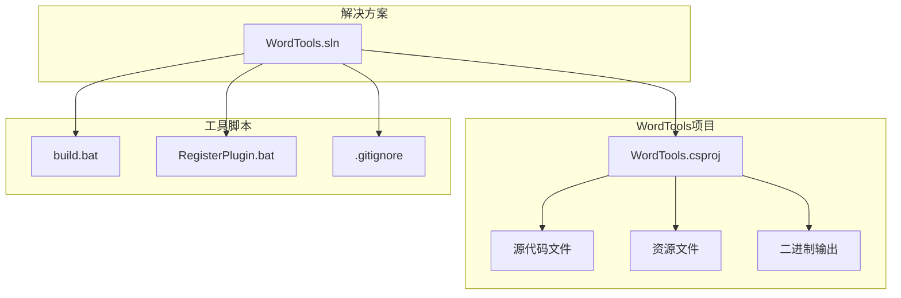
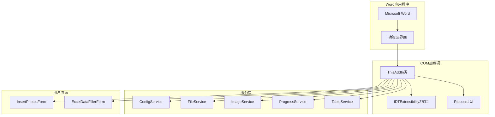
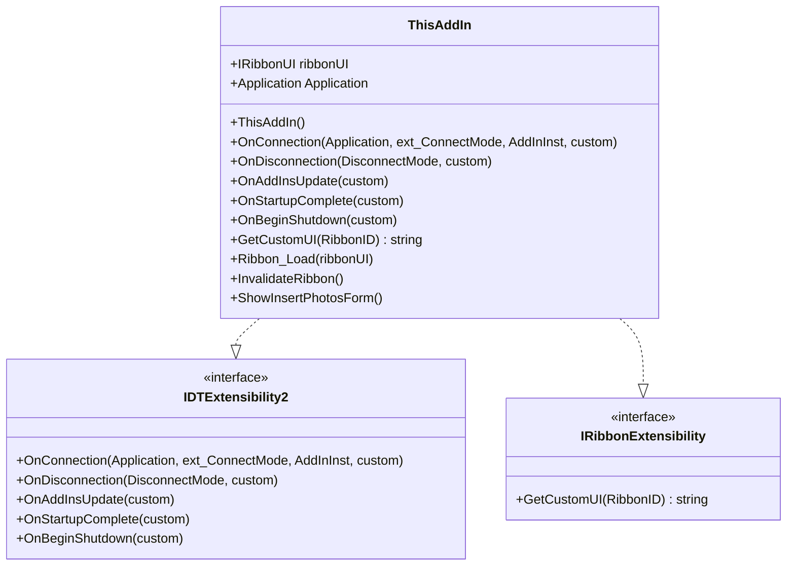
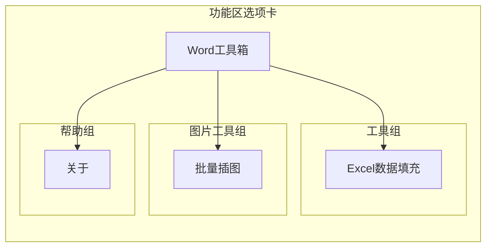
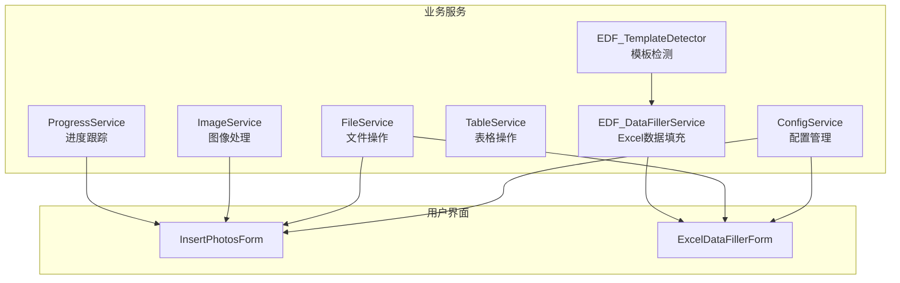
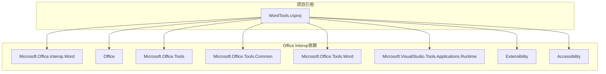
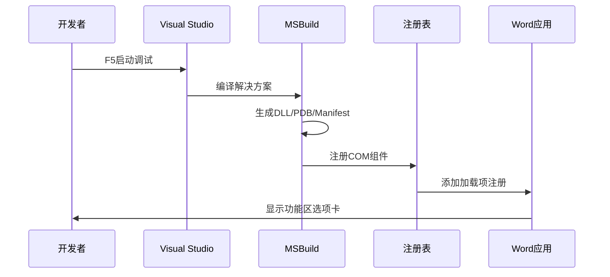

# 开发环境配置

<cite>
**本文档引用的文件**
- [WordTools.sln](file://WordTools.sln)
- [WordTools.csproj](file://WordTools/WordTools.csproj)
- [README.md](file://README.md)
- [build.bat](file://build.bat)
- [RegisterPlugin.bat](file://RegisterPlugin.bat)
- [.gitignore](file://.gitignore)
- [AssemblyInfo.cs](file://WordTools/Properties/AssemblyInfo.cs)
- [ThisAddIn.cs](file://WordTools/ThisAddIn.cs)
- [Ribbon.cs](file://WordTools/Ribbon.cs)
- [Ribbon.xml](file://WordTools/Ribbon.xml)
- [ConfigService.cs](file://WordTools/Services/ConfigService.cs)
- [FileService.cs](file://WordTools/Services/FileService.cs)
- [InsertPhotosForm.cs](file://WordTools/Forms/InsertPhotosForm.cs)
</cite>

## 目录
1. [简介](#简介)
2. [项目结构](#项目结构)
3. [核心组件](#核心组件)
4. [架构概览](#架构概览)
5. [详细组件分析](#详细组件分析)
6. [依赖关系分析](#依赖关系分析)
7. [性能考虑](#性能考虑)
8. [故障排除指南](#故障排除指南)
9. [结论](#结论)
10. [附录](#附录)

## 简介
本指南面向WordTools项目的开发者，提供完整的开发环境配置说明。WordTools是一个基于COM加载项的Word插件，采用C#开发，目标框架为.NET Framework 4.8，通过Visual Studio进行开发和调试。项目使用Microsoft Office Interop库与Word进行交互，并通过功能区（Ribbon）提供用户界面。

## 项目结构
项目采用典型的Visual Studio解决方案结构，包含一个主项目WordTools以及相关的配置文件和批处理脚本：

**图表来源**
- [WordTools.sln:1-19](file://WordTools.sln#L1-L19)
- [WordTools.csproj:1-149](file://WordTools/WordTools.csproj#L1-L149)

**章节来源**
- [WordTools.sln:1-19](file://WordTools.sln#L1-L19)
- [WordTools.csproj:1-149](file://WordTools/WordTools.csproj#L1-L149)

## 核心组件
WordTools项目的核心组件包括：

### 解决方案文件
- **WordTools.sln**: Visual Studio解决方案文件，定义了项目配置和构建选项
- 支持Debug和Release两种配置
- 平台目标为Any CPU

### 项目配置文件
- **WordTools.csproj**: MSBuild项目文件，定义了编译设置、引用和构建目标
- 目标框架：.NET Framework 4.8
- COM加载项配置：实现IDTExtensibility2接口

### 程序集信息
- **AssemblyInfo.cs**: 程序集元数据配置
- 版本信息：1.0.0.0
- COM可见性：false（默认）

**章节来源**
- [WordTools.sln:1-19](file://WordTools.sln#L1-L19)
- [WordTools.csproj:1-149](file://WordTools/WordTools.csproj#L1-L149)
- [AssemblyInfo.cs:1-35](file://WordTools/Properties/AssemblyInfo.cs#L1-L35)

## 架构概览
WordTools采用COM加载项架构，通过IDTExtensibility2接口与Word集成：

**图表来源**
- [ThisAddIn.cs:17-175](file://WordTools/ThisAddIn.cs#L17-L175)
- [Ribbon.cs:14-190](file://WordTools/Ribbon.cs#L14-L190)
- [ConfigService.cs:11-463](file://WordTools/Services/ConfigService.cs#L11-L463)

## 详细组件分析

### ThisAddIn - 插件入口点
ThisAddIn类实现了IDTExtensibility2接口，是WordTools的核心入口：

**图表来源**
- [ThisAddIn.cs:17-175](file://WordTools/ThisAddIn.cs#L17-L175)

### Ribbon - 功能区实现
功能区系统提供了用户界面，包含三个主要功能组：

**图表来源**
- [Ribbon.xml:1-53](file://WordTools/Ribbon.xml#L1-L53)
- [Ribbon.cs:14-190](file://WordTools/Ribbon.cs#L14-L190)

### 服务层架构
项目采用分层的服务架构，每个服务负责特定的功能领域：

**图表来源**
- [ConfigService.cs:11-463](file://WordTools/Services/ConfigService.cs#L11-L463)
- [FileService.cs:13-310](file://WordTools/Services/FileService.cs#L13-L310)
- [InsertPhotosForm.cs:19-574](file://WordTools/Forms/InsertPhotosForm.cs#L19-L574)

**章节来源**
- [ThisAddIn.cs:17-175](file://WordTools/ThisAddIn.cs#L17-L175)
- [Ribbon.cs:14-190](file://WordTools/Ribbon.cs#L14-L190)
- [Ribbon.xml:1-53](file://WordTools/Ribbon.xml#L1-L53)
- [ConfigService.cs:11-463](file://WordTools/Services/ConfigService.cs#L11-L463)
- [FileService.cs:13-310](file://WordTools/Services/FileService.cs#L13-L310)
- [InsertPhotosForm.cs:19-574](file://WordTools/Forms/InsertPhotosForm.cs#L19-L574)

## 依赖关系分析

### Office Interop库依赖
项目使用多个Microsoft Office Interop库：

**图表来源**
- [WordTools.csproj:63-88](file://WordTools/WordTools.csproj#L63-L88)

### 构建和部署流程

**图表来源**
- [build.bat:94-100](file://build.bat#L94-L100)
- [RegisterPlugin.bat:39-62](file://RegisterPlugin.bat#L39-L62)

**章节来源**
- [WordTools.csproj:63-88](file://WordTools/WordTools.csproj#L63-L88)
- [build.bat:94-100](file://build.bat#L94-L100)
- [RegisterPlugin.bat:39-62](file://RegisterPlugin.bat#L39-L62)

## 性能考虑
- **内存管理**: Office Interop对象需要及时释放，避免内存泄漏
- **批量操作**: 大量图片插入时使用ProgressService进行进度反馈
- **文件I/O优化**: 使用自然排序算法提高文件处理效率
- **COM调用优化**: 减少不必要的Word对象访问频率

## 故障排除指南

### 常见环境问题及解决方案

#### 1. Office Interop库缺失
**问题**: 编译时报错找不到Office Interop引用
**解决方案**: 
- 确保安装了Microsoft Office开发工具
- 检查Visual Studio的Office/SharePoint开发工作负载
- 验证Office Interop库的HintPath路径

#### 2. COM注册失败
**问题**: 运行RegisterPlugin.bat时注册失败
**解决方案**:
- 以管理员身份运行脚本
- 确认.NET Framework 4.0 RegAsm可用
- 检查Word是否完全关闭

#### 3. 调试配置问题
**问题**: F5调试时无法连接到Word
**解决方案**:
- 确保项目配置为Debug模式
- 检查目标框架为.NET Framework 4.8
- 验证COM可见性设置

#### 4. 功能区不显示
**问题**: Word中看不到"Word工具箱"选项卡
**解决方案**:
- 检查加载项是否在Word加载项管理器中启用
- 验证Ribbon XML资源正确嵌入
- 确认程序集已正确注册

**章节来源**
- [RegisterPlugin.bat:8-32](file://RegisterPlugin.bat#L8-L32)
- [README.md:30-69](file://README.md#L30-L69)

## 结论
WordTools项目提供了一个完整的Word插件开发框架，采用COM加载项架构确保了与Word的深度集成。通过合理的项目结构、清晰的组件分离和服务层设计，开发者可以快速扩展功能并维护代码质量。建议开发者遵循本文档的环境配置指南，确保开发环境的一致性和可重复性。

## 附录

### 开发环境要求清单
- **操作系统**: Windows 7或更高版本
- **Office版本**: Microsoft Office 2010或更高版本（Word）
- **.NET Framework**: 4.8
- **开发工具**: Visual Studio 2022或更高版本
- **Office开发工具**: Office/SharePoint开发工作负载

### Git版本控制配置
项目使用标准的.gitignore配置，排除以下内容：
- Visual Studio生成的文件（.vs/, *.suo）
- 构建输出（bin/, obj/, *.dll, *.pdb）
- NuGet包缓存（packages/）
- 日志和临时文件（*.log, *.tmp）

### 调试配置要点
- **调试符号**: Debug配置启用完整调试符号
- **优化设置**: Debug配置禁用代码优化
- **平台目标**: Any CPU平台目标
- **COM注册**: 构建后自动注册插件