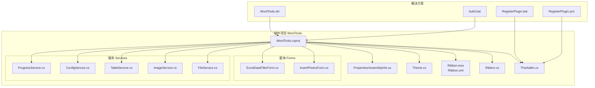
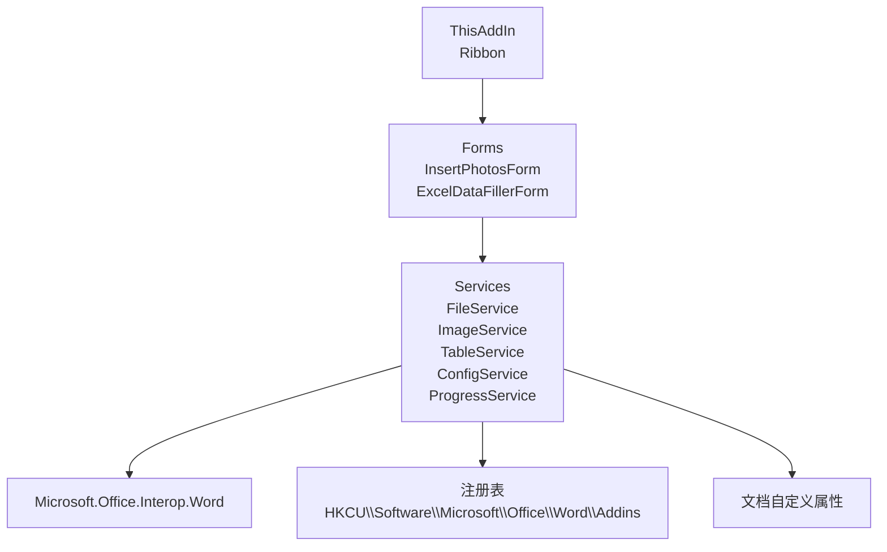
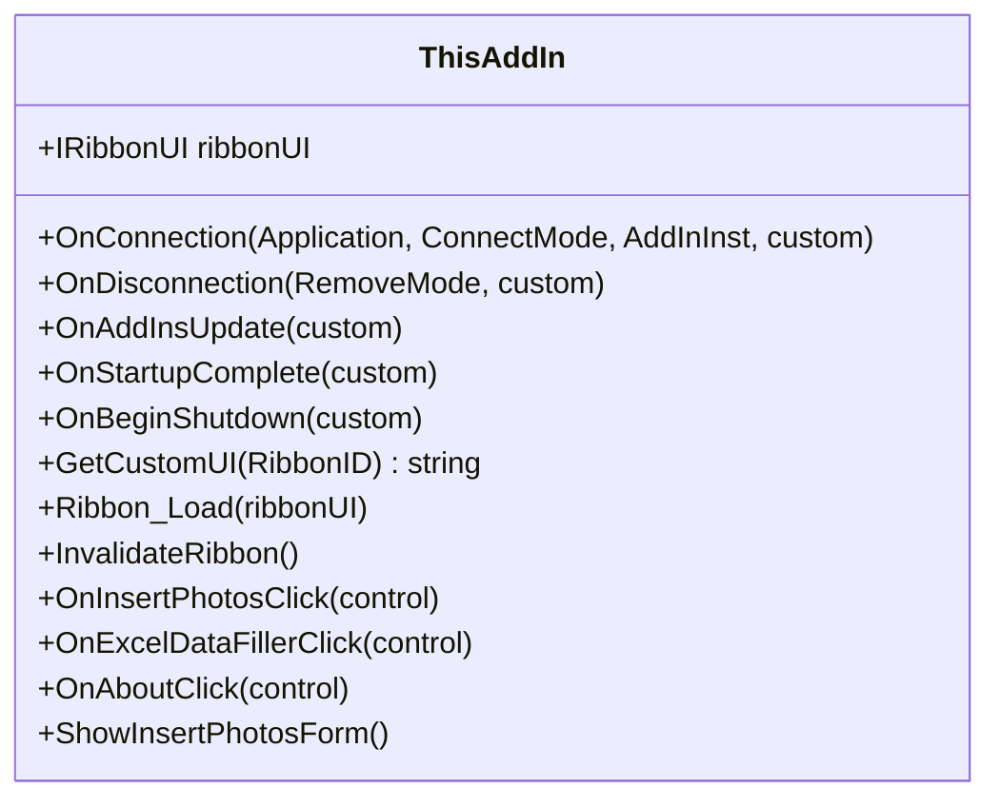
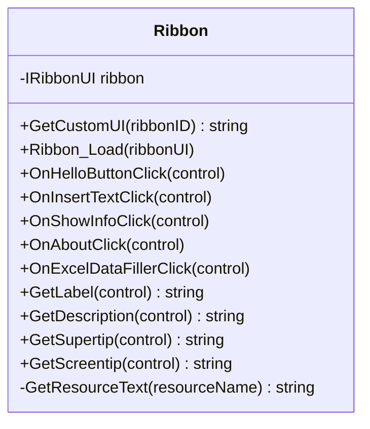
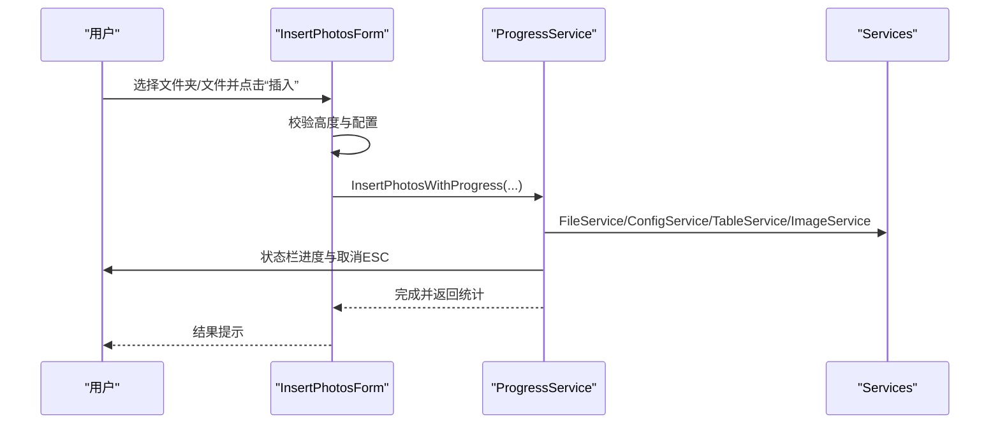
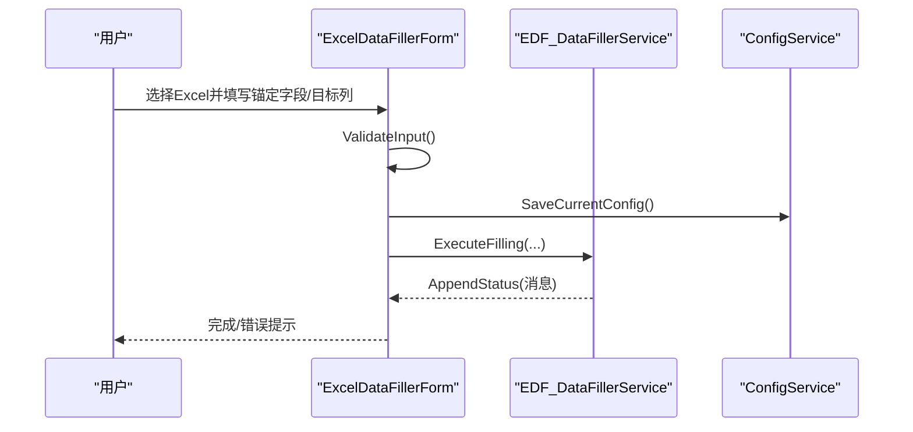
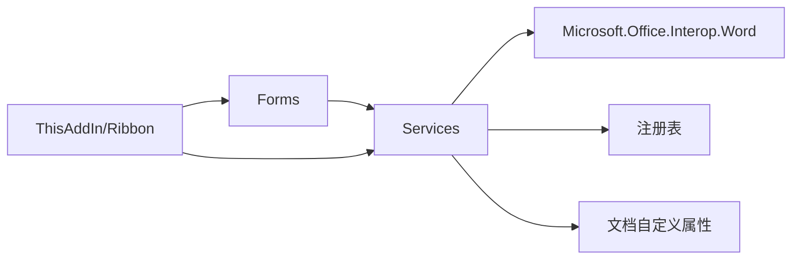

# 开发者指南

<cite>
**本文档引用的文件**
- [README.md](file://README.md)
- [WordTools.csproj](file://WordTools/WordTools.csproj)
- [ThisAddIn.cs](file://WordTools/ThisAddIn.cs)
- [Ribbon.cs](file://WordTools/Ribbon.cs)
- [build.bat](file://build.bat)
- [FileService.cs](file://WordTools/Services/FileService.cs)
- [ImageService.cs](file://WordTools/Services/ImageService.cs)
- [TableService.cs](file://WordTools/Services/TableService.cs)
- [ConfigService.cs](file://WordTools/Services/ConfigService.cs)
- [ProgressService.cs](file://WordTools/Services/ProgressService.cs)
- [InsertPhotosForm.cs](file://WordTools/Forms/InsertPhotosForm.cs)
- [ExcelDataFillerForm.cs](file://WordTools/Forms/ExcelDataFillerForm.cs)
- [Theme.cs](file://WordTools/Theme.cs)
- [RegisterPlugin.bat](file://RegisterPlugin.bat)
- [RegisterPlugin.ps1](file://RegisterPlugin.ps1)
</cite>

## 目录
1. [简介](#简介)
2. [项目结构](#项目结构)
3. [核心组件](#核心组件)
4. [架构概览](#架构概览)
5. [详细组件分析](#详细组件分析)
6. [依赖关系分析](#依赖关系分析)
7. [性能考量](#性能考量)
8. [故障排除指南](#故障排除指南)
9. [结论](#结论)
10. [附录](#附录)

## 简介
本指南面向WordTools项目的开发者，系统性阐述项目的代码结构、命名约定、文件布局、扩展开发原则、调试与测试方法、构建与部署流程、版本控制与发布管理、代码审查标准与质量保证措施，并提供常见问题的解决方案与贡献者参与流程。项目采用COM加载项（IDTExtensibility2）实现，无需VSTO运行时，通过功能区（Ribbon）提供用户交互界面。

## 项目结构
项目采用“功能域+层次”混合组织方式：
- Solution层：解决方案文件与构建脚本
- 插件层：WordTools项目，包含入口、功能区、窗体与服务模块
- 服务层：文件、图像、表格、配置、进度等服务
- 界面层：WinForms窗体与主题样式

**图表来源**
- [WordTools.csproj:99-131](file://WordTools/WordTools.csproj#L99-L131)
- [ThisAddIn.cs:100-122](file://WordTools/ThisAddIn.cs#L100-L122)
- [Ribbon.cs:24-27](file://WordTools/Ribbon.cs#L24-L27)
- [build.bat:94-109](file://build.bat#L94-L109)

**章节来源**
- [README.md:47-61](file://README.md#L47-L61)
- [WordTools.csproj:1-149](file://WordTools/WordTools.csproj#L1-L149)

## 核心组件
- 插件入口（ThisAddIn）：实现IDTExtensibility2与IRibbonExtensibility，负责插件生命周期与功能区回调。
- 功能区（Ribbon）：定义UI布局与回调，提供批量插图、Excel数据填充、关于等命令。
- 窗体（Forms）：InsertPhotosForm与ExcelDataFillerForm，承载用户交互与业务逻辑。
- 服务（Services）：FileService（文件与目录）、ImageService（图片插入与尺寸）、TableService（表格与编号）、ConfigService（配置持久化）、ProgressService（批量处理与性能优化）。
- 主题（Theme）：统一UI样式、颜色、字体与布局。

**章节来源**
- [ThisAddIn.cs:17-174](file://WordTools/ThisAddIn.cs#L17-L174)
- [Ribbon.cs:14-189](file://WordTools/Ribbon.cs#L14-L189)
- [InsertPhotosForm.cs:19-574](file://WordTools/Forms/InsertPhotosForm.cs#L19-L574)
- [ExcelDataFillerForm.cs:12-432](file://WordTools/Forms/ExcelDataFillerForm.cs#L12-L432)
- [FileService.cs:13-310](file://WordTools/Services/FileService.cs#L13-L310)
- [ImageService.cs:10-325](file://WordTools/Services/ImageService.cs#L10-L325)
- [TableService.cs:11-756](file://WordTools/Services/TableService.cs#L11-L756)
- [ConfigService.cs:11-463](file://WordTools/Services/ConfigService.cs#L11-L463)
- [ProgressService.cs:14-571](file://WordTools/Services/ProgressService.cs#L14-L571)
- [Theme.cs:11-358](file://WordTools/Theme.cs#L11-L358)

## 架构概览
系统采用分层架构：
- 表现层：ThisAddIn与Ribbon负责UI与用户交互；Forms承载具体业务窗体。
- 业务层：各Service封装业务规则与数据处理。
- 数据访问层：ConfigService通过文档自定义属性与注册表持久化配置。
- COM集成：通过IDTExtensibility2与Office互操作访问Word对象模型。

**图表来源**
- [ThisAddIn.cs:37-83](file://WordTools/ThisAddIn.cs#L37-L83)
- [Ribbon.cs:24-161](file://WordTools/Ribbon.cs#L24-L161)
- [ConfigService.cs:26-142](file://WordTools/Services/ConfigService.cs#L26-L142)

## 详细组件分析

### 插件入口（ThisAddIn）
- 职责：实现IDTExtensibility2生命周期回调，注入Globals与Application；实现IRibbonExtensibility加载Ribbon XML；提供Ribbon回调（批量插图、Excel数据填充、关于）。
- 关键点：COM可见性、GUID与ProgId声明；Ribbon加载通过资源流读取XML；回调中弹出窗体或执行服务逻辑；提供InvalidateRibbon刷新UI状态。

**图表来源**
- [ThisAddIn.cs:17-174](file://WordTools/ThisAddIn.cs#L17-L174)

**章节来源**
- [ThisAddIn.cs:17-174](file://WordTools/ThisAddIn.cs#L17-L174)

### 功能区（Ribbon）
- 职责：加载Ribbon XML资源，提供按钮回调；动态获取标签、描述、超级提示；与ThisAddIn协作。
- 关键点：GetCustomUI从资源读取XML；回调中校验活动文档；弹窗或插入文本/信息。

**图表来源**
- [Ribbon.cs:14-189](file://WordTools/Ribbon.cs#L14-L189)

**章节来源**
- [Ribbon.cs:24-189](file://WordTools/Ribbon.cs#L24-L189)

### 批量插图窗体（InsertPhotosForm）
- 职责：提供批量插图配置界面，调用ProgressService执行插入与编号。
- 关键点：DPI缩放与主题样式；配置加载/保存；事件驱动的文件夹/文件选择；高度校验与预处理。

**图表来源**
- [InsertPhotosForm.cs:481-524](file://WordTools/Forms/InsertPhotosForm.cs#L481-L524)
- [ProgressService.cs:151-306](file://WordTools/Services/ProgressService.cs#L151-L306)

**章节来源**
- [InsertPhotosForm.cs:481-574](file://WordTools/Forms/InsertPhotosForm.cs#L481-L574)

### Excel数据填充窗体（ExcelDataFillerForm）
- 职责：配置Excel锚定字段、目标列、Sample Size替换等，调用EDF服务执行填充。
- 关键点：输入验证；状态输出；同步执行（COM STA要求）。

**图表来源**
- [ExcelDataFillerForm.cs:299-355](file://WordTools/Forms/ExcelDataFillerForm.cs#L299-L355)
- [ConfigService.cs:397-409](file://WordTools/Services/ConfigService.cs#L397-L409)

**章节来源**
- [ExcelDataFillerForm.cs:299-432](file://WordTools/Forms/ExcelDataFillerForm.cs#L299-L432)

### 文件服务（FileService）
- 职责：文件夹/图片选择、扩展名校验、文件列表获取、自然排序。
- 关键点：支持根目录与子目录扫描；自然排序算法；辅助方法（文件名、父目录等）。

**图表来源**
- [FileService.cs:26-188](file://WordTools/Services/FileService.cs#L26-L188)

**章节来源**
- [FileService.cs:13-310](file://WordTools/Services/FileService.cs#L13-L310)

### 图像服务（ImageService）
- 职责：图片插入、尺寸转换、批量调整、预分配行数。
- 关键点：保持纵横比；单元格边距处理；最小高度约束；快速插入策略。

**章节来源**
- [ImageService.cs:10-325](file://WordTools/Services/ImageService.cs#L10-L325)

### 表格服务（TableService）
- 职责：表格验证、单元格适配、标题/描述行、自动编号、行/列调整。
- 关键点：清除编号与文本；识别描述行；自定义列表模板；对齐方式设置。

**章节来源**
- [TableService.cs:11-756](file://WordTools/Services/TableService.cs#L11-L756)

### 配置服务（ConfigService）
- 职责：文档自定义属性与注册表配置持久化；提供默认值回退。
- 关键点：文档属性优先；空值特殊标记；应用级配置（自动编号、对齐）。

**章节来源**
- [ConfigService.cs:11-463](file://WordTools/Services/ConfigService.cs#L11-L463)

### 进度服务（ProgressService）
- 职责：批量处理进度、取消控制（ESC）、性能优化（关闭屏幕更新/警告）、内存清理。
- 关键点：根据文件数量动态调整刷新/清理/保存间隔；预分配行数；状态栏实时更新。

**章节来源**
- [ProgressService.cs:14-571](file://WordTools/Services/ProgressService.cs#L14-L571)

### 主题（Theme）
- 职责：统一颜色、字体、布局与控件样式；DPI缩放；按钮/标签/分隔线创建。
- 关键点：ApplyFormDefaults；Scale；CenterTextVertically。

**章节来源**
- [Theme.cs:11-358](file://WordTools/Theme.cs#L11-L358)

## 依赖关系分析
- 项目依赖：Microsoft.Office.Interop.Word、Office、Extensibility、System.Windows.Forms等。
- 服务内聚：各Service职责单一，通过接口（静态类）对外暴露。
- 组件耦合：窗体依赖服务；服务依赖Word互操作；配置服务依赖注册表与文档属性。

**图表来源**
- [WordTools.csproj:60-98](file://WordTools/WordTools.csproj#L60-L98)
- [ConfigService.cs:26-142](file://WordTools/Services/ConfigService.cs#L26-L142)

**章节来源**
- [WordTools.csproj:60-98](file://WordTools/WordTools.csproj#L60-L98)

## 性能考量
- COM性能优化：关闭ScreenUpdating与DisplayAlerts，减少UI刷新与警告弹窗。
- 批处理策略：批量预分配行数、分批处理、定期GC与DoEvents。
- 用户中断：ESC键检测与标志位控制，及时退出循环。
- 图片处理：快速插入策略，避免过度计算；单元格边距与最小高度约束。

**章节来源**
- [ProgressService.cs:73-142](file://WordTools/Services/ProgressService.cs#L73-L142)
- [ImageService.cs:142-180](file://WordTools/Services/ImageService.cs#L142-L180)

## 故障排除指南
- 插件未显示“Word工具箱”选项卡
  - 检查是否以管理员身份运行注册脚本（RegisterPlugin.bat/ps1）。
  - 确认已添加注册表项并重启Word。
  - 参考注册脚本与README中的安装步骤。
- COM注册失败
  - 确认已编译生成WordTools.dll。
  - 检查RegAsm路径与.NET Framework版本。
- 批量插图无响应或缓慢
  - 确认进入高性能模式（进度服务自动处理）。
  - 减少同时处理的图片数量或调整最小高度。
- Excel数据填充报错
  - 校验锚定字段、目标列与Sample Size列配置。
  - 确保Excel文件路径正确且文件未被占用。

**章节来源**
- [RegisterPlugin.bat:8-32](file://RegisterPlugin.bat#L8-L32)
- [RegisterPlugin.ps1:11-36](file://RegisterPlugin.ps1#L11-L36)
- [README.md:30-75](file://README.md#L30-L75)

## 结论
WordTools项目通过清晰的分层与职责划分，提供了稳定的Word COM加载项能力。开发者可基于现有服务与窗体快速扩展新功能，遵循本文档的命名约定、扩展原则与质量标准，确保系统的可维护性与可扩展性。

## 附录

### 开发环境配置
- 系统要求：Windows 7+，Office 2010+，.NET Framework 4.8。
- IDE：Visual Studio（推荐2022），启用调试（F5）自动注册插件。
- 构建：build.bat一键构建Release并复制部署文件；或使用VS生成解决方案。

**章节来源**
- [README.md:15-29](file://README.md#L15-L29)
- [build.bat:93-119](file://build.bat#L93-L119)

### 调试与测试
- 调试：F5启动VS，自动注册插件；断点设置在ThisAddIn、Ribbon回调与窗体事件中。
- 测试：单元测试建议针对纯函数（如FileService、ImageService的数学/字符串处理）；UI测试通过手动验证与日志输出结合。

**章节来源**
- [README.md:23-29](file://README.md#L23-L29)

### 构建与部署
- 构建脚本：build.bat自动定位MSBuild、生成强名称密钥（若存在）、还原NuGet、构建Release并复制发布文件。
- 部署：使用WordTools.vsto或手动注册COM组件并启用加载项。

**章节来源**
- [build.bat:8-61](file://build.bat#L8-L61)
- [build.bat:93-125](file://build.bat#L93-L125)
- [README.md:21-46](file://README.md#L21-L46)

### 版本控制与发布管理
- 版本：项目文件中包含版本信息与发布配置，建议配合Git标签进行发布。
- 发布：构建完成后在publish目录收集产物，打包发布。

**章节来源**
- [WordTools.csproj:16-30](file://WordTools/WordTools.csproj#L16-L30)

### 代码审查标准与质量保证
- 命名规范：类名使用帕斯卡命名；方法/属性使用帕斯卡命名；常量使用UPPER_CASE；私有成员使用下划线前缀。
- 结构：职责单一，异常处理覆盖关键路径；避免在UI线程阻塞长任务。
- 文档：README与注释明确用途、输入输出与边界条件。

**章节来源**
- [README.md:1-85](file://README.md#L1-L85)

### 许可证与知识产权
- 许可证：MIT License。

**章节来源**
- [README.md:82-85](file://README.md#L82-L85)