# 扩展开发指南

<cite>
**本文档引用的文件**
- [README.md](file://README.md)
- [WordTools.csproj](file://WordTools/WordTools.csproj)
- [Ribbon.cs](file://WordTools/Ribbon.cs)
- [Ribbon.xml](file://WordTools/Ribbon.xml)
- [ThisAddIn.cs](file://WordTools/ThisAddIn.cs)
- [ConfigService.cs](file://WordTools/Services/ConfigService.cs)
- [FileService.cs](file://WordTools/Services/FileService.cs)
- [ImageService.cs](file://WordTools/Services/ImageService.cs)
- [TableService.cs](file://WordTools/Services/TableService.cs)
- [ProgressService.cs](file://WordTools/Services/ProgressService.cs)
- [EDF_DataFillerService.cs](file://WordTools/Services/EDF_DataFillerService.cs)
- [EDF_TemplateDetector.cs](file://WordTools/Services/EDF_TemplateDetector.cs)
- [ExcelDataFillerForm.cs](file://WordTools/Forms/ExcelDataFillerForm.cs)
- [InsertPhotosForm.cs](file://WordTools/Forms/InsertPhotosForm.cs)
- [Theme.cs](file://WordTools/Theme.cs)
- [RegisterPlugin.bat](file://RegisterPlugin.bat)
- [RegisterPlugin.ps1](file://RegisterPlugin.ps1)
</cite>

## 目录
1. [简介](#简介)
2. [项目结构](#项目结构)
3. [核心组件](#核心组件)
4. [架构概览](#架构概览)
5. [详细组件分析](#详细组件分析)
6. [依赖关系分析](#依赖关系分析)
7. [性能考虑](#性能考虑)
8. [故障排除指南](#故障排除指南)
9. [结论](#结论)
10. [附录](#附录)

## 简介

WordTools是一个基于COM加载项的Word插件项目，为Microsoft Word功能区添加了"Word工具箱"自定义选项卡。该项目采用.NET Framework 4.8开发，实现了批量图片插入、Excel数据填充、自动编号等核心功能。

本指南旨在为开发者提供在现有架构基础上添加新功能模块的完整指导，包括服务层扩展、界面组件开发和插件功能增强的方法和最佳实践。

## 项目结构

WordTools项目采用清晰的分层架构设计，主要包含以下核心目录结构：

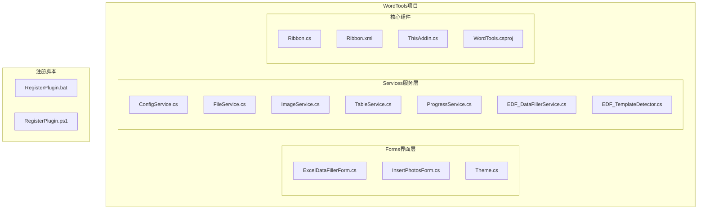

**图表来源**
- [WordTools.csproj:1-149](file://WordTools/WordTools.csproj#L1-L149)
- [Ribbon.cs:1-190](file://WordTools/Ribbon.cs#L1-L190)
- [ThisAddIn.cs:1-175](file://WordTools/ThisAddIn.cs#L1-L175)

**章节来源**
- [README.md:47-61](file://README.md#L47-L61)
- [WordTools.csproj:99-131](file://WordTools/WordTools.csproj#L99-L131)

## 核心组件

### 服务层架构

项目的服务层采用静态服务类和实例化服务类相结合的设计模式：

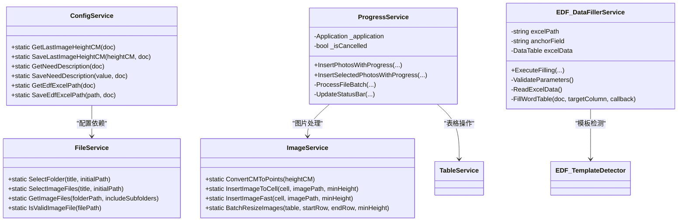

**图表来源**
- [ConfigService.cs:11-462](file://WordTools/Services/ConfigService.cs#L11-L462)
- [FileService.cs:13-309](file://WordTools/Services/FileService.cs#L13-L309)
- [ImageService.cs:10-324](file://WordTools/Services/ImageService.cs#L10-L324)
- [ProgressService.cs:14-569](file://WordTools/Services/ProgressService.cs#L14-L569)
- [EDF_DataFillerService.cs:14-563](file://WordTools/Services/EDF_DataFillerService.cs#L14-L563)

### 界面层设计

界面层采用统一的主题管理系统，确保视觉一致性：

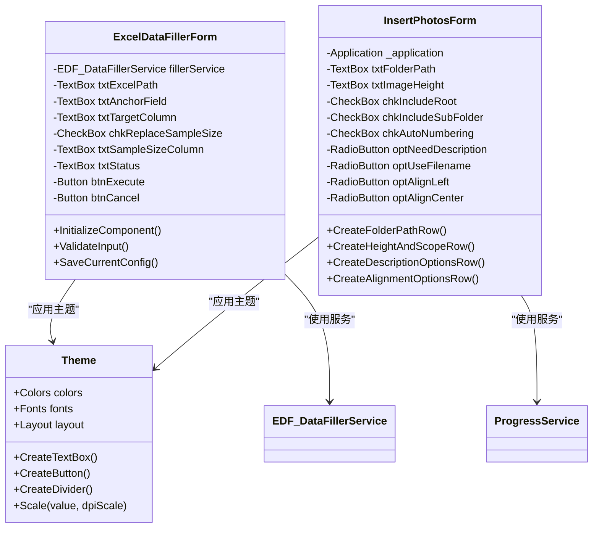

**图表来源**
- [ExcelDataFillerForm.cs:12-431](file://WordTools/Forms/ExcelDataFillerForm.cs#L12-L431)
- [InsertPhotosForm.cs:19-573](file://WordTools/Forms/InsertPhotosForm.cs#L19-L573)
- [Theme.cs:11-357](file://WordTools/Theme.cs#L11-L357)

**章节来源**
- [ExcelDataFillerForm.cs:38-227](file://WordTools/Forms/ExcelDataFillerForm.cs#L38-L227)
- [InsertPhotosForm.cs:49-100](file://WordTools/Forms/InsertPhotosForm.cs#L49-L100)
- [Theme.cs:16-128](file://WordTools/Theme.cs#L16-L128)

## 架构概览

WordTools采用经典的三层架构模式，结合COM加载项的特殊性：

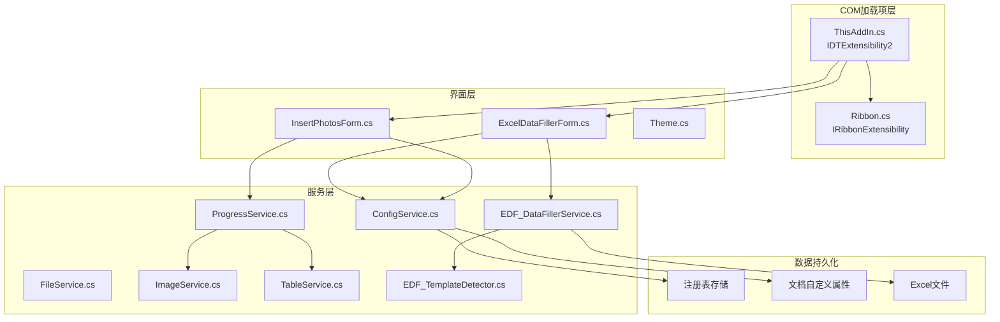

**图表来源**
- [ThisAddIn.cs:17-173](file://WordTools/ThisAddIn.cs#L17-L173)
- [Ribbon.cs:14-188](file://WordTools/Ribbon.cs#L14-L188)
- [ConfigService.cs:24-140](file://WordTools/Services/ConfigService.cs#L24-L140)

### 插件生命周期管理

COM加载项遵循严格的生命周期管理：

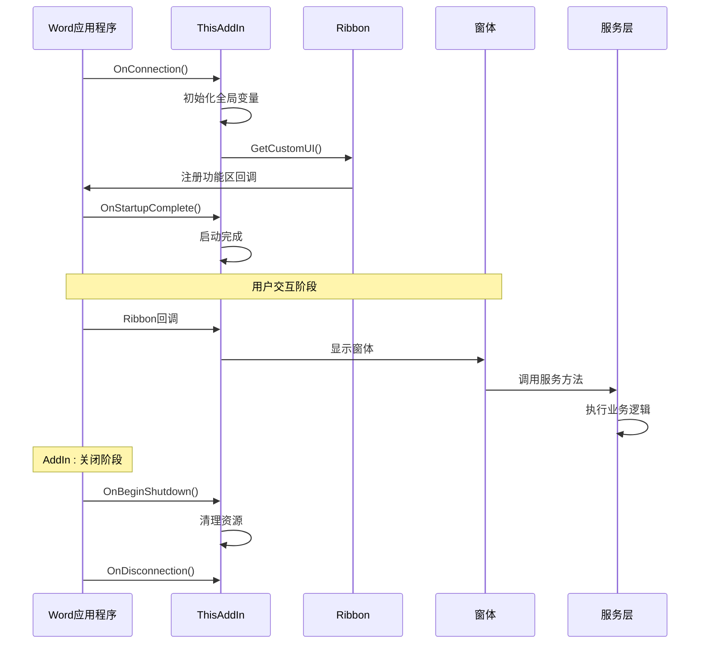

**图表来源**
- [ThisAddIn.cs:37-62](file://WordTools/ThisAddIn.cs#L37-L62)
- [Ribbon.cs:24-27](file://WordTools/Ribbon.cs#L24-L27)
- [ExcelDataFillerForm.cs:333-342](file://WordTools/Forms/ExcelDataFillerForm.cs#L333-L342)

**章节来源**
- [ThisAddIn.cs:27-62](file://WordTools/ThisAddIn.cs#L27-L62)
- [Ribbon.cs:33-93](file://WordTools/Ribbon.cs#L33-L93)

## 详细组件分析

### 配置系统扩展

配置系统采用双重存储机制，支持用户配置和文档特定配置：

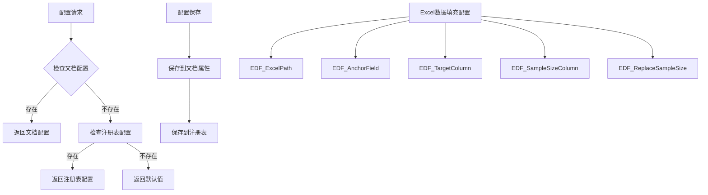

**图表来源**
- [ConfigService.cs:144-460](file://WordTools/Services/ConfigService.cs#L144-L460)

#### 配置扩展点

要添加新的配置项，需要：

1. **定义配置键常量**：在相应服务类中添加新的常量定义
2. **实现读取方法**：创建`Get[ConfigName]`方法
3. **实现保存方法**：创建`Save[ConfigName]`方法
4. **更新配置存储**：确保同时保存到文档属性和注册表

**章节来源**
- [ConfigService.cs:13-462](file://WordTools/Services/ConfigService.cs#L13-L462)

### 服务接口设计原则

服务层遵循以下设计原则：

#### 单一职责原则
每个服务类专注于特定的功能领域：
- `ConfigService`：配置管理
- `FileService`：文件操作
- `ImageService`：图片处理
- `TableService`：表格操作
- `ProgressService`：进度管理
- `EDF_DataFillerService`：Excel数据填充

#### 依赖注入模式
服务之间通过参数传递依赖关系，避免紧耦合：

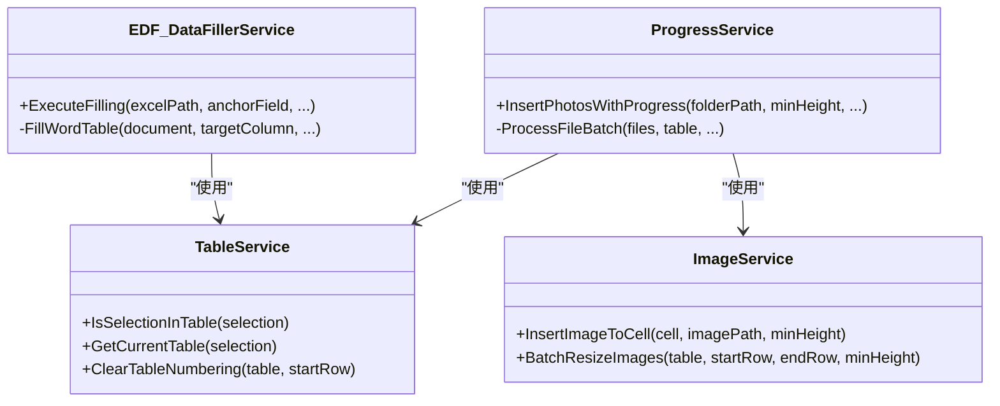

**图表来源**
- [ProgressService.cs:148-306](file://WordTools/Services/ProgressService.cs#L148-L306)
- [EDF_DataFillerService.cs:167-299](file://WordTools/Services/EDF_DataFillerService.cs#L167-L299)

**章节来源**
- [FileService.cs:13-309](file://WordTools/Services/FileService.cs#L13-L309)
- [ImageService.cs:10-324](file://WordTools/Services/ImageService.cs#L10-L324)

### 模板检测器扩展

模板检测器支持四种不同的表格结构：

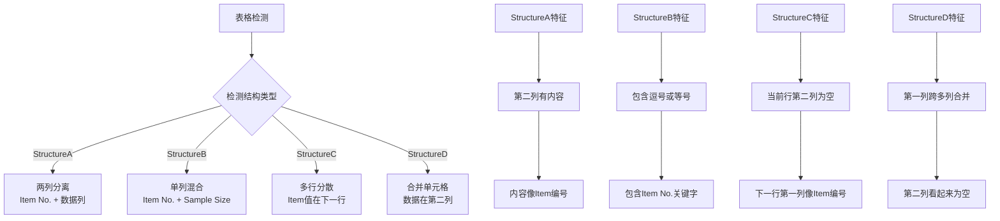

**图表来源**
- [EDF_TemplateDetector.cs:69-106](file://WordTools/Services/EDF_TemplateDetector.cs#L69-L106)

#### 自定义模板支持

要添加新的模板类型：

1. **定义模板类型枚举**：在`TemplateType`中添加新类型
2. **实现检测逻辑**：在`DetectTemplate`方法中添加检测条件
3. **实现填充策略**：在`EDF_DataFillerService`中添加对应的填充方法
4. **更新模板描述**：在`GetTemplateDescription`中添加描述文本

**章节来源**
- [EDF_TemplateDetector.cs:16-46](file://WordTools/Services/EDF_TemplateDetector.cs#L16-L46)
- [EDF_TemplateDetector.cs:108-210](file://WordTools/Services/EDF_TemplateDetector.cs#L108-L210)

### 界面组件开发

界面组件开发遵循统一的主题管理系统：

#### 主题系统架构

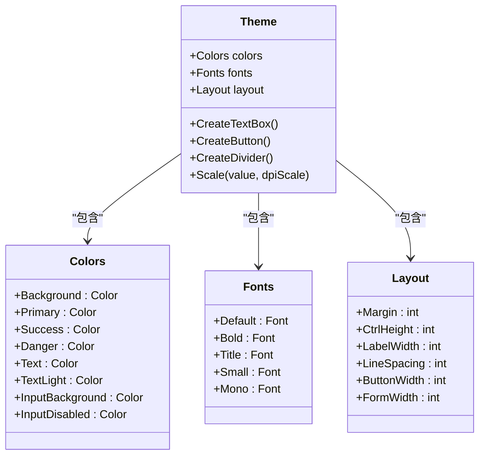

**图表来源**
- [Theme.cs:16-128](file://WordTools/Theme.cs#L16-L128)

#### 窗体开发最佳实践

1. **DPI适配**：使用`Theme.Scale()`方法进行缩放
2. **主题统一**：使用`Theme.CreateTextBox()`和`Theme.CreateButton()`
3. **布局管理**：使用`Theme.Layout`常量进行定位
4. **事件处理**：遵循现有的事件处理模式

**章节来源**
- [Theme.cs:135-171](file://WordTools/Theme.cs#L135-L171)
- [ExcelDataFillerForm.cs:232-235](file://WordTools/Forms/ExcelDataFillerForm.cs#L232-L235)

## 依赖关系分析

### 外部依赖

项目的主要外部依赖包括：

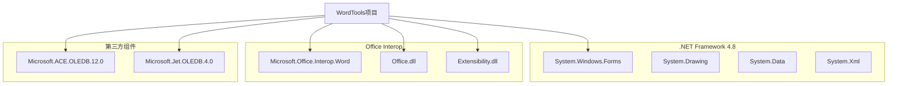

**图表来源**
- [WordTools.csproj:60-98](file://WordTools/WordTools.csproj#L60-L98)

### 内部依赖关系

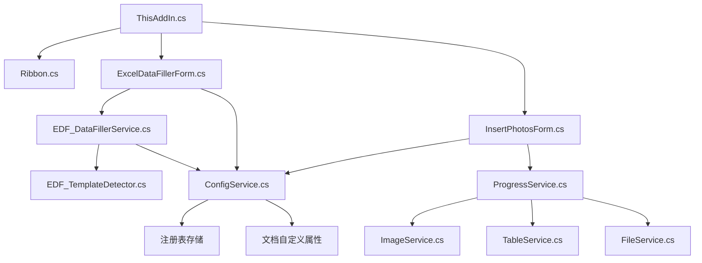

**图表来源**
- [ThisAddIn.cs:108-142](file://WordTools/ThisAddIn.cs#L108-L142)
- [EDF_DataFillerService.cs:62-64](file://WordTools/Services/EDF_DataFillerService.cs#L62-L64)

**章节来源**
- [WordTools.csproj:60-98](file://WordTools/WordTools.csproj#L60-L98)

## 性能考虑

### 批量处理优化

项目实现了多项性能优化措施：

1. **高性能模式**：在批量操作时禁用屏幕更新和警告提示
2. **内存管理**：定期触发垃圾回收，释放内存占用
3. **进度刷新优化**：根据文件数量动态调整刷新频率
4. **批量操作**：使用批量添加行和批量调整图片大小

### 性能监控

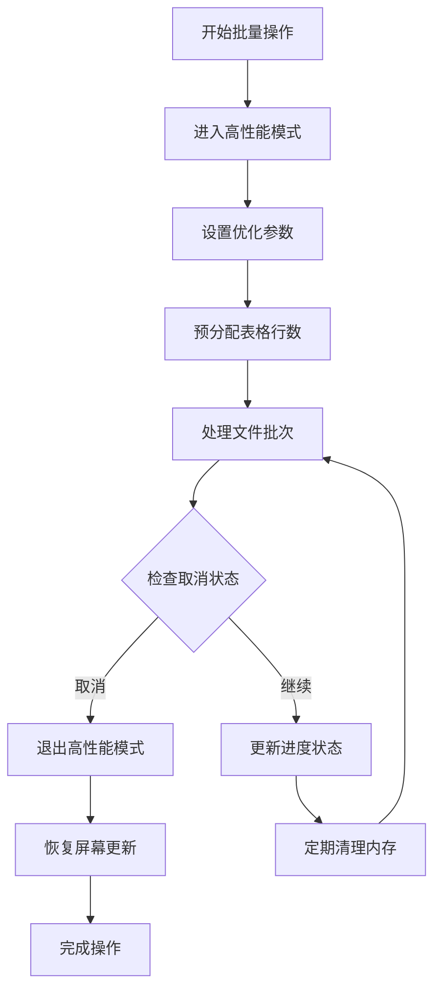

**图表来源**
- [ProgressService.cs:148-306](file://WordTools/Services/ProgressService.cs#L148-L306)

**章节来源**
- [ProgressService.cs:73-144](file://WordTools/Services/ProgressService.cs#L73-L144)
- [ProgressService.cs:408-533](file://WordTools/Services/ProgressService.cs#L408-L533)

## 故障排除指南

### 常见问题及解决方案

#### COM注册问题

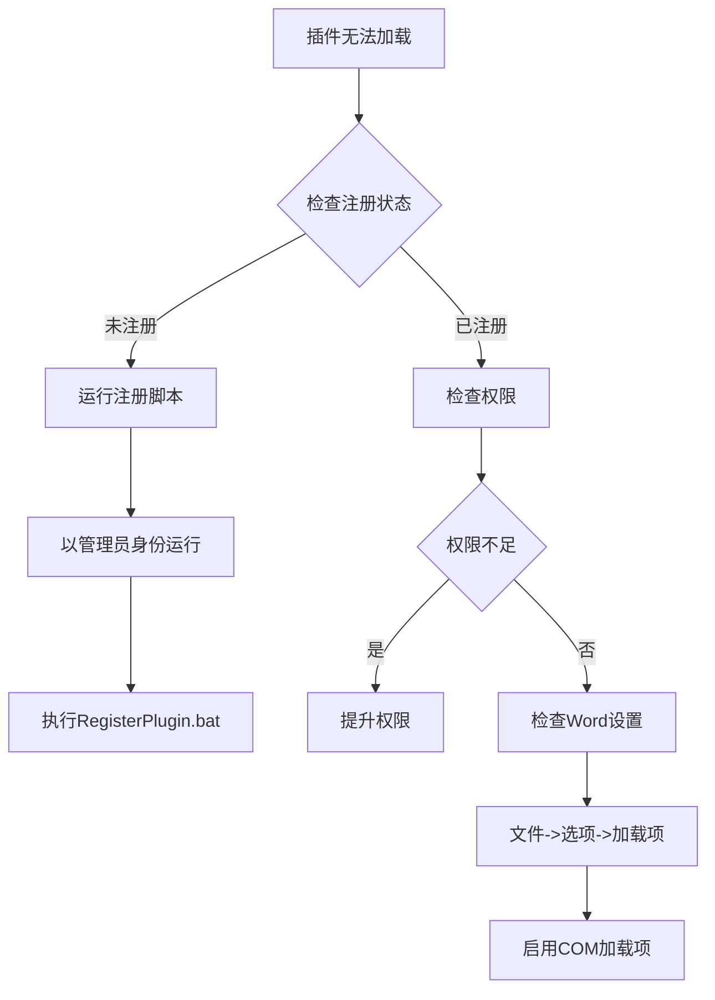

**图表来源**
- [RegisterPlugin.bat:8-15](file://RegisterPlugin.bat#L8-L15)

#### 功能区不显示

1. **重启Word**：完全关闭Word后再重新启动
2. **检查加载项**：在Word选项中确认插件已启用
3. **验证注册**：确认COM组件已正确注册

#### Excel数据填充失败

1. **检查Excel文件**：确保文件格式正确（.xlsx或.xls）
2. **验证锚定字段**：确认Word表格中存在匹配的锚定文本
3. **检查表格结构**：确保表格符合支持的模板类型

**章节来源**
- [RegisterPlugin.bat:64-79](file://RegisterPlugin.bat#L64-L79)
- [RegisterPlugin.ps1:71-85](file://RegisterPlugin.ps1#L71-L85)

## 结论

WordTools项目提供了一个完整的COM加载项开发框架，具有清晰的分层架构和良好的扩展性。通过遵循本文档提供的开发指南，开发者可以：

1. **快速集成新功能**：利用现有的服务层架构和主题系统
2. **保持代码质量**：遵循单一职责原则和依赖注入模式
3. **确保用户体验**：通过性能优化和错误处理提升稳定性
4. **简化维护工作**：通过统一的配置管理和注册机制

建议在扩展开发时重点关注配置系统的扩展、服务层的模块化设计和界面组件的一致性，以确保新功能能够无缝集成到现有架构中。

## 附录

### 开发环境要求

- **操作系统**：Windows 7或更高版本
- **Office版本**：Microsoft Office 2010或更高版本
- **.NET Framework**：4.8
- **开发工具**：Visual Studio 2019或更高版本

### 构建和部署

1. **本地开发**：使用Visual Studio直接调试
2. **手动注册**：运行`RegisterPlugin.bat`或`RegisterPlugin.ps1`
3. **卸载插件**：使用`regasm /u`命令反注册

### 扩展开发清单

- [ ] 定义新功能需求和架构设计
- [ ] 创建新的服务类或扩展现有服务
- [ ] 开发相应的界面组件
- [ ] 更新功能配置和存储逻辑
- [ ] 实现模板检测和填充逻辑
- [ ] 编写单元测试和集成测试
- [ ] 更新文档和用户说明
- [ ] 进行性能测试和优化