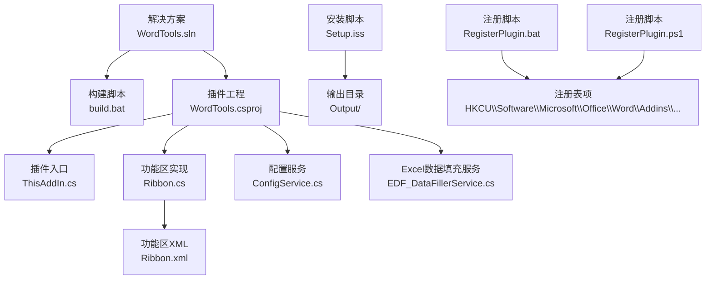
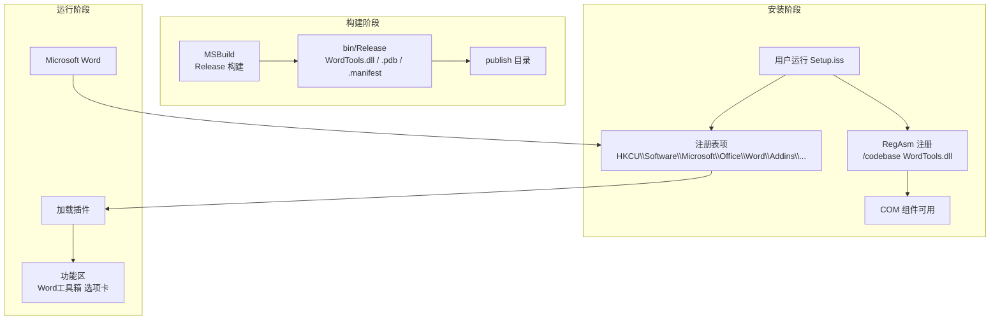
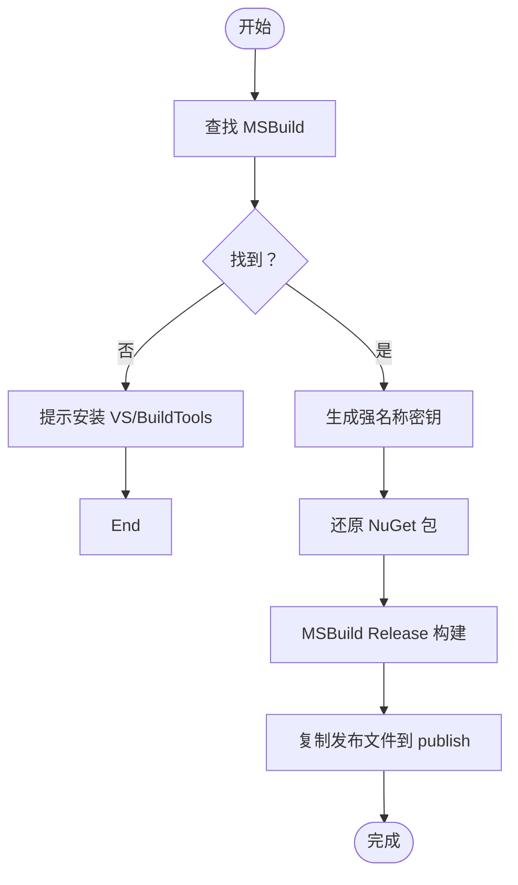
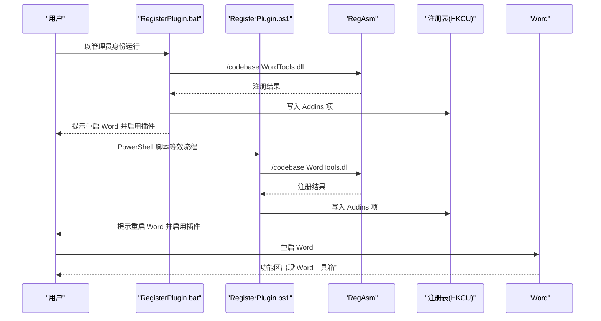
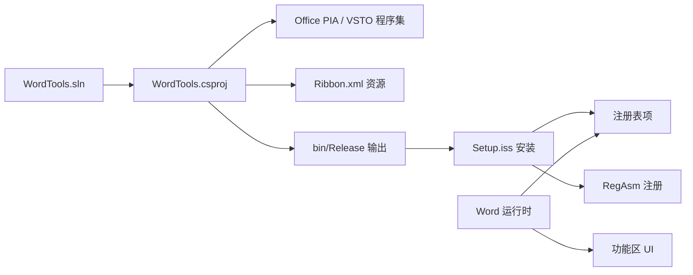

# 构建与部署

<cite>
**本文引用的文件**
- [WordTools.sln](file://WordTools.sln)
- [build.bat](file://build.bat)
- [Setup.iss](file://Setup.iss)
- [RegisterPlugin.bat](file://RegisterPlugin.bat)
- [RegisterPlugin.ps1](file://RegisterPlugin.ps1)
- [WordTools.csproj](file://WordTools/WordTools.csproj)
- [README.md](file://README.md)
- [ThisAddIn.cs](file://WordTools/ThisAddIn.cs)
- [Ribbon.cs](file://WordTools/Ribbon.cs)
- [Ribbon.xml](file://WordTools/Ribbon.xml)
- [AssemblyInfo.cs](file://WordTools/Properties/AssemblyInfo.cs)
- [ConfigService.cs](file://WordTools/Services/ConfigService.cs)
- [EDF_DataFillerService.cs](file://WordTools/Services/EDF_DataFillerService.cs)
</cite>

## 目录
1. [简介](#简介)
2. [项目结构](#项目结构)
3. [核心组件](#核心组件)
4. [架构总览](#架构总览)
5. [详细组件分析](#详细组件分析)
6. [依赖关系分析](#依赖关系分析)
7. [性能考虑](#性能考虑)
8. [故障排除指南](#故障排除指南)
9. [结论](#结论)
10. [附录](#附录)

## 简介
本指南面向WordTools项目的构建与部署，覆盖以下主题：
- 构建流程与配置选项（编译参数、输出目录、版本控制）
- 安装包制作（Inno Setup脚本配置与自定义）
- 插件注册机制（批处理与PowerShell脚本）
- 不同部署场景（开发/测试/生产）配置方案
- 注册表配置与Office插件安装验证
- 自动化部署脚本使用与定制
- 故障排除与常见问题
- 版本发布流程与回滚策略

## 项目结构
项目采用“解决方案 + Office VSTO/COM插件”组织方式，核心文件如下：
- 解决方案与构建：WordTools.sln、build.bat
- 安装包：Setup.iss
- 插件注册：RegisterPlugin.bat、RegisterPlugin.ps1
- 插件工程：WordTools/WordTools.csproj
- 插件入口与功能区：ThisAddIn.cs、Ribbon.cs、Ribbon.xml
- 程序集信息：AssemblyInfo.cs
- 配置与数据服务：ConfigService.cs、EDF_DataFillerService.cs

图表来源
- [WordTools.sln](file://WordTools.sln)
- [build.bat](file://build.bat)
- [Setup.iss](file://Setup.iss)
- [RegisterPlugin.bat](file://RegisterPlugin.bat)
- [RegisterPlugin.ps1](file://RegisterPlugin.ps1)
- [WordTools.csproj](file://WordTools/WordTools.csproj)
- [ThisAddIn.cs](file://WordTools/ThisAddIn.cs)
- [Ribbon.cs](file://WordTools/Ribbon.cs)
- [Ribbon.xml](file://WordTools/Ribbon.xml)
- [ConfigService.cs](file://WordTools/Services/ConfigService.cs)
- [EDF_DataFillerService.cs](file://WordTools/Services/EDF_DataFillerService.cs)

章节来源
- [WordTools.sln](file://WordTools.sln)
- [build.bat](file://build.bat)
- [Setup.iss](file://Setup.iss)
- [RegisterPlugin.bat](file://RegisterPlugin.bat)
- [RegisterPlugin.ps1](file://RegisterPlugin.ps1)
- [WordTools.csproj](file://WordTools/WordTools.csproj)

## 核心组件
- 构建与打包
  - build.bat：自动定位MSBuild、生成强名称密钥、还原NuGet包、构建Release、复制发布文件至publish目录。
  - WordTools.csproj：定义Debug/Release输出路径、目标框架、引用Office PIA、嵌入资源等。
- 安装与分发
  - Setup.iss：Inno Setup脚本，定义应用元数据、文件来源、注册表项、COM注册/反注册、安装后提示。
- 插件注册与验证
  - RegisterPlugin.bat：以管理员身份执行，使用RegAsm注册COM组件并在用户注册表添加Word Addins项。
  - RegisterPlugin.ps1：PowerShell等效实现，具备相同注册逻辑与交互提示。
- 插件主体
  - ThisAddIn.cs：实现IDTExtensibility2与IRibbonExtensibility，负责连接/断开、加载Ribbon XML。
  - Ribbon.cs/Ribbon.xml：定义功能区布局与按钮回调。
  - AssemblyInfo.cs：程序集版本与版权信息。

章节来源
- [build.bat](file://build.bat)
- [WordTools.csproj](file://WordTools/WordTools.csproj)
- [Setup.iss](file://Setup.iss)
- [RegisterPlugin.bat](file://RegisterPlugin.bat)
- [RegisterPlugin.ps1](file://RegisterPlugin.ps1)
- [ThisAddIn.cs](file://WordTools/ThisAddIn.cs)
- [Ribbon.cs](file://WordTools/Ribbon.cs)
- [Ribbon.xml](file://WordTools/Ribbon.xml)
- [AssemblyInfo.cs](file://WordTools/Properties/AssemblyInfo.cs)

## 架构总览
WordTools采用COM加载项模式（非VSTO），通过RegAsm注册COM组件，并在用户注册表中写入Word Addins项，使Word功能区出现“Word工具箱”选项卡。

图表来源
- [build.bat](file://build.bat)
- [Setup.iss](file://Setup.iss)
- [RegisterPlugin.bat](file://RegisterPlugin.bat)
- [RegisterPlugin.ps1](file://RegisterPlugin.ps1)
- [ThisAddIn.cs](file://WordTools/ThisAddIn.cs)

## 详细组件分析

### 构建流程与配置
- 编译器与工具链
  - 自动探测MSBuild路径（VS 2019/2022/2026、Build Tools），找不到则提示安装。
  - 生成强名称密钥（Key.snk），若失败则提示使用延迟签名。
  - 还原NuGet包后以Release配置、Any CPU平台构建。
- 输出与发布
  - Release输出目录：WordTools/bin/Release
  - 发布目录：复制WordTools.dll、.pdb、.manifest、WordTools.vsto至publish
- 版本控制
  - 程序集版本与文件版本在AssemblyInfo.cs中定义；项目文件包含版本占位符，实际版本由构建系统或CI注入。

图表来源
- [build.bat](file://build.bat)
- [WordTools.csproj](file://WordTools/WordTools.csproj)
- [AssemblyInfo.cs](file://WordTools/Properties/AssemblyInfo.cs)

章节来源
- [build.bat](file://build.bat)
- [WordTools.csproj](file://WordTools/WordTools.csproj)
- [AssemblyInfo.cs](file://WordTools/Properties/AssemblyInfo.cs)

### 安装包制作（Inno Setup）
- 应用元数据
  - 名称、版本、发布者、程序集ProgId、DLL名等通过宏定义集中管理。
- 文件来源
  - 来源目录指向Debug输出（注意：构建脚本复制到publish，安装脚本默认从Debug读取）。
- 注册表与COM注册
  - 安装后使用RegAsm以/codebase注册COM组件；卸载前反注册。
  - 写入用户注册表项，设置FriendlyName、Description、LoadBehavior、CommandLineSafe。
- 输出与语言
  - 输出目录Output，输出文件名前缀WordToolbox_Setup，现代向导风格，支持简体中文与英语。

图表来源
- [Setup.iss](file://Setup.iss)

章节来源
- [Setup.iss](file://Setup.iss)

### 插件注册机制（批处理与PowerShell）
- 权限要求
  - 必须以管理员身份运行，否则直接退出。
- 路径与工具
  - RegAsm路径固定为.NET Framework 4.0目录；DLL路径指向项目Debug输出。
- 注册步骤
  - 使用RegAsm以/codebase注册COM组件。
  - 在HKCU写入Word Addins项，设置友好名称、描述、加载行为等。
- 验证与后续
  - 提示完全关闭Word并重启，启用后功能区出现“Word工具箱”选项卡。

图表来源
- [RegisterPlugin.bat](file://RegisterPlugin.bat)
- [RegisterPlugin.ps1](file://RegisterPlugin.ps1)

章节来源
- [RegisterPlugin.bat](file://RegisterPlugin.bat)
- [RegisterPlugin.ps1](file://RegisterPlugin.ps1)

### 不同部署场景配置方案
- 开发环境
  - 使用Visual Studio直接调试（自动注册），或运行build.bat生成Release产物。
  - 安装脚本默认从Debug读取文件，若使用build.bat的publish目录，需调整Setup.iss的Source路径或保持Debug输出。
- 测试环境
  - 使用Inno Setup安装包进行端到端验证，确保RegAsm注册与注册表项正确。
  - 验证功能区按钮回调、窗体弹出、异常提示。
- 生产环境
  - 使用Setup.iss生成安装包，确保输出目录Output与安装后提示符合预期。
  - 对于企业部署，可将Setup.iss输出包纳入软件分发系统。

章节来源
- [build.bat](file://build.bat)
- [Setup.iss](file://Setup.iss)
- [README.md](file://README.md)

### 注册表配置与Office插件安装验证
- 注册表项
  - 路径：HKCU\Software\Microsoft\Office\Word\Addins\{ProgId}
  - 关键值：FriendlyName、Description、LoadBehavior、CommandLineSafe
- 验证方法
  - 重启Word后，功能区应出现“Word工具箱”选项卡。
  - 若未出现，确认RegAsm注册成功、注册表项存在且LoadBehavior为3。
  - 如需手动启用，可在Word“文件→选项→加载项”中启用COM加载项。

章节来源
- [Setup.iss](file://Setup.iss)
- [RegisterPlugin.bat](file://RegisterPlugin.bat)
- [RegisterPlugin.ps1](file://RegisterPlugin.ps1)
- [README.md](file://README.md)

### 自动化部署脚本使用与定制
- build.bat
  - 自动化：定位MSBuild、生成密钥、还原包、构建Release、复制发布文件。
  - 定制：修改输出目录、平台、配置；调整复制文件列表。
- Setup.iss
  - 自动化：一键安装、注册COM、写入注册表、安装后提示。
  - 定制：修改宏定义（版本、名称）、文件来源、输出目录、语言与向导样式。
- RegisterPlugin.bat / RegisterPlugin.ps1
  - 自动化：管理员权限校验、RegAsm注册、注册表写入。
  - 定制：调整DLL路径、注册表项、提示信息。

章节来源
- [build.bat](file://build.bat)
- [Setup.iss](file://Setup.iss)
- [RegisterPlugin.bat](file://RegisterPlugin.bat)
- [RegisterPlugin.ps1](file://RegisterPlugin.ps1)

## 依赖关系分析
- 构建与工程
  - WordTools.sln包含WordTools项目；build.bat调用MSBuild构建该解决方案。
  - WordTools.csproj引用Office PIA与VSTO相关程序集，目标框架为.NET Framework 4.8。
- 运行时依赖
  - ThisAddIn.cs实现IDTExtensibility2与IRibbonExtensibility，动态加载Ribbon.xml资源。
  - Ribbon.cs通过资源读取Ribbon.xml内容，定义按钮回调。
- 配置与数据
  - ConfigService.cs使用文档自定义属性与注册表存储用户配置。
  - EDF_DataFillerService.cs通过Word变量保存Excel数据填充配置。

图表来源
- [WordTools.sln](file://WordTools.sln)
- [WordTools.csproj](file://WordTools/WordTools.csproj)
- [Ribbon.xml](file://WordTools/Ribbon.xml)
- [Setup.iss](file://Setup.iss)

章节来源
- [WordTools.sln](file://WordTools.sln)
- [WordTools.csproj](file://WordTools/WordTools.csproj)
- [Ribbon.xml](file://WordTools/Ribbon.xml)
- [Setup.iss](file://Setup.iss)

## 性能考虑
- 构建性能
  - Release构建开启优化，减少调试符号与PDB体积，提升运行时性能。
  - 通过build.bat避免重复还原包与多次构建。
- 运行性能
  - Ribbon按钮回调尽量轻量，避免在UI线程执行耗时操作。
  - 配置读写优先使用文档自定义属性，降低磁盘访问频率。

## 故障排除指南
- 未找到MSBuild
  - 现象：构建脚本报错提示未找到MSBuild。
  - 处理：安装Visual Studio或Build Tools，确保MSBuild路径存在。
- 无法生成强名称密钥
  - 现象：生成Key.snk失败。
  - 处理：使用Visual Studio生成项目以自动生成密钥，或允许延迟签名。
- NuGet还原失败
  - 现象：构建阶段提示还原失败但继续构建。
  - 处理：检查网络与NuGet源配置，手动执行还原后再构建。
- RegAsm注册失败
  - 现象：COM组件注册失败。
  - 处理：以管理员身份运行注册脚本，确认RegAsm路径与DLL路径正确。
- 注册表项缺失或LoadBehavior不正确
  - 现象：Word未显示插件选项卡。
  - 处理：确认注册表项存在且LoadBehavior为3；重启Word后重试。
- 安装包未包含最新文件
  - 现象：安装后功能异常。
  - 处理：确认Setup.iss的Source路径与实际输出一致；建议使用build.bat的publish目录。

章节来源
- [build.bat](file://build.bat)
- [RegisterPlugin.bat](file://RegisterPlugin.bat)
- [RegisterPlugin.ps1](file://RegisterPlugin.ps1)
- [Setup.iss](file://Setup.iss)

## 结论
本指南提供了WordTools从构建到部署的完整路径：通过build.bat实现自动化构建与发布，使用Setup.iss生成安装包并完成COM注册与注册表配置，借助RegisterPlugin.bat/ps1快速验证插件在Word中的可用性。针对不同环境提供配置建议，并给出故障排除与版本发布/回滚策略，帮助团队高效、稳定地交付产品。

## 附录
- 版本发布流程建议
  - 规划版本号（AssemblyInfo.cs与Setup.iss宏定义），在构建前统一更新。
  - 生成Release构建与安装包，进行回归测试。
  - 发布前备份旧版安装包与注册表状态，便于回滚。
- 回滚策略
  - 使用Setup.iss的卸载流程反注册COM组件与删除注册表项。
  - 通过注册脚本回退到上一版本DLL，或重新安装旧版安装包。
- 常用命令参考
  - 构建：运行build.bat
  - 注册：以管理员身份运行RegisterPlugin.bat或RegisterPlugin.ps1
  - 卸载：以管理员身份运行RegAsm /u WordTools.dll，删除注册表项