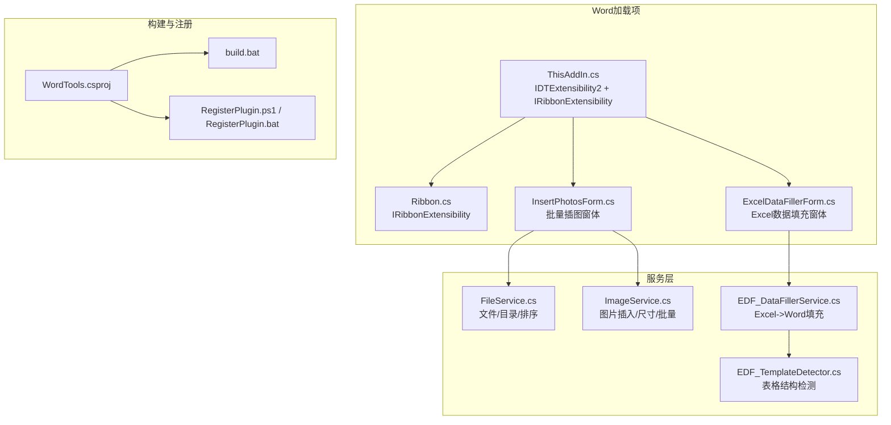
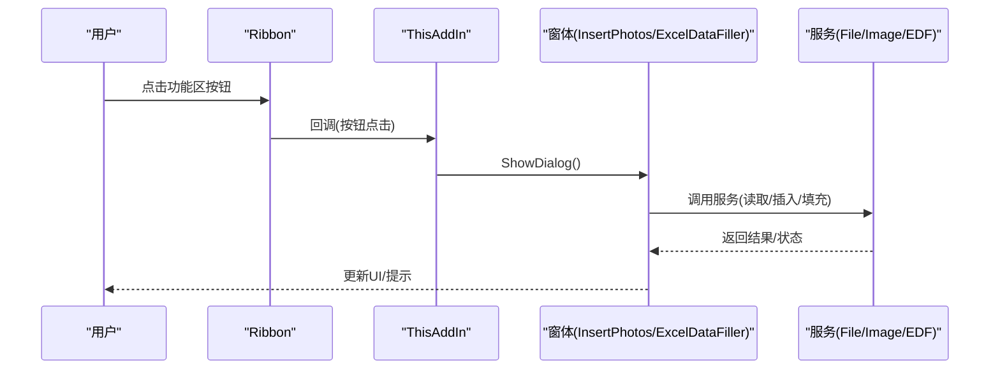
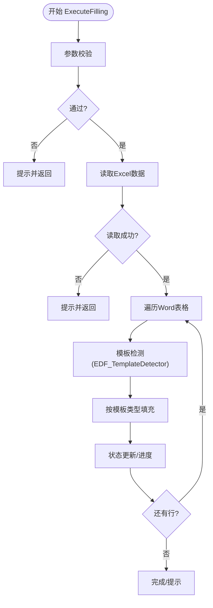
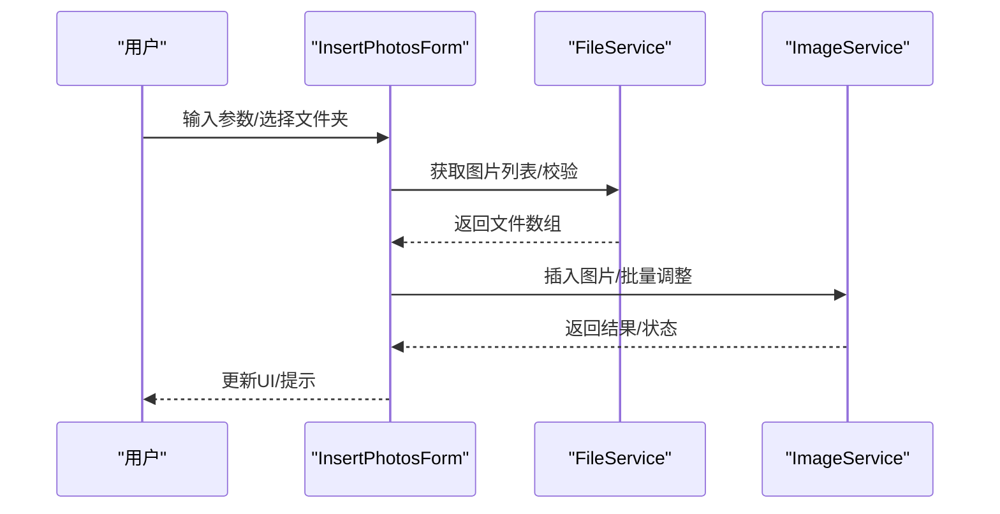
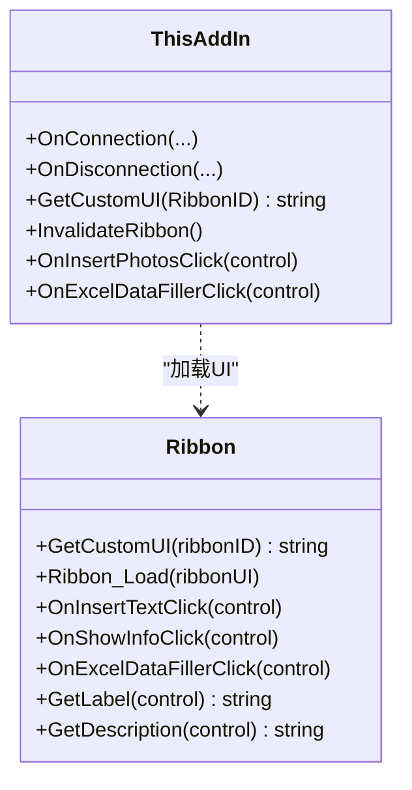
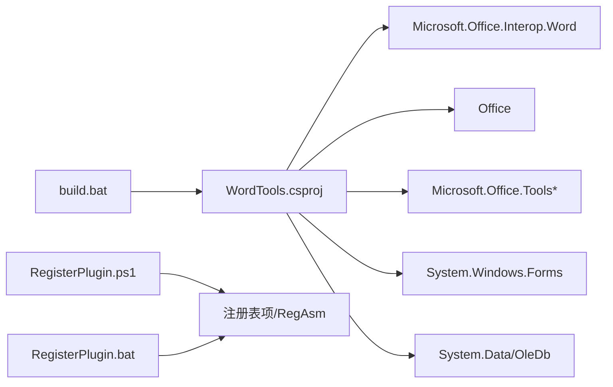

# 测试与调试

<cite>
**本文引用的文件**   
- [WordTools.csproj](file://WordTools/WordTools.csproj)
- [README.md](file://README.md)
- [build.bat](file://build.bat)
- [RegisterPlugin.ps1](file://RegisterPlugin.ps1)
- [RegisterPlugin.bat](file://RegisterPlugin.bat)
- [ThisAddIn.cs](file://WordTools/ThisAddIn.cs)
- [Ribbon.cs](file://WordTools/Ribbon.cs)
- [InsertPhotosForm.cs](file://WordTools/Forms/InsertPhotosForm.cs)
- [ExcelDataFillerForm.cs](file://WordTools/Forms/ExcelDataFillerForm.cs)
- [FileService.cs](file://WordTools/Services/FileService.cs)
- [ImageService.cs](file://WordTools/Services/ImageService.cs)
- [EDF_DataFillerService.cs](file://WordTools/Services/EDF_DataFillerService.cs)
- [EDF_TemplateDetector.cs](file://WordTools/Services/EDF_TemplateDetector.cs)
</cite>

## 目录
1. [简介](#简介)
2. [项目结构](#项目结构)
3. [核心组件](#核心组件)
4. [架构总览](#架构总览)
5. [详细组件分析](#详细组件分析)
6. [依赖关系分析](#依赖关系分析)
7. [性能考量](#性能考量)
8. [故障排查指南](#故障排查指南)
9. [结论](#结论)
10. [附录](#附录)

## 简介
本指南面向WordTools项目的测试与调试，覆盖单元测试与集成测试的设计方法、调试技巧与工具配置、Word插件特有的调试方式（COM组件与Office集成）、性能与内存检测、日志与错误追踪最佳实践、测试数据准备与模拟对象使用、常见问题诊断策略，以及测试自动化与持续集成的配置思路。文档同时提供可视化图示，帮助不同技术背景的读者快速理解系统行为与测试策略。

## 项目结构
WordTools是一个基于COM的Word加载项，采用WinForms窗体与Office Interop交互，核心模块包括：
- 插件入口与功能区：ThisAddIn、Ribbon
- 窗体与交互：InsertPhotosForm、ExcelDataFillerForm
- 业务服务：FileService、ImageService、EDF_DataFillerService、EDF_TemplateDetector
- 构建与注册：MSBuild工程、批处理与PowerShell注册脚本

**图表来源**
- [ThisAddIn.cs:17-174](file://WordTools/ThisAddIn.cs#L17-L174)
- [Ribbon.cs:14-189](file://WordTools/Ribbon.cs#L14-L189)
- [InsertPhotosForm.cs:19-574](file://WordTools/Forms/InsertPhotosForm.cs#L19-L574)
- [ExcelDataFillerForm.cs:12-432](file://WordTools/Forms/ExcelDataFillerForm.cs#L12-L432)
- [FileService.cs:13-310](file://WordTools/Services/FileService.cs#L13-L310)
- [ImageService.cs:10-325](file://WordTools/Services/ImageService.cs#L10-L325)
- [EDF_DataFillerService.cs:14-564](file://WordTools/Services/EDF_DataFillerService.cs#L14-L564)
- [EDF_TemplateDetector.cs:11-289](file://WordTools/Services/EDF_TemplateDetector.cs#L11-L289)
- [WordTools.csproj:1-149](file://WordTools/WordTools.csproj#L1-L149)
- [build.bat:1-125](file://build.bat#L1-L125)
- [RegisterPlugin.ps1:1-87](file://RegisterPlugin.ps1#L1-L87)
- [RegisterPlugin.bat:1-80](file://RegisterPlugin.bat#L1-L80)

**章节来源**
- [WordTools.csproj:1-149](file://WordTools/WordTools.csproj#L1-L149)
- [README.md:1-85](file://README.md#L1-L85)

## 核心组件
- ThisAddIn：实现IDTExtensibility2与IRibbonExtensibility，负责插件生命周期、功能区UI加载与按钮回调。
- Ribbon：承载功能区XML资源，响应按钮点击，触发窗体展示。
- InsertPhotosForm：批量插图主窗体，调用FileService与ImageService，配合ProgressService进行进度反馈。
- ExcelDataFillerForm：Excel数据填充窗体，收集参数后委托EDF_DataFillerService执行填充，并通过回调更新状态。
- FileService：文件/目录选择、图片校验、自然排序、统计等。
- ImageService：图片插入、尺寸转换、批量调整、预分配行等。
- EDF_DataFillerService：Excel读取、参数校验、Word表格填充、模板检测联动、配置持久化。
- EDF_TemplateDetector：表格结构识别，输出模板信息供填充策略选择。

**章节来源**
- [ThisAddIn.cs:17-174](file://WordTools/ThisAddIn.cs#L17-L174)
- [Ribbon.cs:14-189](file://WordTools/Ribbon.cs#L14-L189)
- [InsertPhotosForm.cs:19-574](file://WordTools/Forms/InsertPhotosForm.cs#L19-L574)
- [ExcelDataFillerForm.cs:12-432](file://WordTools/Forms/ExcelDataFillerForm.cs#L12-L432)
- [FileService.cs:13-310](file://WordTools/Services/FileService.cs#L13-L310)
- [ImageService.cs:10-325](file://WordTools/Services/ImageService.cs#L10-L325)
- [EDF_DataFillerService.cs:14-564](file://WordTools/Services/EDF_DataFillerService.cs#L14-L564)
- [EDF_TemplateDetector.cs:11-289](file://WordTools/Services/EDF_TemplateDetector.cs#L11-L289)

## 架构总览
WordTools采用“窗体-服务”分层，窗体负责用户交互与参数收集，服务层封装业务逻辑与Office Interop调用。功能区作为入口，通过ThisAddIn桥接到窗体与服务。

**图表来源**
- [Ribbon.cs:103-125](file://WordTools/Ribbon.cs#L103-L125)
- [ThisAddIn.cs:108-142](file://WordTools/ThisAddIn.cs#L108-L142)
- [InsertPhotosForm.cs:513-518](file://WordTools/Forms/InsertPhotosForm.cs#L513-L518)
- [ExcelDataFillerForm.cs:333-342](file://WordTools/Forms/ExcelDataFillerForm.cs#L333-L342)
- [FileService.cs:13-310](file://WordTools/Services/FileService.cs#L13-L310)
- [ImageService.cs:10-325](file://WordTools/Services/ImageService.cs#L10-L325)
- [EDF_DataFillerService.cs:14-564](file://WordTools/Services/EDF_DataFillerService.cs#L14-L564)

## 详细组件分析

### 组件A：Excel数据填充流程（EDF_DataFillerService）
该组件负责Excel数据读取、参数校验、Word表格填充与模板检测联动。流程包含参数验证、Excel读取、Word遍历与填充、状态更新与异常处理。

**图表来源**
- [EDF_DataFillerService.cs:30-79](file://WordTools/Services/EDF_DataFillerService.cs#L30-L79)
- [EDF_DataFillerService.cs:84-105](file://WordTools/Services/EDF_DataFillerService.cs#L84-L105)
- [EDF_DataFillerService.cs:110-162](file://WordTools/Services/EDF_DataFillerService.cs#L110-L162)
- [EDF_DataFillerService.cs:167-299](file://WordTools/Services/EDF_DataFillerService.cs#L167-L299)
- [EDF_TemplateDetector.cs:69-106](file://WordTools/Services/EDF_TemplateDetector.cs#L69-L106)

**章节来源**
- [EDF_DataFillerService.cs:14-564](file://WordTools/Services/EDF_DataFillerService.cs#L14-L564)
- [EDF_TemplateDetector.cs:11-289](file://WordTools/Services/EDF_TemplateDetector.cs#L11-L289)

### 组件B：批量插图流程（InsertPhotosForm + ImageService）
窗体收集参数后，调用FileService获取图片列表，再通过ImageService插入图片并调整尺寸；支持自动编号与描述行。

**图表来源**
- [InsertPhotosForm.cs:481-524](file://WordTools/Forms/InsertPhotosForm.cs#L481-L524)
- [InsertPhotosForm.cs:526-569](file://WordTools/Forms/InsertPhotosForm.cs#L526-L569)
- [FileService.cs:117-134](file://WordTools/Services/FileService.cs#L117-L134)
- [ImageService.cs:73-134](file://WordTools/Services/ImageService.cs#L73-L134)

**章节来源**
- [InsertPhotosForm.cs:19-574](file://WordTools/Forms/InsertPhotosForm.cs#L19-L574)
- [FileService.cs:13-310](file://WordTools/Services/FileService.cs#L13-L310)
- [ImageService.cs:10-325](file://WordTools/Services/ImageService.cs#L10-L325)

### 组件C：功能区与插件入口（Ribbon + ThisAddIn）
ThisAddIn实现IDTExtensibility2与IRibbonExtensibility，负责加载功能区XML、响应按钮回调；Ribbon提供按钮回调与UI文本。

**图表来源**
- [ThisAddIn.cs:17-174](file://WordTools/ThisAddIn.cs#L17-L174)
- [Ribbon.cs:14-189](file://WordTools/Ribbon.cs#L14-L189)

**章节来源**
- [ThisAddIn.cs:17-174](file://WordTools/ThisAddIn.cs#L17-L174)
- [Ribbon.cs:14-189](file://WordTools/Ribbon.cs#L14-L189)

## 依赖关系分析
- 项目依赖Office Interop（Word、Office、VSTO相关程序集）与系统WinForms。
- 构建系统使用MSBuild，支持Release构建与发布目录生成。
- 注册脚本通过RegAsm与注册表项启用COM加载项。

**图表来源**
- [WordTools.csproj:60-98](file://WordTools/WordTools.csproj#L60-L98)
- [build.bat:93-109](file://build.bat#L93-L109)
- [RegisterPlugin.ps1:42-70](file://RegisterPlugin.ps1#L42-L70)
- [RegisterPlugin.bat:38-62](file://RegisterPlugin.bat#L38-L62)

**章节来源**
- [WordTools.csproj:1-149](file://WordTools/WordTools.csproj#L1-L149)
- [build.bat:1-125](file://build.bat#L1-L125)
- [RegisterPlugin.ps1:1-87](file://RegisterPlugin.ps1#L1-L87)
- [RegisterPlugin.bat:1-80](file://RegisterPlugin.bat#L1-L80)

## 性能考量
- 屏幕刷新优化：EDF_DataFillerService在填充前关闭ScreenUpdating，完成后恢复，减少UI重绘开销。
- 批量操作：ImageService提供批量添加行与批量调整图片尺寸，降低多次调用开销。
- 自然排序：FileService使用自然排序算法，避免非自然顺序导致的额外处理成本。
- 状态反馈：通过回调与状态文本框实时反馈进度，便于用户感知与中断。

**章节来源**
- [EDF_DataFillerService.cs:182-184](file://WordTools/Services/EDF_DataFillerService.cs#L182-L184)
- [EDF_DataFillerService.cs:289-291](file://WordTools/Services/EDF_DataFillerService.cs#L289-L291)
- [ImageService.cs:247-277](file://WordTools/Services/ImageService.cs#L247-L277)
- [ImageService.cs:193-239](file://WordTools/Services/ImageService.cs#L193-L239)
- [FileService.cs:197-269](file://WordTools/Services/FileService.cs#L197-L269)

## 故障排查指南
- COM注册失败
  - 确认以管理员身份运行注册脚本。
  - 检查RegAsm路径与DLL存在性。
  - 注册表项需指向正确的ProgId与LoadBehavior。
- Office未显示插件
  - 完全关闭Word后再重启。
  - 在“文件→选项→加载项”中启用COM加载项。
- Excel读取异常
  - 确认Excel扩展名与连接字符串匹配（.xlsx/.xls）。
  - 检查工作表存在与数据非空。
- Word表格无表格或锚定字段未匹配
  - 使用诊断信息提示查看表格内容与Excel数据前几行。
  - 调整锚定字段或目标列设置。
- 图片插入失败
  - 检查单元格宽度与边距计算。
  - 确认图片路径有效与文件格式受支持。

**章节来源**
- [RegisterPlugin.ps1:11-18](file://RegisterPlugin.ps1#L11-L18)
- [RegisterPlugin.ps1:25-36](file://RegisterPlugin.ps1#L25-L36)
- [RegisterPlugin.ps1:56-70](file://RegisterPlugin.ps1#L56-L70)
- [RegisterPlugin.bat:8-15](file://RegisterPlugin.bat#L8-L15)
- [RegisterPlugin.bat:27-32](file://RegisterPlugin.bat#L27-L32)
- [RegisterPlugin.bat:51-55](file://RegisterPlugin.bat#L51-L55)
- [EDF_DataFillerService.cs:114-124](file://WordTools/Services/EDF_DataFillerService.cs#L114-L124)
- [EDF_DataFillerService.cs:256-287](file://WordTools/Services/EDF_DataFillerService.cs#L256-L287)
- [ImageService.cs:73-134](file://WordTools/Services/ImageService.cs#L73-L134)

## 结论
本指南提供了针对WordTools的测试与调试方法论，涵盖单元与集成测试设计、调试工具与Word插件特有调试技巧、性能与内存检测建议、日志与错误追踪最佳实践、测试数据与模拟对象使用、常见问题诊断与自动化配置思路。建议在开发周期中结合这些方法，确保插件稳定性与用户体验。

## 附录

### A. 测试框架与用例设计建议
- 单元测试
  - 使用轻量级测试框架（如MSTest或NUnit）对纯逻辑服务进行测试。
  - 对FileService、EDF_TemplateDetector等纯函数进行边界条件与异常场景测试。
  - 对ImageService的尺寸转换与批量操作进行数值正确性与性能回归测试。
- 集成测试
  - 使用测试版Word文档与Excel文件，验证EDF_DataFillerService在真实Office环境下的行为。
  - 模拟功能区按钮回调，验证ThisAddIn与Ribbon的协作。
- 模拟对象
  - 使用接口抽象（如定义文件/图片服务接口）并注入模拟实现，隔离Office Interop。
  - 对异常路径进行模拟，确保UI与状态反馈符合预期。

**章节来源**
- [FileService.cs:13-310](file://WordTools/Services/FileService.cs#L13-L310)
- [EDF_TemplateDetector.cs:11-289](file://WordTools/Services/EDF_TemplateDetector.cs#L11-L289)
- [ImageService.cs:10-325](file://WordTools/Services/ImageService.cs#L10-L325)
- [EDF_DataFillerService.cs:14-564](file://WordTools/Services/EDF_DataFillerService.cs#L14-L564)
- [ThisAddIn.cs:17-174](file://WordTools/ThisAddIn.cs#L17-L174)
- [Ribbon.cs:14-189](file://WordTools/Ribbon.cs#L14-L189)

### B. 调试技巧与工具
- Visual Studio调试器
  - 设置断点于按钮回调（ThisAddIn与Ribbon）与窗体事件（InsertPhotosForm、ExcelDataFillerForm）。
  - 使用“附加到进程”附加到WinWord.exe，观察Office Interop调用。
- COM组件调试
  - 使用注册脚本确认COM注册与注册表项。
  - 若Office未加载，检查LoadBehavior与FriendlyName。
- Office应用程序集成测试
  - 在测试前清理临时文档，测试后关闭所有实例。
  - 使用状态文本框与消息框输出中间状态，便于定位问题。

**章节来源**
- [RegisterPlugin.ps1:56-70](file://RegisterPlugin.ps1#L56-L70)
- [RegisterPlugin.bat:51-55](file://RegisterPlugin.bat#L51-L55)
- [ExcelDataFillerForm.cs:328-355](file://WordTools/Forms/ExcelDataFillerForm.cs#L328-L355)
- [InsertPhotosForm.cs:513-518](file://WordTools/Forms/InsertPhotosForm.cs#L513-L518)

### C. 性能测试与内存泄漏检测
- 性能测试
  - 使用ImageService的批量操作与EDF_DataFillerService的大数据量填充，记录时间与状态更新频率。
  - 对自然排序与图片插入路径进行基准测试。
- 内存泄漏检测
  - 关注Office Interop对象的释放时机，避免长生命周期持有。
  - 使用任务管理器监控Word进程内存，排查异常增长。

**章节来源**
- [ImageService.cs:247-277](file://WordTools/Services/ImageService.cs#L247-L277)
- [EDF_DataFillerService.cs:182-184](file://WordTools/Services/EDF_DataFillerService.cs#L182-L184)

### D. 日志记录与错误追踪最佳实践
- 在服务层捕获异常并统一提示，避免UI崩溃。
- 使用状态回调与日志文件记录关键步骤，便于回溯。
- 对外部依赖（Excel、Word）增加超时与重试策略。

**章节来源**
- [EDF_DataFillerService.cs:75-79](file://WordTools/Services/EDF_DataFillerService.cs#L75-L79)
- [ExcelDataFillerForm.cs:348-355](file://WordTools/Forms/ExcelDataFillerForm.cs#L348-L355)

### E. 测试数据准备与模拟对象
- 测试数据
  - 准备多种Excel格式与表格结构样本，覆盖模板检测场景。
  - 准备不同分辨率与格式的图片，验证尺寸与对齐。
- 模拟对象
  - 抽象文件系统与图片读取，便于离线测试。
  - 对Word Interop进行轻量模拟，验证业务逻辑分支。

**章节来源**
- [FileService.cs:117-134](file://WordTools/Services/FileService.cs#L117-L134)
- [ImageService.cs:73-134](file://WordTools/Services/ImageService.cs#L73-L134)
- [EDF_TemplateDetector.cs:69-106](file://WordTools/Services/EDF_TemplateDetector.cs#L69-L106)

### F. 测试自动化与持续集成
- 构建脚本
  - 使用build.bat进行Release构建与产物复制，确保CI环境一致性。
- 注册与启用
  - 在CI中使用RegisterPlugin脚本完成COM注册与注册表项添加。
- 测试执行
  - 在CI中启动Word，执行集成测试套件，收集日志与报告。

**章节来源**
- [build.bat:93-109](file://build.bat#L93-L109)
- [RegisterPlugin.ps1:42-70](file://RegisterPlugin.ps1#L42-L70)
- [RegisterPlugin.bat:38-62](file://RegisterPlugin.bat#L38-L62)