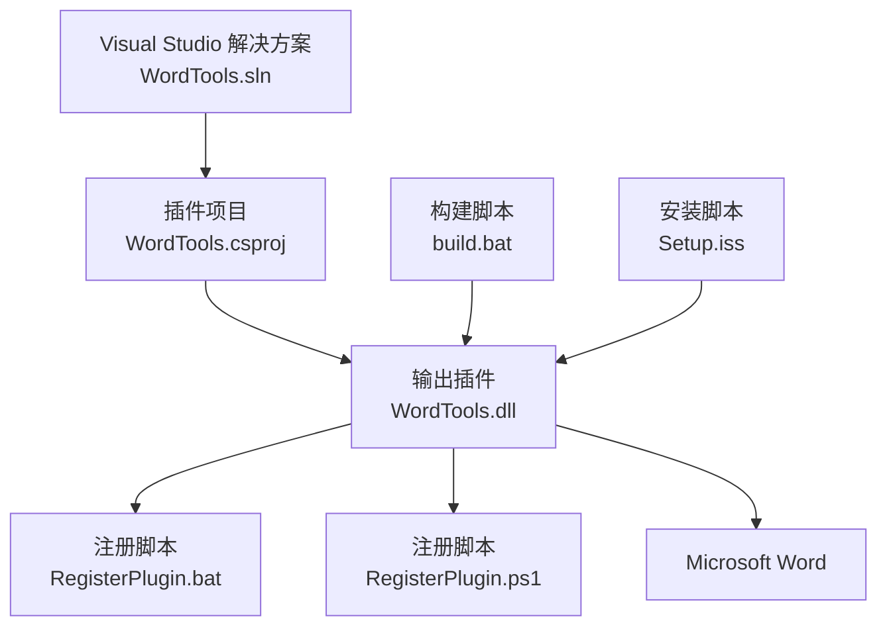
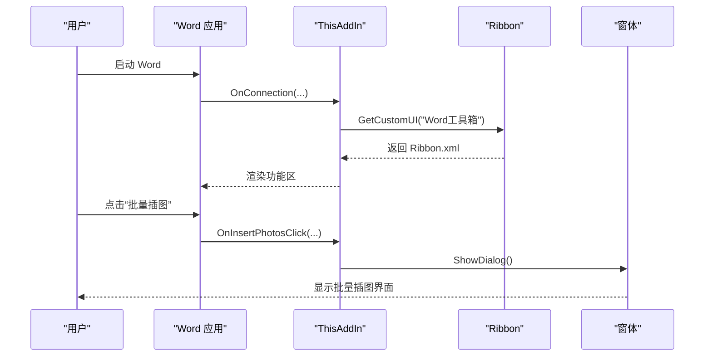
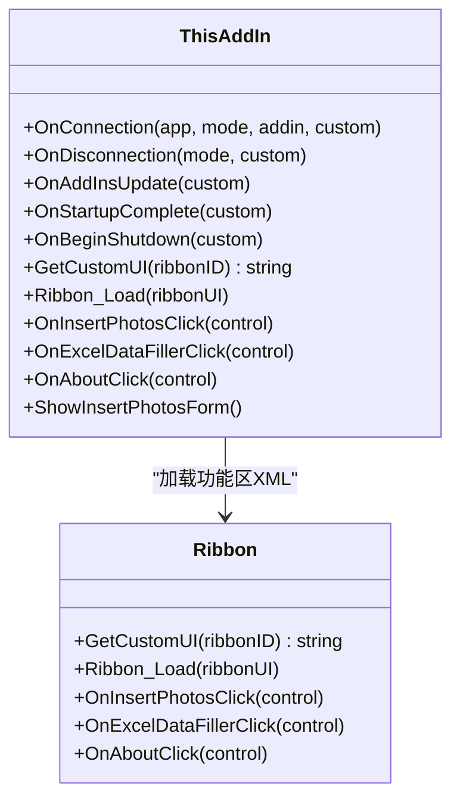
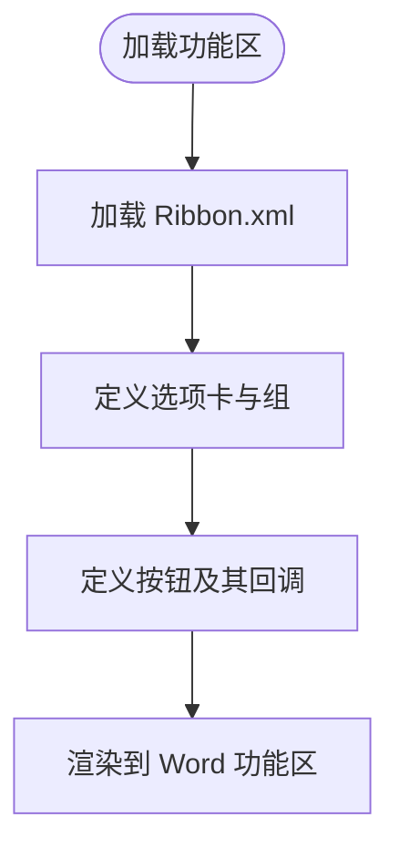
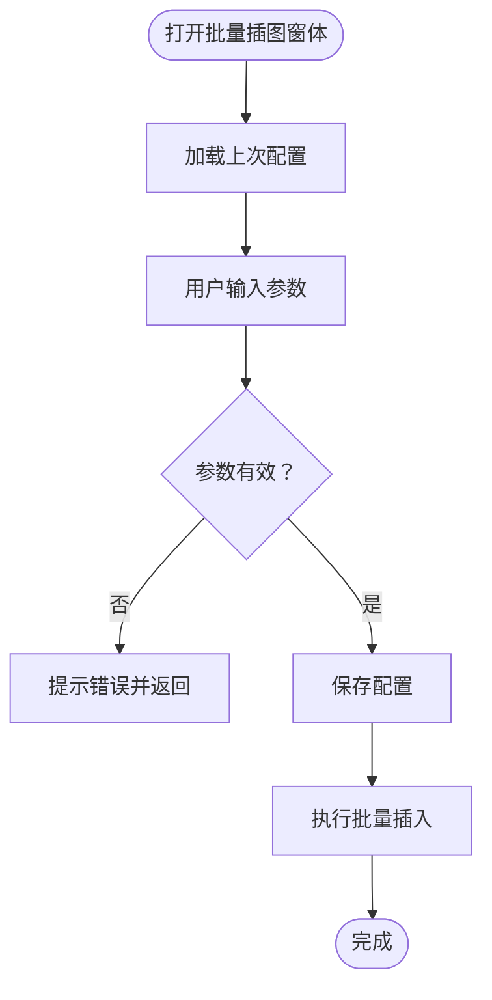
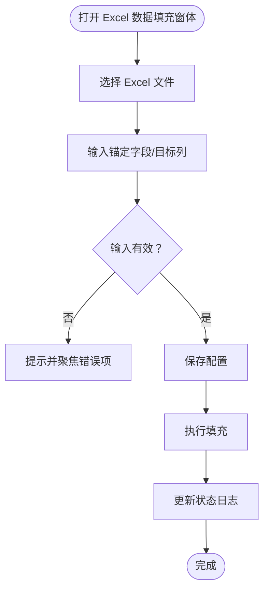
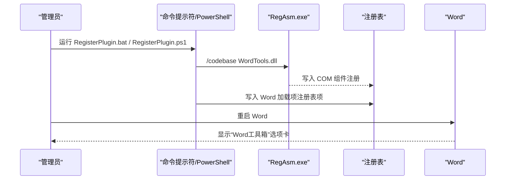
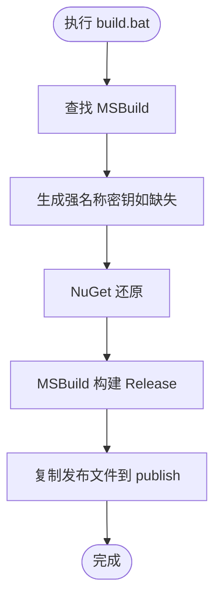
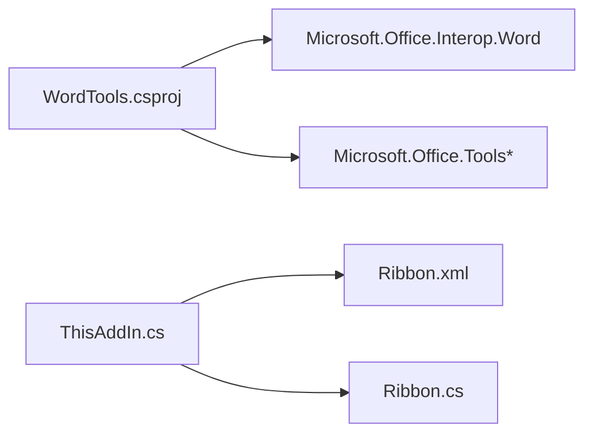

# 快速开始

<cite>
**本文引用的文件列表**
- [README.md](file://README.md)
- [build.bat](file://build.bat)
- [RegisterPlugin.bat](file://RegisterPlugin.bat)
- [RegisterPlugin.ps1](file://RegisterPlugin.ps1)
- [WordTools.sln](file://WordTools.sln)
- [WordTools.csproj](file://WordTools/WordTools.csproj)
- [ThisAddIn.cs](file://WordTools/ThisAddIn.cs)
- [Ribbon.cs](file://WordTools/Ribbon.cs)
- [Ribbon.xml](file://WordTools/Ribbon.xml)
- [InsertPhotosForm.cs](file://WordTools/Forms/InsertPhotosForm.cs)
- [ExcelDataFillerForm.cs](file://WordTools/Forms/ExcelDataFillerForm.cs)
- [Setup.iss](file://Setup.iss)
</cite>

## 目录
1. [简介](#简介)
2. [项目结构](#项目结构)
3. [核心组件](#核心组件)
4. [架构总览](#架构总览)
5. [详细组件分析](#详细组件分析)
6. [依赖关系分析](#依赖关系分析)
7. [性能注意事项](#性能注意事项)
8. [故障排除指南](#故障排除指南)
9. [结论](#结论)
10. [附录](#附录)

## 简介
本指南面向初学者，帮助你在本地快速安装并使用 Word 工具箱插件。该插件是一个基于 COM 加载项（IDTExtensibility2）的 Word 扩展，在 Word 功能区添加“Word工具箱”选项卡，提供批量插图、Excel 数据填充等实用功能。你将学会：
- 使用 Visual Studio 打开解决方案并构建/调试
- 两种手动注册方式（批处理与 PowerShell）
- 使用 build.bat 批处理一键构建
- 卸载方法与常见问题排查
- 安装成功后的验证步骤

## 项目结构
仓库采用“解决方案 + 插件项目”的组织方式，核心文件如下：
- WordTools.sln：解决方案文件
- WordTools/WordTools.csproj：插件项目（输出为 WordTools.dll）
- ThisAddIn.cs：插件入口（实现 IDTExtensibility2 与 IRibbonExtensibility）
- Ribbon.xml：功能区 XML 定义
- Forms/*：交互窗体（批量插图、Excel 数据填充）
- RegisterPlugin.bat / RegisterPlugin.ps1：手动注册脚本
- build.bat：构建与打包脚本
- Setup.iss：InnoSetup 安装脚本（用于打包分发）

图表来源
- [WordTools.sln](file://WordTools.sln)
- [WordTools.csproj](file://WordTools/WordTools.csproj)
- [RegisterPlugin.bat](file://RegisterPlugin.bat)
- [RegisterPlugin.ps1](file://RegisterPlugin.ps1)
- [build.bat](file://build.bat)
- [Setup.iss](file://Setup.iss)

章节来源
- [README.md: 47-60:47-60](file://README.md#L47-L60)
- [WordTools.sln: 1-19:1-19](file://WordTools.sln#L1-L19)
- [WordTools.csproj: 1-149:1-149](file://WordTools/WordTools.csproj#L1-L149)

## 核心组件
- 插件入口（ThisAddIn）：实现 IDTExtensibility2 生命周期回调与 IRibbonExtensibility，负责加载功能区 XML 并响应按钮点击。
- 功能区（Ribbon + Ribbon.xml）：定义“Word工具箱”选项卡及三个组（图片工具、工具、帮助），包含“批量插图”“Excel数据填充”“关于”等按钮。
- 窗体（Forms）：批量插图窗体与 Excel 数据填充窗体，提供用户交互与业务逻辑。
- 注册与构建：支持 Visual Studio 调试自动注册，以及批处理/PowerShell 手动注册；build.bat 提供一键构建与发布。

章节来源
- [ThisAddIn.cs: 17-83:17-83](file://WordTools/ThisAddIn.cs#L17-L83)
- [Ribbon.cs: 14-29:14-29](file://WordTools/Ribbon.cs#L14-L29)
- [Ribbon.xml: 1-53:1-53](file://WordTools/Ribbon.xml#L1-L53)
- [InsertPhotosForm.cs: 19-100:19-100](file://WordTools/Forms/InsertPhotosForm.cs#L19-L100)
- [ExcelDataFillerForm.cs: 12-44:12-44](file://WordTools/Forms/ExcelDataFillerForm.cs#L12-L44)

## 架构总览
Word 工具箱通过 COM 加载项机制集成到 Word。启动时，插件在功能区加载自定义 XML，并根据按钮回调打开对应窗体执行具体任务。

图表来源
- [ThisAddIn.cs: 66-81:66-81](file://WordTools/ThisAddIn.cs#L66-L81)
- [ThisAddIn.cs: 108-111:108-111](file://WordTools/ThisAddIn.cs#L108-L111)
- [Ribbon.xml: 1-53:1-53](file://WordTools/Ribbon.xml#L1-L53)

## 详细组件分析

### 组件一：插件入口（ThisAddIn）
- 实现 IDTExtensibility2：在连接/断开、启动完成、开始关闭等生命周期阶段执行初始化与清理。
- 实现 IRibbonExtensibility：动态加载 Ribbon.xml 作为功能区 UI。
- 按钮回调：批量插图、Excel 数据填充、关于等按钮触发相应窗体展示。

图表来源
- [ThisAddIn.cs: 37-83:37-83](file://WordTools/ThisAddIn.cs#L37-L83)
- [Ribbon.cs: 24-27:24-27](file://WordTools/Ribbon.cs#L24-L27)

章节来源
- [ThisAddIn.cs: 17-175:17-175](file://WordTools/ThisAddIn.cs#L17-L175)
- [Ribbon.cs: 14-190:14-190](file://WordTools/Ribbon.cs#L14-L190)

### 组件二：功能区（Ribbon + Ribbon.xml）
- Ribbon.cs：实现 IRibbonExtensibility，加载嵌入资源中的 Ribbon.xml。
- Ribbon.xml：定义“Word工具箱”选项卡，包含三组按钮，分别对应不同功能。

图表来源
- [Ribbon.cs: 24-27:24-27](file://WordTools/Ribbon.cs#L24-L27)
- [Ribbon.xml: 1-53:1-53](file://WordTools/Ribbon.xml#L1-L53)

章节来源
- [Ribbon.cs: 24-163:24-163](file://WordTools/Ribbon.cs#L24-L163)
- [Ribbon.xml: 1-53:1-53](file://WordTools/Ribbon.xml#L1-L53)

### 组件三：批量插图窗体（InsertPhotosForm）
- 提供文件夹/文件选择、图片高度设置、描述策略（手动/无/文件名）、自动编号、对齐方式等配置。
- 调用进度服务执行批量插入，支持进度反馈与异常提示。

图表来源
- [InsertPhotosForm.cs: 481-524:481-524](file://WordTools/Forms/InsertPhotosForm.cs#L481-L524)

章节来源
- [InsertPhotosForm.cs: 19-574:19-574](file://WordTools/Forms/InsertPhotosForm.cs#L19-L574)

### 组件四：Excel 数据填充窗体（ExcelDataFillerForm）
- 提供 Excel 文件选择、锚定字段、目标列、Sample Size 替换等配置。
- 校验输入并执行填充流程，实时更新状态信息。

图表来源
- [ExcelDataFillerForm.cs: 299-355:299-355](file://WordTools/Forms/ExcelDataFillerForm.cs#L299-L355)

章节来源
- [ExcelDataFillerForm.cs: 12-432:12-432](file://WordTools/Forms/ExcelDataFillerForm.cs#L12-L432)

### 组件五：注册与卸载（手动与自动）
- 手动注册（批处理）：以管理员身份运行 RegisterPlugin.bat，内部调用 regasm /codebase 完成 COM 注册，并写入 Word 加载项注册表项。
- 手动注册（PowerShell）：RegisterPlugin.ps1 同样以管理员身份运行，逻辑与批处理一致。
- 卸载：以管理员身份运行 regasm /u 卸载 COM 组件，或在 Word 中禁用加载项。
- 自动安装（InnoSetup）：Setup.iss 在安装时注册 COM 组件并在卸载前反注册。

图表来源
- [RegisterPlugin.bat: 39-62:39-62](file://RegisterPlugin.bat#L39-L62)
- [RegisterPlugin.ps1: 44-70:44-70](file://RegisterPlugin.ps1#L44-L70)
- [Setup.iss: 47-51:47-51](file://Setup.iss#L47-L51)

章节来源
- [RegisterPlugin.bat: 1-80:1-80](file://RegisterPlugin.bat#L1-L80)
- [RegisterPlugin.ps1: 1-87:1-87](file://RegisterPlugin.ps1#L1-L87)
- [Setup.iss: 38-51:38-51](file://Setup.iss#L38-L51)

### 组件六：构建与发布（build.bat）
- 自动查找 MSBuild，生成强名称密钥（若缺失则延迟签名），还原 NuGet 包，构建 Release 版本，复制发布文件至 publish 目录。
- 输出插件文件与部署清单，便于后续安装或分发。

图表来源
- [build.bat: 8-125:8-125](file://build.bat#L8-L125)

章节来源
- [build.bat: 1-125:1-125](file://build.bat#L1-L125)

## 依赖关系分析
- 插件项目依赖 Office Interop 类库与 VSTO PIA，用于与 Word 交互。
- 项目不使用 VSTO Runtime，减少外部依赖，但需要手动注册 COM 组件。
- 功能区 UI 通过嵌入资源的 Ribbon.xml 动态加载。

图表来源
- [WordTools.csproj: 63-88:63-88](file://WordTools/WordTools.csproj#L63-L88)
- [ThisAddIn.cs: 66-81:66-81](file://WordTools/ThisAddIn.cs#L66-L81)
- [Ribbon.cs: 24-27:24-27](file://WordTools/Ribbon.cs#L24-L27)

章节来源
- [WordTools.csproj: 60-98:60-98](file://WordTools/WordTools.csproj#L60-L98)
- [ThisAddIn.cs: 17-83:17-83](file://WordTools/ThisAddIn.cs#L17-L83)
- [Ribbon.cs: 14-29:14-29](file://WordTools/Ribbon.cs#L14-L29)

## 性能注意事项
- 批量插图与 Excel 数据填充涉及大量文件 IO 与 Word 对象操作，建议在大文档中谨慎使用，避免长时间阻塞 UI。
- 使用进度服务进行异步/分步处理，提升用户体验。
- 构建 Release 版本以获得更好的运行性能。

## 故障排除指南
- 无法找到 regasm 或 .NET Framework 路径
  - 确认系统已安装 .NET Framework 4.8，且 regasm.exe 路径正确。
  - 参考注册脚本中的路径设置。
- 以非管理员身份运行注册脚本
  - 注册 COM 组件需要管理员权限，确保右键“以管理员身份运行”。
- Word 未显示“Word工具箱”选项卡
  - 完全关闭 Word（含后台进程），重新打开 Word。
  - 在“文件 → 选项 → 加载项”中启用 COM 加载项。
- 构建失败
  - 确保已安装 Visual Studio 或 Build Tools，并在 PATH 中可用。
  - 使用 build.bat 自动查找 MSBuild 并执行构建。
- 卸载后仍残留
  - 确保以管理员身份运行卸载命令，或在 Word 中禁用加载项。
  - 删除注册表项（HKCU\Software\Microsoft\Office\Word\Addins\WordTools.ThisAddIn）。

章节来源
- [RegisterPlugin.bat: 9-15:9-15](file://RegisterPlugin.bat#L9-L15)
- [RegisterPlugin.ps1: 12-18:12-18](file://RegisterPlugin.ps1#L12-L18)
- [README.md: 62-75:62-75](file://README.md#L62-L75)
- [build.bat: 37-61:37-61](file://build.bat#L37-L61)

## 结论
通过本指南，你可以：
- 使用 Visual Studio 打开解决方案并选择 Debug/Release 配置进行调试或构建
- 使用 F5 调试自动注册，或在生成后手动注册
- 使用 build.bat 一键构建与发布
- 使用批处理或 PowerShell 脚本完成手动注册
- 通过 InnoSetup 安装脚本进行打包与安装
- 在 Word 中启用插件并验证安装成功

## 附录

### 安装与部署步骤（Visual Studio 开发环境）
- 打开解决方案文件：双击 WordTools.sln
- 选择配置：Debug 或 Release
- 调试运行：按 F5，自动注册并启动 Word
- 或生成解决方案后手动注册：在 bin\Debug 目录下以管理员身份运行注册脚本

章节来源
- [README.md: 23-29:23-29](file://README.md#L23-L29)
- [WordTools.sln: 1-19:1-19](file://WordTools.sln#L1-L19)

### 手动注册插件（regasm）
- 以管理员身份运行命令提示符，进入 bin\Debug
- 执行：regasm /codebase WordTools.dll
- 完全关闭 Word，重新打开后在“文件 → 选项 → 加载项”启用 COM 加载项

章节来源
- [README.md: 30-37:30-37](file://README.md#L30-L37)
- [RegisterPlugin.bat: 39-62:39-62](file://RegisterPlugin.bat#L39-L62)

### 使用 build.bat 批处理文件
- 直接运行 build.bat，脚本将：
  - 查找 MSBuild
  - 生成强名称密钥（如缺失）
  - 还原 NuGet 包
  - 构建 Release
  - 复制发布文件到 publish 目录
- 输出位置：WordTools\bin\Release\ 与 WordTools\bin\Release\publish\

章节来源
- [build.bat: 8-125:8-125](file://build.bat#L8-L125)

### 卸载方法
- 以管理员身份运行命令提示符，进入 bin\Debug
- 执行：regasm /u WordTools.dll
- 或在 Word 中：文件 → 选项 → 加载项 → 管理 COM 加载项 → 取消勾选“WordTools”

章节来源
- [README.md: 62-75:62-75](file://README.md#L62-L75)

### 验证安装成功
- 启动 Word，顶部出现“Word工具箱”选项卡
- 点击“关于”，确认显示版本信息
- 在“文件 → 选项 → 加载项”中看到“Word工具箱”已启用

章节来源
- [Ribbon.xml: 6](file://WordTools/Ribbon.xml#L6)
- [ThisAddIn.cs: 116-125:116-125](file://WordTools/ThisAddIn.cs#L116-L125)