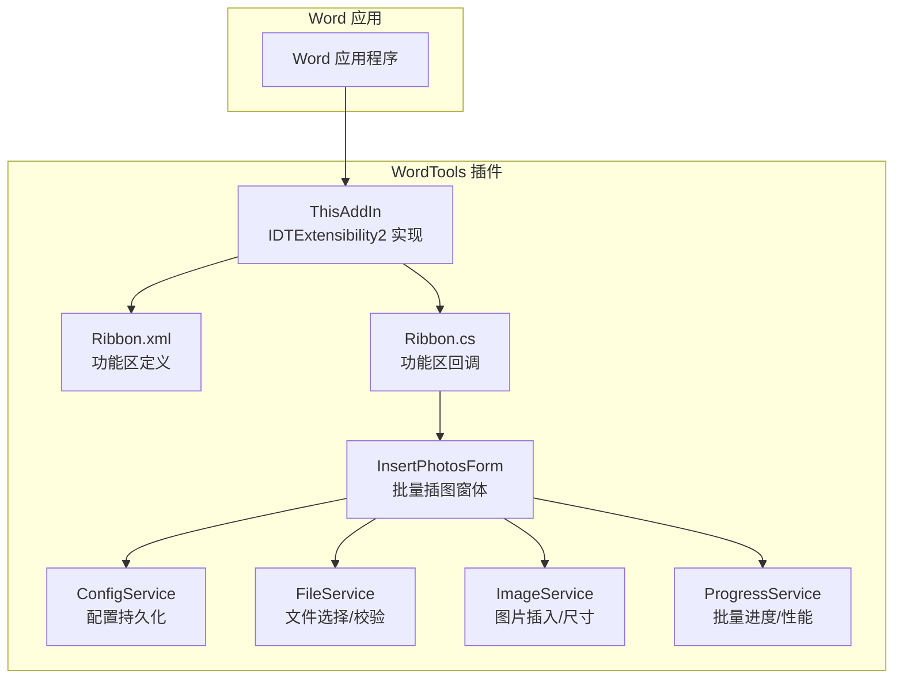
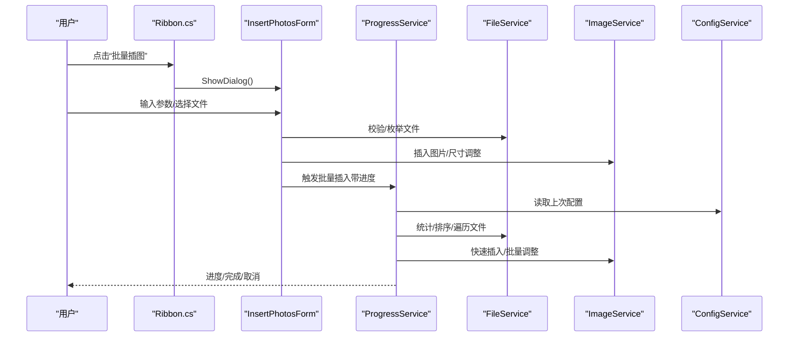
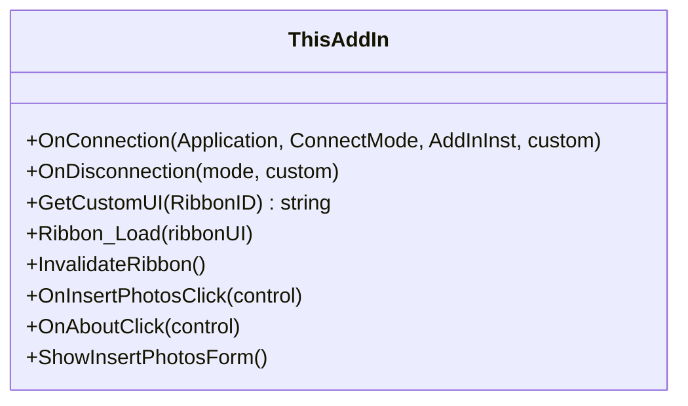
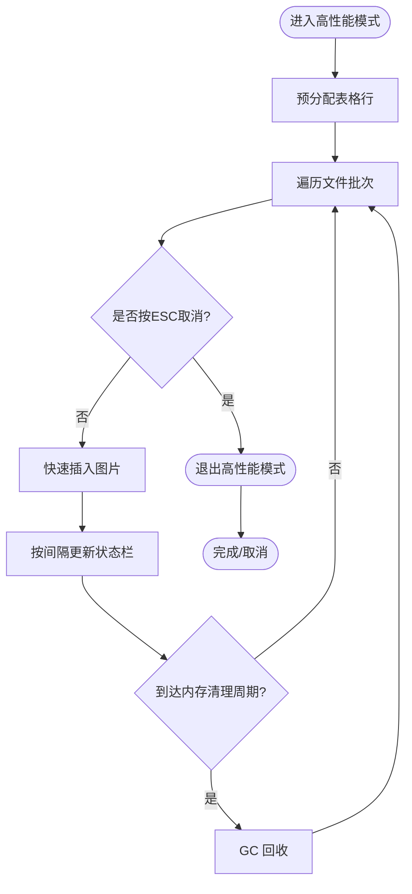
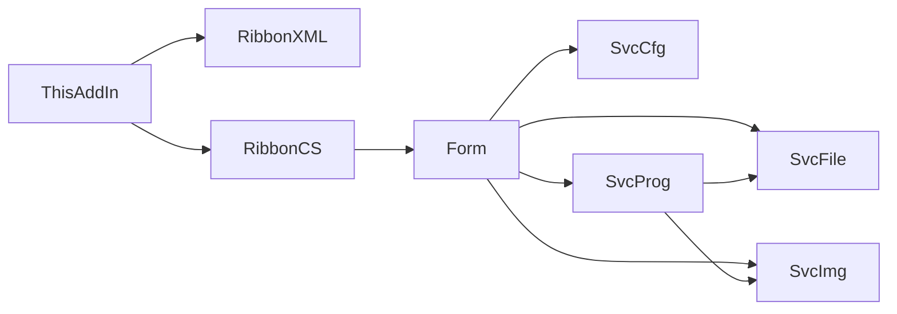
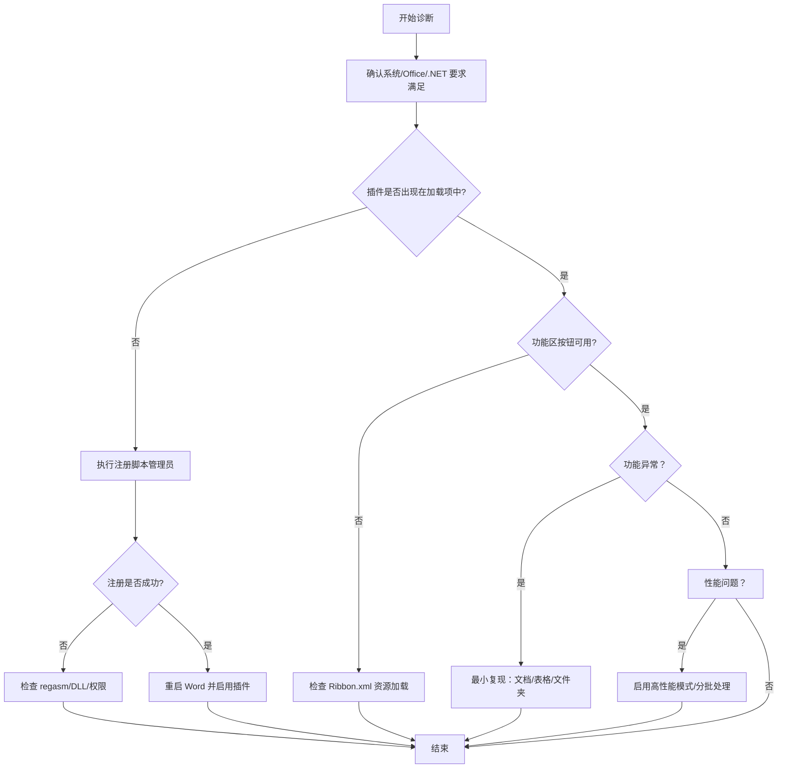

# 故障排除

<cite>
**本文引用的文件**   
- [README.md](file://README.md)
- [ThisAddIn.cs](file://WordTools/ThisAddIn.cs)
- [Ribbon.cs](file://WordTools/Ribbon.cs)
- [Ribbon.xml](file://WordTools/Ribbon.xml)
- [InsertPhotosForm.cs](file://WordTools/Forms/InsertPhotosForm.cs)
- [ConfigService.cs](file://WordTools/Services/ConfigService.cs)
- [FileService.cs](file://WordTools/Services/FileService.cs)
- [ImageService.cs](file://WordTools/Services/ImageService.cs)
- [ProgressService.cs](file://WordTools/Services/ProgressService.cs)
- [RegisterPlugin.bat](file://RegisterPlugin.bat)
- [RegisterPlugin.ps1](file://RegisterPlugin.ps1)
- [build.bat](file://build.bat)
</cite>

## 目录
1. [简介](#简介)
2. [项目结构](#项目结构)
3. [核心组件](#核心组件)
4. [架构总览](#架构总览)
5. [详细组件分析](#详细组件分析)
6. [依赖关系分析](#依赖关系分析)
7. [性能考量](#性能考量)
8. [故障排除指南](#故障排除指南)
9. [结论](#结论)
10. [附录](#附录)

## 简介
本指南面向 WordTools 插件使用者与维护者，系统化梳理安装失败、注册错误、功能异常、兼容性问题、性能瓶颈与调试方法，并提供标准化的问题诊断流程与报告模板。文档基于仓库源码与脚本进行分析，确保建议可落地、可验证。

## 项目结构
WordTools 是一个基于 COM 加载项（IDTExtensibility2）的 Word 插件，通过功能区（Ribbon）暴露“批量插图”等能力。核心模块包括：
- 插件入口与功能区：ThisAddIn、Ribbon、Ribbon.xml
- 窗体与交互：InsertPhotosForm
- 服务层：配置、文件、图片、进度与表格辅助
- 安装与构建：注册脚本、构建脚本

图表来源
- [ThisAddIn.cs:17-100](file://WordTools/ThisAddIn.cs#L17-L100)
- [Ribbon.cs:24-146](file://WordTools/Ribbon.cs#L24-L146)
- [Ribbon.xml:1-39](file://WordTools/Ribbon.xml#L1-L39)
- [InsertPhotosForm.cs:52-150](file://WordTools/Forms/InsertPhotosForm.cs#L52-L150)
- [ConfigService.cs:11-361](file://WordTools/Services/ConfigService.cs#L11-L361)
- [FileService.cs:13-309](file://WordTools/Services/FileService.cs#L13-L309)
- [ImageService.cs:10-324](file://WordTools/Services/ImageService.cs#L10-L324)
- [ProgressService.cs:14-571](file://WordTools/Services/ProgressService.cs#L14-L571)

章节来源
- [README.md:47-60](file://README.md#L47-L60)
- [ThisAddIn.cs:17-100](file://WordTools/ThisAddIn.cs#L17-L100)
- [Ribbon.cs:24-146](file://WordTools/Ribbon.cs#L24-L146)
- [Ribbon.xml:1-39](file://WordTools/Ribbon.xml#L1-L39)
- [InsertPhotosForm.cs:52-150](file://WordTools/Forms/InsertPhotosForm.cs#L52-L150)
- [ConfigService.cs:11-361](file://WordTools/Services/ConfigService.cs#L11-L361)
- [FileService.cs:13-309](file://WordTools/Services/FileService.cs#L13-L309)
- [ImageService.cs:10-324](file://WordTools/Services/ImageService.cs#L10-L324)
- [ProgressService.cs:14-571](file://WordTools/Services/ProgressService.cs#L14-L571)

## 核心组件
- 插件入口与生命周期：ThisAddIn 实现 IDTExtensibility2，负责与 Word 应用连接、断开、Ribbon 初始化与按钮回调。
- 功能区：Ribbon.xml 定义 UI；Ribbon.cs 提供回调逻辑与资源加载。
- 窗体交互：InsertPhotosForm 负责参数收集、校验、触发批量插入流程。
- 服务层：
  - ConfigService：文档自定义属性与注册表配置读写。
  - FileService：文件夹/文件选择、扩展名校验、自然排序、统计。
  - ImageService：图片插入、尺寸换算与批量调整。
  - ProgressService：批量进度、取消控制（ESC）、性能优化（关闭屏幕更新/警告、批量行预分配、内存回收）。
- 安装与构建：RegisterPlugin.* 用于注册 COM 组件与 Word 加载项；build.bat 用于自动化构建与部署。

章节来源
- [ThisAddIn.cs:37-100](file://WordTools/ThisAddIn.cs#L37-L100)
- [Ribbon.cs:24-146](file://WordTools/Ribbon.cs#L24-L146)
- [Ribbon.xml:1-39](file://WordTools/Ribbon.xml#L1-L39)
- [InsertPhotosForm.cs:52-150](file://WordTools/Forms/InsertPhotosForm.cs#L52-L150)
- [ConfigService.cs:11-361](file://WordTools/Services/ConfigService.cs#L11-L361)
- [FileService.cs:13-309](file://WordTools/Services/FileService.cs#L13-L309)
- [ImageService.cs:10-324](file://WordTools/Services/ImageService.cs#L10-L324)
- [ProgressService.cs:14-571](file://WordTools/Services/ProgressService.cs#L14-L571)
- [RegisterPlugin.bat:1-80](file://RegisterPlugin.bat#L1-L80)
- [RegisterPlugin.ps1:1-87](file://RegisterPlugin.ps1#L1-L87)
- [build.bat:1-125](file://build.bat#L1-L125)

## 架构总览

图表来源
- [Ribbon.cs:107-110](file://WordTools/Ribbon.cs#L107-L110)
- [InsertPhotosForm.cs:525-613](file://WordTools/Forms/InsertPhotosForm.cs#L525-L613)
- [ProgressService.cs:151-306](file://WordTools/Services/ProgressService.cs#L151-L306)
- [FileService.cs:117-134](file://WordTools/Services/FileService.cs#L117-L134)
- [ImageService.cs:142-180](file://WordTools/Services/ImageService.cs#L142-L180)
- [ConfigService.cs:149-178](file://WordTools/Services/ConfigService.cs#L149-L178)

## 详细组件分析

### 组件：ThisAddIn（插件入口）
- 职责：实现 IDTExtensibility2 生命周期；加载 Ribbon.xml；提供 Ribbon 回调入口；展示窗体。
- 关键点：
  - 通过资源流读取 Ribbon.xml 并返回给 Word。
  - 按钮回调统一委托到窗体，异常通过消息框提示。

图表来源
- [ThisAddIn.cs:37-150](file://WordTools/ThisAddIn.cs#L37-L150)

章节来源
- [ThisAddIn.cs:37-150](file://WordTools/ThisAddIn.cs#L37-L150)

### 组件：Ribbon 与 Ribbon.xml（功能区）
- 职责：定义“Word工具箱”选项卡、分组与按钮；绑定回调；提供标签/提示文本。
- 关键点：
  - 通过资源加载 Ribbon.xml。
  - 回调中对无活动文档场景给出明确提示。

图表来源
- [ThisAddIn.cs:65-80](file://WordTools/ThisAddIn.cs#L65-L80)
- [Ribbon.cs:24-48](file://WordTools/Ribbon.cs#L24-L48)
- [Ribbon.xml:1-39](file://WordTools/Ribbon.xml#L1-L39)

章节来源
- [Ribbon.cs:24-146](file://WordTools/Ribbon.cs#L24-L146)
- [Ribbon.xml:1-39](file://WordTools/Ribbon.xml#L1-L39)

### 组件：InsertPhotosForm（批量插图窗体）
- 职责：参数界面、输入校验、触发批量插入。
- 关键点：
  - 读取/保存配置（ConfigService）。
  - 校验图片高度输入（ImageService）。
  - 触发 ProgressService 执行批量插入。

图表来源
- [InsertPhotosForm.cs:415-482](file://WordTools/Forms/InsertPhotosForm.cs#L415-L482)
- [InsertPhotosForm.cs:525-613](file://WordTools/Forms/InsertPhotosForm.cs#L525-L613)

章节来源
- [InsertPhotosForm.cs:415-482](file://WordTools/Forms/InsertPhotosForm.cs#L415-L482)
- [InsertPhotosForm.cs:525-613](file://WordTools/Forms/InsertPhotosForm.cs#L525-L613)

### 组件：ProgressService（批量进度与性能）
- 职责：批量插入主控，提供取消（ESC）、性能优化、进度条样式的状态栏更新。
- 关键点：
  - 高性能模式：关闭 ScreenUpdating、DisplayAlerts、预检查拼写/语法。
  - 动态刷新/内存清理/保存间隔随文件数自适应。
  - 取消：检测 ESC 键，设置状态栏并优雅退出。

图表来源
- [ProgressService.cs:73-144](file://WordTools/Services/ProgressService.cs#L73-L144)
- [ProgressService.cs:412-533](file://WordTools/Services/ProgressService.cs#L412-L533)

章节来源
- [ProgressService.cs:73-144](file://WordTools/Services/ProgressService.cs#L73-L144)
- [ProgressService.cs:412-533](file://WordTools/Services/ProgressService.cs#L412-L533)

### 组件：FileService（文件选择与校验）
- 职责：文件夹/文件选择、扩展名校验、自然排序、统计。
- 关键点：支持 .jpg/.jpeg/.png；自然排序模拟资源管理器；统计根/子目录图片总数。

章节来源
- [FileService.cs:13-309](file://WordTools/Services/FileService.cs#L13-L309)

### 组件：ImageService（图片插入与尺寸）
- 职责：厘米/磅换算、插入图片、保持宽高比、批量调整、预分配行。
- 关键点：插入时锁定纵横比；根据单元格尺寸与最小高度约束；快速插入仅考虑宽度限制。

章节来源
- [ImageService.cs:10-324](file://WordTools/Services/ImageService.cs#L10-L324)

### 组件：ConfigService（配置持久化）
- 职责：文档自定义属性与注册表双通道存储，支持空值标记（__EMPTY__）绕过 Word COM 限制。
- 关键点：优先读取文档属性，回退到注册表；应用级配置（如自动编号、对齐）存注册表。

章节来源
- [ConfigService.cs:11-361](file://WordTools/Services/ConfigService.cs#L11-L361)

## 依赖关系分析
- ThisAddIn 依赖 Ribbon.xml 与 Ribbon.cs；Ribbon.cs 依赖资源加载与回调。
- InsertPhotosForm 依赖 FileService、ImageService、ConfigService、ProgressService。
- ProgressService 依赖 FileService、ImageService、TableService（间接通过调用方传入）。
- 安装脚本依赖 .NET Framework 4.x 的 RegAsm 与注册表项。

图表来源
- [ThisAddIn.cs:65-80](file://WordTools/ThisAddIn.cs#L65-L80)
- [Ribbon.cs:24-48](file://WordTools/Ribbon.cs#L24-L48)
- [InsertPhotosForm.cs:525-613](file://WordTools/Forms/InsertPhotosForm.cs#L525-L613)
- [ProgressService.cs:151-306](file://WordTools/Services/ProgressService.cs#L151-L306)

章节来源
- [ThisAddIn.cs:65-80](file://WordTools/ThisAddIn.cs#L65-L80)
- [Ribbon.cs:24-48](file://WordTools/Ribbon.cs#L24-L48)
- [InsertPhotosForm.cs:525-613](file://WordTools/Forms/InsertPhotosForm.cs#L525-L613)
- [ProgressService.cs:151-306](file://WordTools/Services/ProgressService.cs#L151-L306)

## 性能考量
- 高性能模式：关闭屏幕更新与警告，减少 UI 刷新与对话框干扰。
- 批量预分配：根据估算图片数与每行图片数预分配表格行，降低动态扩容成本。
- 自适应刷新：文件数越多，刷新/内存清理/保存间隔越长，平衡 UI 响应与吞吐。
- 快速插入：仅按宽度限制缩放，避免复杂布局计算。
- 取消机制：实时检测 ESC 键，及时释放资源。

章节来源
- [ProgressService.cs:73-144](file://WordTools/Services/ProgressService.cs#L73-L144)
- [ProgressService.cs:287-305](file://WordTools/Services/ProgressService.cs#L287-L305)
- [ImageService.cs:142-180](file://WordTools/Services/ImageService.cs#L142-L180)

## 故障排除指南

### 一、安装与注册失败
常见症状
- 插件未出现在 Word 加载项中
- 注册脚本报错“找不到 regasm.exe”或“找不到 DLL”
- 以管理员身份运行后仍失败

诊断步骤
1. 环境检查
   - 确认已安装 .NET Framework 4.x（项目要求）。
   - 确认以管理员身份运行注册脚本（批处理与 PowerShell 脚本均内置管理员检查）。
2. 路径与文件检查
   - 确认 WordTools/bin/Debug/WordTools.dll 存在。
   - 确认 RegAsm 路径 C:\Windows\Microsoft.NET\Framework64\v4.0.30319\RegAsm.exe 存在。
3. 注册过程
   - 先执行 COM 注册（regasm /codebase），再写入 HKCU 注册表项。
   - 完全关闭 Word（含后台进程），重启 Word 并在“文件 → 选项 → 加载项”中启用。

建议修复
- 若缺少 RegAsm，安装对应 .NET Framework SDK 或使用 Visual Studio 自带工具。
- 若 DLL 不存在，先在 Visual Studio 中生成 Debug/Release。
- 若注册表写入失败，检查当前用户权限与防病毒软件拦截。

章节来源
- [RegisterPlugin.bat:8-32](file://RegisterPlugin.bat#L8-L32)
- [RegisterPlugin.ps1:11-36](file://RegisterPlugin.ps1#L11-L36)
- [RegisterPlugin.bat:38-62](file://RegisterPlugin.bat#L38-L62)
- [RegisterPlugin.ps1:42-70](file://RegisterPlugin.ps1#L42-L70)
- [README.md:30-69](file://README.md#L30-L69)

### 二、功能异常与错误提示
常见症状
- “请先打开一个 Word 文档”
- “请先选中一个表格”“请将光标置于表格左侧单元格”
- “未找到任何图片文件”
- “操作失败: ...”或“处理过程中发生错误”

定位与修复
- 无活动文档/表格
  - 现象：Ribbon 回调与批量插入均会检查 ActiveDocument 与 Selection 是否在表格内。
  - 修复：先打开文档并插入表格，将光标置于第一列单元格。
- 未找到图片
  - 现象：统计根/子目录图片数为 0。
  - 修复：确认所选文件夹包含 .jpg/.jpeg/.png 文件，或调整“包含根目录/子目录”选项。
- 输入校验失败
  - 现象：图片高度输入无效。
  - 修复：输入大于 0 的数值（厘米），留空表示不限制最小高度。
- 异常捕获
  - 现象：窗体/回调中出现通用错误提示。
  - 修复：记录具体提示信息，结合日志与最小复现步骤反馈。

章节来源
- [Ribbon.cs:54-58](file://WordTools/Ribbon.cs#L54-L58)
- [Ribbon.cs:74-78](file://WordTools/Ribbon.cs#L74-L78)
- [ProgressService.cs:168-201](file://WordTools/Services/ProgressService.cs#L168-L201)
- [InsertPhotosForm.cs:531-543](file://WordTools/Forms/InsertPhotosForm.cs#L531-L543)
- [InsertPhotosForm.cs:585-591](file://WordTools/Forms/InsertPhotosForm.cs#L585-L591)

### 三、兼容性问题
- Office 版本
  - 系统要求：Office 2010+；若在旧版 Office 上行为异常，优先升级。
- Windows 版本
  - 系统要求：Windows 7+；若在较新系统上出现 COM 注册问题，检查系统策略与安全软件。
- .NET Framework
  - 确认安装 .NET Framework 4.8；若缺失，安装对应版本后重试注册。

章节来源
- [README.md:15-19](file://README.md#L15-L19)

### 四、性能问题与优化
- 症状：大批量插入时 Word 卡顿、耗时长、内存占用高。
- 优化措施
  - 使用 ESC 取消，避免长时间运行。
  - 启用高性能模式（自动）：关闭屏幕更新与警告，减少 UI 干扰。
  - 预分配表格行：减少动态扩容。
  - 自适应刷新与内存回收：按文件规模动态调整刷新频率与 GC。
- 建议
  - 分批处理：将大目录拆分为多个小批次。
  - 避免同时运行多个大型任务。

章节来源
- [ProgressService.cs:73-144](file://WordTools/Services/ProgressService.cs#L73-L144)
- [ProgressService.cs:117-125](file://WordTools/Services/ProgressService.cs#L117-L125)
- [ImageService.cs:287-320](file://WordTools/Services/ImageService.cs#L287-L320)

### 五、调试技巧与工具
- Visual Studio 调试
  - 直接在 VS 中启动（F5），自动注册并附加 Word 进程。
  - 断点设置在回调与窗体事件中，观察参数与异常。
- 日志与状态栏
  - ProgressService 会更新状态栏显示进度、剩余时间与当前文件名，便于定位卡顿阶段。
- 取消与中断
  - 插入过程中按 ESC 可取消，状态栏会提示“检测到 ESC 键，正在取消操作”。

章节来源
- [README.md:23-28](file://README.md#L23-L28)
- [ProgressService.cs:43-64](file://WordTools/Services/ProgressService.cs#L43-L64)
- [ProgressService.cs:539-566](file://WordTools/Services/ProgressService.cs#L539-L566)

### 六、错误代码与含义
- 通用错误提示
  - “请先打开一个 Word 文档”：ActiveDocument 为空。
  - “请先选中一个表格/请将光标置于表格左侧单元格”：Selection 不在表格或不在首列。
  - “未找到任何图片文件”：枚举文件数为 0。
  - “操作失败: .../处理过程中发生错误”：捕获到异常，需结合具体消息与最小复现步骤。
- 注册失败
  - “找不到 regasm.exe”：系统缺少 .NET Framework 工具链。
  - “找不到 DLL 文件”：未生成或路径错误。
  - “注册表项添加失败”：权限不足或被安全软件拦截。

章节来源
- [Ribbon.cs:54-58](file://WordTools/Ribbon.cs#L54-L58)
- [Ribbon.cs:74-78](file://WordTools/Ribbon.cs#L74-L78)
- [ProgressService.cs:168-201](file://WordTools/Services/ProgressService.cs#L168-L201)
- [RegisterPlugin.bat:21-32](file://RegisterPlugin.bat#L21-L32)
- [RegisterPlugin.ps1:32-36](file://RegisterPlugin.ps1#L32-L36)

### 七、问题诊断流程（推荐）

图表来源
- [RegisterPlugin.bat:8-32](file://RegisterPlugin.bat#L8-L32)
- [RegisterPlugin.ps1:11-36](file://RegisterPlugin.ps1#L11-L36)
- [Ribbon.cs:24-48](file://WordTools/Ribbon.cs#L24-L48)
- [ProgressService.cs:168-201](file://WordTools/Services/ProgressService.cs#L168-L201)

### 八、如何收集与提交问题报告
建议包含以下信息
- 环境信息：Windows 版本、Office 版本、.NET 版本、插件版本。
- 操作步骤：最小复现步骤（打开文档、插入表格、选择文件夹/文件、点击按钮）。
- 截图/状态栏快照：显示状态栏进度与错误提示。
- 日志与异常：异常消息、堆栈摘要（可从消息框复制）。
- 附件：相关文件夹截图、Word 文档（脱敏处理）。

提交渠道
- 仓库 Issues（如适用）

章节来源
- [README.md:15-19](file://README.md#L15-L19)

## 结论
本指南提供了从安装、功能使用到性能优化与调试的完整排障路径。遵循“最小复现 + 环境核对 + 资源与注册表检查”的流程，通常可快速定位并解决问题。对于性能问题，优先采用内置的高性能模式与分批处理策略。

## 附录

### A. 常见问题速查
- 问：为什么找不到 regasm？
  - 答：安装 .NET Framework SDK 或使用 Visual Studio 自带工具。
- 问：为什么 DLL 不存在？
  - 答：先在 Visual Studio 中生成 Debug/Release。
- 问：为什么功能区没有“Word工具箱”？
  - 答：完成注册并重启 Word，在“加载项”中启用。
- 问：为什么提示“未找到任何图片文件”？
  - 答：确认文件夹包含 .jpg/.jpeg/.png，或调整包含范围。
- 问：如何取消批量插入？
  - 答：插入过程中按 ESC 键。

章节来源
- [RegisterPlugin.bat:21-32](file://RegisterPlugin.bat#L21-L32)
- [RegisterPlugin.ps1:25-30](file://RegisterPlugin.ps1#L25-L30)
- [ProgressService.cs:43-64](file://WordTools/Services/ProgressService.cs#L43-L64)

### B. 构建与部署要点
- build.bat 会尝试查找 MSBuild，还原 NuGet 包，生成 Release 并复制部署文件。
- 如需强名称签名，脚本尝试生成 Key.snk；若失败，可在 VS 中生成项目以自动创建密钥。

章节来源
- [build.bat:8-83](file://build.bat#L8-L83)
- [build.bat:93-124](file://build.bat#L93-L124)