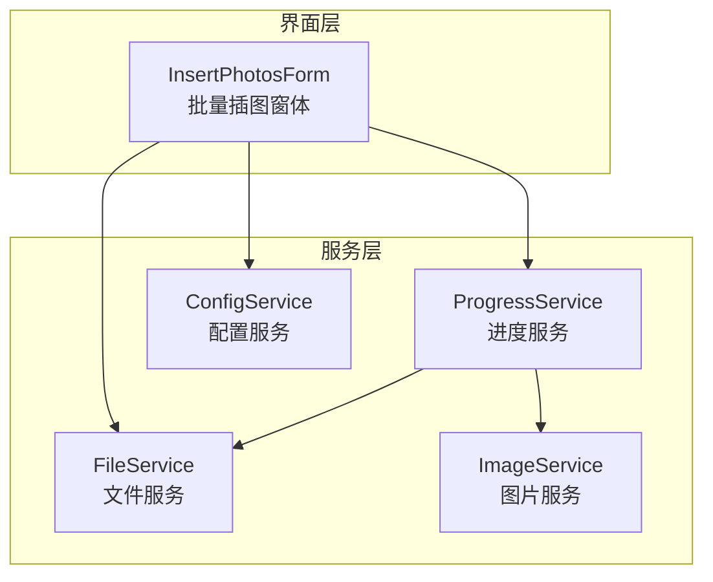
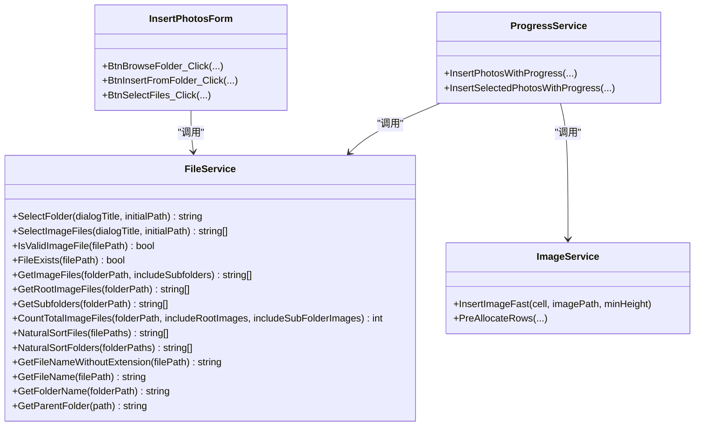
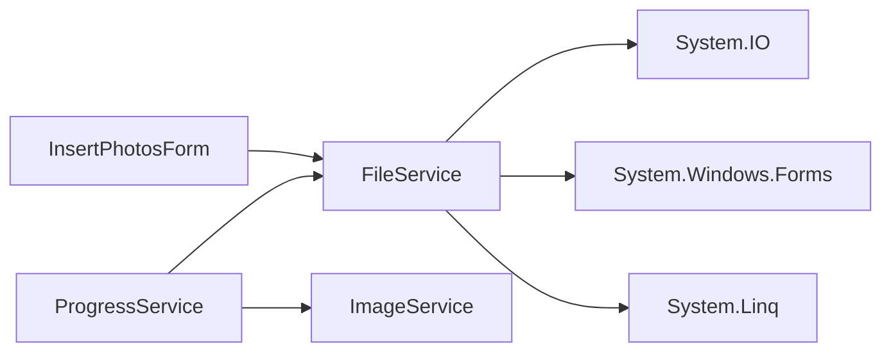

# 文件服务

<cite>
**本文引用的文件**
- [FileService.cs](file://WordTools/Services/FileService.cs)
- [InsertPhotosForm.cs](file://WordTools/Forms/InsertPhotosForm.cs)
- [ProgressService.cs](file://WordTools/Services/ProgressService.cs)
- [ImageService.cs](file://WordTools/Services/ImageService.cs)
- [ConfigService.cs](file://WordTools/Services/ConfigService.cs)
- [README.md](file://README.md)
</cite>

## 目录
1. [简介](#简介)
2. [项目结构](#项目结构)
3. [核心组件](#核心组件)
4. [架构总览](#架构总览)
5. [详细组件分析](#详细组件分析)
6. [依赖关系分析](#依赖关系分析)
7. [性能考量](#性能考量)
8. [故障排查指南](#故障排查指南)
9. [结论](#结论)
10. [附录](#附录)

## 简介
本文档面向 WordTools 的文件服务，系统性地解析 FileService 静态类的实现与使用，覆盖文件夹选择、图片文件选择、文件验证、文件列表获取、自然排序算法以及文件辅助方法，并结合实际调用方（批量插图工具窗体）展示最佳实践与使用示例。

## 项目结构
- 文件服务位于 Services 目录，提供文件选择、验证、枚举与排序等能力。
- 批量插图工具窗体通过 FileService 实现“选择文件夹”和“选择图片文件”的交互。
- 进度服务在执行批量插入时调用 FileService 获取文件列表与统计总数。
- 图片服务负责将图片插入 Word 并进行尺寸调整。
- 配置服务负责持久化用户偏好（如上次文件夹路径、是否包含根/子目录等）。

图表来源
- [InsertPhotosForm.cs:465-569](file://WordTools/Forms/InsertPhotosForm.cs#L465-L569)
- [ProgressService.cs:148-306](file://WordTools/Services/ProgressService.cs#L148-L306)
- [FileService.cs:13-310](file://WordTools/Services/FileService.cs#L13-L310)
- [ImageService.cs:10-325](file://WordTools/Services/ImageService.cs#L10-L325)
- [ConfigService.cs:11-463](file://WordTools/Services/ConfigService.cs#L11-L463)

章节来源
- [README.md:47-61](file://README.md#L47-L61)

## 核心组件
- FileService：静态类，提供文件夹选择、图片文件选择、文件验证、文件列表获取、自然排序与文件辅助方法。
- InsertPhotosForm：调用 FileService 进行文件夹与图片选择，并将结果传递给进度服务执行批量插入。
- ProgressService：在批量插入流程中调用 FileService 获取文件列表、统计总数、获取文件夹名等。
- ImageService：与 FileService 协作，将图片插入 Word 并进行尺寸调整。
- ConfigService：持久化用户配置，如上次文件夹路径、是否包含根/子目录等。

章节来源
- [FileService.cs:13-310](file://WordTools/Services/FileService.cs#L13-L310)
- [InsertPhotosForm.cs:465-569](file://WordTools/Forms/InsertPhotosForm.cs#L465-L569)
- [ProgressService.cs:148-306](file://WordTools/Services/ProgressService.cs#L148-L306)
- [ImageService.cs:10-325](file://WordTools/Services/ImageService.cs#L10-L325)
- [ConfigService.cs:11-463](file://WordTools/Services/ConfigService.cs#L11-L463)

## 架构总览
FileService 作为文件操作的核心入口，被界面层与进度服务共同依赖。其职责清晰、内聚性强，既提供底层文件系统访问，又封装了自然排序与常用辅助方法，便于上层业务直接使用。

图表来源
- [FileService.cs:13-310](file://WordTools/Services/FileService.cs#L13-L310)
- [InsertPhotosForm.cs:465-569](file://WordTools/Forms/InsertPhotosForm.cs#L465-L569)
- [ProgressService.cs:148-306](file://WordTools/Services/ProgressService.cs#L148-L306)
- [ImageService.cs:10-325](file://WordTools/Services/ImageService.cs#L10-L325)

## 详细组件分析

### 文件夹选择：SelectFolder
- 功能：弹出文件夹选择对话框，支持设置标题与初始路径。
- 参数：
  - dialogTitle：对话框标题（默认“请选择文件夹...”）
  - initialPath：初始路径（可选；若非空且存在则作为默认选中路径）
- 返回：用户选择的文件夹路径；取消或异常返回空字符串。
- 使用示例（调用方）：
  - 在“浏览...”按钮点击事件中调用，将返回路径写入文本框并持久化到配置。

章节来源
- [FileService.cs:26-45](file://WordTools/Services/FileService.cs#L26-L45)
- [InsertPhotosForm.cs:465-479](file://WordTools/Forms/InsertPhotosForm.cs#L465-L479)

### 图片文件选择：SelectImageFiles
- 功能：弹出“打开文件”对话框，支持多选图片文件（.jpg/.jpeg/.png）。
- 参数：
  - dialogTitle：对话框标题（默认“请选择图片文件...”）
  - initialPath：初始目录（可选；若非空且存在则作为默认目录）
- 过滤器：仅显示图片文件与全部文件两类，第一类为图片文件。
- 返回：选中的文件路径数组；取消或无文件返回 null。
- 使用示例（调用方）：
  - “选择文件”按钮点击事件中调用，若返回非空则保存最后一个文件所在文件夹路径到配置，随后调用进度服务执行批量插入。

章节来源
- [FileService.cs:57-78](file://WordTools/Services/FileService.cs#L57-L78)
- [InsertPhotosForm.cs:526-569](file://WordTools/Forms/InsertPhotosForm.cs#L526-L569)

### 文件验证：IsValidImageFile 与 FileExists
- IsValidImageFile：
  - 输入校验：空路径返回 false。
  - 扩展名校验：将路径扩展名转为小写后与受支持扩展名集合比较（.jpg/.jpeg/.png）。
- FileExists：
  - 输入校验：空路径返回 false。
  - 文件存在性校验：使用文件系统判断文件是否存在。
- 使用建议：
  - 在批量插入前先用 IsValidImageFile 过滤非法扩展名，在插入前用 FileExists 确认文件可用。

章节来源
- [FileService.cs:89-105](file://WordTools/Services/FileService.cs#L89-L105)

### 文件列表获取：GetImageFiles、GetRootImageFiles、GetSubfolders
- GetImageFiles：
  - 输入校验：空路径或不存在返回空数组。
  - 搜索策略：根据 includeSubfolders 决定 TopDirectoryOnly 或 AllDirectories。
  - 扩展名遍历：对受支持扩展名逐一查询，合并结果。
  - 排序：对文件名进行自然排序后返回。
- GetRootImageFiles：
  - 直接调用 GetImageFiles(false)，仅根目录。
- GetSubfolders：
  - 输入校验：空路径或不存在返回空数组。
  - 列表获取：使用目录枚举，再对文件夹名进行自然排序。
- CountTotalImageFiles：
  - 统计逻辑：可分别统计根目录与子目录图片数量，支持组合统计。
- 使用建议：
  - 在批量插入前先统计总数，以便进度服务设置刷新间隔与内存清理节奏。

章节来源
- [FileService.cs:117-188](file://WordTools/Services/FileService.cs#L117-L188)

### 自然排序算法：NaturalCompare 与 NaturalSortFiles/NaturalSortFolders
- 设计目标：模拟资源管理器的自然排序，使“文件1.jpg、文件2.jpg、文件10.jpg”按人类预期顺序排列。
- 核心思路：
  - 字符逐位比较，遇到数字段时提取完整数字串，按数值大小比较（忽略前导零）。
  - 非数字字符按小写不区分大小写比较。
- 辅助函数：
  - ExtractNumber：从字符串当前位置提取连续数字串。
  - NaturalSortFiles：对文件路径数组按文件名进行自然排序。
  - NaturalSortFolders：对文件夹路径数组按文件夹名进行自然排序。
- 时间复杂度：对每个字符串进行线性扫描，整体 O(n*m)，其中 n 为元素个数，m 为平均字符串长度。
- 空间复杂度：排序过程依赖 LINQ OrderBy，通常为 O(n log n)。

图表来源
- [FileService.cs:197-236](file://WordTools/Services/FileService.cs#L197-L236)

章节来源
- [FileService.cs:197-269](file://WordTools/Services/FileService.cs#L197-L269)

### 文件辅助方法：文件名与路径处理
- GetFileNameWithoutExtension：获取不含扩展名的文件名。
- GetFileName：获取含扩展名的文件名。
- GetFolderName：获取文件夹名称。
- GetParentFolder：获取父级目录路径。
- 使用场景：在批量插入时，将“文件名”作为描述行内容，或根据首个选中文件推断最后使用的文件夹路径。

章节来源
- [FileService.cs:278-305](file://WordTools/Services/FileService.cs#L278-L305)

### 调用序列：从界面到文件服务再到进度服务

图表来源
- [InsertPhotosForm.cs:526-569](file://WordTools/Forms/InsertPhotosForm.cs#L526-L569)
- [ProgressService.cs:312-403](file://WordTools/Services/ProgressService.cs#L312-L403)
- [FileService.cs:139-142](file://WordTools/Services/FileService.cs#L139-L142)
- [ImageService.cs:142-180](file://WordTools/Services/ImageService.cs#L142-L180)

## 依赖关系分析
- FileService 依赖：
  - 系统 IO：Directory、File、Path。
  - Windows Forms：FolderBrowserDialog、OpenFileDialog。
  - LINQ：OrderBy、Comparer。
- 调用关系：
  - InsertPhotosForm 直接依赖 FileService。
  - ProgressService 间接依赖 FileService（获取文件列表、统计总数、获取文件夹名）。
  - ImageService 与 FileService 协同工作（前者负责插入与尺寸调整，后者负责文件枚举与排序）。
- 潜在循环依赖：无；模块边界清晰，FileService 为纯工具类，不反向依赖上层。

图表来源
- [FileService.cs:1-7](file://WordTools/Services/FileService.cs#L1-L7)
- [InsertPhotosForm.cs:1-13](file://WordTools/Forms/InsertPhotosForm.cs#L1-L13)
- [ProgressService.cs:1-8](file://WordTools/Services/ProgressService.cs#L1-L8)

章节来源
- [FileService.cs:1-7](file://WordTools/Services/FileService.cs#L1-L7)
- [InsertPhotosForm.cs:1-13](file://WordTools/Forms/InsertPhotosForm.cs#L1-L13)
- [ProgressService.cs:1-8](file://WordTools/Services/ProgressService.cs#L1-L8)

## 性能考量
- 自然排序：
  - 对每个文件名进行线性扫描与数字段提取，时间复杂度 O(n*m)。
  - 建议在文件数量较大时谨慎使用，必要时可分批处理或缓存中间结果。
- 文件枚举：
  - GetImageFiles 在 includeSubfolders=true 时使用递归搜索，可能产生大量 IO。
  - 建议在大目录结构中优先使用根目录扫描，或在 UI 上提示用户等待。
- 进度与内存：
  - 进度服务根据文件总数动态调整刷新与内存清理频率，减少 UI 卡顿。
  - 批量插入采用快速插入策略（InsertImageFast）降低内存占用。

章节来源
- [FileService.cs:117-188](file://WordTools/Services/FileService.cs#L117-L188)
- [ProgressService.cs:117-142](file://WordTools/Services/ProgressService.cs#L117-L142)
- [ImageService.cs:142-180](file://WordTools/Services/ImageService.cs#L142-L180)

## 故障排查指南
- 无法选择文件夹/图片：
  - 检查 initialPath 是否存在且可访问。
  - 确认对话框标题与过滤器设置是否符合预期。
- 选择的文件不是图片：
  - 使用 IsValidImageFile 过滤扩展名后再插入。
- 文件不存在：
  - 使用 FileExists 校验路径有效性。
- 排序不符合预期：
  - 确认文件名包含数字时的命名规则，自然排序会按数值大小比较。
- 批量插入卡顿：
  - 减少一次性处理的文件数量，或关闭不必要的 UI 更新与警告提示。

章节来源
- [FileService.cs:26-45](file://WordTools/Services/FileService.cs#L26-L45)
- [FileService.cs:57-78](file://WordTools/Services/FileService.cs#L57-L78)
- [FileService.cs:89-105](file://WordTools/Services/FileService.cs#L89-L105)
- [FileService.cs:197-269](file://WordTools/Services/FileService.cs#L197-L269)
- [ProgressService.cs:117-142](file://WordTools/Services/ProgressService.cs#L117-L142)

## 结论
FileService 以简洁的静态接口提供了文件夹选择、图片文件选择、文件验证、文件列表获取与自然排序等核心能力，配合 InsertPhotosForm 与 ProgressService 形成了完整的批量插图工作流。其设计遵循单一职责原则，易于维护与扩展；同时通过自然排序与性能优化策略提升了用户体验。

## 附录

### 使用示例与最佳实践
- 选择文件夹并保存配置：
  - 在“浏览...”按钮事件中调用 SelectFolder，将返回路径写入文本框并调用配置服务保存。
- 选择图片文件并批量插入：
  - 在“选择文件”按钮事件中调用 SelectImageFiles，若返回非空则保存首个文件的父目录到配置，随后调用进度服务执行插入。
- 验证与过滤：
  - 在插入前使用 IsValidImageFile 与 FileExists 进行双重校验，确保扩展名与文件存在性。
- 自然排序：
  - 使用 NaturalSortFiles 对文件名进行自然排序，提升文件列表的可读性。
- 性能优化：
  - 大量文件时分批处理，合理设置刷新与内存清理间隔，避免 UI 卡顿。

章节来源
- [InsertPhotosForm.cs:465-569](file://WordTools/Forms/InsertPhotosForm.cs#L465-L569)
- [FileService.cs:89-105](file://WordTools/Services/FileService.cs#L89-L105)
- [FileService.cs:254-269](file://WordTools/Services/FileService.cs#L254-L269)
- [ProgressService.cs:117-142](file://WordTools/Services/ProgressService.cs#L117-L142)