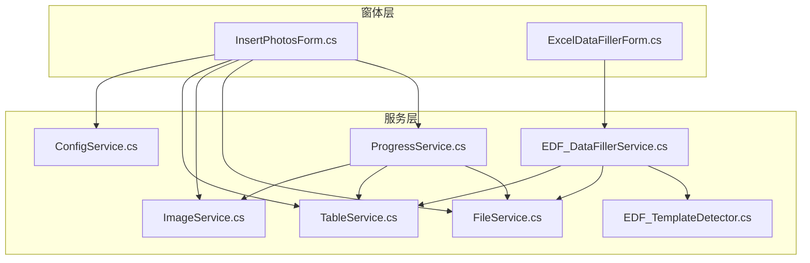
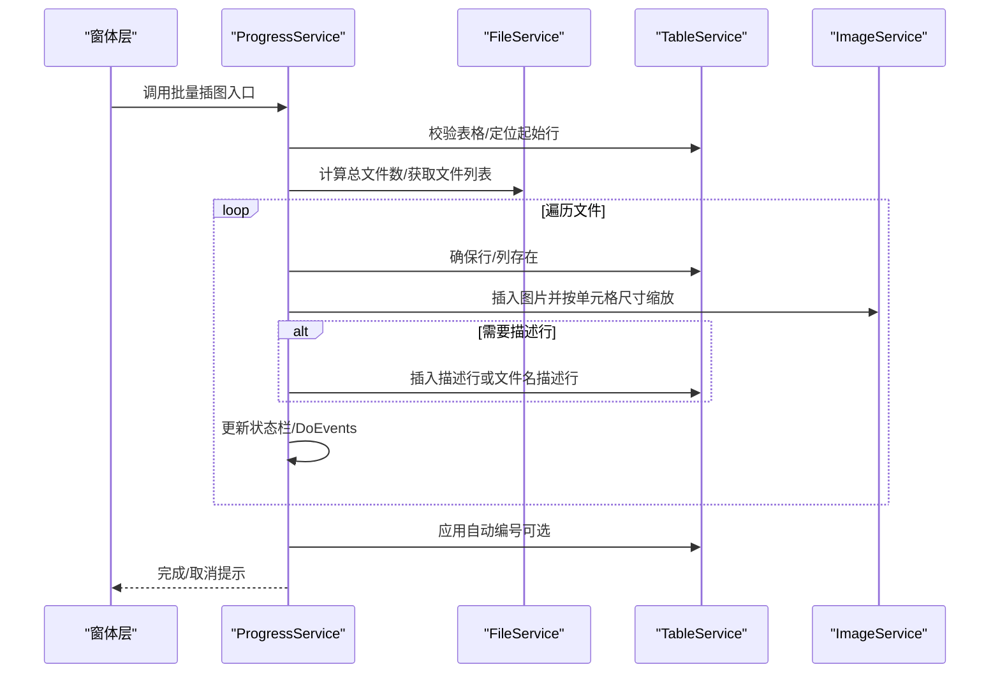
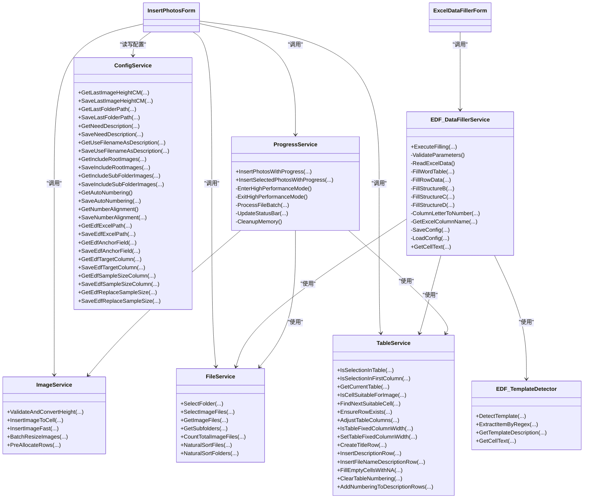

# 服务层

<cite>
**本文引用的文件**
- [FileService.cs](file://WordTools/Services/FileService.cs)
- [TableService.cs](file://WordTools/Services/TableService.cs)
- [ProgressService.cs](file://WordTools/Services/ProgressService.cs)
- [ImageService.cs](file://WordTools/Services/ImageService.cs)
- [ConfigService.cs](file://WordTools/Services/ConfigService.cs)
- [EDF_DataFillerService.cs](file://WordTools/Services/EDF_DataFillerService.cs)
- [EDF_TemplateDetector.cs](file://WordTools/Services/EDF_TemplateDetector.cs)
- [InsertPhotosForm.cs](file://WordTools/Forms/InsertPhotosForm.cs)
- [ExcelDataFillerForm.cs](file://WordTools/Forms/ExcelDataFillerForm.cs)
- [README.md](file://README.md)
</cite>

## 目录
1. [简介](#简介)
2. [项目结构](#项目结构)
3. [核心组件](#核心组件)
4. [架构总览](#架构总览)
5. [详细组件分析](#详细组件分析)
6. [依赖关系分析](#依赖关系分析)
7. [性能考量](#性能考量)
8. [故障排查指南](#故障排查指南)
9. [结论](#结论)
10. [附录](#附录)

## 简介
本文件面向WordTools项目的"服务层"，系统性梳理并文档化以下服务类的实现细节、接口规范、调用关系与协作模式：
- FileService：文件系统操作（文件夹选择、文件过滤、路径处理、自然排序）
- TableService：Word表格处理（单元格校验、插入图片、自动编号、布局管理）
- ProgressService：批量插图进度监控（取消控制、性能优化、状态栏更新）
- ImageService：图片插入与尺寸调整（厘米/磅换算、快速插入、批量调整）
- ConfigService：配置持久化（文档自定义属性与注册表）
- EDF_DataFillerService 与 EDF_TemplateDetector：Excel数据填充与模板检测

同时提供使用示例、参数说明、错误处理策略、性能优化建议与扩展指导，帮助开发者高效集成与二次开发。

## 项目结构
服务层位于 WordTools/Services 目录，窗体层位于 WordTools/Forms 目录，二者通过服务类协作完成业务流程。

**图表来源**
- [InsertPhotosForm.cs](file://WordTools/Forms/InsertPhotosForm.cs)
- [ExcelDataFillerForm.cs](file://WordTools/Forms/ExcelDataFillerForm.cs)
- [FileService.cs](file://WordTools/Services/FileService.cs)
- [TableService.cs](file://WordTools/Services/TableService.cs)
- [ProgressService.cs](file://WordTools/Services/ProgressService.cs)
- [ImageService.cs](file://WordTools/Services/ImageService.cs)
- [ConfigService.cs](file://WordTools/Services/ConfigService.cs)
- [EDF_DataFillerService.cs](file://WordTools/Services/EDF_DataFillerService.cs)
- [EDF_TemplateDetector.cs](file://WordTools/Services/EDF_TemplateDetector.cs)

**章节来源**
- [README.md](file://README.md)

## 核心组件
- FileService：提供文件夹选择、图片文件选择、文件/目录存在性验证、图片文件枚举、子目录枚举、自然排序、文件名/路径辅助方法。
- TableService：提供表格校验、单元格适合性判断、行/列调整、固定列宽、标题行/描述行创建、自动编号清理与应用、文本清理。
- ProgressService：提供批量插图主流程（文件夹/选中文件）、取消控制（ESC键）、性能优化（关闭屏幕刷新/警告、定期GC）、状态栏更新、内存清理。
- ImageService：提供厘米/磅换算、高度输入校验、单元格图片插入、快速插入（最小化内存占用）、批量调整、预分配行数。
- ConfigService：提供文档自定义属性与注册表的读写封装，涵盖图片高度、文件夹路径、描述行开关、文件范围、自动编号与对齐等配置，以及Excel数据填充相关的配置项。
- EDF_DataFillerService：Excel数据填充主流程，参数校验、Excel读取、Word表格填充、模板检测与策略分发、状态回调、性能优化，**增强了全面的错误处理和异常捕获机制**。
- EDF_TemplateDetector：模板检测器，识别结构A/B/C/D并输出模板信息，辅助填充策略选择，**增强了单元格文本提取和正则表达式的异常处理**。

**章节来源**
- [FileService.cs](file://WordTools/Services/FileService.cs)
- [TableService.cs](file://WordTools/Services/TableService.cs)
- [ProgressService.cs](file://WordTools/Services/ProgressService.cs)
- [ImageService.cs](file://WordTools/Services/ImageService.cs)
- [ConfigService.cs](file://WordTools/Services/ConfigService.cs)
- [EDF_DataFillerService.cs](file://WordTools/Services/EDF_DataFillerService.cs)
- [EDF_TemplateDetector.cs](file://WordTools/Services/EDF_TemplateDetector.cs)

## 架构总览
服务层采用"窗体层驱动服务"的模式：
- 窗体层负责UI交互、参数收集与校验，并调用服务层执行具体任务。
- 服务层内部通过静态/实例类协作，完成文件系统、Word对象模型操作与配置持久化。
- 进度服务在批量操作中统一管理性能优化与状态反馈，确保用户体验与稳定性。

**图表来源**
- [ProgressService.cs](file://WordTools/Services/ProgressService.cs)
- [FileService.cs](file://WordTools/Services/FileService.cs)
- [TableService.cs](file://WordTools/Services/TableService.cs)
- [ImageService.cs](file://WordTools/Services/ImageService.cs)
- [InsertPhotosForm.cs](file://WordTools/Forms/InsertPhotosForm.cs)

## 详细组件分析

### FileService 文件系统服务
职责与能力
- 文件夹选择：弹出系统文件夹选择对话框，支持初始路径与标题定制。
- 图片文件选择：多选图片文件，支持初始目录与过滤器。
- 文件验证：判断文件是否为支持的图片扩展名、文件是否存在。
- 文件列表获取：按扩展名枚举图片文件（支持递归子目录）、仅根目录、子目录列表；统计总图片数量。
- 自然排序：对文件/文件夹路径数组进行自然排序（类似资源管理器）。
- 路径与文件名辅助：获取文件名（含/不含扩展名）、文件夹名、父目录。

接口规范（节选）
- 选择文件夹：SelectFolder(dialogTitle, initialPath) -> string
- 选择图片文件：SelectImageFiles(dialogTitle, initialPath) -> string[]
- 验证图片：IsValidImageFile(filePath) -> bool
- 验证文件存在：FileExists(filePath) -> bool
- 获取图片文件：GetImageFiles(folderPath, includeSubfolders=false) -> string[]
- 获取根目录图片：GetRootImageFiles(folderPath) -> string[]
- 获取子目录：GetSubfolders(folderPath) -> string[]
- 统计图片数量：CountTotalImageFiles(folderPath, includeRootImages, includeSubFolderImages) -> int
- 自然排序：NaturalSortFiles(filePaths) -> string[]；NaturalSortFolders(folderPaths) -> string[]
- 路径辅助：GetFileNameWithoutExtension(filePath)、GetFileName(filePath)、GetFolderName(folderPath)、GetParentFolder(path)

实现要点
- 使用系统对话框与目录API，保证兼容性与一致性。
- 自然排序算法基于字符/数字混合比较，忽略大小写。
- 文件/目录存在性与扩展名校验前置，降低后续操作失败概率。

**章节来源**
- [FileService.cs](file://WordTools/Services/FileService.cs)

### TableService Word表格服务
职责与能力
- 表格验证：判断当前选择是否在表格内、是否在第一列、获取当前表格对象。
- 单元格校验：判断单元格是否适合插入图片（无图片、无自动编号、清理序号文本等）。
- 查找合适单元格：在一定范围内寻找可插入的单元格，支持优先列偏好。
- 表格操作：确保行存在、调整列数、固定列宽开关。
- 标题行/描述行：创建标题行、插入描述行、按文件名插入描述行、填充空单元格为"N/A"。
- 自动编号：清理原有编号（含列表格式与纯文本序号）、计算起始编号、应用编号并设置对齐。

接口规范（节选）
- 验证：IsSelectionInTable(selection)、IsSelectionInFirstColumn(selection)、GetCurrentTable(selection)
- 单元格：IsCellSuitableForImage(targetCell)、FindNextSuitableCell(tbl, startRow, out foundRow, out foundCol, preferredCol)
- 表格：EnsureRowExists(tbl, rowIndex)、AdjustTableColumns(tbl, targetColCount)、IsTableFixedColumnWidth(tbl)、SetTableFixedColumnWidth(tbl)
- 标题/描述：CreateTitleRow(tbl, ref rowIndex, titleText)、InsertDescriptionRow(tbl, ref rowIndex)、InsertFileNameDescriptionRow(tbl, ref rowIndex, fileNames)、FillEmptyCellsWithNA(tbl, rowIndex, startCol, endCol)
- 编号：ClearTableNumbering(tbl, startRow=1) -> 原对齐方式；AddNumberingToDescriptionRows(tbl, doc, startRow, alignment, needAutoNumbering)

实现要点
- 对Word COM对象的访问采用try/catch兜底，避免单点异常中断流程。
- 自动编号清理支持两种场景：列表模板编号与纯文本序号，确保可复用。
- 对齐方式与编号起始值通过历史行推断，保证连续性。

**章节来源**
- [TableService.cs](file://WordTools/Services/TableService.cs)

### ProgressService 进度监控服务
职责与能力
- 取消控制：检测ESC键，支持用户随时取消。
- 性能优化：进入/退出高性能模式（关闭屏幕刷新、警告、拼写/语法检查），减少UI抖动与提示弹窗。
- 批量插图入口：
  - 从文件夹批量插入：InsertPhotosWithProgress(...)
  - 从选中文件批量插入：InsertSelectedPhotosWithProgress(...)
- 文件批量处理：逐批处理文件，动态更新状态栏、DoEvents、定期GC。
- 状态栏更新：显示进度百分比、剩余时间、当前文件名、耗时。
- 内存清理：按批次触发GC与DoEvents，缓解大文件批量插入的内存压力。

接口规范（节选）
- 批量插图（文件夹）：InsertPhotosWithProgress(folderPath, minHeight, needDescription, useFileNameAsDescription, includeRootImages, includeSubFolderImages, needAutoNumbering, numberAlignment)
- 批量插图（选中文件）：InsertSelectedPhotosWithProgress(files[], minHeight, needDescription, useFileNameAsDescription, needAutoNumbering, numberAlignment)

实现要点
- 优化刷新间隔随文件数量自适应，文件越多刷新越稀疏，平衡流畅度与实时性。
- 预分配表格行数，减少频繁AddRows带来的性能损耗。
- 取消标志与ESC键检测结合，确保及时响应。

**章节来源**
- [ProgressService.cs](file://WordTools/Services/ProgressService.cs)

### ImageService 图片服务
职责与能力
- 尺寸换算：厘米与磅互转，输入校验与转换。
- 图片插入：
  - InsertImageToCell：按单元格尺寸与边距限制缩放，保持宽高比，支持最小高度约束。
  - InsertImageFast：最小化内存占用的快速插入，仅做宽度限制与最小高度约束。
- 批量调整：对表格中已插入图片进行批量尺寸调整。
- 预分配行：根据预计图片数量与每行图片数、是否需要描述行，批量添加行并更新状态栏。

接口规范（节选）
- 换算：ConvertCMToPoints(cm)、ConvertPointsToCM(points)、ValidateAndConvertHeight(input, out points) -> bool
- 插入：InsertImageToCell(targetCell, imagePath, minHeightPoints=-1) -> InlineShape；InsertImageFast(targetCell, imagePath, minHeightPoints=-1)
- 批量：BatchResizeImages(tbl, startRow, endRow, minHeightPoints=-1)；PreAllocateRows(tbl, estimatedImageCount, imagesPerRow=2, needDescription=false, app=null)

实现要点
- LockAspectRatio开启，保证缩放后比例不变。
- 快速插入仅做宽度限制，避免不必要的高度计算，适合大批量场景。

**章节来源**
- [ImageService.cs](file://WordTools/Services/ImageService.cs)

### ConfigService 配置服务
职责与能力
- 文档自定义属性：读取/保存配置到当前文档自定义属性，兼容空值存储。
- 注册表：读取/保存配置到HKCU路径，作为回退方案。
- 配置项：
  - 图片高度（厘米）
  - 最后文件夹路径
  - 是否需要描述行
  - 是否使用文件名作为描述
  - 是否包含根目录/子目录图片
  - 是否启用自动编号
  - 编号对齐（靠左/居中）
  - Excel数据填充相关配置（锚定字段、目标列、Sample Size列、是否替换）

接口规范（节选）
- 图片高度：GetLastImageHeightCM(doc?)、SaveLastImageHeightCM(heightCM, doc?)
- 文件夹路径：GetLastFolderPath(doc?)、SaveLastFolderPath(folderPath, doc?)
- 描述行：GetNeedDescription(doc?)、SaveNeedDescription(value, doc?)；GetUseFilenameAsDescription(doc?)、SaveUseFilenameAsDescription(value, doc?)
- 文件范围：GetIncludeRootImages(doc?)、SaveIncludeRootImages(value, doc?)；GetIncludeSubFolderImages(doc?)、SaveIncludeSubFolderImages(value, doc?)
- 自动编号：GetAutoNumbering()、SaveAutoNumbering(value)
- 编号对齐：GetNumberAlignment()、SaveNumberAlignment(alignment)
- Excel数据填充：GetEdfExcelPath/doc?、SaveEdfExcelPath/path/doc?；GetEdfAnchorField/doc?、SaveEdfAnchorField/value/doc?；GetEdfTargetColumn/doc?、SaveEdfTargetColumn/value/doc?；GetEdfSampleSizeColumn/doc?、SaveEdfSampleSizeColumn/value/doc?；GetEdfReplaceSampleSize/doc?、SaveEdfReplaceSampleSize/value/doc?

实现要点
- 空值使用特殊标记避免Word COM拒绝空字符串。
- 优先从文档属性读取，失败回退到注册表，保证跨文档迁移与默认值可用。

**章节来源**
- [ConfigService.cs](file://WordTools/Services/ConfigService.cs)

### EDF_DataFillerService 与 EDF_TemplateDetector Excel数据填充服务

**更新** 增强了全面的错误处理和异常捕获机制

职责与能力
- EDF_DataFillerService：
  - 参数校验（Excel文件存在性、锚定字段非空）
  - Excel读取（.xlsx/.xls通用连接串）
  - Word表格填充（遍历表格，匹配锚定字段，按模板类型选择策略）
  - 模板检测与策略分发（结构A/B/C/D）
  - 性能优化（关闭ScreenUpdating）
  - 状态回调与诊断信息（未匹配时输出锚定字段与Excel/Word前若干行内容）
  - **全面的异常处理**：每个关键操作都包含try/catch块，确保单点异常不会中断整个流程
  - **资源管理**：使用finally块确保DataTable资源被正确释放
- EDF_TemplateDetector：
  - 检测模板类型（A/B/C/D）
  - 提取Item值（正则）
  - 判断是否为有效Item编号
  - 模板描述文本
  - **增强的异常处理**：所有单元格文本提取、正则表达式匹配和验证操作都包含异常捕获

接口规范（节选）
- 填充执行：ExecuteFilling(excelPath, anchorField, targetColumn, sampleSizeColumn, replaceSampleSize, onStatusUpdate)
- 模板检测：DetectTemplate(tbl, anchorRow, anchorField) -> TemplateInfo
- 正则提取：ExtractItemByRegex(cellText) -> string
- 模板描述：GetTemplateDescription(tpl) -> string

实现要点
- 模板检测基于锚定字段匹配与单元格内容特征，自动选择填充策略。
- 对异常进行捕获与友好提示，未匹配时输出诊断信息辅助定位问题。
- **新增**：每个私有方法都包含独立的try/catch块，使用Debug.WriteLine记录详细的错误信息。
- **新增**：GetCellText方法包含完整的异常处理，确保即使单元格访问失败也能返回空字符串而非抛出异常。

**章节来源**
- [EDF_DataFillerService.cs](file://WordTools/Services/EDF_DataFillerService.cs)
- [EDF_TemplateDetector.cs](file://WordTools/Services/EDF_TemplateDetector.cs)

## 依赖关系分析

**图表来源**
- [ProgressService.cs](file://WordTools/Services/ProgressService.cs)
- [FileService.cs](file://WordTools/Services/FileService.cs)
- [TableService.cs](file://WordTools/Services/TableService.cs)
- [ImageService.cs](file://WordTools/Services/ImageService.cs)
- [ConfigService.cs](file://WordTools/Services/ConfigService.cs)
- [EDF_DataFillerService.cs](file://WordTools/Services/EDF_DataFillerService.cs)
- [EDF_TemplateDetector.cs](file://WordTools/Services/EDF_TemplateDetector.cs)
- [InsertPhotosForm.cs](file://WordTools/Forms/InsertPhotosForm.cs)
- [ExcelDataFillerForm.cs](file://WordTools/Forms/ExcelDataFillerForm.cs)

## 性能考量
- 进度服务
  - 自适应刷新间隔：根据文件总数动态调整，文件越多刷新越稀疏，降低UI负担。
  - 高性能模式：关闭ScreenUpdating与DisplayAlerts，减少Word界面刷新与警告弹窗。
  - 定期内存清理：按批次触发GC与DoEvents，缓解大批量插入导致的内存峰值。
  - 预分配行数：提前批量AddRows，减少逐行插入的开销。
- 表格服务
  - 单元格校验与自动编号清理在插入前完成，避免重复处理。
  - 固定列宽减少Word自动调整列宽的开销。
- 图片服务
  - 快速插入仅做宽度限制，避免高度计算，适合大批量场景。
  - 批量调整时逐单元格处理，异常隔离，避免影响整体流程。
- 配置服务
  - 文档自定义属性优先，注册表回退，减少IO次数与兼容性问题。
  - Excel数据填充配置项专门化，支持更精确的参数管理。
- Excel数据填充
  - 关闭ScreenUpdating，减少填充过程中的界面刷新。
  - 模板检测与策略分发减少重复扫描，提高填充效率。
  - **新增**：每个操作步骤都有异常处理，确保性能不受单点异常影响。

## 故障排查指南
- 进度服务
  - ESC键取消：若操作未响应，确认是否已按ESC键触发取消。
  - 状态栏异常：检查DoEvents调用与异常捕获，确保状态栏更新逻辑正常。
  - 内存不足：适当增大内存清理间隔或减少单次处理文件数。
- 表格服务
  - 单元格不适合插入：检查是否已有图片、是否为自动编号、是否为纯数字序号。
  - 行/列调整失败：确认表格对象非空，异常被捕获并忽略，避免中断流程。
- 图片服务
  - 插入失败：检查文件路径有效性与图片格式，异常被捕获并返回空。
  - 尺寸异常：确认高度输入为正数，厘米/磅换算正确。
- 配置服务
  - 空值问题：空值使用特殊标记保存，避免COM拒绝空字符串。
  - 权限问题：注册表读写需当前用户权限，失败时回退到文档属性。
  - Excel数据填充配置：检查配置项的读写是否正常，特别是空值处理。
- Excel数据填充
  - Excel读取失败：检查文件扩展名与连接串，确认工作表存在。
  - 未匹配锚定字段：查看诊断信息，核对锚定字段与Excel/Word内容。
  - **新增**：异常处理增强：如果某个操作失败，系统会记录详细的Debug信息并在UI中显示友好的错误提示，同时继续处理其他数据行。
  - **新增**：模板检测异常：GetCellText方法的异常处理确保即使单元格访问失败也不会影响整体流程。

**章节来源**
- [ProgressService.cs](file://WordTools/Services/ProgressService.cs)
- [TableService.cs](file://WordTools/Services/TableService.cs)
- [ImageService.cs](file://WordTools/Services/ImageService.cs)
- [ConfigService.cs](file://WordTools/Services/ConfigService.cs)
- [EDF_DataFillerService.cs](file://WordTools/Services/EDF_DataFillerService.cs)

## 结论
服务层围绕"文件系统、Word表格、图片处理、配置持久化、Excel填充"五大领域，提供了稳定、可扩展的基础设施。通过窗体层的参数收集与流程编排，服务层实现了高内聚、低耦合的功能模块，具备良好的错误处理与性能优化策略。

**更新** EDF_DataFillerService和EDF_TemplateDetector的错误处理机制得到了显著增强，每个关键操作都包含了完善的异常捕获和资源管理，确保系统在面对各种异常情况时仍能保持稳定运行。这种改进提高了系统的健壮性和用户体验，特别是在处理复杂的Word表格和Excel数据时表现更加可靠。

开发者可在现有接口基础上扩展新功能，遵循统一的错误处理与性能优化模式，确保系统的可靠性与可维护性。

## 附录

### 使用示例与参数说明（基于窗体层调用）
- 批量插图（文件夹）
  - 触发：InsertPhotosForm 中"插入文件夹"按钮
  - 参数：folderPath、minHeight（厘米输入，内部转换为磅）、needDescription、useFileNameAsDescription、includeRootImages、includeSubFolderImages、needAutoNumbering、numberAlignment（1=靠左，2=居中）
  - 流程：窗体收集参数 -> 调用 ProgressService.InsertPhotosWithProgress(...) -> FileService/ TableService/ImageService 协作 -> 完成提示
- 批量插图（选中文件）
  - 触发：InsertPhotosForm 中"选择文件"按钮
  - 参数：files[]、minHeight、needDescription、useFileNameAsDescription、needAutoNumbering、numberAlignment
  - 流程：窗体收集参数 -> 调用 ProgressService.InsertSelectedPhotosWithProgress(...) -> 协作流程同上
- Excel数据填充
  - 触发：ExcelDataFillerForm 中"执行填充"按钮
  - 参数：excelPath、anchorField、targetColumn、sampleSizeColumn、replaceSampleSize、onStatusUpdate
  - 流程：窗体收集参数 -> 调用 EDF_DataFillerService.ExecuteFilling(...) -> 模板检测与填充 -> 状态回调

**章节来源**
- [InsertPhotosForm.cs](file://WordTools/Forms/InsertPhotosForm.cs)
- [ExcelDataFillerForm.cs](file://WordTools/Forms/ExcelDataFillerForm.cs)
- [ProgressService.cs](file://WordTools/Services/ProgressService.cs)
- [EDF_DataFillerService.cs](file://WordTools/Services/EDF_DataFillerService.cs)

### 扩展指导与最佳实践
- 新增服务类
  - 保持单一职责，尽量使用静态类（如FileService、ImageService）或轻量实例类（如ProgressService）。
  - 明确输入输出参数，提供清晰的异常说明与默认行为。
  - 在关键路径增加异常捕获，避免中断主流程。
  - **新增**：参考EDF_DataFillerService和EDF_TemplateDetector的模式，在每个方法中都包含try/catch块和适当的异常处理。
- 性能优化
  - 大批量操作时采用分批处理与自适应刷新间隔。
  - 批量插入前预分配行数，减少AddRows次数。
  - 关闭不必要的UI刷新与警告，必要时在finally中恢复。
- 错误处理
  - 对外部依赖（文件系统、Word COM、注册表）进行前置校验与异常捕获。
  - 对用户输入进行严格校验，提供明确的错误提示。
  - **新增**：使用Debug.WriteLine记录详细的错误信息，便于调试和问题追踪。
  - **新增**：确保finally块能够正确释放资源，避免内存泄漏。
- 配置持久化
  - 优先使用文档自定义属性，失败时回退到注册表。
  - 对空值进行特殊标记，避免COM拒绝空字符串。
  - **新增**：Excel数据填充配置项专门化，支持更精确的参数管理。
- 模板检测与填充
  - 模板检测应覆盖常见结构，提供清晰的描述文本与诊断信息。
  - 填充策略应与锚定字段匹配，支持多种格式与边界情况。
  - **新增**：增强的异常处理确保即使部分单元格访问失败也不会影响整体填充流程。