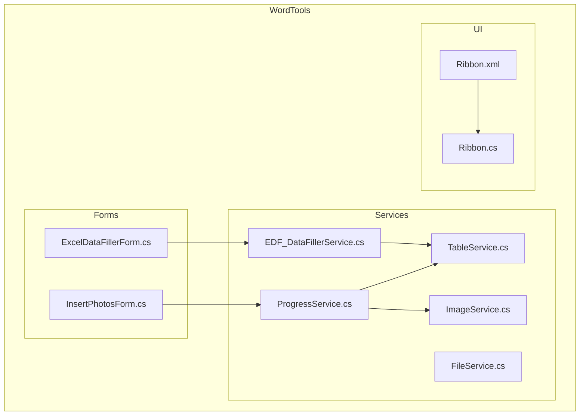
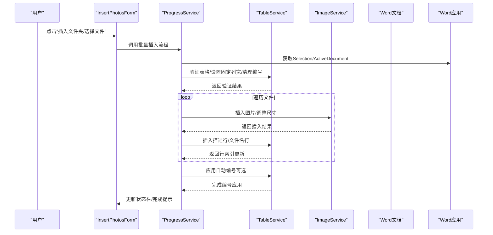
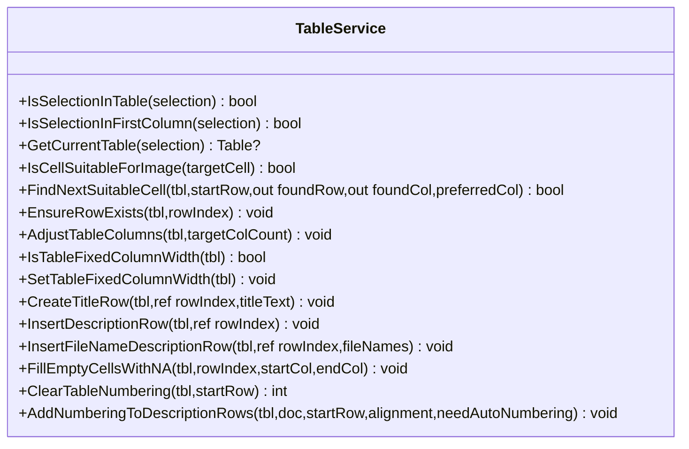
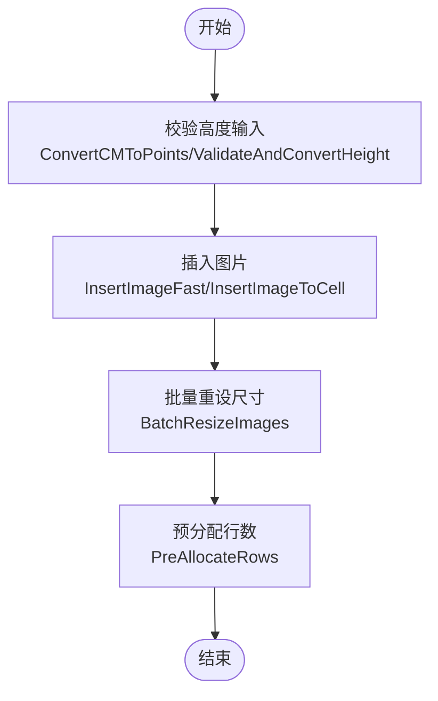
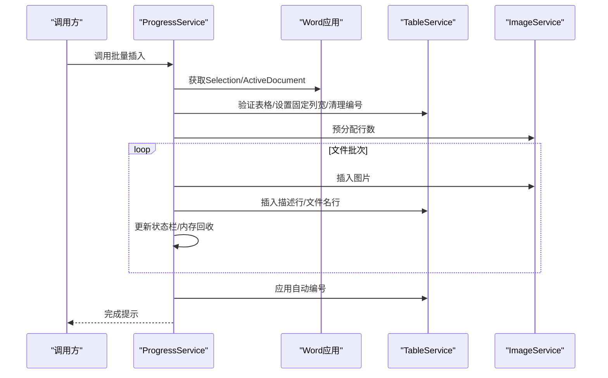
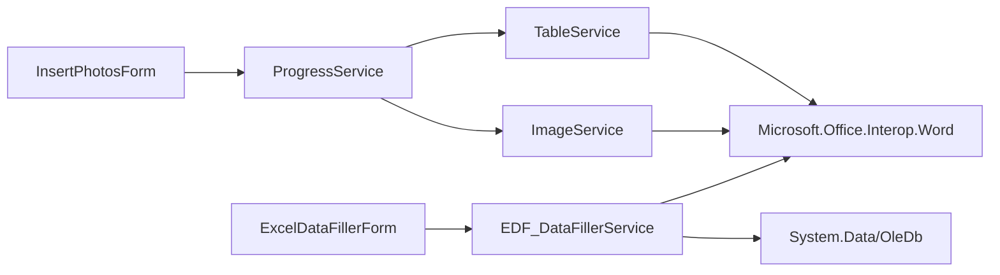

# 表格服务

<cite>
**本文引用的文件**
- [TableService.cs](file://WordTools/Services/TableService.cs)
- [ImageService.cs](file://WordTools/Services/ImageService.cs)
- [ProgressService.cs](file://WordTools/Services/ProgressService.cs)
- [InsertPhotosForm.cs](file://WordTools/Forms/InsertPhotosForm.cs)
- [ExcelDataFillerForm.cs](file://WordTools/Forms/ExcelDataFillerForm.cs)
- [EDF_DataFillerService.cs](file://WordTools/Services/EDF_DataFillerService.cs)
- [FileService.cs](file://WordTools/Services/FileService.cs)
- [Ribbon.cs](file://WordTools/Ribbon.cs)
- [Ribbon.xml](file://WordTools/Ribbon.xml)
- [README.md](file://README.md)
</cite>

## 目录
1. [简介](#简介)
2. [项目结构](#项目结构)
3. [核心组件](#核心组件)
4. [架构概览](#架构概览)
5. [详细组件分析](#详细组件分析)
6. [依赖关系分析](#依赖关系分析)
7. [性能考量](#性能考量)
8. [故障排除指南](#故障排除指南)
9. [结论](#结论)
10. [附录](#附录)

## 简介
本文档面向WordTools项目中的表格服务，系统性地解析TableService类的实现细节与Word表格处理能力，覆盖单元格选择、格式设置、内容插入、布局管理（行列操作、合并拆分、边框设置）、Word Interop集成机制、表格数据绑定与动态更新、样式应用以及最佳实践与性能优化建议，并提供具体使用示例与常见问题解决方案。

## 项目结构
- 插件采用COM加载项（IDTExtensibility2）实现，功能区通过Ribbon.xml与Ribbon.cs定义，核心业务逻辑集中在Services目录下的多个服务类中。
- 表格服务主要由TableService负责，配合ImageService、ProgressService、EDF_DataFillerService等共同完成批量图片插入、自动编号、Excel数据填充等功能。
- 用户界面通过Forms目录下的窗体实现，如批量插图工具与Excel数据填充工具。

图表来源
- [InsertPhotosForm.cs:1-574](file://WordTools/Forms/InsertPhotosForm.cs#L1-L574)
- [ExcelDataFillerForm.cs:1-432](file://WordTools/Forms/ExcelDataFillerForm.cs#L1-L432)
- [TableService.cs:1-756](file://WordTools/Services/TableService.cs#L1-L756)
- [ImageService.cs:1-325](file://WordTools/Services/ImageService.cs#L1-L325)
- [ProgressService.cs:1-571](file://WordTools/Services/ProgressService.cs#L1-L571)
- [EDF_DataFillerService.cs:1-334](file://WordTools/Services/EDF_DataFillerService.cs#L1-L334)
- [FileService.cs:1-310](file://WordTools/Services/FileService.cs#L1-L310)
- [Ribbon.xml:27-52](file://WordTools/Ribbon.xml#L27-L52)
- [Ribbon.cs:105-174](file://WordTools/Ribbon.cs#L105-L174)

章节来源
- [README.md:1-85](file://README.md#L1-L85)

## 核心组件
- TableService：静态工具类，封装表格验证、单元格适配性检查、行列管理、标题行与描述行创建、自动编号清理与应用、固定列宽设置等。
- ImageService：图片插入与尺寸调整，批量预分配行、批量重设图片尺寸、快速插入等。
- ProgressService：批量操作进度控制、性能优化（关闭屏幕更新、禁用警告、内存回收）、取消机制（ESC键）。
- EDF_DataFillerService：Excel数据填充Word表格，读取Excel、定位锚定字段、按模板填充、替换Sample Size等。
- InsertPhotosForm/ExcelDataFillerForm：用户交互界面，收集参数并触发相应服务。
- FileService：文件与文件夹选择、图片文件筛选、自然排序、统计等。
- Ribbon/Ribbon.xml：功能区定义与回调，连接UI与服务层。

章节来源
- [TableService.cs:11-756](file://WordTools/Services/TableService.cs#L11-L756)
- [ImageService.cs:10-325](file://WordTools/Services/ImageService.cs#L10-L325)
- [ProgressService.cs:14-571](file://WordTools/Services/ProgressService.cs#L14-L571)
- [EDF_DataFillerService.cs:14-334](file://WordTools/Services/EDF_DataFillerService.cs#L14-L334)
- [InsertPhotosForm.cs:19-574](file://WordTools/Forms/InsertPhotosForm.cs#L19-L574)
- [ExcelDataFillerForm.cs:12-432](file://WordTools/Forms/ExcelDataFillerForm.cs#L12-L432)
- [FileService.cs:13-310](file://WordTools/Services/FileService.cs#L13-L310)
- [Ribbon.xml:27-52](file://WordTools/Ribbon.xml#L27-L52)
- [Ribbon.cs:105-174](file://WordTools/Ribbon.cs#L105-L174)

## 架构概览
下图展示从用户界面到服务层再到Word Interop的调用链路，突出表格服务在批量图片插入与Excel数据填充中的关键作用。

图表来源
- [InsertPhotosForm.cs:514-563](file://WordTools/Forms/InsertPhotosForm.cs#L514-L563)
- [ProgressService.cs:151-306](file://WordTools/Services/ProgressService.cs#L151-L306)
- [TableService.cs:18-40](file://WordTools/Services/TableService.cs#L18-L40)
- [ImageService.cs:73-134](file://WordTools/Services/ImageService.cs#L73-L134)

## 详细组件分析

### TableService 类详解
TableService是一个静态工具类，集中处理表格验证、单元格适配性检查、行列管理、标题行与描述行创建、自动编号清理与应用、固定列宽设置等。

- 表格验证
  - IsSelectionInTable：判断当前选择是否位于表格内。
  - IsSelectionInFirstColumn：判断当前选择是否位于第一列。
  - GetCurrentTable：获取当前表格对象。
- 单元格适配性与查找
  - IsCellSuitableForImage：检查单元格是否适合插入图片（无图片、无自动编号、空或可清除的序号文本）。
  - FindNextSuitableCell：在给定范围内查找下一个适合插入图片的单元格，支持优先列偏好。
- 行列管理
  - EnsureRowExists：确保指定行存在，不足时自动追加行并保证至少两列。
  - AdjustTableColumns：调整表格列数，自动增删列至目标数量。
  - IsTableFixedColumnWidth/SetTableFixedColumnWidth：检测与设置表格为固定列宽。
- 标题行与描述行
  - CreateTitleRow：创建合并的标题行，居中对齐，移动到下一行。
  - InsertDescriptionRow：插入描述行占位。
  - InsertFileNameDescriptionRow：将文件名写入对应列，居中对齐，必要时补空列。
  - FillEmptyCellsWithNA：将指定范围空单元格填充为N/A并居中对齐。
- 自动编号
  - ClearTableNumbering：清除表格中的自动编号，记录并返回原编号对齐方式。
  - AddNumberingToDescriptionRows：在描述行应用自定义编号列表，支持居左/居中/居右对齐。

图表来源
- [TableService.cs:11-756](file://WordTools/Services/TableService.cs#L11-L756)

章节来源
- [TableService.cs:18-737](file://WordTools/Services/TableService.cs#L18-L737)

### ImageService 类详解
ImageService专注于图片插入与尺寸调整，提供快速插入、批量重设尺寸、预分配行等能力。

- 尺寸转换
  - ConvertCMToPoints/ConvertPointsToCM：厘米与磅之间的转换。
  - ValidateAndConvertHeight：校验并转换用户输入的高度（厘米）。
- 图片插入
  - InsertImageToCell：插入图片并保持宽高比，按单元格尺寸限制缩放，支持最小高度约束。
  - InsertImageFast：快速插入，最小化内存占用，仅按宽度限制调整。
- 批量操作
  - BatchResizeImages：批量调整指定范围内的图片尺寸。
  - BatchAddRows：批量添加行，支持状态栏更新与分批处理。
  - PreAllocateRows：根据预计图片数量与每行图片数预分配行数，支持描述行翻倍与上限控制。

图表来源
- [ImageService.cs:43-325](file://WordTools/Services/ImageService.cs#L43-L325)

章节来源
- [ImageService.cs:10-325](file://WordTools/Services/ImageService.cs#L10-L325)

### ProgressService 类详解
ProgressService负责批量操作的进度控制与性能优化，支持取消（ESC键）、内存回收、状态栏更新与不同文件规模的刷新策略。

- 取消控制
  - CheckEscapeKey/ShouldCancel：检测ESC键并设置取消标志。
- 性能优化
  - EnterHighPerformanceMode/ExitHighPerformanceMode：关闭屏幕更新、禁用警告、标记拼写/语法检查。
  - GetOptimizedRefreshInterval：根据文件数量动态调整刷新间隔。
  - CleanupMemory：定期触发GC以降低内存压力。
- 批量插入流程
  - InsertPhotosWithProgress/InsertSelectedPhotosWithProgress：统一的批量插入入口，包含表格验证、固定列宽、预分配行、逐批处理、状态栏更新、自动编号应用与收尾。
  - ProcessFileBatch：核心批处理循环，负责行索引推进、单元格适配性检查、图片插入、描述行/文件名行插入、内存清理与收尾处理。

图表来源
- [ProgressService.cs:151-306](file://WordTools/Services/ProgressService.cs#L151-L306)
- [TableService.cs:18-40](file://WordTools/Services/TableService.cs#L18-L40)
- [ImageService.cs:287-320](file://WordTools/Services/ImageService.cs#L287-L320)

章节来源
- [ProgressService.cs:14-571](file://WordTools/Services/ProgressService.cs#L14-L571)

### Excel数据填充服务（EDF_DataFillerService）
EDF_DataFillerService负责从Excel读取数据并填充到Word表格，支持锚定字段匹配、目标列映射、Sample Size替换与状态反馈。

- 参数验证与读取
  - ExecuteFilling：执行填充流程，包含参数验证、Excel数据读取、状态更新与结果提示。
  - ReadExcelData：读取Excel数据到DataTable。
- Word表格填充
  - FillWordTable：定位锚定字段，按模板结构填充数据，支持替换Sample Size。
  - FillRowData：按默认结构A填充行数据，确保目标列存在并写入第一列数据。
- 单元格文本处理
  - GetCellText：清理单元格文本（去除结束标记）。

图表来源
- [EDF_DataFillerService.cs:30-334](file://WordTools/Services/EDF_DataFillerService.cs#L30-L334)

章节来源
- [EDF_DataFillerService.cs:14-334](file://WordTools/Services/EDF_DataFillerService.cs#L14-L334)

### 用户界面与功能区集成
- InsertPhotosForm：批量插图工具窗体，收集文件夹/文件、图片高度、范围、描述选项、自动编号与对齐方式，调用ProgressService执行批量插入。
- ExcelDataFillerForm：Excel数据填充工具窗体，收集Excel路径、锚定字段、目标列、Sample Size替换等参数，调用EDF_DataFillerService执行填充。
- Ribbon/Ribbon.xml：定义功能区标签与按钮，回调至Ribbon.cs中的OnInsertPhotosClick/OnExcelDataFillerClick等方法。

图表来源
- [ExcelDataFillerForm.cs:333-347](file://WordTools/Forms/ExcelDataFillerForm.cs#L333-L347)
- [EDF_DataFillerService.cs:30-70](file://WordTools/Services/EDF_DataFillerService.cs#L30-L70)

章节来源
- [InsertPhotosForm.cs:514-563](file://WordTools/Forms/InsertPhotosForm.cs#L514-L563)
- [ExcelDataFillerForm.cs:299-355](file://WordTools/Forms/ExcelDataFillerForm.cs#L299-L355)
- [Ribbon.xml:27-52](file://WordTools/Ribbon.xml#L27-L52)
- [Ribbon.cs:105-174](file://WordTools/Ribbon.cs#L105-L174)

## 依赖关系分析
- TableService依赖Microsoft.Office.Interop.Word命名空间，直接操作Selection、Table、Cell、Range、InlineShape等对象。
- ImageService同样依赖Microsoft.Office.Interop.Word，负责图片插入与尺寸调整。
- ProgressService协调TableService与ImageService，同时管理Word应用级别的性能优化与用户交互。
- EDF_DataFillerService依赖System.Data与OleDb读取Excel数据，并通过Word Interop写入表格。
- InsertPhotosForm/ExcelDataFillerForm作为UI入口，调用对应服务并提供状态反馈。

图表来源
- [TableService.cs:1-12](file://WordTools/Services/TableService.cs#L1-L12)
- [ImageService.cs:1-6](file://WordTools/Services/ImageService.cs#L1-L6)
- [ProgressService.cs:1-10](file://WordTools/Services/ProgressService.cs#L1-L10)
- [EDF_DataFillerService.cs:1-10](file://WordTools/Services/EDF_DataFillerService.cs#L1-L10)
- [InsertPhotosForm.cs:1-13](file://WordTools/Forms/InsertPhotosForm.cs#L1-L13)
- [ExcelDataFillerForm.cs:1-6](file://WordTools/Forms/ExcelDataFillerForm.cs#L1-L6)

章节来源
- [TableService.cs:1-12](file://WordTools/Services/TableService.cs#L1-L12)
- [ImageService.cs:1-6](file://WordTools/Services/ImageService.cs#L1-L6)
- [ProgressService.cs:1-10](file://WordTools/Services/ProgressService.cs#L1-L10)
- [EDF_DataFillerService.cs:1-10](file://WordTools/Services/EDF_DataFillerService.cs#L1-L10)

## 性能考量
- 屏幕更新与警告抑制：进入高性能模式时关闭ScreenUpdating与DisplayAlerts，减少UI刷新与弹窗开销。
- 内存管理：按批次处理文件，定期触发GC与DoEvents，避免长时间占用内存。
- 刷新策略：根据文件总数动态调整刷新间隔，平衡用户体验与性能。
- 批量操作：预分配行数、批量重设图片尺寸、批量添加行，减少频繁COM调用带来的性能损耗。
- 取消机制：支持ESC键随时取消，及时释放资源并恢复Word状态。

章节来源
- [ProgressService.cs:73-142](file://WordTools/Services/ProgressService.cs#L73-L142)
- [ImageService.cs:247-320](file://WordTools/Services/ImageService.cs#L247-L320)

## 故障排除指南
- 无法插入图片到表格
  - 确认当前选择位于表格内且在第一列。
  - 检查目标单元格是否已有图片或自动编号；若存在，需先清理或选择其他单元格。
  - 使用IsCellSuitableForImage进行预检，或让系统自动查找下一个合适单元格。
- 表格布局异常
  - 使用AdjustTableColumns确保列数符合预期（至少两列）。
  - 使用EnsureRowExists确保行存在，避免越界访问。
  - 使用SetTableFixedColumnWidth避免自动调整导致的布局抖动。
- 自动编号混乱
  - 先调用ClearTableNumbering清理旧编号，再根据需要调用AddNumberingToDescriptionRows重新应用。
  - 注意编号对齐方式会被记录并返回，以便后续恢复。
- Excel数据填充失败
  - 检查锚定字段是否存在于表格中，目标列是否为有效数字。
  - 若启用了Sample Size替换，确认所在列已正确填写。
  - 查看状态信息输出，定位具体错误位置。
- 性能问题
  - 大批量操作时启用高性能模式，避免频繁刷新与警告。
  - 合理设置图片最小高度，避免过度缩放导致的性能下降。
  - 使用ESC键取消长时间任务，释放资源。

章节来源
- [TableService.cs:18-40](file://WordTools/Services/TableService.cs#L18-L40)
- [TableService.cs:44-196](file://WordTools/Services/TableService.cs#L44-L196)
- [TableService.cs:284-295](file://WordTools/Services/TableService.cs#L284-L295)
- [TableService.cs:446-559](file://WordTools/Services/TableService.cs#L446-L559)
- [TableService.cs:564-737](file://WordTools/Services/TableService.cs#L564-L737)
- [ProgressService.cs:168-201](file://WordTools/Services/ProgressService.cs#L168-L201)
- [EDF_DataFillerService.cs:42-58](file://WordTools/Services/EDF_DataFillerService.cs#L42-L58)
- [ExcelDataFillerForm.cs:360-392](file://WordTools/Forms/ExcelDataFillerForm.cs#L360-L392)

## 结论
TableService作为Word表格处理的核心工具类，提供了完善的表格验证、单元格适配性检查、行列管理、标题与描述行创建、自动编号清理与应用以及固定列宽设置等能力。结合ImageService与ProgressService，实现了高效、稳定的批量图片插入与进度控制；通过EDF_DataFillerService，实现了Excel数据到Word表格的智能填充与动态更新。整体架构清晰、模块职责明确，具备良好的可维护性与扩展性。

## 附录

### 使用示例与最佳实践
- 批量插入图片到表格
  - 步骤：在Word中选中表格并置于第一列，打开批量插图工具，选择文件夹或文件，设置图片高度与范围，选择描述方式与自动编号，点击执行。
  - 关键点：确保表格固定列宽，预分配足够行数，启用高性能模式，合理设置刷新间隔。
- Excel数据填充到表格
  - 步骤：打开Excel数据填充工具，选择Excel文件，输入锚定字段与目标列，配置Sample Size替换，点击执行。
  - 关键点：锚定字段必须存在于表格中，目标列应为有效数字，必要时启用替换功能。
- 表格样式与格式
  - 使用CreateTitleRow创建居中标题行，InsertDescriptionRow插入描述行占位，FillEmptyCellsWithNA填充N/A占位。
  - 使用SetTableFixedColumnWidth避免自动调整，提升稳定性。
- 数据绑定与动态更新
  - EDF_DataFillerService通过锚定字段与目标列实现数据映射，支持替换Sample Size，适合模板化表格的数据填充场景。

章节来源
- [InsertPhotosForm.cs:514-563](file://WordTools/Forms/InsertPhotosForm.cs#L514-L563)
- [ExcelDataFillerForm.cs:333-347](file://WordTools/Forms/ExcelDataFillerForm.cs#L333-L347)
- [TableService.cs:304-357](file://WordTools/Services/TableService.cs#L304-L357)
- [TableService.cs:362-407](file://WordTools/Services/TableService.cs#L362-L407)
- [TableService.cs:412-434](file://WordTools/Services/TableService.cs#L412-L434)
- [TableService.cs:284-295](file://WordTools/Services/TableService.cs#L284-L295)
- [EDF_DataFillerService.cs:30-70](file://WordTools/Services/EDF_DataFillerService.cs#L30-L70)