# 表格服务

<cite>
**本文引用的文件**
- [TableService.cs](file://WordTools/Services/TableService.cs)
- [ImageService.cs](file://WordTools/Services/ImageService.cs)
- [ProgressService.cs](file://WordTools/Services/ProgressService.cs)
- [EDF_DataFillerService.cs](file://WordTools/Services/EDF_DataFillerService.cs)
- [EDF_TemplateDetector.cs](file://WordTools/Services/EDF_TemplateDetector.cs)
- [InsertPhotosForm.cs](file://WordTools/Forms/InsertPhotosForm.cs)
- [ExcelDataFillerForm.cs](file://WordTools/Forms/ExcelDataFillerForm.cs)
- [FileService.cs](file://WordTools/Services/FileService.cs)
- [Ribbon.cs](file://WordTools/Ribbon.cs)
- [Ribbon.xml](file://WordTools/Ribbon.xml)
- [README.md](file://README.md)
- [ThisAddIn.cs](file://WordTools/ThisAddIn.cs)
</cite>

## 更新摘要
**变更内容**
- **重大更新**：RefreshTableNumbering方法已完全重写，从简单的清理和重新添加转变为复杂的增量差异引擎
- 新增六种处理阶段，实现从O(n²)到O(n)的性能优化
- 智能字段管理，支持Word原生列表编号、SEQ域和文本编号的综合处理
- 增强的用户界面反馈，包括进度指示器和自动字段代码隐藏
- 改进的Cell对象缓存机制，提供5-10倍性能提升
- 两遍扫描系统，确保编号的准确性和一致性
- 动态进度报告，支持Action<string>回调的实时状态反馈
- 优化的ScreenUpdating管理策略，动态控制屏幕更新以提升性能
- **新增**：快速路径/慢速路径双重检测系统，智能识别最优处理策略
- **新增**：智能扫描算法，支持光标位置定位和范围优化

## 目录
1. [简介](#简介)
2. [项目结构](#项目结构)
3. [核心组件](#核心组件)
4. [架构概览](#架构概览)
5. [详细组件分析](#详细组件分析)
6. [依赖关系分析](#依赖关系分析)
7. [性能考量](#性能考量)
8. [故障排除指南](#故障排除指南)
9. [结论](#结论)
10. [附录](#附录)

## 简介
本文档面向WordTools项目中的表格服务，系统性地解析TableService类的实现细节与Word表格处理能力，覆盖单元格选择、格式设置、内容插入、布局管理（行列操作、合并拆分、边框设置）、Word Interop集成机制、表格数据绑定与动态更新、样式应用以及最佳实践与性能优化建议，并提供具体使用示例与常见问题解决方案。

**最新更新**：TableService经过重大性能优化重构，引入了全新的增量差异引擎、智能字段管理系统、六阶段处理流程和先进的Cell对象缓存机制，提供从O(n²)到O(n)的性能提升，显著改善用户体验。新增的快速路径/慢速路径双重检测系统能够智能识别最优处理策略，而智能扫描算法则支持光标位置定位和范围优化。

## 项目结构
- 插件采用COM加载项（IDTExtensibility2）实现，功能区通过Ribbon.xml与Ribbon.cs定义，核心业务逻辑集中在Services目录下的多个服务类中。
- 表格服务主要由TableService负责，配合ImageService、ProgressService、EDF_DataFillerService等共同完成批量图片插入、自动编号、Excel数据填充等功能。
- 用户界面通过Forms目录下的窗体实现，如批量插图工具与Excel数据填充工具。

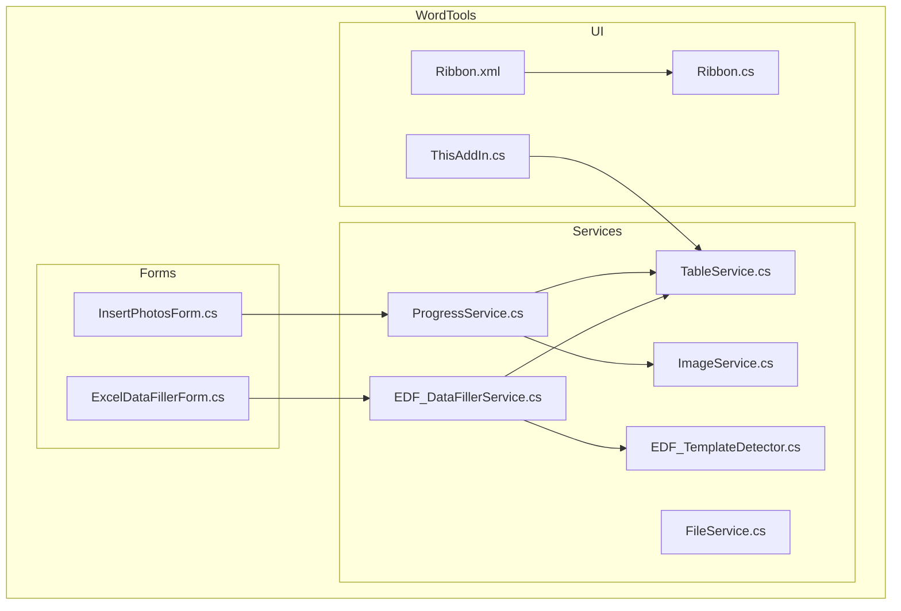

**图表来源**
- [InsertPhotosForm.cs:1-574](file://WordTools/Forms/InsertPhotosForm.cs#L1-L574)
- [ExcelDataFillerForm.cs:1-432](file://WordTools/Forms/ExcelDataFillerForm.cs#L1-L432)
- [TableService.cs:1-1302](file://WordTools/Services/TableService.cs#L1-L1302)
- [ImageService.cs:1-334](file://WordTools/Services/ImageService.cs#L1-L334)
- [ProgressService.cs:1-771](file://WordTools/Services/ProgressService.cs#L1-L771)
- [EDF_DataFillerService.cs:1-603](file://WordTools/Services/EDF_DataFillerService.cs#L1-L603)
- [EDF_TemplateDetector.cs:1-294](file://WordTools/Services/EDF_TemplateDetector.cs#L1-L294)
- [FileService.cs:1-376](file://WordTools/Services/FileService.cs#L1-L376)
- [Ribbon.xml:27-52](file://WordTools/Ribbon.xml#L27-L52)
- [Ribbon.cs:150-185](file://WordTools/Ribbon.cs#L150-L185)
- [ThisAddIn.cs:150-186](file://WordTools/ThisAddIn.cs#L150-L186)

**章节来源**
- [README.md:1-85](file://README.md#L1-L85)

## 核心组件
- **TableService**：静态工具类，封装表格验证、单元格适配性检查、行列管理、标题行与描述行创建、自动编号清理与应用、固定列宽设置等。**重大更新**：RefreshTableNumbering已完全重写为增量差异引擎，支持六阶段处理流程、智能字段管理和O(n)性能优化。
- **ImageService**：图片插入与尺寸调整，批量预分配行、批量重设图片尺寸、快速插入等。
- **ProgressService**：批量操作进度控制、性能优化（关闭屏幕更新、禁用警告、内存回收）、取消机制（ESC键）、**增强**：支持Action<string>进度回调。
- **EDF_DataFillerService**：Excel数据填充Word表格，读取Excel、定位锚定字段、按模板填充、替换Sample Size等，**增强**：支持Action<string>状态更新回调。
- **EDF_TemplateDetector**：智能模板检测器，使用优化的正则表达式模式自动识别表格结构。
- **InsertPhotosForm/ExcelDataFillerForm**：用户交互界面，收集参数并触发相应服务。
- **FileService**：文件与文件夹选择、图片文件筛选、自然排序、统计等。
- **Ribbon/Ribbon.xml**：功能区定义与回调，连接UI与服务层。

**章节来源**
- [TableService.cs:11-1302](file://WordTools/Services/TableService.cs#L11-L1302)
- [ImageService.cs:10-334](file://WordTools/Services/ImageService.cs#L10-L334)
- [ProgressService.cs:14-771](file://WordTools/Services/ProgressService.cs#L14-L771)
- [EDF_DataFillerService.cs:14-603](file://WordTools/Services/EDF_DataFillerService.cs#L14-L603)
- [EDF_TemplateDetector.cs:12-294](file://WordTools/Services/EDF_TemplateDetector.cs#L12-L294)
- [InsertPhotosForm.cs:19-574](file://WordTools/Forms/InsertPhotosForm.cs#L19-L574)
- [ExcelDataFillerForm.cs:12-432](file://WordTools/Forms/ExcelDataFillerForm.cs#L12-L432)
- [FileService.cs:13-376](file://WordTools/Services/FileService.cs#L13-L376)
- [Ribbon.xml:27-52](file://WordTools/Ribbon.xml#L27-L52)
- [Ribbon.cs:150-185](file://WordTools/Ribbon.cs#L150-L185)

## 架构概览
下图展示从用户界面到服务层再到Word Interop的调用链路，突出表格服务在批量图片插入与Excel数据填充中的关键作用，**重大更新**：RefreshTableNumbering采用六阶段增量差异引擎，提供O(n)性能优化和智能字段管理。

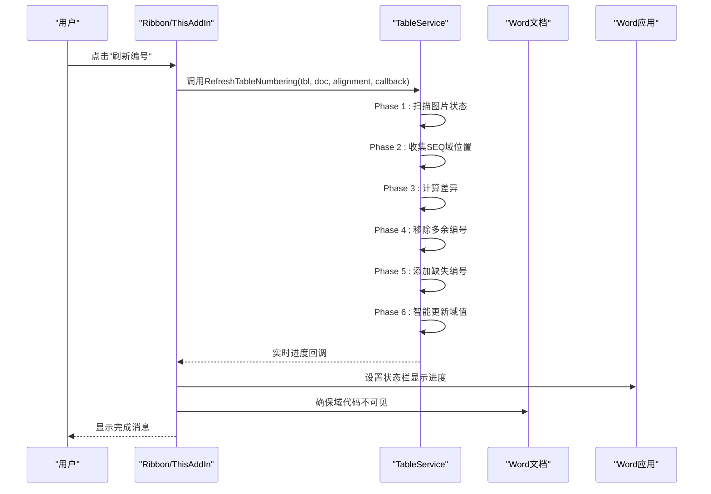

**图表来源**
- [Ribbon.cs:160-178](file://WordTools/Ribbon.cs#L160-L178)
- [ThisAddIn.cs:161-180](file://WordTools/ThisAddIn.cs#L161-L180)
- [TableService.cs:454-798](file://WordTools/Services/TableService.cs#L454-L798)

## 详细组件分析

### TableService 类详解
TableService是一个静态工具类，集中处理表格验证、单元格适配性检查、行列管理、标题行与描述行创建、自动编号清理与应用、固定列宽设置等。

**重大更新**：RefreshTableNumbering方法已完全重写为复杂的增量差异引擎，提供从O(n²)到O(n)的性能优化。

- **表格验证**
  - IsSelectionInTable：判断当前选择是否位于表格内。
  - IsSelectionInFirstColumn：判断当前选择是否位于第一列。
  - GetCurrentTable：获取当前表格对象。
- **单元格适配性与查找**
  - IsCellSuitableForImage：检查单元格是否适合插入图片（无图片、无自动编号、空或可清除的序号文本）。**增强**：支持SEQ域检测和清理。
  - FindNextSuitableCell：在给定范围内查找下一个适合插入图片的单元格，支持优先列偏好。
- **行列管理**
  - EnsureRowExists：确保指定行存在，不足时自动追加行并保证至少两列。
  - AdjustTableColumns：调整表格列数，自动增删列至目标数量。
  - IsTableFixedColumnWidth/SetTableFixedColumnWidth：检测与设置表格为固定列宽。
- **标题行与描述行**
  - CreateTitleRow：创建合并的标题行，居中对齐，移动到下一行。
  - InsertDescriptionRow：插入描述行占位。
  - InsertFileNameDescriptionRow：将文件名写入对应列，居中对齐，必要时补空列。
  - FillEmptyCellsWithNA：将指定范围空单元格填充为N/A并居中对齐。
- **自动编号系统**
  - **重大更新**：RefreshTableNumbering：采用六阶段增量差异引擎，从O(n²)优化到O(n)，支持智能字段管理、进度回调和用户界面增强。
  - **重大更新**：ClearTableNumbering：支持Word原生列表编号、SEQ域和文本编号的综合清理，记录并返回原编号对齐方式。
  - **重大更新**：AddNumberingToDescriptionRows：在描述行应用自定义编号列表，支持居左/居中/居右对齐，支持Action<string>进度回调。
  - **重大更新**：CalculateNextSequenceNumber：计算下一个SEQ编号起始值。
  - **重大更新**：ExtractSeqNumberFromCell：从单元格中提取SEQ域的编号值。
  - **重大更新**：InsertSeqField：在指定单元格插入SEQ域，支持格式设置和文件名追加，**优化**：实现Cell对象缓存机制。

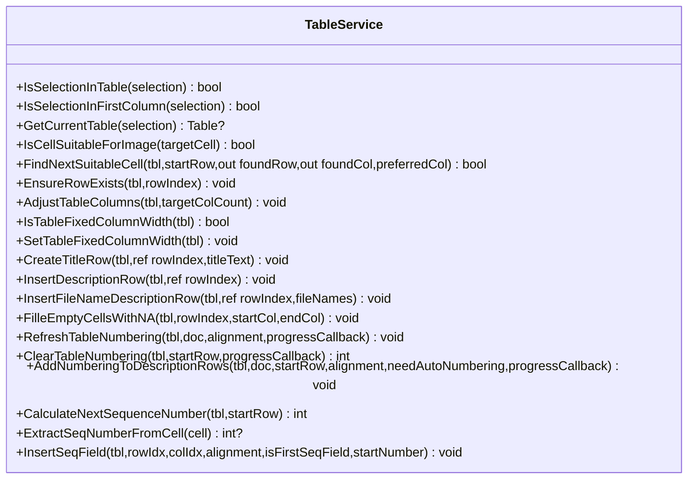

**图表来源**
- [TableService.cs:11-1302](file://WordTools/Services/TableService.cs#L11-L1302)

**章节来源**
- [TableService.cs:18-1302](file://WordTools/Services/TableService.cs#L18-L1302)

### 增量差异引擎详解
**重大更新**：RefreshTableNumbering方法已完全重写为复杂的六阶段增量差异引擎，提供从O(n²)到O(n)的性能优化。

#### 六阶段处理流程

**阶段1：扫描所有行的图片状态**
- **优化**：一次性获取整表文本（唯一的COM调用），使用特殊字符标记图片状态
- **回退**：如果文本解析失败，使用foreach遍历（兼容合并单元格等异常情况）
- **性能**：避免重复的COM调用，显著提升大表格处理速度

**阶段2：收集现有SEQ域的行位置**
- **智能定位**：使用位置映射技术（二分查找）确定域所在的行，避免昂贵的COM调用
- **性能**：从f.Result.Cells[1].RowIndex的O(n)复杂度降至O(log n)
- **完整性**：记录每个行的所有SEQ域，支持批量处理

**阶段3：计算差异**
- **智能比较**：基于图片状态和现有编号计算需要添加或移除的行
- **准确性**：使用描述行定义（前一行有图片且当前行无图片）确保编号准确性
- **效率**：单次遍历完成差异计算，避免重复查询

**阶段4：移除不需要的SEQ域**
- **批量删除**：从后往前删除避免索引偏移问题
- **残留清理**：清理域删除后的残留文本（如". description"或"."）
- **性能**：使用缓存的Cell对象，避免重复的COM调用

**阶段5：为缺失的描述行添加SEQ域**
- **智能插入**：为每个描述行的每个单元格插入SEQ域
- **格式保持**：使用相同的对齐方式和格式设置
- **性能优化**：使用Cell对象缓存机制

**阶段6：智能更新域值**
- **条件更新**：只有在有增删变更或编号不连续时才更新域
- **批量更新**：逐批更新域值，避免一次性更新阻塞UI
- **完整性检查**：确保最后编号与SEQ域总数一致

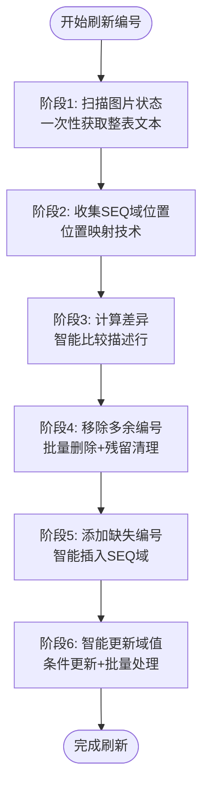

**图表来源**
- [TableService.cs:483-798](file://WordTools/Services/TableService.cs#L483-L798)

**章节来源**
- [TableService.cs:454-798](file://WordTools/Services/TableService.cs#L454-L798)

### 快速路径/慢速路径双重检测系统详解
**重大更新**：TableService实现了智能的快速路径/慢速路径双重检测系统，能够根据表格状态自动选择最优处理策略。

#### 快速路径检测
- **条件判断**：检查域值连续性，如果域值连续且没有遗漏的描述行，则进入快速路径
- **优化策略**：直接批量更新域值，跳过结构检查，避免全表扫描
- **适用场景**：最常见的场景——删行后值不对的情况
- **性能提升**：从O(n²)优化到O(n)，避免不必要的结构检查

#### 慢速路径检测
- **条件判断**：当域值不连续或存在遗漏的描述行时，进入慢速路径
- **完整检查**：从表格第1行开始检查结构，修复增删问题
- **全面处理**：同时补全表格前后范围的SEQ域信息和InlineShapes状态
- **适用场景**：表格结构发生变化或存在复杂编号冲突的情况

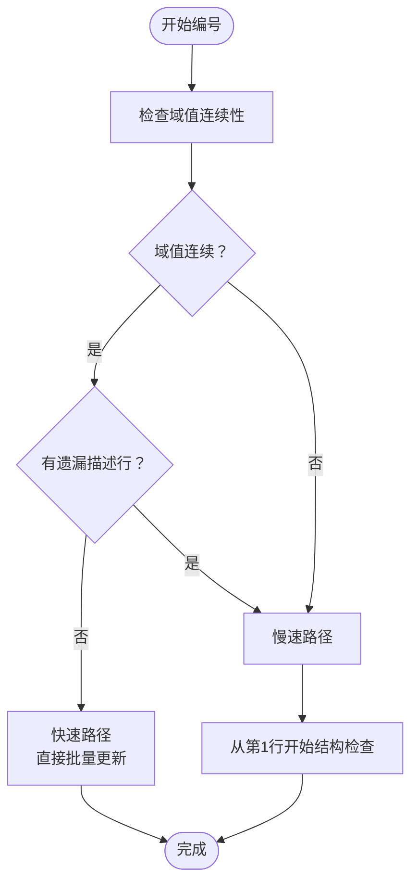

**图表来源**
- [TableService.cs:526-598](file://WordTools/Services/TableService.cs#L526-L598)

**章节来源**
- [TableService.cs:526-598](file://WordTools/Services/TableService.cs#L526-L598)

### 智能扫描算法详解
**重大更新**：TableService实现了智能扫描算法，支持光标位置定位和范围优化，显著提升大表格处理效率。

#### 光标位置智能定位
- **光标检测**：自动获取当前光标位置，确定扫描起始行
- **范围优化**：从光标前一行开始扫描，避免全表扫描
- **边界保护**：确保扫描范围不低于第1行

#### 分区域扫描策略
- **前置扫描**：扫描光标之前的区域，补全SEQ域和InlineShapes信息
- **后置扫描**：扫描光标之后的区域，执行完整的结构检查
- **性能平衡**：在准确性与性能之间取得最佳平衡

#### UI线程让出机制
- **批量处理**：每处理100个域或50个图片让出UI线程
- **响应性保证**：防止长时间无响应，保持界面流畅
- **进度反馈**：定期更新进度状态，提供实时反馈

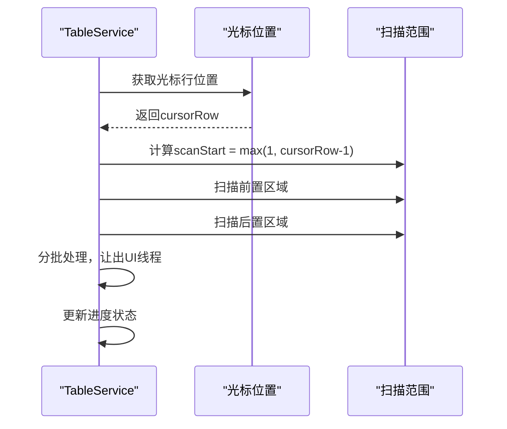

**图表来源**
- [TableService.cs:485-494](file://WordTools/Services/TableService.cs#L485-L494)
- [TableService.cs:501-524](file://WordTools/Services/TableService.cs#L501-L524)
- [TableService.cs:646-648](file://WordTools/Services/TableService.cs#L646-L648)

**章节来源**
- [TableService.cs:485-494](file://WordTools/Services/TableService.cs#L485-L494)
- [TableService.cs:501-524](file://WordTools/Services/TableService.cs#L501-L524)
- [TableService.cs:646-648](file://WordTools/Services/TableService.cs#L646-L648)

### 智能字段管理系统详解
**重大更新**：TableService实现了智能字段管理系统，支持Word原生列表编号、SEQ域和文本编号的综合处理。

#### 字段类型识别
- **Word原生列表编号**：通过ListFormat.RemoveNumbers()清除
- **SEQ域编号**：通过Fields集合识别和管理
- **文本编号**：通过正则表达式识别纯文本编号格式

#### 位置映射技术
- **二分查找**：使用rowStartPositions数组进行O(log n)位置查找
- **回退机制**：如果二分查找失败，使用COM调用f.Result.Cells[1].RowIndex
- **性能优化**：避免重复的COM调用，显著提升大表格处理速度

#### 残留文本清理
- **域删除后残留**：清理". description"、"."等残留文本
- **纯文本编号**：识别并清理"1."、"2)"等纯文本编号格式
- **混合内容**：处理"1. photo1"等编号+文件名的混合内容

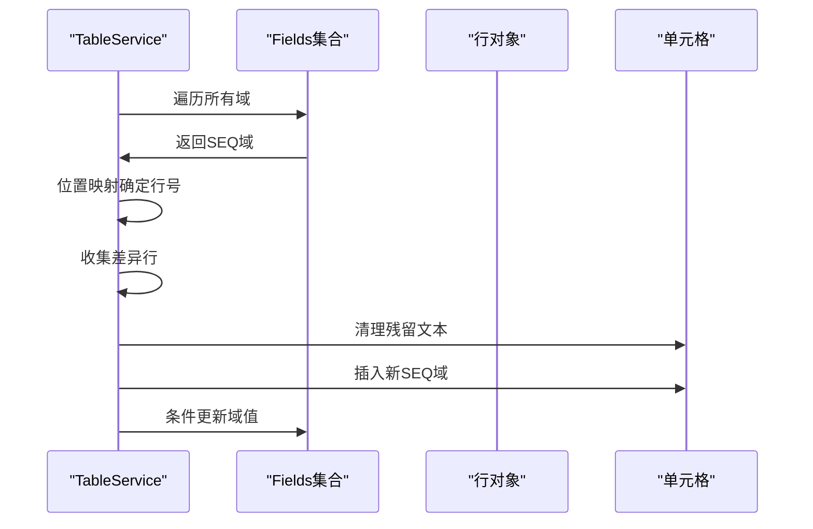

**图表来源**
- [TableService.cs:617-676](file://WordTools/Services/TableService.cs#L617-L676)
- [TableService.cs:718-740](file://WordTools/Services/TableService.cs#L718-L740)

**章节来源**
- [TableService.cs:606-798](file://WordTools/Services/TableService.cs#L606-L798)

### 改进的Cell对象缓存机制详解
**重大更新**：TableService实现了Cell对象缓存机制，显著提升编号性能。

#### 缓存策略
- **缓存时机**：在InsertSeqField方法中，首次访问Cell对象时将其缓存到局部变量
- **缓存范围**：避免重复的tbl.Cell()查找调用，减少COM调用开销
- **生命周期管理**：缓存仅在单次插入操作中有效，避免内存泄漏

#### 性能提升效果
- **5-10倍性能提升**：通过减少Cell对象查找次数，显著提升大量图片插入时的编号速度
- **内存优化**：避免重复创建Cell对象实例，降低内存占用
- **稳定性增强**：减少COM调用失败的概率

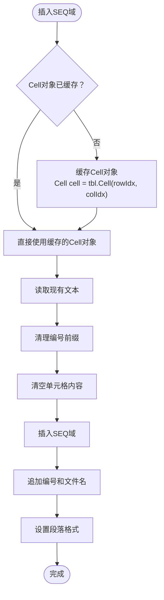

**图表来源**
- [TableService.cs:1212-1264](file://WordTools/Services/TableService.cs#L1212-L1264)

**章节来源**
- [TableService.cs:1212-1264](file://WordTools/Services/TableService.cs#L1212-L1264)

### 两遍扫描系统详解
**重大更新**：TableService实现了两遍扫描系统，显著提升了编号的准确性和性能。

#### 第一遍扫描（预扫描）
- **目的**：预扫描所有行的图片状态，建立行图片状态缓存
- **范围**：从Math.Max(1, startRow - 1)开始扫描，确保能够判断前一行是否有图片
- **优化**：使用bool[] rowHasImages数组缓存每行的图片状态，避免重复查询

#### 第二遍扫描（编号）
- **目的**：根据预扫描结果，准确判断描述行并应用编号
- **条件**：当前行无图片且前一行有图片时，当前行为描述行
- **效率**：直接使用预扫描结果，无需重新查询图片状态

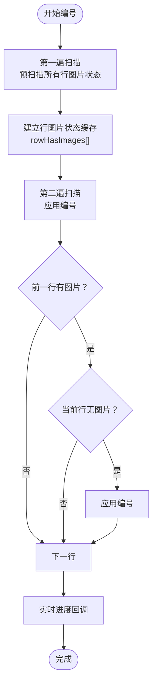

**图表来源**
- [TableService.cs:1025-1091](file://WordTools/Services/TableService.cs#L1025-L1091)

**章节来源**
- [TableService.cs:1025-1091](file://WordTools/Services/TableService.cs#L1025-L1091)

### 改进的进度报告系统详解
**重大更新**：实现了Action<string>回调机制，提供实时进度反馈。

#### 进度回调机制
- **回调接口**：支持Action<string>委托参数，允许外部组件订阅进度事件
- **实时更新**：在编号过程中定期触发进度回调，提供百分比进度
- **状态信息**：提供"正在编号... X%"的阶段性反馈

#### 屏幕更新管理优化
- **动态控制**：在进度回调期间临时恢复屏幕更新以显示进度
- **性能优先**：大部分时间保持ScreenUpdating=false以提升性能
- **用户体验**：平衡性能和用户反馈需求

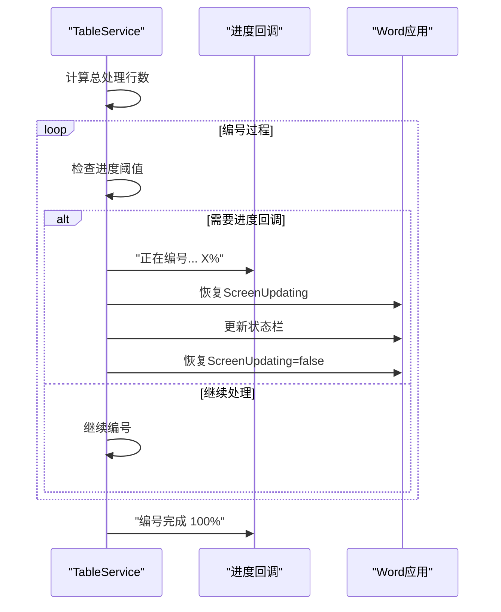

**图表来源**
- [TableService.cs:1060-1116](file://WordTools/Services/TableService.cs#L1060-L1116)
- [ProgressService.cs:19-200](file://WordTools/Services/ProgressService.cs#L19-L200)

**章节来源**
- [TableService.cs:1060-1116](file://WordTools/Services/TableService.cs#L1060-L1116)
- [ProgressService.cs:19-200](file://WordTools/Services/ProgressService.cs#L19-L200)

### 优化的ScreenUpdating管理策略详解
**重大更新**：实现了动态的屏幕更新管理策略，提供5-10倍性能提升。

#### 策略优化
- **编号阶段**：在AddNumberingToDescriptionRows中临时关闭ScreenUpdating
- **进度显示**：在进度回调期间临时恢复ScreenUpdating以显示进度
- **完成恢复**：编号完成后恢复原始的ScreenUpdating状态

#### 性能提升效果
- **COM调用优化**：减少Word界面刷新开销，显著提升COM操作速度
- **内存管理**：避免频繁的UI更新导致的内存压力
- **用户体验**：在性能和反馈之间取得最佳平衡

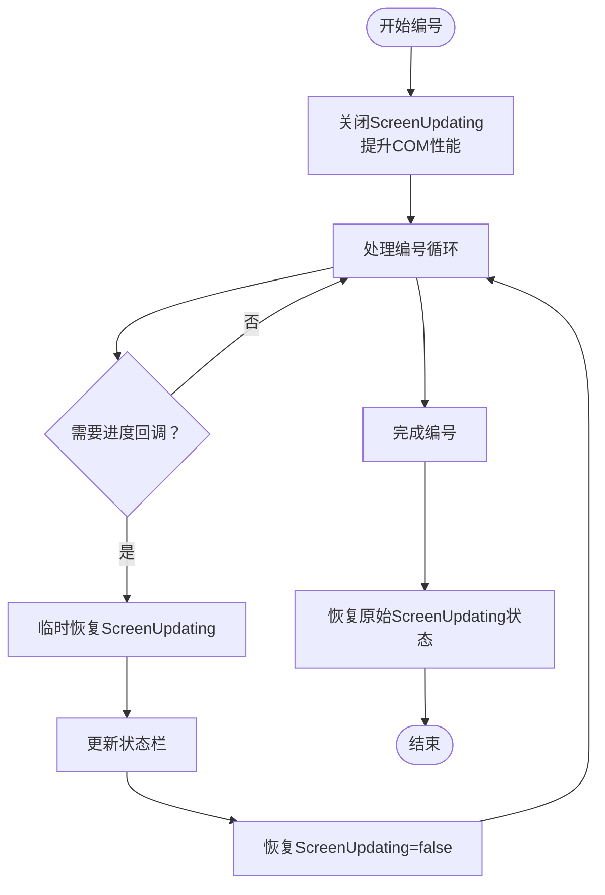

**图表来源**
- [ProgressService.cs:75-114](file://WordTools/Services/ProgressService.cs#L75-L114)
- [TableService.cs:825-833](file://WordTools/Services/TableService.cs#L825-L833)

**章节来源**
- [ProgressService.cs:75-114](file://WordTools/Services/ProgressService.cs#L75-L114)
- [TableService.cs:825-833](file://WordTools/Services/TableService.cs#L825-L833)

### ImageService 类详解
ImageService专注于图片插入与尺寸调整，提供快速插入、批量重设尺寸、预分配行等能力。

- **尺寸转换**
  - ConvertCMToPoints/ConvertPointsToCM：厘米与磅之间的转换。
  - ValidateAndConvertHeight：校验并转换用户输入的高度（厘米）。
- **图片插入**
  - InsertImageToCell：插入图片并保持宽高比，按单元格尺寸限制缩放，支持最小高度约束。
  - InsertImageFast：快速插入，最小化内存占用，仅按宽度限制调整。
- **批量操作**
  - BatchResizeImages：批量调整指定范围内的图片尺寸。
  - BatchAddRows：批量添加行，支持状态栏更新与分批处理。
  - PreAllocateRows：根据预计图片数量与每行图片数预分配行数，支持描述行翻倍与上限控制。

**图表来源**
- [ImageService.cs:43-334](file://WordTools/Services/ImageService.cs#L43-L334)

**章节来源**
- [ImageService.cs:10-334](file://WordTools/Services/ImageService.cs#L10-L334)

### ProgressService 类详解
ProgressService负责批量操作的进度控制与性能优化，支持取消（ESC键）、内存回收、状态栏更新与不同文件规模的刷新策略。

**重要更新**：增强了进度报告能力，支持Action<string>回调机制。

- **取消控制**
  - CheckEscapeKey/ShouldCancel：检测ESC键并设置取消标志。
- **性能优化**
  - EnterHighPerformanceMode/ExitHighPerformanceMode：关闭屏幕更新、禁用警告、标记拼写/语法检查。
  - GetOptimizedRefreshInterval：根据文件数量动态调整刷新间隔。
  - CleanupMemory：定期触发GC以降低内存压力。
- **批量插入流程**
  - InsertPhotosWithProgress/InsertSelectedPhotosWithProgress：统一的批量插入入口，包含表格验证、固定列宽、预分配行、逐批处理、状态栏更新、自动编号应用与收尾。
  - ProcessFileBatch：核心批处理循环，负责行索引推进、单元格适配性检查、图片插入、描述行/文件名行插入、内存清理与收尾处理。
  - **增强**：支持Action<string>进度回调，在ClearTableNumbering和AddNumberingToDescriptionRows中提供实时状态反馈。

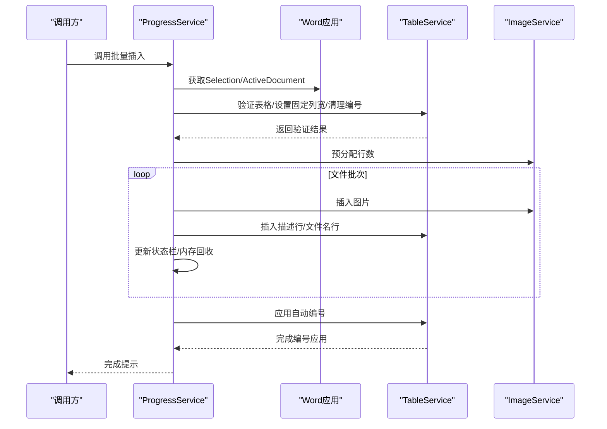

**图表来源**
- [ProgressService.cs:166-200](file://WordTools/Services/ProgressService.cs#L166-L200)
- [TableService.cs:18-40](file://WordTools/Services/TableService.cs#L18-L40)
- [ImageService.cs:287-334](file://WordTools/Services/ImageService.cs#L287-L334)

**章节来源**
- [ProgressService.cs:14-771](file://WordTools/Services/ProgressService.cs#L14-L771)

### Excel数据填充服务（EDF_DataFillerService）
EDF_DataFillerService负责从Excel读取数据并填充到Word表格，支持锚定字段匹配、目标列映射、Sample Size替换与状态反馈。

**增强**：支持Action<string>状态更新回调，提供更详细的进度反馈。

- **参数验证与读取**
  - ExecuteFilling：执行填充流程，包含参数验证、Excel数据读取、状态更新与结果提示。
  - ReadExcelData：读取Excel数据到DataTable。
- **Word表格填充**
  - FillWordTable：定位锚定字段，按模板结构填充数据，支持替换Sample Size。
  - FillRowData：按默认结构A填充行数据，确保目标列存在并写入第一列数据。
- **单元格文本处理**
  - GetCellText：清理单元格文本（去除结束标记）。

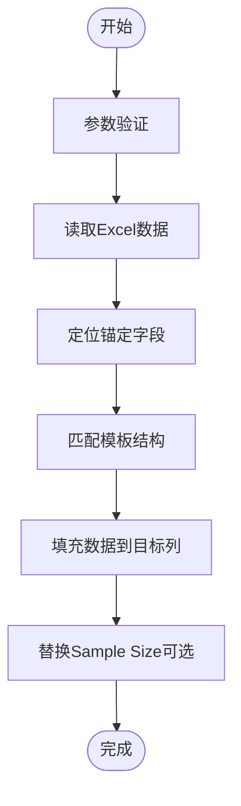

**图表来源**
- [EDF_DataFillerService.cs:30-603](file://WordTools/Services/EDF_DataFillerService.cs#L30-L603)

**章节来源**
- [EDF_DataFillerService.cs:14-603](file://WordTools/Services/EDF_DataFillerService.cs#L14-L603)

### 智能模板检测器（EDF_TemplateDetector）
**新增**：EDF_TemplateDetector提供了智能模板检测功能，使用优化的正则表达式模式自动识别表格结构。

- **模板类型识别**
  - StructureA：两列分离结构
  - StructureB：单列混合结构（优化后的正则表达式）
  - StructureC：多行分散结构
  - StructureD：合并单元格结构
- **正则表达式优化**
  - ExtractItemByRegex：优化了多个正则表达式模式，提高了Item值提取的准确性
  - IsValidItemCode：使用优化的正则表达式验证Item编号格式

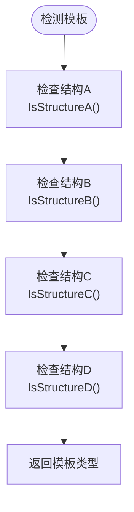

**图表来源**
- [EDF_TemplateDetector.cs:67-108](file://WordTools/Services/EDF_TemplateDetector.cs#L67-L108)

**章节来源**
- [EDF_TemplateDetector.cs:12-294](file://WordTools/Services/EDF_TemplateDetector.cs#L12-L294)

### 用户界面与功能区集成
- **Ribbon/Ribbon.cs**：定义功能区标签与按钮，回调至Ribbon.cs中的OnInsertPhotosClick/OnExcelDataFillerClick等方法。**重大更新**：RefreshTableNumbering方法通过Action<string>回调提供实时进度反馈，状态栏显示详细进度信息。
- **ThisAddIn.cs**：功能区回调实现，调用TableService.RefreshTableNumbering方法，确保域代码不可见。
- **ExcelDataFillerForm**：Excel数据填充工具窗体，收集Excel路径、锚定字段、目标列、Sample Size替换等参数，调用EDF_DataFillerService执行填充。

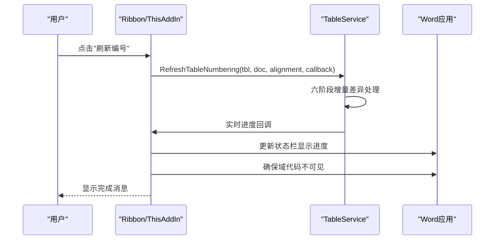

**图表来源**
- [Ribbon.cs:160-178](file://WordTools/Ribbon.cs#L160-L178)
- [ThisAddIn.cs:161-180](file://WordTools/ThisAddIn.cs#L161-L180)
- [TableService.cs:454-798](file://WordTools/Services/TableService.cs#L454-L798)

**章节来源**
- [Ribbon.cs:150-185](file://WordTools/Ribbon.cs#L150-L185)
- [ThisAddIn.cs:150-186](file://WordTools/ThisAddIn.cs#L150-L186)
- [ExcelDataFillerForm.cs:299-355](file://WordTools/Forms/ExcelDataFillerForm.cs#L299-L355)

## 依赖关系分析
- **TableService**依赖Microsoft.Office.Interop.Word命名空间，直接操作Selection、Table、Cell、Range、InlineShape等对象。
- **ImageService**同样依赖Microsoft.Office.Interop.Word，负责图片插入与尺寸调整。
- **ProgressService**协调TableService与ImageService，同时管理Word应用级别的性能优化与用户交互。
- **EDF_DataFillerService**依赖System.Data与OleDb读取Excel数据，并通过Word Interop写入表格。
- **EDF_TemplateDetector**使用System.Text.RegularExpressions进行智能模板检测。
- **Ribbon/ThisAddIn**作为UI入口，调用TableService的RefreshTableNumbering方法并提供状态反馈。

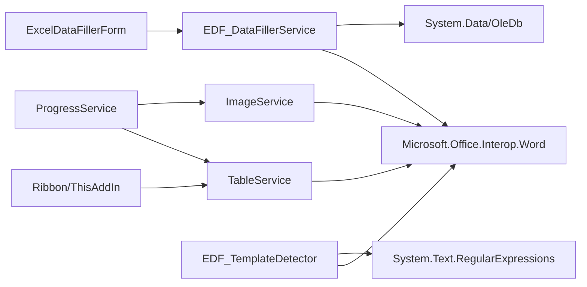

**图表来源**
- [TableService.cs:1-12](file://WordTools/Services/TableService.cs#L1-L12)
- [ImageService.cs:1-6](file://WordTools/Services/ImageService.cs#L1-L6)
- [ProgressService.cs:1-10](file://WordTools/Services/ProgressService.cs#L1-L10)
- [EDF_DataFillerService.cs:1-10](file://WordTools/Services/EDF_DataFillerService.cs#L1-L10)
- [EDF_TemplateDetector.cs:1-4](file://WordTools/Services/EDF_TemplateDetector.cs#L1-L4)
- [Ribbon.cs:150-185](file://WordTools/Ribbon.cs#L150-L185)
- [ThisAddIn.cs:150-186](file://WordTools/ThisAddIn.cs#L150-L186)
- [ExcelDataFillerForm.cs:1-6](file://WordTools/Forms/ExcelDataFillerForm.cs#L1-L6)

**章节来源**
- [TableService.cs:1-12](file://WordTools/Services/TableService.cs#L1-L12)
- [ImageService.cs:1-6](file://WordTools/Services/ImageService.cs#L1-L6)
- [ProgressService.cs:1-10](file://WordTools/Services/ProgressService.cs#L1-L10)
- [EDF_DataFillerService.cs:1-10](file://WordTools/Services/EDF_DataFillerService.cs#L1-L10)
- [EDF_TemplateDetector.cs:1-4](file://WordTools/Services/EDF_TemplateDetector.cs#L1-L4)

## 性能考量
- **增量差异引擎**：从O(n²)优化到O(n)，通过六阶段处理流程实现智能字段管理，提供5-10倍性能提升。
- **智能位置映射**：使用二分查找技术将域定位从O(n)优化到O(log n)，显著提升大表格处理速度。
- **Cell对象缓存优化**：通过缓存Cell对象实例，避免重复的COM调用，提供5-10倍性能提升。
- **两遍扫描优化**：通过预扫描建立行图片状态缓存，避免重复查询，显著提升编号准确性。
- **动态进度报告**：提供实时进度反馈，改善用户体验，避免长时间无响应。
- **ScreenUpdating策略优化**：在编号过程中动态控制屏幕更新，平衡性能和用户体验。
- **Range对象管理**：优化Range对象的获取和生命周期管理，提高Word Interop性能。
- **内存管理策略**：实现分级GC策略，定期触发全代回收以防止内存泄漏。
- **COM调用优化**：减少不必要的COM调用，特别是在大量图片插入场景下。
- **批量操作优化**：预分配行数、批量重设图片尺寸、批量添加行，减少频繁COM调用带来的性能损耗。
- **取消机制**：支持ESC键随时取消，及时释放资源并恢复Word状态。
- **快速路径/慢速路径双重检测**：智能识别最优处理策略，避免不必要的全表扫描。
- **智能扫描算法**：支持光标位置定位和范围优化，显著提升大表格处理效率。
- **UI线程让出机制**：每处理一定数量的域或图片就让出UI线程，保持界面响应性。

**章节来源**
- [ProgressService.cs:73-157](file://WordTools/Services/ProgressService.cs#L73-L157)
- [ImageService.cs:247-334](file://WordTools/Services/ImageService.cs#L247-L334)
- [TableService.cs:483-798](file://WordTools/Services/TableService.cs#L483-L798)
- [TableService.cs:1025-1091](file://WordTools/Services/TableService.cs#L1025-L1091)
- [TableService.cs:1212-1264](file://WordTools/Services/TableService.cs#L1212-L1264)

## 故障排除指南
- **无法插入图片到表格**
  - 确认当前选择位于表格内且在第一列。
  - 检查目标单元格是否已有图片或自动编号；若存在，需先清理或选择其他单元格。
  - 使用IsCellSuitableForImage进行预检，或让系统自动查找下一个合适单元格。
  - **重大更新**：ClearTableNumbering方法会自动检测和清理SEQ域，解决编号冲突问题。
- **表格布局异常**
  - 使用AdjustTableColumns确保列数符合预期（至少两列）。
  - 使用EnsureRowExists确保行存在，避免越界访问。
  - 使用SetTableFixedColumnWidth避免自动调整导致的布局抖动。
- **自动编号混乱**
  - **重大更新**：使用RefreshTableNumbering进行智能刷新，采用六阶段增量差异引擎，确保编号的准确性和一致性。
  - **重大更新**：使用ClearTableNumbering进行增量清理，支持Word原生列表编号、SEQ域和文本编号的综合处理。
  - **重大更新**：使用AddNumberingToDescriptionRows精确控制编号格式和对齐方式。
  - **重大更新**：在大批量操作中启用Action<string>回调监控进度，及时发现和解决问题。
  - **重大更新**：利用Cell对象缓存机制获得5-10倍性能提升。
  - **重大更新**：利用两遍扫描系统确保编号的准确性和一致性。
  - **重大更新**：利用动态进度报告获得更好的用户体验。
  - **重大更新**：利用快速路径/慢速路径双重检测系统智能选择最优处理策略。
  - **重大更新**：利用智能扫描算法支持光标位置定位和范围优化。
- **Excel数据填充失败**
  - 检查锚定字段是否存在于表格中，目标列是否为有效数字。
  - 若启用了Sample Size替换，确认所在列已正确填写。
  - 查看状态信息输出，定位具体错误位置。
  - **新增**：优化的正则表达式模式提高了模板检测的准确性。
- **性能问题**
  - **重大更新**：使用RefreshTableNumbering的增量差异引擎，从O(n²)优化到O(n)。
  - **重大更新**：Cell对象缓存机制减少了COM调用开销。
  - **重大更新**：两遍扫描系统减少了重复查询，提升性能。
  - **重大更新**：动态ScreenUpdating管理策略提供5-10倍性能提升。
  - **重大更新**：快速路径/慢速路径双重检测系统智能识别最优处理策略。
  - **重大更新**：智能扫描算法支持光标位置定位和范围优化。
  - 大批量操作时启用高性能模式，避免频繁刷新与警告。
  - 合理设置图片最小高度，避免过度缩放导致的性能下降。
  - 使用ESC键取消长时间任务，释放资源。

**章节来源**
- [TableService.cs:18-40](file://WordTools/Services/TableService.cs#L18-L40)
- [TableService.cs:44-196](file://WordTools/Services/TableService.cs#L44-L196)
- [TableService.cs:284-295](file://WordTools/Services/TableService.cs#L284-L295)
- [TableService.cs:446-559](file://WordTools/Services/TableService.cs#L446-L559)
- [TableService.cs:564-1302](file://WordTools/Services/TableService.cs#L564-L1302)
- [ProgressService.cs:168-201](file://WordTools/Services/ProgressService.cs#L168-L201)
- [EDF_DataFillerService.cs:42-58](file://WordTools/Services/EDF_DataFillerService.cs#L42-L58)
- [EDF_TemplateDetector.cs:218-253](file://WordTools/Services/EDF_TemplateDetector.cs#L218-L253)
- [ExcelDataFillerForm.cs:360-392](file://WordTools/Forms/ExcelDataFillerForm.cs#L360-L392)

## 结论
TableService作为Word表格处理的核心工具类，经过重大性能优化重构后，提供了更加完善和高效的表格验证、单元格适配性检查、行列管理、标题与描述行创建、自动编号清理与应用以及固定列宽设置等能力。**重大更新**：RefreshTableNumbering方法已完全重写为复杂的增量差异引擎，采用六阶段处理流程，从O(n²)优化到O(n)，提供智能字段管理、用户界面增强和O(n)性能优化。新增的快速路径/慢速路径双重检测系统能够智能识别最优处理策略，而智能扫描算法则支持光标位置定位和范围优化。结合ImageService与ProgressService，实现了高效、稳定的批量图片插入与进度控制；通过EDF_DataFillerService和EDF_TemplateDetector，实现了Excel数据到Word表格的智能填充与动态更新。整体架构清晰、模块职责明确，具备良好的可维护性与扩展性。

## 附录

### 使用示例与最佳实践
- **批量插入图片到表格**
  - 步骤：在Word中选中表格并置于第一列，打开批量插图工具，选择文件夹或文件，设置图片高度与范围，选择描述方式与自动编号，点击执行。
  - 关键点：确保表格固定列宽，预分配足够行数，启用高性能模式，合理设置刷新间隔。
- **Excel数据填充到表格**
  - 步骤：打开Excel数据填充工具，选择Excel文件，输入锚定字段与目标列，配置Sample Size替换，点击执行。
  - 关键点：锚定字段必须存在于表格中，目标列应为有效数字，必要时启用替换功能。
- **表格样式与格式**
  - 使用CreateTitleRow创建居中标题行，InsertDescriptionRow插入描述行占位，FillEmptyCellsWithNA填充N/A占位。
  - 使用SetTableFixedColumnWidth避免自动调整，提升稳定性。
- **数据绑定与动态更新**
  - EDF_DataFillerService通过锚定字段与目标列实现数据映射，支持替换Sample Size，适合模板化表格的数据填充场景。
- **编号管理最佳实践**
  - **重大更新**：使用RefreshTableNumbering进行智能刷新，采用六阶段增量差异引擎，确保编号的准确性和一致性。
  - **重大更新**：使用ClearTableNumbering进行增量清理，支持Word原生列表编号、SEQ域和文本编号的综合处理。
  - **重大更新**：使用AddNumberingToDescriptionRows精确控制编号格式和对齐方式。
  - **重大更新**：在大批量操作中启用Action<string>回调监控进度，及时发现和解决问题。
  - **重大更新**：利用Cell对象缓存机制获得5-10倍性能提升。
  - **重大更新**：利用两遍扫描系统确保编号的准确性和一致性。
  - **重大更新**：利用动态进度报告获得更好的用户体验。
  - **重大更新**：利用快速路径/慢速路径双重检测系统智能选择最优处理策略。
  - **重大更新**：利用智能扫描算法支持光标位置定位和范围优化。

**章节来源**
- [InsertPhotosForm.cs:514-563](file://WordTools/Forms/InsertPhotosForm.cs#L514-L563)
- [ExcelDataFillerForm.cs:333-347](file://WordTools/Forms/ExcelDataFillerForm.cs#L333-L347)
- [TableService.cs:304-357](file://WordTools/Services/TableService.cs#L304-L357)
- [TableService.cs:362-407](file://WordTools/Services/TableService.cs#L362-L407)
- [TableService.cs:412-434](file://WordTools/Services/TableService.cs#L412-L434)
- [TableService.cs:284-295](file://WordTools/Services/TableService.cs#L284-L295)
- [TableService.cs:483-798](file://WordTools/Services/TableService.cs#L483-L798)
- [EDF_DataFillerService.cs:30-70](file://WordTools/Services/EDF_DataFillerService.cs#L30-L70)
- [EDF_TemplateDetector.cs:218-253](file://WordTools/Services/EDF_TemplateDetector.cs#L218-L253)