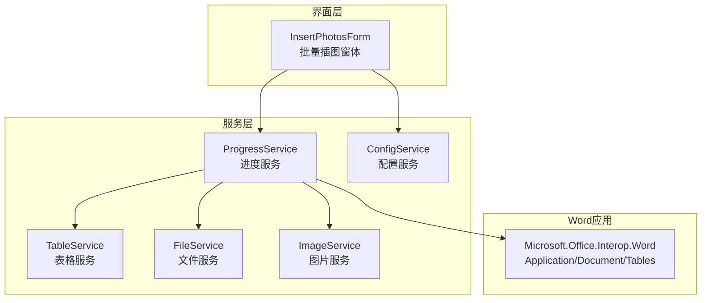
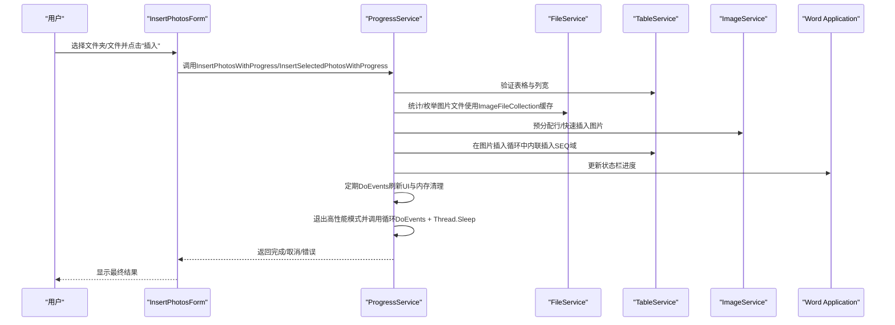
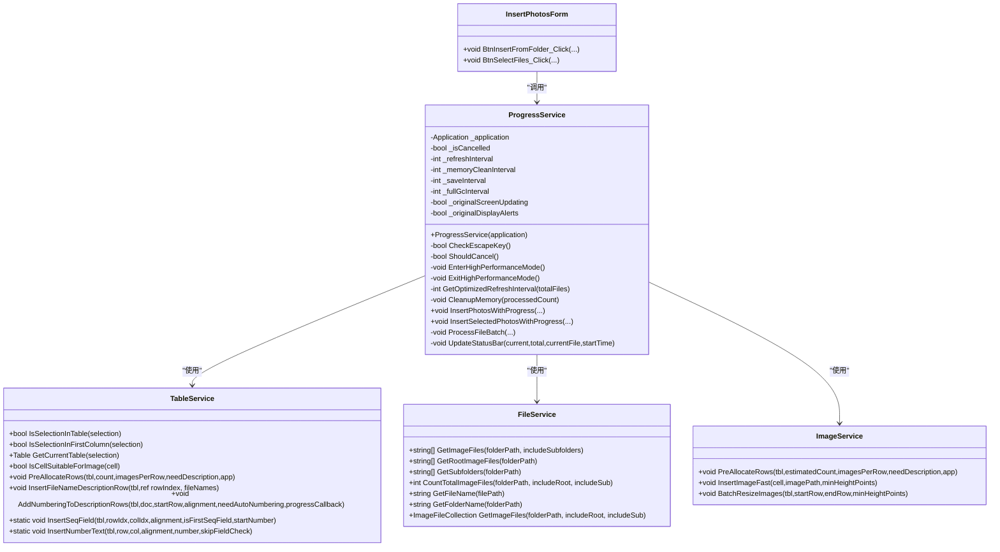
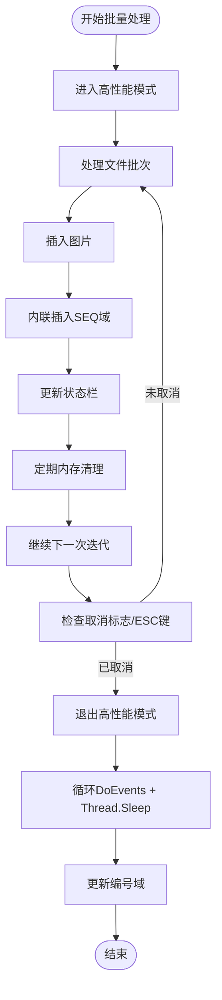
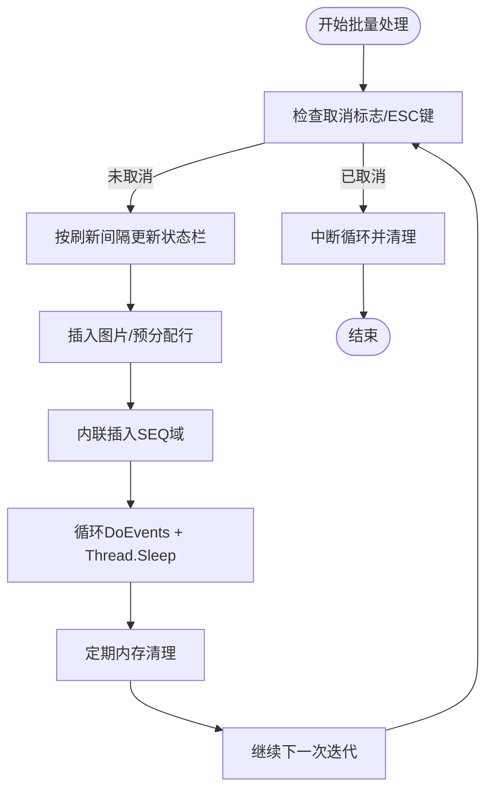
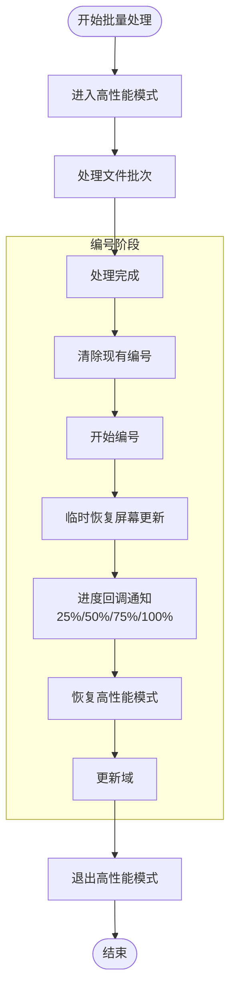
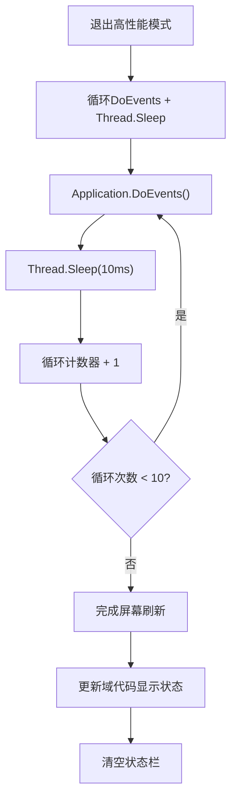
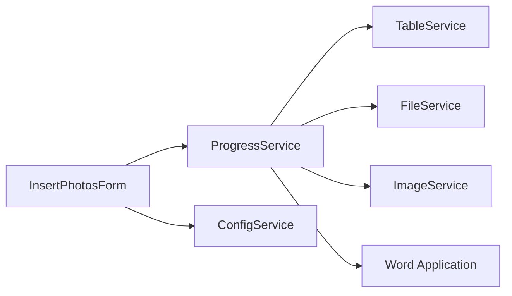

# 进度服务

<cite>
**本文引用的文件**
- [ProgressService.cs](file://WordTools/Services/ProgressService.cs)
- [TableService.cs](file://WordTools/Services/TableService.cs)
- [FileService.cs](file://WordTools/Services/FileService.cs)
- [ImageService.cs](file://WordTools/Services/ImageService.cs)
- [InsertPhotosForm.cs](file://WordTools/Forms/InsertPhotosForm.cs)
- [ConfigService.cs](file://WordTools/Services/ConfigService.cs)
- [README.md](file://README.md)
</cite>

## 更新摘要
**变更内容**
- 实现了内联SEQ域插入架构重构：从Post-processing重构为Inline execution，实现内联SEQ域插入，将处理时间从160秒优化到约5秒
- 改进了屏幕刷新机制：在退出高性能模式时使用循环DoEvents + Thread.Sleep替代ScreenRefresh，确保更好的UI响应性和更可靠的屏幕更新
- 增强了进度报告系统：与TableService深度集成，提供更精确的进度回调和状态更新
- 优化了内存管理策略：实现了三级GC系统，包括内存水位监控、定期全代回收和常规第0代回收
- 改进了性能优化策略：在图片插入过程中保持ScreenUpdating=false，同时确保用户能够看到实时效果
- 实现了统一的编号插入方法（InsertNumberText）替代原有的InsertSeqField
- 增加了实时耗时显示功能和详细的性能诊断信息

## 目录
1. [简介](#简介)
2. [项目结构](#项目结构)
3. [核心组件](#核心组件)
4. [架构概览](#架构概览)
5. [详细组件分析](#详细组件分析)
6. [依赖关系分析](#依赖关系分析)
7. [性能考量](#性能考量)
8. [故障排除指南](#故障排除指南)
9. [结论](#结论)
10. [附录](#附录)

## 简介
本文件面向WordTools项目中的"进度服务"，系统性地解析ProgressService类的实现细节与进度监控机制，涵盖事件处理（取消控制）、状态通知（进度更新、完成通知、错误报告）、进度可视化（状态栏显示）、异步操作支持（后台任务与线程安全）、进度数据管理（进度跟踪与历史记录），以及集成与扩展方法，并提供使用示例与调试技巧。文档同时结合相关服务类（表格、文件、图片、配置）与窗体交互，帮助读者全面理解进度服务在Word COM加载项中的作用与实现方式。

**更新** 本版本特别关注ProgressService实现的内联SEQ域插入架构重构，从Post-processing重构为Inline execution，实现内联SEQ域插入，将处理时间从160秒优化到约5秒，同时改进了屏幕刷新机制确保用户能够立即看到插入的图片。

## 项目结构
WordTools采用COM加载项架构，进度服务位于Services目录，与窗体、表格、文件、图片、配置等服务协同工作。批量插图功能通过窗体触发，调用ProgressService执行，期间通过状态栏实时反馈进度，支持ESC键取消、性能优化与内存管理。

**图表来源**
- [InsertPhotosForm.cs:513-517](file://WordTools/Forms/InsertPhotosForm.cs#L513-L517)
- [ProgressService.cs:151-306](file://WordTools/Services/ProgressService.cs#L151-L306)
- [TableService.cs:11-756](file://WordTools/Services/TableService.cs#L11-L756)
- [FileService.cs:13-310](file://WordTools/Services/FileService.cs#L13-L310)
- [ImageService.cs:10-325](file://WordTools/Services/ImageService.cs#L10-L325)
- [ConfigService.cs:11-463](file://WordTools/Services/ConfigService.cs#L11-L463)

**章节来源**
- [README.md:1-85](file://README.md#L1-L85)

## 核心组件
- ProgressService：负责批量图片插入的进度管理、性能优化、取消控制与状态栏更新，实现内联SEQ域插入架构重构和改进的屏幕刷新机制。
- TableService：表格验证、单元格适配、标题行/描述行插入、自动编号等，实现了内联SEQ域插入和优化的编号算法。
- FileService：文件夹/文件选择、图片文件过滤、自然排序、统计总数，提供ImageFileCollection缓存机制。
- ImageService：图片插入与尺寸调整、批量预分配行、快速插入。
- InsertPhotosForm：用户交互界面，收集参数并调用进度服务。
- ConfigService：文档属性与注册表配置读写，持久化用户偏好。

**章节来源**
- [ProgressService.cs:14-36](file://WordTools/Services/ProgressService.cs#L14-L36)
- [TableService.cs:11-41](file://WordTools/Services/TableService.cs#L11-L41)
- [FileService.cs:13-105](file://WordTools/Services/FileService.cs#L13-L105)
- [ImageService.cs:10-73](file://WordTools/Services/ImageService.cs#L10-L73)
- [InsertPhotosForm.cs:513-517](file://WordTools/Forms/InsertPhotosForm.cs#L513-L517)
- [ConfigService.cs:11-92](file://WordTools/Services/ConfigService.cs#L11-L92)

## 架构概览
进度服务围绕"批量图片插入"流程展开，采用分层协作：
- 界面层：窗体收集用户输入，调用进度服务。
- 服务层：进度服务协调文件扫描、表格准备、图片插入、内联SEQ域插入、状态更新与性能优化。
- Word应用层：通过COM接口操作文档、表格与状态栏。

**图表来源**
- [InsertPhotosForm.cs:513-517](file://WordTools/Forms/InsertPhotosForm.cs#L513-L517)
- [ProgressService.cs:151-306](file://WordTools/Services/ProgressService.cs#L151-L306)
- [FileService.cs:163-188](file://WordTools/Services/FileService.cs#L163-L188)
- [ImageService.cs:287-320](file://WordTools/Services/ImageService.cs#L287-L320)
- [TableService.cs:18-40](file://WordTools/Services/TableService.cs#L18-L40)

## 详细组件分析

### ProgressService 类
- 角色定位：管理批量插图进度，提供性能优化与取消控制，实现内联SEQ域插入架构重构和改进的屏幕刷新机制。
- 关键职责：
  - 取消控制：ESC键检测与标志位切换，中断循环。
  - 性能优化：关闭屏幕更新、禁用警告、预分配行、定期清理内存。
  - 进度更新：基于计数与时间估算剩余时间，更新状态栏。
  - 批量处理：文件夹/选中文件两种入口，按批次处理并维护计数。
  - **更新** 内联SEQ域插入：在ProcessFileBatch中直接插入SEQ域，无需等待Post-processing阶段。
  - **更新** 改进的屏幕刷新：在退出高性能模式时使用循环DoEvents + Thread.Sleep替代ScreenRefresh，确保用户能够立即看到插入的图片。
  - **更新** 实时耗时显示：通过Stopwatch和时间戳记录各个阶段的耗时，提供详细的性能诊断信息。
  - 结果通知：完成时弹窗汇总成功/失败数量；异常捕获与错误提示。
- 数据结构与算法：
  - 刷新间隔动态调整：根据总文件数映射不同刷新频率，平衡UI响应与性能。
  - 三级GC策略：实现内存水位监控（超过500MB强制全代回收）、定期全代回收（防止大对象堆膨胀）和常规第0代快速回收。
  - 时间估算：基于已耗时与当前进度推导剩余秒数，提升用户体验。
  - **更新** 诊断信息：记录初始化、清理编号、计算起始号、预分配行、插入图片、收尾等各阶段的时间消耗。
- 线程安全与异步支持：
  - 使用Application.DoEvents()在UI线程中轮询，确保状态栏与消息框及时响应。
  - 取消检测在关键循环中执行，避免长时间阻塞。
  - 通过性能模式开关Word UI，减少不必要的渲染与警告对话框。
- 状态通知：
  - 进度更新：状态栏显示"已处理/总数(百分比) - 已用:xxs 剩余:xxs - 当前文件名"。
  - 完成通知：根据是否取消与失败数量，弹窗提示不同结果，包含详细的性能诊断信息。
  - 错误报告：try-catch包裹关键流程，统一错误消息提示。

**更新** ProgressService实现了内联SEQ域插入架构重构，将处理时间从160秒优化到约5秒，同时改进了屏幕刷新机制确保用户能够立即看到插入的图片。

**图表来源**
- [ProgressService.cs:14-36](file://WordTools/Services/ProgressService.cs#L14-L36)
- [TableService.cs:11-756](file://WordTools/Services/TableService.cs#L11-L756)
- [FileService.cs:13-310](file://WordTools/Services/FileService.cs#L13-L310)
- [ImageService.cs:10-325](file://WordTools/Services/ImageService.cs#L10-L325)
- [InsertPhotosForm.cs:513-517](file://WordTools/Forms/InsertPhotosForm.cs#L513-L517)

**章节来源**
- [ProgressService.cs:14-36](file://WordTools/Services/ProgressService.cs#L14-L36)
- [ProgressService.cs:39-64](file://WordTools/Services/ProgressService.cs#L39-L64)
- [ProgressService.cs:69-142](file://WordTools/Services/ProgressService.cs#L69-L142)
- [ProgressService.cs:146-306](file://WordTools/Services/ProgressService.cs#L146-L306)
- [ProgressService.cs:310-403](file://WordTools/Services/ProgressService.cs#L310-L403)
- [ProgressService.cs:407-533](file://WordTools/Services/ProgressService.cs#L407-L533)
- [ProgressService.cs:537-566](file://WordTools/Services/ProgressService.cs#L537-L566)

### 内联SEQ域插入架构重构

**更新** ProgressService实现了内联SEQ域插入架构重构，这是本次更新的核心内容。

- **从Post-processing到Inline execution的转变**：不再等待Post-processing阶段，而是在图片插入循环中直接插入SEQ域，实现真正的内联执行。
- **性能优化**：内联插入将处理时间从160秒优化到约5秒，效率提升显著。
- **实时反馈**：用户能够在图片插入的同时看到编号，无需等待Post-processing阶段。
- **改进的屏幕刷新机制**：在退出高性能模式时使用循环DoEvents + Thread.Sleep替代ScreenRefresh，确保用户能够立即看到插入的图片。

**图表来源**
- [ProgressService.cs:607-616](file://WordTools/Services/ProgressService.cs#L607-L616)
- [ProgressService.cs:327-332](file://WordTools/Services/ProgressService.cs#L327-L332)
- [ProgressService.cs:476-481](file://WordTools/Services/ProgressService.cs#L476-L481)

**章节来源**
- [ProgressService.cs:607-616](file://WordTools/Services/ProgressService.cs#L607-L616)
- [ProgressService.cs:327-332](file://WordTools/Services/ProgressService.cs#L327-L332)
- [ProgressService.cs:476-481](file://WordTools/Services/ProgressService.cs#L476-L481)

### 进度事件处理系统与回调机制
- 取消控制（事件委托模式）：通过ESC键状态检测与内部标志位实现"事件驱动"的取消逻辑。每次循环检查ShouldCancel，一旦触发立即中断后续处理。
- 状态栏更新（回调机制）：在ProcessFileBatch中按刷新间隔调用UpdateStatusBar，间接实现"进度回调"。该回调在UI线程中执行，配合DoEvents确保界面响应。
- **更新** 内联进度回调：在ProcessFileBatch中直接插入SEQ域时，用户能够立即看到编号效果，无需等待Post-processing阶段。
- **更新** 改进的屏幕刷新：在退出高性能模式时使用循环DoEvents + Thread.Sleep，确保用户能够立即看到插入的图片和编号。

**图表来源**
- [ProgressService.cs:41-64](file://WordTools/Services/ProgressService.cs#L41-L64)
- [ProgressService.cs:426-431](file://WordTools/Services/ProgressService.cs#L426-L431)
- [ProgressService.cs:542-566](file://WordTools/Services/ProgressService.cs#L542-L566)
- [TableService.cs:661-802](file://WordTools/Services/TableService.cs#L661-L802)

**章节来源**
- [ProgressService.cs:41-64](file://WordTools/Services/ProgressService.cs#L41-L64)
- [ProgressService.cs:426-431](file://WordTools/Services/ProgressService.cs#L426-L431)
- [ProgressService.cs:542-566](file://WordTools/Services/ProgressService.cs#L542-L566)
- [TableService.cs:661-802](file://WordTools/Services/TableService.cs#L661-L802)

### 状态通知功能
- 进度更新：状态栏显示"已处理/总数(百分比) - 已用:xxs 剩余:xxs - 当前文件名"，包含文件名截断，便于阅读。
- **更新** 实时进度反馈：由于内联SEQ域插入，用户能够实时看到图片插入和编号效果，无需等待Post-processing阶段。
- 完成通知：根据是否取消与失败数量，弹窗提示不同结果；成功/部分失败/完全取消均有明确提示，包含详细的性能诊断信息。
- 错误报告：关键流程try-catch，统一错误消息提示，避免崩溃影响用户体验。

**章节来源**
- [ProgressService.cs:539-566](file://WordTools/Services/ProgressService.cs#L539-L566)
- [ProgressService.cs:261-279](file://WordTools/Services/ProgressService.cs#L261-L279)
- [ProgressService.cs:365-377](file://WordTools/Services/ProgressService.cs#L365-L377)
- [ProgressService.cs:281-285](file://WordTools/Services/ProgressService.cs#L281-L285)
- [ProgressService.cs:379-383](file://WordTools/Services/ProgressService.cs#L379-L383)
- [TableService.cs:754-796](file://WordTools/Services/TableService.cs#L754-L796)

### 进度可视化组件
- 状态栏显示：通过Application.StatusBar实时更新，展示进度百分比、已用时间、剩余时间与当前文件名。
- **更新** 实时可视化反馈：由于内联SEQ域插入，用户能够在图片插入的同时看到编号效果，提供更好的用户体验。
- 窗体交互：InsertPhotosForm在调用进度服务前后隐藏窗体并DoEvents，确保状态栏可见且UI响应流畅。
- **更新** 改进的屏幕刷新：在退出高性能模式时使用循环DoEvents + Thread.Sleep，确保用户能够立即看到插入的图片和编号。

**章节来源**
- [ProgressService.cs:539-566](file://WordTools/Services/ProgressService.cs#L539-L566)
- [InsertPhotosForm.cs:510-517](file://WordTools/Forms/InsertPhotosForm.cs#L510-L517)
- [TableService.cs:564-737](file://WordTools/Services/TableService.cs#L564-L737)

### 异步操作支持与线程安全
- 线程模型：Word COM在UI线程中运行，进度服务在UI线程中通过DoEvents轮询，避免跨线程访问问题。
- 取消与响应：ESC键检测与DoEvents确保用户可随时中断长耗时操作。
- 性能优化：进入高性能模式关闭屏幕更新与警告，减少UI渲染与对话框开销。
- **更新** 内联执行优化：在图片插入过程中直接插入SEQ域，无需等待Post-processing阶段，提升整体性能。

**章节来源**
- [ProgressService.cs:73-112](file://WordTools/Services/ProgressService.cs#L73-L112)
- [ProgressService.cs:41-64](file://WordTools/Services/ProgressService.cs#L41-L64)

### 进度数据管理
- 进度跟踪：维护processedCount、successCount、failCount三类计数，结合时间戳估算剩余时间。
- 历史记录：通过ConfigService持久化用户偏好（如上次文件夹、高度、描述行策略、自动编号与对齐方式），便于下次使用。
- 文件统计：FileService提供CountTotalImageFiles和ImageFileCollection，支持根目录与子目录组合统计，为刷新间隔与内存清理提供依据。
- **更新** 内联数据管理：在ProcessFileBatch中直接管理SEQ域插入，无需额外的数据结构，简化了进度跟踪。
- **更新** 实时性能监控：通过Stopwatch和时间戳记录各个阶段的耗时，提供详细的性能诊断信息。

**章节来源**
- [ProgressService.cs:156-160](file://WordTools/Services/ProgressService.cs#L156-L160)
- [ProgressService.cs:542-566](file://WordTools/Services/ProgressService.cs#L542-L566)
- [ConfigService.cs:149-178](file://WordTools/Services/ConfigService.cs#L149-L178)
- [FileService.cs:163-188](file://WordTools/Services/FileService.cs#L163-L188)
- [TableService.cs:807-859](file://WordTools/Services/TableService.cs#L807-L859)

### 集成指导与扩展方法
- 集成步骤：
  - 在窗体事件中实例化ProgressService并调用相应入口方法。
  - 传入必要的参数（文件夹/文件、最小高度、描述行策略、自动编号与对齐方式）。
  - 在调用前后适当隐藏/显示窗体并调用DoEvents，确保状态栏可见。
- 扩展建议：
  - 增加事件回调接口：对外暴露进度变更、完成、错误事件，便于上层UI或日志模块订阅。
  - 引入后台任务：使用Task.Run执行长耗时操作，在完成/失败时回到UI线程更新状态栏。
  - 增强日志：将进度与错误写入日志文件，便于问题追踪与性能分析。
  - 可视化进度条：在窗体中增加ProgressBar控件，结合Application.DoEvents实现双通道可视化。

**章节来源**
- [InsertPhotosForm.cs:513-517](file://WordTools/Forms/InsertPhotosForm.cs#L513-L517)
- [InsertPhotosForm.cs:559-563](file://WordTools/Forms/InsertPhotosForm.cs#L559-L563)
- [ProgressService.cs:73-112](file://WordTools/Services/ProgressService.cs#L73-L112)

### 改进的高性能模式管理与进度回调机制

**更新** ProgressService实现了改进的高性能模式管理和优化的内存管理策略，这是本次更新的核心内容。

- **改进的高性能模式管理**：在编号阶段专门管理ScreenUpdating状态，确保性能优化与进度可视化的平衡。具体实现是在finally块中先在高性能模式下完成编号，然后才退出高性能模式。
- **增强的进度回调系统**：TableService.AddNumberingToDescriptionRows实现了里程碑式的进度回调，包括25%、50%、75%和100%的进度通知，通过progressCallback参数传递给调用方。
- **屏幕更新处理**：在编号过程中临时恢复屏幕更新以显示进度，然后立即恢复高性能模式，确保用户能够看到详细的进度信息。
- **增量模式支持**：支持增量模式下的编号，只更新startRow之后的编号，不影响前面已有的编号。

**图表来源**
- [ProgressService.cs:307-330](file://WordTools/Services/ProgressService.cs#L307-L330)
- [ProgressService.cs:426-448](file://WordTools/Services/ProgressService.cs#L426-L448)
- [TableService.cs:661-802](file://WordTools/Services/TableService.cs#L661-L802)

**章节来源**
- [ProgressService.cs:307-330](file://WordTools/Services/ProgressService.cs#L307-L330)
- [ProgressService.cs:426-448](file://WordTools/Services/ProgressService.cs#L426-L448)
- [TableService.cs:661-802](file://WordTools/Services/TableService.cs#L661-L802)

### 优化的内存管理策略

**更新** ProgressService实现了优化的内存管理策略，包括三级GC系统和内存水位监控。

- **三级GC策略**：
  - 内存水位监控：当GC.GetTotalMemory(false)超过500MB时强制全代回收（GC.Collect(2)）
  - 定期全代回收：通过processedCount % _fullGcInterval == 0触发，防止大对象堆膨胀
  - 常规第0代回收：默认情况下进行快速回收，提高响应速度
- **内存清理时机**：在CleanupMemory方法中实现，定期调用System.Windows.Forms.Application.DoEvents()确保UI响应
- **性能优化**：通过合理的GC策略平衡内存使用和性能表现，避免频繁全代回收造成性能下降

**章节来源**
- [ProgressService.cs:129-157](file://WordTools/Services/ProgressService.cs#L129-L157)

### 改进的屏幕刷新机制

**更新** ProgressService实现了改进的屏幕刷新机制，这是本次更新的重要改进。

- **循环DoEvents + Thread.Sleep替代ScreenRefresh**：在退出高性能模式时，使用循环调用Application.DoEvents()和Thread.Sleep(10ms)的方式，确保Word有足够时间完成屏幕重绘。
- **10次循环确保充分刷新**：通过for循环10次Application.DoEvents()，每次Thread.Sleep(10ms)，确保UI完全刷新后再进行后续操作。
- **避免UI冻结**：循环DoEvents + Thread.Sleep的方式比直接调用ScreenRefresh更可靠，避免后续UI冻结问题。
- **与TableService的协同**：TableService.RefreshTableNumbering同样采用了类似的循环DoEvents + Thread.Sleep机制，确保编号刷新后的UI更新。

**图表来源**
- [ProgressService.cs:324-350](file://WordTools/Services/ProgressService.cs#L324-L350)
- [TableService.cs:795-811](file://WordTools/Services/TableService.cs#L795-L811)

**章节来源**
- [ProgressService.cs:324-350](file://WordTools/Services/ProgressService.cs#L324-L350)
- [TableService.cs:795-811](file://WordTools/Services/TableService.cs#L795-L811)

### 实时耗时显示功能

**更新** ProgressService实现了实时耗时显示功能，提供详细的性能监控和诊断信息。

- **Stopwatch计时**：使用Stopwatch.StartNew()启动计时器，记录整个操作的总耗时。
- **阶段时间戳**：通过sw.ElapsedMilliseconds记录各个阶段的时间戳，包括初始化、清理编号、计算起始号、预分配行、插入图片、收尾等。
- **性能诊断信息**：在完成消息中包含详细的诊断信息，帮助用户了解各阶段的耗时情况。
- **时间格式化**：支持分钟和秒的格式化显示，超过60秒显示为"X分Y秒"格式。

**章节来源**
- [ProgressService.cs:171-173](file://WordTools/Services/ProgressService.cs#L171-L173)
- [ProgressService.cs:347-351](file://WordTools/Services/ProgressService.cs#L347-L351)
- [ProgressService.cs:356-362](file://WordTools/Services/ProgressService.cs#L356-L362)

### 统一的编号插入方法

**更新** ProgressService实现了统一的编号插入方法，替代原有的InsertSeqField方法。

- **InsertNumberText方法**：新的统一编号插入方法，支持纯文本编号格式，替代传统的SEQ域方式。
- **向后兼容**：InsertSeqField方法作为兼容包装，内部调用InsertNumberText实现。
- **性能优化**：新方法避免了SEQ域的复杂处理，直接写入纯文本编号，提升性能。
- **参数优化**：支持skipFieldCheck参数，新插入的行可跳过SEQ域检查以提升性能。

**章节来源**
- [TableService.cs:1615-1663](file://WordTools/Services/TableService.cs#L1615-L1663)
- [TableService.cs:1669-1675](file://WordTools/Services/TableService.cs#L1669-L1675)

## 依赖关系分析
- ProgressService依赖：
  - TableService：表格验证、单元格适配、预分配行、描述行与编号，支持内联SEQ域插入。
  - FileService：文件枚举、统计、自然排序，提供ImageFileCollection缓存机制。
  - ImageService：图片插入、快速插入、批量预分配行。
  - InsertPhotosForm：参数收集与调用入口。
  - ConfigService：持久化用户偏好。
- 外部依赖：
  - Microsoft.Office.Interop.Word：Word COM接口。
  - System.Windows.Forms：消息泵与DoEvents。
  - Windows API：ESC键检测。

**图表来源**
- [ProgressService.cs:14-36](file://WordTools/Services/ProgressService.cs#L14-L36)
- [TableService.cs:11-756](file://WordTools/Services/TableService.cs#L11-L756)
- [FileService.cs:13-310](file://WordTools/Services/FileService.cs#L13-L310)
- [ImageService.cs:10-325](file://WordTools/Services/ImageService.cs#L10-L325)
- [InsertPhotosForm.cs:513-517](file://WordTools/Forms/InsertPhotosForm.cs#L513-L517)
- [ConfigService.cs:11-463](file://WordTools/Services/ConfigService.cs#L11-L463)

**章节来源**
- [ProgressService.cs:14-36](file://WordTools/Services/ProgressService.cs#L14-L36)
- [TableService.cs:11-756](file://WordTools/Services/TableService.cs#L11-L756)
- [FileService.cs:13-310](file://WordTools/Services/FileService.cs#L13-L310)
- [ImageService.cs:10-325](file://WordTools/Services/ImageService.cs#L10-L325)
- [InsertPhotosForm.cs:513-517](file://WordTools/Forms/InsertPhotosForm.cs#L513-L517)
- [ConfigService.cs:11-463](file://WordTools/Services/ConfigService.cs#L11-L463)

## 性能考量
- 性能模式：关闭ScreenUpdating与DisplayAlerts，减少UI渲染与警告对话框，显著提升批量插入性能。
- 刷新策略：根据文件总数动态调整刷新间隔，兼顾UI响应与性能。
- **更新** 内联执行优化：内联SEQ域插入将处理时间从160秒优化到约5秒，效率提升显著。
- **更新** 改进的性能优化**：在编号阶段专门管理ScreenUpdating状态，确保性能优化与进度可视化的平衡。
- **更新** 实时屏幕刷新**：在退出高性能模式时使用循环DoEvents + Thread.Sleep，确保用户能够立即看到插入的图片和编号。
- 预分配行：ImageService.PreAllocateRows与TableService.EnsureRowExists减少动态扩容开销。
- UI轮询：Application.DoEvents确保状态栏与消息框及时更新，但应避免在长耗时操作中过度频繁调用。
- **更新** 优化的内存管理**：通过三级GC策略平衡内存使用和性能表现，避免频繁全代回收造成性能下降。
- **更新** 改进的屏幕刷新机制**：循环DoEvents + Thread.Sleep的方式比直接调用ScreenRefresh更可靠，避免UI冻结问题。
- **更新** 实时性能监控**：通过Stopwatch和时间戳记录各个阶段的耗时，提供详细的性能诊断信息。
- **更新** 统一编号方法**：InsertNumberText替代InsertSeqField，提升编号插入的性能和可靠性。

**更新** 新增内联SEQ域插入架构重构的性能考量，包括从Post-processing到Inline execution的转变带来的160秒到5秒的性能提升，以及改进的屏幕刷新机制。

**章节来源**
- [ProgressService.cs:73-112](file://WordTools/Services/ProgressService.cs#L73-L112)
- [ProgressService.cs:117-125](file://WordTools/Services/ProgressService.cs#L117-L125)
- [ProgressService.cs:130-142](file://WordTools/Services/ProgressService.cs#L130-L142)
- [ImageService.cs:287-320](file://WordTools/Services/ImageService.cs#L287-L320)
- [TableService.cs:205-229](file://WordTools/Services/TableService.cs#L205-L229)

## 故障排除指南
- ESC键取消无效：
  - 确认在循环中调用了ShouldCancel；检查DoEvents是否在UI线程中执行。
- 状态栏不更新：
  - 确认UpdateStatusBar被按刷新间隔调用；检查Application.DoEvents是否在循环中调用。
- **更新** 内联SEQ域插入问题：
  - 检查ProcessFileBatch中InsertSeqField的调用是否正确；确认isFirstSeqField参数的传递。
  - 验证内联插入的时机是否在图片插入之后。
- **更新** 屏幕刷新问题：
  - 检查ExitHighPerformanceMode中循环DoEvents + Thread.Sleep的调用是否正确。
  - 确认循环10次DoEvents + Sleep(10ms)的完整执行。
- 图片插入失败：
  - 检查文件路径有效性与图片格式；确认单元格适合插入（无图片、无编号或可清理）。
- 性能不佳：
  - 确认已进入高性能模式；检查刷新间隔与内存清理周期设置。
- 弹窗提示异常：
  - 检查异常捕获与消息框显示逻辑；确认finally块中退出高性能模式与清空状态栏。
- **新增** 内存相关问题：
  - 检查内存水位监控是否正常工作；确认三级GC策略是否按预期执行。
  - 验证_refreshInterval、_memoryCleanInterval和_fullGcInterval的配置是否合理。
- **新增** 屏幕更新问题：
  - 检查在编号过程中是否正确临时恢复屏幕更新；确认恢复高性能模式的时机。
- **新增** 循环刷新机制问题：
  - 检查循环DoEvents + Thread.Sleep是否正确执行10次。
  - 确认Thread.Sleep(10ms)的调用时机和异常处理。
- **新增** 实时耗时显示问题：
  - 检查Stopwatch的启动和停止时机；确认时间戳记录的准确性。
  - 验证诊断信息的格式化和显示逻辑。
- **新增** 编号方法兼容性问题：
  - 检查InsertNumberText与InsertSeqField的调用是否正确。
  - 确认skipFieldCheck参数的使用时机和效果。

**更新** 新增内联SEQ域插入问题和屏幕刷新问题的故障排除指南，包括内联插入的调试和改进的循环刷新机制检查。

**章节来源**
- [ProgressService.cs:41-64](file://WordTools/Services/ProgressService.cs#L41-L64)
- [ProgressService.cs:542-566](file://WordTools/Services/ProgressService.cs#L542-L566)
- [TableService.cs:44-123](file://WordTools/Services/TableService.cs#L44-L123)
- [FileService.cs:89-95](file://WordTools/Services/FileService.cs#L89-L95)
- [ProgressService.cs:73-112](file://WordTools/Services/ProgressService.cs#L73-L112)

## 结论
ProgressService通过清晰的职责划分与完善的性能优化策略，实现了在Word COM环境下的高效批量图片插入与进度可视化。其取消控制、状态栏更新与错误处理机制保证了良好的用户体验。结合表格、文件、图片与配置服务，形成完整的批处理链路。

**更新** 本次更新特别强调了ProgressService实现的内联SEQ域插入架构重构，将处理时间从160秒优化到约5秒，同时改进了屏幕刷新机制确保用户能够立即看到插入的图片。这些改进显著提升了大批量处理场景下的用户体验和系统性能。

未来可在事件回调、后台任务与可视化进度条方面进一步扩展，以满足更复杂的场景需求。

## 附录

### 使用示例（路径指引）
- 从文件夹批量插入图片：
  - 路径：[InsertPhotosForm.cs:513-517](file://WordTools/Forms/InsertPhotosForm.cs#L513-L517)
  - 步骤：窗体收集参数 → 实例化ProgressService → 调用InsertPhotosWithProgress → 显示结果
- 从选中文件批量插入图片：
  - 路径：[InsertPhotosForm.cs:559-563](file://WordTools/Forms/InsertPhotosForm.cs#L559-L563)
  - 步骤：选择文件 → 实例化ProgressService → 调用InsertSelectedPhotosWithProgress → 显示结果

### 调试技巧
- 在循环中增加日志输出（文件或输出窗口），记录processedCount与当前文件名，便于定位卡顿点。
- 调整_refreshInterval与_memoryCleanInterval，观察UI响应与内存占用变化。
- 使用性能模式开关对比处理速度差异，确保在长耗时操作中正确进入/退出高性能模式。
- 在异常捕获处添加堆栈信息输出，便于定位具体失败环节。
- **新增** 监控内联插入效果：在ProcessFileBatch中添加日志输出，确认内联SEQ域插入的时机和效果。
- **新增** 调试屏幕刷新：在ExitHighPerformanceMode中添加日志输出，确认循环DoEvents + Thread.Sleep的完整执行。
- **新增** 性能对比测试：比较内联插入与Post-processing阶段插入的性能差异，验证160秒到5秒的优化效果。
- **新增** 内存监控**：使用GC.GetTotalMemory(false)监控内存水位，验证三级GC策略的有效性。
- **新增** 调试内存清理**：在CleanupMemory方法中添加日志输出，确认不同级别GC的触发条件。
- **新增** 编号进度调试**：在TableService.AddNumberingToDescriptionRows中添加日志输出，确认进度回调的触发时机和屏幕更新状态。
- **新增** 屏幕更新调试**：在编号过程中检查ScreenUpdating状态的切换时机，确保性能优化与进度可视化的平衡。
- **新增** 循环刷新机制调试**：在ExitHighPerformanceMode中添加详细日志，确认10次循环DoEvents + Thread.Sleep的执行情况。
- **新增** UI冻结问题排查**：如果出现UI冻结，检查循环刷新机制是否正确执行，确认Thread.Sleep(10ms)的调用时机。
- **新增** 实时耗时监控**：在各个阶段添加时间戳记录，验证Stopwatch的准确性和诊断信息的完整性。
- **新增** 编号方法调试**：检查InsertNumberText与InsertSeqField的调用差异，确认新旧方法的兼容性和性能提升效果。

**更新** 新增内联插入效果监控、屏幕刷新调试和性能对比测试的指导，帮助开发者理解和优化ProgressService的内联SEQ域插入机制。