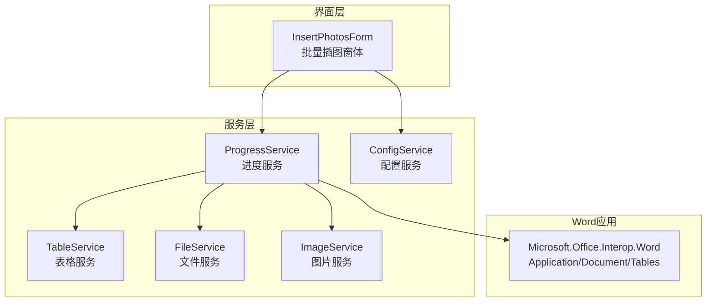
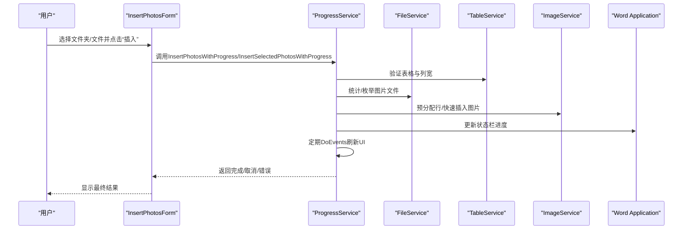
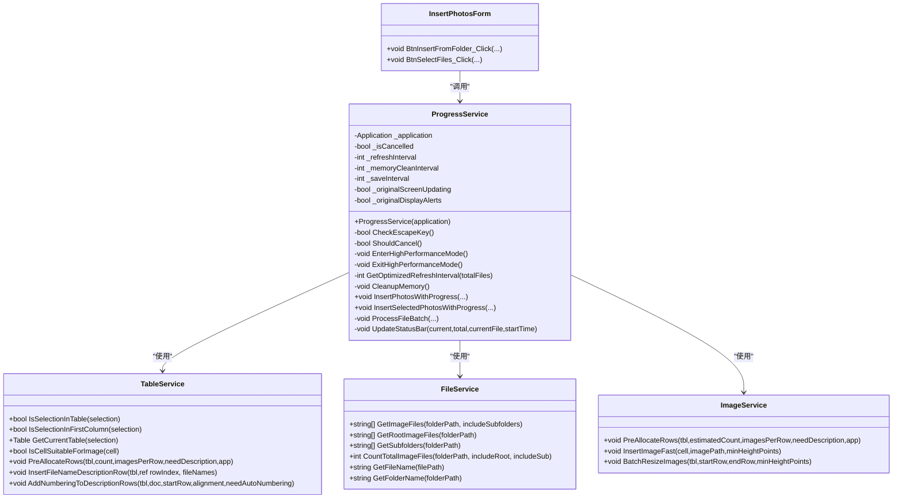
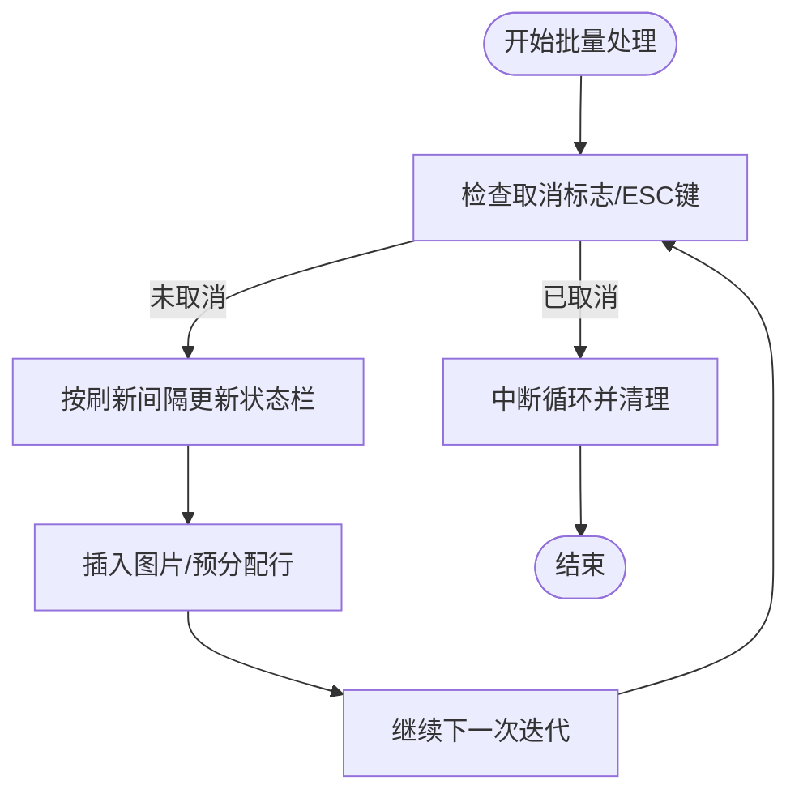
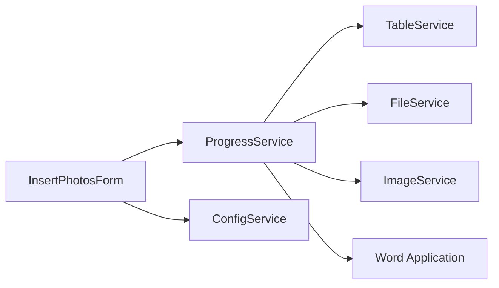

# 进度服务

<cite>
**本文引用的文件**
- [ProgressService.cs](file://WordTools/Services/ProgressService.cs)
- [TableService.cs](file://WordTools/Services/TableService.cs)
- [FileService.cs](file://WordTools/Services/FileService.cs)
- [ImageService.cs](file://WordTools/Services/ImageService.cs)
- [InsertPhotosForm.cs](file://WordTools/Forms/InsertPhotosForm.cs)
- [ConfigService.cs](file://WordTools/Services/ConfigService.cs)
- [README.md](file://README.md)
</cite>

## 目录
1. [简介](#简介)
2. [项目结构](#项目结构)
3. [核心组件](#核心组件)
4. [架构概览](#架构概览)
5. [详细组件分析](#详细组件分析)
6. [依赖关系分析](#依赖关系分析)
7. [性能考量](#性能考量)
8. [故障排除指南](#故障排除指南)
9. [结论](#结论)
10. [附录](#附录)

## 简介
本文件面向WordTools项目中的“进度服务”，系统性地解析ProgressService类的实现细节与进度监控机制，涵盖事件处理（取消控制）、状态通知（进度更新、完成通知、错误报告）、进度可视化（状态栏显示）、异步操作支持（后台任务与线程安全）、进度数据管理（进度跟踪与历史记录），以及集成与扩展方法，并提供使用示例与调试技巧。文档同时结合相关服务类（表格、文件、图片、配置）与窗体交互，帮助读者全面理解进度服务在Word COM加载项中的作用与实现方式。

## 项目结构
WordTools采用COM加载项架构，进度服务位于Services目录，与窗体、表格、文件、图片、配置等服务协同工作。批量插图功能通过窗体触发，调用ProgressService执行，期间通过状态栏实时反馈进度，支持ESC键取消、性能优化与内存管理。

图表来源
- [InsertPhotosForm.cs:513-517](file://WordTools/Forms/InsertPhotosForm.cs#L513-L517)
- [ProgressService.cs:151-306](file://WordTools/Services/ProgressService.cs#L151-L306)
- [TableService.cs:11-756](file://WordTools/Services/TableService.cs#L11-L756)
- [FileService.cs:13-310](file://WordTools/Services/FileService.cs#L13-L310)
- [ImageService.cs:10-325](file://WordTools/Services/ImageService.cs#L10-L325)
- [ConfigService.cs:11-463](file://WordTools/Services/ConfigService.cs#L11-L463)

章节来源
- [README.md:1-85](file://README.md#L1-L85)

## 核心组件
- ProgressService：负责批量图片插入的进度管理、性能优化、取消控制与状态栏更新。
- TableService：表格验证、单元格适配、标题行/描述行插入、自动编号等。
- FileService：文件夹/文件选择、图片文件过滤、自然排序、统计总数。
- ImageService：图片插入与尺寸调整、批量预分配行、快速插入。
- InsertPhotosForm：用户交互界面，收集参数并调用进度服务。
- ConfigService：文档属性与注册表配置读写，持久化用户偏好。

章节来源
- [ProgressService.cs:14-36](file://WordTools/Services/ProgressService.cs#L14-L36)
- [TableService.cs:11-41](file://WordTools/Services/TableService.cs#L11-L41)
- [FileService.cs:13-105](file://WordTools/Services/FileService.cs#L13-L105)
- [ImageService.cs:10-73](file://WordTools/Services/ImageService.cs#L10-L73)
- [InsertPhotosForm.cs:513-517](file://WordTools/Forms/InsertPhotosForm.cs#L513-L517)
- [ConfigService.cs:11-92](file://WordTools/Services/ConfigService.cs#L11-L92)

## 架构概览
进度服务围绕“批量图片插入”流程展开，采用分层协作：
- 界面层：窗体收集用户输入，调用进度服务。
- 服务层：进度服务协调文件扫描、表格准备、图片插入、状态更新与性能优化。
- Word应用层：通过COM接口操作文档、表格与状态栏。

图表来源
- [InsertPhotosForm.cs:513-517](file://WordTools/Forms/InsertPhotosForm.cs#L513-L517)
- [ProgressService.cs:151-306](file://WordTools/Services/ProgressService.cs#L151-L306)
- [FileService.cs:163-188](file://WordTools/Services/FileService.cs#L163-L188)
- [ImageService.cs:287-320](file://WordTools/Services/ImageService.cs#L287-L320)
- [TableService.cs:18-40](file://WordTools/Services/TableService.cs#L18-L40)

## 详细组件分析

### ProgressService 类
- 角色定位：管理批量插图进度，提供性能优化与取消控制。
- 关键职责：
  - 取消控制：ESC键检测与标志位切换，中断循环。
  - 性能优化：关闭屏幕更新、禁用警告、预分配行、定期清理内存。
  - 进度更新：基于计数与时间估算剩余时间，更新状态栏。
  - 批量处理：文件夹/选中文件两种入口，按批次处理并维护计数。
  - 结果通知：完成时弹窗汇总成功/失败数量；异常捕获与错误提示。
- 数据结构与算法：
  - 刷新间隔动态调整：根据总文件数映射不同刷新频率，平衡UI响应与性能。
  - 内存清理周期：按刷新间隔倍数定期GC，降低大文件批量处理的内存压力。
  - 时间估算：基于已耗时与当前进度推导剩余秒数，提升用户体验。
- 线程安全与异步支持：
  - 使用Application.DoEvents()在UI线程中轮询，确保状态栏与消息框及时响应。
  - 取消检测在关键循环中执行，避免长时间阻塞。
  - 通过性能模式开关Word UI，减少不必要的渲染与警告对话框。
- 状态通知：
  - 进度更新：状态栏显示“已处理/总数(百分比) - 已用:xxs 剩余:xxs - 当前文件名”。
  - 完成通知：根据是否取消与失败数量，弹窗提示不同结果。
  - 错误报告：try-catch包裹关键流程，统一错误消息提示。

图表来源
- [ProgressService.cs:14-36](file://WordTools/Services/ProgressService.cs#L14-L36)
- [TableService.cs:11-756](file://WordTools/Services/TableService.cs#L11-L756)
- [FileService.cs:13-310](file://WordTools/Services/FileService.cs#L13-L310)
- [ImageService.cs:10-325](file://WordTools/Services/ImageService.cs#L10-L325)
- [InsertPhotosForm.cs:513-517](file://WordTools/Forms/InsertPhotosForm.cs#L513-L517)

章节来源
- [ProgressService.cs:14-36](file://WordTools/Services/ProgressService.cs#L14-L36)
- [ProgressService.cs:39-64](file://WordTools/Services/ProgressService.cs#L39-L64)
- [ProgressService.cs:69-142](file://WordTools/Services/ProgressService.cs#L69-L142)
- [ProgressService.cs:146-306](file://WordTools/Services/ProgressService.cs#L146-L306)
- [ProgressService.cs:310-403](file://WordTools/Services/ProgressService.cs#L310-L403)
- [ProgressService.cs:407-533](file://WordTools/Services/ProgressService.cs#L407-L533)
- [ProgressService.cs:537-566](file://WordTools/Services/ProgressService.cs#L537-L566)

### 进度事件处理系统与回调机制
- 取消控制（事件委托模式）：通过ESC键状态检测与内部标志位实现“事件驱动”的取消逻辑。每次循环检查ShouldCancel，一旦触发立即中断后续处理。
- 状态栏更新（回调机制）：在ProcessFileBatch中按刷新间隔调用UpdateStatusBar，间接实现“进度回调”。该回调在UI线程中执行，配合DoEvents确保界面响应。
- 异步支持：通过Application.DoEvents()在UI线程中轮询，模拟轻量级异步更新。对于长耗时操作，建议在外部封装Task.Run并在完成后回到UI线程更新状态栏。

图表来源
- [ProgressService.cs:41-64](file://WordTools/Services/ProgressService.cs#L41-L64)
- [ProgressService.cs:426-431](file://WordTools/Services/ProgressService.cs#L426-L431)
- [ProgressService.cs:542-566](file://WordTools/Services/ProgressService.cs#L542-L566)

章节来源
- [ProgressService.cs:41-64](file://WordTools/Services/ProgressService.cs#L41-L64)
- [ProgressService.cs:426-431](file://WordTools/Services/ProgressService.cs#L426-L431)
- [ProgressService.cs:542-566](file://WordTools/Services/ProgressService.cs#L542-L566)

### 状态通知功能
- 进度更新：状态栏显示“已处理/总数(百分比) - 已用:xxs 剩余:xxs - 当前文件名”，包含文件名截断，便于阅读。
- 完成通知：根据是否取消与失败数量，弹窗提示不同结果；成功/部分失败/完全取消均有明确提示。
- 错误报告：关键流程try-catch，统一错误消息提示，避免崩溃影响用户体验。

章节来源
- [ProgressService.cs:539-566](file://WordTools/Services/ProgressService.cs#L539-L566)
- [ProgressService.cs:261-279](file://WordTools/Services/ProgressService.cs#L261-L279)
- [ProgressService.cs:365-377](file://WordTools/Services/ProgressService.cs#L365-L377)
- [ProgressService.cs:281-285](file://WordTools/Services/ProgressService.cs#L281-L285)
- [ProgressService.cs:379-383](file://WordTools/Services/ProgressService.cs#L379-L383)

### 进度可视化组件
- 状态栏显示：通过Application.StatusBar实时更新，展示进度百分比、已用时间、剩余时间与当前文件名。
- 窗体交互：InsertPhotosForm在调用进度服务前后隐藏窗体并DoEvents，确保状态栏可见且UI响应流畅。
- 自动编号与描述行：在完成后根据配置自动添加编号，增强表格可读性。

章节来源
- [ProgressService.cs:539-566](file://WordTools/Services/ProgressService.cs#L539-L566)
- [InsertPhotosForm.cs:510-517](file://WordTools/Forms/InsertPhotosForm.cs#L510-L517)
- [TableService.cs:564-737](file://WordTools/Services/TableService.cs#L564-L737)

### 异步操作支持与线程安全
- 线程模型：Word COM在UI线程中运行，进度服务在UI线程中通过DoEvents轮询，避免跨线程访问问题。
- 取消与响应：ESC键检测与DoEvents确保用户可随时中断长耗时操作。
- 性能优化：进入高性能模式关闭屏幕更新与警告，减少UI渲染与对话框开销。

章节来源
- [ProgressService.cs:73-112](file://WordTools/Services/ProgressService.cs#L73-L112)
- [ProgressService.cs:41-64](file://WordTools/Services/ProgressService.cs#L41-L64)

### 进度数据管理
- 进度跟踪：维护processedCount、successCount、failCount三类计数，结合时间戳估算剩余时间。
- 历史记录：通过ConfigService持久化用户偏好（如上次文件夹、高度、描述行策略、自动编号与对齐方式），便于下次使用。
- 文件统计：FileService提供CountTotalImageFiles，支持根目录与子目录组合统计，为刷新间隔与内存清理提供依据。

章节来源
- [ProgressService.cs:156-160](file://WordTools/Services/ProgressService.cs#L156-L160)
- [ProgressService.cs:542-566](file://WordTools/Services/ProgressService.cs#L542-L566)
- [ConfigService.cs:149-178](file://WordTools/Services/ConfigService.cs#L149-L178)
- [FileService.cs:163-188](file://WordTools/Services/FileService.cs#L163-L188)

### 集成指导与扩展方法
- 集成步骤：
  - 在窗体事件中实例化ProgressService并调用相应入口方法。
  - 传入必要的参数（文件夹/文件、最小高度、描述行策略、自动编号与对齐方式）。
  - 在调用前后适当隐藏/显示窗体并调用DoEvents，确保状态栏可见。
- 扩展建议：
  - 增加事件回调接口：对外暴露进度变更、完成、错误事件，便于上层UI或日志模块订阅。
  - 引入后台任务：使用Task.Run执行长耗时操作，在完成/失败时回到UI线程更新状态栏。
  - 增强日志：将进度与错误写入日志文件，便于问题追踪与性能分析。
  - 可视化进度条：在窗体中增加ProgressBar控件，结合Application.DoEvents实现双通道可视化。

章节来源
- [InsertPhotosForm.cs:513-517](file://WordTools/Forms/InsertPhotosForm.cs#L513-L517)
- [InsertPhotosForm.cs:559-563](file://WordTools/Forms/InsertPhotosForm.cs#L559-L563)
- [ProgressService.cs:73-112](file://WordTools/Services/ProgressService.cs#L73-L112)

## 依赖关系分析
- ProgressService依赖：
  - TableService：表格验证、单元格适配、预分配行、描述行与编号。
  - FileService：文件枚举、统计、自然排序。
  - ImageService：图片插入、快速插入、批量预分配行。
  - InsertPhotosForm：参数收集与调用入口。
  - ConfigService：持久化用户偏好。
- 外部依赖：
  - Microsoft.Office.Interop.Word：Word COM接口。
  - System.Windows.Forms：消息泵与DoEvents。
  - Windows API：ESC键检测。

图表来源
- [ProgressService.cs:14-36](file://WordTools/Services/ProgressService.cs#L14-L36)
- [TableService.cs:11-756](file://WordTools/Services/TableService.cs#L11-L756)
- [FileService.cs:13-310](file://WordTools/Services/FileService.cs#L13-L310)
- [ImageService.cs:10-325](file://WordTools/Services/ImageService.cs#L10-L325)
- [InsertPhotosForm.cs:513-517](file://WordTools/Forms/InsertPhotosForm.cs#L513-L517)
- [ConfigService.cs:11-463](file://WordTools/Services/ConfigService.cs#L11-L463)

章节来源
- [ProgressService.cs:14-36](file://WordTools/Services/ProgressService.cs#L14-L36)
- [TableService.cs:11-756](file://WordTools/Services/TableService.cs#L11-L756)
- [FileService.cs:13-310](file://WordTools/Services/FileService.cs#L13-L310)
- [ImageService.cs:10-325](file://WordTools/Services/ImageService.cs#L10-L325)
- [InsertPhotosForm.cs:513-517](file://WordTools/Forms/InsertPhotosForm.cs#L513-L517)
- [ConfigService.cs:11-463](file://WordTools/Services/ConfigService.cs#L11-L463)

## 性能考量
- 性能模式：关闭ScreenUpdating与DisplayAlerts，减少UI渲染与警告对话框，显著提升批量插入性能。
- 刷新策略：根据文件总数动态调整刷新间隔，兼顾UI响应与性能。
- 内存管理：定期GC与等待终结器，缓解大批量处理的内存压力。
- 预分配行：ImageService.PreAllocateRows与TableService.EnsureRowExists减少动态扩容开销。
- UI轮询：Application.DoEvents确保状态栏与消息框及时更新，但应避免在长耗时操作中过度频繁调用。

章节来源
- [ProgressService.cs:73-112](file://WordTools/Services/ProgressService.cs#L73-L112)
- [ProgressService.cs:117-125](file://WordTools/Services/ProgressService.cs#L117-L125)
- [ProgressService.cs:130-142](file://WordTools/Services/ProgressService.cs#L130-L142)
- [ImageService.cs:287-320](file://WordTools/Services/ImageService.cs#L287-L320)
- [TableService.cs:205-229](file://WordTools/Services/TableService.cs#L205-L229)

## 故障排除指南
- ESC键取消无效：
  - 确认在循环中调用了ShouldCancel；检查DoEvents是否在UI线程中执行。
- 状态栏不更新：
  - 确认UpdateStatusBar被按刷新间隔调用；检查Application.DoEvents是否在循环中调用。
- 图片插入失败：
  - 检查文件路径有效性与图片格式；确认单元格适合插入（无图片、无编号或可清理）。
- 性能不佳：
  - 确认已进入高性能模式；检查刷新间隔与内存清理周期设置。
- 弹窗提示异常：
  - 检查异常捕获与消息框显示逻辑；确认finally块中退出高性能模式与清空状态栏。

章节来源
- [ProgressService.cs:41-64](file://WordTools/Services/ProgressService.cs#L41-L64)
- [ProgressService.cs:542-566](file://WordTools/Services/ProgressService.cs#L542-L566)
- [TableService.cs:44-123](file://WordTools/Services/TableService.cs#L44-L123)
- [FileService.cs:89-95](file://WordTools/Services/FileService.cs#L89-L95)
- [ProgressService.cs:73-112](file://WordTools/Services/ProgressService.cs#L73-L112)

## 结论
ProgressService通过清晰的职责划分与完善的性能优化策略，实现了在Word COM环境下的高效批量图片插入与进度可视化。其取消控制、状态栏更新与错误处理机制保证了良好的用户体验。结合表格、文件、图片与配置服务，形成完整的批处理链路。未来可在事件回调、后台任务与可视化进度条方面进一步扩展，以满足更复杂的场景需求。

## 附录

### 使用示例（路径指引）
- 从文件夹批量插入图片：
  - 路径：[InsertPhotosForm.cs:513-517](file://WordTools/Forms/InsertPhotosForm.cs#L513-L517)
  - 步骤：窗体收集参数 → 实例化ProgressService → 调用InsertPhotosWithProgress → 显示结果
- 从选中文件批量插入图片：
  - 路径：[InsertPhotosForm.cs:559-563](file://WordTools/Forms/InsertPhotosForm.cs#L559-L563)
  - 步骤：选择文件 → 实例化ProgressService → 调用InsertSelectedPhotosWithProgress → 显示结果

### 调试技巧
- 在循环中增加日志输出（文件或输出窗口），记录processedCount与当前文件名，便于定位卡顿点。
- 调整_refreshInterval与_memoryCleanInterval，观察UI响应与内存占用变化。
- 使用性能模式开关对比处理速度差异，确保在长耗时操作中正确进入/退出高性能模式。
- 在异常捕获处添加堆栈信息输出，便于定位具体失败环节。