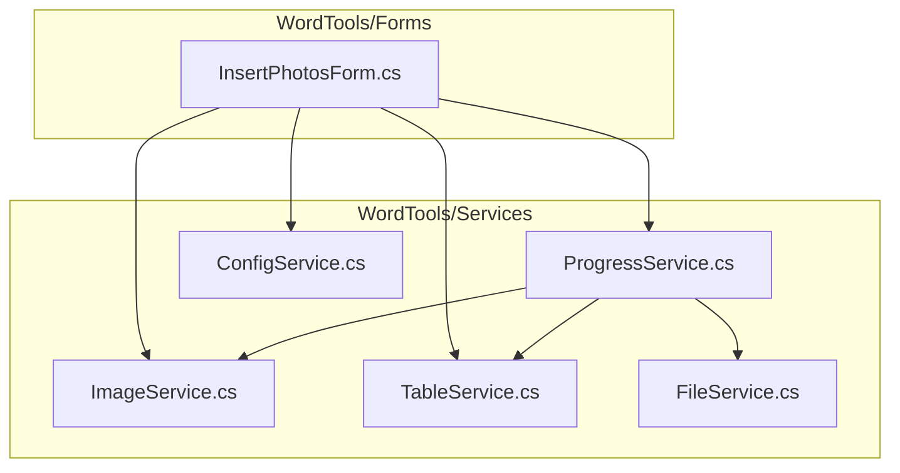
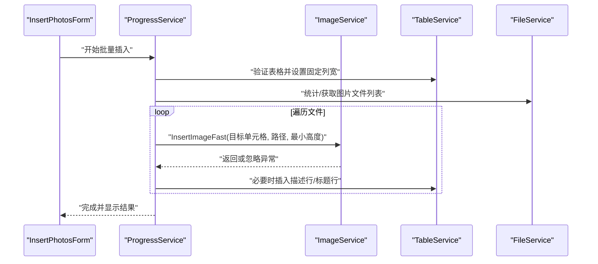
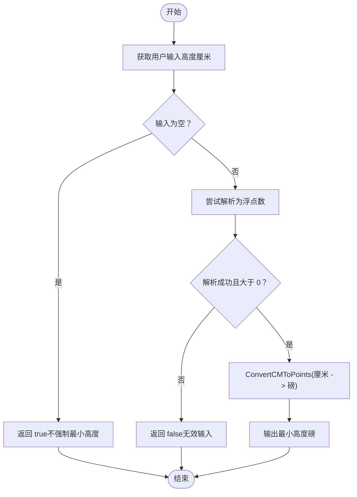
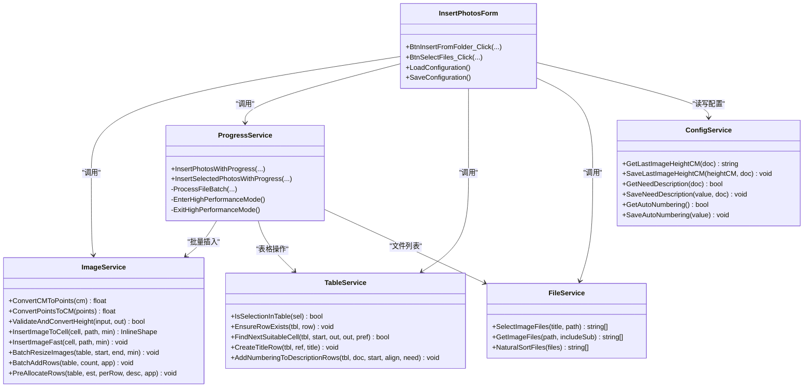

# 图片服务 (ImageService)

<cite>
**本文引用的文件**
- [ImageService.cs](file://WordTools/Services/ImageService.cs)
- [InsertPhotosForm.cs](file://WordTools/Forms/InsertPhotosForm.cs)
- [TableService.cs](file://WordTools/Services/TableService.cs)
- [ProgressService.cs](file://WordTools/Services/ProgressService.cs)
- [FileService.cs](file://WordTools/Services/FileService.cs)
- [ConfigService.cs](file://WordTools/Services/ConfigService.cs)
- [README.md](file://README.md)
</cite>

## 目录
1. [简介](#简介)
2. [项目结构](#项目结构)
3. [核心组件](#核心组件)
4. [架构概览](#架构概览)
5. [详细组件分析](#详细组件分析)
6. [依赖关系分析](#依赖关系分析)
7. [性能考量](#性能考量)
8. [故障排除指南](#故障排除指南)
9. [结论](#结论)
10. [附录](#附录)

## 简介
本文件为 ImageService 的详细 API 文档，涵盖图片处理的核心功能，包括：
- 尺寸转换方法：ConvertCMToPoints、ConvertPointsToCM
- 图片插入方法：InsertImageToCell、InsertImageFast
- 批量操作方法：BatchResizeImages、BatchAddRows、PreAllocateRows
- 输入验证方法：ValidateAndConvertHeight
- 厘米与磅的转换机制
- 图片缩放算法与宽高比保持策略
- 具体使用示例与最佳实践
- 异常处理策略与性能优化技巧（含快速插入模式与内存优化）

## 项目结构
ImageService 位于 WordTools/Services 目录，主要负责图片插入与尺寸调整，并与表格服务、进度服务、文件服务、配置服务协同工作。

图表来源
- [ImageService.cs:10-325](file://WordTools/Services/ImageService.cs#L10-L325)
- [InsertPhotosForm.cs:18-618](file://WordTools/Forms/InsertPhotosForm.cs#L18-L618)
- [TableService.cs:11-756](file://WordTools/Services/TableService.cs#L11-L756)
- [ProgressService.cs:14-571](file://WordTools/Services/ProgressService.cs#L14-L571)
- [FileService.cs:13-310](file://WordTools/Services/FileService.cs#L13-L310)
- [ConfigService.cs:11-362](file://WordTools/Services/ConfigService.cs#L11-L362)

章节来源
- [README.md:47-61](file://README.md#L47-L61)

## 核心组件
- ImageService：提供图片插入、尺寸转换、批量处理与预分配行数等静态方法，面向 Word COM 操作。
- InsertPhotosForm：UI 窗体，负责收集用户输入（文件夹、高度、范围、描述选项、对齐方式等），调用 ImageService 与 ProgressService 执行批量插入。
- TableService：表格验证与辅助操作（单元格适合性检查、查找合适单元格、标题行与描述行插入、自动编号等）。
- ProgressService：批量处理进度管理、性能优化（关闭屏幕更新、禁用提示、内存回收）、取消控制（ESC 键）。
- FileService：文件选择、图片文件过滤与统计、自然排序。
- ConfigService：文档自定义属性与注册表配置读写（图片高度、文件夹路径、描述选项、自动编号、对齐方式等）。

章节来源
- [ImageService.cs:10-325](file://WordTools/Services/ImageService.cs#L10-L325)
- [InsertPhotosForm.cs:18-618](file://WordTools/Forms/InsertPhotosForm.cs#L18-L618)
- [TableService.cs:11-756](file://WordTools/Services/TableService.cs#L11-L756)
- [ProgressService.cs:14-571](file://WordTools/Services/ProgressService.cs#L14-L571)
- [FileService.cs:13-310](file://WordTools/Services/FileService.cs#L13-L310)
- [ConfigService.cs:11-362](file://WordTools/Services/ConfigService.cs#L11-L362)

## 架构概览
ImageService 通过 Word Interop 操作单元格与内联形状（InlineShape），结合 TableService 的单元格验证与布局能力，配合 ProgressService 的批量处理与性能优化，实现高效的图片批量插入与尺寸调整。

图表来源
- [InsertPhotosForm.cs:525-568](file://WordTools/Forms/InsertPhotosForm.cs#L525-L568)
- [ProgressService.cs:148-306](file://WordTools/Services/ProgressService.cs#L148-L306)
- [ImageService.cs:142-180](file://WordTools/Services/ImageService.cs#L142-L180)
- [TableService.cs:15-123](file://WordTools/Services/TableService.cs#L15-L123)
- [FileService.cs:117-134](file://WordTools/Services/FileService.cs#L117-L134)

## 详细组件分析

### 尺寸转换方法
- ConvertCMToPoints(float heightCM)
  - 功能：将厘米转换为磅（Word 默认单位）
  - 参数：heightCM（厘米）
  - 返回：float（磅）
  - 转换系数：内部常量 CM_TO_POINTS = 28.35f
- ConvertPointsToCM(float heightPoints)
  - 功能：将磅转换为厘米
  - 参数：heightPoints（磅）
  - 返回：float（厘米）
- ValidateAndConvertHeight(string heightInput, out float heightPoints)
  - 功能：验证并转换用户输入的高度（厘米）
  - 参数：
    - heightInput：用户输入的高度字符串（厘米）
    - heightPoints：输出的最小高度（磅）
  - 返回：bool（true 表示输入有效；空字符串视为有效，不强制最小高度）
  - 规则：非空且必须为正数；否则返回 false

使用建议
- UI 层（InsertPhotosForm）在执行批量插入前调用 ValidateAndConvertHeight，确保输入合法。
- 若用户未输入高度，可传入空字符串，表示不限制最小高度。

章节来源
- [ImageService.cs:22-60](file://WordTools/Services/ImageService.cs#L22-L60)
- [InsertPhotosForm.cs:537-543](file://WordTools/Forms/InsertPhotosForm.cs#L537-L543)

### 图片插入方法

#### InsertImageToCell(Cell targetCell, string imagePath, float minHeightPoints = -1)
- 功能：将图片插入到指定单元格，并根据单元格尺寸与最小高度限制进行缩放，保持宽高比。
- 参数：
  - targetCell：目标单元格
  - imagePath：图片文件路径
  - minHeightPoints：最小高度（磅），-1 表示不限制
- 返回：InlineShape（插入的图片对象），失败返回 null
- 算法要点：
  - 获取单元格宽度与高度，减去边距（左右各 3 磅，上下各 3 磅），得到目标尺寸
  - 插入图片后锁定宽高比（msoTrue = -1）
  - 先按宽度限制计算缩放比例，再按高度限制调整缩放比例
  - 若设置了最小高度且当前高度小于最小高度，则提升至最小高度
- 异常处理：捕获异常并返回 null

#### InsertImageFast(Cell targetCell, string imagePath, float minHeightPoints = -1)
- 功能：快速插入图片（最小化内存使用），仅检查宽度限制，不进行复杂计算
- 参数：
  - targetCell：目标单元格
  - imagePath：图片文件路径
  - minHeightPoints：最小高度（磅），-1 表示不限制
- 返回：void
- 算法要点：
  - 清空单元格文本
  - 插入图片并锁定宽高比
  - 仅当宽度超过单元格宽度时缩小宽度
  - 若设置了最小高度且当前高度小于最小高度，则提升至最小高度
- 异常处理：捕获异常并忽略（静默失败）

使用建议
- 大批量插入时优先使用 InsertImageFast，减少 CPU 与内存开销
- 需要精确尺寸控制时使用 InsertImageToCell

章节来源
- [ImageService.cs:73-180](file://WordTools/Services/ImageService.cs#L73-L180)

### 批量操作方法

#### BatchResizeImages(Table tbl, int startRow, int endRow, float minHeightPoints = -1)
- 功能：批量调整表格中指定区域的图片尺寸
- 参数：
  - tbl：表格对象
  - startRow：开始行
  - endRow：结束行
  - minHeightPoints：最小高度（磅）
- 返回：void
- 算法要点：
  - 遍历指定行列范围
  - 对每个单元格内的图片：
    - 锁定宽高比
    - 宽度超过单元格宽度 - 6 时按宽度缩放
    - 若设置了最小高度且当前高度小于最小高度，则提升至最小高度
- 异常处理：逐单元格捕获异常并忽略，保证整体流程继续

#### BatchAddRows(Table tbl, int rowCount, Application app = null)
- 功能：批量添加行，支持进度更新
- 参数：
  - tbl：表格对象
  - rowCount：要添加的行数
  - app：Word 应用程序对象（用于更新状态栏）
- 返回：void
- 算法要点：
  - 分批添加（每批 100 行）以降低 UI 阻塞
  - 每批完成后更新状态栏并处理消息队列
- 异常处理：忽略错误

#### PreAllocateRows(Table tbl, int estimatedImageCount, int imagesPerRow = 2, bool needDescription = false, Application app = null)
- 功能：预分配表格行数，避免频繁插入导致的性能问题
- 参数：
  - tbl：表格对象
  - estimatedImageCount：预计图片数量
  - imagesPerRow：每行图片数（默认 2）
  - needDescription：是否需要描述行（每张图片后追加一行描述）
  - app：Word 应用程序对象
- 返回：void
- 算法要点：
  - 计算所需行数：向上取整（估算数量 / 每行图片数）
  - 若需要描述行，行数翻倍
  - 限制最大预分配行数（1000），防止过度占用内存
  - 调用 BatchAddRows 批量添加
- 异常处理：忽略错误

使用建议
- 在批量插入前调用 PreAllocateRows，显著提升插入速度
- 结合 ProgressService 的高性能模式（关闭屏幕更新、禁用提示）效果更佳

章节来源
- [ImageService.cs:193-320](file://WordTools/Services/ImageService.cs#L193-L320)

### 输入验证与转换流程

图表来源
- [ImageService.cs:43-60](file://WordTools/Services/ImageService.cs#L43-L60)
- [InsertPhotosForm.cs:537-543](file://WordTools/Forms/InsertPhotosForm.cs#L537-L543)

## 依赖关系分析
- ImageService 依赖 Word Interop（Microsoft.Office.Interop.Word）进行单元格与图片操作
- InsertPhotosForm 依赖 ImageService、ProgressService、TableService、FileService、ConfigService
- ProgressService 依赖 ImageService、TableService、FileService 进行批量处理与性能优化
- TableService 依赖 Word Interop 进行表格验证与布局
- FileService 依赖系统 IO 与 WinForms 进行文件选择与排序
- ConfigService 依赖 Word 自定义属性与注册表进行配置持久化

图表来源
- [ImageService.cs:10-325](file://WordTools/Services/ImageService.cs#L10-L325)
- [InsertPhotosForm.cs:18-618](file://WordTools/Forms/InsertPhotosForm.cs#L18-L618)
- [ProgressService.cs:14-571](file://WordTools/Services/ProgressService.cs#L14-L571)
- [TableService.cs:11-756](file://WordTools/Services/TableService.cs#L11-L756)
- [FileService.cs:13-310](file://WordTools/Services/FileService.cs#L13-L310)
- [ConfigService.cs:11-362](file://WordTools/Services/ConfigService.cs#L11-L362)

## 性能考量
- 快速插入模式（InsertImageFast）
  - 仅检查宽度限制，不进行复杂的宽高比计算与高度限制调整
  - 适合大批量插入，显著降低 CPU 与内存消耗
- 预分配行数（PreAllocateRows）
  - 避免频繁插入导致的性能抖动
  - 限制最大预分配行数（1000），防止过度占用内存
- 批量添加行（BatchAddRows）
  - 分批添加（每批 100 行），并定期更新状态栏与处理消息队列
- 高性能模式（ProgressService）
  - 关闭 ScreenUpdating 与 DisplayAlerts，禁用拼写/语法检查
  - 定期清理内存（DoEvents + GC），平衡流畅度与性能
- 取消控制
  - 支持按 ESC 键取消，及时释放资源

最佳实践
- 大批量插入前先调用 PreAllocateRows
- 使用 InsertImageFast 进行快速插入，后续再用 BatchResizeImages 精细调整
- 在 ProgressService 的高性能模式下执行批量操作
- 对于需要精确尺寸控制的场景，使用 InsertImageToCell 并在批量后统一调整

章节来源
- [ImageService.cs:142-180](file://WordTools/Services/ImageService.cs#L142-L180)
- [ImageService.cs:287-320](file://WordTools/Services/ImageService.cs#L287-L320)
- [ProgressService.cs:73-142](file://WordTools/Services/ProgressService.cs#L73-L142)
- [ProgressService.cs:212-213](file://WordTools/Services/ProgressService.cs#L212-L213)

## 故障排除指南
- 插入失败返回 null 或抛出异常
  - 检查目标单元格是否为空且适合插入（TableService.IsCellSuitableForImage）
  - 确认图片路径有效（FileService.FileExists）
  - 验证输入高度（ValidateAndConvertHeight）
- 图片显示异常或尺寸不正确
  - 使用 InsertImageToCell 替代 InsertImageFast，确保按高度限制调整
  - 使用 BatchResizeImages 对已插入图片进行统一调整
- 性能问题
  - 启用高性能模式（ProgressService.EnterHighPerformanceMode）
  - 预分配行数（PreAllocateRows）
  - 分批处理（BatchAddRows）
- 取消操作
  - 按 ESC 键取消，ProgressService 会优雅退出并恢复环境设置

章节来源
- [ImageService.cs:73-180](file://WordTools/Services/ImageService.cs#L73-L180)
- [TableService.cs:45-123](file://WordTools/Services/TableService.cs#L45-L123)
- [ProgressService.cs:40-64](file://WordTools/Services/ProgressService.cs#L40-L64)

## 结论
ImageService 提供了完整的图片插入与尺寸管理能力，结合 ProgressService 的高性能模式与 TableService 的表格布局能力，能够高效地在 Word 表格中批量插入图片并保持一致的视觉效果。通过快速插入模式与预分配行数等优化手段，可在保证用户体验的同时最大化吞吐量。

## 附录

### API 方法清单与说明

- ConvertCMToPoints(float heightCM)
  - 输入：厘米
  - 输出：磅
  - 用途：将用户输入的高度转换为 Word 内部单位
- ConvertPointsToCM(float heightPoints)
  - 输入：磅
  - 输出：厘米
  - 用途：反向转换，便于 UI 显示
- ValidateAndConvertHeight(string heightInput, out float heightPoints)
  - 输入：用户输入的高度字符串（厘米）
  - 输出：最小高度（磅）
  - 返回：bool（输入是否有效）
  - 用途：校验并转换用户输入
- InsertImageToCell(Cell targetCell, string imagePath, float minHeightPoints = -1)
  - 输入：目标单元格、图片路径、最小高度（磅）
  - 输出：InlineShape（插入的图片对象）
  - 用途：精确尺寸控制的插入
- InsertImageFast(Cell targetCell, string imagePath, float minHeightPoints = -1)
  - 输入：目标单元格、图片路径、最小高度（磅）
  - 输出：void
  - 用途：快速插入，适合大批量
- BatchResizeImages(Table tbl, int startRow, int endRow, float minHeightPoints = -1)
  - 输入：表格、起止行、最小高度（磅）
  - 输出：void
  - 用途：批量调整已插入图片尺寸
- BatchAddRows(Table tbl, int rowCount, Application app = null)
  - 输入：表格、行数、应用实例
  - 输出：void
  - 用途：分批添加行，降低 UI 阻塞
- PreAllocateRows(Table tbl, int estimatedImageCount, int imagesPerRow = 2, bool needDescription = false, Application app = null)
  - 输入：表格、估计图片数、每行图片数、是否需要描述行、应用实例
  - 输出：void
  - 用途：预分配行数，提升批量插入性能

### 使用示例（步骤说明）

- 在表格中插入单张图片并保持宽高比
  1) 调用 ValidateAndConvertHeight 校验用户输入
  2) 调用 InsertImageToCell(targetCell, imagePath, minHeightPoints)
  3) 如需统一调整，调用 BatchResizeImages(tbl, startRow, endRow, minHeightPoints)
- 批量插入图片（来自文件夹）
  1) 选择表格并定位到首列
  2) 调用 ValidateAndConvertHeight 校验高度
  3) 调用 ProgressService.InsertPhotosWithProgress(...)，内部会：
     - 预分配行数（PreAllocateRows）
     - 分批插入（InsertImageFast）
     - 可选插入描述行（TableService）
     - 自动编号（TableService）
- 批量插入图片（选中文件）
  1) 选择表格并定位到首列
  2) 调用 ValidateAndConvertHeight 校验高度
  3) 调用 ProgressService.InsertSelectedPhotosWithProgress(...)，内部会：
     - 分批插入（InsertImageFast）
     - 可选插入描述行（TableService）
     - 自动编号（TableService）

### 参数验证规则与返回值说明
- ValidateAndConvertHeight
  - 输入为空：返回 true，不强制最小高度
  - 输入非空但解析失败或 ≤ 0：返回 false
  - 输入有效：返回 true，并输出对应的最小高度（磅）
- InsertImageToCell
  - 返回 InlineShape 或 null（失败）
- InsertImageFast
  - 返回 void（失败时静默忽略）
- BatchResizeImages/BatchAddRows/PreAllocateRows
  - 返回 void（失败时静默忽略）

### 错误处理最佳实践
- 所有公共方法均包含 try/catch，失败时返回 null 或忽略，保证流程不中断
- UI 层应显示友好提示（如 InsertPhotosForm 中的警告与完成消息）
- 批量操作建议结合 ProgressService 的取消控制与性能优化