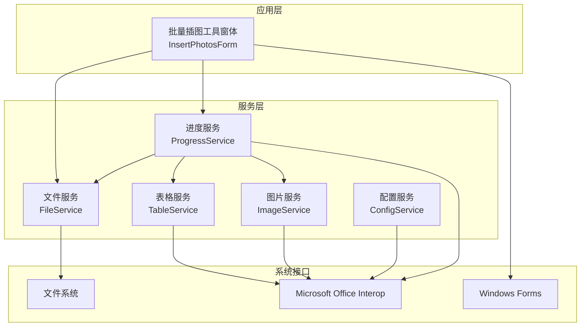
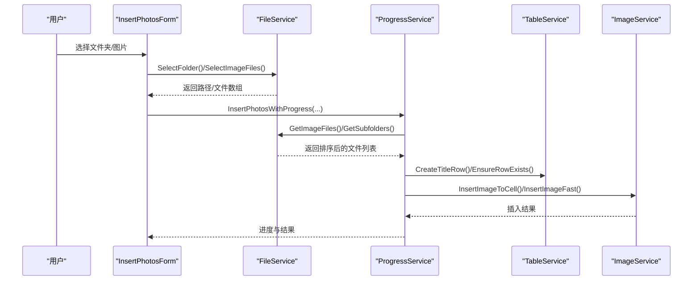
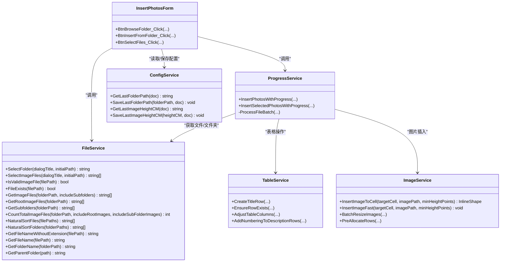

# 文件服务 (FileService)

<cite>
**本文引用的文件**
- [FileService.cs](file://WordTools/Services/FileService.cs)
- [InsertPhotosForm.cs](file://WordTools/Forms/InsertPhotosForm.cs)
- [ProgressService.cs](file://WordTools/Services/ProgressService.cs)
- [ImageService.cs](file://WordTools/Services/ImageService.cs)
- [TableService.cs](file://WordTools/Services/TableService.cs)
- [ConfigService.cs](file://WordTools/Services/ConfigService.cs)
- [README.md](file://README.md)
- [WordTools.csproj](file://WordTools/WordTools.csproj)
</cite>

## 目录
1. [简介](#简介)
2. [项目结构](#项目结构)
3. [核心组件](#核心组件)
4. [架构概览](#架构概览)
5. [详细组件分析](#详细组件分析)
6. [依赖关系分析](#依赖关系分析)
7. [性能考量](#性能考量)
8. [故障排除指南](#故障排除指南)
9. [结论](#结论)
10. [附录](#附录)

## 简介
本文档为 Word 工具箱项目中的文件服务（FileService）提供详细的 API 文档。FileService 是一个静态类，负责处理文件系统操作，包括：
- 文件夹选择与图片文件选择
- 文件验证（存在性、类型、扩展名）
- 文件列表获取（根目录与子目录图片文件、子文件夹列表）
- 文件统计（图片总数）
- 自然排序（文件与文件夹）
- 路径辅助（文件名、文件夹名、父路径）

该服务与批量插图工具紧密协作，通过进度服务（ProgressService）驱动大规模文件处理，并与表格服务（TableService）、图片服务（ImageService）配合完成 Word 表格中的图片插入与布局。

## 项目结构
项目采用分层与按职责划分的组织方式：
- Services：核心业务服务（FileService、ProgressService、ImageService、TableService、ConfigService）
- Forms：用户界面（批量插图工具窗体）
- WordTools.csproj：项目配置与引用

图表来源
- [InsertPhotosForm.cs:509-568](file://WordTools/Forms/InsertPhotosForm.cs#L509-L568)
- [ProgressService.cs:228-255](file://WordTools/Services/ProgressService.cs#L228-L255)
- [FileService.cs:117-188](file://WordTools/Services/FileService.cs#L117-L188)

章节来源
- [README.md:47-61](file://README.md#L47-L61)
- [WordTools.csproj:99-118](file://WordTools/WordTools.csproj#L99-L118)

## 核心组件
- 文件夹选择：提供 FolderBrowserDialog 的封装，支持设置初始路径与标题。
- 图片文件选择：提供 OpenFileDialog 的封装，支持多选与过滤。
- 文件验证：支持扩展名验证与文件存在性检查。
- 文件列表获取：支持根目录与子目录图片文件检索、子文件夹列表获取、图片总数统计。
- 自然排序：对文件名与文件夹名进行“自然排序”，提升用户直观体验。
- 路径辅助：提供文件名、文件夹名、父路径等常用路径信息提取。

章节来源
- [FileService.cs:26-78](file://WordTools/Services/FileService.cs#L26-L78)
- [FileService.cs:89-105](file://WordTools/Services/FileService.cs#L89-L105)
- [FileService.cs:117-188](file://WordTools/Services/FileService.cs#L117-L188)
- [FileService.cs:254-269](file://WordTools/Services/FileService.cs#L254-L269)
- [FileService.cs:278-305](file://WordTools/Services/FileService.cs#L278-L305)

## 架构概览
FileService 作为底层文件系统操作的统一入口，向上提供稳定的 API，供上层 UI 与业务流程调用。批量插图工具通过 FileService 获取文件列表，再由 ProgressService 驱动插入流程，ImageService 负责图片尺寸与插入细节，TableService 负责表格布局与编号。

图表来源
- [InsertPhotosForm.cs:509-568](file://WordTools/Forms/InsertPhotosForm.cs#L509-L568)
- [ProgressService.cs:228-255](file://WordTools/Services/ProgressService.cs#L228-L255)
- [FileService.cs:117-188](file://WordTools/Services/FileService.cs#L117-L188)
- [ImageService.cs:73-134](file://WordTools/Services/ImageService.cs#L73-L134)
- [TableService.cs:304-357](file://WordTools/Services/TableService.cs#L304-L357)

## 详细组件分析

### 文件夹选择（SelectFolder）
- 功能：弹出文件夹选择对话框，支持设置标题与初始路径。
- 参数：
  - dialogTitle：对话框标题（默认“请选择文件夹...”）
  - initialPath：初始路径（可选）
- 返回：用户选择的文件夹路径；取消则返回空字符串。
- 实现要点：若 initialPath 存在且有效，则设置为 SelectedPath；仅当用户点击 OK 时才返回路径。

章节来源
- [FileService.cs:26-45](file://WordTools/Services/FileService.cs#L26-L45)

### 图片文件选择（SelectImageFiles）
- 功能：弹出文件选择对话框，支持多选与图片文件过滤。
- 参数：
  - dialogTitle：对话框标题（默认“请选择图片文件...”）
  - initialPath：初始目录（可选）
- 返回：选中的文件路径数组；取消则返回 null。
- 实现要点：Filter 限定为图片文件（.jpg/.jpeg/.png），FilterIndex 初始指向图片文件组；若 FileNames 数量大于 0 则返回。

章节来源
- [FileService.cs:57-78](file://WordTools/Services/FileService.cs#L57-L78)

### 文件验证（IsValidImageFile、FileExists）
- IsValidImageFile：基于扩展名判断是否为支持的图片格式（.jpg/.jpeg/.png）。
- FileExists：判断文件是否存在（非空且 File.Exists）。
- 注意：扩展名比较为大小写不敏感。

章节来源
- [FileService.cs:89-105](file://WordTools/Services/FileService.cs#L89-L105)

### 文件列表获取（GetImageFiles、GetRootImageFiles、GetSubfolders、CountTotalImageFiles）
- GetImageFiles(folderPath, includeSubfolders=false)：
  - 若 folderPath 为空或不存在，返回空数组。
  - 根据 includeSubfolders 决定搜索选项（顶层或全部目录）。
  - 遍历支持的扩展名，使用 Directory.GetFiles 搜索，然后进行自然排序。
- GetRootImageFiles(folderPath)：等价于 GetImageFiles(folderPath, false)。
- GetSubfolders(folderPath)：返回子文件夹路径数组，按自然排序。
- CountTotalImageFiles(folderPath, includeRootImages, includeSubFolderImages)：
  - 统计根目录与/或子目录中的图片数量，分别调用 GetRootImageFiles 与 GetSubfolders 遍历累加。

图表来源
- [FileService.cs:117-134](file://WordTools/Services/FileService.cs#L117-L134)
- [FileService.cs:149-158](file://WordTools/Services/FileService.cs#L149-L158)
- [FileService.cs:163-188](file://WordTools/Services/FileService.cs#L163-L188)

章节来源
- [FileService.cs:117-188](file://WordTools/Services/FileService.cs#L117-L188)

### 自然排序（NaturalSortFiles、NaturalSortFolders、NaturalCompare、ExtractNumber）
- NaturalSortFiles/NaturalSortFolders：基于文件名进行自然排序，避免“文件10.jpg”排在“文件2.jpg”之前。
- NaturalCompare：核心比较逻辑，识别连续数字并按数值比较，否则按字符（大小写不敏感）比较。
- ExtractNumber：从字符串中提取连续数字子串。
- 复杂度：排序复杂度 O(n log n)，比较函数 O(m)，m 为文件名长度。

图表来源
- [FileService.cs:197-236](file://WordTools/Services/FileService.cs#L197-L236)
- [FileService.cs:241-249](file://WordTools/Services/FileService.cs#L241-L249)
- [FileService.cs:254-269](file://WordTools/Services/FileService.cs#L254-L269)

章节来源
- [FileService.cs:192-269](file://WordTools/Services/FileService.cs#L192-L269)

### 路径辅助（GetFileNameWithoutExtension、GetFileName、GetFolderName、GetParentFolder）
- GetFileNameWithoutExtension：提取不含扩展名的文件名。
- GetFileName：提取含扩展名的文件名。
- GetFolderName：提取文件夹名称。
- GetParentFolder：提取父目录路径。

章节来源
- [FileService.cs:278-305](file://WordTools/Services/FileService.cs#L278-L305)

### 与上层组件的集成
- 批量插图工具（InsertPhotosForm）：
  - 通过 FileService.SelectFolder/SelectImageFiles 获取用户选择。
  - 通过 FileService.GetImageFiles/GetSubfolders 获取文件列表。
  - 通过 ProgressService 驱动批量处理流程。
- 进度服务（ProgressService）：
  - 调用 FileService 获取文件列表与子文件夹，结合 TableService 与 ImageService 完成插入与布局。
- 配置服务（ConfigService）：
  - 保存/读取上次文件夹路径、图片高度、描述行选项等配置，影响 FileService 的初始路径与行为。

章节来源
- [InsertPhotosForm.cs:509-568](file://WordTools/Forms/InsertPhotosForm.cs#L509-L568)
- [ProgressService.cs:228-255](file://WordTools/Services/ProgressService.cs#L228-L255)
- [ConfigService.cs:187-207](file://WordTools/Services/ConfigService.cs#L187-L207)

## 依赖关系分析
- FileService 依赖：
  - System.IO：文件/目录操作
  - System.Linq：自然排序
  - System.Windows.Forms：对话框
- 与 ProgressService 的交互：ProgressService 在批量处理中多次调用 FileService 的文件/文件夹获取与自然排序能力。
- 与 TableService、ImageService 的交互：FileService 提供数据，二者负责 Word 文档中的插入与布局。
- 与 ConfigService 的交互：InsertPhotosForm 读取/保存配置，间接影响 FileService 的初始路径。

图表来源
- [FileService.cs:13-308](file://WordTools/Services/FileService.cs#L13-L308)
- [ProgressService.cs:14-555](file://WordTools/Services/ProgressService.cs#L14-L555)
- [TableService.cs:11-756](file://WordTools/Services/TableService.cs#L11-L756)
- [ImageService.cs:10-325](file://WordTools/Services/ImageService.cs#L10-L325)
- [InsertPhotosForm.cs:18-618](file://WordTools/Forms/InsertPhotosForm.cs#L18-L618)
- [ConfigService.cs:11-362](file://WordTools/Services/ConfigService.cs#L11-L362)

## 性能考量
- 自然排序：使用 LINQ OrderBy 与自定义比较器，时间复杂度 O(n log n)。对于大量文件，建议：
  - 分批处理：在 ProgressService 中按批次处理文件，减少一次性排序与插入的压力。
  - 预估刷新间隔：根据文件总数动态调整刷新频率，避免频繁 UI 更新。
- 文件遍历：Directory.GetFiles 会递归扫描（当 includeSubfolders=true）。建议：
  - 限制扫描范围：优先使用根目录扫描，必要时再启用子目录扫描。
  - 使用缓存：对已扫描的目录结果进行缓存，避免重复扫描。
- 内存管理：在批量处理中定期触发 Application.DoEvents 与 GC.Collect，降低内存峰值。
- Word 操作优化：在 ProgressService 中启用高性能模式（关闭 ScreenUpdating、DisplayAlerts），减少渲染开销。

章节来源
- [FileService.cs:254-269](file://WordTools/Services/FileService.cs#L254-L269)
- [ProgressService.cs:117-125](file://WordTools/Services/ProgressService.cs#L117-L125)
- [ProgressService.cs:129-135](file://WordTools/Services/ProgressService.cs#L129-L135)

## 故障排除指南
- 文件夹/文件选择未返回预期结果：
  - 确认 initialPath 是否存在且有效。
  - 确认用户是否点击了“确定”而非“取消”。
- 图片文件未被识别：
  - 检查扩展名是否为 .jpg/.jpeg/.png。
  - 确认文件存在且可访问。
- 文件列表为空：
  - 检查 folderPath 是否有效。
  - 若 includeSubfolders=true，确认子目录中确实存在支持的图片文件。
- 自然排序不符合预期：
  - 确认文件名包含数字序列，比较器会按数值排序而非字典序。
- 批量插入异常：
  - 检查表格是否处于第一列，以及单元格是否适合插入图片。
  - 确认 Word 应用程序状态正常，避免长时间阻塞导致的超时。

章节来源
- [FileService.cs:34-45](file://WordTools/Services/FileService.cs#L34-L45)
- [FileService.cs:67-78](file://WordTools/Services/FileService.cs#L67-L78)
- [FileService.cs:89-105](file://WordTools/Services/FileService.cs#L89-L105)
- [InsertPhotosForm.cs:525-568](file://WordTools/Forms/InsertPhotosForm.cs#L525-L568)
- [TableService.cs:18-41](file://WordTools/Services/TableService.cs#L18-L41)

## 结论
FileService 为 Word 工具箱提供了稳定、高效的文件系统操作能力，涵盖文件夹选择、图片文件选择、文件验证、文件列表获取、自然排序与路径辅助。通过与 ProgressService、TableService、ImageService 的协同，实现了从文件发现到 Word 表格插入的完整工作流。建议在大规模文件处理时采用分批处理、动态刷新间隔与内存清理策略，以确保性能与稳定性。

## 附录

### API 一览（按功能分组）
- 文件夹与文件选择
  - SelectFolder(dialogTitle, initialPath) -> string
  - SelectImageFiles(dialogTitle, initialPath) -> string[]
- 文件验证
  - IsValidImageFile(filePath) -> bool
  - FileExists(filePath) -> bool
- 文件列表获取
  - GetImageFiles(folderPath, includeSubfolders=false) -> string[]
  - GetRootImageFiles(folderPath) -> string[]
  - GetSubfolders(folderPath) -> string[]
  - CountTotalImageFiles(folderPath, includeRootImages, includeSubFolderImages) -> int
- 自然排序
  - NaturalSortFiles(filePaths) -> string[]
  - NaturalSortFolders(folderPaths) -> string[]
- 路径辅助
  - GetFileNameWithoutExtension(filePath) -> string
  - GetFileName(filePath) -> string
  - GetFolderName(folderPath) -> string
  - GetParentFolder(path) -> string

章节来源
- [FileService.cs:26-305](file://WordTools/Services/FileService.cs#L26-L305)

### 常见使用场景示例（步骤说明）
- 扫描文件夹并筛选图片文件
  - 步骤1：调用 SelectFolder 获取用户选择的文件夹路径。
  - 步骤2：调用 GetImageFiles(folderPath, includeSubfolders=true/false) 获取图片文件数组。
  - 步骤3：对返回数组进行自然排序（可选）。
  - 步骤4：将排序后的文件数组传递给进度服务进行批量插入。
- 选择多个图片文件
  - 步骤1：调用 SelectImageFiles 获取文件数组。
  - 步骤2：调用 IsValidImageFile 过滤无效文件。
  - 步骤3：将有效文件数组交给进度服务处理。
- 获取子文件夹列表
  - 步骤1：调用 GetSubfolders(folderPath) 获取子文件夹数组。
  - 步骤2：对子文件夹进行自然排序并逐个处理。
- 获取文件信息
  - 步骤1：使用 GetFileName/GetFileNameWithoutExtension 提取文件名。
  - 步骤2：使用 GetParentFolder 获取父目录路径。
  - 步骤3：使用 FileExists 验证文件存在性。

章节来源
- [FileService.cs:26-78](file://WordTools/Services/FileService.cs#L26-L78)
- [FileService.cs:117-188](file://WordTools/Services/FileService.cs#L117-L188)
- [FileService.cs:254-305](file://WordTools/Services/FileService.cs#L254-L305)
- [InsertPhotosForm.cs:509-568](file://WordTools/Forms/InsertPhotosForm.cs#L509-L568)