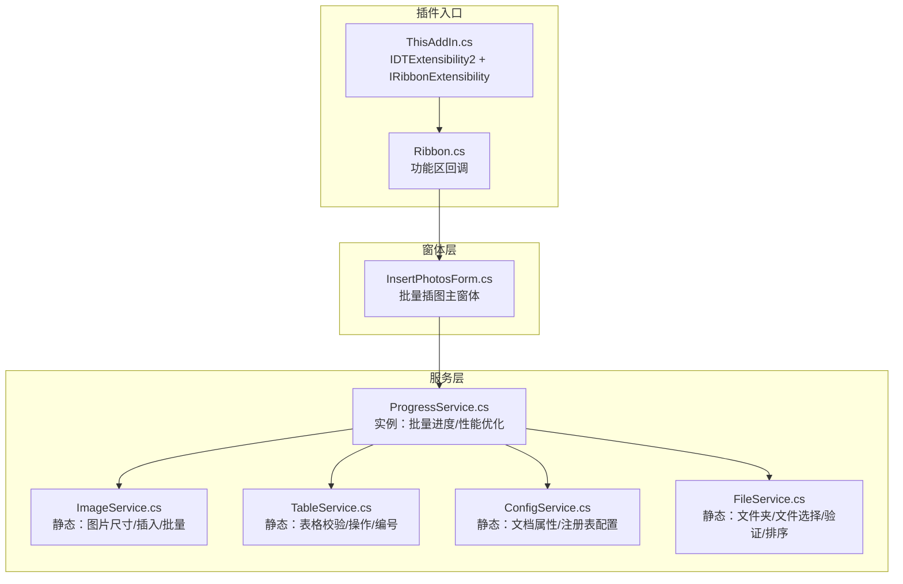
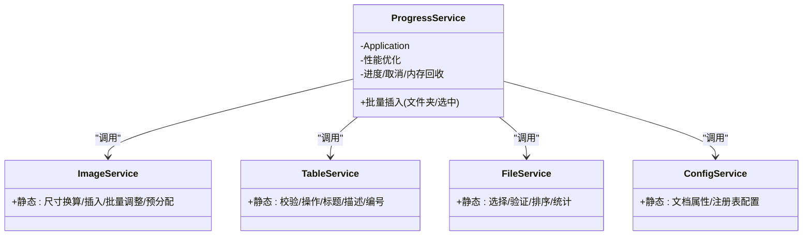
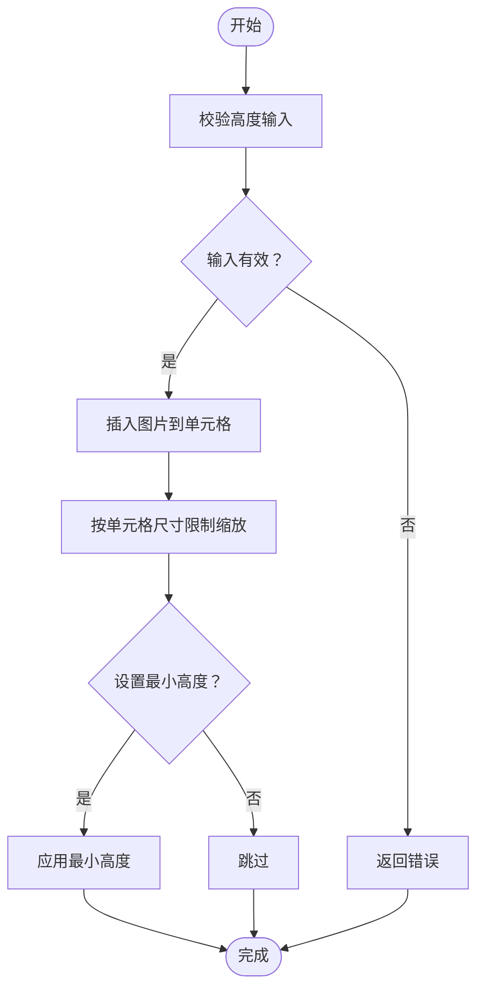
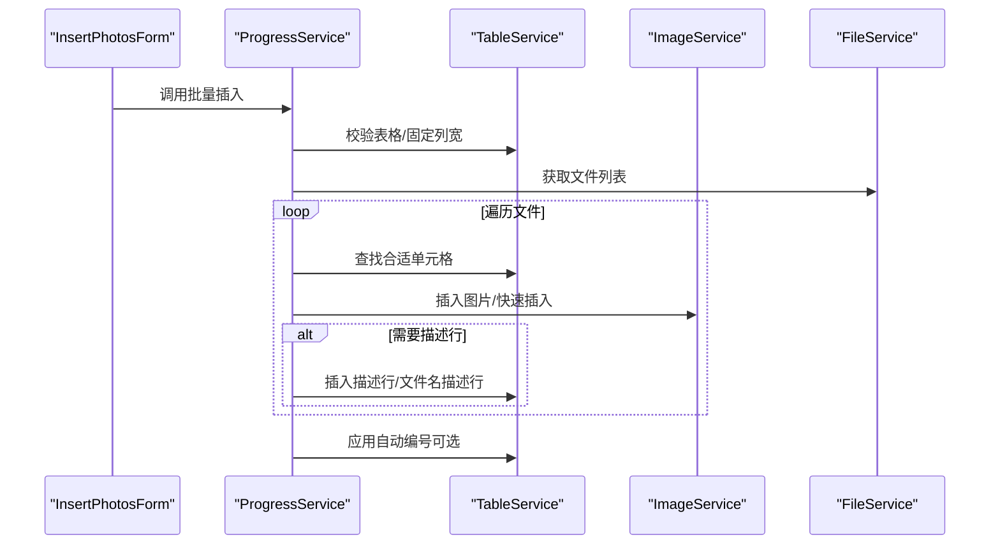
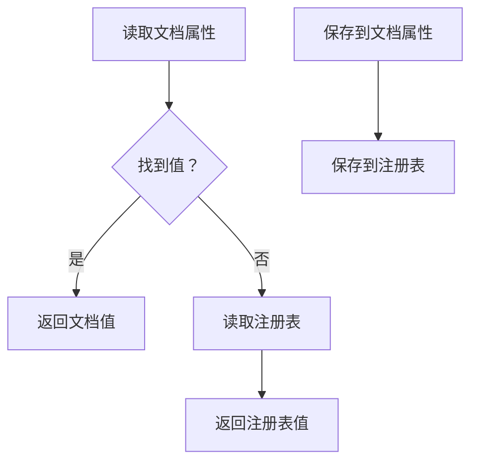
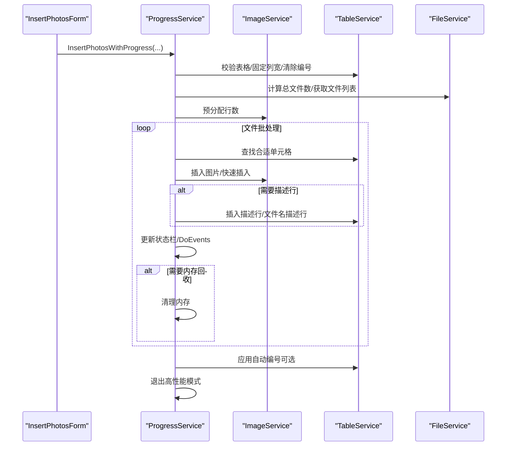
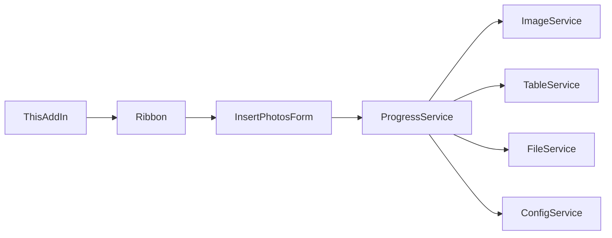

# 服务层架构

<cite>
**本文引用的文件**
- [ImageService.cs](file://WordTools/Services/ImageService.cs)
- [TableService.cs](file://WordTools/Services/TableService.cs)
- [ConfigService.cs](file://WordTools/Services/ConfigService.cs)
- [FileService.cs](file://WordTools/Services/FileService.cs)
- [ProgressService.cs](file://WordTools/Services/ProgressService.cs)
- [InsertPhotosForm.cs](file://WordTools/Forms/InsertPhotosForm.cs)
- [ThisAddIn.cs](file://WordTools/ThisAddIn.cs)
- [Ribbon.cs](file://WordTools/Ribbon.cs)
- [README.md](file://README.md)
</cite>

## 目录
1. [简介](#简介)
2. [项目结构](#项目结构)
3. [核心组件](#核心组件)
4. [架构总览](#架构总览)
5. [详细组件分析](#详细组件分析)
6. [依赖分析](#依赖分析)
7. [性能考量](#性能考量)
8. [故障排查指南](#故障排查指南)
9. [结论](#结论)
10. [附录](#附录)

## 简介
本文件系统性梳理 WordTools 插件的服务层架构，重点阐述服务层的设计模式与架构原则，包括静态工厂模式与服务组合策略；逐项说明 ImageService、TableService、ConfigService、FileService、ProgressService 的职责与接口设计；解析服务间的依赖关系与协作机制；给出服务扩展指南、生命周期与资源清理策略、测试与模拟建议，以及性能优化与最佳实践。

## 项目结构
WordTools 采用 COM 加载项（IDTExtensibility2）实现，服务层位于 WordTools/Services 目录，窗体层位于 WordTools/Forms 目录，入口与功能区位于 WordTools/ 目录。服务层通过静态类与实例类组合，形成清晰的职责边界与调用链路。

图表来源
- [ThisAddIn.cs:17-156](file://WordTools/ThisAddIn.cs#L17-L156)
- [Ribbon.cs:14-172](file://WordTools/Ribbon.cs#L14-L172)
- [InsertPhotosForm.cs:18-617](file://WordTools/Forms/InsertPhotosForm.cs#L18-L617)
- [ImageService.cs:10-324](file://WordTools/Services/ImageService.cs#L10-L324)
- [TableService.cs:11-755](file://WordTools/Services/TableService.cs#L11-L755)
- [ConfigService.cs:11-361](file://WordTools/Services/ConfigService.cs#L11-L361)
- [FileService.cs:13-309](file://WordTools/Services/FileService.cs#L13-L309)
- [ProgressService.cs:14-570](file://WordTools/Services/ProgressService.cs#L14-L570)

章节来源
- [README.md:1-85](file://README.md#L1-L85)
- [ThisAddIn.cs:17-156](file://WordTools/ThisAddIn.cs#L17-L156)
- [Ribbon.cs:14-172](file://WordTools/Ribbon.cs#L14-L172)
- [InsertPhotosForm.cs:18-617](file://WordTools/Forms/InsertPhotosForm.cs#L18-L617)

## 核心组件
- ImageService（静态工厂）：负责图片尺寸换算、图片插入与尺寸调整、批量图片尺寸重设、预分配表格行等。
- TableService（静态工厂）：负责表格校验（是否在表格、是否在首列）、单元格适配性检查、表格列宽设置、标题行/描述行创建、自动编号清理与应用。
- ConfigService（静态工厂）：负责文档自定义属性与注册表的配置读写，涵盖图片高度、文件夹路径、描述行开关、文件范围、自动编号与对齐等。
- FileService（静态工厂）：负责文件夹选择、图片文件选择、文件有效性与扩展名验证、文件/文件夹列表获取、自然排序。
- ProgressService（实例服务）：负责批量插入流程编排、进度条更新、性能优化（关闭屏幕刷新/警告弹窗/拼写/语法检查）、内存回收、取消控制（ESC键）、批量文件处理与最终编号追加。

章节来源
- [ImageService.cs:10-324](file://WordTools/Services/ImageService.cs#L10-L324)
- [TableService.cs:11-755](file://WordTools/Services/TableService.cs#L11-L755)
- [ConfigService.cs:11-361](file://WordTools/Services/ConfigService.cs#L11-L361)
- [FileService.cs:13-309](file://WordTools/Services/FileService.cs#L13-L309)
- [ProgressService.cs:14-570](file://WordTools/Services/ProgressService.cs#L14-L570)

## 架构总览
服务层采用“静态工厂 + 实例服务”的混合模式：
- 静态服务（ImageService、TableService、ConfigService、FileService）：提供纯函数式能力，无状态，便于跨模块直接调用。
- 实例服务（ProgressService）：封装复杂流程与状态，负责批量处理的生命周期、性能优化与用户体验。

图表来源
- [ImageService.cs:10-324](file://WordTools/Services/ImageService.cs#L10-L324)
- [TableService.cs:11-755](file://WordTools/Services/TableService.cs#L11-L755)
- [ConfigService.cs:11-361](file://WordTools/Services/ConfigService.cs#L11-L361)
- [FileService.cs:13-309](file://WordTools/Services/FileService.cs#L13-L309)
- [ProgressService.cs:14-570](file://WordTools/Services/ProgressService.cs#L14-L570)

## 详细组件分析

### ImageService（静态工厂）
职责与接口设计
- 尺寸换算：厘米与磅之间的双向转换，输入校验与转换。
- 图片插入：向目标单元格插入图片，锁定纵横比，按单元格尺寸限制缩放，支持最小高度约束。
- 快速插入：最小化内存占用的插入策略，仅做宽度限制与最小高度约束。
- 批量操作：批量重设图片尺寸、批量添加行、预分配表格行数，并提供状态栏更新与事件派发。

协作机制
- 与 TableService 协作：在批量插入前确保表格列数与固定列宽，查找合适单元格。
- 与 FileService 协作：配合文件列表进行批量处理。
- 与 ConfigService 协作：读取上次图片高度配置。

图表来源
- [ImageService.cs:43-134](file://WordTools/Services/ImageService.cs#L43-L134)

章节来源
- [ImageService.cs:10-324](file://WordTools/Services/ImageService.cs#L10-L324)

### TableService（静态工厂）
职责与接口设计
- 表格校验：判断当前选择是否在表格内、是否在首列。
- 单元格适配：判断单元格是否适合插入图片，必要时清除自动编号与文本。
- 表格操作：确保行存在、调整列数、设置固定列宽。
- 标题/描述行：创建标题行、插入描述行、按文件名插入描述行、填充空单元格为 N/A。
- 自动编号：清除编号、检测原对齐方式、在描述行应用编号并设置对齐。

协作机制
- 与 FileService 协作：在插入文件名描述行时使用文件名。
- 与 ImageService 协作：在批量插入后可能需要重设图片尺寸。

图表来源
- [InsertPhotosForm.cs:525-613](file://WordTools/Forms/InsertPhotosForm.cs#L525-L613)
- [ProgressService.cs:150-306](file://WordTools/Services/ProgressService.cs#L150-L306)
- [TableService.cs:18-412](file://WordTools/Services/TableService.cs#L18-L412)
- [ImageService.cs:73-180](file://WordTools/Services/ImageService.cs#L73-L180)
- [FileService.cs:117-188](file://WordTools/Services/FileService.cs#L117-L188)

章节来源
- [TableService.cs:11-755](file://WordTools/Services/TableService.cs#L11-L755)

### ConfigService（静态工厂）
职责与接口设计
- 文档属性：读取/保存自定义属性，兼容空值标记。
- 注册表：读取/保存键值，统一命名空间。
- 配置项：图片高度、文件夹路径、描述行开关、文件范围、自动编号、编号对齐。

协作机制
- 与 FileService 协作：保存/读取最后文件夹路径。
- 与 ProgressService 协作：在批量插入前后读取/保存配置。

图表来源
- [ConfigService.cs:27-94](file://WordTools/Services/ConfigService.cs#L27-L94)
- [ConfigService.cs:96-142](file://WordTools/Services/ConfigService.cs#L96-L142)
- [ConfigService.cs:144-359](file://WordTools/Services/ConfigService.cs#L144-L359)

章节来源
- [ConfigService.cs:11-361](file://WordTools/Services/ConfigService.cs#L11-L361)

### FileService（静态工厂）
职责与接口设计
- 文件夹选择：FolderBrowserDialog。
- 图片文件选择：OpenFileDialog 多选，过滤 jpg/jpeg/png。
- 文件验证：扩展名校验、文件存在性。
- 文件列表：根目录/子目录扫描、自然排序（类似资源管理器）。
- 统计：统计总图片数量。

协作机制
- 与 ConfigService 协作：保存/读取最后文件夹路径。
- 与 TableService 协作：在插入文件名描述行时使用文件名。

章节来源
- [FileService.cs:13-309](file://WordTools/Services/FileService.cs#L13-L309)

### ProgressService（实例服务）
职责与接口设计
- 生命周期：构造时接收 Application；进入/退出高性能模式；取消控制（ESC键）。
- 批量插入：从文件夹/选中文件两种入口，预分配行数，固定列宽，清除编号，批量处理文件，更新状态栏，定期内存回收。
- 性能优化：关闭屏幕刷新、禁用警告、标记拼写/语法检查已完成；根据文件数量动态调整刷新/内存清理/保存间隔。
- 结果反馈：成功/失败计数、完成消息、自动编号追加。

图表来源
- [ProgressService.cs:150-306](file://WordTools/Services/ProgressService.cs#L150-L306)
- [ProgressService.cs:412-533](file://WordTools/Services/ProgressService.cs#L412-L533)
- [ImageService.cs:216-320](file://WordTools/Services/ImageService.cs#L216-L320)
- [TableService.cs:446-559](file://WordTools/Services/TableService.cs#L446-L559)
- [FileService.cs:117-188](file://WordTools/Services/FileService.cs#L117-L188)

章节来源
- [ProgressService.cs:14-570](file://WordTools/Services/ProgressService.cs#L14-L570)

## 依赖分析
- ProgressService 是核心协调者，依赖 ImageService、TableService、FileService、ConfigService。
- InsertPhotosForm 作为 UI 入口，负责参数收集与配置保存，然后委托 ProgressService 执行。
- ThisAddIn 与 Ribbon 提供插件入口与功能区 UI，间接触发 InsertPhotosForm。

图表来源
- [InsertPhotosForm.cs:525-613](file://WordTools/Forms/InsertPhotosForm.cs#L525-L613)
- [ProgressService.cs:150-306](file://WordTools/Services/ProgressService.cs#L150-L306)
- [ThisAddIn.cs:107-150](file://WordTools/ThisAddIn.cs#L107-L150)
- [Ribbon.cs:107-124](file://WordTools/Ribbon.cs#L107-L124)

章节来源
- [InsertPhotosForm.cs:525-613](file://WordTools/Forms/InsertPhotosForm.cs#L525-L613)
- [ProgressService.cs:150-306](file://WordTools/Services/ProgressService.cs#L150-L306)
- [ThisAddIn.cs:107-150](file://WordTools/ThisAddIn.cs#L107-L150)
- [Ribbon.cs:107-124](file://WordTools/Ribbon.cs#L107-L124)

## 性能考量
- 高性能模式：在批量处理期间关闭屏幕刷新、禁用警告、标记拼写/语法检查已完成，显著降低 UI 开销。
- 动态刷新间隔：根据文件总数动态调整状态栏刷新、内存回收与保存间隔，平衡流畅度与性能。
- 内存回收：周期性触发 GC 并派发消息，避免长时间运行导致内存膨胀。
- 批量预分配：提前预估并批量添加表格行，减少频繁增删行带来的性能损耗。
- 快速插入：在无需精确尺寸校验时使用快速插入策略，减少不必要的计算。

章节来源
- [ProgressService.cs:73-142](file://WordTools/Services/ProgressService.cs#L73-L142)
- [ProgressService.cs:117-125](file://WordTools/Services/ProgressService.cs#L117-L125)
- [ImageService.cs:287-320](file://WordTools/Services/ImageService.cs#L287-L320)

## 故障排查指南
- 取消操作：按住 ESC 键触发取消，服务层会记录标志并在合适时机退出循环。
- 错误处理：服务层广泛使用 try/catch 忽略单个单元格/文件/行的错误，保证整体流程继续执行。
- 用户提示：关键步骤通过状态栏与消息框反馈进度与结果，便于定位问题。
- 配置回退：ConfigService 优先读取文档属性，若不存在则回退到注册表，避免配置丢失。

章节来源
- [ProgressService.cs:43-64](file://WordTools/Services/ProgressService.cs#L43-L64)
- [ProgressService.cs:281-285](file://WordTools/Services/ProgressService.cs#L281-L285)
- [ConfigService.cs:152-163](file://WordTools/Services/ConfigService.cs#L152-L163)

## 结论
WordTools 的服务层通过静态工厂与实例服务的组合，实现了清晰的职责分离与良好的可维护性。静态服务提供纯函数式能力，实例服务封装复杂流程与性能优化，形成稳定可靠的批量图片插入工作流。建议在扩展新服务时遵循现有模式：静态服务用于纯逻辑与数据访问，实例服务用于流程编排与状态管理。

## 附录

### 服务扩展指南
- 新增静态服务（如 LogService）：保持无状态、纯函数式接口，集中于单一职责；在需要跨模块共享时，优先考虑静态服务。
- 新增实例服务（如 ValidationService）：封装状态与流程，提供明确的生命周期方法（初始化/清理），避免与 UI 直接耦合。
- 修改现有服务：尽量保持接口不变，通过内部重构提升性能或健壮性；涉及外部依赖变更时，优先通过配置或注入策略解耦。

### 服务生命周期与资源清理
- ProgressService：构造时接收 Application，进入高性能模式；finally 中退出高性能模式并清空状态栏，确保异常场景也能恢复环境。
- 静态服务：无显式生命周期，注意避免在静态方法中持有长生命周期对象；如需缓存，应提供显式的清理入口。

章节来源
- [ProgressService.cs:33-36](file://WordTools/Services/ProgressService.cs#L33-L36)
- [ProgressService.cs:286-305](file://WordTools/Services/ProgressService.cs#L286-L305)

### 测试策略与模拟实现
- 单元测试：针对静态服务的纯函数（如尺寸换算、文件扩展名校验、自然排序）编写单元测试，覆盖正常/异常输入。
- 集成测试：通过模拟 Application/Document/Selection，驱动 ProgressService 的批量流程，验证状态栏更新、内存回收与取消逻辑。
- 模拟实现：为 COM 交互（Word Interop）提供模拟接口，隔离真实 Word 环境；对文件系统操作使用内存文件系统或临时目录。
- 回归测试：针对批量插入的大文件集、大量子目录、异常单元格等边界场景进行回归验证。

### 最佳实践
- 保持静态服务无副作用，避免在静态方法中修改全局状态。
- 在实例服务中集中处理异常与用户反馈，确保用户体验一致。
- 优先使用批量操作（如批量添加行、批量重设尺寸）减少 COM 调用次数。
- 合理设置刷新间隔与内存回收频率，兼顾性能与响应性。
- 在配置读写时优先文档属性，回退到注册表，确保配置持久化与可移植性。