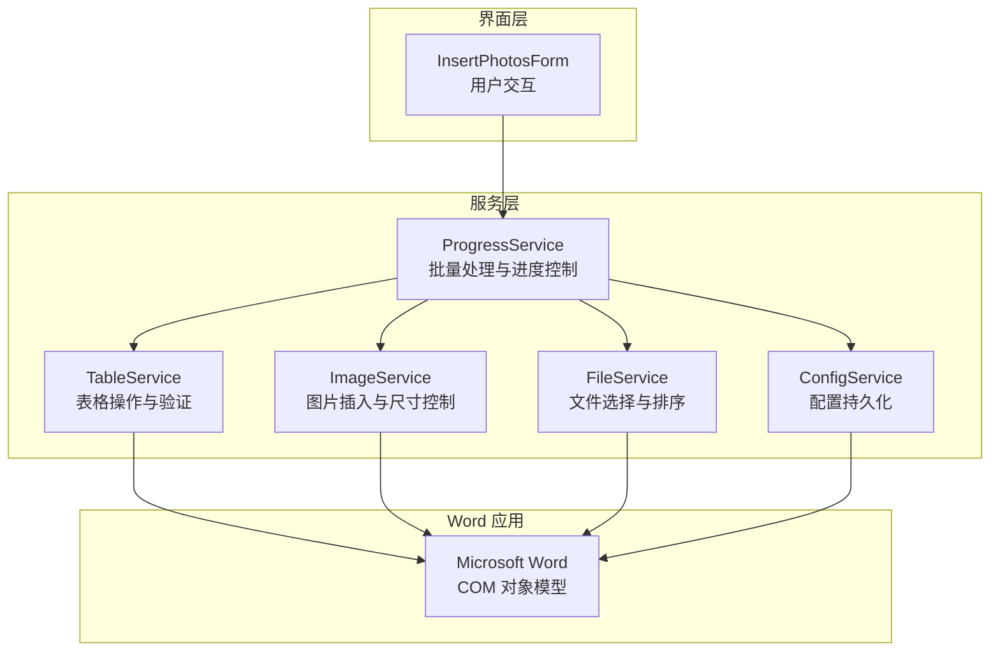
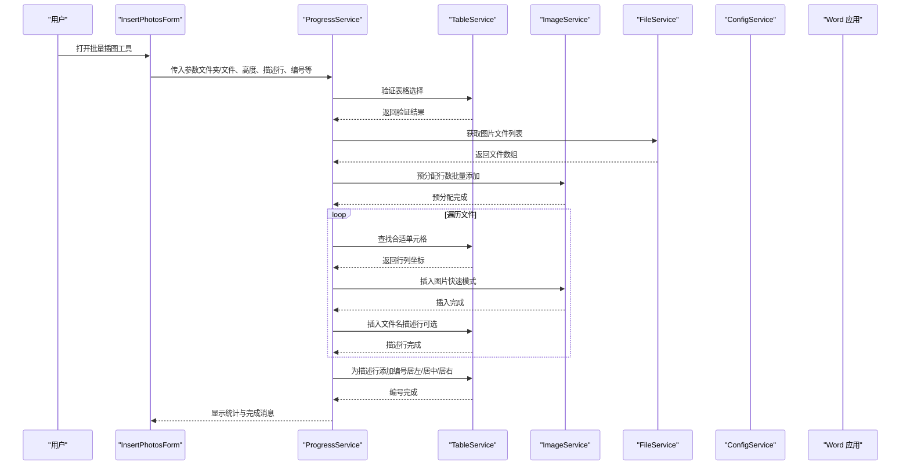
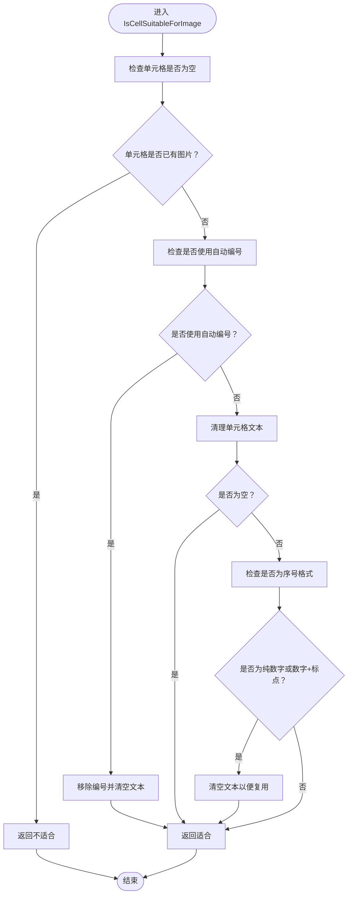
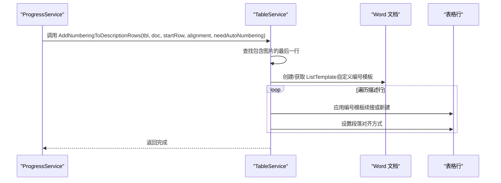
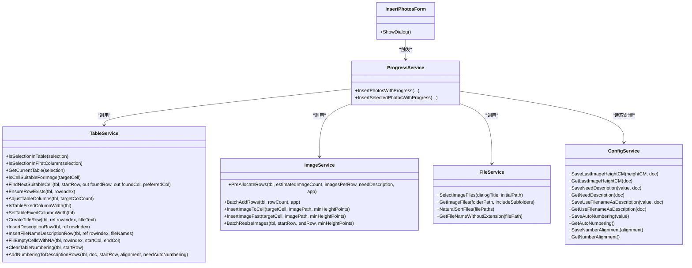

# 表格服务 (TableService)

<cite>
**本文引用的文件**
- [TableService.cs](file://WordTools/Services/TableService.cs)
- [ImageService.cs](file://WordTools/Services/ImageService.cs)
- [FileService.cs](file://WordTools/Services/FileService.cs)
- [ProgressService.cs](file://WordTools/Services/ProgressService.cs)
- [InsertPhotosForm.cs](file://WordTools/Forms/InsertPhotosForm.cs)
- [ConfigService.cs](file://WordTools/Services/ConfigService.cs)
- [README.md](file://README.md)
</cite>

## 目录
1. [简介](#简介)
2. [项目结构](#项目结构)
3. [核心组件](#核心组件)
4. [架构概览](#架构概览)
5. [详细组件分析](#详细组件分析)
6. [依赖关系分析](#依赖关系分析)
7. [性能考量](#性能考量)
8. [故障排除指南](#故障排除指南)
9. [结论](#结论)
10. [附录](#附录)

## 简介
本文件为 Word 工具箱项目中的表格服务（TableService）提供详细的 API 文档与实现解析。重点涵盖：
- 表格结构创建与初始化：行数预分配、列数设置、表格样式配置
- 自动编号系统：编号模板创建、编号应用、编号对齐与一致性维护
- 标题行与描述行管理：标题行合并、描述行插入、文件名描述行填充
- 表格验证机制：选择位置验证、单元格可用性检测、编号清理
- 表格操作流程：批量插入图片后的编号应用与格式化
- 性能优化与最佳实践：批量操作、内存回收、状态栏刷新策略

本服务基于 Microsoft Office Interop Word 实现，通过静态类封装表格相关操作，配合进度服务、图像服务与配置服务共同完成“批量插图”工作流。

## 项目结构
该项目采用分层与职责分离的设计：
- 服务层：TableService、ImageService、FileService、ConfigService、ProgressService
- 界面层：InsertPhotosForm（用户交互与参数收集）
- 插件入口：ThisAddIn（加载项入口）

图表来源
- [InsertPhotosForm.cs:1-200](file://WordTools/Forms/InsertPhotosForm.cs#L1-L200)
- [ProgressService.cs:148-306](file://WordTools/Services/ProgressService.cs#L148-L306)
- [TableService.cs:11-756](file://WordTools/Services/TableService.cs#L11-L756)
- [ImageService.cs:10-325](file://WordTools/Services/ImageService.cs#L10-L325)
- [FileService.cs:13-310](file://WordTools/Services/FileService.cs#L13-L310)
- [ConfigService.cs:11-362](file://WordTools/Services/ConfigService.cs#L11-L362)

章节来源
- [README.md:1-85](file://README.md#L1-L85)

## 核心组件
- 表格验证：判断当前选择是否在表格内、是否在首列、获取当前表格对象；检查单元格是否适合插入图片（无图片、无自动编号、空或可识别的序号文本）。
- 表格操作：确保行存在、调整列数、固定列宽、允许自动适应。
- 标题行与描述行：创建标题行（合并单元格、居中对齐）、插入描述行、插入文件名描述行（居中对齐、垂直居中）。
- 自动编号：清除编号（保留原对齐方式）、为描述行添加编号（自定义列表模板、阿拉伯数字、起始编号1、续接上一编号段）、设置编号对齐。
- 辅助方法：清理单元格文本（去除空白与不可见字符）。

章节来源
- [TableService.cs:18-123](file://WordTools/Services/TableService.cs#L18-L123)
- [TableService.cs:205-295](file://WordTools/Services/TableService.cs#L205-L295)
- [TableService.cs:304-434](file://WordTools/Services/TableService.cs#L304-L434)
- [TableService.cs:446-737](file://WordTools/Services/TableService.cs#L446-L737)
- [TableService.cs:746-751](file://WordTools/Services/TableService.cs#L746-L751)

## 架构概览
批量插图流程由界面层触发，进度服务协调执行，表格服务负责表格结构与编号，图像服务负责图片插入与尺寸控制，文件服务负责文件选择与排序，配置服务负责参数持久化。

图表来源
- [InsertPhotosForm.cs:1-200](file://WordTools/Forms/InsertPhotosForm.cs#L1-L200)
- [ProgressService.cs:148-306](file://WordTools/Services/ProgressService.cs#L148-L306)
- [TableService.cs:18-123](file://WordTools/Services/TableService.cs#L18-L123)
- [ImageService.cs:287-320](file://WordTools/Services/ImageService.cs#L287-L320)

## 详细组件分析

### 表格验证
- IsSelectionInTable：判断当前选择是否位于表格内。
- IsSelectionInFirstColumn：判断当前选择是否位于首列。
- GetCurrentTable：获取当前表格对象。
- IsCellSuitableForImage：检查目标单元格是否适合插入图片（无图片、无自动编号、空或可识别的序号文本）。若检测到序号，尝试清除并返回可复用状态。
- FindNextSuitableCell：在指定范围内查找下一个适合插入图片的单元格（优先列可配置），最多搜索若干行。

图表来源
- [TableService.cs:45-123](file://WordTools/Services/TableService.cs#L45-L123)

章节来源
- [TableService.cs:18-123](file://WordTools/Services/TableService.cs#L18-L123)

### 表格操作
- EnsureRowExists：确保指定行存在，不足时逐行添加，并保证至少两列。
- AdjustTableColumns：调整列数至目标数量，多则删、少则加。
- IsTableFixedColumnWidth/SetTableFixedColumnWidth：检测与设置表格为固定列宽（禁用自动适应）。

章节来源
- [TableService.cs:205-295](file://WordTools/Services/TableService.cs#L205-L295)

### 标题行与描述行
- CreateTitleRow：在指定行创建标题行（合并两列、居中对齐），若当前行非空则先插入新行。
- InsertDescriptionRow：确保行存在并保持两列。
- InsertFileNameDescriptionRow：在指定行插入文件名描述（居中对齐、垂直居中），单文件时第二列留空。
- FillEmptyCellsWithNA：将指定范围内的空单元格填充为“N/A”，并设置居中对齐与垂直居中。

章节来源
- [TableService.cs:304-434](file://WordTools/Services/TableService.cs#L304-L434)

### 自动编号系统
- ClearTableNumbering：清除表格编号，记录原始对齐方式（1=靠左、2=居中、3=居右），并清理编号行的文本或纯数字文本。
- AddNumberingToDescriptionRows：为描述行添加自动编号，逻辑如下：
  - 找到包含图片的最后一行，确定编号范围。
  - 查找之前的编号模板以实现续接；若无则创建新的自定义列表模板（阿拉伯数字、起始编号1、制表符结尾）。
  - 对描述行应用编号模板（续接或新建），并设置段落对齐方式（1=靠左、2=居中、3=居右）。

图表来源
- [TableService.cs:564-737](file://WordTools/Services/TableService.cs#L564-L737)
- [ProgressService.cs:387-398](file://WordTools/Services/ProgressService.cs#L387-L398)

章节来源
- [TableService.cs:446-737](file://WordTools/Services/TableService.cs#L446-L737)
- [ProgressService.cs:387-398](file://WordTools/Services/ProgressService.cs#L387-L398)

### 表格初始化与预分配
- 预分配行数：根据预计图片数量与每行图片数估算所需行数，必要时翻倍（描述行场景），限制最大预分配行数，然后批量添加行。
- 列数设置：确保表格至少两列，便于图片与描述行布局。
- 固定列宽：在批量插入前设置为固定列宽，避免频繁自动调整导致性能下降。

章节来源
- [ImageService.cs:287-320](file://WordTools/Services/ImageService.cs#L287-L320)
- [TableService.cs:222-224](file://WordTools/Services/TableService.cs#L222-L224)
- [TableService.cs:284-295](file://WordTools/Services/TableService.cs#L284-L295)

### 数据清理与一致性
- CleanCellText：统一清理单元格文本，去除换行、制表符、不可见空格并 Trim。
- ClearTableNumbering：在清除编号时区分两种情况：
  - 行本身具有列表编号：直接清空单元格文本。
  - 纯文本序号（如“1.”、“2)”）：识别后清空，避免误删有用内容。

章节来源
- [TableService.cs:746-751](file://WordTools/Services/TableService.cs#L746-L751)
- [TableService.cs:496-540](file://WordTools/Services/TableService.cs#L496-L540)

## 依赖关系分析
- TableService 依赖 Microsoft.Office.Interop.Word 的 Selection、Table、Row、Cell、Range、InlineShape、ListTemplate、ListLevels 等类型。
- ProgressService 调用 TableService 与 ImageService 完成批量流程，同时负责高性能模式与进度刷新。
- InsertPhotosForm 提供用户界面，收集参数并通过 ProgressService 触发批量处理。
- ConfigService 保存与读取用户配置（如是否需要描述行、是否自动编号、编号对齐等）。
- FileService 提供文件选择与自然排序，确保插入顺序稳定。

图表来源
- [TableService.cs:11-756](file://WordTools/Services/TableService.cs#L11-L756)
- [ImageService.cs:10-325](file://WordTools/Services/ImageService.cs#L10-L325)
- [FileService.cs:13-310](file://WordTools/Services/FileService.cs#L13-L310)
- [ConfigService.cs:11-362](file://WordTools/Services/ConfigService.cs#L11-L362)
- [ProgressService.cs:148-306](file://WordTools/Services/ProgressService.cs#L148-L306)
- [InsertPhotosForm.cs:1-200](file://WordTools/Forms/InsertPhotosForm.cs#L1-L200)

## 性能考量
- 批量预分配：通过 ImageService 的预分配与批量添加行减少多次 COM 调用带来的开销。
- 批量插入图片：ImageService 的快速插入模式仅检查宽度限制，避免不必要的高度计算。
- 固定列宽：设置表格为固定列宽，减少自动调整列宽的开销。
- 进程间通信优化：在批量处理中合理设置刷新间隔与内存回收频率，避免频繁 UI 更新造成阻塞。
- 错误容忍：大量 try/catch 包裹关键操作，确保单个单元格或行的异常不影响整体流程。

章节来源
- [ImageService.cs:287-320](file://WordTools/Services/ImageService.cs#L287-L320)
- [ImageService.cs:142-180](file://WordTools/Services/ImageService.cs#L142-L180)
- [TableService.cs:284-295](file://WordTools/Services/TableService.cs#L284-L295)
- [ProgressService.cs:131-142](file://WordTools/Services/ProgressService.cs#L131-L142)

## 故障排除指南
- 无法在表格中插入图片
  - 检查单元格是否已有图片或处于自动编号状态。若是，先调用清理函数清除编号并清空文本。
  - 使用 IsCellSuitableForImage 验证单元格是否适合插入。
- 编号错乱或重复
  - 使用 ClearTableNumbering 清除旧编号并记录原始对齐方式，再重新应用编号。
  - AddNumberingToDescriptionRows 会查找之前的编号模板以实现续接，避免断号。
- 表格列宽异常
  - 确认表格为固定列宽（SetTableFixedColumnWidth），并在批量插入前设置。
- 性能问题
  - 启用预分配与批量添加行，避免逐行插入导致的频繁 COM 调用。
  - 在进度服务中合理设置刷新间隔与内存回收频率。

章节来源
- [TableService.cs:45-123](file://WordTools/Services/TableService.cs#L45-L123)
- [TableService.cs:446-559](file://WordTools/Services/TableService.cs#L446-L559)
- [TableService.cs:564-737](file://WordTools/Services/TableService.cs#L564-L737)
- [ImageService.cs:287-320](file://WordTools/Services/ImageService.cs#L287-L320)
- [ProgressService.cs:131-142](file://WordTools/Services/ProgressService.cs#L131-L142)

## 结论
TableService 提供了完整的表格管理能力，覆盖结构创建、验证、标题与描述行管理以及自动编号系统。结合 ImageService 的预分配与快速插入、ProgressService 的批量处理与性能优化，以及 ConfigService 的参数持久化，形成了高效的“批量插图”工作流。遵循本文的最佳实践与故障排除建议，可在复杂文档中稳定地维护表格结构与编号一致性。

## 附录

### API 参考（方法清单与用途）
- 表格验证
  - IsSelectionInTable：判断当前选择是否在表格中
  - IsSelectionInFirstColumn：判断当前选择是否在首列
  - GetCurrentTable：获取当前表格对象
  - IsCellSuitableForImage：检查单元格是否适合插入图片
  - FindNextSuitableCell：查找下一个适合插入图片的单元格
- 表格操作
  - EnsureRowExists：确保行存在
  - AdjustTableColumns：调整列数
  - IsTableFixedColumnWidth：检测是否固定列宽
  - SetTableFixedColumnWidth：设置固定列宽
- 标题行与描述行
  - CreateTitleRow：创建标题行
  - InsertDescriptionRow：插入描述行
  - InsertFileNameDescriptionRow：插入文件名描述行
  - FillEmptyCellsWithNA：填充空单元格为 N/A
- 自动编号
  - ClearTableNumbering：清除编号并记录对齐方式
  - AddNumberingToDescriptionRows：为描述行添加编号
- 辅助方法
  - CleanCellText：清理单元格文本

章节来源
- [TableService.cs:18-123](file://WordTools/Services/TableService.cs#L18-L123)
- [TableService.cs:205-295](file://WordTools/Services/TableService.cs#L205-L295)
- [TableService.cs:304-434](file://WordTools/Services/TableService.cs#L304-L434)
- [TableService.cs:446-737](file://WordTools/Services/TableService.cs#L446-L737)
- [TableService.cs:746-751](file://WordTools/Services/TableService.cs#L746-L751)