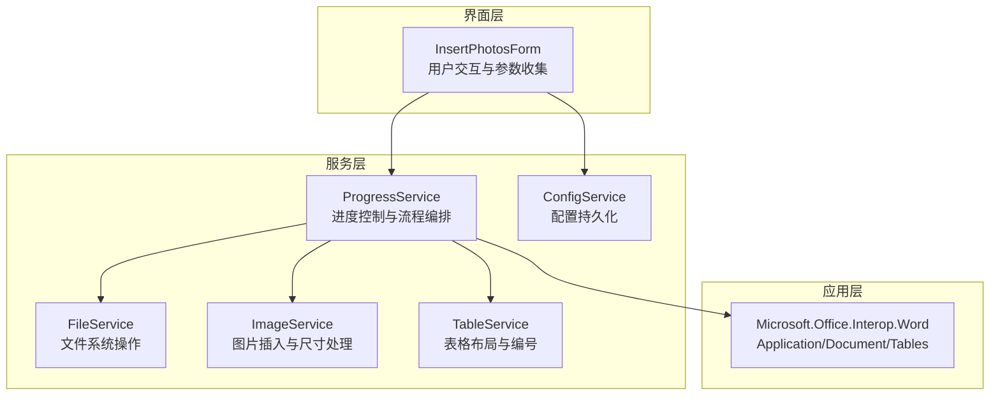
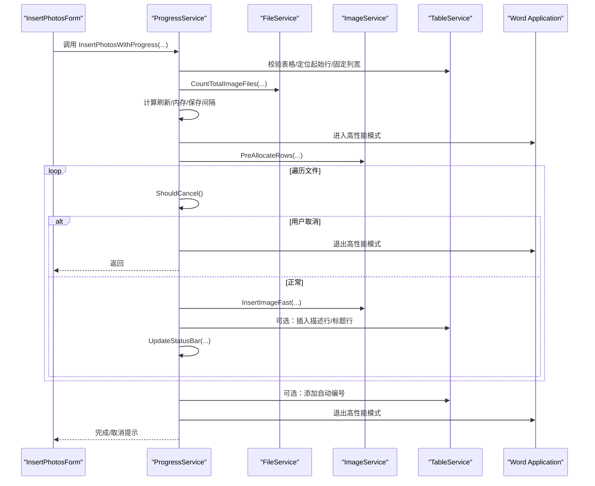
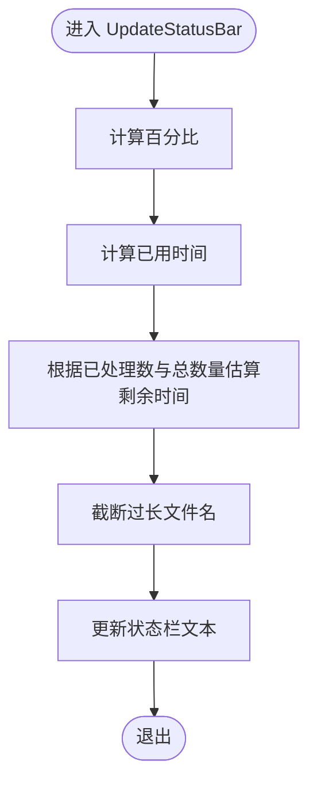
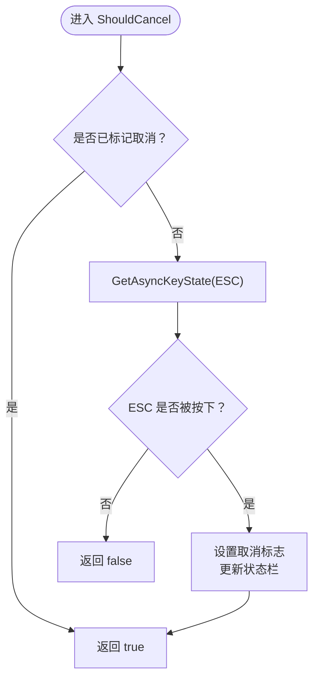
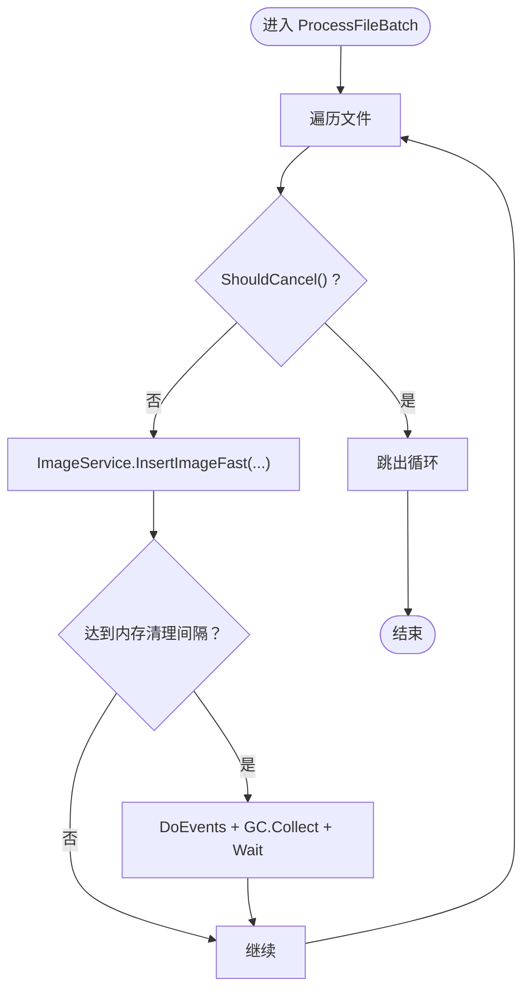
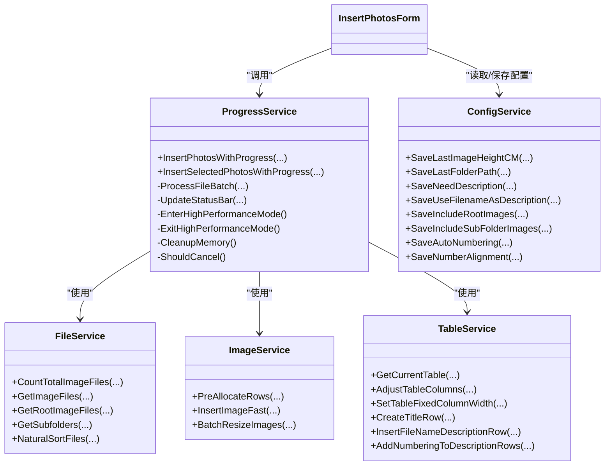

# 进度服务 (ProgressService)

<cite>
**本文引用的文件**
- [ProgressService.cs](file://WordTools/Services/ProgressService.cs)
- [FileService.cs](file://WordTools/Services/FileService.cs)
- [ImageService.cs](file://WordTools/Services/ImageService.cs)
- [TableService.cs](file://WordTools/Services/TableService.cs)
- [ConfigService.cs](file://WordTools/Services/ConfigService.cs)
- [InsertPhotosForm.cs](file://WordTools/Forms/InsertPhotosForm.cs)
- [README.md](file://README.md)
</cite>

## 目录
1. [简介](#简介)
2. [项目结构](#项目结构)
3. [核心组件](#核心组件)
4. [架构概览](#架构概览)
5. [详细组件分析](#详细组件分析)
6. [依赖关系分析](#依赖关系分析)
7. [性能考量](#性能考量)
8. [故障排除指南](#故障排除指南)
9. [结论](#结论)
10. [附录](#附录)

## 简介
本文件为 ProgressService 的详细 API 文档，聚焦于进度控制与性能优化的核心能力，涵盖：
- 进度显示机制：实时百分比、已用时间、剩余时间、当前文件名截断显示
- 用户取消支持：ESC 键检测、取消标志、中断点检查、资源清理
- 内存管理策略：定期垃圾回收、批量预分配、高性能模式开关
- 性能监控与优化：刷新频率自适应、内存清理周期、保存间隔、Word 应用程序状态优化
- 错误处理与异常恢复：模块化 try-catch、finally 资源回收、容错设计

## 项目结构
该项目为 Word COM 加载项，核心功能围绕“批量插入图片到表格”展开，ProgressService 作为协调者，调用 FileService、ImageService、TableService 完成文件扫描、图片插入、表格布局与自动编号等任务。

图表来源
- [InsertPhotosForm.cs:525-561](file://WordTools/Forms/InsertPhotosForm.cs#L525-L561)
- [ProgressService.cs:151-306](file://WordTools/Services/ProgressService.cs#L151-L306)
- [FileService.cs:117-188](file://WordTools/Services/FileService.cs#L117-L188)
- [ImageService.cs:142-180](file://WordTools/Services/ImageService.cs#L142-L180)
- [TableService.cs:36-40](file://WordTools/Services/TableService.cs#L36-L40)

章节来源
- [README.md:1-85](file://README.md#L1-L85)
- [InsertPhotosForm.cs:525-613](file://WordTools/Forms/InsertPhotosForm.cs#L525-L613)

## 核心组件
- ProgressService：进度控制与性能优化的中枢，负责：
  - 进入/退出高性能模式（关闭屏幕更新、禁用警告）
  - 计算刷新间隔、内存清理间隔、保存间隔
  - 实时更新状态栏进度信息
  - 处理文件夹/选中文件两种批量插入流程
  - 用户取消检测与资源清理
- FileService：文件系统操作，提供文件计数、排序、路径解析等
- ImageService：图片插入与尺寸处理，支持快速插入与批量调整
- TableService：表格布局、标题行/描述行、自动编号、单元格适配
- ConfigService：配置持久化（文档自定义属性 + 注册表）
- InsertPhotosForm：UI 参数收集与调用 ProgressService

章节来源
- [ProgressService.cs:14-36](file://WordTools/Services/ProgressService.cs#L14-L36)
- [FileService.cs:13-134](file://WordTools/Services/FileService.cs#L13-L134)
- [ImageService.cs:10-180](file://WordTools/Services/ImageService.cs#L10-L180)
- [TableService.cs:11-756](file://WordTools/Services/TableService.cs#L11-L756)
- [ConfigService.cs:11-361](file://WordTools/Services/ConfigService.cs#L11-L361)
- [InsertPhotosForm.cs:525-613](file://WordTools/Forms/InsertPhotosForm.cs#L525-L613)

## 架构概览
ProgressService 的工作流分为两类：文件夹批量插入与选中文件批量插入。两者共享相同的进度更新、取消检测、内存管理与性能优化策略。

图表来源
- [ProgressService.cs:151-306](file://WordTools/Services/ProgressService.cs#L151-L306)
- [ProgressService.cs:412-533](file://WordTools/Services/ProgressService.cs#L412-L533)
- [ImageService.cs:287-320](file://WordTools/Services/ImageService.cs#L287-L320)
- [TableService.cs:36-40](file://WordTools/Services/TableService.cs#L36-L40)

## 详细组件分析

### 进度显示机制
- 实时百分比：基于已处理数量与总数计算
- 时间统计：记录开始时间，计算已用秒数与剩余秒数
- 当前文件名：对超长文件名进行截断显示，避免状态栏溢出
- 刷新策略：按优化间隔刷新，减少 UI 线程压力

图表来源
- [ProgressService.cs:542-566](file://WordTools/Services/ProgressService.cs#L542-L566)

章节来源
- [ProgressService.cs:542-566](file://WordTools/Services/ProgressService.cs#L542-L566)

### 用户取消支持
- ESC 键检测：通过 Windows API 异步按键状态查询
- 取消标志：首次检测到 ESC 后设置内部标志，后续循环快速返回
- 中断点检查：在每个文件处理循环、子文件夹遍历处检查取消
- 资源清理：finally 中统一退出高性能模式、清空状态栏

图表来源
- [ProgressService.cs:51-64](file://WordTools/Services/ProgressService.cs#L51-L64)

章节来源
- [ProgressService.cs:43-64](file://WordTools/Services/ProgressService.cs#L43-L64)

### 内存管理策略
- 定期垃圾回收：按内存清理间隔触发 GC.Collect 与 WaitForPendingFinalizers
- 应用事件派发：Application.DoEvents 保证 UI 响应
- 批量预分配：根据预计图片数量预分配表格行，减少动态扩容
- 高性能模式：关闭屏幕更新与警告，降低 Word UI 开销

图表来源
- [ProgressService.cs:412-533](file://WordTools/Services/ProgressService.cs#L412-L533)
- [ImageService.cs:287-320](file://WordTools/Services/ImageService.cs#L287-L320)

章节来源
- [ProgressService.cs:129-142](file://WordTools/Services/ProgressService.cs#L129-L142)
- [ProgressService.cs:208-210](file://WordTools/Services/ProgressService.cs#L208-L210)
- [ImageService.cs:287-320](file://WordTools/Services/ImageService.cs#L287-L320)

### 性能监控与优化
- 刷新间隔自适应：根据总文件数选择不同刷新频率，平衡 UI 响应与 CPU 占用
- 保存间隔：刷新间隔的倍数，控制状态栏更新频率
- 内存清理间隔：刷新间隔的倍数，控制 GC 触发频率
- Word 应用程序优化：关闭屏幕更新、禁用警告、预设拼写/语法检查状态

章节来源
- [ProgressService.cs:117-125](file://WordTools/Services/ProgressService.cs#L117-L125)
- [ProgressService.cs:208-210](file://WordTools/Services/ProgressService.cs#L208-L210)
- [ProgressService.cs:73-112](file://WordTools/Services/ProgressService.cs#L73-L112)

### 错误处理与异常恢复
- 模块化异常捕获：文件处理循环内捕获单个文件异常，避免中断整体流程
- 全局异常处理：主流程 try-catch 捕获未知异常并提示
- 资源回收：finally 统一退出高性能模式、清空状态栏、可选添加自动编号
- 容错设计：大量 try-catch 忽略错误，确保插件稳定性

章节来源
- [ProgressService.cs:164-286](file://WordTools/Services/ProgressService.cs#L164-L286)
- [ProgressService.cs:287-306](file://WordTools/Services/ProgressService.cs#L287-L306)
- [ProgressService.cs:498-501](file://WordTools/Services/ProgressService.cs#L498-L501)

### API 方法详解

#### 批量插入（文件夹）
- 方法：InsertPhotosWithProgress
- 输入参数：文件夹路径、最小高度（磅）、是否需要描述行、是否使用文件名作为描述、是否包含根目录/子目录图片、是否自动编号、编号对齐方式
- 行为：
  - 校验表格与光标位置
  - 计算总文件数并提示
  - 自适应刷新/内存/保存间隔
  - 进入高性能模式
  - 预分配表格行
  - 处理根目录与子目录图片
  - 更新状态栏与完成提示
  - 可选：自动编号
  - 退出高性能模式

章节来源
- [ProgressService.cs:151-306](file://WordTools/Services/ProgressService.cs#L151-L306)

#### 批量插入（选中文件）
- 方法：InsertSelectedPhotosWithProgress
- 输入参数：文件路径数组、最小高度（磅）、是否需要描述行、是否使用文件名作为描述、是否自动编号、编号对齐方式
- 行为：与文件夹版本基本一致，但直接使用传入的文件数组

章节来源
- [ProgressService.cs:315-403](file://WordTools/Services/ProgressService.cs#L315-L403)

#### 文件批量处理
- 方法：ProcessFileBatch
- 行为：逐文件处理，按刷新间隔更新状态栏；按内存清理间隔触发 GC；按行/列规则插入图片与描述行；处理最后一行与空单元格填充

章节来源
- [ProgressService.cs:412-533](file://WordTools/Services/ProgressService.cs#L412-L533)

#### 状态栏更新
- 方法：UpdateStatusBar
- 行为：计算百分比、已用时间、剩余时间，截断文件名，更新状态栏文本

章节来源
- [ProgressService.cs:542-566](file://WordTools/Services/ProgressService.cs#L542-L566)

### 进度跟踪算法
- 任务进度计算：百分比 = 已处理数 / 总数 × 100
- 时间估算：已用时间 = 当前时间 - 开始时间
- 剩余时间预测：剩余秒数 = 已用时间 / 已处理数 × (总数 - 已处理数)，当已处理数为 0 时返回 0

章节来源
- [ProgressService.cs:547-553](file://WordTools/Services/ProgressService.cs#L547-L553)

### 用户取消机制
- 取消信号处理：ESC 键异步检测，首次按下设置取消标志
- 中断点检查：在文件循环、子文件夹遍历处检查 ShouldCancel
- 资源清理：finally 中退出高性能模式、清空状态栏

章节来源
- [ProgressService.cs:43-64](file://WordTools/Services/ProgressService.cs#L43-L64)
- [ProgressService.cs:262-269](file://WordTools/Services/ProgressService.cs#L262-L269)
- [ProgressService.cs:302-304](file://WordTools/Services/ProgressService.cs#L302-L304)

### 内存管理策略
- 大文件处理：通过预分配表格行减少动态扩容；按需触发 GC
- 垃圾回收优化：定期触发 GC.Collect 与 WaitForPendingFinalizers
- 资源释放：退出高性能模式、清空状态栏、忽略异常

章节来源
- [ImageService.cs:287-320](file://WordTools/Services/ImageService.cs#L287-L320)
- [ProgressService.cs:129-142](file://WordTools/Services/ProgressService.cs#L129-L142)
- [ProgressService.cs:302-304](file://WordTools/Services/ProgressService.cs#L302-L304)

### 性能监控与优化建议
- 刷新频率自适应：根据文件数量动态调整刷新间隔，平衡 UI 响应与 CPU 占用
- 内存清理策略：按刷新间隔的倍数触发 GC，避免频繁 GC 导致卡顿
- Word 应用程序优化：关闭屏幕更新与警告，减少 UI 开销
- 建议：对于超大文件集，可适当增大保存间隔，减少状态栏更新频率

章节来源
- [ProgressService.cs:117-125](file://WordTools/Services/ProgressService.cs#L117-L125)
- [ProgressService.cs:208-210](file://WordTools/Services/ProgressService.cs#L208-L210)
- [ProgressService.cs:73-112](file://WordTools/Services/ProgressService.cs#L73-L112)

### 错误处理与异常恢复机制
- 单文件异常捕获：在文件处理循环内捕获异常并增加失败计数
- 全局异常处理：主流程 try-catch 捕获未知异常并提示
- 资源回收：finally 统一退出高性能模式、清空状态栏、可选添加自动编号
- 容错设计：大量 try-catch 忽略错误，确保插件稳定性

章节来源
- [ProgressService.cs:164-286](file://WordTools/Services/ProgressService.cs#L164-L286)
- [ProgressService.cs:287-306](file://WordTools/Services/ProgressService.cs#L287-L306)
- [ProgressService.cs:498-501](file://WordTools/Services/ProgressService.cs#L498-L501)

## 依赖关系分析
- ProgressService 依赖：
  - FileService：文件计数、排序、路径解析
  - ImageService：图片插入、尺寸调整、批量预分配
  - TableService：表格校验、布局、标题/描述行、自动编号
  - Microsoft.Office.Interop.Word：Application/Document/Tables/Selection
- UI 层通过 InsertPhotosForm 调用 ProgressService，并由 ConfigService 提供配置持久化

图表来源
- [ProgressService.cs:151-403](file://WordTools/Services/ProgressService.cs#L151-L403)
- [FileService.cs:117-188](file://WordTools/Services/FileService.cs#L117-L188)
- [ImageService.cs:287-320](file://WordTools/Services/ImageService.cs#L287-L320)
- [TableService.cs:36-737](file://WordTools/Services/TableService.cs#L36-L737)
- [ConfigService.cs:149-357](file://WordTools/Services/ConfigService.cs#L149-L357)
- [InsertPhotosForm.cs:557-606](file://WordTools/Forms/InsertPhotosForm.cs#L557-L606)

章节来源
- [ProgressService.cs:151-403](file://WordTools/Services/ProgressService.cs#L151-L403)
- [FileService.cs:117-188](file://WordTools/Services/FileService.cs#L117-L188)
- [ImageService.cs:287-320](file://WordTools/Services/ImageService.cs#L287-L320)
- [TableService.cs:36-737](file://WordTools/Services/TableService.cs#L36-L737)
- [ConfigService.cs:149-357](file://WordTools/Services/ConfigService.cs#L149-L357)
- [InsertPhotosForm.cs:557-606](file://WordTools/Forms/InsertPhotosForm.cs#L557-L606)

## 性能考量
- 刷新频率自适应：根据文件数量选择不同的刷新间隔，避免 UI 卡顿
- 内存清理策略：定期触发 GC，结合 Application.DoEvents 保持 UI 响应
- Word 应用程序优化：关闭屏幕更新与警告，减少 UI 开销
- 批量预分配：减少动态扩容带来的性能损耗
- 建议：对于超大文件集，可适当增大保存间隔，减少状态栏更新频率

## 故障排除指南
- 插入过程中无法取消：确认 ESC 键未被其他程序占用，确保在处理循环中执行 ShouldCancel 检查
- 进度不更新：检查刷新间隔设置与 Application.DoEvents 是否正常执行
- 内存占用过高：确认内存清理间隔设置合理，必要时减小刷新间隔以提高 GC 频率
- 表格布局异常：检查表格是否处于第一列、是否已固定列宽，确保插入描述行逻辑正确

章节来源
- [ProgressService.cs:43-64](file://WordTools/Services/ProgressService.cs#L43-L64)
- [ProgressService.cs:542-566](file://WordTools/Services/ProgressService.cs#L542-L566)
- [ProgressService.cs:129-142](file://WordTools/Services/ProgressService.cs#L129-L142)
- [TableService.cs:268-295](file://WordTools/Services/TableService.cs#L268-L295)

## 结论
ProgressService 通过合理的进度显示、用户取消支持、内存管理与性能优化策略，实现了在 Word 中高效批量插入图片的能力。其模块化的架构与完善的异常处理机制，确保了在大规模数据处理场景下的稳定性与用户体验。

## 附录

### API 方法摘要
- InsertPhotosWithProgress(folderPath, minHeight, needDescription, useFileNameAsDescription, includeRootImages, includeSubFolderImages, needAutoNumbering, numberAlignment)
- InsertSelectedPhotosWithProgress(files, minHeight, needDescription, useFileNameAsDescription, needAutoNumbering, numberAlignment)

章节来源
- [ProgressService.cs:151-306](file://WordTools/Services/ProgressService.cs#L151-L306)
- [ProgressService.cs:315-403](file://WordTools/Services/ProgressService.cs#L315-L403)