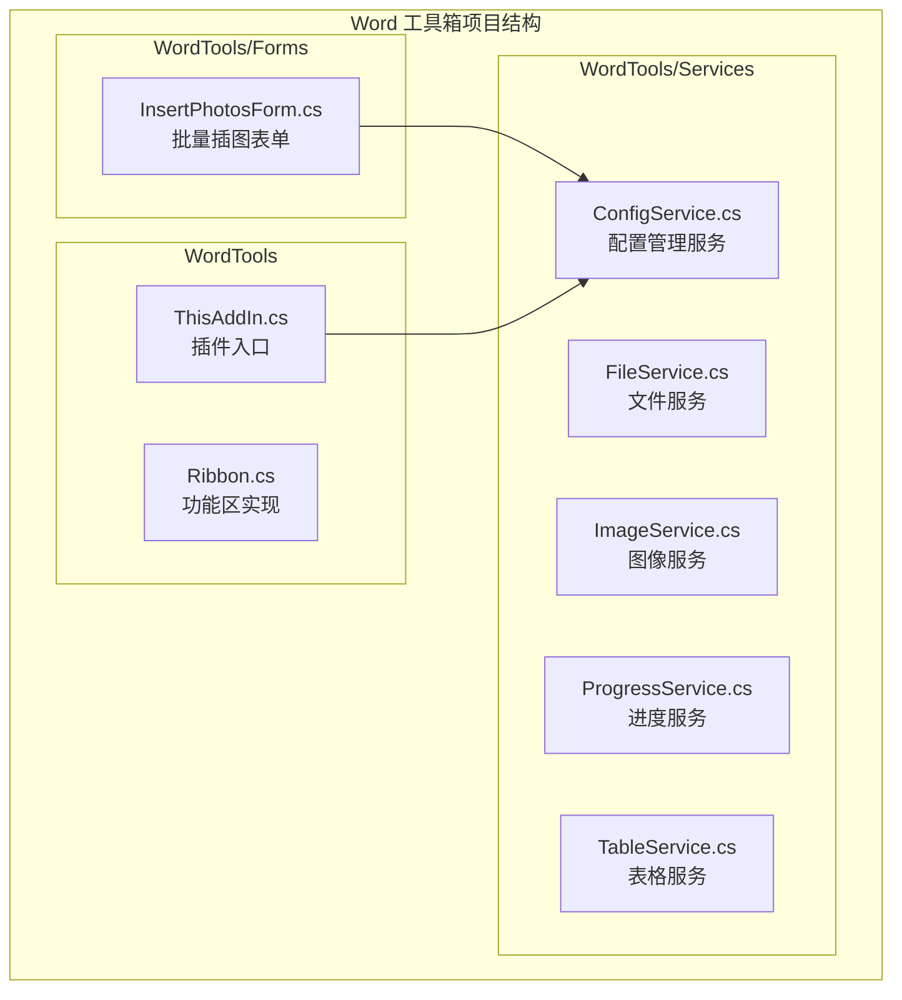
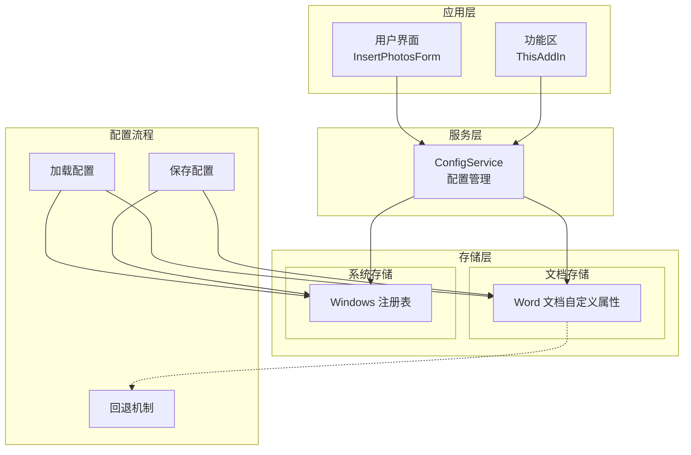
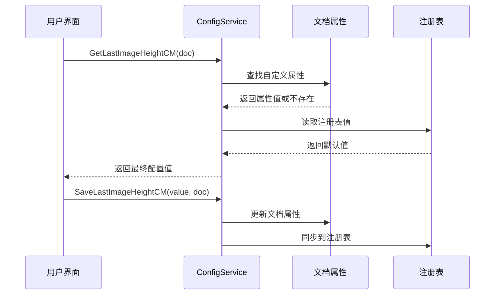
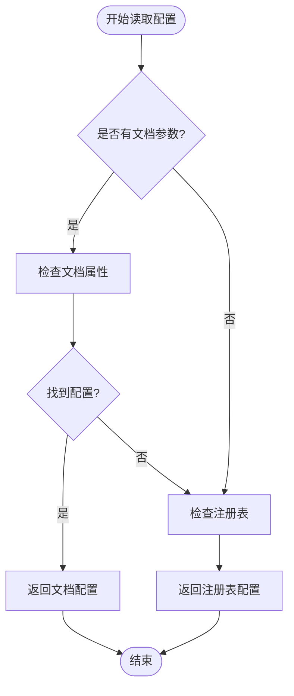
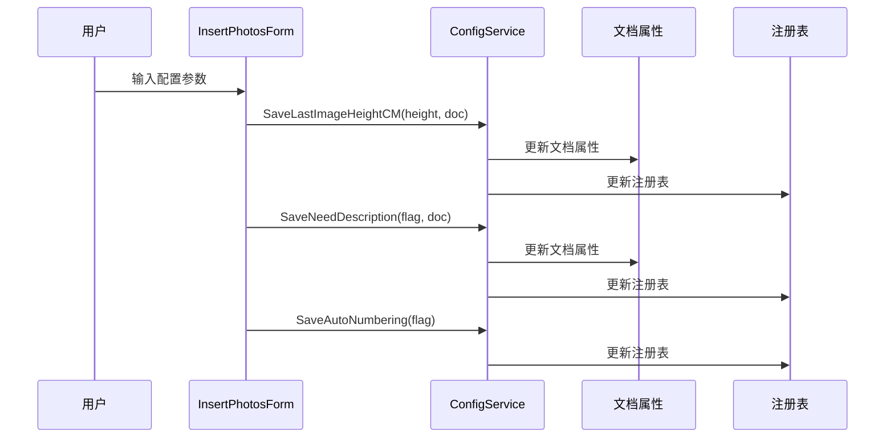
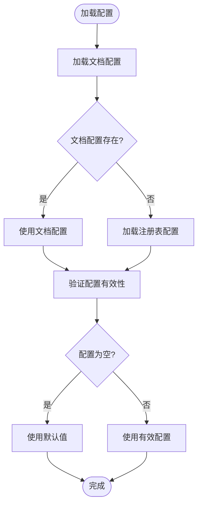
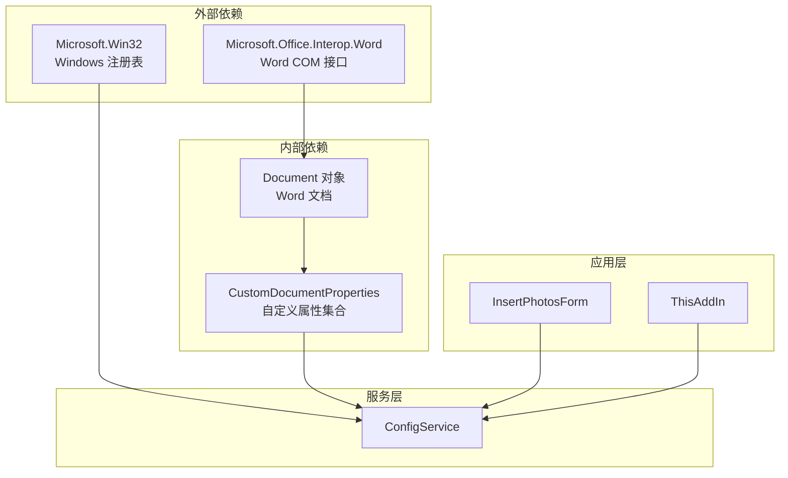

# 配置服务 (ConfigService)

<cite>
**本文档引用的文件**
- [ConfigService.cs](file://WordTools/Services/ConfigService.cs)
- [InsertPhotosForm.cs](file://WordTools/Forms/InsertPhotosForm.cs)
- [README.md](file://README.md)
- [ThisAddIn.cs](file://WordTools/ThisAddIn.cs)
</cite>

## 目录
1. [简介](#简介)
2. [项目结构](#项目结构)
3. [核心组件](#核心组件)
4. [架构概览](#架构概览)
5. [详细组件分析](#详细组件分析)
6. [依赖关系分析](#依赖关系分析)
7. [性能考虑](#性能考虑)
8. [故障排除指南](#故障排除指南)
9. [结论](#结论)

## 简介

ConfigService 是 Word 工具箱插件中的核心配置管理服务，负责管理文档自定义属性和应用程序设置的持久化存储。该服务提供了统一的配置访问接口，支持多种配置存储策略，包括文档级配置存储、注册表配置备份以及用户偏好设置持久化。

该服务主要服务于批量图片插入功能，通过配置管理优化用户体验，记住用户的常用设置，如图片高度、文件夹路径、描述行配置等。所有配置操作都经过精心设计，确保在 Word COM 环境中的稳定性和可靠性。

## 项目结构

Word 工具箱项目采用清晰的分层架构，ConfigService 位于服务层，为上层功能提供配置支持。

**图表来源**
- [ConfigService.cs:1-362](file://WordTools/Services/ConfigService.cs#L1-L362)
- [InsertPhotosForm.cs:1-618](file://WordTools/Forms/InsertPhotosForm.cs#L1-L618)
- [ThisAddIn.cs:1-157](file://WordTools/ThisAddIn.cs#L1-L157)

**章节来源**
- [README.md:47-61](file://README.md#L47-L61)
- [ConfigService.cs:1-362](file://ConfigService.cs#L1-L362)

## 核心组件

ConfigService 提供了完整的配置管理解决方案，包含以下核心功能模块：

### 配置存储策略

服务采用了多层存储策略，确保配置的可靠性和可用性：

1. **文档级存储**：使用 Word 文档的自定义属性存储文档特定的配置
2. **注册表存储**：使用 Windows 注册表存储应用程序级别的配置
3. **回退机制**：当文档存储不可用时，自动回退到注册表存储

### 配置键值管理

服务定义了完整的配置键值常量，涵盖以下配置类别：

- **图片配置**：图片高度、文件夹路径
- **描述行配置**：是否需要描述行、是否使用文件名作为描述
- **文件范围配置**：是否包含根目录图片、是否包含子目录图片
- **自动编号配置**：是否启用自动编号、编号对齐方式

**章节来源**
- [ConfigService.cs:13-24](file://WordTools/Services/ConfigService.cs#L13-L24)
- [ConfigService.cs:144-359](file://WordTools/Services/ConfigService.cs#L144-L359)

## 架构概览

ConfigService 采用静态类设计，提供全局访问的配置管理功能。整个架构围绕三个核心层次构建：

**图表来源**
- [ConfigService.cs:11-362](file://WordTools/Services/ConfigService.cs#L11-L362)
- [InsertPhotosForm.cs:415-482](file://WordTools/Forms/InsertPhotosForm.cs#L415-L482)
- [ThisAddIn.cs:107-110](file://WordTools/ThisAddIn.cs#L107-L110)

## 详细组件分析

### 配置存储策略详解

ConfigService 实现了智能的配置存储策略，确保配置数据的可靠性和一致性：

#### 文档级配置存储

文档级配置存储使用 Word 文档的自定义属性功能，为每个文档提供独立的配置空间：

**图表来源**
- [ConfigService.cs:28-92](file://WordTools/Services/ConfigService.cs#L28-L92)
- [ConfigService.cs:149-178](file://WordTools/Services/ConfigService.cs#L149-L178)

#### 注册表备份机制

注册表存储作为系统级配置的备份，确保在文档无法访问时配置仍然可用：

| 配置类型 | 存储位置 | 默认值 | 备注 |
|---------|---------|--------|------|
| 图片高度 | 文档属性 + 注册表 | 空字符串 | 支持空值标记 |
| 文件夹路径 | 文档属性 + 注册表 | 空字符串 | 用户上次选择的路径 |
| 描述行设置 | 文档属性 + 注册表 | False | 是否需要描述行 |
| 文件名描述 | 文档属性 + 注册表 | False | 是否使用文件名作为描述 |
| 根目录包含 | 文档属性 + 注册表 | True | 默认包含根目录图片 |
| 子目录包含 | 文档属性 + 注册表 | True | 默认包含子目录图片 |
| 自动编号 | 注册表 | False | 应用程序级别设置 |
| 编号对齐 | 注册表 | 2 (居中) | 1=靠左, 2=居中 |

**章节来源**
- [ConfigService.cs:96-142](file://WordTools/Services/ConfigService.cs#L96-L142)
- [ConfigService.cs:211-359](file://WordTools/Services/ConfigService.cs#L211-L359)

### 配置读取和写入方法

ConfigService 提供了统一的配置访问接口，支持默认值处理、配置验证和错误恢复：

#### 配置读取流程

**图表来源**
- [ConfigService.cs:149-178](file://WordTools/Services/ConfigService.cs#L149-L178)
- [ConfigService.cs:187-195](file://WordTools/Services/ConfigService.cs#L187-L195)

#### 配置写入策略

配置写入采用同步策略，确保文档属性和注册表保持一致：

| 方法 | 写入目标 | 特殊处理 | 错误处理 |
|------|---------|----------|----------|
| SaveLastImageHeightCM | 文档属性 + 注册表 | 空值转换为特殊标记 | 忽略保存异常 |
| SaveLastFolderPath | 文档属性 + 注册表 | 直接保存 | 忽略保存异常 |
| SaveNeedDescription | 文档属性 + 注册表 | 布尔值转换为字符串 | 忽略保存异常 |
| SaveAutoNumbering | 注册表 | 布尔值转换为字符串 | 忽略保存异常 |
| SaveNumberAlignment | 注册表 | 数值直接保存 | 忽略保存异常 |

**章节来源**
- [ConfigService.cs:169-178](file://WordTools/Services/ConfigService.cs#L169-L178)
- [ConfigService.cs:200-207](file://WordTools/Services/ConfigService.cs#L200-L207)
- [ConfigService.cs:227-235](file://WordTools/Services/ConfigService.cs#L227-L235)

### 配置验证和错误恢复

ConfigService 实现了完善的配置验证和错误恢复机制：

#### 默认值处理

- **布尔配置**：默认值为 `false`，除非明确指定
- **整数配置**：编号对齐默认值为 `2`（居中）
- **字符串配置**：默认值为空字符串

#### 错误恢复策略

- **文档属性访问失败**：自动回退到注册表读取
- **注册表访问失败**：使用预设的默认值
- **配置格式错误**：使用默认值替换无效配置

**章节来源**
- [ConfigService.cs:273-274](file://WordTools/Services/ConfigService.cs#L273-L274)
- [ConfigService.cs:342-349](file://WordTools/Services/ConfigService.cs#L342-L349)

### 具体使用示例

#### 保存用户设置

在批量插图功能中，用户设置的保存流程如下：

**图表来源**
- [InsertPhotosForm.cs:461-482](file://WordTools/Forms/InsertPhotosForm.cs#L461-L482)
- [ConfigService.cs:169-178](file://WordTools/Services/ConfigService.cs#L169-L178)

#### 加载配置数据

配置加载时的优先级处理：

**图表来源**
- [InsertPhotosForm.cs:415-459](file://WordTools/Forms/InsertPhotosForm.cs#L415-L459)
- [ConfigService.cs:149-164](file://WordTools/Services/ConfigService.cs#L149-L164)

**章节来源**
- [InsertPhotosForm.cs:415-482](file://WordTools/Forms/InsertPhotosForm.cs#L415-L482)
- [InsertPhotosForm.cs:509-523](file://WordTools/Forms/InsertPhotosForm.cs#L509-L523)

## 依赖关系分析

ConfigService 与其他组件的依赖关系体现了清晰的分层架构：

**图表来源**
- [ConfigService.cs:1-4](file://WordTools/Services/ConfigService.cs#L1-L4)
- [InsertPhotosForm.cs:1-10](file://WordTools/Forms/InsertPhotosForm.cs#L1-L10)
- [ThisAddIn.cs:1-10](file://WordTools/ThisAddIn.cs#L1-L10)

### 组件耦合度分析

ConfigService 与外部组件的耦合度控制良好：

- **Word COM 依赖**：仅用于文档自定义属性操作
- **注册表依赖**：仅用于应用程序级配置存储
- **内部依赖**：通过接口抽象，便于测试和维护

**章节来源**
- [ConfigService.cs:1-4](file://WordTools/Services/ConfigService.cs#L1-L4)
- [InsertPhotosForm.cs:1-10](file://WordTools/Forms/InsertPhotosForm.cs#L1-L10)

## 性能考虑

ConfigService 在设计时充分考虑了性能优化：

### 缓存策略

- **即时读取**：每次读取都进行实时访问，确保配置的最新性
- **批量写入**：支持一次性保存多个配置项，减少存储操作次数

### 错误处理优化

- **异常隔离**：所有存储操作都在 try-catch 块中执行
- **快速失败**：遇到错误时立即回退到默认值，不影响用户体验

### 内存管理

- **静态类设计**：避免实例化开销
- **轻量级对象**：不持有大型对象引用

## 故障排除指南

### 常见问题及解决方案

#### 配置读取失败

**症状**：配置总是使用默认值
**可能原因**：
- 文档自定义属性访问权限不足
- 注册表访问被系统策略限制
- Word COM 对象初始化失败

**解决步骤**：
1. 检查 Word 文档是否处于只读状态
2. 确认注册表路径 `Software\WordTools` 是否可访问
3. 验证 Word COM 组件是否正确注册

#### 配置保存失败

**症状**：用户设置无法持久化
**可能原因**：
- 权限不足导致注册表写入失败
- Word 文档自定义属性超出数量限制
- 磁盘空间不足

**解决步骤**：
1. 以管理员权限运行 Word
2. 检查磁盘空间
3. 清理不必要的文档自定义属性

#### 配置冲突处理

当文档配置与全局配置冲突时，系统遵循以下优先级：

1. **文档特定配置**：优先使用文档级配置
2. **用户偏好设置**：次优使用应用程序级配置
3. **系统默认值**：最后使用内置默认值

**章节来源**
- [ConfigService.cs:31-54](file://WordTools/Services/ConfigService.cs#L31-L54)
- [ConfigService.cs:101-119](file://WordTools/Services/ConfigService.cs#L101-L119)

## 结论

ConfigService 为 Word 工具箱提供了强大而可靠的配置管理能力。通过多层存储策略、智能回退机制和完善的错误处理，确保了配置数据的完整性和可用性。

该服务的设计体现了以下关键优势：

- **灵活性**：支持文档级和应用程序级配置分离
- **可靠性**：多重存储策略确保配置不会丢失
- **易用性**：统一的 API 接口简化了配置操作
- **性能**：最小化的存储开销和快速的访问速度

对于未来的扩展，建议考虑以下改进方向：

- **配置版本管理**：实现配置版本跟踪和自动迁移
- **加密存储**：为敏感配置提供加密保护
- **配置同步**：支持多设备间配置同步
- **配置模板**：提供预设配置模板功能

通过持续优化和扩展，ConfigService 将能够更好地满足复杂应用场景下的配置管理需求。