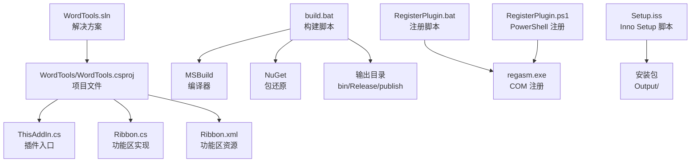
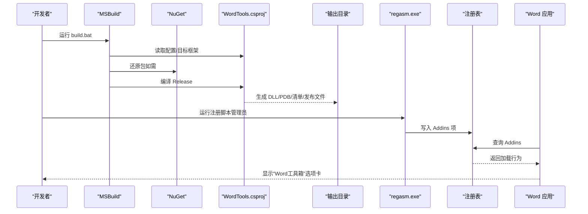
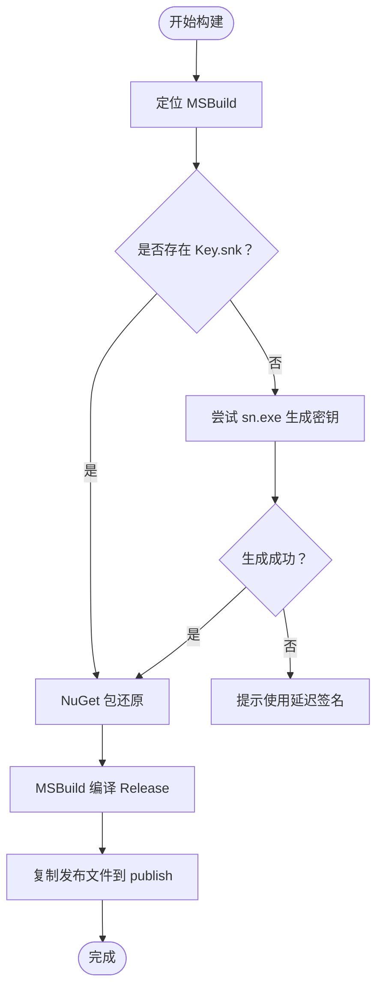
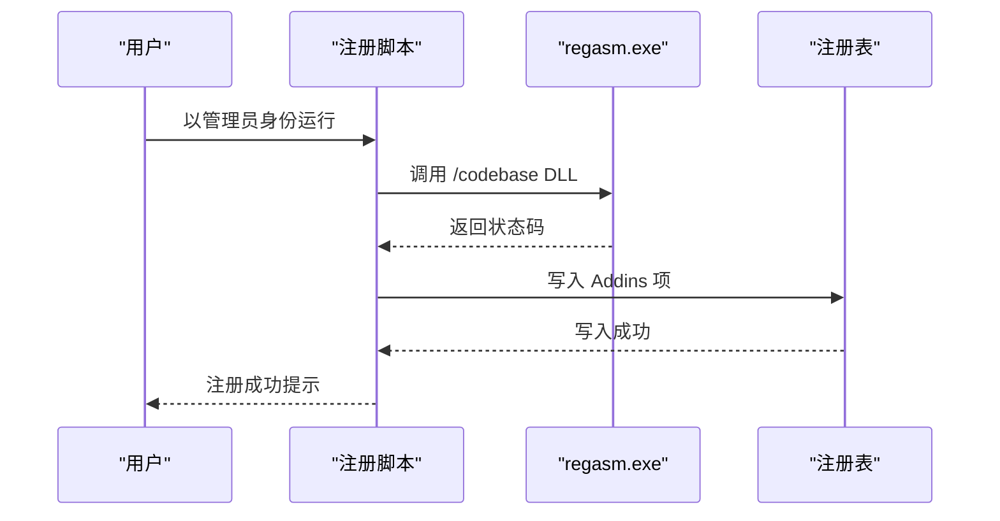
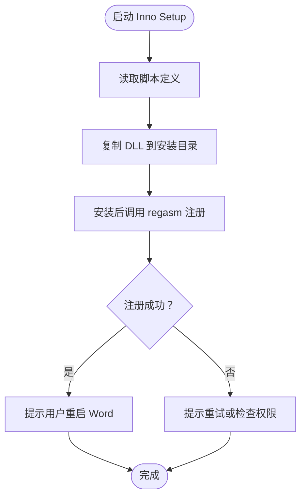
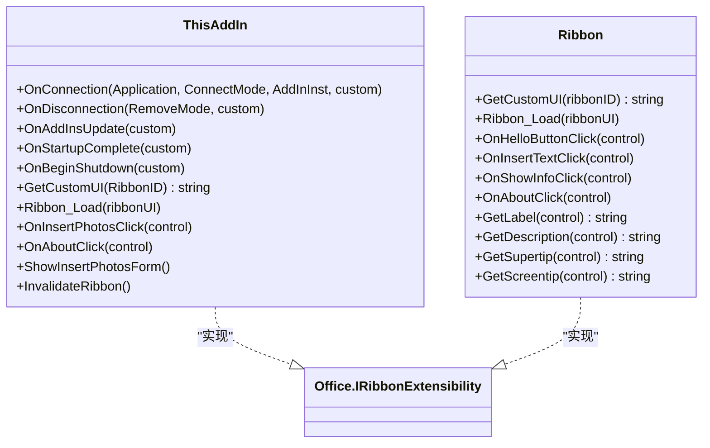
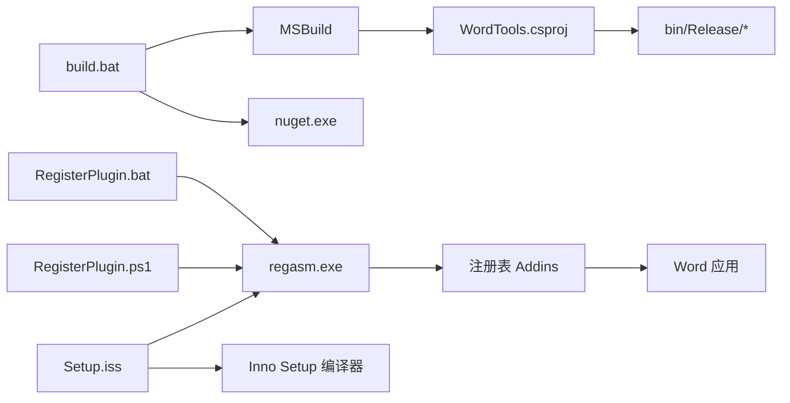

# 构建与部署

<cite>
**本文引用的文件**
- [WordTools.sln](file://WordTools.sln)
- [build.bat](file://build.bat)
- [RegisterPlugin.bat](file://RegisterPlugin.bat)
- [RegisterPlugin.ps1](file://RegisterPlugin.ps1)
- [Setup.iss](file://Setup.iss)
- [README.md](file://README.md)
- [WordTools/WordTools.csproj](file://WordTools/WordTools.csproj)
- [WordTools/ThisAddIn.cs](file://WordTools/ThisAddIn.cs)
- [WordTools/Ribbon.cs](file://WordTools/Ribbon.cs)
</cite>

## 目录
1. [简介](#简介)
2. [项目结构](#项目结构)
3. [核心组件](#核心组件)
4. [架构总览](#架构总览)
5. [详细组件分析](#详细组件分析)
6. [依赖关系分析](#依赖关系分析)
7. [性能考虑](#性能考虑)
8. [故障排查指南](#故障排查指南)
9. [结论](#结论)
10. [附录](#附录)

## 简介
本指南面向 WordTools 的构建与部署，覆盖 MSBuild 配置、依赖项管理、输出配置、构建脚本工作原理与自定义选项；解释插件注册机制（regasm 命令与 PowerShell 脚本优势）；说明安装程序制作（Inno Setup 配置与定制）；提供版本管理、回滚策略、升级处理等部署最佳实践；并给出自动化部署脚本与 CI/CD 集成建议及不同环境下的部署差异与注意事项。

## 项目结构
仓库采用“顶层解决方案 + 插件项目”的组织方式，关键文件如下：
- 解决方案：WordTools.sln
- 构建脚本：build.bat
- 插件注册（批处理）：RegisterPlugin.bat
- 插件注册（PowerShell）：RegisterPlugin.ps1
- 安装脚本：Setup.iss
- 项目文件：WordTools/WordTools.csproj
- 插件入口与功能区：WordTools/ThisAddIn.cs、WordTools/Ribbon.cs
- 说明文档：README.md

图表来源
- [WordTools.sln:1-19](file://WordTools.sln#L1-L19)
- [build.bat:1-125](file://build.bat#L1-L125)
- [RegisterPlugin.bat:1-80](file://RegisterPlugin.bat#L1-L80)
- [RegisterPlugin.ps1:1-87](file://RegisterPlugin.ps1#L1-L87)
- [Setup.iss:1-83](file://Setup.iss#L1-L83)
- [WordTools/WordTools.csproj:1-145](file://WordTools/WordTools.csproj#L1-L145)
- [WordTools/ThisAddIn.cs:1-157](file://WordTools/ThisAddIn.cs#L1-L157)
- [WordTools/Ribbon.cs:1-173](file://WordTools/Ribbon.cs#L1-L173)

章节来源
- [WordTools.sln:1-19](file://WordTools.sln#L1-L19)
- [README.md:47-60](file://README.md#L47-L60)

## 核心组件
- 解决方案与配置平台
  - 解决方案定义了 Debug/Release 与 Any CPU 平台组合，供 MSBuild 使用。
- 项目文件（CSProj）
  - 目标框架为 .NET Framework 4.8，配置 Debug/Release 输出路径与优化策略。
  - 引入 Office/Word PIA 与 VS Tools for Office 运行时依赖，设置嵌入/共享互操作类型。
  - 启用自动绑定重定向，禁用 COM 互操作注册，通过外部脚本进行 COM 注册。
- 构建脚本（build.bat）
  - 自动定位 MSBuild，生成强名称密钥（若缺失），执行 NuGet 包还原，构建 Release 配置，复制发布产物至 publish 目录。
- 插件注册脚本（批处理与 PowerShell）
  - 以管理员权限运行，使用 regasm 注册 COM 组件，并向注册表写入 Word Addins 项。
- 安装脚本（Inno Setup）
  - 定义应用元数据、语言、文件、注册表项、安装后/卸载前动作（调用 regasm 注册/反注册）。

章节来源
- [WordTools.sln:8-16](file://WordTools.sln#L8-L16)
- [WordTools/WordTools.csproj:32-49](file://WordTools/WordTools.csproj#L32-L49)
- [WordTools/WordTools.csproj:63-88](file://WordTools/WordTools.csproj#L63-L88)
- [build.bat:8-109](file://build.bat#L8-L109)
- [RegisterPlugin.bat:8-62](file://RegisterPlugin.bat#L8-L62)
- [RegisterPlugin.ps1:11-70](file://RegisterPlugin.ps1#L11-L70)
- [Setup.iss:4-49](file://Setup.iss#L4-L49)

## 架构总览
WordTools 采用 COM 加载项模式（IDTExtensibility2），通过功能区扩展（IRibbonExtensibility）提供 UI。构建与部署链路如下：

图表来源
- [build.bat:86-109](file://build.bat#L86-L109)
- [RegisterPlugin.bat:38-62](file://RegisterPlugin.bat#L38-L62)
- [RegisterPlugin.ps1:43-70](file://RegisterPlugin.ps1#L43-L70)
- [Setup.iss:43-49](file://Setup.iss#L43-L49)
- [WordTools/ThisAddIn.cs:37-61](file://WordTools/ThisAddIn.cs#L37-L61)

## 详细组件分析

### MSBuild 与构建配置
- 目标框架与平台
  - 目标框架为 .NET Framework 4.8，平台为 Any CPU；Release 配置启用优化与最小化日志。
- 引用与互操作
  - 引入 Office/Word PIA 与 VS Tools for Office 运行时，设置 EmbedInteropTypes 与 Private 属性，避免捆绑私有副本。
- 自动化与输出
  - AfterBuild 目标输出注册命令提示；build.bat 复制发布产物至 publish 目录。
- 强名称与签名
  - build.bat 尝试生成 Key.snk（通过 sn.exe），若失败则提示使用延迟签名（VS 项目可自动生成）。

图表来源
- [build.bat:8-109](file://build.bat#L8-L109)
- [WordTools/WordTools.csproj:141-143](file://WordTools/WordTools.csproj#L141-L143)

章节来源
- [WordTools/WordTools.csproj:32-49](file://WordTools/WordTools.csproj#L32-L49)
- [WordTools/WordTools.csproj:63-88](file://WordTools/WordTools.csproj#L63-L88)
- [build.bat:8-109](file://build.bat#L8-L109)

### 插件注册机制（regasm 与 PowerShell）
- 批处理注册
  - 以管理员权限运行，定位 regasm.exe 与 DLL 路径，执行 /codebase 注册，并向 HKCU\Software\Microsoft\Office\Word\Addins\ 写入友好名、描述、LoadBehavior、CommandLineSafe 等键值。
- PowerShell 注册
  - 同样要求管理员权限，使用 PowerShell API 调用 regasm，写入相同注册表项，提供更友好的交互与错误处理。
- 两种方式对比
  - 批处理：简单直接，适合一次性任务；PowerShell：具备更好的错误处理与用户提示，便于集成自动化流程。

图表来源
- [RegisterPlugin.bat:38-62](file://RegisterPlugin.bat#L38-L62)
- [RegisterPlugin.ps1:43-70](file://RegisterPlugin.ps1#L43-L70)

章节来源
- [RegisterPlugin.bat:8-62](file://RegisterPlugin.bat#L8-L62)
- [RegisterPlugin.ps1:11-70](file://RegisterPlugin.ps1#L11-L70)

### 安装程序制作（Inno Setup）
- 应用元数据与输出
  - 定义应用名称、版本、发布者、默认安装目录、输出目录与文件名；要求管理员权限。
- 文件与注册表
  - 将 WordTools.dll 复制到安装目录；安装后通过 [Run] 节点调用 regasm 注册；卸载前通过 [UninstallRun] 节点反注册。
- 用户体验
  - 安装完成后弹出提示，指导用户关闭并重启 Word 以启用插件；卸载前后分别提示。

图表来源
- [Setup.iss:4-49](file://Setup.iss#L4-L49)
- [Setup.iss:51-82](file://Setup.iss#L51-L82)

章节来源
- [Setup.iss:4-49](file://Setup.iss#L4-L49)
- [Setup.iss:51-82](file://Setup.iss#L51-L82)

### 插件入口与功能区（ThisAddIn/Ribbon）
- ThisAddIn
  - 实现 IDTExtensibility2 与 IRibbonExtensibility，负责连接 Word 应用、加载自定义 UI、暴露 Ribbon 回调（如批量插图、关于）。
- Ribbon
  - 通过资源文件加载 Ribbon XML，提供按钮回调与 UI 文案（标签、描述、屏幕提示等）。

图表来源
- [WordTools/ThisAddIn.cs:17-154](file://WordTools/ThisAddIn.cs#L17-L154)
- [WordTools/Ribbon.cs:14-171](file://WordTools/Ribbon.cs#L14-L171)

章节来源
- [WordTools/ThisAddIn.cs:37-154](file://WordTools/ThisAddIn.cs#L37-L154)
- [WordTools/Ribbon.cs:24-171](file://WordTools/Ribbon.cs#L24-L171)

## 依赖关系分析
- 构建阶段
  - build.bat 依赖 MSBuild、sn.exe（可选）、nuget.exe；生成 Key.snk（可选）；复制发布文件。
- 运行阶段
  - 插件依赖 .NET Framework 4.8 与 Office/Word PIA；注册阶段依赖 regasm.exe 与注册表写入权限。
- 安装阶段
  - Setup.iss 依赖 Inno Setup 编译器；安装后调用 regasm.exe 完成 COM 注册。

图表来源
- [build.bat:8-109](file://build.bat#L8-L109)
- [RegisterPlugin.bat:17-62](file://RegisterPlugin.bat#L17-L62)
- [RegisterPlugin.ps1:20-70](file://RegisterPlugin.ps1#L20-L70)
- [Setup.iss:43-49](file://Setup.iss#L43-L49)

章节来源
- [build.bat:8-109](file://build.bat#L8-L109)
- [RegisterPlugin.bat:17-62](file://RegisterPlugin.bat#L17-L62)
- [RegisterPlugin.ps1:20-70](file://RegisterPlugin.ps1#L20-L70)
- [Setup.iss:43-49](file://Setup.iss#L43-L49)

## 性能考虑
- 构建性能
  - Release 配置启用优化与 PDB-only 调试信息，减少体积与加载时间。
  - 自动绑定重定向减少运行时装配问题，提升稳定性。
- 运行性能
  - 功能区回调尽量避免阻塞 UI 线程；对 Word 对象访问应谨慎，必要时捕获异常。
- 安装性能
  - Inno Setup 使用 LZMA 压缩与固态压缩，减小安装包体积；仅复制必要文件。

章节来源
- [WordTools/WordTools.csproj:42-49](file://WordTools/WordTools.csproj#L42-L49)
- [WordTools/WordTools.csproj:54-56](file://WordTools/WordTools.csproj#L54-L56)
- [Setup.iss:23-24](file://Setup.iss#L23-L24)

## 故障排查指南
- MSBuild 未找到
  - 现象：构建脚本报错“未找到 MSBuild”
  - 处理：安装 Visual Studio 或 Build Tools，或在 PATH 中添加 MSBuild 路径。
- 强名称密钥生成失败
  - 现象：sn.exe 不可用或生成失败
  - 处理：使用 Visual Studio 生成项目以自动生成 Key.snk；或手动创建。
- NuGet 还原失败
  - 现象：包还原失败但继续构建
  - 处理：检查网络与源配置，确保包可用。
- 注册失败（regasm）
  - 现象：COM 注册失败或注册表写入失败
  - 处理：以管理员身份运行；确认 regasm.exe 路径正确；检查目标 DLL 是否存在。
- Word 未显示插件
  - 现象：Word 启动后未出现“Word工具箱”选项卡
  - 处理：完全关闭 Word（含后台进程）后重启；在“文件 → 选项 → 加载项”中启用 COM 加载项。
- 卸载后残留
  - 现象：卸载后仍可见插件或注册表项未清理
  - 处理：手动运行反注册命令；删除注册表项；重启 Word。

章节来源
- [build.bat:48-61](file://build.bat#L48-L61)
- [build.bat:67-83](file://build.bat#L67-L83)
- [build.bat:87-90](file://build.bat#L87-L90)
- [RegisterPlugin.bat:21-32](file://RegisterPlugin.bat#L21-L32)
- [RegisterPlugin.ps1:32-36](file://RegisterPlugin.ps1#L32-L36)
- [README.md:62-75](file://README.md#L62-L75)

## 结论
本指南系统梳理了 WordTools 的构建与部署流程：从 MSBuild 配置、依赖管理到输出发布；从 regasm 注册与 PowerShell 脚本优势，到 Inno Setup 安装包定制；并提供了版本管理、回滚与升级策略建议以及自动化与 CI/CD 集成思路。遵循本文档可稳定地在不同环境中交付插件并保障用户体验。

## 附录

### 版本管理与升级处理
- 版本号管理
  - 在 Setup.iss 中集中维护应用版本号；随版本更新同步修改。
- 升级策略
  - 新版本安装覆盖旧版文件；保留注册表项；安装后提示重启 Word。
- 回滚策略
  - 提供卸载脚本与反注册命令；必要时回退到上一版本安装包。

章节来源
- [Setup.iss:4-5](file://Setup.iss#L4-L5)
- [Setup.iss:43-49](file://Setup.iss#L43-L49)

### 自动化部署与 CI/CD 集成建议
- 构建流水线
  - 触发条件：代码推送/合并请求；触发 build.bat；收集发布产物。
- 测试与验证
  - 在受控环境中安装并验证插件；记录 Word 启动与功能区显示结果。
- 发布
  - 生成安装包并上传制品库；根据版本号命名输出文件；提供校验摘要。
- 回滚
  - 若检测到重大问题，回滚至上一稳定版本安装包。

[本节为通用实践建议，不直接分析具体文件]

### 不同环境下的部署差异与注意事项
- 开发环境
  - 使用 Debug 配置进行本地调试；通过 Visual Studio 启动 Word 并附加调试。
- 测试环境
  - 使用 Release 配置构建；通过 Inno Setup 生成安装包；在多版本 Office 上验证兼容性。
- 生产环境
  - 使用统一的安装包；通过组策略或企业软件分发系统批量部署；记录部署日志与回滚点。
- 权限与安全
  - 安装与注册均需管理员权限；确保 regasm.exe 路径与目标 DLL 可访问；避免在受限账户下运行。

章节来源
- [build.bat:94](file://build.bat#L94)
- [RegisterPlugin.bat:8-15](file://RegisterPlugin.bat#L8-L15)
- [RegisterPlugin.ps1:11-18](file://RegisterPlugin.ps1#L11-L18)
- [Setup.iss:17](file://Setup.iss#L17)