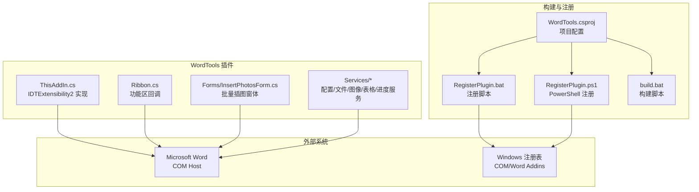
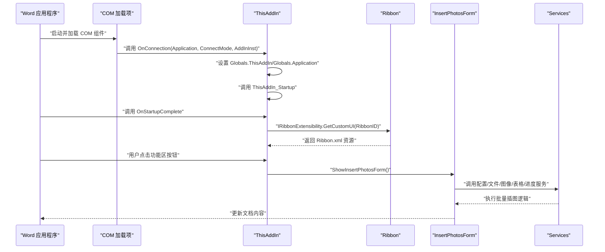
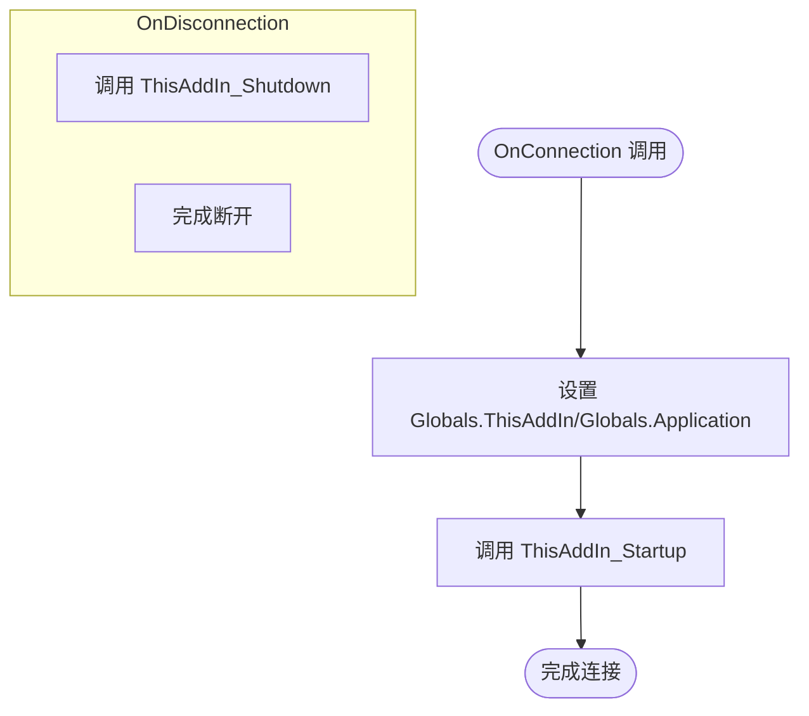
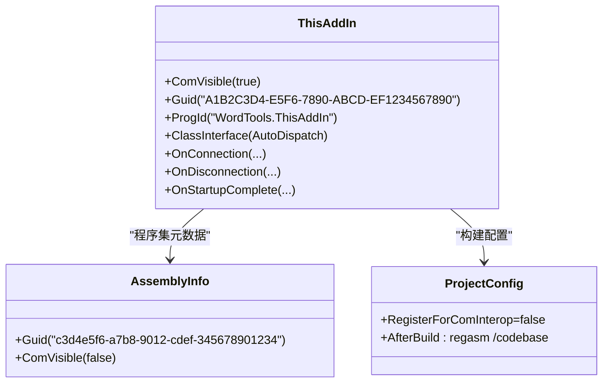
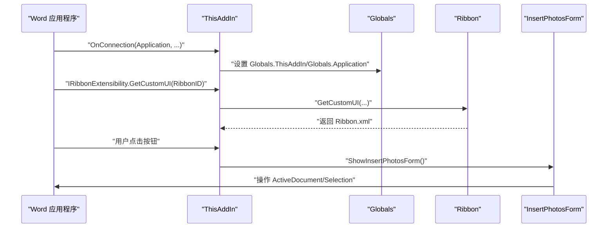
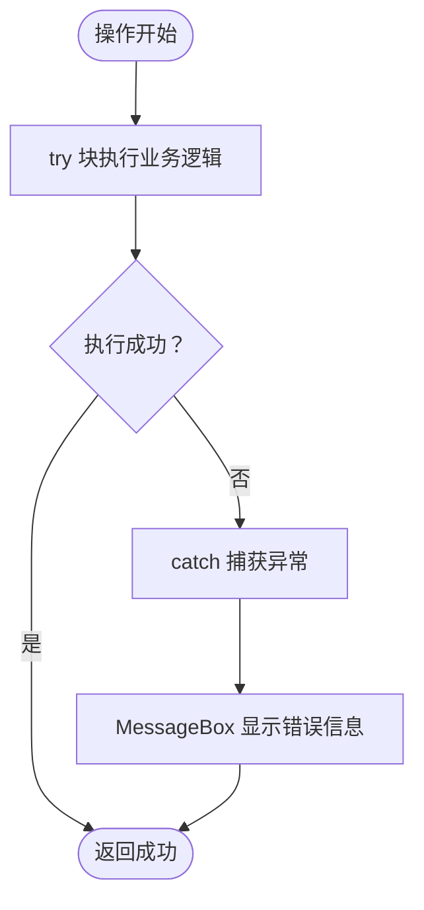
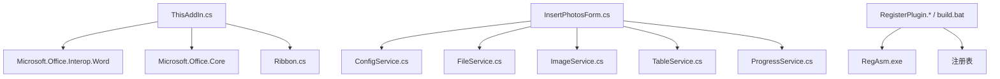

# COM 加载项架构

<cite>
**本文引用的文件**
- [ThisAddIn.cs](file://WordTools/ThisAddIn.cs)
- [Ribbon.cs](file://WordTools/Ribbon.cs)
- [AssemblyInfo.cs](file://WordTools/Properties/AssemblyInfo.cs)
- [WordTools.csproj](file://WordTools/WordTools.csproj)
- [InsertPhotosForm.cs](file://WordTools/Forms/InsertPhotosForm.cs)
- [RegisterPlugin.bat](file://RegisterPlugin.bat)
- [RegisterPlugin.ps1](file://RegisterPlugin.ps1)
- [build.bat](file://build.bat)
- [ConfigService.cs](file://WordTools/Services/ConfigService.cs)
- [FileService.cs](file://WordTools/Services/FileService.cs)
- [ImageService.cs](file://WordTools/Services/ImageService.cs)
- [TableService.cs](file://WordTools/Services/TableService.cs)
- [ProgressService.cs](file://WordTools/Services/ProgressService.cs)
- [README.md](file://README.md)
</cite>

## 目录
1. [简介](#简介)
2. [项目结构](#项目结构)
3. [核心组件](#核心组件)
4. [架构概览](#架构概览)
5. [详细组件分析](#详细组件分析)
6. [依赖关系分析](#依赖关系分析)
7. [性能考量](#性能考量)
8. [故障排除指南](#故障排除指南)
9. [结论](#结论)
10. [附录](#附录)

## 简介
本文件面向 WordTools 的 COM 加载项架构，深入解析 IDTExtensibility2 接口实现机制、COM 组件注册流程、与 Word 应用程序的集成方式、错误处理策略以及 COM 互操作的最佳实践。该插件采用纯托管 C# 实现，通过 COM 加载项方式集成到 Word，无需 VSTO 运行时，但需要手动注册 COM 组件。

## 项目结构
项目采用分层设计，主要分为：
- 插件入口与功能区：ThisAddIn.cs、Ribbon.cs
- 窗体与交互：Forms/InsertPhotosForm.cs
- 业务服务层：Services/*（配置、文件、图像、表格、进度）
- 构建与注册：WordTools.csproj、RegisterPlugin.*、build.bat
- 程序集元数据：Properties/AssemblyInfo.cs

**图表来源**
- [ThisAddIn.cs:13-17](file://WordTools/ThisAddIn.cs#L13-L17)
- [Ribbon.cs:13-14](file://WordTools/Ribbon.cs#L13-L14)
- [WordTools.csproj:100-119](file://WordTools/WordTools.csproj#L100-L119)
- [RegisterPlugin.bat:17-32](file://RegisterPlugin.bat#L17-L32)
- [RegisterPlugin.ps1:20-36](file://RegisterPlugin.ps1#L20-L36)

**章节来源**
- [README.md:47-60](file://README.md#L47-L60)
- [WordTools.csproj:1-145](file://WordTools/WordTools.csproj#L1-L145)

## 核心组件
- ThisAddIn：实现 IDTExtensibility2 和 IRibbonExtensibility，负责插件生命周期管理和功能区 UI 初始化。
- Ribbon：实现 IRibbonExtensibility，提供功能区 XML 资源加载与回调。
- InsertPhotosForm：批量插图主窗体，封装用户交互与业务逻辑。
- Services：配置、文件、图像、表格、进度等服务模块，支撑核心功能。
- 构建与注册：通过项目配置、批处理脚本和 PowerShell 脚本完成 COM 注册与 Word 加载项启用。

**章节来源**
- [ThisAddIn.cs:17-82](file://WordTools/ThisAddIn.cs#L17-L82)
- [Ribbon.cs:13-29](file://WordTools/Ribbon.cs#L13-L29)
- [InsertPhotosForm.cs:18-618](file://WordTools/Forms/InsertPhotosForm.cs#L18-L618)

## 架构概览
COM 加载项通过以下步骤与 Word 集成：
1. COM 组件注册：使用 regasm 将 ThisAddIn 类型注册为 COM 可见组件，并在注册表中添加 Word Addins 项。
2. Word 启动加载：Word 根据 Addins 注册表项加载 COM 加载项。
3. 生命周期回调：Word 调用 IDTExtensibility2 的 OnConnection、OnStartupComplete 等方法。
4. 功能区初始化：通过 IRibbonExtensibility.GetCustomUI 返回 Ribbon.xml 资源，加载功能区 UI。
5. 用户交互：用户点击功能区按钮触发回调，调用窗体或服务执行具体操作。

**图表来源**
- [ThisAddIn.cs:37-61](file://WordTools/ThisAddIn.cs#L37-L61)
- [ThisAddIn.cs:65-80](file://WordTools/ThisAddIn.cs#L65-L80)
- [ThisAddIn.cs:133-150](file://WordTools/ThisAddIn.cs#L133-L150)
- [Ribbon.cs:24-27](file://WordTools/Ribbon.cs#L24-L27)

## 详细组件分析

### IDTExtensibility2 接口实现机制
ThisAddIn 实现 IDTExtensibility2 接口，关键生命周期方法如下：
- OnConnection：接收 Word 应用程序实例，设置全局访问点 Globals.ThisAddIn 和 Globals.Application，随后调用内部启动逻辑。
- OnDisconnection：调用内部关闭逻辑，释放资源。
- OnStartupComplete：Word 启动完成后调用，可用于初始化后续逻辑。
- OnAddInsUpdate、OnBeginShutdown：预留扩展点，当前实现为空。

**图表来源**
- [ThisAddIn.cs:37-61](file://WordTools/ThisAddIn.cs#L37-L61)
- [ThisAddIn.cs:27-33](file://WordTools/ThisAddIn.cs#L27-L33)

**章节来源**
- [ThisAddIn.cs:37-61](file://WordTools/ThisAddIn.cs#L37-L61)
- [ThisAddIn.cs:27-33](file://WordTools/ThisAddIn.cs#L27-L33)

### COM 组件注册机制
- 组件可见性与接口类型：ThisAddIn 类通过 ComVisible(true)、Guid 属性、ProgId 配置和 ClassInterfaceType.AutoDispatch，确保 COM 可见性和自动化兼容性。
- 项目配置：WordTools.csproj 中 RegisterForComInterop=false，避免 MSBuild 自动注册，改由构建后目标输出 regasm 命令。
- 注册脚本：RegisterPlugin.bat 与 RegisterPlugin.ps1 完成 regasm 注册与 Word Addins 注册表项添加；build.bat 提供完整构建与部署流程。

**图表来源**
- [ThisAddIn.cs:13-16](file://WordTools/ThisAddIn.cs#L13-L16)
- [AssemblyInfo.cs:23-24](file://WordTools/Properties/AssemblyInfo.cs#L23-L24)
- [WordTools.csproj:58-59](file://WordTools/WordTools.csproj#L58-L59)
- [WordTools.csproj:141-143](file://WordTools/WordTools.csproj#L141-L143)

**章节来源**
- [ThisAddIn.cs:13-16](file://WordTools/ThisAddIn.cs#L13-L16)
- [AssemblyInfo.cs:18-21](file://WordTools/Properties/AssemblyInfo.cs#L18-L21)
- [WordTools.csproj:58-59](file://WordTools/WordTools.csproj#L58-L59)
- [WordTools.csproj:141-143](file://WordTools/WordTools.csproj#L141-L143)
- [RegisterPlugin.bat:17-32](file://RegisterPlugin.bat#L17-L32)
- [RegisterPlugin.ps1:20-36](file://RegisterPlugin.ps1#L20-L36)

### 与 Word 应用程序的集成方式
- 全局访问模式：OnConnection 中将 Word.Application 实例赋给 Globals.Application，ThisAddIn 实例赋给 Globals.ThisAddIn，便于其他组件通过静态全局访问。
- 功能区集成：实现 IRibbonExtensibility，通过 GetCustomUI 返回 Ribbon.xml 资源，加载功能区 UI。
- 窗体交互：功能区按钮回调调用 ShowInsertPhotosForm，创建 InsertPhotosForm 并传入 Globals.Application，实现与 Word 的交互。

**图表来源**
- [ThisAddIn.cs:39-41](file://WordTools/ThisAddIn.cs#L39-L41)
- [ThisAddIn.cs:65-80](file://WordTools/ThisAddIn.cs#L65-L80)
- [ThisAddIn.cs:133-150](file://WordTools/ThisAddIn.cs#L133-L150)

**章节来源**
- [ThisAddIn.cs:39-41](file://WordTools/ThisAddIn.cs#L39-L41)
- [ThisAddIn.cs:65-80](file://WordTools/ThisAddIn.cs#L65-L80)
- [ThisAddIn.cs:133-150](file://WordTools/ThisAddIn.cs#L133-L150)

### 错误处理策略与异常管理
- 统一 try-catch：功能区回调与窗体事件中广泛使用 try-catch 捕获异常，避免影响 Word 主线程。
- 用户反馈：捕获异常后通过 MessageBox 显示错误信息，便于用户理解问题。
- 优雅降级：部分服务（如配置读写、注册表操作）在异常时返回默认值或忽略错误，保证功能可用性。
- 取消机制：ProgressService 通过 Windows API 检测 ESC 键，支持用户取消长时间操作。

**图表来源**
- [Ribbon.cs:40-47](file://WordTools/Ribbon.cs#L40-L47)
- [InsertPhotosForm.cs:527-567](file://WordTools/Forms/InsertPhotosForm.cs#L527-L567)
- [ProgressService.cs:43-64](file://WordTools/Services/ProgressService.cs#L43-L64)

**章节来源**
- [Ribbon.cs:40-47](file://WordTools/Ribbon.cs#L40-L47)
- [InsertPhotosForm.cs:527-567](file://WordTools/Forms/InsertPhotosForm.cs#L527-L567)
- [ProgressService.cs:43-64](file://WordTools/Services/ProgressService.cs#L43-L64)

### COM 互操作技术细节与最佳实践
- COM 可见性：通过 [ComVisible(true)] 确保 ThisAddIn 可被 COM 宿主识别。
- ProgId：使用 ProgId("WordTools.ThisAddIn") 便于 Word 通过 ProgId 定位加载项。
- 自动调度接口：ClassInterfaceType.AutoDispatch 允许自动化客户端通过 IDispatch 调用方法，提升兼容性。
- 项目配置：RegisterForComInterop=false，避免 MSBuild 自动注册导致的版本冲突；通过 AfterBuild 目标调用 regasm /codebase，确保输出路径正确。
- 注册表项：Addins 注册表项包含 FriendlyName、Description、LoadBehavior、CommandLineSafe 等字段，控制加载行为与安全性。

**章节来源**
- [ThisAddIn.cs:13-16](file://WordTools/ThisAddIn.cs#L13-L16)
- [WordTools.csproj:58-59](file://WordTools/WordTools.csproj#L58-L59)
- [WordTools.csproj:141-143](file://WordTools/WordTools.csproj#L141-L143)
- [RegisterPlugin.bat:52-55](file://RegisterPlugin.bat#L52-L55)
- [RegisterPlugin.ps1:66-69](file://RegisterPlugin.ps1#L66-L69)

## 依赖关系分析
- ThisAddIn 依赖 Word Interop（Microsoft.Office.Interop.Word）与 Office 核心（Microsoft.Office.Core），并通过 IRibbonExtensibility 与功能区交互。
- InsertPhotosForm 依赖 Services 模块（ConfigService、FileService、ImageService、TableService、ProgressService）。
- 构建脚本依赖 .NET Framework 4.x 的 RegAsm.exe 与 PowerShell/批处理工具。

**图表来源**
- [ThisAddIn.cs:5-9](file://WordTools/ThisAddIn.cs#L5-L9)
- [WordTools.csproj:63-88](file://WordTools/WordTools.csproj#L63-L88)
- [InsertPhotosForm.cs:4-6](file://WordTools/Forms/InsertPhotosForm.cs#L4-L6)
- [RegisterPlugin.bat:18-40](file://RegisterPlugin.bat#L18-L40)
- [RegisterPlugin.ps1:23-44](file://RegisterPlugin.ps1#L23-L44)

**章节来源**
- [ThisAddIn.cs:5-9](file://WordTools/ThisAddIn.cs#L5-L9)
- [WordTools.csproj:63-88](file://WordTools/WordTools.csproj#L63-L88)
- [InsertPhotosForm.cs:4-6](file://WordTools/Forms/InsertPhotosForm.cs#L4-L6)
- [RegisterPlugin.bat:18-40](file://RegisterPlugin.bat#L18-L40)
- [RegisterPlugin.ps1:23-44](file://RegisterPlugin.ps1#L23-L44)

## 性能考量
- 高性能模式：ProgressService 在批量处理时进入高性能模式，关闭 ScreenUpdating、DisplayAlerts，减少 UI 更新与警告弹窗，显著提升性能。
- 批量处理优化：根据文件总数动态调整刷新间隔、内存清理间隔与保存间隔，平衡进度反馈与性能消耗。
- 内存管理：定期触发垃圾回收与 Application.DoEvents，避免长时间操作占用过多内存。
- 表格预分配：预估需要的行数并批量添加，减少频繁的表格结构调整开销。

**章节来源**
- [ProgressService.cs:73-112](file://WordTools/Services/ProgressService.cs#L73-L112)
- [ProgressService.cs:117-125](file://WordTools/Services/ProgressService.cs#L117-L125)
- [ProgressService.cs:130-142](file://WordTools/Services/ProgressService.cs#L130-L142)
- [ImageService.cs:287-320](file://WordTools/Services/ImageService.cs#L287-L320)

## 故障排除指南
- 注册失败：确认以管理员身份运行注册脚本；检查 RegAsm 路径与 DLL 路径是否存在；确保 .NET Framework 4.x 已安装。
- Word 未显示插件：确认 Addins 注册表项已正确添加；完全关闭 Word（含后台进程）后重启；在“文件 → 选项 → 加载项”中启用 COM 加载项。
- 功能区不响应：检查 Ribbon.xml 是否嵌入为资源；确认 IRibbonExtensibility.GetCustomUI 返回非空字符串。
- 操作异常：查看 MessageBox 错误提示；检查日志或在开发环境中调试；确认权限与文件路径有效性。

**章节来源**
- [RegisterPlugin.bat:8-32](file://RegisterPlugin.bat#L8-L32)
- [RegisterPlugin.ps1:11-36](file://RegisterPlugin.ps1#L11-L36)
- [README.md:62-75](file://README.md#L62-L75)
- [ThisAddIn.cs:65-80](file://WordTools/ThisAddIn.cs#L65-L80)

## 结论
WordTools 的 COM 加载项架构通过清晰的分层设计与完善的错误处理，实现了与 Word 的深度集成。IDTExtensibility2 生命周期管理确保插件在合适的时机初始化与释放；COM 注册与 Word Addins 配置保障加载项的稳定启用；服务层模块化设计提升了可维护性与可扩展性。遵循本文提供的最佳实践与故障排除指南，可有效提升插件的稳定性与用户体验。

## 附录
- 构建与部署：使用 build.bat 完成完整构建与部署；也可单独使用 RegisterPlugin.* 进行注册。
- 卸载方法：通过 regasm /u 卸载 COM 组件，或在 Word 中禁用加载项。

**章节来源**
- [build.bat:1-125](file://build.bat#L1-L125)
- [README.md:62-75](file://README.md#L62-L75)