# Ribbon界面系统

<cite>
**本文引用的文件**
- [Ribbon.cs](file://WordTools/Ribbon.cs)
- [Ribbon.xml](file://WordTools/Ribbon.xml)
- [Theme.cs](file://WordTools/Theme.cs)
- [ThisAddIn.cs](file://WordTools/ThisAddIn.cs)
- [InsertPhotosForm.cs](file://WordTools/Forms/InsertPhotosForm.cs)
- [ExcelDataFillerForm.cs](file://WordTools/Forms/ExcelDataFillerForm.cs)
- [ConfigService.cs](file://WordTools/Services/ConfigService.cs)
- [FileService.cs](file://WordTools/Services/FileService.cs)
- [ImageService.cs](file://WordTools/Services/ImageService.cs)
- [README.md](file://README.md)
</cite>

## 目录
1. [简介](#简介)
2. [项目结构](#项目结构)
3. [核心组件](#核心组件)
4. [架构总览](#架构总览)
5. [详细组件分析](#详细组件分析)
6. [依赖关系分析](#依赖关系分析)
7. [性能考量](#性能考量)
8. [故障排查指南](#故障排查指南)
9. [结论](#结论)
10. [附录](#附录)

## 简介
本文件面向WordTools的Ribbon界面系统，系统性地解析XML定义的Ribbon界面结构、Ribbon.cs中的界面控制器实现、主题系统与视觉样式定制、按钮点击事件的完整处理链路、状态管理与动态更新机制，以及界面扩展与自定义的最佳实践与用户体验优化建议。文档同时提供可视化图表，帮助读者快速理解组件交互与数据流。

## 项目结构
WordTools采用COM加载项（IDTExtensibility2）实现，Ribbon界面通过XML定义与回调方法共同构成。核心文件包括：
- Ribbon.xml：定义Ribbon界面结构（选项卡、组、按钮及其属性）
- Ribbon.cs：实现IRibbonExtensibility接口，负责资源加载与回调
- ThisAddIn.cs：插件入口，负责生命周期管理与Ribbon状态刷新
- Theme.cs：统一的UI样式与主题常量，贯穿窗体与控件
- Forms目录：具体功能窗体（批量插图、Excel数据填充）
- Services目录：配置、文件、图片等服务模块

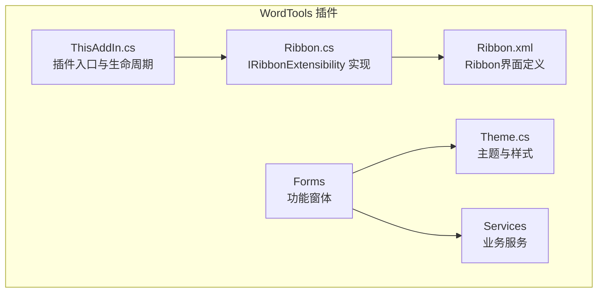

**图表来源**
- [ThisAddIn.cs:17-174](file://WordTools/ThisAddIn.cs#L17-L174)
- [Ribbon.cs:14-189](file://WordTools/Ribbon.cs#L14-L189)
- [Ribbon.xml:1-53](file://WordTools/Ribbon.xml#L1-L53)
- [Theme.cs:11-358](file://WordTools/Theme.cs#L11-L358)

**章节来源**
- [README.md:1-85](file://README.md#L1-L85)

## 核心组件
- Ribbon界面定义（Ribbon.xml）：声明选项卡、组与按钮，绑定onAction回调与屏幕提示信息。
- Ribbon控制器（Ribbon.cs）：实现IRibbonExtensibility，负责加载XML资源、处理Ribbon_Load与按钮回调。
- 插件入口（ThisAddIn.cs）：实现IDTExtensibility2与IRibbonExtensibility，负责应用连接、Ribbon状态刷新。
- 主题系统（Theme.cs）：集中管理颜色、字体、布局与控件样式，提供DPI缩放与控件工厂方法。
- 功能窗体（Forms）：批量插图与Excel数据填充窗体，承载复杂交互与业务逻辑。
- 服务模块（Services）：配置、文件、图片等服务，支撑窗体与Ribbon回调的业务能力。

**章节来源**
- [Ribbon.xml:1-53](file://WordTools/Ribbon.xml#L1-L53)
- [Ribbon.cs:14-189](file://WordTools/Ribbon.cs#L14-L189)
- [ThisAddIn.cs:17-174](file://WordTools/ThisAddIn.cs#L17-L174)
- [Theme.cs:11-358](file://WordTools/Theme.cs#L11-L358)

## 架构总览
Ribbon界面系统遵循“XML定义 + 回调驱动”的模式。Ribbon.cs通过GetCustomUI加载Ribbon.xml，随后根据XML中声明的onAction映射到Ribbon.cs中的回调方法。ThisAddIn.cs负责插件生命周期与Ribbon状态刷新（Invalidate）。窗体层通过Theme.cs统一风格，服务层提供配置、文件与图片处理能力。

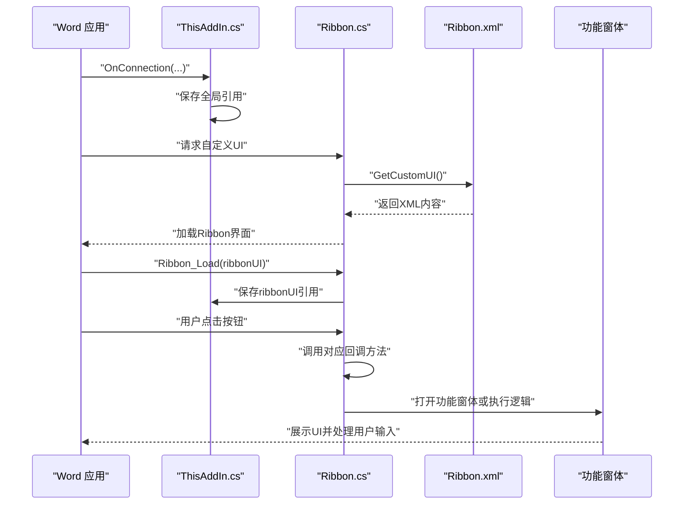

**图表来源**
- [ThisAddIn.cs:37-81](file://WordTools/ThisAddIn.cs#L37-L81)
- [Ribbon.cs:24-36](file://WordTools/Ribbon.cs#L24-L36)
- [Ribbon.xml:2-52](file://WordTools/Ribbon.xml#L2-L52)

## 详细组件分析

### Ribbon界面定义（Ribbon.xml）
- 选项卡：在“开始”选项卡之后插入“Word工具箱”，包含三组功能。
- 组与按钮：
  - 图片工具组：批量插图按钮，large尺寸，绑定OnInsertPhotosClick回调。
  - 工具组：Excel数据填充按钮，large尺寸，绑定OnExcelDataFillerClick回调。
  - 帮助组：关于按钮，large尺寸，绑定OnAboutClick回调。
- 屏幕提示：screentip与supertip分别用于悬停提示与详细提示。
- 资源加载：Ribbon.cs通过GetCustomUI加载该XML资源。

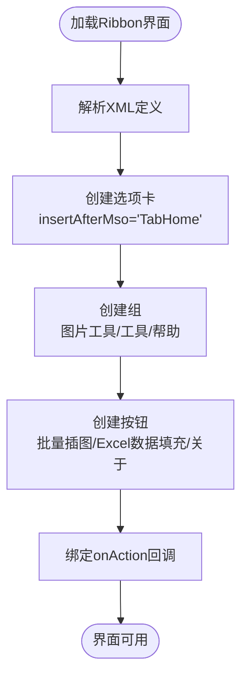

**图表来源**
- [Ribbon.xml:6-49](file://WordTools/Ribbon.xml#L6-L49)

**章节来源**
- [Ribbon.xml:1-53](file://WordTools/Ribbon.xml#L1-L53)

### Ribbon控制器（Ribbon.cs）
- 接口实现：实现IRibbonExtensibility，提供GetCustomUI与Ribbon_Load。
- 资源加载：GetCustomUI通过内部GetResourceText从程序集清单资源读取XML。
- 回调方法：
  - Ribbon_Load：保存IRibbonUI引用，供后续状态刷新。
  - OnInsertPhotosClick：打开批量插图窗体。
  - OnExcelDataFillerClick：打开Excel数据填充窗体。
  - OnAboutClick：显示关于信息。
  - 动态标签与提示：GetLabel、GetDescription、GetSupertip、GetScreentip用于本地化与提示信息。
- 错误处理：所有回调均包含try/catch，异常通过消息框提示。

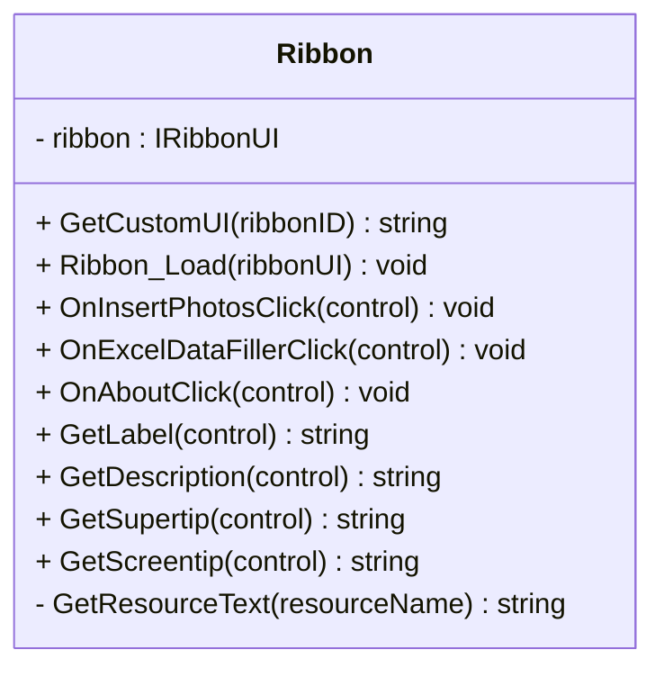

**图表来源**
- [Ribbon.cs:14-189](file://WordTools/Ribbon.cs#L14-L189)

**章节来源**
- [Ribbon.cs:24-189](file://WordTools/Ribbon.cs#L24-L189)

### 插件入口（ThisAddIn.cs）
- 生命周期：实现IDTExtensibility2，记录应用实例与全局引用。
- Ribbon资源加载：同样实现GetCustomUI，直接从程序集读取XML。
- Ribbon状态刷新：提供InvalidateRibbon方法，调用IRibbonUI.Invalidate刷新界面。
- 回调方法：直接在ThisAddIn中实现按钮回调，打开窗体或显示信息。

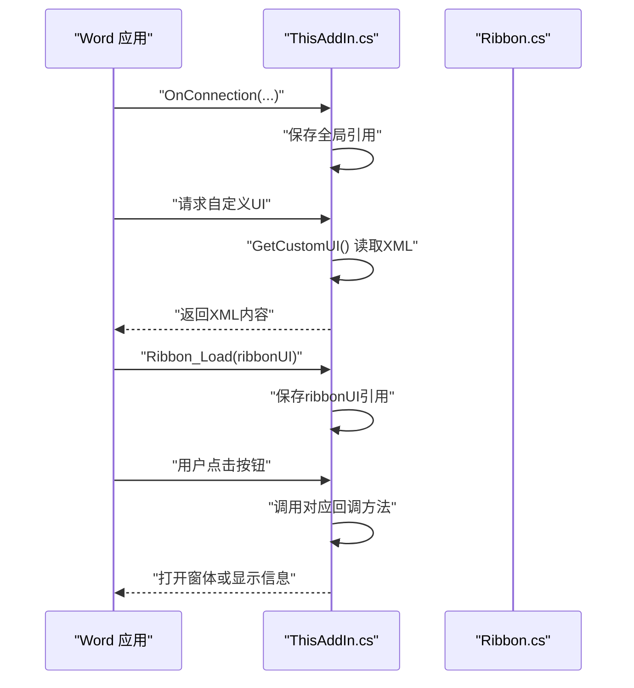

**图表来源**
- [ThisAddIn.cs:17-174](file://WordTools/ThisAddIn.cs#L17-L174)

**章节来源**
- [ThisAddIn.cs:37-174](file://WordTools/ThisAddIn.cs#L37-L174)

### 主题系统（Theme.cs）
- 颜色方案：背景、主色、成功/危险、文本、边框、按钮与输入框状态色。
- 字体方案：默认、加粗、标题、小字、等宽字体。
- 布局常量：边距、控件高度、标签宽度、行间距、按钮尺寸、窗体宽度等。
- DPI适配：GetDpiScale与Scale方法，ApplyFormDefaults统一窗体样式。
- 控件工厂：CreateLabel、CreateTextBox、CreateButton、CreateDivider等。
- 状态样式：按钮EnabledChanged事件自动切换禁用态样式，提升可感知性。

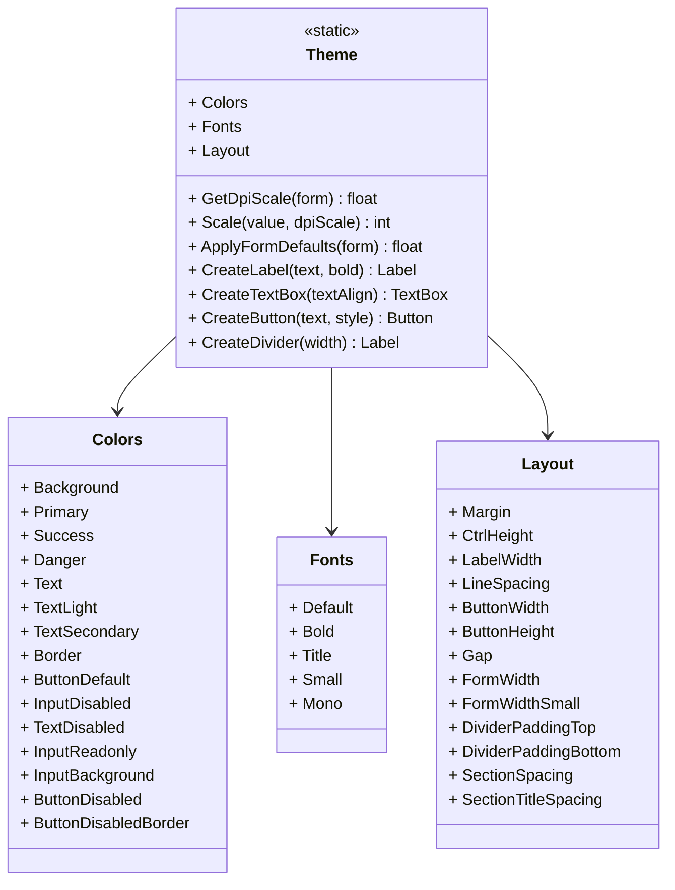

**图表来源**
- [Theme.cs:11-358](file://WordTools/Theme.cs#L11-L358)

**章节来源**
- [Theme.cs:11-358](file://WordTools/Theme.cs#L11-L358)

### 功能窗体与业务服务

#### 批量插图窗体（InsertPhotosForm.cs）
- 界面布局：文件夹路径、图片高度、范围选择、描述选项、对齐方式、操作按钮。
- 主题应用：统一使用Theme.ApplyFormDefaults与控件工厂，DPI缩放适配。
- 配置持久化：通过ConfigService读取/保存最近设置。
- 业务流程：校验输入、隐藏窗体、调用ProgressService执行插入与编号，实时更新状态。

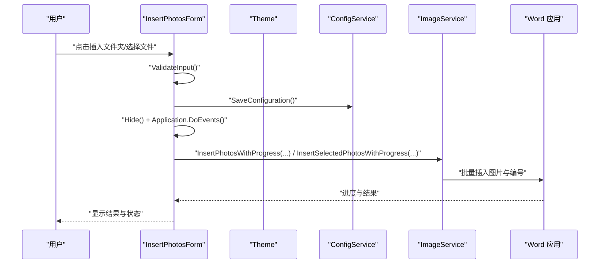

**图表来源**
- [InsertPhotosForm.cs:481-569](file://WordTools/Forms/InsertPhotosForm.cs#L481-L569)
- [ConfigService.cs:149-207](file://WordTools/Services/ConfigService.cs#L149-L207)
- [ImageService.cs:73-180](file://WordTools/Services/ImageService.cs#L73-L180)

**章节来源**
- [InsertPhotosForm.cs:481-569](file://WordTools/Forms/InsertPhotosForm.cs#L481-L569)
- [ConfigService.cs:149-207](file://WordTools/Services/ConfigService.cs#L149-L207)
- [ImageService.cs:73-180](file://WordTools/Services/ImageService.cs#L73-L180)

#### Excel数据填充窗体（ExcelDataFillerForm.cs）
- 界面布局：Excel文件路径、锚定字段、目标列、Sample Size替换选项、状态显示区、执行/取消按钮。
- 输入验证：ValidateInput确保必要字段有效。
- 状态更新：UpdateStatus与AppendStatus配合Application.DoEvents保证UI响应。
- 业务执行：调用EDF_DataFillerService.ExecuteFilling，异步输出过程信息。

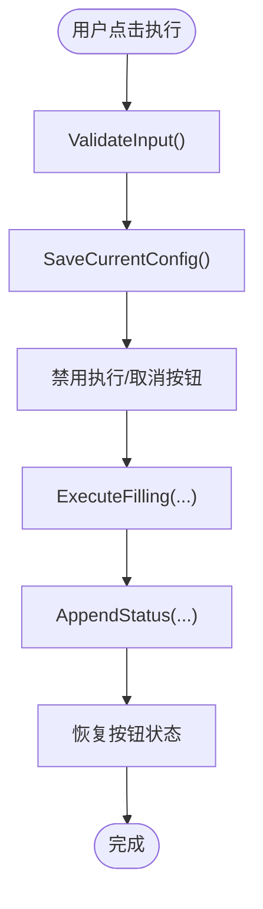

**图表来源**
- [ExcelDataFillerForm.cs:299-355](file://WordTools/Forms/ExcelDataFillerForm.cs#L299-L355)

**章节来源**
- [ExcelDataFillerForm.cs:299-355](file://WordTools/Forms/ExcelDataFillerForm.cs#L299-L355)

### 状态管理与动态更新机制
- Ribbon状态刷新：ThisAddIn提供InvalidateRibbon方法，调用IRibbonUI.Invalidate触发界面重绘。
- 窗体状态：窗体通过Application.DoEvents保证长耗时任务期间UI响应。
- 配置持久化：ConfigService结合文档自定义属性与注册表，实现跨文档与全局配置。

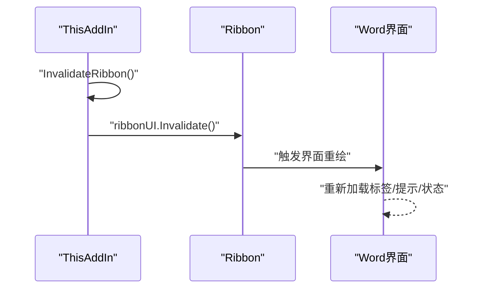

**图表来源**
- [ThisAddIn.cs:95-101](file://WordTools/ThisAddIn.cs#L95-L101)

**章节来源**
- [ThisAddIn.cs:95-101](file://WordTools/ThisAddIn.cs#L95-L101)
- [ConfigService.cs:149-207](file://WordTools/Services/ConfigService.cs#L149-L207)

### 按钮点击事件处理流程（从UI到功能执行）
- 用户点击：Word触发Ribbon回调（OnInsertPhotosClick/OnExcelDataFillerClick/OnAboutClick）。
- 控制器处理：Ribbon.cs或ThisAddIn.cs执行对应逻辑（打开窗体或显示信息）。
- 窗体交互：窗体通过Theme统一样式，调用Services执行业务逻辑。
- 结果反馈：通过消息框或状态区反馈结果。

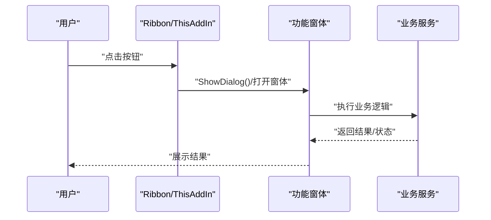

**图表来源**
- [Ribbon.cs:38-125](file://WordTools/Ribbon.cs#L38-L125)
- [ThisAddIn.cs:108-142](file://WordTools/ThisAddIn.cs#L108-L142)

**章节来源**
- [Ribbon.cs:38-125](file://WordTools/Ribbon.cs#L38-L125)
- [ThisAddIn.cs:108-142](file://WordTools/ThisAddIn.cs#L108-L142)

## 依赖关系分析
- Ribbon.cs依赖Ribbon.xml（通过资源加载）与窗体（打开窗体）。
- ThisAddIn.cs同时承担插件入口与Ribbon回调职责，耦合度较高，但便于统一管理。
- 窗体依赖Theme.cs与Services（ConfigService、FileService、ImageService）。
- Services之间低耦合，通过公共接口协作。

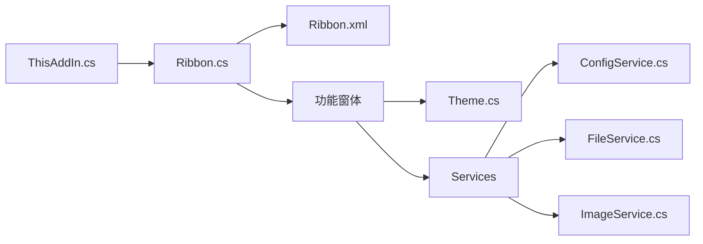

**图表来源**
- [Ribbon.cs:24-125](file://WordTools/Ribbon.cs#L24-L125)
- [ThisAddIn.cs:108-142](file://WordTools/ThisAddIn.cs#L108-L142)
- [Theme.cs:11-358](file://WordTools/Theme.cs#L11-L358)
- [ConfigService.cs:11-463](file://WordTools/Services/ConfigService.cs#L11-L463)
- [FileService.cs:13-310](file://WordTools/Services/FileService.cs#L13-L310)
- [ImageService.cs:10-325](file://WordTools/Services/ImageService.cs#L10-L325)

**章节来源**
- [Ribbon.cs:24-125](file://WordTools/Ribbon.cs#L24-L125)
- [ThisAddIn.cs:108-142](file://WordTools/ThisAddIn.cs#L108-L142)
- [Theme.cs:11-358](file://WordTools/Theme.cs#L11-L358)
- [ConfigService.cs:11-463](file://WordTools/Services/ConfigService.cs#L11-L463)
- [FileService.cs:13-310](file://WordTools/Services/FileService.cs#L13-L310)
- [ImageService.cs:10-325](file://WordTools/Services/ImageService.cs#L10-L325)

## 性能考量
- UI响应性：窗体在执行前调用Hide与Application.DoEvents，避免界面冻结。
- 批量操作：ImageService提供批量添加行与批量调整图片尺寸，减少多次COM调用。
- 预分配策略：PreAllocateRows限制最大预分配行数，平衡性能与内存占用。
- DPI适配：Theme提供Scale与ApplyFormDefaults，避免硬编码导致的布局问题。

**章节来源**
- [InsertPhotosForm.cs:510-518](file://WordTools/Forms/InsertPhotosForm.cs#L510-L518)
- [ImageService.cs:247-320](file://WordTools/Services/ImageService.cs#L247-L320)
- [Theme.cs:135-171](file://WordTools/Theme.cs#L135-L171)

## 故障排查指南
- 插件未加载：确认注册与权限，参考README中的注册与卸载步骤。
- Ribbon不显示：检查Ribbon.xml是否正确嵌入为资源，GetCustomUI是否返回非空。
- 回调未触发：核对XML中onAction与控制器方法签名一致。
- 窗体无法打开：捕获异常并查看消息框提示，定位具体服务调用问题。
- 配置读取失败：确认文档自定义属性与注册表写入权限。

**章节来源**
- [README.md:30-75](file://README.md#L30-L75)
- [Ribbon.cs:24-36](file://WordTools/Ribbon.cs#L24-L36)
- [ExcelDataFillerForm.cs:348-354](file://WordTools/Forms/ExcelDataFillerForm.cs#L348-L354)

## 结论
WordTools的Ribbon界面系统通过XML定义与回调机制清晰分离了界面与逻辑，配合统一的主题系统与服务模块，实现了良好的可维护性与可扩展性。通过状态刷新、DPI适配与长耗时任务的UI响应策略，提升了用户体验。建议在扩展新功能时遵循现有模式，保持回调命名一致性与主题样式统一。

## 附录

### 界面扩展与自定义指导原则
- 新增按钮：在Ribbon.xml中定义按钮与提示信息，确保onAction指向控制器方法。
- 控制器方法：在Ribbon.cs或ThisAddIn.cs中实现回调，打开窗体或执行逻辑。
- 窗体样式：统一使用Theme.cs的控件工厂与ApplyFormDefaults，确保一致性与DPI适配。
- 配置持久化：通过ConfigService读写文档自定义属性与注册表，注意空值处理。
- 业务服务：将复杂逻辑封装在Services中，避免窗体与控制器过重。

### 用户体验优化最佳实践
- 提示信息：合理使用screentip/supertip，帮助用户理解功能。
- 输入验证：在窗体层尽早验证输入，减少无效调用。
- 进度反馈：长耗时操作使用状态区与DoEvents，保持界面响应。
- 错误处理：统一异常捕获与消息提示，避免崩溃影响。