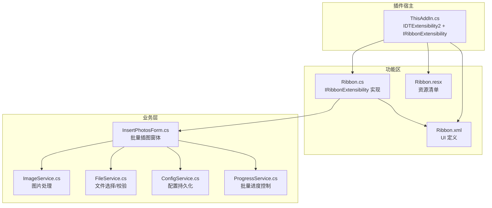
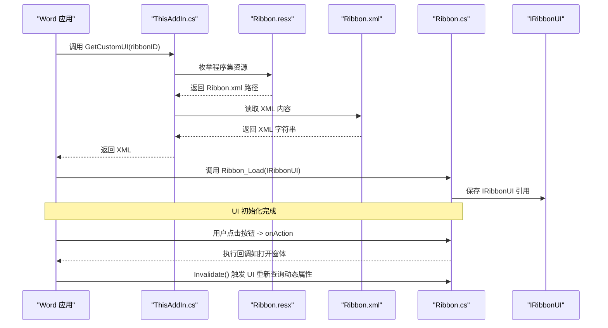
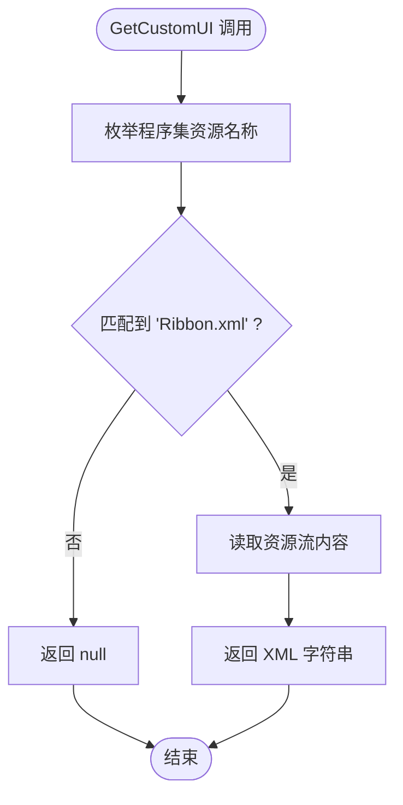
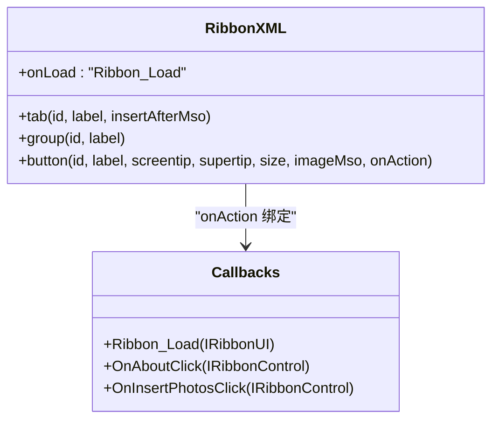
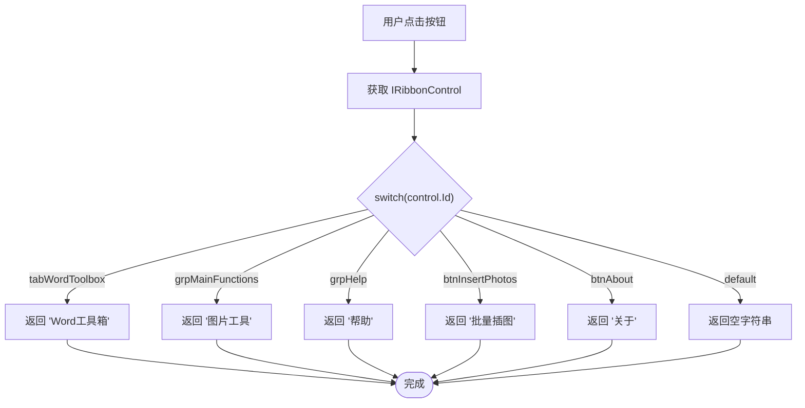
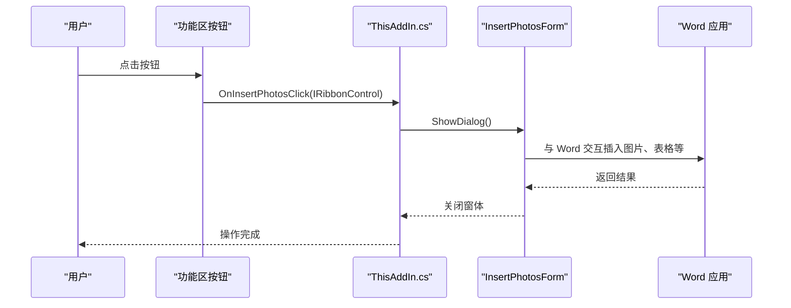
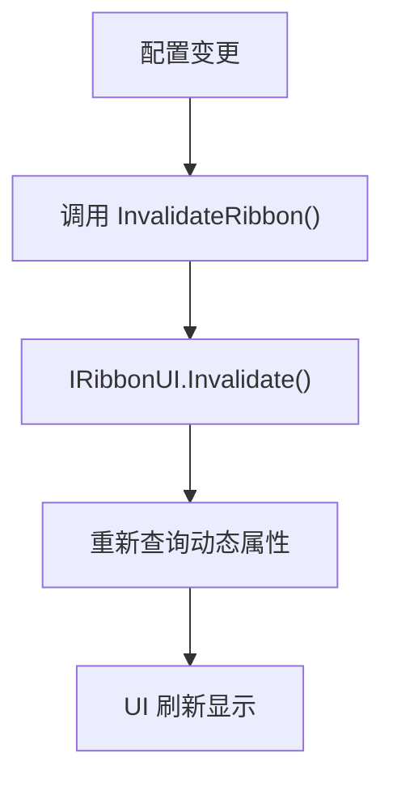
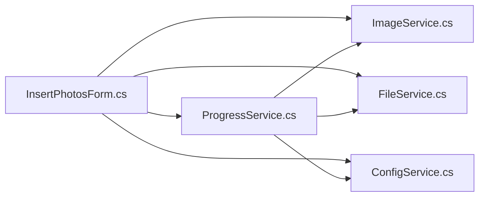
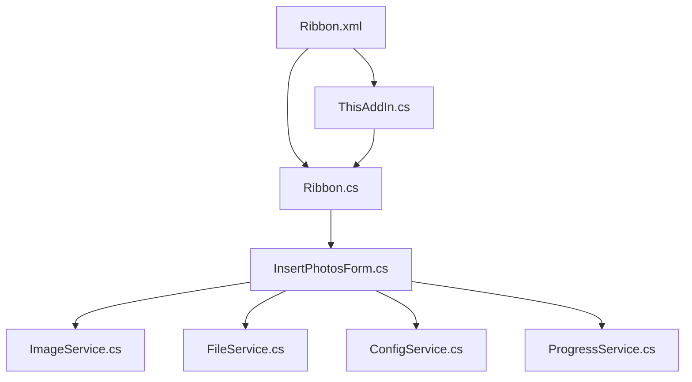

# 功能区集成架构

<cite>
**本文引用的文件**
- [Ribbon.cs](file://WordTools/Ribbon.cs)
- [Ribbon.xml](file://WordTools/Ribbon.xml)
- [Ribbon.resx](file://WordTools/Ribbon.resx)
- [ThisAddIn.cs](file://WordTools/ThisAddIn.cs)
- [InsertPhotosForm.cs](file://WordTools/Forms/InsertPhotosForm.cs)
- [ImageService.cs](file://WordTools/Services/ImageService.cs)
- [ConfigService.cs](file://WordTools/Services/ConfigService.cs)
- [FileService.cs](file://WordTools/Services/FileService.cs)
- [ProgressService.cs](file://WordTools/Services/ProgressService.cs)
- [README.md](file://README.md)
</cite>

## 目录
1. [简介](#简介)
2. [项目结构](#项目结构)
3. [核心组件](#核心组件)
4. [架构总览](#架构总览)
5. [详细组件分析](#详细组件分析)
6. [依赖关系分析](#依赖关系分析)
7. [性能考量](#性能考量)
8. [故障排查指南](#故障排查指南)
9. [结论](#结论)

## 简介
本文件系统性梳理 WordTools 的功能区（Ribbon）集成架构，重点围绕 IRibbonExtensibility 接口实现、Ribbon.xml 配置文件结构、资源加载机制、动态 UI 映射、控件属性配置以及回调方法的事件驱动交互模型。文档同时覆盖功能区状态管理与动态更新机制，帮助开发者理解从资源文件到实际 UI 组件的完整映射链路，并给出可操作的优化建议与排障指引。

## 项目结构
WordTools 采用 COM 加载项（IDTExtensibility2）实现，功能区 UI 通过 Ribbon.xml 定义并通过资源嵌入的方式由 C# 代码动态加载。主要文件与职责如下：
- ThisAddIn.cs：插件入口，实现 IDTExtensibility2 和 IRibbonExtensibility，负责全局初始化与 Ribbon 生命周期回调。
- Ribbon.cs：功能区回调实现类，提供 GetCustomUI、Ribbon_Load、控件回调（如 OnInsertPhotosClick、OnAboutClick）以及动态标签/提示文本。
- Ribbon.xml：功能区 UI 定义，声明选项卡、分组、按钮及回调绑定。
- Ribbon.resx：资源清单，将 Ribbon.xml 作为嵌入资源进行打包。
- Forms/InsertPhotosForm.cs：批量插图主窗体，承载复杂 UI 与业务逻辑。
- Services/*：功能区交互后的业务服务层，包括图片处理、文件选择、配置持久化、进度控制等。

图表来源
- [ThisAddIn.cs:63-82](file://WordTools/ThisAddIn.cs#L63-L82)
- [Ribbon.cs:24-27](file://WordTools/Ribbon.cs#L24-L27)
- [Ribbon.xml:1-39](file://WordTools/Ribbon.xml#L1-L39)
- [Ribbon.resx:62-64](file://WordTools/Ribbon.resx#L62-L64)

章节来源
- [README.md:47-61](file://README.md#L47-L61)
- [ThisAddIn.cs:17-82](file://WordTools/ThisAddIn.cs#L17-L82)
- [Ribbon.cs:14-27](file://WordTools/Ribbon.cs#L14-L27)
- [Ribbon.xml:2-38](file://WordTools/Ribbon.xml#L2-L38)
- [Ribbon.resx:62-64](file://WordTools/Ribbon.resx#L62-L64)

## 核心组件
- IRibbonExtensibility 实现
  - ThisAddIn.cs 与 Ribbon.cs 分别实现了 GetCustomUI，前者直接读取嵌入资源，后者通过通用帮助方法从程序集资源读取。
  - 两者均通过反射枚举程序集清单资源，匹配 Ribbon.xml 名称并读取其内容。
- Ribbon.xml 结构
  - 使用 customUI 根元素，onLoad 绑定到 Ribbon_Load。
  - 定义 tab、group、button 等节点，button 的 onAction 绑定到具体回调方法。
- 动态标签与提示
  - Ribbon.cs 提供 GetLabel、GetDescription、GetSupertip、GetScreentip 等回调，根据控件 Id 返回本地化文本。
- 回调方法
  - ThisAddIn.cs：Ribbon_Load、InvalidateRibbon、OnInsertPhotosClick、OnAboutClick。
  - Ribbon.cs：Ribbon_Load、OnHelloButtonClick、OnInsertTextClick、OnShowInfoClick、OnAboutClick、GetLabel/Description/Supertip/Screentip。
- 状态管理与动态更新
  - ThisAddIn.cs 暴露 InvalidateRibbon，通过 IRibbonUI.Invalidate 触发 UI 重新查询标签/提示等动态属性。

章节来源
- [ThisAddIn.cs:63-82](file://WordTools/ThisAddIn.cs#L63-L82)
- [ThisAddIn.cs:86-100](file://WordTools/ThisAddIn.cs#L86-L100)
- [Ribbon.cs:24-27](file://WordTools/Ribbon.cs#L24-L27)
- [Ribbon.cs:33-36](file://WordTools/Ribbon.cs#L33-L36)
- [Ribbon.cs:113-144](file://WordTools/Ribbon.cs#L113-L144)
- [Ribbon.xml:2-38](file://WordTools/Ribbon.xml#L2-L38)

## 架构总览
功能区集成的关键流程如下：
- 加载阶段：Word 调用 GetCustomUI 请求自定义 UI；插件通过资源读取返回 Ribbon.xml。
- 初始化阶段：XML 中 onLoad 绑定的 Ribbon_Load 被调用，插件持有 IRibbonUI 引用。
- 交互阶段：用户点击按钮触发 onAction 绑定的回调；回调执行业务逻辑或打开窗体。
- 动态更新：插件调用 Invalidate 触发 UI 重新查询动态标签/提示。

图表来源
- [ThisAddIn.cs:63-82](file://WordTools/ThisAddIn.cs#L63-L82)
- [Ribbon.resx:62-64](file://WordTools/Ribbon.resx#L62-L64)
- [Ribbon.xml:2-38](file://WordTools/Ribbon.xml#L2-L38)
- [Ribbon.cs:33-36](file://WordTools/Ribbon.cs#L33-L36)

## 详细组件分析

### IRibbonExtensibility 实现与资源加载
- ThisAddIn.cs 的 GetCustomUI
  - 通过反射枚举程序集资源，匹配 Ribbon.xml 名称并读取内容。
  - 该实现直接面向资源流，确保 XML 在部署时被正确嵌入。
- Ribbon.cs 的 GetCustomUI
  - 通过通用帮助方法从程序集资源读取指定资源名，返回 XML 字符串。
  - 与 ThisAddIn.cs 的策略一致，但封装在类内部，便于复用。
- 资源清单 Ribbon.resx
  - 通过 ResXFileRef 将 Ribbon.xml 作为嵌入资源打包，保证运行时可访问。

图表来源
- [ThisAddIn.cs:67-79](file://WordTools/ThisAddIn.cs#L67-L79)
- [Ribbon.cs:150-168](file://WordTools/Ribbon.cs#L150-L168)
- [Ribbon.resx:62-64](file://WordTools/Ribbon.resx#L62-L64)

章节来源
- [ThisAddIn.cs:63-82](file://WordTools/ThisAddIn.cs#L63-L82)
- [Ribbon.cs:24-27](file://WordTools/Ribbon.cs#L24-L27)
- [Ribbon.resx:62-64](file://WordTools/Ribbon.resx#L62-L64)

### Ribbon.xml 配置与控件映射
- 根元素 customUI
  - onLoad 绑定到 Ribbon_Load，确保 UI 初始化时可获取 IRibbonUI。
- 选项卡与分组
  - tab 定义选项卡 id、label 与插入位置（insertAfterMso）。
  - group 定义功能分组，承载按钮等控件。
- 控件定义与回调绑定
  - button 的 id、label、screentip、supertip、size、imageMso 等属性控制外观与提示。
  - onAction 绑定到具体回调方法（如 OnAboutClick、OnInsertPhotosClick）。

图表来源
- [Ribbon.xml:2-38](file://WordTools/Ribbon.xml#L2-L38)
- [ThisAddIn.cs:86-124](file://WordTools/ThisAddIn.cs#L86-L124)
- [Ribbon.cs:33-111](file://WordTools/Ribbon.cs#L33-L111)

章节来源
- [Ribbon.xml:2-38](file://WordTools/Ribbon.xml#L2-L38)

### 动态标签与提示的实现模式
- GetLabel/GetDescription/GetSupertip/GetScreentip
  - 通过 switch(control.Id) 返回对应控件的本地化标签、描述、超提示与屏幕提示。
  - 该模式遵循 Office 功能区回调约定，由 UI 在渲染时主动查询。

图表来源
- [Ribbon.cs:113-144](file://WordTools/Ribbon.cs#L113-L144)

章节来源
- [Ribbon.cs:113-144](file://WordTools/Ribbon.cs#L113-L144)

### 回调方法的事件驱动交互
- ThisAddIn.cs 的回调
  - OnInsertPhotosClick：打开 InsertPhotosForm 并传入 Word Application。
  - OnAboutClick：显示关于信息。
  - Ribbon_Load：保存 IRibbonUI 引用。
  - InvalidateRibbon：调用 IRibbonUI.Invalidate 触发 UI 重新查询动态属性。
- Ribbon.cs 的回调
  - OnHelloButtonClick、OnInsertTextClick、OnShowInfoClick：执行简单交互或文档信息展示。
  - OnAboutClick：显示关于信息。
- 事件驱动流程
  - 用户点击按钮 -> Word 调用 onAction 绑定的方法 -> 执行业务逻辑或打开窗体 -> 可选地调用 Invalidate 刷新 UI。

图表来源
- [ThisAddIn.cs:107-150](file://WordTools/ThisAddIn.cs#L107-L150)
- [InsertPhotosForm.cs:52-105](file://WordTools/Forms/InsertPhotosForm.cs#L52-L105)

章节来源
- [ThisAddIn.cs:86-150](file://WordTools/ThisAddIn.cs#L86-L150)
- [Ribbon.cs:38-111](file://WordTools/Ribbon.cs#L38-L111)

### 功能区状态管理与动态更新
- 状态持有
  - ThisAddIn.cs 保存 IRibbonUI 引用，供后续调用 Invalidate。
- 动态更新触发
  - 通过 InvalidateRibbon 调用 IRibbonUI.Invalidate，使 UI 重新查询动态标签/提示等属性。
- 典型场景
  - 用户更改配置后，可通过 Invalidate 触发 UI 刷新，使标签/提示反映最新状态。

图表来源
- [ThisAddIn.cs:94-100](file://WordTools/ThisAddIn.cs#L94-L100)

章节来源
- [ThisAddIn.cs:86-100](file://WordTools/ThisAddIn.cs#L86-L100)

### 业务服务与功能区交互
- InsertPhotosForm.cs
  - 负责批量插图窗体的 UI 布局与事件处理。
  - 与 ImageService、FileService、ConfigService、ProgressService 协作完成图片插入、文件选择、配置持久化与进度控制。
- ImageService.cs
  - 提供图片插入、尺寸转换、批量调整与预分配行等能力。
- FileService.cs
  - 提供文件夹/文件选择、扩展名校验、自然排序等能力。
- ConfigService.cs
  - 提供文档自定义属性与注册表的配置读写，支持跨文档共享设置。
- ProgressService.cs
  - 提供批量插入的进度条、取消控制、性能优化（关闭屏幕更新、禁用警告等）与内存回收策略。

图表来源
- [InsertPhotosForm.cs:133-150](file://WordTools/Forms/InsertPhotosForm.cs#L133-L150)
- [ImageService.cs:10-325](file://WordTools/Services/ImageService.cs#L10-L325)
- [FileService.cs:13-310](file://WordTools/Services/FileService.cs#L13-L310)
- [ConfigService.cs:11-362](file://WordTools/Services/ConfigService.cs#L11-L362)
- [ProgressService.cs:14-571](file://WordTools/Services/ProgressService.cs#L14-L571)

章节来源
- [InsertPhotosForm.cs:133-150](file://WordTools/Forms/InsertPhotosForm.cs#L133-L150)
- [ImageService.cs:10-325](file://WordTools/Services/ImageService.cs#L10-L325)
- [FileService.cs:13-310](file://WordTools/Services/FileService.cs#L13-L310)
- [ConfigService.cs:11-362](file://WordTools/Services/ConfigService.cs#L11-L362)
- [ProgressService.cs:14-571](file://WordTools/Services/ProgressService.cs#L14-L571)

## 依赖关系分析
- 组件耦合
  - ThisAddIn.cs 与 Ribbon.cs 在功能区回调上形成互补：前者负责资源加载与顶层回调，后者负责 UI 动态属性与部分交互。
  - Ribbon.xml 作为 UI 定义文件，通过 onAction 与回调方法解耦，降低 UI 与业务逻辑耦合。
- 外部依赖
  - Office Interop（Word、Office.Core）用于与 Word 应用交互。
  - Windows Forms 用于窗体与对话框。
- 潜在循环依赖
  - 未发现直接循环依赖；回调通过接口约定与字符串 onAction 绑定，避免编译期环依赖。

图表来源
- [Ribbon.xml:2-38](file://WordTools/Ribbon.xml#L2-L38)
- [ThisAddIn.cs:63-82](file://WordTools/ThisAddIn.cs#L63-L82)
- [Ribbon.cs:24-27](file://WordTools/Ribbon.cs#L24-L27)
- [InsertPhotosForm.cs:133-150](file://WordTools/Forms/InsertPhotosForm.cs#L133-L150)

章节来源
- [Ribbon.xml:2-38](file://WordTools/Ribbon.xml#L2-L38)
- [ThisAddIn.cs:63-82](file://WordTools/ThisAddIn.cs#L63-L82)
- [Ribbon.cs:24-27](file://WordTools/Ribbon.cs#L24-L27)
- [InsertPhotosForm.cs:133-150](file://WordTools/Forms/InsertPhotosForm.cs#L133-L150)

## 性能考量
- 性能优化策略
  - ProgressService 在批量处理中进入高性能模式：关闭 ScreenUpdating、禁用 DisplayAlerts、提前预分配表格行、定期清理内存、根据文件数量动态调整刷新/保存/内存清理频率。
- UI 刷新与交互
  - 通过 Application.DoEvents() 在长耗时任务中保持 UI 响应，避免阻塞。
- 资源加载
  - 通过程序集资源读取 XML，减少磁盘 IO，提高加载稳定性。

章节来源
- [ProgressService.cs:73-143](file://WordTools/Services/ProgressService.cs#L73-L143)
- [ProgressService.cs:427-431](file://WordTools/Services/ProgressService.cs#L427-L431)

## 故障排查指南
- 功能区未显示
  - 检查 Ribbon.xml 是否正确嵌入资源（Ribbon.resx 的 ResXFileRef）。
  - 确认 GetCustomUI 返回非空字符串。
- 回调未触发
  - 检查 Ribbon.xml 中 onAction 是否与回调方法签名一致。
  - 确认回调方法可见性与签名符合 Office 功能区约定。
- 动态标签/提示不更新
  - 确认调用了 InvalidateRibbon，进而触发 IRibbonUI.Invalidate。
- 插入图片失败
  - 检查表格选择与定位是否正确（需在表格第一列起始单元格）。
  - 查看异常信息并确认文件路径与权限。

章节来源
- [Ribbon.resx:62-64](file://WordTools/Ribbon.resx#L62-L64)
- [ThisAddIn.cs:63-82](file://WordTools/ThisAddIn.cs#L63-L82)
- [Ribbon.xml:2-38](file://WordTools/Ribbon.xml#L2-L38)
- [ThisAddIn.cs:94-100](file://WordTools/ThisAddIn.cs#L94-L100)
- [ProgressService.cs:167-178](file://WordTools/Services/ProgressService.cs#L167-L178)

## 结论
WordTools 的功能区集成采用“XML 定义 + 资源嵌入 + 回调驱动”的架构，通过 IRibbonExtensibility 实现 GetCustomUI 与回调生命周期管理，结合动态标签/提示与状态刷新机制，实现了简洁而强大的 UI 体验。业务逻辑通过服务层解耦，配合性能优化策略，确保在大批量图片处理场景下的稳定与高效。建议在后续迭代中进一步统一回调实现（例如将更多回调迁移到 Ribbon.cs）以提升一致性与可维护性。