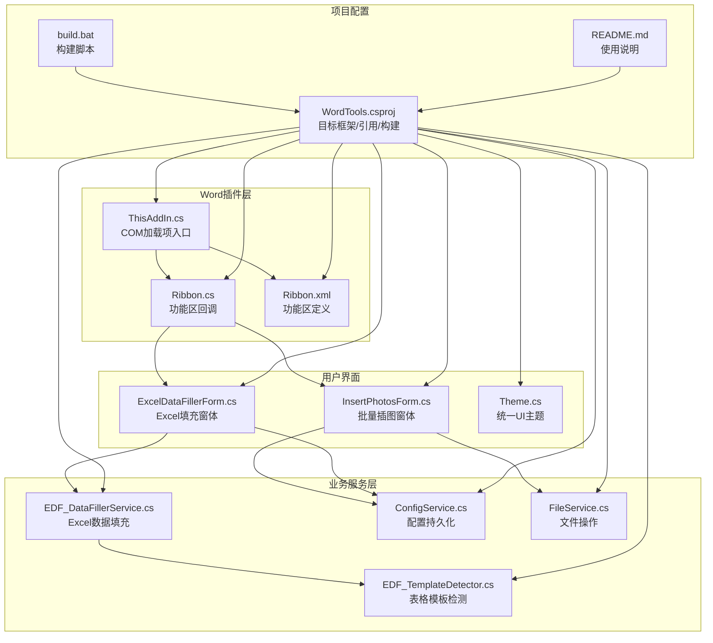
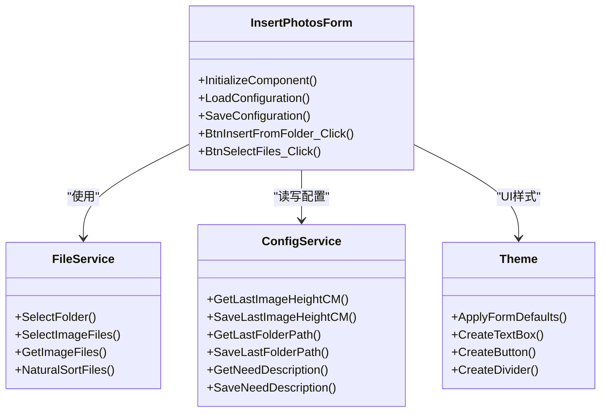
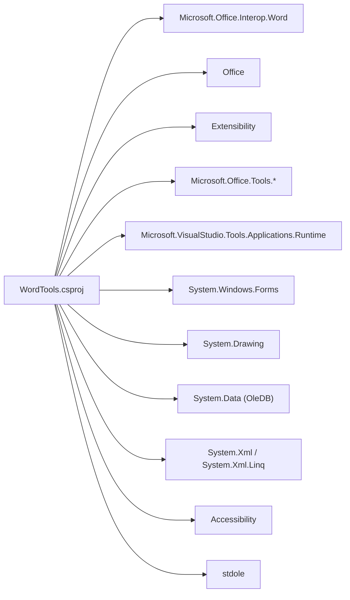

# 技术栈说明

<cite>
**本文引用的文件**
- [WordTools.csproj](file://WordTools/WordTools.csproj)
- [README.md](file://README.md)
- [ThisAddIn.cs](file://WordTools/ThisAddIn.cs)
- [Ribbon.cs](file://WordTools/Ribbon.cs)
- [Ribbon.xml](file://WordTools/Ribbon.xml)
- [EDF_DataFillerService.cs](file://WordTools/Services/EDF_DataFillerService.cs)
- [EDF_TemplateDetector.cs](file://WordTools/Services/EDF_TemplateDetector.cs)
- [InsertPhotosForm.cs](file://WordTools/Forms/InsertPhotosForm.cs)
- [ExcelDataFillerForm.cs](file://WordTools/Forms/ExcelDataFillerForm.cs)
- [ConfigService.cs](file://WordTools/Services/ConfigService.cs)
- [FileService.cs](file://WordTools/Services/FileService.cs)
- [Theme.cs](file://WordTools/Theme.cs)
- [build.bat](file://build.bat)
</cite>

## 目录
1. [引言](#引言)
2. [项目结构](#项目结构)
3. [核心组件](#核心组件)
4. [架构总览](#架构总览)
5. [详细组件分析](#详细组件分析)
6. [依赖关系分析](#依赖关系分析)
7. [性能考量](#性能考量)
8. [故障排查指南](#故障排查指南)
9. [结论](#结论)
10. [附录](#附录)

## 引言
本文件面向WordTools技术栈，系统化说明以下主题：
- .NET Framework 4.8的选择原因与版本兼容性
- Microsoft.Office.Interop.Word的使用方式与版本要求
- Visual Studio Tools for Office (VSTO) 的架构优势与限制
- System.Windows.Forms在插件开发中的作用与替代方案
- 项目依赖关系与NuGet包管理现状
- COM互操作的实现原理与性能考虑
- 技术选型的权衡分析与未来迁移路径
- 开发环境配置与工具链要求

## 项目结构
该项目采用“COM加载项 + 功能区XML + WinForms窗体”的混合架构，核心模块包括：
- 插件入口与功能区：ThisAddIn.cs、Ribbon.cs、Ribbon.xml
- 业务服务层：EDF_DataFillerService.cs、EDF_TemplateDetector.cs、ConfigService.cs、FileService.cs
- 用户界面：InsertPhotosForm.cs、ExcelDataFillerForm.cs、Theme.cs
- 项目配置与构建：WordTools.csproj、build.bat、README.md



图表来源
- [WordTools.csproj:1-149](file://WordTools/WordTools.csproj#L1-L149)
- [ThisAddIn.cs:1-175](file://WordTools/ThisAddIn.cs#L1-L175)
- [Ribbon.cs:1-190](file://WordTools/Ribbon.cs#L1-L190)
- [Ribbon.xml:1-53](file://WordTools/Ribbon.xml#L1-L53)
- [EDF_DataFillerService.cs:1-564](file://WordTools/Services/EDF_DataFillerService.cs#L1-L564)
- [EDF_TemplateDetector.cs:1-289](file://WordTools/Services/EDF_TemplateDetector.cs#L1-L289)
- [InsertPhotosForm.cs:1-574](file://WordTools/Forms/InsertPhotosForm.cs#L1-L574)
- [ExcelDataFillerForm.cs:1-432](file://WordTools/Forms/ExcelDataFillerForm.cs#L1-L432)
- [ConfigService.cs:1-463](file://WordTools/Services/ConfigService.cs#L1-L463)
- [FileService.cs:1-310](file://WordTools/Services/FileService.cs#L1-L310)
- [Theme.cs:1-358](file://WordTools/Theme.cs#L1-L358)
- [build.bat:1-125](file://build.bat#L1-L125)

章节来源
- [WordTools.csproj:1-149](file://WordTools/WordTools.csproj#L1-L149)
- [README.md:1-85](file://README.md#L1-L85)

## 核心组件
- 插件入口与生命周期：ThisAddIn.cs实现IDTExtensibility2接口，负责与Word应用建立连接、暴露IRibbonExtensibility能力，并在启动/关闭阶段初始化全局状态。
- 功能区定义与回调：Ribbon.xml声明自定义选项卡与按钮；Ribbon.cs实现回调逻辑，如打开窗体、显示信息、关于等。
- Excel数据填充：EDF_DataFillerService封装Excel读取、Word表格填充、模板检测与状态反馈；EDF_TemplateDetector提供结构识别与解析。
- 文件与配置：FileService提供文件选择、校验与自然排序；ConfigService统一管理文档自定义属性与注册表配置。
- 用户界面：InsertPhotosForm与ExcelDataFillerForm基于WinForms，配合Theme.cs实现统一UI风格与DPI适配。

章节来源
- [ThisAddIn.cs:1-175](file://WordTools/ThisAddIn.cs#L1-L175)
- [Ribbon.cs:1-190](file://WordTools/Ribbon.cs#L1-L190)
- [Ribbon.xml:1-53](file://WordTools/Ribbon.xml#L1-L53)
- [EDF_DataFillerService.cs:1-564](file://WordTools/Services/EDF_DataFillerService.cs#L1-L564)
- [EDF_TemplateDetector.cs:1-289](file://WordTools/Services/EDF_TemplateDetector.cs#L1-L289)
- [FileService.cs:1-310](file://WordTools/Services/FileService.cs#L1-L310)
- [ConfigService.cs:1-463](file://WordTools/Services/ConfigService.cs#L1-L463)
- [Theme.cs:1-358](file://WordTools/Theme.cs#L1-L358)

## 架构总览
WordTools采用“COM加载项 + 功能区XML + WinForms窗体 + 服务层”的分层架构：
- 通信层：通过Microsoft.Office.Interop.Word与Word进程交互
- UI层：System.Windows.Forms承载窗体与控件
- 业务层：服务类封装Excel读取、Word操作、模板识别与配置管理
- 配置层：文档自定义属性与注册表双通道持久化

```mermaid
graph TB
Word["Word 应用进程"]
COM["Microsoft.Office.Interop.Word<br/>COM互操作"]
Addin["ThisAddIn.cs<br/>IDTExtensibility2 + IRibbonExtensibility"]
Ribbon["Ribbon.cs/.xml<br/>功能区回调"]
Forms["WinForms 窗体<br/>InsertPhotosForm / ExcelDataFillerForm"]
Services["服务层<br/>EDF_DataFillerService / TemplateDetector / ConfigService / FileService"]
Word <- --> COM
Addin --> COM
Addin --> Ribbon
Ribbon --> Forms
Forms --> Services
Services --> COM
```

图表来源
- [ThisAddIn.cs:1-175](file://WordTools/ThisAddIn.cs#L1-L175)
- [Ribbon.cs:1-190](file://WordTools/Ribbon.cs#L1-L190)
- [Ribbon.xml:1-53](file://WordTools/Ribbon.xml#L1-L53)
- [InsertPhotosForm.cs:1-574](file://WordTools/Forms/InsertPhotosForm.cs#L1-L574)
- [ExcelDataFillerForm.cs:1-432](file://WordTools/Forms/ExcelDataFillerForm.cs#L1-L432)
- [EDF_DataFillerService.cs:1-564](file://WordTools/Services/EDF_DataFillerService.cs#L1-L564)

## 详细组件分析

### COM加载项与功能区
- ThisAddIn.cs实现IDTExtensibility2与IRibbonExtensibility，负责：
  - OnConnection：建立与Word应用的连接，设置全局引用
  - GetCustomUI：从嵌入资源加载Ribbon.xml
  - Ribbon回调：打开窗体、显示信息、关于等
- Ribbon.xml定义“Word工具箱”选项卡及三个组（图片工具、工具、帮助），按钮绑定到回调


图表来源
- [ThisAddIn.cs:37-83](file://WordTools/ThisAddIn.cs#L37-L83)
- [Ribbon.cs:24-36](file://WordTools/Ribbon.cs#L24-L36)
- [Ribbon.xml:1-53](file://WordTools/Ribbon.xml#L1-L53)

章节来源
- [ThisAddIn.cs:1-175](file://WordTools/ThisAddIn.cs#L1-L175)
- [Ribbon.cs:1-190](file://WordTools/Ribbon.cs#L1-L190)
- [Ribbon.xml:1-53](file://WordTools/Ribbon.xml#L1-L53)

### Excel数据填充流程
EDF_DataFillerService执行“Excel读取 → Word表格填充 → 模板识别 → 状态反馈”的完整流程，关键步骤：
- 参数验证与Excel读取（支持.xlsx与.xls）
- 遍历文档表格，定位锚定字段
- 模板检测（结构A/B/C/D），选择填充策略
- 性能优化：关闭ScreenUpdating，批量状态更新


图表来源
- [EDF_DataFillerService.cs:30-299](file://WordTools/Services/EDF_DataFillerService.cs#L30-L299)
- [EDF_TemplateDetector.cs:69-106](file://WordTools/Services/EDF_TemplateDetector.cs#L69-L106)

章节来源
- [EDF_DataFillerService.cs:1-564](file://WordTools/Services/EDF_DataFillerService.cs#L1-L564)
- [EDF_TemplateDetector.cs:1-289](file://WordTools/Services/EDF_TemplateDetector.cs#L1-L289)

### 批量插图与窗体交互
- InsertPhotosForm基于WinForms，提供文件夹/文件选择、高度设置、描述行与自动编号配置
- 通过FileService与ConfigService协作，实现文件筛选、自然排序与配置持久化
- Theme.cs统一控件样式、字体、颜色与DPI缩放



图表来源
- [InsertPhotosForm.cs:1-574](file://WordTools/Forms/InsertPhotosForm.cs#L1-L574)
- [FileService.cs:1-310](file://WordTools/Services/FileService.cs#L1-L310)
- [ConfigService.cs:1-463](file://WordTools/Services/ConfigService.cs#L1-L463)
- [Theme.cs:1-358](file://WordTools/Theme.cs#L1-L358)

章节来源
- [InsertPhotosForm.cs:1-574](file://WordTools/Forms/InsertPhotosForm.cs#L1-L574)
- [FileService.cs:1-310](file://WordTools/Services/FileService.cs#L1-L310)
- [ConfigService.cs:1-463](file://WordTools/Services/ConfigService.cs#L1-L463)
- [Theme.cs:1-358](file://WordTools/Theme.cs#L1-L358)

### 配置与持久化
- 文档自定义属性：存储与当前文档相关的配置（如Excel路径、锚定字段、目标列等）
- 注册表：存储用户级通用配置（如自动编号、对齐方式）
- 特殊值处理：空值以特殊标记保存，规避Word COM对空字符串的限制

章节来源
- [ConfigService.cs:1-463](file://WordTools/Services/ConfigService.cs#L1-L463)

## 依赖关系分析
- 目标框架：.NET Framework 4.8（TargetFrameworkVersion）
- COM互操作：Microsoft.Office.Interop.Word、Office、Extensibility
- VSTO相关：Microsoft.Office.Tools.*、Microsoft.VisualStudio.Tools.Applications.Runtime（用于VSTO场景）
- WinForms：System.Windows.Forms
- 其他：System.Drawing、System.Data（OleDB）、System.Xml、System.Xml.Linq、Accessibility、stdole



图表来源
- [WordTools.csproj:63-96](file://WordTools/WordTools.csproj#L63-L96)

章节来源
- [WordTools.csproj:1-149](file://WordTools/WordTools.csproj#L1-L149)

## 性能考量
- 屏幕刷新控制：EDF_DataFillerService在填充期间关闭ScreenUpdating，减少UI重绘开销
- 状态更新节流：每处理若干行更新一次状态，避免频繁UI刷新
- Excel读取：根据扩展名选择ACE/Jet提供程序，注意驱动可用性与性能差异
- WinForms控件：Theme统一样式与DPI缩放，减少布局抖动

章节来源
- [EDF_DataFillerService.cs:182-290](file://WordTools/Services/EDF_DataFillerService.cs#L182-L290)
- [Theme.cs:1-358](file://WordTools/Theme.cs#L1-L358)

## 故障排查指南
- COM注册与加载
  - 项目采用COM加载项方式，需手动注册插件（regasm），或在Word中通过“加载项”管理
  - README提供了注册/卸载命令与步骤
- 构建与依赖
  - build.bat自动查找MSBuild、还原NuGet包、生成发布产物
  - 若找不到MSBuild，按提示安装Visual Studio或Build Tools
- 功能区不显示
  - 确认Ribbon.xml嵌入资源正确，GetCustomUI能返回XML
  - 确认ThisAddIn实现了IRibbonExtensibility并返回XML
- Excel数据填充失败
  - 检查Excel驱动（ACE/Jet）是否可用
  - 核对锚定字段与目标列设置
  - 查看状态面板输出的诊断信息

章节来源
- [README.md:30-75](file://README.md#L30-L75)
- [build.bat:1-125](file://build.bat#L1-L125)
- [ThisAddIn.cs:66-81](file://WordTools/ThisAddIn.cs#L66-L81)
- [Ribbon.cs:24-27](file://WordTools/Ribbon.cs#L24-L27)
- [Ribbon.xml:1-53](file://WordTools/Ribbon.xml#L1-L53)
- [EDF_DataFillerService.cs:50-79](file://WordTools/Services/EDF_DataFillerService.cs#L50-L79)

## 结论
- 本项目采用COM加载项+功能区XML+WinForms的混合架构，避免VSTO运行时依赖，降低部署复杂度
- 通过服务层抽象Excel与Word操作，提升代码复用与可维护性
- 性能方面通过关闭屏幕刷新与节流状态更新等手段优化用户体验
- 未来迁移建议：评估向VSTO或现代Office JavaScript API迁移的成本与收益；若需跨平台或云化，可考虑Office Web Add-ins

## 附录

### .NET Framework 4.8 选择与兼容性
- 目标框架：v4.8，确保与Office互操作库的稳定兼容
- 与Office版本：README明确要求Office 2010+，结合v4.8可覆盖主流企业环境
- 版本兼容性：v4.8提供稳定的COM互操作与WinForms支持，适合桌面插件场景

章节来源
- [WordTools.csproj:12-12](file://WordTools/WordTools.csproj#L12-L12)
- [README.md:15-20](file://README.md#L15-L20)

### Microsoft.Office.Interop.Word 使用方式与版本要求
- 使用方式：通过COM互操作访问Word.Application、Document、Table、Range等对象
- 版本要求：与Office版本匹配，确保对应PIA（Primary Interop Assembly）可用
- 互操作类型：项目中使用EmbedInteropTypes=true，简化部署但需确保PIA路径正确

章节来源
- [WordTools.csproj:63-87](file://WordTools/WordTools.csproj#L63-L87)
- [ThisAddIn.cs:1-10](file://WordTools/ThisAddIn.cs#L1-L10)
- [EDF_DataFillerService.cs:1-10](file://WordTools/Services/EDF_DataFillerService.cs#L1-L10)

### VSTO 的架构优势与限制
- 优势：强类型API、设计器支持、部署模型标准化（.vsto）
- 限制：需要安装VSTO Runtime，增加部署依赖；本项目未使用VSTO，避免该依赖
- 项目现状：通过COM加载项与功能区XML实现相同功能，无需VSTO

章节来源
- [README.md:76-81](file://README.md#L76-L81)
- [WordTools.csproj:68-83](file://WordTools/WordTools.csproj#L68-L83)

### System.Windows.Forms 在插件开发中的作用与替代方案
- 作用：承载窗体与控件，提供直观的用户交互；配合Theme实现统一UI
- 替代方案：WPF（需考虑与Office互操作的复杂度）、现代Web技术（Office Web Add-ins）

章节来源
- [WordTools.csproj:95-95](file://WordTools/WordTools.csproj#L95-L95)
- [Theme.cs:1-358](file://WordTools/Theme.cs#L1-L358)

### 项目依赖关系与NuGet包管理
- 当前项目未使用NuGet包管理器（未见packages.config或PackageReference），构建脚本直接还原解决方案
- 建议：引入NuGet以规范化依赖管理与版本锁定

章节来源
- [build.bat:87-90](file://build.bat#L87-L90)
- [WordTools.csproj:1-149](file://WordTools/WordTools.csproj#L1-L149)

### COM互操作性的实现原理与性能考虑
- 实现原理：通过PIA将Office对象模型映射为托管类型，支持事件与方法调用
- 性能考虑：避免频繁COM调用、批量操作、关闭屏幕刷新、合理使用状态更新

章节来源
- [EDF_DataFillerService.cs:182-290](file://WordTools/Services/EDF_DataFillerService.cs#L182-L290)
- [WordTools.csproj:63-87](file://WordTools/WordTools.csproj#L63-L87)

### 技术选型的权衡分析与未来迁移路径
- 权衡：COM加载项部署简单、无VSTO依赖；VSTO功能丰富、生态完善
- 迁移路径：Office Web Add-ins（跨平台、云化）、保留COM加载项作为过渡方案

章节来源
- [README.md:76-81](file://README.md#L76-L81)
- [WordTools.csproj:68-83](file://WordTools/WordTools.csproj#L68-L83)

### 开发环境配置与工具链要求
- Visual Studio：安装.NET桌面开发与Office/SharePoint开发组件
- MSBuild：build.bat自动查找MSBuild，或使用VS自带
- Office：Office 2010+，确保PIA可用
- 注册：使用regasm注册插件，或在Word中加载

章节来源
- [build.bat:12-61](file://build.bat#L12-L61)
- [README.md:21-46](file://README.md#L21-L46)