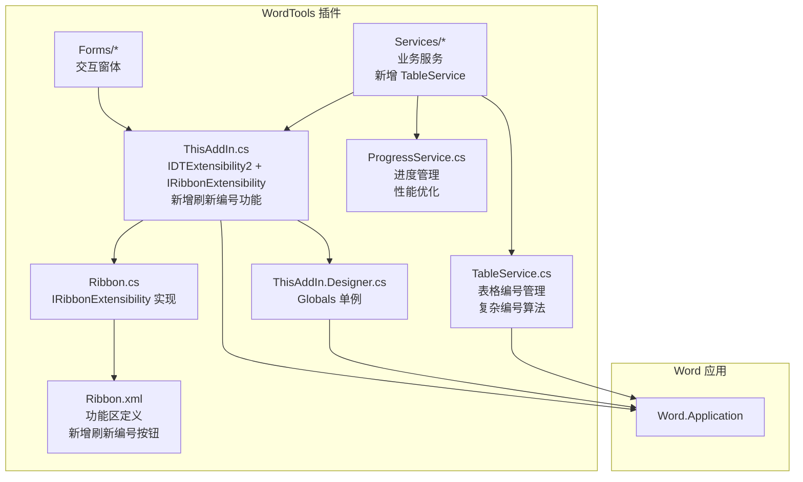
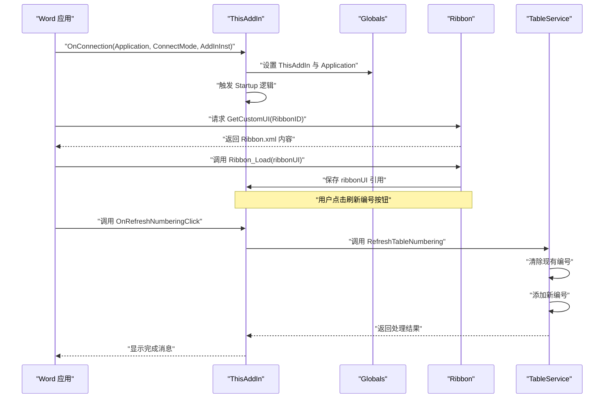
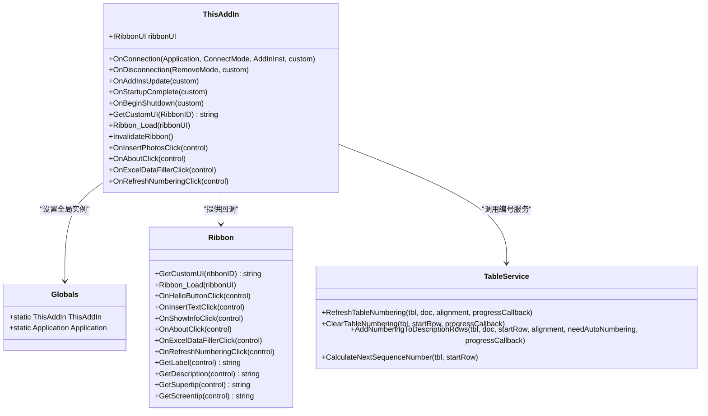
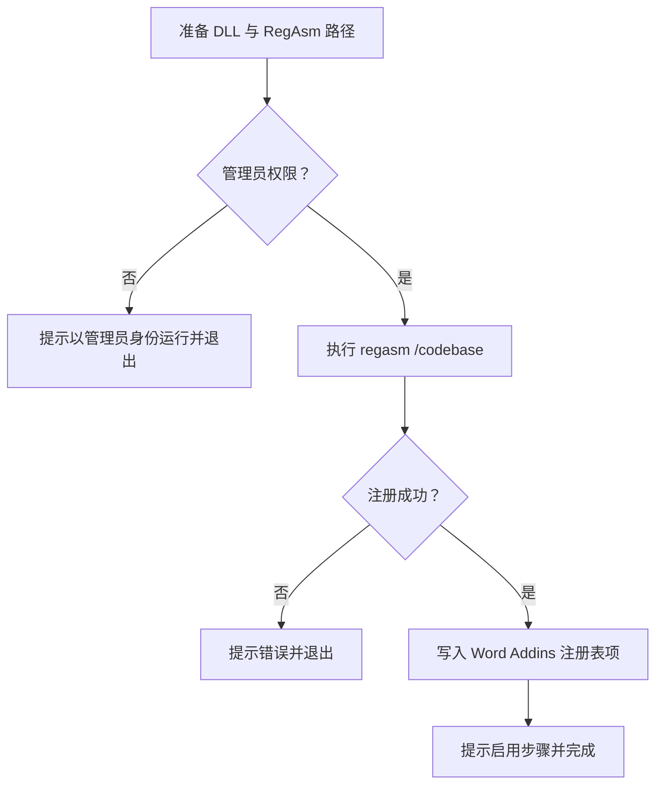
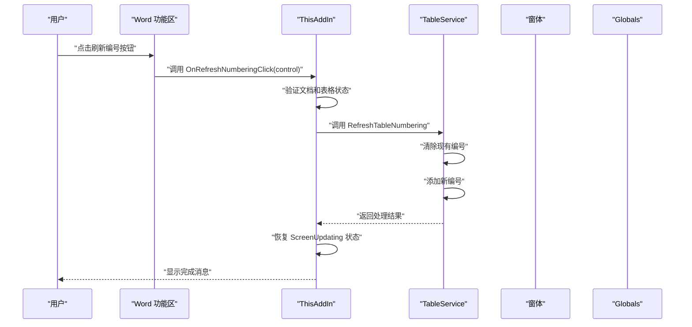
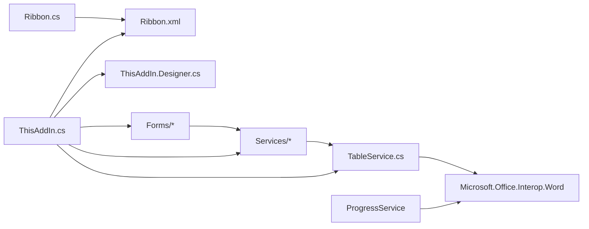

# 插件入口点

<cite>
**本文引用的文件**
- [ThisAddIn.cs](file://WordTools/ThisAddIn.cs)
- [ThisAddIn.Designer.cs](file://WordTools/ThisAddIn.Designer.cs)
- [Ribbon.cs](file://WordTools/Ribbon.cs)
- [Ribbon.xml](file://WordTools/Ribbon.xml)
- [Ribbon.Designer.cs](file://WordTools/Ribbon.Designer.cs)
- [AssemblyInfo.cs](file://WordTools/Properties/AssemblyInfo.cs)
- [WordTools.csproj](file://WordTools/WordTools.csproj)
- [RegisterPlugin.bat](file://RegisterPlugin.bat)
- [RegisterPlugin.ps1](file://RegisterPlugin.ps1)
- [README.md](file://README.md)
- [InsertPhotosForm.cs](file://WordTools/Forms/InsertPhotosForm.cs)
- [ExcelDataFillerForm.cs](file://WordTools/Forms/ExcelDataFillerForm.cs)
- [ConfigService.cs](file://WordTools/Services/ConfigService.cs)
- [FileService.cs](file://WordTools/Services/FileService.cs)
- [TableService.cs](file://WordTools/Services/TableService.cs)
- [ProgressService.cs](file://WordTools/Services/ProgressService.cs)
</cite>

## 更新摘要
**变更内容**
- 新增了强大的表格自动编号刷新功能，支持复杂的编号管理
- 增强了 Ribbon 集成，包括新的刷新编号按钮和改进的资源管理
- 改进了进度显示机制，使用状态栏实时反馈处理进度
- 优化了资源管理，通过 ScreenUpdating 和 StatusBar 控制提升用户体验
- 完善了异常处理策略，提供更好的错误恢复机制

## 目录
1. [简介](#简介)
2. [项目结构](#项目结构)
3. [核心组件](#核心组件)
4. [架构总览](#架构总览)
5. [详细组件分析](#详细组件分析)
6. [依赖关系分析](#依赖关系分析)
7. [性能考虑](#性能考虑)
8. [故障排查指南](#故障排查指南)
9. [结论](#结论)
10. [附录](#附录)

## 简介
本文件聚焦 WordTools 插件的入口点与 COM 组件注册机制，系统性解析 ThisAddIn 类的实现，涵盖 IDTExtensibility2 接口的完整生命周期方法与 IRibbonExtensibility 的回调体系；同时说明 ProgId、Guid 与 ClassInterface 的配置方式，以及 Globals 对象在跨组件间传递 Word 应用实例的作用。文档还提供异常处理策略、调试技巧与常见问题解决方案，并给出最佳实践建议。

**更新** 本版本新增了表格自动编号刷新功能，这是一个重要的增强特性，允许用户在手动增删图片后重新修复表格编号。

## 项目结构
- 插件采用 COM 加载项（IDTExtensibility2）实现，非 VSTO，便于减少外部依赖。
- 关键入口为 ThisAddIn.cs，负责与 Word 应用建立连接、初始化全局上下文、暴露 Ribbon 回调。
- Ribbon.xml 与 Ribbon.cs 共同定义功能区 UI 与回调逻辑。
- 注册脚本通过 RegAsm 与注册表项将插件暴露给 Word。
- 新增的 TableService 提供强大的表格编号管理功能。

**图表来源**
- [ThisAddIn.cs:13-175](file://WordTools/ThisAddIn.cs#L13-L175)
- [ThisAddIn.Designer.cs:22-64](file://WordTools/ThisAddIn.Designer.cs#L22-L64)
- [Ribbon.cs:14-190](file://WordTools/Ribbon.cs#L14-L190)
- [Ribbon.xml:1-62](file://WordTools/Ribbon.xml#L1-L62)
- [TableService.cs:1-1002](file://WordTools/Services/TableService.cs#L1-L1002)
- [ProgressService.cs:1-620](file://WordTools/Services/ProgressService.cs#L1-L620)

**章节来源**
- [README.md:1-85](file://README.md#L1-L85)
- [WordTools.csproj:100-131](file://WordTools/WordTools.csproj#L100-L131)

## 核心组件
- ThisAddIn：COM 加载项入口，实现 IDTExtensibility2 与 IRibbonExtensibility，负责生命周期管理与 Ribbon 回调。
- Globals：静态单例，持有 ThisAddIn 与 Word.Application 实例，供各模块共享。
- Ribbon：功能区回调实现，负责 UI 与交互逻辑。
- TableService：新增的表格服务，提供复杂的自动编号管理功能。
- ProgressService：进度管理服务，优化批量操作性能。
- 注册脚本：RegAsm 注册 COM 组件并写入 Word Addins 注册表项。

**更新** 新增了 TableService 和 ProgressService 两个核心服务组件，提供强大的表格管理和进度控制能力。

**章节来源**
- [ThisAddIn.cs:17-175](file://WordTools/ThisAddIn.cs#L17-L175)
- [ThisAddIn.Designer.cs:22-64](file://WordTools/ThisAddIn.Designer.cs#L22-L64)
- [Ribbon.cs:14-190](file://WordTools/Ribbon.cs#L14-L190)
- [TableService.cs:12-1002](file://WordTools/Services/TableService.cs#L12-L1002)
- [ProgressService.cs:15-620](file://WordTools/Services/ProgressService.cs#L15-L620)
- [RegisterPlugin.bat:1-80](file://RegisterPlugin.bat#L1-L80)
- [RegisterPlugin.ps1:1-87](file://RegisterPlugin.ps1#L1-L87)

## 架构总览
ThisAddIn 作为 COM 组件，通过 IDTExtensibility2 与 Word 建立连接；通过 IRibbonExtensibility 将 Ribbon.xml 资源注入 Word 功能区；Globals 提供全局应用实例，使窗体与服务层无需直接依赖 Word 对象模型。新增的 TableService 提供复杂的表格编号管理，支持多种编号格式和对齐方式。

**图表来源**
- [ThisAddIn.cs:37-61](file://WordTools/ThisAddIn.cs#L37-L61)
- [ThisAddIn.cs:66-81](file://WordTools/ThisAddIn.cs#L66-L81)
- [ThisAddIn.cs:87-101](file://WordTools/ThisAddIn.cs#L87-L101)
- [ThisAddIn.cs:128-179](file://WordTools/ThisAddIn.cs#L128-L179)
- [Ribbon.cs:24-36](file://WordTools/Ribbon.cs#L24-L36)
- [TableService.cs:457-470](file://WordTools/Services/TableService.cs#L457-L470)

## 详细组件分析

### ThisAddIn 类与 COM 组件注册
- COM 可见性与接口配置
  - [ComVisible(true)]：使类对 COM 可见。
  - [Guid(...)]：指定唯一标识，用于 COM 注册与定位。
  - [ProgId("WordTools.ThisAddIn")]：注册表项键名，Word 通过该 ProgId 加载插件。
  - [ClassInterface(ClassInterfaceType.AutoDispatch)]：允许自动化客户端通过 IDispatch 访问成员。
- 生命周期方法
  - OnConnection：保存 Globals 与 Application，触发启动逻辑。
  - OnDisconnection：触发关闭逻辑。
  - OnStartupComplete/OnBeginShutdown：预留扩展点。
- IRibbonExtensibility
  - GetCustomUI：从嵌入资源读取 Ribbon.xml 并返回。
  - Ribbon_Load：缓存 IRibbonUI，供后续刷新状态使用。
  - InvalidateRibbon：主动刷新 Ribbon 状态。
- Ribbon 回调
  - OnInsertPhotosClick：打开批量插图窗体。
  - OnAboutClick：显示关于信息。
  - OnExcelDataFillerClick：打开 Excel 数据填充窗体。
  - **新增** OnRefreshNumberingClick：刷新表格编号功能。

**更新** 新增了 OnRefreshNumberingClick 方法，提供强大的表格编号管理功能。

**图表来源**
- [ThisAddIn.cs:17-175](file://WordTools/ThisAddIn.cs#L17-L175)
- [ThisAddIn.Designer.cs:22-64](file://WordTools/ThisAddIn.Designer.cs#L22-L64)
- [Ribbon.cs:14-190](file://WordTools/Ribbon.cs#L14-L190)
- [TableService.cs:457-470](file://WordTools/Services/TableService.cs#L457-L470)

**章节来源**
- [ThisAddIn.cs:13-175](file://WordTools/ThisAddIn.cs#L13-L175)
- [AssemblyInfo.cs:18-35](file://WordTools/Properties/AssemblyInfo.cs#L18-L35)
- [WordTools.csproj:58-59](file://WordTools/WordTools.csproj#L58-L59)

### Globals 对象与 Word 应用实例
- 设计目的：避免跨模块重复获取 Application，统一管理插件上下文。
- 线程安全：通过内部静态字段与只写 setter 的单次赋值约束，确保仅在 OnConnection 时设置一次。
- 使用场景：窗体与服务层通过 Globals.ThisAddIn.Application 获取 Word 实例，保证一致性。

**图表来源**
- [ThisAddIn.cs:37-42](file://WordTools/ThisAddIn.cs#L37-L42)
- [ThisAddIn.Designer.cs:27-63](file://WordTools/ThisAddIn.Designer.cs#L27-L63)

**章节来源**
- [ThisAddIn.cs:37-42](file://WordTools/ThisAddIn.cs#L37-L42)
- [ThisAddIn.Designer.cs:22-64](file://WordTools/ThisAddIn.Designer.cs#L22-L64)

### 异常处理策略与错误恢复
- 通用策略
  - 对外展示用户友好消息框，避免泄露底层异常细节。
  - 对关键流程（如打开窗体、执行填充、刷新编号）使用 try/catch 包裹。
- 典型场景
  - Excel 数据填充：捕获异常后提示错误并恢复控件可用状态。
  - 批量插图：捕获异常后提示失败原因并关闭对话框。
  - **新增** 刷新编号：捕获异常后显示详细错误信息并恢复应用状态。
- 错误恢复
  - 禁用/启用按钮、重置界面状态，确保 UI 一致性。
  - 对于配置读写异常，采用"忽略并回退默认值"的策略，保障功能可用。
  - **新增** 恢复 ScreenUpdating 状态，确保应用界面恢复正常。

**更新** 新增了刷新编号功能的异常处理策略，包括详细的错误信息显示和应用状态恢复。

**章节来源**
- [ExcelDataFillerForm.cs:331-354](file://WordTools/Forms/ExcelDataFillerForm.cs#L331-L354)
- [InsertPhotosForm.cs:519-523](file://WordTools/Forms/InsertPhotosForm.cs#L519-L523)
- [ThisAddIn.cs:175-179](file://WordTools/ThisAddIn.cs#L175-L179)

### 插件生命周期管理
- OnConnection
  - 初始化 Globals 与 ThisAddIn.Application。
  - 触发启动逻辑（当前实现为空，可扩展）。
- OnDisconnection
  - 触发关闭逻辑（当前实现为空，可扩展）。
- OnStartupComplete/OnBeginShutdown
  - 当前为空实现，可用于资源释放或日志记录。

**章节来源**
- [ThisAddIn.cs:37-61](file://WordTools/ThisAddIn.cs#L37-L61)

### COM 组件注册机制
- ProgId 与注册表
  - 注册表项：HKCU\Software\Microsoft\Office\Word\Addins\WordTools.ThisAddIn
  - 关键值：FriendlyName、Description、LoadBehavior、CommandLineSafe
- RegAsm 注册
  - 使用 /codebase 参数将程序集注册为 COM 组件。
  - 项目构建后输出注册提示，也可通过批处理或 PowerShell 脚本完成。
- 双脚本对比
  - RegisterPlugin.bat：传统批处理，适合快速注册。
  - RegisterPlugin.ps1：增强版脚本，具备管理员权限检查与更清晰输出。

**图表来源**
- [RegisterPlugin.bat:8-62](file://RegisterPlugin.bat#L8-L62)
- [RegisterPlugin.ps1:11-70](file://RegisterPlugin.ps1#L11-L70)

**章节来源**
- [RegisterPlugin.bat:1-80](file://RegisterPlugin.bat#L1-L80)
- [RegisterPlugin.ps1:1-87](file://RegisterPlugin.ps1#L1-L87)
- [README.md:30-75](file://README.md#L30-L75)

### Ribbon 回调与窗体交互
- 功能区定义
  - Ribbon.xml：声明选项卡、分组与按钮，绑定 onAction 回调。
  - Ribbon.cs：实现 IRibbonExtensibility 与回调方法，提供标签、描述、屏幕提示等本地化。
- 回调方法
  - OnInsertPhotosClick：打开 InsertPhotosForm 并传入 Globals.Application。
  - OnExcelDataFillerClick：打开 ExcelDataFillerForm。
  - OnAboutClick：显示版本与版权信息。
  - **新增** OnRefreshNumberingClick：刷新表格编号，支持复杂编号管理。
- 状态刷新
  - InvalidateRibbon：在必要时刷新 Ribbon 状态。

**更新** 新增了 OnRefreshNumberingClick 方法，提供强大的表格编号刷新功能。

**图表来源**
- [Ribbon.xml:20-27](file://WordTools/Ribbon.xml#L20-L27)
- [ThisAddIn.cs:128-179](file://WordTools/ThisAddIn.cs#L128-L179)
- [TableService.cs:457-470](file://WordTools/Services/TableService.cs#L457-L470)

**章节来源**
- [Ribbon.xml:1-62](file://WordTools/Ribbon.xml#L1-L62)
- [Ribbon.cs:24-163](file://WordTools/Ribbon.cs#L24-L163)
- [ThisAddIn.cs:87-172](file://WordTools/ThisAddIn.cs#L87-L172)

### 新增：表格自动编号刷新功能
- 功能概述
  - 支持复杂的表格编号管理，包括 Word 原生列表编号、SEQ 域和文本编号方式。
  - 提供增量和全表两种刷新模式，支持自定义对齐方式。
  - 实时进度反馈，通过状态栏显示处理进度。
- 核心算法
  - ClearTableNumbering：清除现有编号，支持多种编号格式。
  - AddNumberingToDescriptionRows：在描述行添加自动编号。
  - CalculateNextSequenceNumber：计算下一个序列号起始值。
- 进度管理
  - 使用 ProgressService 提供性能优化。
  - 支持取消操作，检测 ESC 键状态。
  - 实时更新状态栏，提供详细的处理信息。

**新增** 这是一个全新的核心功能，提供了强大的表格编号管理能力。

**章节来源**
- [TableService.cs:457-470](file://WordTools/Services/TableService.cs#L457-L470)
- [TableService.cs:475-649](file://WordTools/Services/TableService.cs#L475-L649)
- [TableService.cs:661-815](file://WordTools/Services/TableService.cs#L661-L815)
- [TableService.cs:820-872](file://WordTools/Services/TableService.cs#L820-L872)
- [TableService.cs:906-964](file://WordTools/Services/TableService.cs#L906-L964)
- [ProgressService.cs:15-620](file://WordTools/Services/ProgressService.cs#L15-L620)

## 依赖关系分析
- ThisAddIn 依赖
  - Word Interop 与 Office 核心类型（IDTExtensibility2、IRibbonExtensibility）。
  - 窗体与服务层（InsertPhotosForm、ExcelDataFillerForm、ConfigService、FileService）。
  - **新增** TableService：提供表格编号管理功能。
- 项目配置
  - 目标框架 .NET Framework 4.8。
  - COM 互操作与 Office PIA 引用。
  - Ribbon.xml 作为嵌入资源参与功能区渲染。
- 服务层依赖
  - TableService 依赖 Microsoft.Office.Interop.Word。
  - ProgressService 提供性能优化和取消控制。

**更新** 新增了 TableService 和 ProgressService 的依赖关系，增强了服务层架构。

**图表来源**
- [WordTools.csproj:63-88](file://WordTools/WordTools.csproj#L63-L88)
- [WordTools.csproj:127-131](file://WordTools/WordTools.csproj#L127-L131)
- [TableService.cs:1-10](file://WordTools/Services/TableService.cs#L1-L10)
- [ProgressService.cs:1-7](file://WordTools/Services/ProgressService.cs#L1-L7)

**章节来源**
- [WordTools.csproj:100-149](file://WordTools/WordTools.csproj#L100-L149)

## 性能考虑
- UI 刷新
  - 通过 Ribbon.Invalidate() 手动刷新，避免不必要的重绘。
  - **新增** 使用 Application.ScreenUpdating 控制界面刷新，提升性能。
- 资源释放
  - 在 OnDisconnection 中预留清理逻辑，释放大对象或订阅事件。
  - **新增** 确保在异常情况下也能恢复应用状态。
- 线程模型
  - COM 对象需在 STA 线程访问，确保与 Word 互操作稳定。
- **新增** 进度优化
  - 使用 ProgressService 提供性能监控和优化。
  - 支持内存管理和垃圾回收控制。
  - 实时取消支持，提升用户体验。

**更新** 新增了多项性能优化措施，包括进度管理和资源控制。

**章节来源**
- [ThisAddIn.cs:158-171](file://WordTools/ThisAddIn.cs#L158-L171)
- [ProgressService.cs:15-620](file://WordTools/Services/ProgressService.cs#L15-L620)

## 故障排查指南
- 插件未出现在 Word 加载项中
  - 确认以管理员身份运行注册脚本。
  - 检查 ProgId 是否正确写入注册表。
  - 重启 Word 并在"文件 → 选项 → 加载项"中启用。
- 注册失败
  - 确认 RegAsm 路径与 DLL 路径正确。
  - 检查 .NET Framework 版本与平台目标（AnyCPU）。
- Ribbon 无法加载
  - 确认 Ribbon.xml 已嵌入资源且命名正确。
  - 检查 GetCustomUI 返回值与资源读取逻辑。
- 窗体异常
  - 查看异常捕获分支，确认错误消息是否显示。
  - 验证 Globals.Application 是否为空。
- **新增** 刷新编号失败
  - 确认文档已打开且光标位于表格中。
  - 检查表格结构是否符合要求。
  - 验证是否有足够的权限进行编号操作。
  - 查看状态栏显示的详细错误信息。

**更新** 新增了刷新编号功能的故障排查指南。

**章节来源**
- [RegisterPlugin.bat:8-62](file://RegisterPlugin.bat#L8-L62)
- [RegisterPlugin.ps1:11-70](file://RegisterPlugin.ps1#L11-L70)
- [ThisAddIn.cs:66-81](file://WordTools/ThisAddIn.cs#L66-L81)
- [ExcelDataFillerForm.cs:331-354](file://WordTools/Forms/ExcelDataFillerForm.cs#L331-L354)
- [ThisAddIn.cs:175-179](file://WordTools/ThisAddIn.cs#L175-L179)

## 结论
ThisAddIn 以简洁的 COM 加载项架构实现了与 Word 的深度集成，结合 Globals 上下文与 Ribbon 回调体系，提供了稳定的用户体验。通过规范的异常处理与注册流程，插件具备良好的可维护性与可部署性。

**更新** 新版本显著增强了功能，特别是新增的表格自动编号刷新功能，提供了强大的表格管理能力。通过 ProgressService 和改进的资源管理，提升了性能和用户体验。建议在 OnStartupComplete/OnBeginShutdown 中补充资源管理与日志记录，进一步提升健壮性。

## 附录
- 最佳实践
  - 在启动阶段延迟初始化重型资源，避免影响 Word 启动速度。
  - 使用配置服务集中管理用户偏好，支持文档级与全局级配置。
  - 对外部文件操作（如图片、Excel）增加输入校验与进度反馈。
  - **新增** 在处理大量数据时使用 ProgressService 提供性能监控。
  - **新增** 合理使用 Application.ScreenUpdating 控制界面刷新。
- 调试技巧
  - 使用 Visual Studio 直接调试（F5），自动注册并附加到 Word。
  - 在关键回调中输出日志或消息框，定位异常位置。
  - 通过任务管理器确认 Word 进程完全退出后再重新启用插件。
  - **新增** 利用状态栏实时监控处理进度，便于调试和优化。
- **新增** 使用建议
  - 刷新编号功能适用于手动增删图片后的编号修复。
  - 支持多种对齐方式，可根据需要调整编号显示效果。
  - 大表格处理时建议使用增量模式，避免长时间锁定界面。

**更新** 新增了关于新功能的使用建议和调试技巧。