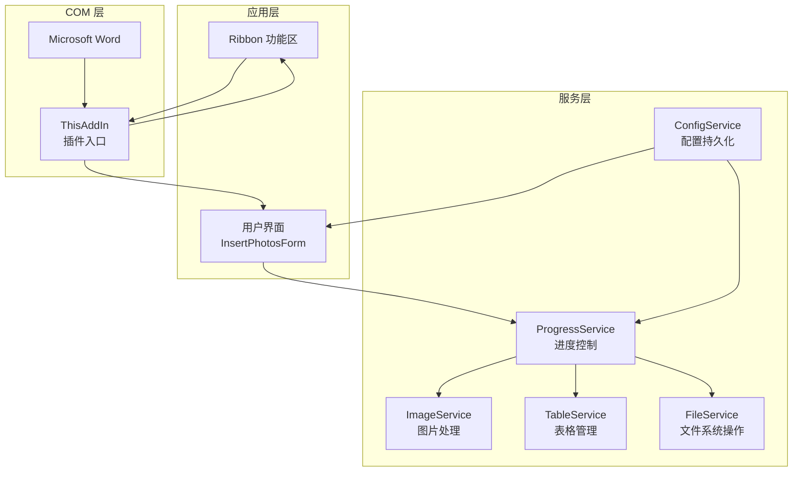
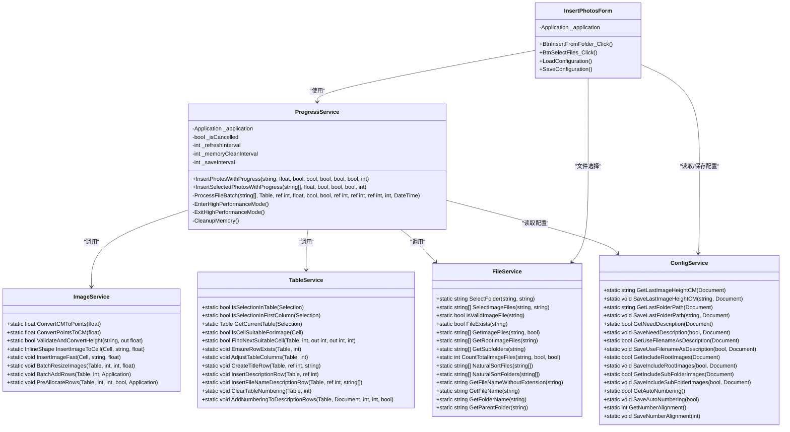
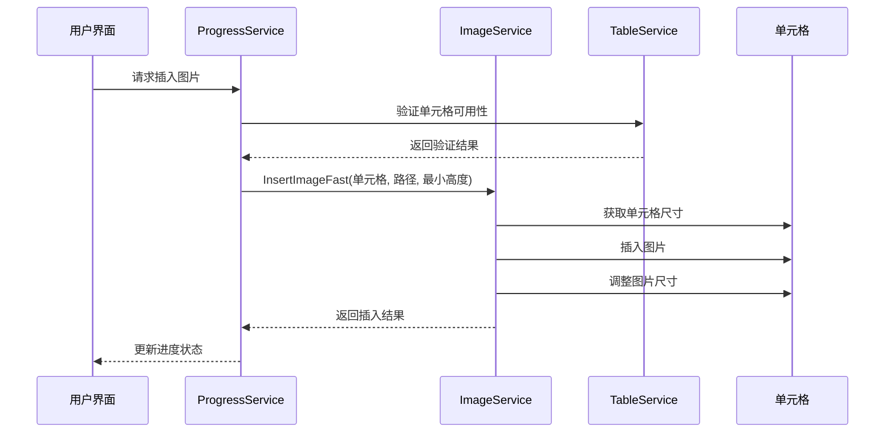
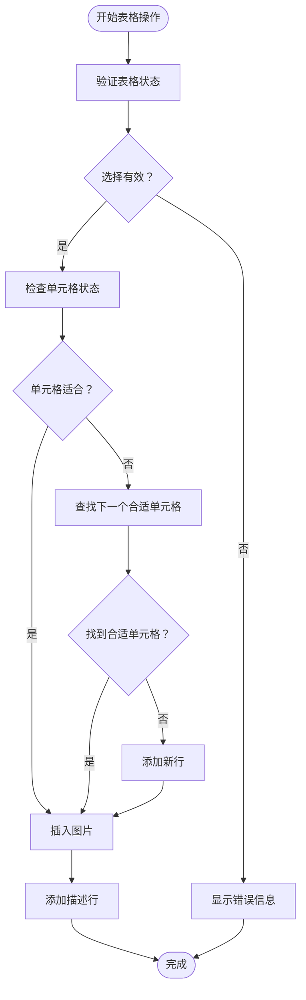
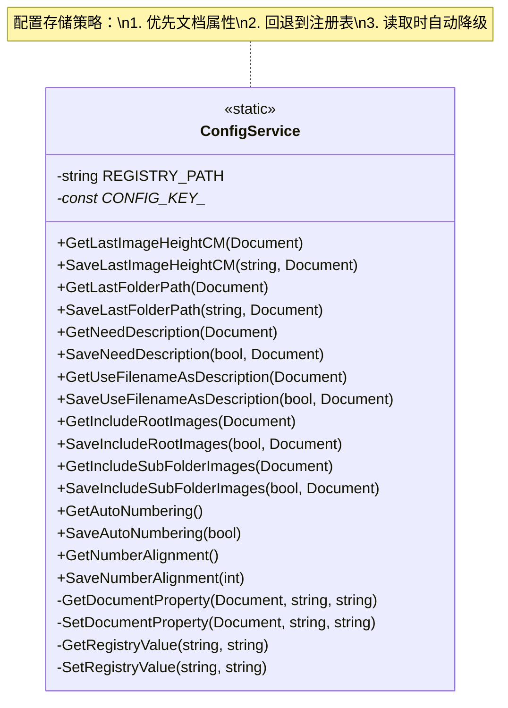
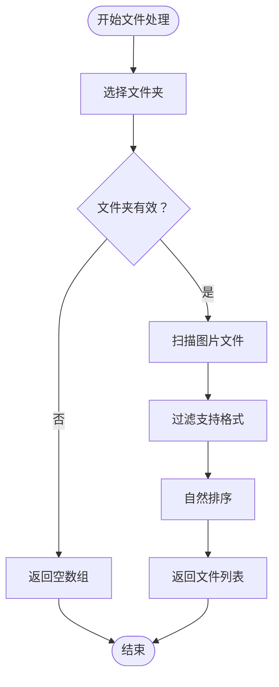
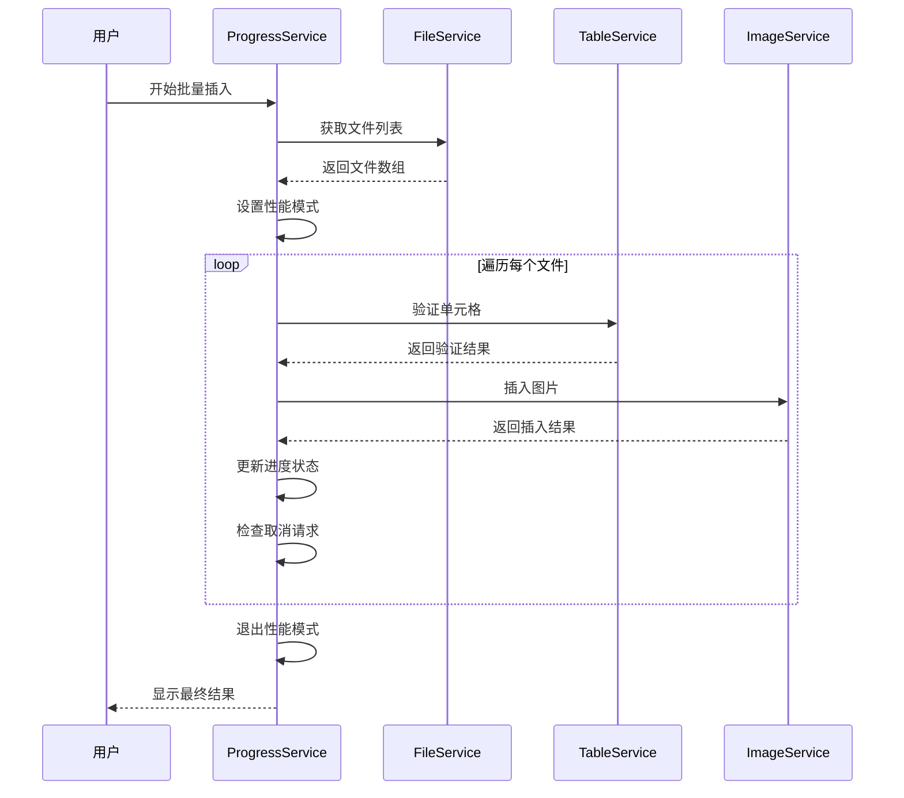
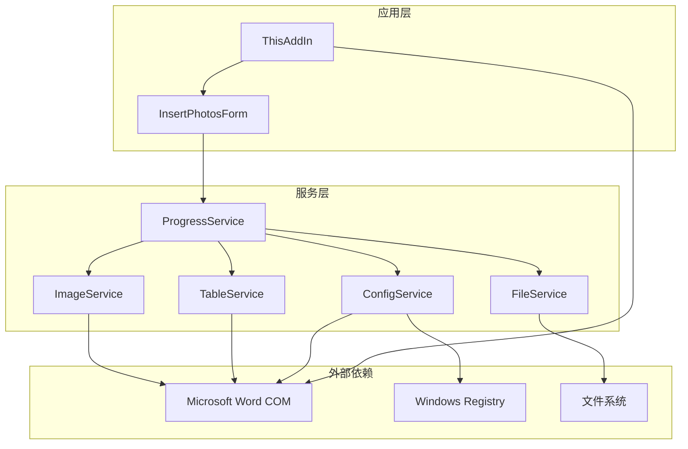

# 服务层架构设计

<cite>
**本文档引用的文件**
- [ImageService.cs](file://WordTools/Services/ImageService.cs)
- [TableService.cs](file://WordTools/Services/TableService.cs)
- [ConfigService.cs](file://WordTools/Services/ConfigService.cs)
- [FileService.cs](file://WordTools/Services/FileService.cs)
- [ProgressService.cs](file://WordTools/Services/ProgressService.cs)
- [InsertPhotosForm.cs](file://WordTools/Forms/InsertPhotosForm.cs)
- [ThisAddIn.cs](file://WordTools/ThisAddIn.cs)
- [Ribbon.cs](file://WordTools/Ribbon.cs)
- [README.md](file://README.md)
</cite>

## 目录
1. [简介](#简介)
2. [项目结构](#项目结构)
3. [核心组件](#核心组件)
4. [架构概览](#架构概览)
5. [详细组件分析](#详细组件分析)
6. [依赖关系分析](#依赖关系分析)
7. [性能考虑](#性能考虑)
8. [故障排除指南](#故障排除指南)
9. [结论](#结论)
10. [附录](#附录)

## 简介

WordTools 是一个基于 COM 加载项的 Microsoft Word 插件，提供了批量图片插入、表格管理和自动编号等功能。本文档深入分析其服务层架构设计，重点阐述静态服务类的组织方式、依赖注入策略以及各服务组件的职责划分。

该插件采用模块化的服务层架构，通过五个核心服务组件协同工作：ImageService（图片处理）、TableService（表格管理）、ConfigService（配置持久化）、FileService（文件系统操作）和 ProgressService（进度控制）。这种设计确保了代码的可维护性和可扩展性。

## 项目结构

WordTools 项目采用清晰的分层架构，主要包含以下结构：

**图表来源**
- [ThisAddIn.cs:17-82](file://WordTools/ThisAddIn.cs#L17-L82)
- [InsertPhotosForm.cs:18-57](file://WordTools/Forms/InsertPhotosForm.cs#L18-L57)

**章节来源**
- [README.md:47-60](file://README.md#L47-L60)
- [ThisAddIn.cs:17-82](file://WordTools/ThisAddIn.cs#L17-L82)

## 核心组件

服务层由五个核心组件构成，每个组件都有明确的职责边界：

### ImageService - 图片处理服务
负责图片的插入、尺寸调整和批量处理功能，提供静态方法接口，便于全局访问。

### TableService - 表格管理服务
处理表格验证、单元格检查、自动编号和表格结构管理等操作。

### ConfigService - 配置持久化服务
管理文档自定义属性和注册表配置，提供统一的配置存储和读取机制。

### FileService - 文件系统服务
封装文件选择、验证和批量文件获取功能，支持自然排序和文件过滤。

### ProgressService - 进度控制服务
提供批量操作的进度跟踪、性能优化和取消机制，确保用户体验流畅。

**章节来源**
- [ImageService.cs:10-325](file://WordTools/Services/ImageService.cs#L10-L325)
- [TableService.cs:11-756](file://WordTools/Services/TableService.cs#L11-L756)
- [ConfigService.cs:11-362](file://WordTools/Services/ConfigService.cs#L11-L362)
- [FileService.cs:13-310](file://WordTools/Services/FileService.cs#L13-L310)
- [ProgressService.cs:14-571](file://WordTools/Services/ProgressService.cs#L14-L571)

## 架构概览

服务层采用静态服务类与实例服务相结合的设计模式：

**图表来源**
- [ImageService.cs:10-325](file://WordTools/Services/ImageService.cs#L10-L325)
- [TableService.cs:11-756](file://WordTools/Services/TableService.cs#L11-L756)
- [ConfigService.cs:11-362](file://WordTools/Services/ConfigService.cs#L11-L362)
- [FileService.cs:13-310](file://WordTools/Services/FileService.cs#L13-L310)
- [ProgressService.cs:14-571](file://WordTools/Services/ProgressService.cs#L14-L571)
- [InsertPhotosForm.cs:18-618](file://WordTools/Forms/InsertPhotosForm.cs#L18-L618)

## 详细组件分析

### ImageService - 图片处理逻辑

ImageService 采用静态类设计，提供完整的图片处理功能：

#### 核心功能模块

**尺寸转换模块**
- 长度单位转换：厘米与磅之间的双向转换
- 输入验证：确保高度输入的有效性
- 自动转换：将用户输入转换为 Word 可识别的磅值

**图片插入模块**
- 标准插入：完整尺寸调整和边距处理
- 快速插入：优化性能的简化插入流程
- 批量处理：支持表格内图片的批量调整

**批量操作模块**
- 行预分配：根据图片数量预估表格行数
- 批量重置：统一调整表格内所有图片尺寸
- 性能优化：批量操作时的内存管理和刷新控制

**图表来源**
- [ProgressService.cs:412-533](file://WordTools/Services/ProgressService.cs#L412-L533)
- [ImageService.cs:142-180](file://WordTools/Services/ImageService.cs#L142-L180)

**章节来源**
- [ImageService.cs:10-325](file://WordTools/Services/ImageService.cs#L10-L325)

### TableService - 表格管理功能

TableService 提供全面的表格操作能力：

#### 表格验证体系
- 选择验证：确认当前选择确实在表格内
- 列验证：检查是否位于第一列
- 单元格验证：评估单元格是否适合插入图片

#### 表格结构管理
- 行管理：动态添加和调整行数
- 列管理：根据需要调整列数
- 固定列宽：优化表格显示效果

#### 自动编号系统
- 编号清理：移除现有编号格式
- 编号创建：为描述行添加自动编号
- 对齐控制：支持多种对齐方式

**图表来源**
- [TableService.cs:128-196](file://WordTools/Services/TableService.cs#L128-L196)
- [TableService.cs:446-559](file://WordTools/Services/TableService.cs#L446-L559)

**章节来源**
- [TableService.cs:11-756](file://WordTools/Services/TableService.cs#L11-L756)

### ConfigService - 配置持久化

ConfigService 实现了双层配置存储机制：

#### 配置存储策略
**文档级配置**：存储在 Word 文档的自定义属性中
- 优势：配置随文档一起保存
- 适用：用户偏好设置、最近使用的参数

**应用级配置**：存储在 Windows 注册表中
- 优势：跨文档共享配置
- 适用：全局设置、系统级参数

#### 配置键管理
- 图片高度配置：LastImageHeightCM
- 文件夹路径：LastFolderPath
- 描述行设置：NeedDescription, UseFilenameAsDescription
- 文件范围：IncludeRootImages, IncludeSubFolderImages
- 自动编号：AutoNumbering, NumberAlignment

**图表来源**
- [ConfigService.cs:11-362](file://WordTools/Services/ConfigService.cs#L11-L362)

**章节来源**
- [ConfigService.cs:11-362](file://WordTools/Services/ConfigService.cs#L11-L362)

### FileService - 文件系统操作

FileService 提供完整的文件操作功能：

#### 文件选择功能
- 文件夹选择：支持 FolderBrowserDialog
- 图片文件选择：支持多选和过滤
- 初始路径设置：智能路径记忆

#### 文件验证系统
- 格式验证：支持 JPG、JPEG、PNG 格式
- 存在性检查：确保文件路径有效
- 扩展名标准化：统一文件扩展名格式

#### 文件枚举功能
- 根目录扫描：仅扫描指定文件夹
- 子目录递归：支持深度遍历
- 自然排序：类似资源管理器的排序算法

**图表来源**
- [FileService.cs:117-134](file://WordTools/Services/FileService.cs#L117-L134)
- [FileService.cs:197-236](file://WordTools/Services/FileService.cs#L197-L236)

**章节来源**
- [FileService.cs:13-310](file://WordTools/Services/FileService.cs#L13-L310)

### ProgressService - 进度控制机制

ProgressService 是服务层的核心协调者：

#### 性能优化策略
**高性能模式**
- 屏幕更新关闭：减少 UI 刷新开销
- 警告提示禁用：避免弹窗干扰
- 拼写检查优化：临时禁用拼写检查

**内存管理**
- 定期垃圾回收：控制内存使用峰值
- 事件处理优化：避免阻塞 UI 线程
- 批量处理策略：分批处理大量数据

#### 进度跟踪系统
**实时进度显示**
- 百分比计算：准确反映处理进度
- 时间估算：剩余时间预测
- 当前文件显示：实时反馈处理状态

**取消机制**
- ESC 键检测：支持键盘取消
- 异步取消：立即响应用户操作
- 完整回滚：确保操作一致性

**图表来源**
- [ProgressService.cs:151-306](file://WordTools/Services/ProgressService.cs#L151-L306)
- [ProgressService.cs:412-533](file://WordTools/Services/ProgressService.cs#L412-L533)

**章节来源**
- [ProgressService.cs:14-571](file://WordTools/Services/ProgressService.cs#L14-L571)

## 依赖关系分析

服务层采用松耦合设计，通过明确的接口边界实现组件间通信：

**图表来源**
- [InsertPhotosForm.cs:557-561](file://WordTools/Forms/InsertPhotosForm.cs#L557-L561)
- [ProgressService.cs:33-36](file://WordTools/Services/ProgressService.cs#L33-L36)

### 依赖注入策略

服务层采用混合依赖注入模式：

**构造函数注入**
- ProgressService 通过构造函数接收 Application 对象
- 确保服务实例与 Word 应用程序正确关联

**静态服务调用**
- ImageService、TableService、ConfigService、FileService 采用静态方法
- 便于全局访问，无需实例化

**配置注入**
- ProgressService 通过 ConfigService 读取用户偏好设置
- 支持运行时配置变更

**章节来源**
- [ProgressService.cs:33-36](file://WordTools/Services/ProgressService.cs#L33-L36)
- [InsertPhotosForm.cs:557-561](file://WordTools/Forms/InsertPhotosForm.cs#L557-L561)

## 性能考虑

服务层在设计时充分考虑了性能优化：

### 内存管理策略
- **延迟加载**：仅在需要时创建对象实例
- **批量处理**：分批处理大量数据，避免内存峰值
- **及时释放**：使用 using 语句确保资源及时释放

### 线程安全设计
- **UI 线程保护**：所有 COM 操作都在 UI 线程执行
- **异步处理**：长耗时操作使用异步模式
- **状态同步**：通过 Application.DoEvents() 保持 UI 响应

### 缓存机制
- **配置缓存**：ConfigService 缓存常用配置值
- **文件列表缓存**：避免重复文件系统扫描
- **COM 对象缓存**：复用 Word 对象引用

### 性能监控
- **进度反馈**：实时显示处理进度和剩余时间
- **性能指标**：记录关键操作的执行时间
- **资源使用**：监控内存和 CPU 使用情况

**章节来源**
- [ProgressService.cs:73-142](file://WordTools/Services/ProgressService.cs#L73-L142)
- [ImageService.cs:253-277](file://WordTools/Services/ImageService.cs#L253-L277)

## 故障排除指南

### 常见问题及解决方案

**图片插入失败**
- 检查文件路径有效性
- 验证文件格式支持
- 确认单元格空间充足

**表格操作异常**
- 确认光标位于表格内
- 检查表格结构完整性
- 验证权限设置

**配置读取错误**
- 检查文档自定义属性
- 验证注册表访问权限
- 确认配置键存在

### 错误处理策略

服务层采用多层次错误处理：

**服务内部处理**
- 捕获并忽略局部错误
- 继续处理后续任务
- 记录错误日志

**用户友好提示**
- 显示清晰的错误信息
- 提供可能的解决方案
- 保持应用程序稳定性

**恢复机制**
- 自动回滚部分操作
- 恢复原始状态
- 提供重试选项

**章节来源**
- [ImageService.cs:130-134](file://WordTools/Services/ImageService.cs#L130-L134)
- [TableService.cs:119-123](file://WordTools/Services/TableService.cs#L119-L123)
- [ProgressService.cs:281-285](file://WordTools/Services/ProgressService.cs#L281-L285)

## 结论

WordTools 的服务层架构展现了优秀的软件工程实践：

### 设计优势
- **模块化设计**：每个服务职责单一，易于维护
- **松耦合架构**：组件间依赖关系清晰，便于测试
- **性能优化**：内置多种性能优化策略
- **扩展性强**：新的服务可以轻松集成

### 架构特点
- **静态服务类**：提供便捷的全局访问
- **实例服务**：支持复杂状态管理
- **配置驱动**：通过配置实现灵活定制
- **错误容错**：多层次错误处理机制

### 最佳实践
- 服务间通过明确的接口通信
- 遵循单一职责原则
- 实现适当的抽象层次
- 提供完善的错误处理

## 附录

### 服务层扩展指南

**添加新服务步骤**
1. 创建新的服务类文件
2. 定义公共接口方法
3. 实现业务逻辑
4. 在需要的地方注入服务
5. 添加相应的配置项

**维护现有服务建议**
- 定期重构代码结构
- 更新错误处理机制
- 优化性能表现
- 扩展功能特性

**性能优化建议**
- 实施缓存策略
- 优化数据库查询
- 减少不必要的对象创建
- 使用异步编程模式