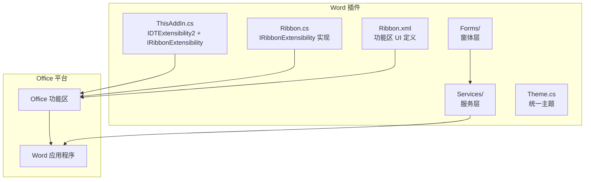
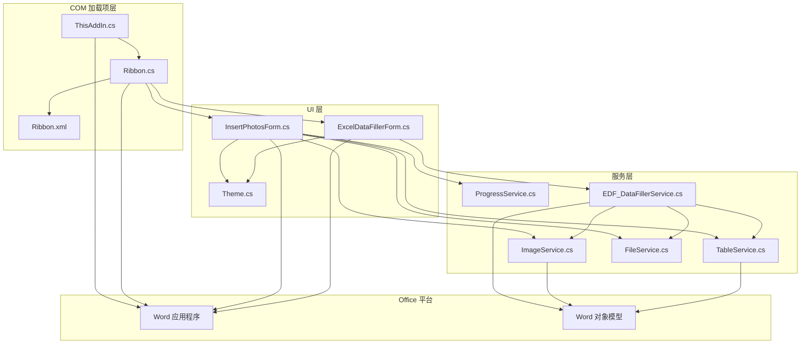
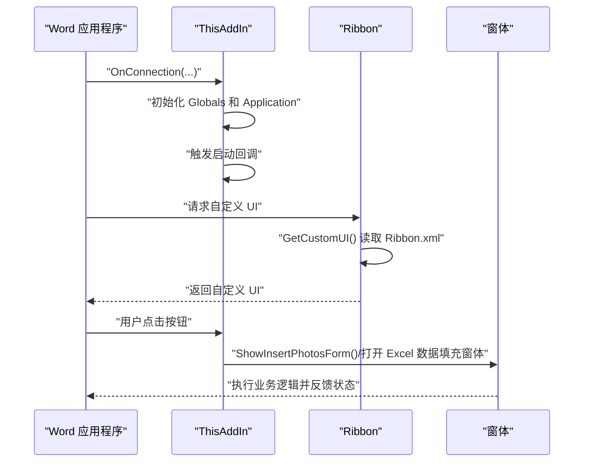
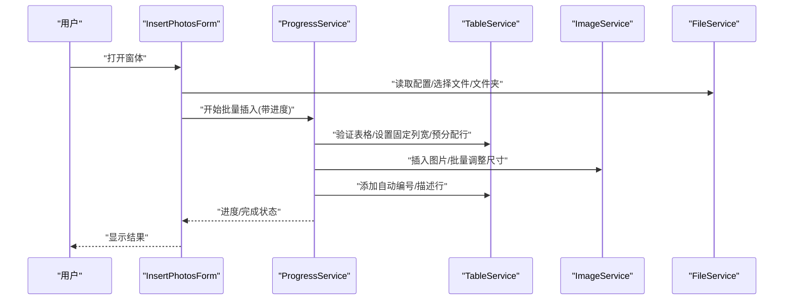
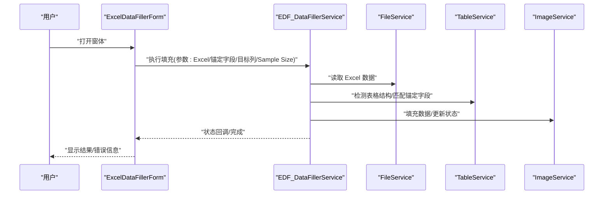
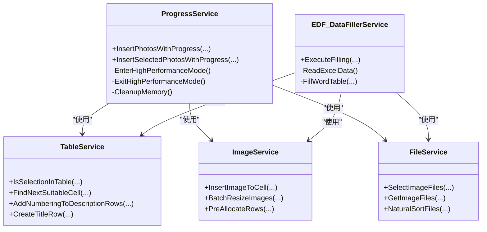
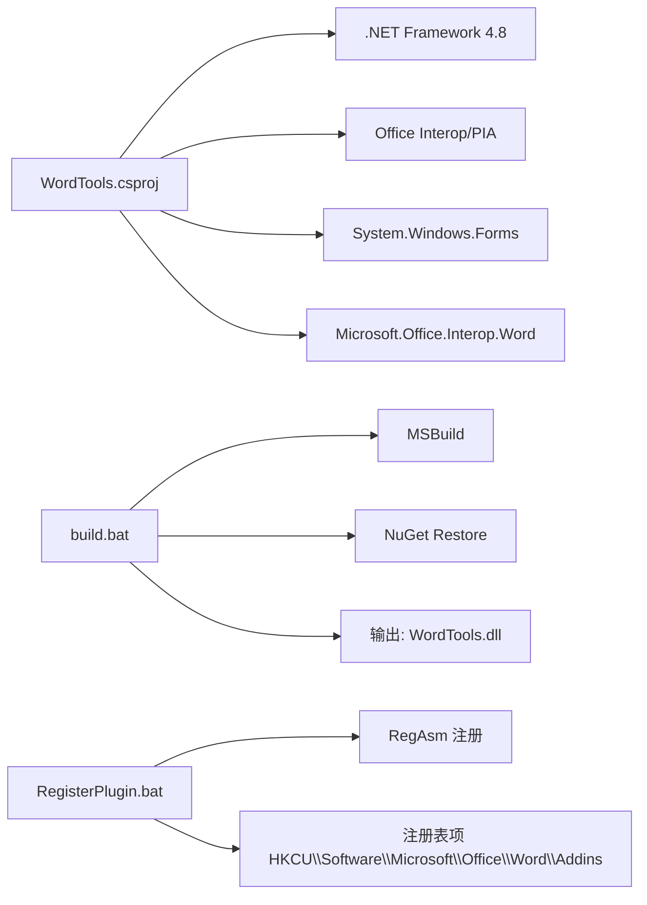

# 架构设计

<cite>
**本文引用的文件**
- [ThisAddIn.cs](file://WordTools/ThisAddIn.cs)
- [Ribbon.cs](file://WordTools/Ribbon.cs)
- [Ribbon.xml](file://WordTools/Ribbon.xml)
- [WordTools.csproj](file://WordTools/WordTools.csproj)
- [InsertPhotosForm.cs](file://WordTools/Forms/InsertPhotosForm.cs)
- [ExcelDataFillerForm.cs](file://WordTools/Forms/ExcelDataFillerForm.cs)
- [EDF_DataFillerService.cs](file://WordTools/Services/EDF_DataFillerService.cs)
- [TableService.cs](file://WordTools/Services/TableService.cs)
- [ImageService.cs](file://WordTools/Services/ImageService.cs)
- [ProgressService.cs](file://WordTools/Services/ProgressService.cs)
- [FileService.cs](file://WordTools/Services/FileService.cs)
- [Theme.cs](file://WordTools/Theme.cs)
- [build.bat](file://build.bat)
- [RegisterPlugin.bat](file://RegisterPlugin.bat)
- [README.md](file://README.md)
</cite>

## 目录
1. [引言](#引言)
2. [项目结构](#项目结构)
3. [核心组件](#核心组件)
4. [架构总览](#架构总览)
5. [详细组件分析](#详细组件分析)
6. [依赖关系分析](#依赖关系分析)
7. [性能考量](#性能考量)
8. [故障排查指南](#故障排查指南)
9. [结论](#结论)
10. [附录](#附录)

## 引言
本项目为一个基于 COM 加载项的 Word 插件，采用 IDTExtensibility2 接口作为主入口，并通过 Office 功能区（Ribbon）提供图形化交互。插件提供“批量插图”和“Excel 数据填充”两大核心功能，配合统一主题与服务层实现良好的用户体验与可维护性。

项目明确选择了 COM 加载项而非 VSTO，原因在于减少运行时依赖、降低安装复杂度，但需要手动注册 COM 组件与加载项注册表项。

## 项目结构
项目采用“功能区 + 窗体 + 服务层”的分层组织方式：
- 入口与功能区：ThisAddIn.cs、Ribbon.cs、Ribbon.xml
- 窗体层：InsertPhotosForm.cs、ExcelDataFillerForm.cs
- 服务层：EDF_DataFillerService.cs、TableService.cs、ImageService.cs、ProgressService.cs、FileService.cs
- 主题与样式：Theme.cs
- 构建与注册：build.bat、RegisterPlugin.bat
- 项目配置：WordTools.csproj
- 说明文档：README.md

**图表来源**
- [ThisAddIn.cs:17-173](file://WordTools/ThisAddIn.cs#L17-L173)
- [Ribbon.cs:14-188](file://WordTools/Ribbon.cs#L14-L188)
- [Ribbon.xml:1-53](file://WordTools/Ribbon.xml#L1-L53)

**章节来源**
- [WordTools.csproj:1-149](file://WordTools/WordTools.csproj#L1-L149)
- [README.md:1-85](file://README.md#L1-L85)

## 核心组件
- ThisAddIn 主入口类
  - 实现 IDTExtensibility2：负责插件生命周期（连接、断开、启动完成、关闭开始）
  - 实现 IRibbonExtensibility：动态加载 Ribbon.xml 资源，提供 GetCustomUI
  - 提供 Ribbon 回调入口：按钮点击、窗体展示、Ribbon 状态刷新
- Ribbon 功能区实现
  - 通过 Ribbon.cs 实现 IRibbonExtensibility，加载 Ribbon.xml
  - 提供按钮回调（插入文本、显示信息、关于、Excel 数据填充等）
  - 提供标签、描述、气球提示等本地化文本回调
- 窗体层
  - InsertPhotosForm：批量插图主窗体，支持文件夹/文件选择、高度限制、描述行、自动编号、对齐方式等
  - ExcelDataFillerForm：Excel 数据填充工具，支持锚定字段、目标列、Sample Size 替换、状态输出
- 服务层
  - ProgressService：批量操作进度与性能优化（状态栏、内存回收、高性能模式）
  - TableService：表格验证、自动编号、标题行/描述行、列宽与行数管理
  - ImageService：图片插入、尺寸转换、批量调整、预分配行
  - FileService：文件夹/文件选择、扩展名校验、自然排序、统计
  - EDF_DataFillerService：Excel 读取、锚定字段匹配、表格结构检测与填充、状态回调
- 主题与样式 Theme：统一颜色、字体、布局、控件样式与 DPI 缩放

**章节来源**
- [ThisAddIn.cs:17-173](file://WordTools/ThisAddIn.cs#L17-L173)
- [Ribbon.cs:14-188](file://WordTools/Ribbon.cs#L14-L188)
- [Ribbon.xml:1-53](file://WordTools/Ribbon.xml#L1-L53)
- [InsertPhotosForm.cs:1-574](file://WordTools/Forms/InsertPhotosForm.cs#L1-L574)
- [ExcelDataFillerForm.cs:1-432](file://WordTools/Forms/ExcelDataFillerForm.cs#L1-L432)
- [ProgressService.cs:1-571](file://WordTools/Services/ProgressService.cs#L1-L571)
- [TableService.cs:1-756](file://WordTools/Services/TableService.cs#L1-L756)
- [ImageService.cs:1-325](file://WordTools/Services/ImageService.cs#L1-L325)
- [FileService.cs:1-310](file://WordTools/Services/FileService.cs#L1-L310)
- [EDF_DataFillerService.cs:1-564](file://WordTools/Services/EDF_DataFillerService.cs#L1-L564)
- [Theme.cs:1-358](file://WordTools/Theme.cs#L1-L358)

## 架构总览
本项目采用“COM 加载项 + Office 功能区 + WinForms 窗体 + 服务层”的分层架构：
- COM 加载项层：ThisAddIn 作为宿主，承载插件生命周期与 Ribbon 回调
- UI 层：Ribbon.xml 定义 UI 结构；Ribbon.cs 提供回调；WinForms 窗体提供复杂交互
- 业务层：服务层封装具体业务逻辑（表格、图片、文件、进度、Excel 填充）
- Office 平台：通过 Interop 访问 Word 应用与文档对象模型

**图表来源**
- [ThisAddIn.cs:17-173](file://WordTools/ThisAddIn.cs#L17-L173)
- [Ribbon.cs:14-188](file://WordTools/Ribbon.cs#L14-L188)
- [Ribbon.xml:1-53](file://WordTools/Ribbon.xml#L1-L53)
- [InsertPhotosForm.cs:1-574](file://WordTools/Forms/InsertPhotosForm.cs#L1-L574)
- [ExcelDataFillerForm.cs:1-432](file://WordTools/Forms/ExcelDataFillerForm.cs#L1-L432)
- [ProgressService.cs:1-571](file://WordTools/Services/ProgressService.cs#L1-L571)
- [TableService.cs:1-756](file://WordTools/Services/TableService.cs#L1-L756)
- [ImageService.cs:1-325](file://WordTools/Services/ImageService.cs#L1-L325)
- [FileService.cs:1-310](file://WordTools/Services/FileService.cs#L1-L310)
- [EDF_DataFillerService.cs:1-564](file://WordTools/Services/EDF_DataFillerService.cs#L1-L564)

## 详细组件分析

### ThisAddIn 主入口类
- 角色与职责
  - 实现 IDTExtensibility2：在 OnConnection 中初始化全局应用实例，在 OnDisconnection 中执行清理
  - 实现 IRibbonExtensibility：动态加载 Ribbon.xml 资源，返回自定义 UI
  - 提供 Ribbon 回调：按钮点击、窗体展示、Ribbon 状态刷新
- 关键流程
  - 插件启动：OnConnection -> 初始化 Globals -> 调用启动回调
  - Ribbon 加载：GetCustomUI -> 读取嵌入式 Ribbon.xml -> 返回给 Office
  - 用户交互：按钮回调 -> 打开窗体或执行服务

**图表来源**
- [ThisAddIn.cs:37-62](file://WordTools/ThisAddIn.cs#L37-L62)
- [ThisAddIn.cs:66-81](file://WordTools/ThisAddIn.cs#L66-L81)
- [ThisAddIn.cs:108-170](file://WordTools/ThisAddIn.cs#L108-L170)

**章节来源**
- [ThisAddIn.cs:17-173](file://WordTools/ThisAddIn.cs#L17-L173)

### Ribbon 界面系统
- XML 定义：Ribbon.xml 使用 Office 命名空间，定义选项卡、组与按钮，绑定回调方法
- 回调机制：Ribbon.cs 实现 IRibbonExtensibility，提供 GetCustomUI、Ribbon_Load、按钮回调、标签/描述/气球提示回调
- 界面控制器：Ribbon.cs 作为 UI 控制器，协调窗体与服务层

**图表来源**
- [Ribbon.cs:24-27](file://WordTools/Ribbon.cs#L24-L27)
- [Ribbon.cs:33-48](file://WordTools/Ribbon.cs#L33-L48)
- [Ribbon.xml:1-53](file://WordTools/Ribbon.xml#L1-L53)

**章节来源**
- [Ribbon.cs:14-188](file://WordTools/Ribbon.cs#L14-L188)
- [Ribbon.xml:1-53](file://WordTools/Ribbon.xml#L1-L53)

### 批量插图功能（InsertPhotosForm）
- 功能概述：从文件夹或选中文件批量插入图片到 Word 表格，支持高度限制、描述行、自动编号、对齐方式
- 关键流程：窗体初始化 -> 读取配置 -> 选择文件/文件夹 -> 进度服务批量插入 -> 表格服务自动编号

**图表来源**
- [InsertPhotosForm.cs:481-570](file://WordTools/Forms/InsertPhotosForm.cs#L481-L570)
- [ProgressService.cs:151-306](file://WordTools/Services/ProgressService.cs#L151-L306)
- [TableService.cs:1-756](file://WordTools/Services/TableService.cs#L1-L756)
- [ImageService.cs:1-325](file://WordTools/Services/ImageService.cs#L1-L325)
- [FileService.cs:1-310](file://WordTools/Services/FileService.cs#L1-L310)

**章节来源**
- [InsertPhotosForm.cs:1-574](file://WordTools/Forms/InsertPhotosForm.cs#L1-L574)
- [ProgressService.cs:1-571](file://WordTools/Services/ProgressService.cs#L1-L571)
- [TableService.cs:1-756](file://WordTools/Services/TableService.cs#L1-L756)
- [ImageService.cs:1-325](file://WordTools/Services/ImageService.cs#L1-L325)
- [FileService.cs:1-310](file://WordTools/Services/FileService.cs#L1-L310)

### Excel 数据填充功能（ExcelDataFillerForm + EDF_DataFillerService）
- 功能概述：从 Excel 读取数据，按锚定字段匹配 Word 表格结构，自动填充并支持 Sample Size 替换
- 关键流程：窗体初始化 -> 读取配置 -> 选择 Excel/锚定字段/目标列 -> 服务执行填充 -> 状态输出

**图表来源**
- [ExcelDataFillerForm.cs:299-355](file://WordTools/Forms/ExcelDataFillerForm.cs#L299-L355)
- [EDF_DataFillerService.cs:30-79](file://WordTools/Services/EDF_DataFillerService.cs#L30-L79)
- [EDF_DataFillerService.cs:167-299](file://WordTools/Services/EDF_DataFillerService.cs#L167-L299)
- [FileService.cs:1-310](file://WordTools/Services/FileService.cs#L1-L310)
- [TableService.cs:1-756](file://WordTools/Services/TableService.cs#L1-L756)
- [ImageService.cs:1-325](file://WordTools/Services/ImageService.cs#L1-L325)

**章节来源**
- [ExcelDataFillerForm.cs:1-432](file://WordTools/Forms/ExcelDataFillerForm.cs#L1-L432)
- [EDF_DataFillerService.cs:1-564](file://WordTools/Services/EDF_DataFillerService.cs#L1-L564)

### 服务层组件关系
- 服务层通过静态工具类与业务服务协同，避免窗体直接耦合 Office 对象模型
- ProgressService 负责性能优化与进度反馈，TableService/ ImageService/FileService 提供底层能力

**图表来源**
- [ProgressService.cs:1-571](file://WordTools/Services/ProgressService.cs#L1-L571)
- [TableService.cs:1-756](file://WordTools/Services/TableService.cs#L1-L756)
- [ImageService.cs:1-325](file://WordTools/Services/ImageService.cs#L1-L325)
- [FileService.cs:1-310](file://WordTools/Services/FileService.cs#L1-L310)
- [EDF_DataFillerService.cs:1-564](file://WordTools/Services/EDF_DataFillerService.cs#L1-L564)

**章节来源**
- [ProgressService.cs:1-571](file://WordTools/Services/ProgressService.cs#L1-L571)
- [TableService.cs:1-756](file://WordTools/Services/TableService.cs#L1-L756)
- [ImageService.cs:1-325](file://WordTools/Services/ImageService.cs#L1-L325)
- [FileService.cs:1-310](file://WordTools/Services/FileService.cs#L1-L310)
- [EDF_DataFillerService.cs:1-564](file://WordTools/Services/EDF_DataFillerService.cs#L1-L564)

## 依赖关系分析
- 项目依赖
  - .NET Framework 4.8
  - Office Interop（Word、Office、Tools）
  - Office PIA（程序集互操作）
- 构建与注册
  - MSBuild 路径探测与构建
  - 注册脚本使用 RegAsm 注册 COM 组件，并向注册表写入加载项信息

**图表来源**
- [WordTools.csproj:60-98](file://WordTools/WordTools.csproj#L60-L98)
- [build.bat:1-125](file://build.bat#L1-L125)
- [RegisterPlugin.bat:1-80](file://RegisterPlugin.bat#L1-L80)

**章节来源**
- [WordTools.csproj:1-149](file://WordTools/WordTools.csproj#L1-L149)
- [build.bat:1-125](file://build.bat#L1-L125)
- [RegisterPlugin.bat:1-80](file://RegisterPlugin.bat#L1-L80)

## 性能考量
- 性能优化策略
  - 高性能模式：关闭 ScreenUpdating、DisplayAlerts、Spell/Grammar 校验，减少 UI 刷新与警告
  - 批量处理：分批添加行、定期清理内存、根据文件数量动态调整刷新频率
  - 进度反馈：状态栏实时显示百分比、剩余时间、当前文件名
- 取消机制：支持 ESC 键取消，及时恢复性能模式与状态栏

**章节来源**
- [ProgressService.cs:73-142](file://WordTools/Services/ProgressService.cs#L73-L142)
- [ProgressService.cs:40-64](file://WordTools/Services/ProgressService.cs#L40-L64)
- [ProgressService.cs:539-566](file://WordTools/Services/ProgressService.cs#L539-L566)

## 故障排查指南
- COM 注册失败
  - 确认以管理员身份运行注册脚本
  - 检查 RegAsm 路径与 WordTools.dll 是否存在
- Word 未显示插件
  - 确认注册表项已正确写入
  - 完全关闭 Word 后重启，再在“加载项”中启用
- 批量插图无响应
  - 检查是否选中表格且位于第一列
  - 确认文件夹路径有效且包含支持的图片格式
- Excel 数据填充失败
  - 检查锚定字段是否存在于表格中
  - 确认目标列数字有效，Sample Size 列在勾选时必填

**章节来源**
- [RegisterPlugin.bat:1-80](file://RegisterPlugin.bat#L1-L80)
- [InsertPhotosForm.cs:481-524](file://WordTools/Forms/InsertPhotosForm.cs#L481-L524)
- [ExcelDataFillerForm.cs:360-392](file://WordTools/Forms/ExcelDataFillerForm.cs#L360-L392)
- [EDF_DataFillerService.cs:84-105](file://WordTools/Services/EDF_DataFillerService.cs#L84-L105)

## 结论
本项目通过 COM 加载项与 Office 功能区实现了轻量级、低依赖的 Word 插件架构。主入口类 ThisAddIn 负责生命周期与 UI 回调，窗体与服务层分离，职责清晰，便于扩展与维护。通过统一主题与性能优化策略，提供了良好的用户体验与稳定性。

## 附录
- 技术栈与版本
  - .NET Framework 4.8
  - Office Interop（Word、Office、Tools）
  - MSBuild（2019/2022/2026）
- 安装与卸载
  - 构建后使用注册脚本完成 COM 注册与加载项注册表项写入
  - 卸载时可反向执行注册脚本或在 Word 加载项管理中移除

**章节来源**
- [README.md:15-85](file://README.md#L15-L85)
- [build.bat:1-125](file://build.bat#L1-L125)
- [RegisterPlugin.bat:1-80](file://RegisterPlugin.bat#L1-L80)