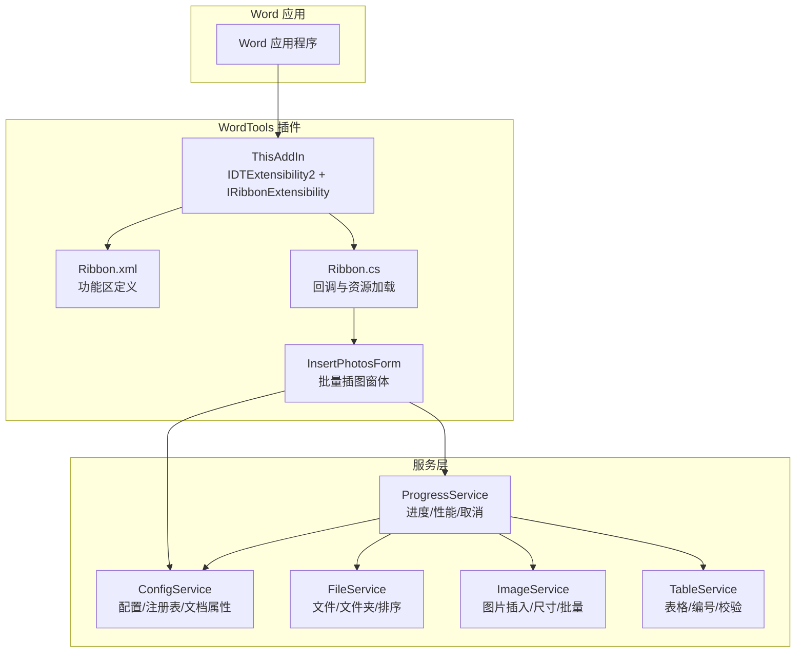
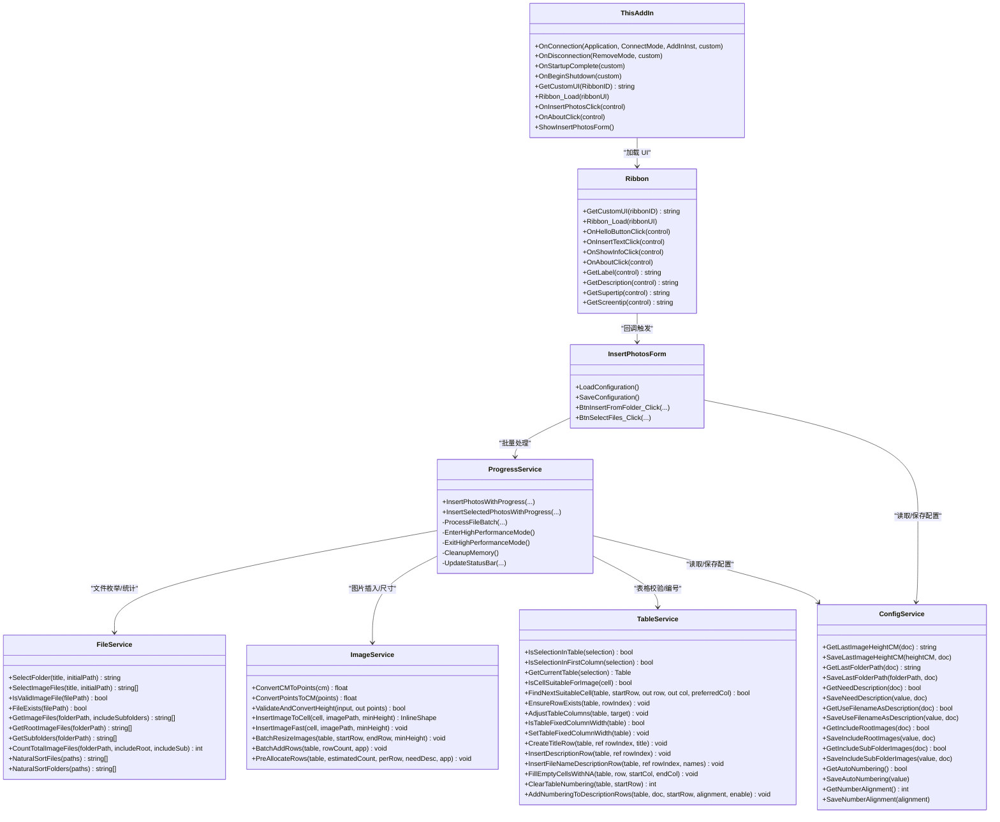
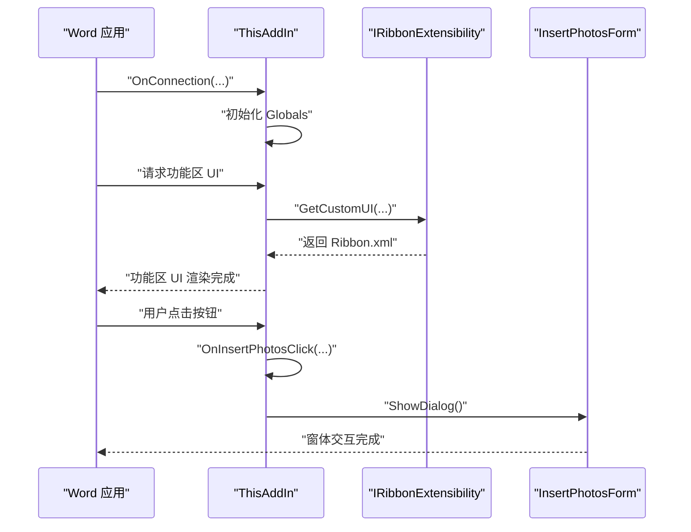
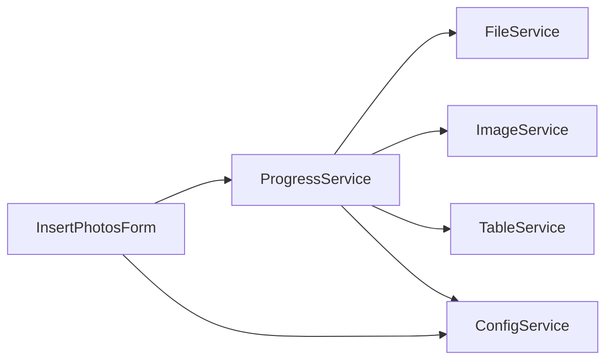
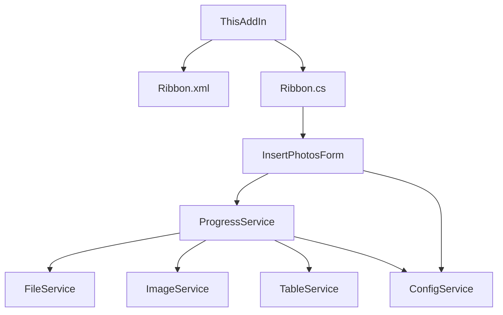

# 架构设计

<cite>
**本文引用的文件**
- [WordTools.csproj](file://WordTools/WordTools.csproj)
- [README.md](file://README.md)
- [Ribbon.xml](file://WordTools/Ribbon.xml)
- [ThisAddIn.cs](file://WordTools/ThisAddIn.cs)
- [Ribbon.cs](file://WordTools/Ribbon.cs)
- [ConfigService.cs](file://WordTools/Services/ConfigService.cs)
- [FileService.cs](file://WordTools/Services/FileService.cs)
- [ImageService.cs](file://WordTools/Services/ImageService.cs)
- [TableService.cs](file://WordTools/Services/TableService.cs)
- [ProgressService.cs](file://WordTools/Services/ProgressService.cs)
- [InsertPhotosForm.cs](file://WordTools/Forms/InsertPhotosForm.cs)
- [AssemblyInfo.cs](file://WordTools/Properties/AssemblyInfo.cs)
- [RegisterPlugin.bat](file://RegisterPlugin.bat)
- [build.bat](file://build.bat)
</cite>

## 目录
1. [引言](#引言)
2. [项目结构](#项目结构)
3. [核心组件](#核心组件)
4. [架构总览](#架构总览)
5. [详细组件分析](#详细组件分析)
6. [依赖分析](#依赖分析)
7. [性能考量](#性能考量)
8. [故障排查指南](#故障排查指南)
9. [结论](#结论)
10. [附录](#附录)

## 引言
本文件为 WordTools 的架构设计文档，面向开发者与维护者，系统阐述基于 COM 加载项的架构模式、分层设计与组件关系，重点覆盖：
- COM 加载项架构与 IDTExtensibility2 集成机制
- 功能区扩展（Ribbon）与 Ribbon.xml 配置及回调实现
- 服务层架构与各服务组件的职责、依赖与交互
- 技术决策与权衡（为何选择 COM 加载项而非 VSTO）
- 系统边界、组件交互与数据流
- 跨领域关注点：错误处理、性能优化与内存管理策略

## 项目结构
项目采用“功能区 + 加载项入口 + 服务层 + 窗体”的分层组织方式，核心文件如下：
- 加载项入口：ThisAddIn.cs 实现 IDTExtensibility2 与 IRibbonExtensibility，负责与 Word 应用生命周期与功能区 UI 集成
- 功能区定义：Ribbon.xml 定义 UI 结构；Ribbon.cs 提供回调与资源加载辅助
- 服务层：ConfigService、FileService、ImageService、TableService、ProgressService 负责配置、文件/图片/表格/进度等业务能力
- 窗体：InsertPhotosForm.cs 提供批量插图的图形界面与流程编排
- 构建与注册：build.bat、RegisterPlugin.bat 提供自动化构建与 COM 注册流程

图表来源
- [ThisAddIn.cs:17-156](file://WordTools/ThisAddIn.cs#L17-L156)
- [Ribbon.xml:1-39](file://WordTools/Ribbon.xml#L1-L39)
- [Ribbon.cs:14-172](file://WordTools/Ribbon.cs#L14-L172)
- [InsertPhotosForm.cs:18-618](file://WordTools/Forms/InsertPhotosForm.cs#L18-L618)
- [ConfigService.cs:11-362](file://WordTools/Services/ConfigService.cs#L11-L362)
- [FileService.cs:13-310](file://WordTools/Services/FileService.cs#L13-L310)
- [ImageService.cs:10-325](file://WordTools/Services/ImageService.cs#L10-L325)
- [TableService.cs:11-756](file://WordTools/Services/TableService.cs#L11-L756)
- [ProgressService.cs:14-571](file://WordTools/Services/ProgressService.cs#L14-L571)

章节来源
- [WordTools.csproj:100-127](file://WordTools/WordTools.csproj#L100-L127)
- [README.md:47-61](file://README.md#L47-L61)

## 核心组件
- 加载项入口（ThisAddIn）
  - 实现 IDTExtensibility2：处理 Word 启动/断开连接、启动完成/关闭开始回调
  - 实现 IRibbonExtensibility：动态加载 Ribbon.xml 资源
  - 提供 Ribbon 回调入口（OnInsertPhotosClick、OnAboutClick 等）与窗体显示逻辑
- 功能区（Ribbon.xml + Ribbon.cs）
  - Ribbon.xml：定义“Word工具箱”选项卡、按钮与提示信息
  - Ribbon.cs：提供回调方法（如 OnInsertTextClick、OnShowInfoClick、OnAboutClick）与资源加载辅助
- 服务层
  - ConfigService：文档自定义属性与注册表配置读写
  - FileService：文件夹/文件选择、扩展名校验、自然排序、统计
  - ImageService：图片插入、尺寸转换、快速插入、批量调整与预分配
  - TableService：表格校验、列宽、标题/描述行、自动编号与对齐
  - ProgressService：批量处理流程、性能优化、内存回收、取消控制
- 窗体（InsertPhotosForm）
  - 用户交互界面，承载配置加载/保存、事件驱动的批量插图流程

章节来源
- [ThisAddIn.cs:37-156](file://WordTools/ThisAddIn.cs#L37-L156)
- [Ribbon.xml:2-38](file://WordTools/Ribbon.xml#L2-L38)
- [Ribbon.cs:24-172](file://WordTools/Ribbon.cs#L24-L172)
- [ConfigService.cs:11-362](file://WordTools/Services/ConfigService.cs#L11-L362)
- [FileService.cs:13-310](file://WordTools/Services/FileService.cs#L13-L310)
- [ImageService.cs:10-325](file://WordTools/Services/ImageService.cs#L10-L325)
- [TableService.cs:11-756](file://WordTools/Services/TableService.cs#L11-L756)
- [ProgressService.cs:14-571](file://WordTools/Services/ProgressService.cs#L14-L571)
- [InsertPhotosForm.cs:18-618](file://WordTools/Forms/InsertPhotosForm.cs#L18-L618)

## 架构总览
WordTools 采用 COM 加载项架构，通过 IDTExtensibility2 与 Word 应用建立连接，并通过 IRibbonExtensibility 提供功能区 UI。服务层以纯静态服务封装业务能力，窗体作为交互入口协调服务层完成批量插图任务。

图表来源
- [ThisAddIn.cs:17-156](file://WordTools/ThisAddIn.cs#L17-L156)
- [Ribbon.cs:14-172](file://WordTools/Ribbon.cs#L14-L172)
- [InsertPhotosForm.cs:18-618](file://WordTools/Forms/InsertPhotosForm.cs#L18-L618)
- [ConfigService.cs:11-362](file://WordTools/Services/ConfigService.cs#L11-L362)
- [FileService.cs:13-310](file://WordTools/Services/FileService.cs#L13-L310)
- [ImageService.cs:10-325](file://WordTools/Services/ImageService.cs#L10-L325)
- [TableService.cs:11-756](file://WordTools/Services/TableService.cs#L11-L756)
- [ProgressService.cs:14-571](file://WordTools/Services/ProgressService.cs#L14-L571)

## 详细组件分析

### COM 加载项与 Word 集成（IDTExtensibility2）
- 生命周期回调
  - OnConnection：注入 Globals（ThisAddIn/Application），执行启动逻辑
  - OnDisconnection：执行关闭逻辑
  - OnStartupComplete/OnBeginShutdown：空实现或预留扩展
- 功能区集成
  - GetCustomUI：从嵌入资源读取 Ribbon.xml 并返回给 Word
  - Ribbon_Load：缓存 IRibbonUI，便于后续 Invalidate
  - 按钮回调：OnInsertPhotosClick 打开 InsertPhotosForm；OnAboutClick 显示关于信息

图表来源
- [ThisAddIn.cs:37-156](file://WordTools/ThisAddIn.cs#L37-L156)
- [Ribbon.xml:2-38](file://WordTools/Ribbon.xml#L2-L38)

章节来源
- [ThisAddIn.cs:37-156](file://WordTools/ThisAddIn.cs#L37-L156)
- [README.md:76-81](file://README.md#L76-L81)

### 功能区扩展（Ribbon.xml 与回调）
- Ribbon.xml
  - 定义“Word工具箱”选项卡，包含“图片工具”与“帮助”两组按钮
  - onAction 指向回调方法（如 OnInsertPhotosClick、OnAboutClick）
- Ribbon.cs
  - GetCustomUI：从资源加载 Ribbon.xml
  - 回调方法：OnInsertTextClick、OnShowInfoClick、OnAboutClick 等
  - 标签/描述/提示：GetLabel/GetDescription/GetSupertip/GetScreentip

图表来源
- [Ribbon.xml:2-38](file://WordTools/Ribbon.xml#L2-L38)
- [Ribbon.cs:24-172](file://WordTools/Ribbon.cs#L24-L172)

章节来源
- [Ribbon.xml:2-38](file://WordTools/Ribbon.xml#L2-L38)
- [Ribbon.cs:24-172](file://WordTools/Ribbon.cs#L24-L172)

### 服务层架构与交互
- ConfigService：统一配置读写，优先文档自定义属性，回退注册表，避免空字符串传递给 Word COM
- FileService：文件/文件夹选择、扩展名校验、自然排序、统计总数
- ImageService：图片插入与尺寸控制，提供快速插入与批量调整，支持最小高度约束
- TableService：表格校验、列宽固定、标题/描述行、自动编号与对齐
- ProgressService：批量处理主控制器，负责性能优化、内存回收、取消控制与状态栏更新

图表来源
- [InsertPhotosForm.cs:415-618](file://WordTools/Forms/InsertPhotosForm.cs#L415-L618)
- [ProgressService.cs:14-571](file://WordTools/Services/ProgressService.cs#L14-L571)
- [ConfigService.cs:11-362](file://WordTools/Services/ConfigService.cs#L11-L362)
- [FileService.cs:13-310](file://WordTools/Services/FileService.cs#L13-L310)
- [ImageService.cs:10-325](file://WordTools/Services/ImageService.cs#L10-L325)
- [TableService.cs:11-756](file://WordTools/Services/TableService.cs#L11-L756)

章节来源
- [ConfigService.cs:11-362](file://WordTools/Services/ConfigService.cs#L11-L362)
- [FileService.cs:13-310](file://WordTools/Services/FileService.cs#L13-L310)
- [ImageService.cs:10-325](file://WordTools/Services/ImageService.cs#L10-L325)
- [TableService.cs:11-756](file://WordTools/Services/TableService.cs#L11-L756)
- [ProgressService.cs:14-571](file://WordTools/Services/ProgressService.cs#L14-L571)

### 批量插图流程（ProgressService）
- 输入参数：文件夹/选中文件、最小高度、是否需要描述、是否使用文件名描述、是否包含根/子目录、是否自动编号、编号对齐
- 关键步骤
  - 表格校验与固定列宽
  - 预分配行数（批量添加，DoEvents 配合）
  - 批量处理文件：快速插入图片、行满处理、描述行插入
  - 进度更新（状态栏）、内存清理、取消检测（ESC）
  - 自动编号（基于描述行）

图表来源
- [ProgressService.cs:148-306](file://WordTools/Services/ProgressService.cs#L148-L306)
- [ProgressService.cs:407-535](file://WordTools/Services/ProgressService.cs#L407-L535)

章节来源
- [ProgressService.cs:14-571](file://WordTools/Services/ProgressService.cs#L14-L571)

### 技术决策与权衡（COM 加载项 vs VSTO）
- 选择 COM 加载项的原因
  - 无需 VSTO Runtime，减少外部依赖
  - 通过 regasm 手动注册，部署更灵活
  - 但需手动注册 COM 组件，安装流程相对复杂
- 与 VSTO 的对比
  - VSTO 提供更丰富的设计器与托管扩展能力，但需要安装 VSTO 运行时
  - 本项目采用纯 COM 加载项，简化运行环境要求

章节来源
- [README.md:76-81](file://README.md#L76-L81)

## 依赖分析
- 组件耦合
  - ThisAddIn 与 Ribbon.cs/Ribbon.xml 强耦合（UI 定义与回调）
  - InsertPhotosForm 与 ProgressService 强耦合（流程编排）
  - ProgressService 与 FileService/ImageService/TableService/ConfigService 松耦合（通过静态服务接口）
- 外部依赖
  - Microsoft.Office.Interop.Word、Office、Extensibility
  - Windows API（ESC 取消检测）
- 潜在风险
  - Word COM 对象生命周期与异常处理需谨慎
  - 大批量图片插入时的内存与 UI 响应问题

图表来源
- [ThisAddIn.cs:17-156](file://WordTools/ThisAddIn.cs#L17-L156)
- [Ribbon.xml:2-38](file://WordTools/Ribbon.xml#L2-L38)
- [Ribbon.cs:14-172](file://WordTools/Ribbon.cs#L14-L172)
- [InsertPhotosForm.cs:18-618](file://WordTools/Forms/InsertPhotosForm.cs#L18-L618)
- [ProgressService.cs:14-571](file://WordTools/Services/ProgressService.cs#L14-L571)

章节来源
- [WordTools.csproj:60-98](file://WordTools/WordTools.csproj#L60-L98)

## 性能考量
- 性能优化策略
  - 高性能模式：关闭 ScreenUpdating、DisplayAlerts，标记文档拼写/语法已检查
  - 批量操作：批量添加行（100/200 为批次），DoEvents 释放 UI 线程
  - 内存回收：定期 GC.Collect/GC.WaitForPendingFinalizers
  - 进度刷新：根据文件数量动态调整刷新/内存清理/保存间隔
- 资源与 UI
  - 状态栏实时反馈进度、剩余时间与当前文件名
  - 取消机制：ESC 键检测，立即标记取消并优雅退出

章节来源
- [ProgressService.cs:73-143](file://WordTools/Services/ProgressService.cs#L73-L143)
- [ProgressService.cs:538-567](file://WordTools/Services/ProgressService.cs#L538-L567)

## 故障排查指南
- COM 注册失败
  - 确认以管理员身份运行 RegisterPlugin.bat
  - 确认 regasm.exe 路径与 WordTools.dll 存在
- Word 中未显示插件
  - 完全关闭 Word 后重启
  - “文件 → 选项 → 加载项”中启用 COM 加载项
- 功能区按钮无响应
  - 检查 Ribbon.xml 是否正确嵌入资源
  - 确认 ThisAddIn.GetCustomUI 返回非空
- 大量图片插入卡顿
  - 检查是否处于高性能模式（ScreenUpdating/DisplayAlerts）
  - 观察状态栏刷新频率与内存清理间隔
- 配置未生效
  - 检查 ConfigService 读写顺序（文档属性优先，注册表回退）
  - 空值使用特殊标记避免 Word COM 异常

章节来源
- [RegisterPlugin.bat:8-80](file://RegisterPlugin.bat#L8-L80)
- [ThisAddIn.cs:65-80](file://WordTools/ThisAddIn.cs#L65-L80)
- [ConfigService.cs:149-178](file://WordTools/Services/ConfigService.cs#L149-L178)

## 结论
WordTools 采用清晰的分层架构：加载项负责与 Word 集成，功能区提供直观 UI，服务层封装业务能力，窗体编排流程。通过静态服务与严格的异常处理、性能优化与内存管理策略，系统在保证易用性的同时兼顾稳定性与性能。选择 COM 加载项降低了运行时依赖，但需要完善的注册与部署流程。

## 附录
- 构建与部署
  - build.bat：自动查找 MSBuild、还原包、构建 Release 并输出发布文件
  - RegisterPlugin.bat：regasm 注册 COM 组件并写入 Word Addins 注册表项
- 程序集信息
  - AssemblyInfo.cs：程序集元数据（标题、描述、版权等）

章节来源
- [build.bat:1-125](file://build.bat#L1-L125)
- [RegisterPlugin.bat:1-80](file://RegisterPlugin.bat#L1-L80)
- [AssemblyInfo.cs:9-35](file://WordTools/Properties/AssemblyInfo.cs#L9-L35)