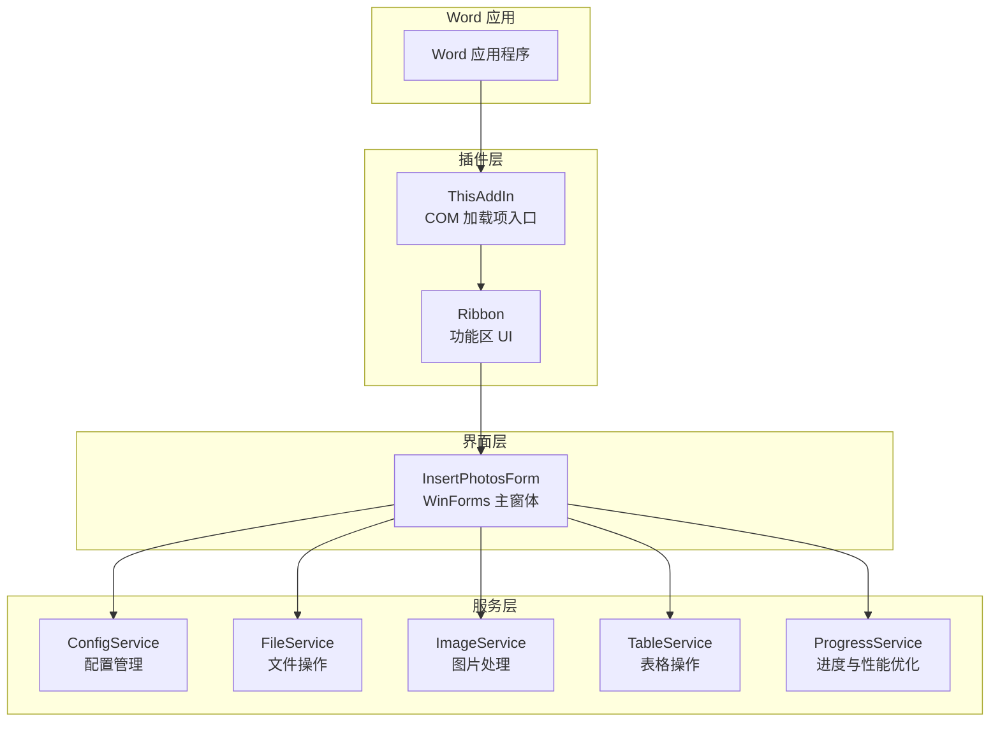
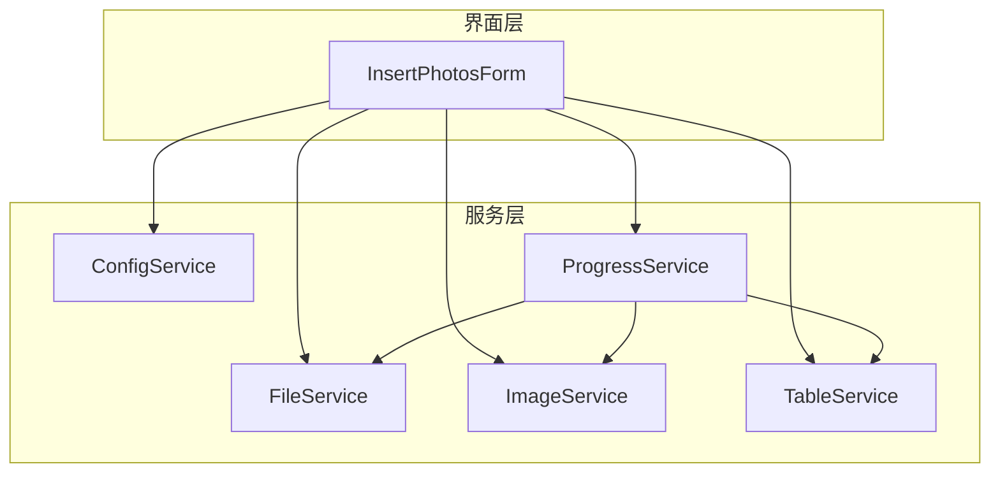
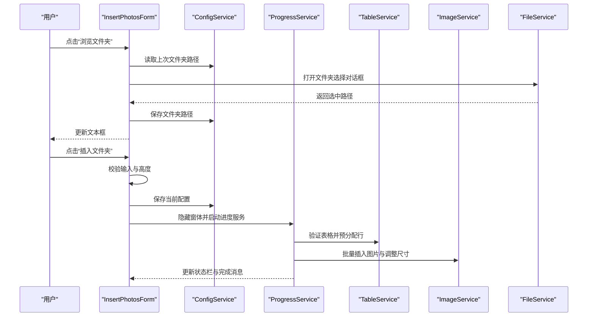
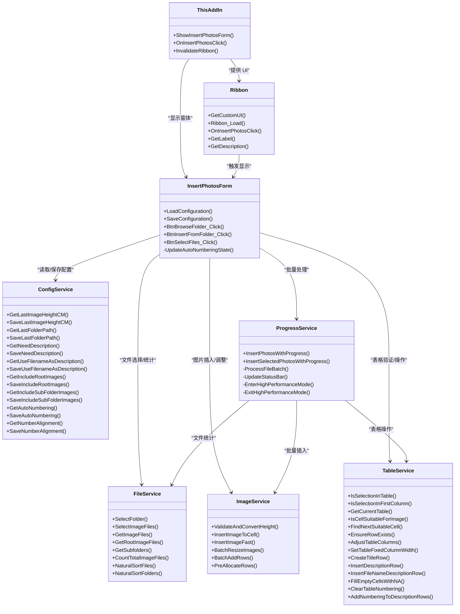

# 用户界面组件架构

<cite>
**本文档引用的文件**
- [InsertPhotosForm.cs](file://WordTools/Forms/InsertPhotosForm.cs)
- [Ribbon.cs](file://WordTools/Ribbon.cs)
- [ThisAddIn.cs](file://WordTools/ThisAddIn.cs)
- [ConfigService.cs](file://WordTools/Services/ConfigService.cs)
- [FileService.cs](file://WordTools/Services/FileService.cs)
- [ImageService.cs](file://WordTools/Services/ImageService.cs)
- [ProgressService.cs](file://WordTools/Services/ProgressService.cs)
- [TableService.cs](file://WordTools/Services/TableService.cs)
- [README.md](file://README.md)
</cite>

## 目录
1. [简介](#简介)
2. [项目结构](#项目结构)
3. [核心组件](#核心组件)
4. [架构概览](#架构概览)
5. [详细组件分析](#详细组件分析)
6. [依赖关系分析](#依赖关系分析)
7. [性能考量](#性能考量)
8. [故障排除指南](#故障排除指南)
9. [结论](#结论)

## 简介
本文件面向 WordTools 的用户界面组件架构，重点解释 WinForms 界面的设计模式与组件组织方式，深入描述 InsertPhotosForm 的界面布局、控件配置与事件处理机制，并阐述界面组件与服务层的交互模式（数据绑定、事件传递与状态同步）。同时涵盖界面的响应式设计与用户体验优化策略、界面组件的生命周期管理与资源释放机制，以及界面组件的可定制性与扩展性设计考虑。

## 项目结构
WordTools 采用 COM 加载项架构，通过 Ribbon 功能区暴露插件入口，用户通过 Ribbon 按钮触发 WinForms 窗体，窗体再调用服务层执行批量图片插入与自动编号等操作。

**图表来源**
- [ThisAddIn.cs:13-156](file://WordTools/ThisAddIn.cs#L13-L156)
- [Ribbon.cs:14-172](file://WordTools/Ribbon.cs#L14-L172)
- [InsertPhotosForm.cs:18-617](file://WordTools/Forms/InsertPhotosForm.cs#L18-L617)
- [ConfigService.cs:11-361](file://WordTools/Services/ConfigService.cs#L11-L361)
- [FileService.cs:13-309](file://WordTools/Services/FileService.cs#L13-L309)
- [ImageService.cs:10-324](file://WordTools/Services/ImageService.cs#L10-L324)
- [TableService.cs:11-755](file://WordTools/Services/TableService.cs#L11-L755)
- [ProgressService.cs:14-570](file://WordTools/Services/ProgressService.cs#L14-L570)

**章节来源**
- [README.md:1-85](file://README.md#L1-L85)
- [ThisAddIn.cs:13-156](file://WordTools/ThisAddIn.cs#L13-L156)
- [Ribbon.cs:14-172](file://WordTools/Ribbon.cs#L14-L172)

## 核心组件
- **ThisAddIn**：COM 加载项入口，负责初始化全局应用实例、暴露 Ribbon UI 并提供窗体显示方法。
- **Ribbon**：功能区实现，提供按钮回调与 UI 文本本地化，触发主窗体显示。
- **InsertPhotosForm**：WinForms 主窗体，负责界面布局、控件配置、事件处理与与服务层交互。
- **服务层**：
  - ConfigService：配置持久化（文档自定义属性 + 注册表）
  - FileService：文件选择、验证与自然排序
  - ImageService：图片插入、尺寸转换与批量调整
  - TableService：表格验证、标题/描述行、自动编号
  - ProgressService：批量处理进度、性能优化与取消控制

**章节来源**
- [ThisAddIn.cs:17-156](file://WordTools/ThisAddIn.cs#L17-L156)
- [Ribbon.cs:14-172](file://WordTools/Ribbon.cs#L14-L172)
- [InsertPhotosForm.cs:18-617](file://WordTools/Forms/InsertPhotosForm.cs#L18-L617)
- [ConfigService.cs:11-361](file://WordTools/Services/ConfigService.cs#L11-L361)
- [FileService.cs:13-309](file://WordTools/Services/FileService.cs#L13-L309)
- [ImageService.cs:10-324](file://WordTools/Services/ImageService.cs#L10-L324)
- [TableService.cs:11-755](file://WordTools/Services/TableService.cs#L11-L755)
- [ProgressService.cs:14-570](file://WordTools/Services/ProgressService.cs#L14-L570)

## 架构概览
界面层与服务层通过清晰的职责分离实现松耦合。界面层仅负责用户交互与参数收集，服务层负责业务逻辑与 Word COM 操作。服务层内部进一步细分为配置、文件、图片、表格与进度管理，形成稳定的分层架构。

**图表来源**
- [InsertPhotosForm.cs:415-482](file://WordTools/Forms/InsertPhotosForm.cs#L415-L482)
- [ProgressService.cs:151-306](file://WordTools/Services/ProgressService.cs#L151-L306)
- [FileService.cs:13-309](file://WordTools/Services/FileService.cs#L13-L309)
- [ImageService.cs:10-324](file://WordTools/Services/ImageService.cs#L10-L324)
- [TableService.cs:11-755](file://WordTools/Services/TableService.cs#L11-L755)

## 详细组件分析

### InsertPhotosForm 界面设计与布局
- 设计模式：基于 WinForms 的声明式布局与代码生成结合，通过方法化控件创建实现模块化布局。
- 布局策略：
  - 使用常量定义边距、间距、行高与按钮高度，确保跨 DPI 一致性。
  - 采用“行式”布局，将相关控件组合为逻辑行（文件夹路径、高度与范围、描述选项、对齐选项、操作按钮）。
  - 使用 Panel 包裹单选按钮组，避免不同组间相互影响。
- 视觉风格：统一颜色方案（背景、主色、成功色、文字色、分割线色），字体与字号一致，提升可读性与一致性。

**图表来源**
- [InsertPhotosForm.cs:59-105](file://WordTools/Forms/InsertPhotosForm.cs#L59-L105)
- [InsertPhotosForm.cs:109-409](file://WordTools/Forms/InsertPhotosForm.cs#L109-L409)

**章节来源**
- [InsertPhotosForm.cs:18-105](file://WordTools/Forms/InsertPhotosForm.cs#L18-L105)
- [InsertPhotosForm.cs:109-409](file://WordTools/Forms/InsertPhotosForm.cs#L109-L409)

### 控件配置与事件处理机制
- 控件类型与用途：
  - 文本框：文件夹路径、图片高度
  - 按钮：浏览文件夹、插入文件夹、选择文件、取消
  - 单选按钮：描述选项（手动/无/文件名）、对齐选项（靠左/居中）
  - 复选框：包含根目录、包含子目录、自动编号
- 事件处理：
  - 描述选项切换：根据“无描述”禁用自动编号，保证逻辑一致性。
  - 浏览文件夹：弹出文件夹选择对话框，更新文本框与配置。
  - 插入文件夹：校验输入、保存配置、隐藏窗体、调用进度服务执行批量插入。
  - 选择文件：弹出多选文件对话框，校验输入、保存配置、调用进度服务执行批量插入。
- 数据绑定与状态同步：
  - 初始化时从配置服务加载上次设置；提交时保存当前设置。
  - 通过服务层接口与 Word COM 交互，实现状态同步与持久化。

**图表来源**
- [InsertPhotosForm.cs:509-613](file://WordTools/Forms/InsertPhotosForm.cs#L509-L613)
- [ConfigService.cs:149-178](file://WordTools/Services/ConfigService.cs#L149-L178)
- [ProgressService.cs:151-306](file://WordTools/Services/ProgressService.cs#L151-L306)
- [TableService.cs:18-40](file://WordTools/Services/TableService.cs#L18-L40)
- [ImageService.cs:73-134](file://WordTools/Services/ImageService.cs#L73-L134)
- [FileService.cs:26-45](file://WordTools/Services/FileService.cs#L26-L45)

**章节来源**
- [InsertPhotosForm.cs:488-613](file://WordTools/Forms/InsertPhotosForm.cs#L488-L613)
- [ConfigService.cs:149-178](file://WordTools/Services/ConfigService.cs#L149-L178)
- [ProgressService.cs:151-306](file://WordTools/Services/ProgressService.cs#L151-L306)

### 界面与服务层交互模式
- 数据绑定：窗体从配置服务读取默认值，提交时写回配置服务，实现跨会话的状态同步。
- 事件传递：窗体通过服务层封装的 API 执行 Word 操作，避免直接操作 COM 对象，降低耦合。
- 状态同步：进度服务在批量处理期间更新状态栏与 UI，窗体隐藏以减少干扰，完成后恢复并提示结果。

**章节来源**
- [InsertPhotosForm.cs:415-482](file://WordTools/Forms/InsertPhotosForm.cs#L415-L482)
- [ProgressService.cs:539-566](file://WordTools/Services/ProgressService.cs#L539-L566)

### 响应式设计与用户体验优化
- DPI 缩放：启用 Dpi 缩放与固定分辨率，确保不同显示密度下的控件比例一致。
- 交互反馈：隐藏窗体后调用 Application.DoEvents()，保证 UI 响应流畅。
- 取消机制：支持 ESC 键取消批量操作，及时更新状态栏提示。
- 性能优化：进入高性能模式关闭屏幕更新与警告提示，批量插入时定期清理内存，动态调整刷新与保存间隔。

**章节来源**
- [InsertPhotosForm.cs:63-66](file://WordTools/Forms/InsertPhotosForm.cs#L63-L66)
- [ProgressService.cs:43-64](file://WordTools/Services/ProgressService.cs#L43-L64)
- [ProgressService.cs:73-112](file://WordTools/Services/ProgressService.cs#L73-L112)
- [ProgressService.cs:129-142](file://WordTools/Services/ProgressService.cs#L129-L142)

### 界面生命周期管理与资源释放
- 窗体生命周期：通过 ThisAddIn 的 ShowInsertPhotosForm 方法创建并显示窗体，使用 using 语句确保资源释放。
- 事件订阅：控件事件在 InitializeComponent 中一次性订阅，避免重复订阅导致的内存泄漏。
- 资源释放：窗体关闭后自动释放控件与事件订阅资源；服务层对象在使用后由垃圾回收器回收。

**章节来源**
- [ThisAddIn.cs:133-150](file://WordTools/ThisAddIn.cs#L133-L150)
- [InsertPhotosForm.cs:59-105](file://WordTools/Forms/InsertPhotosForm.cs#L59-L105)

### 可定制性与扩展性设计
- 配置系统：通过 ConfigService 支持文档级与应用级配置，便于扩展更多用户偏好。
- 服务层解耦：界面层与服务层通过接口解耦，便于替换或扩展具体实现（例如不同的文件选择器或图片处理算法）。
- Ribbon 扩展：Ribbon 类提供统一的回调入口，便于新增功能按钮与 UI 元素。
- 进度与性能：ProgressService 提供可配置的刷新间隔、内存清理与保存策略，便于针对大规模批量操作进行优化。

**章节来源**
- [ConfigService.cs:11-361](file://WordTools/Services/ConfigService.cs#L11-L361)
- [Ribbon.cs:14-172](file://WordTools/Ribbon.cs#L14-L172)
- [ProgressService.cs:14-570](file://WordTools/Services/ProgressService.cs#L14-L570)

## 依赖关系分析

**图表来源**
- [ThisAddIn.cs:17-156](file://WordTools/ThisAddIn.cs#L17-L156)
- [Ribbon.cs:14-172](file://WordTools/Ribbon.cs#L14-L172)
- [InsertPhotosForm.cs:18-617](file://WordTools/Forms/InsertPhotosForm.cs#L18-L617)
- [ConfigService.cs:11-361](file://WordTools/Services/ConfigService.cs#L11-L361)
- [FileService.cs:13-309](file://WordTools/Services/FileService.cs#L13-L309)
- [ImageService.cs:10-324](file://WordTools/Services/ImageService.cs#L10-L324)
- [TableService.cs:11-755](file://WordTools/Services/TableService.cs#L11-L755)
- [ProgressService.cs:14-570](file://WordTools/Services/ProgressService.cs#L14-L570)

**章节来源**
- [ThisAddIn.cs:17-156](file://WordTools/ThisAddIn.cs#L17-L156)
- [Ribbon.cs:14-172](file://WordTools/Ribbon.cs#L14-L172)
- [InsertPhotosForm.cs:18-617](file://WordTools/Forms/InsertPhotosForm.cs#L18-L617)

## 性能考量
- 高性能模式：在批量处理期间关闭屏幕更新与警告提示，显著减少 UI 刷新与对话框弹出带来的性能损耗。
- 动态刷新策略：根据文件总数动态调整刷新间隔、内存清理与保存间隔，平衡 UI 响应与处理效率。
- 内存管理：定期触发 Application.DoEvents() 与 GC.Collect()，避免长时间批量操作导致的内存占用过高。
- 预分配与批处理：预估行数并批量添加，减少频繁的 Word COM 调用次数。

**章节来源**
- [ProgressService.cs:73-112](file://WordTools/Services/ProgressService.cs#L73-L112)
- [ProgressService.cs:117-125](file://WordTools/Services/ProgressService.cs#L117-L125)
- [ProgressService.cs:129-142](file://WordTools/Services/ProgressService.cs#L129-L142)
- [ImageService.cs:287-320](file://WordTools/Services/ImageService.cs#L287-L320)

## 故障排除指南
- 插件无法加载或 Ribbon 未显示：
  - 确认已以管理员权限注册 COM 组件（regasm）。
  - 检查系统要求与 .NET Framework 版本。
- 窗体无法打开：
  - 检查 ThisAddIn 的异常捕获与错误提示，确认 Word 应用实例可用。
- 批量插入失败：
  - 确认已选中表格且光标位于第一列。
  - 检查图片高度输入是否为正数。
  - 使用 ESC 键取消操作，查看状态栏提示。
- 配置未生效：
  - 确认配置服务的文档属性与注册表写入成功，必要时重置配置。

**章节来源**
- [README.md:30-69](file://README.md#L30-L69)
- [ThisAddIn.cs:133-150](file://WordTools/ThisAddIn.cs#L133-L150)
- [ProgressService.cs:167-178](file://WordTools/Services/ProgressService.cs#L167-L178)
- [ConfigService.cs:28-92](file://WordTools/Services/ConfigService.cs#L28-L92)

## 结论
WordTools 的用户界面组件架构通过清晰的分层设计与服务层封装，实现了界面与业务逻辑的有效解耦。InsertPhotosForm 采用模块化的控件创建与事件处理机制，配合 ConfigService、FileService、ImageService、TableService 与 ProgressService，提供了稳定、可扩展且具有良好用户体验的批量图片插入能力。通过 DPI 缩放、高性能模式与动态刷新策略，系统在大规模操作场景下仍能保持良好的响应性与稳定性。