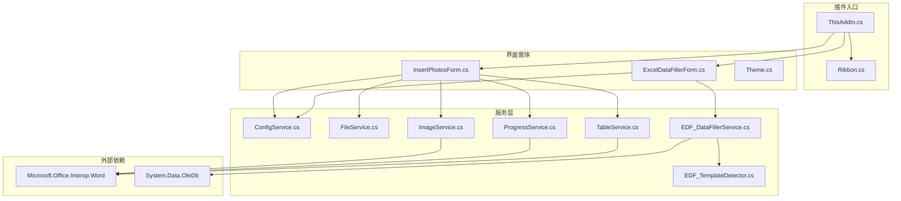
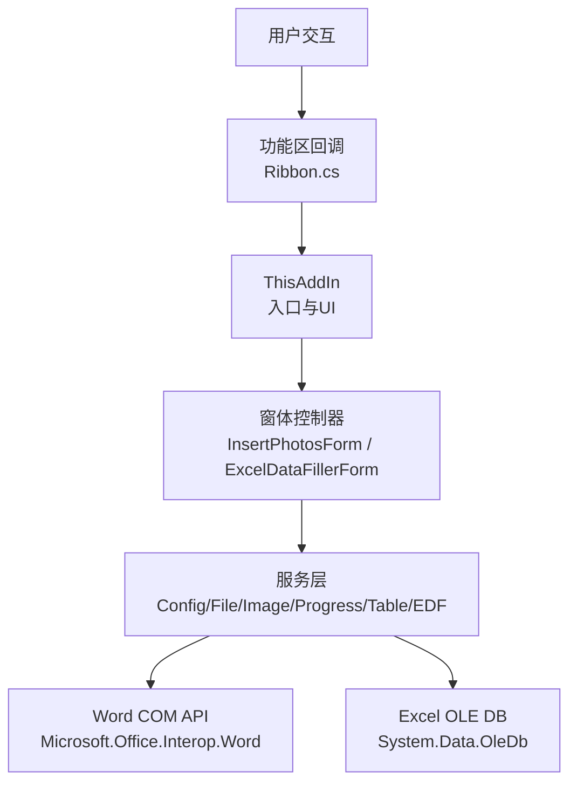
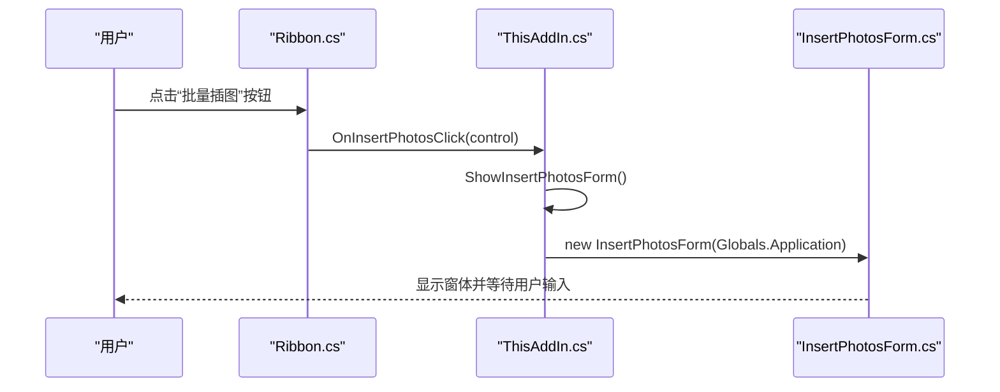
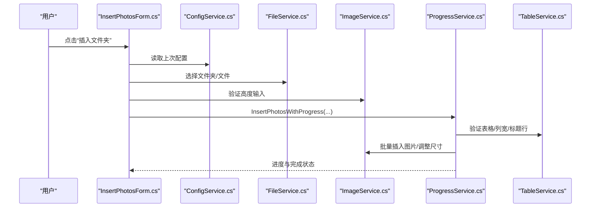
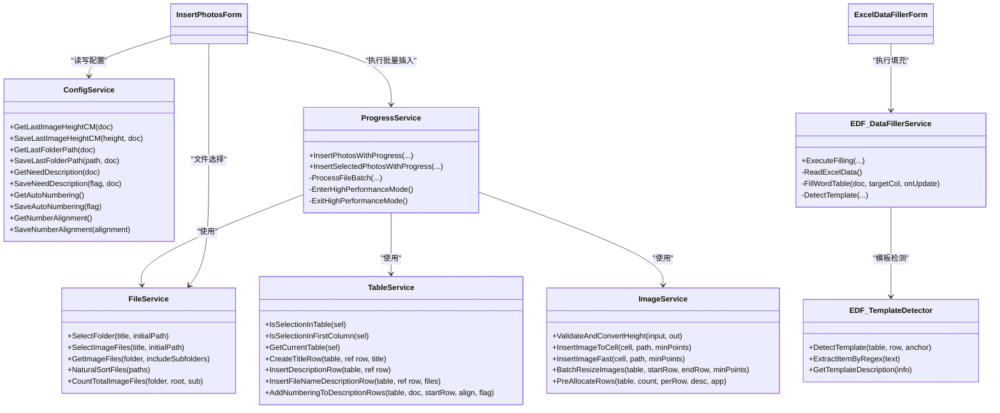
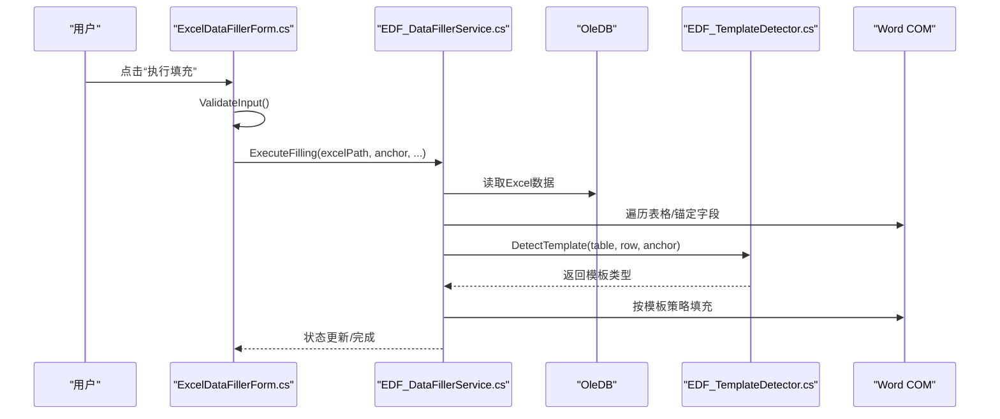
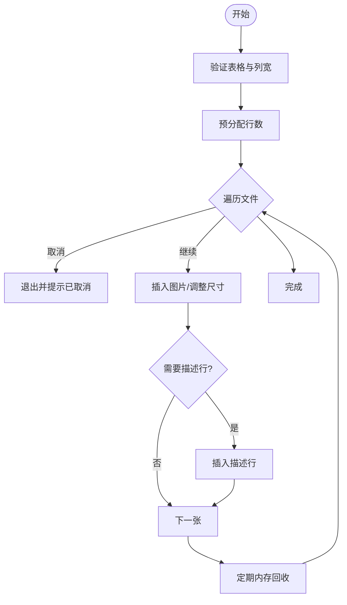
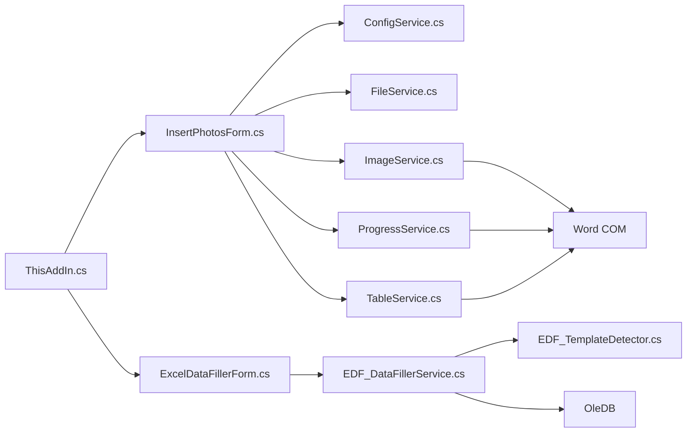

# 组件交互关系

<cite>
**本文引用的文件**
- [README.md](file://README.md)
- [ThisAddIn.cs](file://WordTools/ThisAddIn.cs)
- [ThisAddIn.Designer.cs](file://WordTools/ThisAddIn.Designer.cs)
- [Ribbon.cs](file://WordTools/Ribbon.cs)
- [InsertPhotosForm.cs](file://WordTools/Forms/InsertPhotosForm.cs)
- [ExcelDataFillerForm.cs](file://WordTools/Forms/ExcelDataFillerForm.cs)
- [ConfigService.cs](file://WordTools/Services/ConfigService.cs)
- [FileService.cs](file://WordTools/Services/FileService.cs)
- [ImageService.cs](file://WordTools/Services/ImageService.cs)
- [ProgressService.cs](file://WordTools/Services/ProgressService.cs)
- [TableService.cs](file://WordTools/Services/TableService.cs)
- [EDF_DataFillerService.cs](file://WordTools/Services/EDF_DataFillerService.cs)
- [EDF_TemplateDetector.cs](file://WordTools/Services/EDF_TemplateDetector.cs)
- [Theme.cs](file://WordTools/Theme.cs)
</cite>

## 目录
1. [简介](#简介)
2. [项目结构](#项目结构)
3. [核心组件](#核心组件)
4. [架构概览](#架构概览)
5. [详细组件分析](#详细组件分析)
6. [依赖关系分析](#依赖关系分析)
7. [性能考量](#性能考量)
8. [故障排除指南](#故障排除指南)
9. [结论](#结论)
10. [附录](#附录)

## 简介
本文件系统性梳理 WordTools 插件的组件交互关系，重点覆盖：
- 插件主入口与界面控制器的协作模式
- 服务层的职责划分与数据流
- 组件间的依赖注入与通信机制
- 从用户交互到功能执行的完整路径
- 生命周期管理与资源共享策略
- 事件驱动架构的实现（事件订阅、发布与处理）
- 异常传播与错误处理的组件间传递
- 组件解耦与模块化的最佳实践
- 组件关系图与交互时序图

## 项目结构
项目采用“插件入口 + 界面窗体 + 服务层”的分层组织方式，配合统一主题样式与配置管理，形成清晰的职责边界与可维护性。

图表来源
- [ThisAddIn.cs:17-173](file://WordTools/ThisAddIn.cs#L17-L173)
- [Ribbon.cs:14-189](file://WordTools/Ribbon.cs#L14-L189)
- [InsertPhotosForm.cs:19-573](file://WordTools/Forms/InsertPhotosForm.cs#L19-L573)
- [ExcelDataFillerForm.cs:12-431](file://WordTools/Forms/ExcelDataFillerForm.cs#L12-L431)
- [ConfigService.cs:11-462](file://WordTools/Services/ConfigService.cs#L11-L462)
- [FileService.cs:13-309](file://WordTools/Services/FileService.cs#L13-L309)
- [ImageService.cs:10-324](file://WordTools/Services/ImageService.cs#L10-L324)
- [ProgressService.cs:14-570](file://WordTools/Services/ProgressService.cs#L14-L570)
- [TableService.cs:11-755](file://WordTools/Services/TableService.cs#L11-L755)
- [EDF_DataFillerService.cs:14-563](file://WordTools/Services/EDF_DataFillerService.cs#L14-L563)
- [EDF_TemplateDetector.cs:11-288](file://WordTools/Services/EDF_TemplateDetector.cs#L11-L288)

章节来源
- [README.md:47-60](file://README.md#L47-L60)

## 核心组件
- 插件入口与功能区
  - ThisAddIn：实现 IDTExtensibility2 与 IRibbonExtensibility，负责插件生命周期与 Ribbon UI 初始化。
  - Ribbon：提供功能区回调与 UI 资源加载。
- 界面控制器
  - InsertPhotosForm：批量插图工具窗体，协调配置、文件选择、图片插入与进度反馈。
  - ExcelDataFillerForm：Excel 数据填充工具窗体，负责参数校验、状态展示与执行调度。
- 服务层
  - ConfigService：配置读写（文档自定义属性与注册表）。
  - FileService：文件/文件夹选择、图片文件筛选与统计。
  - ImageService：图片插入、尺寸转换与批量调整。
  - ProgressService：批量操作进度控制、性能优化与取消机制。
  - TableService：表格验证、布局调整、标题/描述行与自动编号。
  - EDF_DataFillerService：Excel 数据读取与 Word 表格填充。
  - EDF_TemplateDetector：智能模板检测与填充策略选择。
- 主题与全局
  - Theme：统一 UI 样式与 DPI 缩放。
  - Globals：ThisAddIn 与 Application 的全局单例。

章节来源
- [ThisAddIn.cs:17-173](file://WordTools/ThisAddIn.cs#L17-L173)
- [Ribbon.cs:14-189](file://WordTools/Ribbon.cs#L14-L189)
- [InsertPhotosForm.cs:19-573](file://WordTools/Forms/InsertPhotosForm.cs#L19-L573)
- [ExcelDataFillerForm.cs:12-431](file://WordTools/Forms/ExcelDataFillerForm.cs#L12-L431)
- [ConfigService.cs:11-462](file://WordTools/Services/ConfigService.cs#L11-L462)
- [FileService.cs:13-309](file://WordTools/Services/FileService.cs#L13-L309)
- [ImageService.cs:10-324](file://WordTools/Services/ImageService.cs#L10-L324)
- [ProgressService.cs:14-570](file://WordTools/Services/ProgressService.cs#L14-L570)
- [TableService.cs:11-755](file://WordTools/Services/TableService.cs#L11-L755)
- [EDF_DataFillerService.cs:14-563](file://WordTools/Services/EDF_DataFillerService.cs#L14-L563)
- [EDF_TemplateDetector.cs:11-288](file://WordTools/Services/EDF_TemplateDetector.cs#L11-L288)
- [Theme.cs:11-357](file://WordTools/Theme.cs#L11-L357)
- [ThisAddIn.Designer.cs:22-64](file://WordTools/ThisAddIn.Designer.cs#L22-L64)

## 架构概览
整体采用“插件入口 + 窗体控制器 + 服务层”的分层架构，服务层内部进一步细分为配置、文件、图片、表格、Excel 填充与模板检测等模块，形成高内聚低耦合的组件体系。

图表来源
- [ThisAddIn.cs:66-173](file://WordTools/ThisAddIn.cs#L66-L173)
- [Ribbon.cs:24-189](file://WordTools/Ribbon.cs#L24-L189)
- [InsertPhotosForm.cs:513-569](file://WordTools/Forms/InsertPhotosForm.cs#L513-L569)
- [ExcelDataFillerForm.cs:333-354](file://WordTools/Forms/ExcelDataFillerForm.cs#L333-L354)
- [EDF_DataFillerService.cs:62-79](file://WordTools/Services/EDF_DataFillerService.cs#L62-L79)

## 详细组件分析

### 插件主入口与功能区协作
- ThisAddIn
  - 实现 IDTExtensibility2：在 OnConnection 中设置全局应用实例，并触发启动逻辑。
  - 实现 IRibbonExtensibility：动态加载 Ribbon.xml 资源，提供 GetCustomUI。
  - 提供 Ribbon 回调：如 OnInsertPhotosClick、OnExcelDataFillerClick 等，负责打开窗体或显示信息。
- Ribbon
  - 提供功能区回调（如 OnInsertTextClick、OnShowInfoClick、OnExcelDataFillerClick）与 UI 文案、提示信息。
  - 通过资源加载机制获取 Ribbon.xml。

图表来源
- [ThisAddIn.cs:108-173](file://WordTools/ThisAddIn.cs#L108-L173)
- [Ribbon.cs:113-125](file://WordTools/Ribbon.cs#L113-L125)

章节来源
- [ThisAddIn.cs:37-62](file://WordTools/ThisAddIn.cs#L37-L62)
- [ThisAddIn.cs:66-83](file://WordTools/ThisAddIn.cs#L66-L83)
- [ThisAddIn.cs:87-173](file://WordTools/ThisAddIn.cs#L87-L173)
- [Ribbon.cs:24-189](file://WordTools/Ribbon.cs#L24-L189)

### 界面控制器与服务层交互
- InsertPhotosForm
  - 负责 UI 布局、事件绑定与用户输入收集。
  - 读取/保存配置（ConfigService），选择文件/文件夹（FileService），执行批量插入（ProgressService + ImageService + TableService）。
  - 通过 Application.DoEvents() 保证 UI 响应。
- ExcelDataFillerForm
  - 参数校验与状态展示。
  - 调用 EDF_DataFillerService 执行填充，内部使用 EDF_TemplateDetector 智能识别模板并选择策略。

图表来源
- [InsertPhotosForm.cs:513-569](file://WordTools/Forms/InsertPhotosForm.cs#L513-L569)
- [ProgressService.cs:151-306](file://WordTools/Services/ProgressService.cs#L151-L306)
- [TableService.cs:18-40](file://WordTools/Services/TableService.cs#L18-L40)
- [ImageService.cs:73-134](file://WordTools/Services/ImageService.cs#L73-L134)

章节来源
- [InsertPhotosForm.cs:371-438](file://WordTools/Forms/InsertPhotosForm.cs#L371-L438)
- [InsertPhotosForm.cs:481-569](file://WordTools/Forms/InsertPhotosForm.cs#L481-L569)
- [ProgressService.cs:146-306](file://WordTools/Services/ProgressService.cs#L146-L306)
- [TableService.cs:18-40](file://WordTools/Services/TableService.cs#L18-L40)
- [ImageService.cs:73-134](file://WordTools/Services/ImageService.cs#L73-L134)

### 服务层职责与协作
- ConfigService：集中管理配置（文档自定义属性 + 注册表），提供图片高度、文件夹路径、描述行、文件范围、自动编号与对齐等配置的读写。
- FileService：封装文件/文件夹选择、图片文件筛选、自然排序、统计与路径解析。
- ImageService：图片插入、尺寸转换、批量调整与预分配行数。
- ProgressService：批量操作的性能优化（关闭屏幕刷新、禁用警告）、取消控制（ESC 键）、内存回收与状态栏更新。
- TableService：表格验证、列宽固定、标题/描述行插入、空单元格填充与自动编号。
- EDF_DataFillerService：Excel 数据读取（OLE DB）、Word 表格填充、模板检测与策略选择、状态更新。
- EDF_TemplateDetector：基于锚定字段与单元格内容的智能模板识别，输出结构类型与定位信息。

图表来源
- [ConfigService.cs:11-462](file://WordTools/Services/ConfigService.cs#L11-L462)
- [FileService.cs:13-309](file://WordTools/Services/FileService.cs#L13-L309)
- [ImageService.cs:10-324](file://WordTools/Services/ImageService.cs#L10-L324)
- [ProgressService.cs:14-570](file://WordTools/Services/ProgressService.cs#L14-L570)
- [TableService.cs:11-755](file://WordTools/Services/TableService.cs#L11-L755)
- [EDF_DataFillerService.cs:14-563](file://WordTools/Services/EDF_DataFillerService.cs#L14-L563)
- [EDF_TemplateDetector.cs:11-288](file://WordTools/Services/EDF_TemplateDetector.cs#L11-L288)

章节来源
- [ConfigService.cs:11-462](file://WordTools/Services/ConfigService.cs#L11-L462)
- [FileService.cs:13-309](file://WordTools/Services/FileService.cs#L13-L309)
- [ImageService.cs:10-324](file://WordTools/Services/ImageService.cs#L10-L324)
- [ProgressService.cs:14-570](file://WordTools/Services/ProgressService.cs#L14-L570)
- [TableService.cs:11-755](file://WordTools/Services/TableService.cs#L11-L755)
- [EDF_DataFillerService.cs:14-563](file://WordTools/Services/EDF_DataFillerService.cs#L14-L563)
- [EDF_TemplateDetector.cs:11-288](file://WordTools/Services/EDF_TemplateDetector.cs#L11-L288)

### Excel 数据填充流程
- 参数校验与状态展示：窗体负责输入校验与状态文本更新。
- 数据读取：EDF_DataFillerService 使用 OLE DB 读取 Excel 数据。
- Word 填充：遍历文档表格，根据锚定字段匹配，使用 EDF_TemplateDetector 检测模板类型并选择填充策略。
- 性能优化：关闭 ScreenUpdating 提升性能；按批次更新状态。

图表来源
- [ExcelDataFillerForm.cs:300-354](file://WordTools/Forms/ExcelDataFillerForm.cs#L300-L354)
- [EDF_DataFillerService.cs:30-79](file://WordTools/Services/EDF_DataFillerService.cs#L30-L79)
- [EDF_TemplateDetector.cs:69-106](file://WordTools/Services/EDF_TemplateDetector.cs#L69-L106)

章节来源
- [ExcelDataFillerForm.cs:300-354](file://WordTools/Forms/ExcelDataFillerForm.cs#L300-L354)
- [EDF_DataFillerService.cs:30-79](file://WordTools/Services/EDF_DataFillerService.cs#L30-L79)
- [EDF_TemplateDetector.cs:69-106](file://WordTools/Services/EDF_TemplateDetector.cs#L69-L106)

### 批量插图流程（含取消与性能优化）
- 表格验证与列宽设置：确保选中表格且列宽固定。
- 预分配行数：根据图片数量与描述行需求预分配行，减少频繁插入导致的性能问题。
- 批量插入：逐批处理文件，定期更新状态栏与内存回收。
- 自动编号：在描述行后添加编号，支持对齐方式配置。

图表来源
- [ProgressService.cs:146-306](file://WordTools/Services/ProgressService.cs#L146-L306)
- [TableService.cs:205-229](file://WordTools/Services/TableService.cs#L205-L229)
- [ImageService.cs:287-320](file://WordTools/Services/ImageService.cs#L287-L320)

章节来源
- [ProgressService.cs:146-306](file://WordTools/Services/ProgressService.cs#L146-L306)
- [TableService.cs:205-229](file://WordTools/Services/TableService.cs#L205-L229)
- [ImageService.cs:287-320](file://WordTools/Services/ImageService.cs#L287-L320)

## 依赖关系分析
- 组件耦合与内聚
  - 插件入口与功能区：低耦合，通过回调桥接窗体。
  - 窗体与服务层：通过服务接口解耦，窗体仅负责 UI 与参数收集。
  - 服务层内部：按职责划分，相互依赖较少，便于测试与维护。
- 外部依赖
  - Word COM API：用于表格、单元格、段落与文档操作。
  - OLE DB：用于 Excel 数据读取。
- 循环依赖
  - 未发现循环依赖，服务层之间通过接口与参数传递数据。

图表来源
- [ThisAddIn.cs:17-173](file://WordTools/ThisAddIn.cs#L17-L173)
- [InsertPhotosForm.cs:19-573](file://WordTools/Forms/InsertPhotosForm.cs#L19-L573)
- [ExcelDataFillerForm.cs:12-431](file://WordTools/Forms/ExcelDataFillerForm.cs#L12-L431)
- [EDF_DataFillerService.cs:14-563](file://WordTools/Services/EDF_DataFillerService.cs#L14-L563)

章节来源
- [ThisAddIn.cs:17-173](file://WordTools/ThisAddIn.cs#L17-L173)
- [InsertPhotosForm.cs:19-573](file://WordTools/Forms/InsertPhotosForm.cs#L19-L573)
- [ExcelDataFillerForm.cs:12-431](file://WordTools/Forms/ExcelDataFillerForm.cs#L12-L431)
- [EDF_DataFillerService.cs:14-563](file://WordTools/Services/EDF_DataFillerService.cs#L14-L563)

## 性能考量
- 性能优化策略
  - 关闭 ScreenUpdating 与 DisplayAlerts，减少 UI 刷新与警告弹窗。
  - 批量操作中定期 Application.DoEvents() 与 GC.Collect()，平衡响应与内存占用。
  - 预分配表格行数，避免频繁插入导致的性能下降。
  - 自适应刷新间隔：根据文件数量动态调整刷新频率。
- 取消机制
  - ESC 键检测，支持中途取消批量操作。
- 资源管理
  - 使用 using 语句与局部作用域释放资源，避免 COM 对象泄漏。

章节来源
- [ProgressService.cs:73-142](file://WordTools/Services/ProgressService.cs#L73-L142)
- [ProgressService.cs:40-64](file://WordTools/Services/ProgressService.cs#L40-L64)
- [ImageService.cs:287-320](file://WordTools/Services/ImageService.cs#L287-L320)

## 故障排除指南
- 常见问题与处理
  - 未选中表格或不在首列：提示用户选中表格首列后再执行。
  - 未找到图片文件：检查文件夹路径与包含子目录选项。
  - Excel 文件读取失败：确认文件存在、格式正确与权限足够。
  - 取消操作：按 ESC 键取消，状态栏会提示已取消。
- 异常传播与错误处理
  - 窗体层捕获异常并提示用户，避免崩溃。
  - 服务层内部 try/catch 忽略单个单元格/图片的错误，保证整体流程继续。
  - 全局异常兜底：MessageBox 显示错误信息，确保用户体验。

章节来源
- [InsertPhotosForm.cs:481-524](file://WordTools/Forms/InsertPhotosForm.cs#L481-L524)
- [ExcelDataFillerForm.cs:333-354](file://WordTools/Forms/ExcelDataFillerForm.cs#L333-L354)
- [ProgressService.cs:167-201](file://WordTools/Services/ProgressService.cs#L167-L201)
- [EDF_DataFillerService.cs:112-162](file://WordTools/Services/EDF_DataFillerService.cs#L112-L162)

## 结论
WordTools 通过清晰的分层架构与服务化设计，实现了插件入口、界面控制器与服务层的有效协作。组件间通过接口与参数传递实现松耦合，结合性能优化与完善的错误处理，提供了稳定可靠的批量图片插入与 Excel 数据填充能力。建议在后续迭代中进一步引入依赖注入容器与单元测试框架，以增强可测试性与可维护性。

## 附录
- 术语说明
  - COM 加载项：通过 IDTExtensibility2 接口实现的 Word 插件，无需 VSTO Runtime。
  - Ribbon：Word 功能区 UI，通过 XML 定义与回调实现交互。
  - 模板检测：基于锚定字段与单元格内容的智能识别，自动选择填充策略。
- 最佳实践
  - 服务层尽量无状态，通过参数传递数据，便于测试与复用。
  - UI 与业务逻辑分离，窗体仅负责输入与展示。
  - 使用 using 与 finally 确保资源释放，避免 COM 泄漏。
  - 对外暴露统一接口，内部实现可替换。