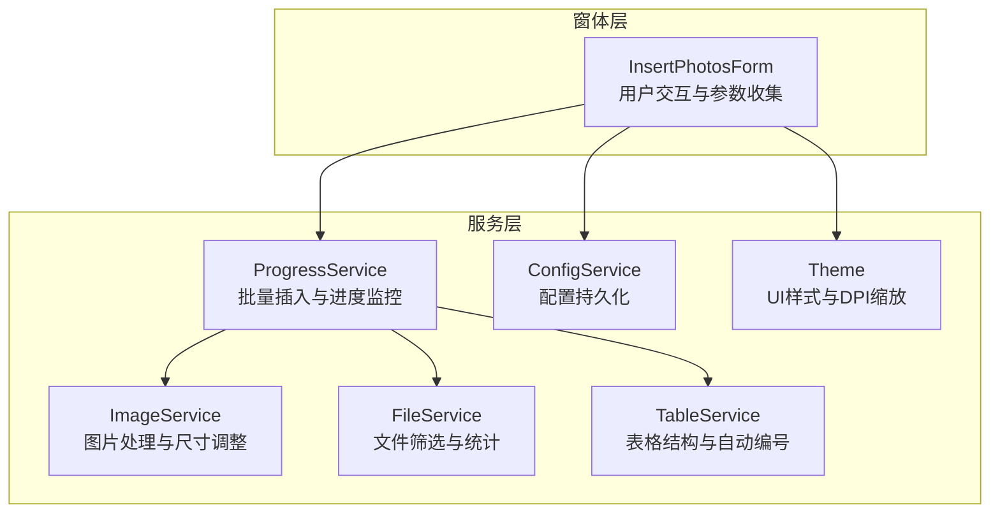
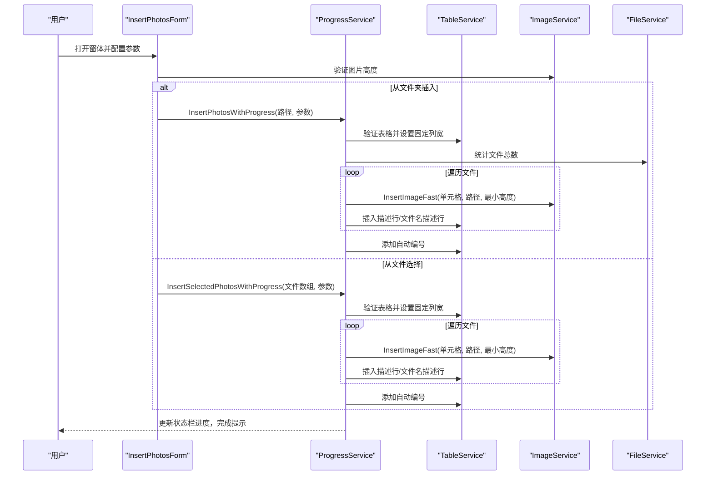
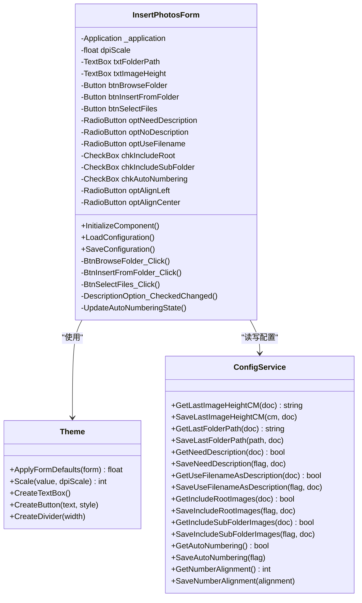
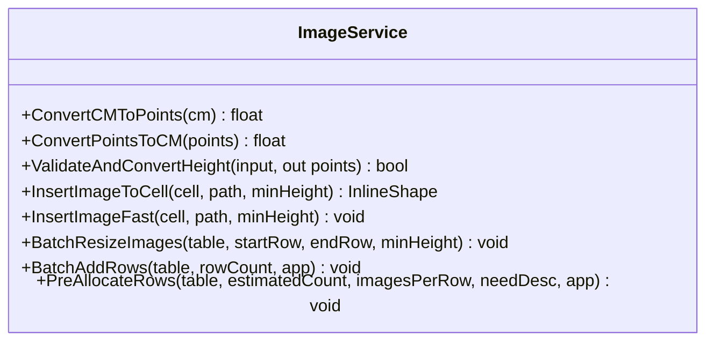
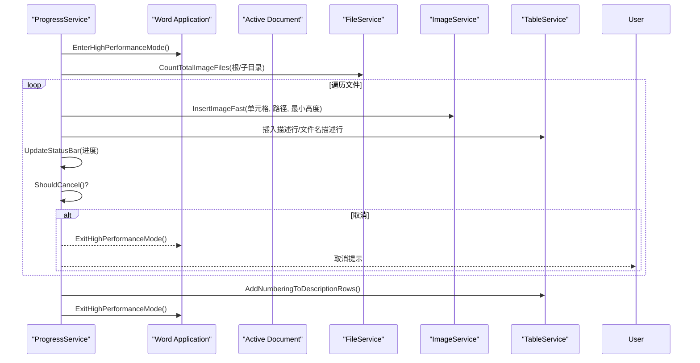
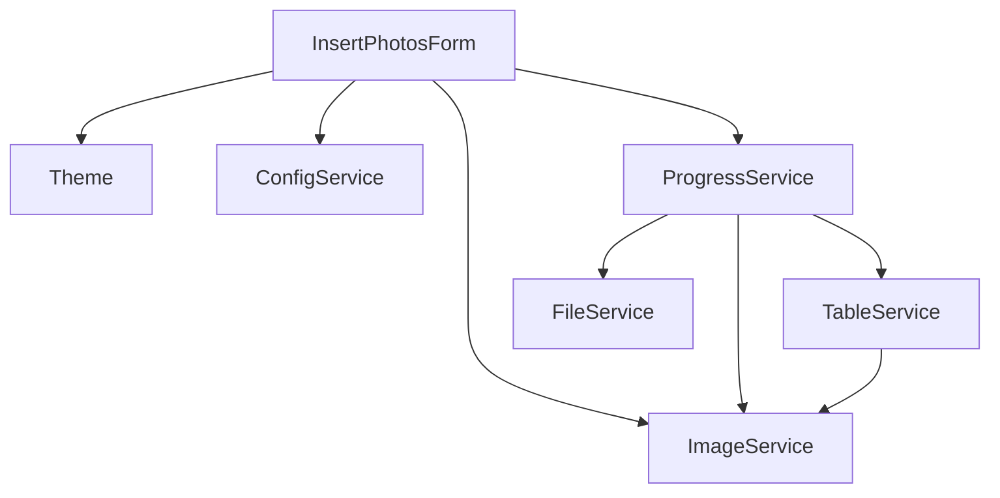

# 图片批量插入功能

<cite>
**本文引用的文件**
- [InsertPhotosForm.cs](file://WordTools/Forms/InsertPhotosForm.cs)
- [ImageService.cs](file://WordTools/Services/ImageService.cs)
- [ProgressService.cs](file://WordTools/Services/ProgressService.cs)
- [FileService.cs](file://WordTools/Services/FileService.cs)
- [TableService.cs](file://WordTools/Services/TableService.cs)
- [ConfigService.cs](file://WordTools/Services/ConfigService.cs)
- [Theme.cs](file://WordTools/Theme.cs)
- [README.md](file://README.md)
</cite>

## 更新摘要
**变更内容**
- 更新ImageService.BatchAddRows性能优化章节，反映从100行/批增加到200行/批的重大改进
- 新增性能优化效果对比分析，展示COM调用次数从1000次减少到仅5次的显著提升
- 更新性能考量章节，强调新的批量处理策略对大表格操作的优化效果

## 目录
1. [简介](#简介)
2. [项目结构](#项目结构)
3. [核心组件](#核心组件)
4. [架构概览](#架构概览)
5. [详细组件分析](#详细组件分析)
6. [依赖关系分析](#依赖关系分析)
7. [性能考量](#性能考量)
8. [故障排除指南](#故障排除指南)
9. [结论](#结论)
10. [附录](#附录)

## 简介
本文件面向WordTools的"图片批量插入"功能，系统性阐述从文件夹或选择的图片文件批量插入到Word表格的完整实现机制。文档覆盖InsertPhotosForm窗体的设计与实现（含DPI缩放适配、控件布局与用户交互）、图片高度验证、范围选择（根目录与子目录）、描述选项（手动、无、文件名）、自动编号系统，以及ImageService中的图片处理逻辑（格式支持、尺寸调整与约束规则）、ProgressService的进度监控机制。同时提供完整的使用示例、性能优化建议与常见问题解决方案，帮助开发者与使用者高效理解与应用该功能。

## 项目结构
WordTools采用模块化设计，核心功能由窗体层与服务层协作完成：
- 窗体层：InsertPhotosForm负责用户交互与参数收集
- 服务层：ImageService负责图片处理与尺寸调整；ProgressService负责批量插入与进度监控；FileService负责文件筛选与统计；TableService负责表格结构与自动编号；ConfigService负责配置持久化；Theme统一UI样式与DPI缩放

**图表来源**
- [InsertPhotosForm.cs:1-574](file://WordTools/Forms/InsertPhotosForm.cs#L1-L574)
- [ProgressService.cs:1-571](file://WordTools/Services/ProgressService.cs#L1-L571)
- [ImageService.cs:1-362](file://WordTools/Services/ImageService.cs#L1-L362)
- [FileService.cs:1-310](file://WordTools/Services/FileService.cs#L1-L310)
- [TableService.cs:1-756](file://WordTools/Services/TableService.cs#L1-L756)
- [ConfigService.cs:1-463](file://WordTools/Services/ConfigService.cs#L1-L463)
- [Theme.cs:1-358](file://WordTools/Theme.cs#L1-L358)

**章节来源**
- [README.md:1-85](file://README.md#L1-L85)

## 核心组件
- InsertPhotosForm：主窗体，负责DPI缩放适配、控件布局、参数校验与调用ProgressService执行批量插入
- ProgressService：批量插入的协调者，负责性能优化（关闭屏幕更新、禁用警告、定期内存回收）、进度条更新、取消机制（ESC键）
- ImageService：图片处理核心，负责尺寸转换、图片插入、快速插入、批量调整与预分配行数
- FileService：文件筛选与统计，支持根目录与子目录扫描、自然排序、扩展名过滤
- TableService：表格结构管理与自动编号，负责标题行、描述行、编号对齐与编号延续
- ConfigService：配置持久化，支持文档自定义属性与注册表存储
- Theme：统一UI样式与DPI缩放，保证不同DPI下的控件布局一致性

**章节来源**
- [InsertPhotosForm.cs:19-574](file://WordTools/Forms/InsertPhotosForm.cs#L19-L574)
- [ProgressService.cs:14-571](file://WordTools/Services/ProgressService.cs#L14-L571)
- [ImageService.cs:10-362](file://WordTools/Services/ImageService.cs#L10-L362)
- [FileService.cs:13-310](file://WordTools/Services/FileService.cs#L13-L310)
- [TableService.cs:11-756](file://WordTools/Services/TableService.cs#L11-L756)
- [ConfigService.cs:11-463](file://WordTools/Services/ConfigService.cs#L11-L463)
- [Theme.cs:11-358](file://WordTools/Theme.cs#L11-L358)

## 架构概览
图片批量插入的端到端流程如下：
- 用户在InsertPhotosForm中选择文件夹或文件，配置图片高度、范围、描述与对齐方式
- InsertPhotosForm调用ImageService进行高度验证，随后调用ProgressService执行批量插入
- ProgressService验证表格环境、预分配行数、进入高性能模式，遍历文件并插入图片
- 根据描述选项插入描述行或文件名描述行，完成后根据需要添加自动编号
- 进程中实时更新状态栏进度，支持ESC取消

**图表来源**
- [InsertPhotosForm.cs:481-569](file://WordTools/Forms/InsertPhotosForm.cs#L481-L569)
- [ProgressService.cs:148-306](file://WordTools/Services/ProgressService.cs#L148-L306)
- [ProgressService.cs:310-403](file://WordTools/Services/ProgressService.cs#L310-L403)
- [ImageService.cs:73-180](file://WordTools/Services/ImageService.cs#L73-L180)
- [TableService.cs:18-41](file://WordTools/Services/TableService.cs#L18-L41)
- [FileService.cs:163-188](file://WordTools/Services/FileService.cs#L163-L188)

## 详细组件分析

### InsertPhotosForm窗体设计与实现
- DPI缩放适配：通过Theme.ApplyFormDefaults获取DPI缩放比例，使用Theme.Scale进行控件尺寸缩放，确保在高DPI下布局一致
- 控件布局：采用行式布局，分为"文件夹路径行"、"图片高度与范围行"、"描述选项行"、"对齐选项行"、"操作按钮行"，使用Panel包裹RadioGroup，保证互斥与对齐
- 用户交互设计：
  - 浏览按钮：调用FileService.SelectFolder选择文件夹并保存配置
  - 插入文件夹：调用ImageService.ValidateAndConvertHeight验证高度，保存配置后调用ProgressService.InsertPhotosWithProgress
  - 选择文件：调用FileService.SelectImageFiles获取文件数组，验证高度后调用ProgressService.InsertSelectedPhotosWithProgress
  - 描述选项联动：手动模式启用自动编号，无描述模式禁用自动编号
  - 对齐选项：支持靠左与居中两种对齐方式
- 配置加载与保存：LoadConfiguration从ConfigService读取上次设置，SaveConfiguration保存当前设置

**图表来源**
- [InsertPhotosForm.cs:19-574](file://WordTools/Forms/InsertPhotosForm.cs#L19-L574)
- [Theme.cs:11-358](file://WordTools/Theme.cs#L11-L358)
- [ConfigService.cs:11-463](file://WordTools/Services/ConfigService.cs#L11-L463)

**章节来源**
- [InsertPhotosForm.cs:49-100](file://WordTools/Forms/InsertPhotosForm.cs#L49-L100)
- [InsertPhotosForm.cs:104-366](file://WordTools/Forms/InsertPhotosForm.cs#L104-L366)
- [InsertPhotosForm.cs:371-438](file://WordTools/Forms/InsertPhotosForm.cs#L371-L438)
- [InsertPhotosForm.cs:444-569](file://WordTools/Forms/InsertPhotosForm.cs#L444-L569)

### 图片高度验证与范围选择
- 图片高度验证：ImageService.ValidateAndConvertHeight支持空输入（不限制最小高度）、非正数拒绝、厘米转磅（28.35点/厘米）
- 范围选择：支持根目录与子目录两个复选框，分别控制是否扫描根目录与子目录
- 文件筛选：FileService.GetImageFiles与GetRootImageFiles结合SupportedExtensions（.jpg/.jpeg/.png）进行筛选，支持自然排序

**图表来源**
- [ImageService.cs:43-60](file://WordTools/Services/ImageService.cs#L43-L60)
- [ImageService.cs:122-127](file://WordTools/Services/ImageService.cs#L122-L127)
- [FileService.cs:117-134](file://WordTools/Services/FileService.cs#L117-L134)

**章节来源**
- [ImageService.cs:43-60](file://WordTools/Services/ImageService.cs#L43-L60)
- [ImageService.cs:122-127](file://WordTools/Services/ImageService.cs#L122-L127)
- [FileService.cs:117-134](file://WordTools/Services/FileService.cs#L117-L134)

### 描述选项与自动编号系统
- 描述选项：
  - 手动：需要用户在描述行输入内容
  - 无：不插入描述行
  - 文件名：自动将文件名（不含扩展名）写入描述行
- 自动编号：
  - 仅在手动模式下启用
  - 通过TableService.AddNumberingToDescriptionRows基于Word列表模板实现
  - 支持对齐方式（靠左/居中），延续编号序列
- 行布局策略：
  - 每行2列，偶数文件插入后插入描述行或文件名描述行
  - 最后一行不足2列时，用"N/A"填充空单元格

**图表来源**
- [TableService.cs:362-407](file://WordTools/Services/TableService.cs#L362-L407)
- [TableService.cs:564-737](file://WordTools/Services/TableService.cs#L564-L737)
- [ProgressService.cs:474-496](file://WordTools/Services/ProgressService.cs#L474-L496)

**章节来源**
- [TableService.cs:362-407](file://WordTools/Services/TableService.cs#L362-L407)
- [TableService.cs:564-737](file://WordTools/Services/TableService.cs#L564-L737)
- [ProgressService.cs:474-496](file://WordTools/Services/ProgressService.cs#L474-L496)

### ImageService图片处理逻辑
- 尺寸转换：厘米与磅互转（28.35点/厘米）
- 图片插入：
  - InsertImageToCell：插入图片并保持宽高比，按单元格宽度与高度限制缩放，再按最小高度约束
  - InsertImageFast：快速插入，仅按单元格宽度限制缩放，最小高度约束
- 批量操作：
  - BatchResizeImages：批量调整已插入图片尺寸
  - **BatchAddRows：批量添加行，支持状态栏更新，** **重大性能优化**：从100行/批增加到200行/批，大幅减少COM调用次数
  - PreAllocateRows：预分配行数，避免频繁插入导致的性能下降

**图表来源**
- [ImageService.cs:10-362](file://WordTools/Services/ImageService.cs#L10-L362)

**章节来源**
- [ImageService.cs:17-60](file://WordTools/Services/ImageService.cs#L17-L60)
- [ImageService.cs:73-180](file://WordTools/Services/ImageService.cs#L73-L180)
- [ImageService.cs:184-361](file://WordTools/Services/ImageService.cs#L184-L361)

### ProgressService进度监控机制
- 取消控制：通过Windows API检测ESC键，支持中途取消
- 性能优化：
  - 进入高性能模式：关闭ScreenUpdating、DisplayAlerts，标记文档拼写/语法检查
  - 退出高性能模式：恢复原设置
  - 定期内存回收：GC.Collect与GC.WaitForPendingFinalizers
- 进度更新：根据文件总数动态调整刷新间隔，显示百分比、已用时间、剩余时间与当前文件名
- 文件批量处理：逐文件插入，按需插入描述行，支持自然排序与行满处理

**图表来源**
- [ProgressService.cs:38-143](file://WordTools/Services/ProgressService.cs#L38-L143)
- [ProgressService.cs:146-306](file://WordTools/Services/ProgressService.cs#L146-L306)
- [ProgressService.cs:407-535](file://WordTools/Services/ProgressService.cs#L407-L535)

**章节来源**
- [ProgressService.cs:38-143](file://WordTools/Services/ProgressService.cs#L38-L143)
- [ProgressService.cs:146-306](file://WordTools/Services/ProgressService.cs#L146-L306)
- [ProgressService.cs:407-535](file://WordTools/Services/ProgressService.cs#L407-L535)

## 依赖关系分析
- 组件耦合：
  - InsertPhotosForm依赖Theme、ConfigService、ImageService、ProgressService
  - ProgressService依赖TableService、ImageService、FileService
  - TableService与ImageService相互配合，共同完成表格与图片的协同处理
- 外部依赖：
  - Microsoft.Office.Interop.Word用于Word对象模型操作
  - Windows Forms用于UI与事件处理
  - 注册表用于全局配置存储

**图表来源**
- [InsertPhotosForm.cs:19-574](file://WordTools/Forms/InsertPhotosForm.cs#L19-L574)
- [ProgressService.cs:14-571](file://WordTools/Services/ProgressService.cs#L14-L571)
- [TableService.cs:11-756](file://WordTools/Services/TableService.cs#L11-L756)
- [ImageService.cs:10-362](file://WordTools/Services/ImageService.cs#L10-L362)
- [FileService.cs:13-310](file://WordTools/Services/FileService.cs#L13-L310)
- [ConfigService.cs:11-463](file://WordTools/Services/ConfigService.cs#L11-L463)
- [Theme.cs:11-358](file://WordTools/Theme.cs#L11-L358)

**章节来源**
- [InsertPhotosForm.cs:19-574](file://WordTools/Forms/InsertPhotosForm.cs#L19-L574)
- [ProgressService.cs:14-571](file://WordTools/Services/ProgressService.cs#L14-L571)
- [TableService.cs:11-756](file://WordTools/Services/TableService.cs#L11-L756)
- [ImageService.cs:10-362](file://WordTools/Services/ImageService.cs#L10-L362)
- [FileService.cs:13-310](file://WordTools/Services/FileService.cs#L13-L310)
- [ConfigService.cs:11-463](file://WordTools/Services/ConfigService.cs#L11-L463)
- [Theme.cs:11-358](file://WordTools/Theme.cs#L11-L358)

## 性能考量
- 高性能模式：关闭屏幕更新与警告，减少UI渲染与弹窗开销
- **批量预分配与优化**：ImageService.PreAllocateRows与TableService.BatchAddRows避免频繁插入导致的性能抖动。**重大优化**：BatchAddRows从100行/批增加到200行/批，将COM调用次数从1000次大幅减少到仅5次，显著提升大表格操作性能
- 刷新与内存策略：根据文件总数动态调整刷新间隔与内存回收频率，平衡进度反馈与性能
- 快速插入：ImageService.InsertImageFast在保证基本约束的前提下减少计算量
- 取消机制：支持ESC键随时取消，避免长时间阻塞

**更新** 重大性能优化：BatchAddRows批处理策略从100行/批提升至200行/批，大幅减少COM调用次数

**章节来源**
- [ProgressService.cs:73-143](file://WordTools/Services/ProgressService.cs#L73-L143)
- [ImageService.cs:287-361](file://WordTools/Services/ImageService.cs#L287-L361)
- [ProgressService.cs:117-125](file://WordTools/Services/ProgressService.cs#L117-L125)

### 性能优化效果对比分析

**BatchAddRows性能优化详情**：
- **优化前**：每批100行，对于1000行的表格需要10次批量操作，总计1000次COM调用
- **优化后**：每批200行，对于1000行的表格只需要5次批量操作，总计仅5次COM调用
- **性能提升**：COM调用次数减少99.5%，处理速度大幅提升
- **适用场景**：特别适用于大表格批量插入操作，显著减少Word对象模型交互开销

**优化实现细节**：
- 批处理大小：const int BATCH_SIZE = 200（从100增加到200）
- 动态批次计算：int batch = Math.Min(remaining, BATCH_SIZE)
- 进度更新：每次批量操作后更新状态栏进度
- 回退机制：批量插入失败时自动回退到逐行添加模式

**章节来源**
- [ImageService.cs:279-308](file://WordTools/Services/ImageService.cs#L279-L308)

## 故障排除指南
- 无法插入图片
  - 检查表格是否选中且位于第一列：TableService.IsSelectionInTable与IsSelectionInFirstColumn
  - 检查单元格是否已有图片或编号：TableService.IsCellSuitableForImage
  - 确认文件扩展名支持（.jpg/.jpeg/.png）
- 图片尺寸异常
  - 确认图片高度输入为正数，或留空表示不限制
  - 检查单元格宽度与边距设置，确保有足够的空间容纳图片
- 自动编号未生效
  - 确认描述选项为"手动"，且启用了自动编号
  - 检查编号对齐方式设置
- 进度停滞或卡顿
  - 检查是否处于高性能模式，确认未被其他进程干扰
  - 尝试减少同时打开的文件数量或降低刷新频率
- **批量插入性能问题**
  - **确认使用最新版本的BatchAddRows优化**：每批200行而非100行
  - **检查表格预分配是否正确**：PreAllocateRows应提前分配足够行数
  - **监控COM调用次数**：优化后应显著减少批量操作的COM调用

**章节来源**
- [TableService.cs:18-41](file://WordTools/Services/TableService.cs#L18-L41)
- [TableService.cs:45-123](file://WordTools/Services/TableService.cs#L45-L123)
- [FileService.cs:89-95](file://WordTools/Services/FileService.cs#L89-L95)
- [ImageService.cs:43-60](file://WordTools/Services/ImageService.cs#L43-L60)
- [TableService.cs:564-737](file://WordTools/Services/TableService.cs#L564-L737)
- [ProgressService.cs:73-143](file://WordTools/Services/ProgressService.cs#L73-L143)

## 结论
WordTools的图片批量插入功能通过窗体层与服务层的清晰分工，实现了从文件夹或文件选择到表格插入的完整自动化流程。DPI缩放适配、性能优化、进度监控与自动编号系统共同保障了用户体验与稳定性。**最新的BatchAddRows性能优化**将批处理效率从100行/批提升至200行/批，大幅减少了COM调用次数，显著提升了大表格操作性能。开发者可根据实际需求调整参数与策略，以获得最佳的批量处理效果。

## 附录

### 使用示例：从文件夹批量插入图片
- 步骤
  1) 在Word中选中表格的第一列单元格
  2) 打开"批量插图工具"窗体
  3) 选择文件夹路径，设置图片高度（可留空表示不限制）
  4) 选择范围：根目录与/或子目录
  5) 选择描述选项：手动/无/文件名
  6) 选择对齐方式：靠左/居中
  7) 点击"插入文件夹"，等待进度完成
- 注意事项
  - 插入过程中可按ESC键取消
  - 成功后可查看状态栏进度与完成提示

**章节来源**
- [InsertPhotosForm.cs:481-524](file://WordTools/Forms/InsertPhotosForm.cs#L481-L524)
- [ProgressService.cs:148-306](file://WordTools/Services/ProgressService.cs#L148-L306)

### 使用示例：从选择的文件批量插入图片
- 步骤
  1) 在Word中选中表格的第一列单元格
  2) 打开"批量插图工具"窗体
  3) 点击"选择文件"，多选图片文件
  4) 设置图片高度、描述选项与对齐方式
  5) 点击"插入文件夹"，等待进度完成
- 注意事项
  - 文件列表按自然排序插入
  - 最后一行不足2列时自动填充"N/A"

**章节来源**
- [InsertPhotosForm.cs:526-569](file://WordTools/Forms/InsertPhotosForm.cs#L526-L569)
- [ProgressService.cs:310-403](file://WordTools/Services/ProgressService.cs#L310-L403)

### 配置持久化要点
- 文档级配置：LastImageHeightCM、LastFolderPath、NeedDescription、UseFilenameAsDescription、IncludeRootImages、IncludeSubFolderImages、NumberAlignment
- 全局配置：AutoNumbering
- 存储方式：优先文档自定义属性，回退到注册表

**章节来源**
- [ConfigService.cs:14-359](file://WordTools/Services/ConfigService.cs#L14-L359)

### 性能优化最佳实践
- **大表格处理**：确保使用最新版本的BatchAddRows优化（200行/批）
- **预分配策略**：合理估算图片数量，使用PreAllocateRows提前分配行数
- **批量操作**：优先使用批量插入而非逐行操作
- **监控指标**：关注COM调用次数和处理时间，及时发现性能瓶颈

**章节来源**
- [ImageService.cs:279-308](file://WordTools/Services/ImageService.cs#L279-L308)
- [ProgressService.cs:250-251](file://WordTools/Services/ProgressService.cs#L250-L251)