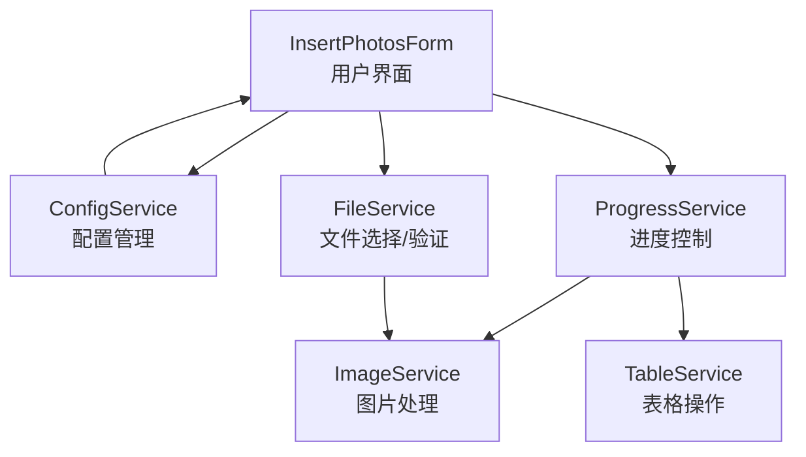
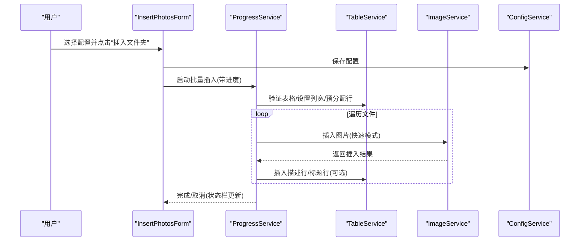
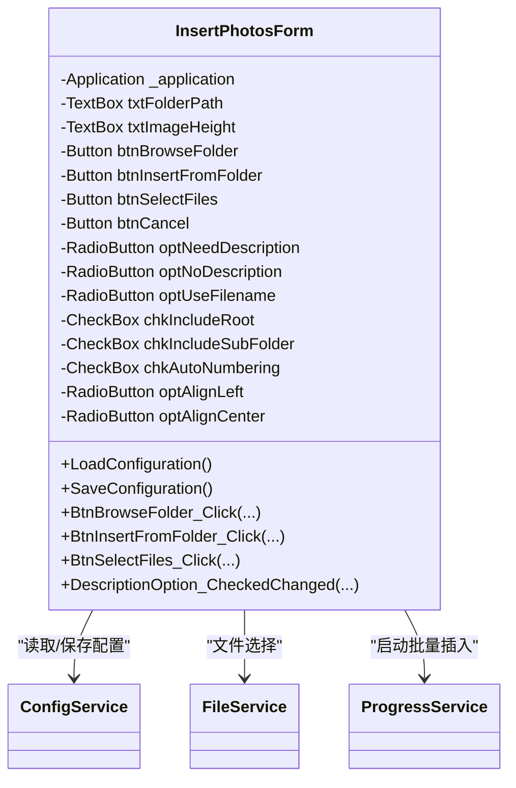
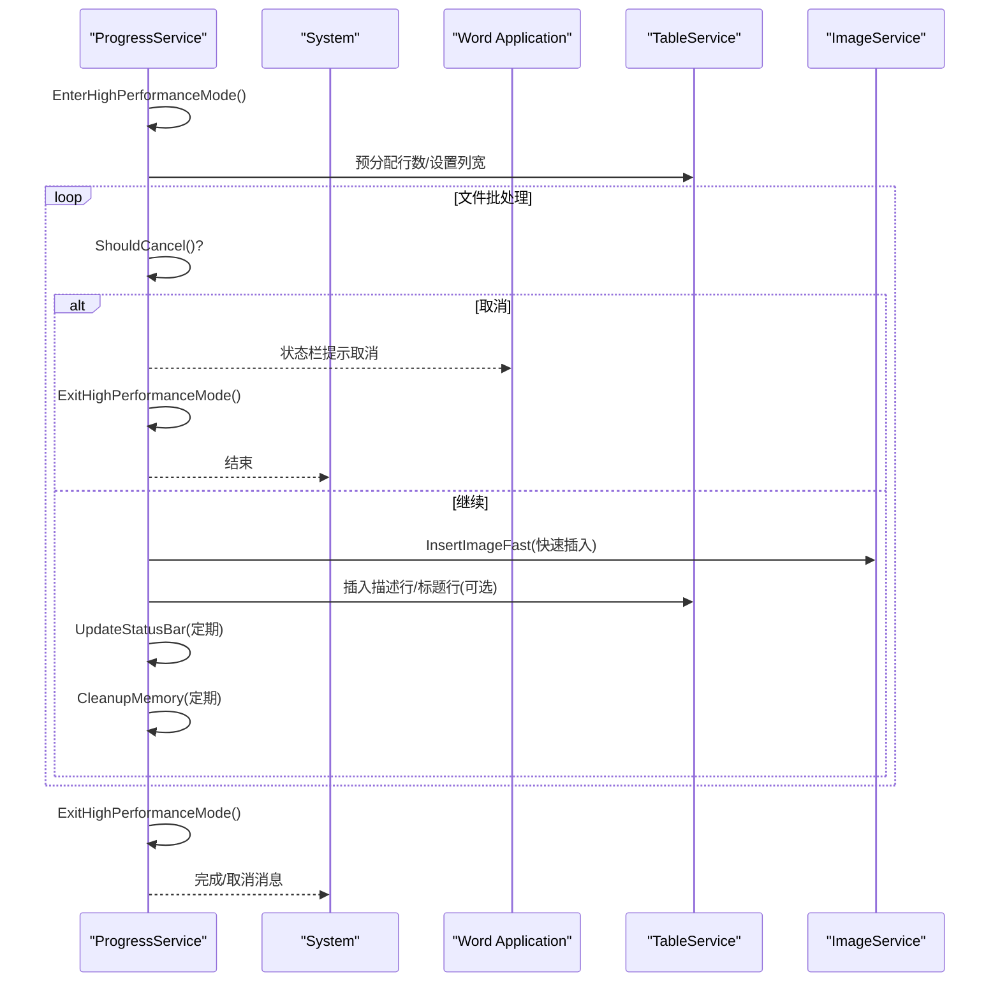
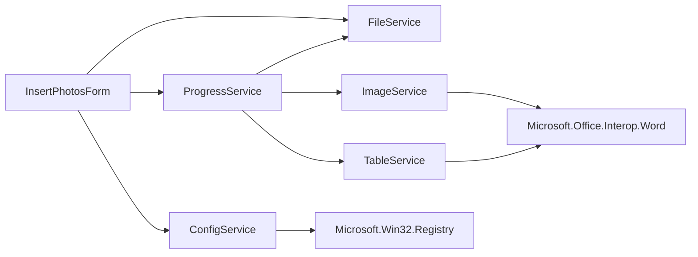

# 批量图片插入功能

<cite>
**本文引用的文件**
- [InsertPhotosForm.cs](file://WordTools/Forms/InsertPhotosForm.cs)
- [ImageService.cs](file://WordTools/Services/ImageService.cs)
- [ProgressService.cs](file://WordTools/Services/ProgressService.cs)
- [FileService.cs](file://WordTools/Services/FileService.cs)
- [ConfigService.cs](file://WordTools/Services/ConfigService.cs)
- [TableService.cs](file://WordTools/Services/TableService.cs)
- [README.md](file://README.md)
</cite>

## 目录
1. [简介](#简介)
2. [项目结构](#项目结构)
3. [核心组件](#核心组件)
4. [架构概览](#架构概览)
5. [详细组件分析](#详细组件分析)
6. [依赖关系分析](#依赖关系分析)
7. [性能考量](#性能考量)
8. [故障排除指南](#故障排除指南)
9. [结论](#结论)
10. [附录](#附录)

## 简介
本功能旨在为 Microsoft Word 提供“批量图片插入”能力，支持从文件夹批量导入图片到表格，并提供灵活的配置选项，包括图片高度限制、描述行生成策略、自动编号以及对齐方式等。系统通过用户界面收集配置，调用服务层执行图片处理与进度控制，最终在 Word 表格中生成规范化的图片布局。

## 项目结构
项目采用分层设计：
- 界面层：InsertPhotosForm 负责用户交互与配置收集
- 服务层：ImageService、FileService、ProgressService、TableService、ConfigService 提供图片处理、文件操作、进度控制、表格操作与配置管理
- 插件入口：ThisAddIn.cs（在项目结构中可见）负责加载 Word 插件

图表来源
- [InsertPhotosForm.cs:52-618](file://WordTools/Forms/InsertPhotosForm.cs#L52-L618)
- [ConfigService.cs:11-362](file://WordTools/Services/ConfigService.cs#L11-L362)
- [FileService.cs:13-310](file://WordTools/Services/FileService.cs#L13-L310)
- [ProgressService.cs:14-571](file://WordTools/Services/ProgressService.cs#L14-L571)
- [ImageService.cs:10-325](file://WordTools/Services/ImageService.cs#L10-L325)
- [TableService.cs:11-756](file://WordTools/Services/TableService.cs#L11-L756)

章节来源
- [README.md:1-85](file://README.md#L1-L85)

## 核心组件
- InsertPhotosForm：主界面，负责收集用户配置（文件夹路径、图片高度、描述选项、对齐方式、包含范围等），并触发批量插入流程
- ImageService：图片处理核心，负责尺寸转换、图片插入、批量调整与预分配行数
- ProgressService：进度控制与性能优化，支持取消、状态栏更新、内存回收与批量操作
- FileService：文件选择与验证，支持文件夹选择、图片文件筛选、自然排序与统计
- TableService：表格操作，负责表格验证、列宽设置、标题行/描述行插入、自动编号与编号对齐
- ConfigService：配置持久化，支持文档自定义属性与注册表存储

章节来源
- [InsertPhotosForm.cs:18-618](file://WordTools/Forms/InsertPhotosForm.cs#L18-L618)
- [ImageService.cs:10-325](file://WordTools/Services/ImageService.cs#L10-L325)
- [ProgressService.cs:14-571](file://WordTools/Services/ProgressService.cs#L14-L571)
- [FileService.cs:13-310](file://WordTools/Services/FileService.cs#L13-L310)
- [TableService.cs:11-756](file://WordTools/Services/TableService.cs#L11-L756)
- [ConfigService.cs:11-362](file://WordTools/Services/ConfigService.cs#L11-L362)

## 架构概览
整体流程：用户在 InsertPhotosForm 中选择配置，点击“插入文件夹”或“选择文件”，ProgressService 进入高性能模式并开始批量处理；FileService 统计与排序文件，ImageService 执行图片插入与尺寸调整，TableService 管理表格结构与编号，ConfigService 保存用户偏好；期间通过状态栏实时反馈进度，支持 ESC 取消。

图表来源
- [InsertPhotosForm.cs:525-568](file://WordTools/Forms/InsertPhotosForm.cs#L525-L568)
- [ProgressService.cs:151-306](file://WordTools/Services/ProgressService.cs#L151-L306)
- [ImageService.cs:142-180](file://WordTools/Services/ImageService.cs#L142-L180)
- [TableService.cs:304-407](file://WordTools/Services/TableService.cs#L304-L407)

## 详细组件分析

### InsertPhotosForm 用户界面设计与实现
- 布局与控件
  - 文件夹路径行：包含“文件夹”标签、路径输入框、浏览按钮
  - 图片高度与范围行：高度输入框（单位 cm）、根目录/子目录复选框
  - 分隔线：视觉分组
  - 描述选项行：手动/无/文件名三种单选，自动编号复选框随描述模式联动
  - 对齐选项行：靠左/居中两种单选
  - 操作按钮行：插入文件夹、选择文件、取消
- 颜色与布局
  - 使用统一配色方案与间距常量，保证界面一致性
  - DIP 缩放启用，适配高分辨率屏幕
- 配置加载与保存
  - 启动时从 ConfigService 读取上次设置并填充界面
  - 保存时将当前配置写回 ConfigService（文档属性与注册表）
- 事件处理
  - 浏览按钮：调用 FileService.SelectFolder 选择文件夹
  - 插入文件夹：校验高度输入，隐藏窗体并启动 ProgressService
  - 选择文件：调用 FileService.SelectImageFiles，校验高度后启动 ProgressService
  - 描述选项切换：根据“无描述”禁用自动编号

图表来源
- [InsertPhotosForm.cs:18-618](file://WordTools/Forms/InsertPhotosForm.cs#L18-L618)
- [ConfigService.cs:11-362](file://WordTools/Services/ConfigService.cs#L11-L362)
- [FileService.cs:13-310](file://WordTools/Services/FileService.cs#L13-L310)
- [ProgressService.cs:14-571](file://WordTools/Services/ProgressService.cs#L14-L571)

章节来源
- [InsertPhotosForm.cs:59-411](file://WordTools/Forms/InsertPhotosForm.cs#L59-L411)
- [InsertPhotosForm.cs:415-482](file://WordTools/Forms/InsertPhotosForm.cs#L415-L482)
- [InsertPhotosForm.cs:509-613](file://WordTools/Forms/InsertPhotosForm.cs#L509-L613)

### ImageService 图片处理流程
- 尺寸转换
  - 厘米与磅互转（常量：1 英寸 = 2.54 厘米 ≈ 72 磅）
  - 高度输入校验：空值视为不限制；非空需为正数
- 图片插入
  - InsertImageToCell：插入图片并保持纵横比，按单元格宽度/高度限制缩放，再应用最小高度限制
  - InsertImageFast：快速模式，仅按单元格宽度限制缩放，最小高度限制
- 批量操作
  - BatchResizeImages：批量调整已插入图片尺寸
  - BatchAddRows：批量添加行（分批更新状态栏）
  - PreAllocateRows：预分配行数，避免频繁动态扩展

图表来源
- [ImageService.cs:43-60](file://WordTools/Services/ImageService.cs#L43-L60)
- [ImageService.cs:73-134](file://WordTools/Services/ImageService.cs#L73-L134)
- [ImageService.cs:142-180](file://WordTools/Services/ImageService.cs#L142-L180)

章节来源
- [ImageService.cs:12-62](file://WordTools/Services/ImageService.cs#L12-L62)
- [ImageService.cs:73-180](file://WordTools/Services/ImageService.cs#L73-L180)
- [ImageService.cs:184-322](file://WordTools/Services/ImageService.cs#L184-L322)

### ProgressService 进度控制机制
- 取消支持
  - 通过 Windows API 检测 ESC 键，一旦按下标记取消并更新状态栏
- 性能优化
  - 高性能模式：关闭 ScreenUpdating、DisplayAlerts，标记文档拼写/语法检查状态
  - 根据文件总数动态调整刷新间隔、内存清理间隔与保存间隔
  - 定期执行内存回收（DoEvents + GC）
- 批量处理
  - 从文件夹：统计总文件数，预分配行数，逐批处理，支持根目录与子目录
  - 选中文件：直接处理选定文件数组
  - 状态栏更新：显示当前/总数、百分比、已用时间、剩余时间与当前文件名
- 编号与收尾
  - 成功/失败计数，完成时弹出汇总消息
  - 可选自动编号：在描述行添加编号并设置对齐方式

图表来源
- [ProgressService.cs:38-66](file://WordTools/Services/ProgressService.cs#L38-L66)
- [ProgressService.cs:73-144](file://WordTools/Services/ProgressService.cs#L73-L144)
- [ProgressService.cs:148-306](file://WordTools/Services/ProgressService.cs#L148-L306)
- [ProgressService.cs:409-535](file://WordTools/Services/ProgressService.cs#L409-L535)

章节来源
- [ProgressService.cs:14-571](file://WordTools/Services/ProgressService.cs#L14-L571)

### FileService 文件选择与验证
- 文件夹选择：使用 FolderBrowserDialog，支持初始路径
- 图片文件选择：OpenFileDialog，多选，过滤 .jpg/.jpeg/.png
- 文件验证：扩展名检查、文件存在性检查
- 文件列表获取：根目录图片、子文件夹列表、自然排序（类似资源管理器）
- 统计：统计根目录与子目录图片总数

章节来源
- [FileService.cs:26-78](file://WordTools/Services/FileService.cs#L26-L78)
- [FileService.cs:89-106](file://WordTools/Services/FileService.cs#L89-L106)
- [FileService.cs:117-188](file://WordTools/Services/FileService.cs#L117-L188)
- [FileService.cs:254-270](file://WordTools/Services/FileService.cs#L254-L270)

### TableService 表格操作
- 表格验证：当前选择是否在表格中、是否在第一列
- 单元格适配：检查是否已有图片、是否为编号文本，必要时清理
- 查找合适单元格：在限定范围内寻找可插入位置
- 表格维护：确保行存在、调整列数、固定列宽
- 标题行/描述行：创建标题行、插入描述行、插入文件名描述行、填充空单元格为 N/A
- 自动编号：清除原有编号、识别对齐方式、在描述行添加编号并设置对齐

章节来源
- [TableService.cs:18-123](file://WordTools/Services/TableService.cs#L18-L123)
- [TableService.cs:128-196](file://WordTools/Services/TableService.cs#L128-L196)
- [TableService.cs:205-295](file://WordTools/Services/TableService.cs#L205-L295)
- [TableService.cs:304-434](file://WordTools/Services/TableService.cs#L304-L434)
- [TableService.cs:446-737](file://WordTools/Services/TableService.cs#L446-L737)

### ConfigService 配置管理
- 文档自定义属性：优先从当前文档读取/保存
- 注册表：回退到注册表存储（HKCU）
- 配置项：最后图片高度、最后文件夹路径、描述行策略、包含范围、自动编号、编号对齐
- 空值处理：使用特殊标记避免 Word COM 不接受空字符串

章节来源
- [ConfigService.cs:31-92](file://WordTools/Services/ConfigService.cs#L31-L92)
- [ConfigService.cs:149-178](file://WordTools/Services/ConfigService.cs#L149-L178)
- [ConfigService.cs:187-207](file://WordTools/Services/ConfigService.cs#L187-L207)
- [ConfigService.cs:216-259](file://WordTools/Services/ConfigService.cs#L216-L259)
- [ConfigService.cs:268-311](file://WordTools/Services/ConfigService.cs#L268-L311)
- [ConfigService.cs:320-357](file://WordTools/Services/ConfigService.cs#L320-L357)

## 依赖关系分析
- InsertPhotosForm 依赖 ConfigService、FileService、ProgressService
- ProgressService 依赖 TableService、ImageService、FileService
- ImageService 与 TableService 依赖 Microsoft.Office.Interop.Word
- ConfigService 依赖 Microsoft.Win32.Registry 与 Word COM

图表来源
- [InsertPhotosForm.cs:52-618](file://WordTools/Forms/InsertPhotosForm.cs#L52-L618)
- [ProgressService.cs:14-571](file://WordTools/Services/ProgressService.cs#L14-L571)
- [ImageService.cs:10-325](file://WordTools/Services/ImageService.cs#L10-L325)
- [TableService.cs:11-756](file://WordTools/Services/TableService.cs#L11-L756)
- [ConfigService.cs:11-362](file://WordTools/Services/ConfigService.cs#L11-L362)

## 性能考量
- 高性能模式：关闭屏幕更新与警告，减少 UI 干扰
- 批量操作：分批添加行、分批更新状态栏，降低 COM 调用频率
- 内存回收：定期触发 Application.DoEvents + GC，缓解大文件批量处理的内存压力
- 刷新策略：根据文件总数动态调整刷新/清理/保存间隔，平衡流畅度与性能
- 快速插入：InsertImageFast 仅按宽度限制缩放，减少不必要的高度计算

章节来源
- [ProgressService.cs:73-144](file://WordTools/Services/ProgressService.cs#L73-L144)
- [ProgressService.cs:117-125](file://WordTools/Services/ProgressService.cs#L117-L125)
- [ImageService.cs:142-180](file://WordTools/Services/ImageService.cs#L142-L180)

## 故障排除指南
- 无法插入图片
  - 检查表格选择：必须在表格中且光标位于第一列
  - 检查单元格状态：确保单元格为空或可复用（非编号文本）
  - 检查文件有效性：确认文件存在且扩展名为受支持格式
- 高度设置无效
  - 输入必须为大于 0 的数字；空值表示不限制
- 进度不更新或卡顿
  - 确认未按住 ESC；若长时间无响应，可按 ESC 取消并重新开始
  - 大批量文件时，适当减少同时打开的文件数
- 自动编号异常
  - 若之前存在编号，系统会尝试清除并重新编号；如冲突，可手动调整对齐方式
- 配置未保存
  - 确认文档属性与注册表权限；必要时以管理员身份运行

章节来源
- [TableService.cs:18-41](file://WordTools/Services/TableService.cs#L18-L41)
- [TableService.cs:45-123](file://WordTools/Services/TableService.cs#L45-L123)
- [FileService.cs:89-106](file://WordTools/Services/FileService.cs#L89-L106)
- [ImageService.cs:43-60](file://WordTools/Services/ImageService.cs#L43-L60)
- [ProgressService.cs:41-64](file://WordTools/Services/ProgressService.cs#L41-L64)

## 结论
批量图片插入功能通过清晰的分层架构实现了从界面配置到图片处理、表格布局与进度控制的完整闭环。其关键优势在于：
- 灵活的配置选项与持久化
- 高性能的批量处理与内存管理
- 实时进度反馈与用户取消支持
- 规范化的表格布局与自动编号

建议在实际使用中结合文件规模选择合适的处理策略，并注意 Word COM 的稳定性与权限问题。

## 附录

### 使用示例

- 从文件夹批量处理
  1) 在 Word 中选中表格，将光标置于第一列
  2) 打开“批量插图工具”，选择文件夹，设置图片高度（可选）
  3) 选择“根目录/子目录”包含范围与描述策略（手动/无/文件名）
  4) 点击“插入文件夹”，等待进度条完成；过程中可按 ESC 取消
  5) 完成后可选择自动编号与对齐方式

- 从选择文件处理
  1) 在 Word 中选中表格，将光标置于第一列
  2) 打开“批量插图工具”，点击“选择文件”，多选图片
  3) 设置图片高度与描述策略，点击“选择文件”开始处理

- 配置选项说明
  - 图片高度：厘米，空值表示不限制
  - 包含范围：根目录/子目录
  - 描述选项：手动（可配合自动编号）、无、文件名
  - 自动编号：仅在“手动”模式下可用
  - 编号对齐：靠左/居中（注册表存储）

章节来源
- [InsertPhotosForm.cs:525-613](file://WordTools/Forms/InsertPhotosForm.cs#L525-L613)
- [ConfigService.cs:149-357](file://WordTools/Services/ConfigService.cs#L149-L357)