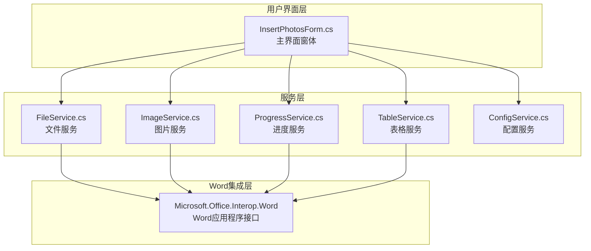
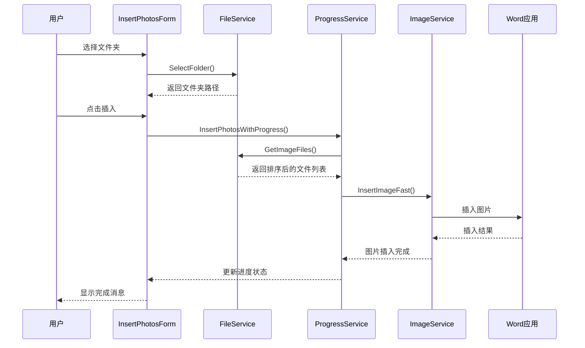
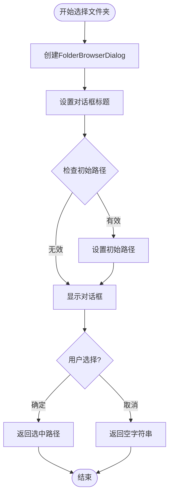
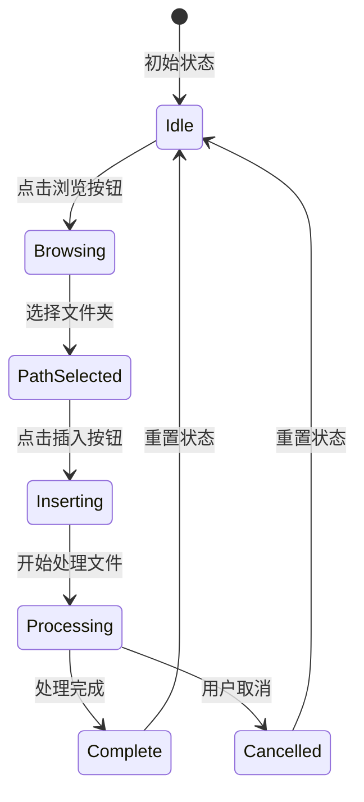
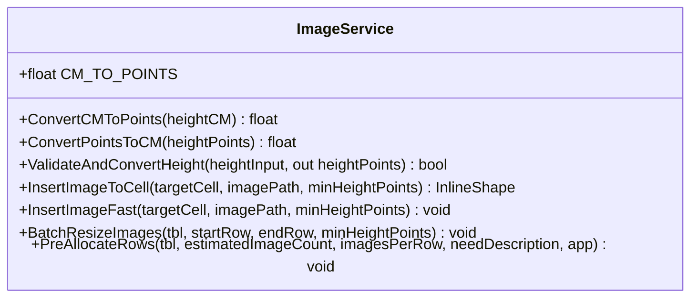
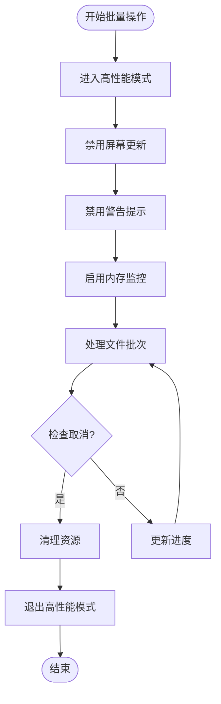
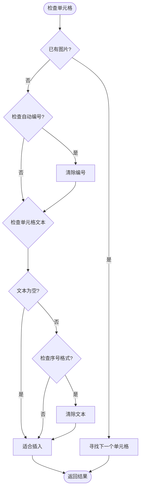
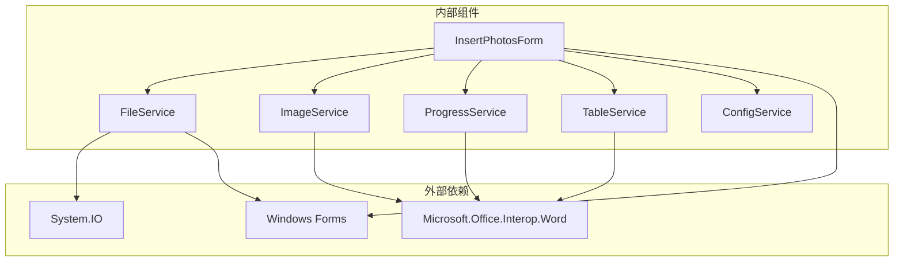

# 文件操作服务

<cite>
**本文档引用的文件**
- [FileService.cs](file://WordTools/Services/FileService.cs)
- [InsertPhotosForm.cs](file://WordTools/Forms/InsertPhotosForm.cs)
- [ImageService.cs](file://WordTools/Services/ImageService.cs)
- [ConfigService.cs](file://WordTools/Services/ConfigService.cs)
- [ProgressService.cs](file://WordTools/Services/ProgressService.cs)
- [TableService.cs](file://WordTools/Services/TableService.cs)
- [README.md](file://README.md)
</cite>

## 目录
1. [简介](#简介)
2. [项目结构](#项目结构)
3. [核心组件](#核心组件)
4. [架构概览](#架构概览)
5. [详细组件分析](#详细组件分析)
6. [依赖关系分析](#依赖关系分析)
7. [性能考虑](#性能考虑)
8. [故障排除指南](#故障排除指南)
9. [结论](#结论)

## 简介

文件操作服务是Word工具箱项目中的核心组件，负责处理文件系统访问、图片文件验证和路径处理等功能。该服务为批量图片插入工具提供了强大的文件管理能力，支持文件夹选择、多文件选择、图片验证、自然排序等关键功能。

该项目是一个基于COM加载项的Word插件，安装后会在Word功能区添加"Word工具箱"自定义选项卡，提供批量图片插入等实用功能。

## 项目结构

项目采用分层架构设计，主要包含以下核心模块：



**图表来源**
- [InsertPhotosForm.cs:1-618](file://WordTools/Forms/InsertPhotosForm.cs#L1-L618)
- [FileService.cs:1-310](file://WordTools/Services/FileService.cs#L1-L310)
- [ImageService.cs:1-325](file://WordTools/Services/ImageService.cs#L1-L325)

**章节来源**
- [README.md:1-85](file://README.md#L1-L85)

## 核心组件

文件操作服务由多个专门的服务类组成，每个类都有明确的职责分工：

### FileService - 文件操作核心服务
- **文件夹选择**: 提供文件夹选择对话框功能
- **图片文件选择**: 支持多文件选择的图片文件对话框
- **文件验证**: 图片格式验证和文件存在性检查
- **文件列表获取**: 获取文件夹中的图片文件和子文件夹
- **自然排序**: 实现智能的文件名排序算法

### ImageService - 图片处理服务
- **尺寸转换**: 厘米与磅的单位转换
- **图片插入**: 将图片插入到Word表格单元格
- **批量操作**: 支持大量图片的高效处理

### ProgressService - 进度管理服务
- **性能优化**: 高性能模式下的Word操作优化
- **进度跟踪**: 实时显示处理进度和剩余时间
- **取消控制**: 支持ESC键取消操作

### TableService - 表格操作服务
- **表格验证**: 验证Word表格的可用性和位置
- **单元格管理**: 智能查找和管理适合插入图片的单元格
- **自动编号**: 为描述行添加自动编号功能

**章节来源**
- [FileService.cs:13-310](file://WordTools/Services/FileService.cs#L13-L310)
- [ImageService.cs:10-325](file://WordTools/Services/ImageService.cs#L10-L325)
- [ProgressService.cs:14-571](file://WordTools/Services/ProgressService.cs#L14-L571)
- [TableService.cs:11-756](file://WordTools/Services/TableService.cs#L11-L756)

## 架构概览

文件操作服务采用分层架构，各组件之间通过清晰的接口进行交互：



**图表来源**
- [InsertPhotosForm.cs:509-613](file://WordTools/Forms/InsertPhotosForm.cs#L509-L613)
- [FileService.cs:117-134](file://WordTools/Services/FileService.cs#L117-L134)
- [ProgressService.cs:151-306](file://WordTools/Services/ProgressService.cs#L151-L306)

## 详细组件分析

### FileService - 文件操作核心服务

FileService是整个文件操作系统的核心，提供了完整的文件管理功能：

#### 文件夹选择功能


**图表来源**
- [FileService.cs:26-45](file://WordTools/Services/FileService.cs#L26-L45)

#### 图片文件验证机制
FileService实现了严格的图片文件验证，确保只有支持的图片格式才能被处理：

- **支持的格式**: JPG、JPEG、PNG
- **验证流程**: 扩展名检查 + 文件存在性验证
- **安全考虑**: 防止恶意文件类型攻击

#### 自然排序算法实现

FileService的核心创新在于其实现的自然排序算法，该算法能够智能处理包含数字的文件名：

```mermaid
flowchart TD
Start([开始自然排序]) --> CompareChars[逐字符比较]
CompareChars --> CheckDigit{字符是数字?}
CheckDigit --> |两个都是数字| ExtractNumbers[提取完整数字]
CheckDigit --> |都不是数字| CaseInsensitive[不区分大小写比较]
ExtractNumbers --> CompareNumbers[数值比较(忽略前导零)]
CompareNumbers --> ReturnResult[返回比较结果]
CaseInsensitive --> ReturnResult
ReturnResult --> NextChar[移动到下一字符]
NextChar --> CompareChars
```

**图表来源**
- [FileService.cs:197-236](file://WordTools/Services/FileService.cs#L197-L236)

**算法特点**:
- **数字排序**: 将"file10.jpg"排在"file2.jpg"之后
- **字母排序**: 不区分大小写，按字母顺序排列
- **混合排序**: 数字部分按数值比较，非数字部分按字符比较
- **性能优化**: 使用双指针技术，时间复杂度O(n*m)

#### 文件列表获取功能

FileService提供了多种文件列表获取方式：

- **根目录图片**: `GetRootImageFiles()` - 仅获取根目录图片
- **子文件夹图片**: `GetImageFiles(includeSubfolders=true)` - 包含子文件夹
- **子文件夹列表**: `GetSubfolders()` - 获取所有子文件夹
- **统计功能**: `CountTotalImageFiles()` - 统计总图片数量

**章节来源**
- [FileService.cs:26-310](file://WordTools/Services/FileService.cs#L26-L310)

### InsertPhotosForm - 主界面窗体

InsertPhotosForm是用户交互的主要界面，集成了所有文件操作功能：

#### 界面布局设计
界面采用现代化的设计风格，包含以下主要组件：
- **文件夹路径输入**: 支持浏览和手动输入
- **图片高度设置**: 支持厘米单位的精确控制
- **范围选择**: 根目录和子目录的选择开关
- **描述选项**: 手动描述、无描述、文件名描述三种模式
- **对齐设置**: 靠左、居中、居右三种对齐方式

#### 事件处理机制
界面通过事件驱动的方式处理用户操作：



**图表来源**
- [InsertPhotosForm.cs:509-613](file://WordTools/Forms/InsertPhotosForm.cs#L509-L613)

**章节来源**
- [InsertPhotosForm.cs:18-618](file://WordTools/Forms/InsertPhotosForm.cs#L18-L618)

### ImageService - 图片处理服务

ImageService专注于图片的插入和尺寸调整，提供了高效的批量处理能力：

#### 尺寸转换系统


**图表来源**
- [ImageService.cs:10-325](file://WordTools/Services/ImageService.cs#L10-L325)

#### 图片插入优化
ImageService提供了两种插入模式：
- **标准插入**: `InsertImageToCell()` - 完整的尺寸调整和约束检查
- **快速插入**: `InsertImageFast()` - 优化的内存使用，适合大批量处理

**章节来源**
- [ImageService.cs:10-325](file://WordTools/Services/ImageService.cs#L10-L325)

### ProgressService - 进度管理服务

ProgressService是批量操作的核心协调者，提供了完整的进度管理和性能优化：

#### 性能优化策略


**图表来源**
- [ProgressService.cs:73-143](file://WordTools/Services/ProgressService.cs#L73-L143)

**优化特性**:
- **动态刷新间隔**: 根据文件数量自动调整进度刷新频率
- **内存管理**: 定期清理内存，防止内存泄漏
- **取消支持**: 支持ESC键实时取消操作

**章节来源**
- [ProgressService.cs:14-571](file://WordTools/Services/ProgressService.cs#L14-L571)

### TableService - 表格操作服务

TableService专门处理Word表格的各种操作，确保图片能够正确插入到表格中：

#### 单元格智能管理
TableService实现了复杂的单元格管理逻辑：



**图表来源**
- [TableService.cs:45-123](file://WordTools/Services/TableService.cs#L45-L123)

**章节来源**
- [TableService.cs:11-756](file://WordTools/Services/TableService.cs#L11-L756)

## 依赖关系分析

文件操作服务之间的依赖关系体现了清晰的分层架构：



**图表来源**
- [FileService.cs:1-6](file://WordTools/Services/FileService.cs#L1-L6)
- [ImageService.cs:1-3](file://WordTools/Services/ImageService.cs#L1-L3)

**依赖特点**:
- **低耦合**: 各组件间依赖关系清晰，便于维护
- **单一职责**: 每个服务类都有明确的功能边界
- **可测试性**: 通过接口分离，便于单元测试

**章节来源**
- [FileService.cs:1-310](file://WordTools/Services/FileService.cs#L1-L310)
- [InsertPhotosForm.cs:1-12](file://WordTools/Forms/InsertPhotosForm.cs#L1-L12)

## 性能考虑

文件操作服务在设计时充分考虑了性能优化：

### 内存管理
- **批量处理**: 使用批次处理减少内存占用
- **定期清理**: 定期调用垃圾回收器清理内存
- **资源释放**: 及时释放COM对象和文件句柄

### I/O优化
- **延迟加载**: 只在需要时才读取文件内容
- **缓存策略**: 缓存常用的数据结构
- **异步操作**: 支持异步文件操作

### 算法优化
- **自然排序**: 使用高效的字符串比较算法
- **索引查找**: 通过索引快速定位文件
- **增量更新**: 只更新发生变化的部分

## 故障排除指南

### 常见问题及解决方案

#### 文件访问权限问题
**症状**: 无法读取某些文件或文件夹
**原因**: 权限不足或文件被其他进程占用
**解决方案**: 
- 检查文件权限设置
- 关闭占用文件的程序
- 以管理员权限运行Word

#### 图片格式不支持
**症状**: 图片无法插入或显示异常
**原因**: 图片格式不在支持列表中
**解决方案**:
- 确认图片格式为JPG、JPEG或PNG
- 转换图片格式后再尝试

#### 内存不足错误
**症状**: 处理大量图片时出现内存不足
**解决方案**:
- 减少同时处理的图片数量
- 增加系统内存
- 使用64位版本的Word

#### Word操作超时
**症状**: Word响应缓慢或无响应
**解决方案**:
- 检查Word设置，禁用不必要的插件
- 减少文档复杂度
- 重启Word应用程序

**章节来源**
- [ProgressService.cs:43-64](file://WordTools/Services/ProgressService.cs#L43-L64)
- [FileService.cs:89-105](file://WordTools/Services/FileService.cs#L89-L105)

## 结论

文件操作服务为Word工具箱项目提供了强大而可靠的文件管理能力。通过精心设计的分层架构和优化的算法实现，该服务能够高效地处理各种文件操作需求。

### 主要优势
- **功能完整**: 覆盖了文件操作的所有关键场景
- **性能优异**: 通过多种优化策略确保高效运行
- **易于使用**: 清晰的API设计和完善的错误处理
- **安全可靠**: 严格的安全检查和异常处理机制

### 技术亮点
- **自然排序算法**: 解决了传统排序在文件名处理上的局限性
- **智能文件验证**: 确保只有合法的图片文件被处理
- **批量处理优化**: 支持大规模文件的高效处理
- **进度可视化**: 提供实时的处理进度反馈

该文件操作服务为Word插件开发提供了优秀的参考实现，展示了如何在实际项目中平衡功能完整性、性能优化和用户体验。