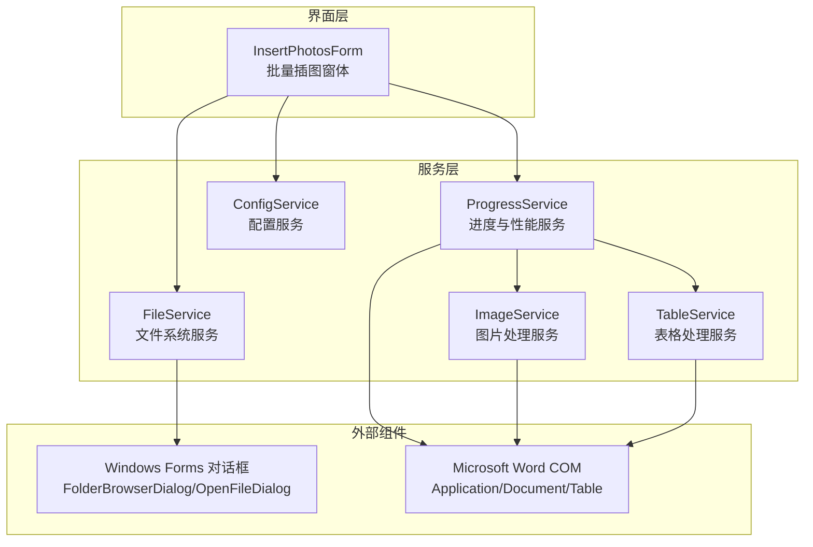
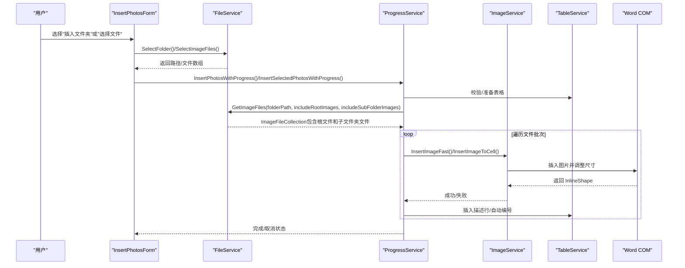
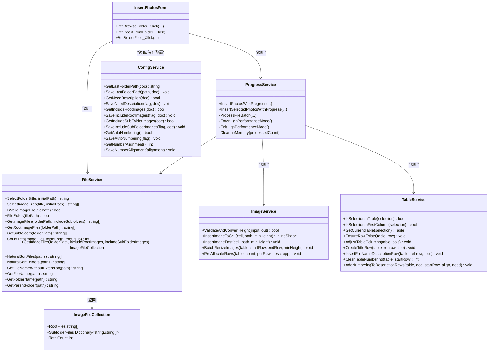

# 文件系统操作

<cite>
**本文引用的文件**
- [FileService.cs](file://WordTools/Services/FileService.cs)
- [InsertPhotosForm.cs](file://WordTools/Forms/InsertPhotosForm.cs)
- [ImageService.cs](file://WordTools/Services/ImageService.cs)
- [ConfigService.cs](file://WordTools/Services/ConfigService.cs)
- [ProgressService.cs](file://WordTools/Services/ProgressService.cs)
- [TableService.cs](file://WordTools/Services/TableService.cs)
- [README.md](file://README.md)
</cite>

## 更新摘要
**变更内容**
- 新增了高效的文件枚举和统计功能，通过 `ImageFileCollection` 类实现一次遍历获取所有图片文件
- 改进了缓存机制，避免重复扫描目录导致的性能问题
- 增强了自然排序算法，增加了数字解析的安全性检查和溢出防护
- 优化了批量处理流程，通过 `GetImageFiles` 方法提供更好的性能表现

## 目录
1. [简介](#简介)
2. [项目结构](#项目结构)
3. [核心组件](#核心组件)
4. [架构总览](#架构总览)
5. [详细组件分析](#详细组件分析)
6. [依赖关系分析](#依赖关系分析)
7. [性能考量](#性能考量)
8. [故障排查指南](#故障排查指南)
9. [结论](#结论)
10. [附录](#附录)

## 简介
本文档聚焦于 WordTools 的文件系统操作能力，围绕 FileService 提供的文件与文件夹操作展开，涵盖：
- 文件夹浏览对话框与图片文件选择对话框
- 文件格式过滤与扩展名验证
- 文件夹递归扫描与根/子目录选择逻辑
- **新增**：高效的文件枚举和缓存机制
- **新增**：增强的自然排序算法
- 文件路径解析与父目录获取
- 安全性与异常处理机制
- 跨平台兼容性与特殊字符处理
- 性能优化与最佳实践
- 扩展新文件操作功能的指导

## 项目结构
WordTools 采用"服务层 + 窗体层"的分层设计，文件系统相关能力集中在 FileService，UI 交互由 InsertPhotosForm 触发，最终通过 ProgressService 和 ImageService、TableService 完成批量插入与表格排版。

**图表来源**
- [InsertPhotosForm.cs:465-570](file://WordTools/Forms/InsertPhotosForm.cs#L465-L570)
- [FileService.cs:26-78](file://WordTools/Services/FileService.cs#L26-L78)
- [ProgressService.cs:148-306](file://WordTools/Services/ProgressService.cs#L148-L306)
- [ImageService.cs:73-134](file://WordTools/Services/ImageService.cs#L73-L134)
- [TableService.cs:18-40](file://WordTools/Services/TableService.cs#L18-L40)

**章节来源**
- [README.md:1-85](file://README.md#L1-L85)

## 核心组件
- **FileService**：提供文件夹选择、图片文件选择、文件验证、文件列表获取、自然排序、路径辅助等能力。**新增**：高效的 `ImageFileCollection` 缓存机制。
- InsertPhotosForm：UI 入口，触发文件夹/文件选择，调用 FileService 并驱动批量插入流程。
- ProgressService：负责批量操作的进度、取消、性能优化与内存回收。
- ImageService：图片插入、尺寸转换与批量调整。
- TableService：表格校验、标题/描述行插入、自动编号。
- ConfigService：持久化用户配置（文档属性 + 注册表）。

**章节来源**
- [FileService.cs:13-376](file://WordTools/Services/FileService.cs#L13-L376)
- [InsertPhotosForm.cs:465-570](file://WordTools/Forms/InsertPhotosForm.cs#L465-L570)
- [ProgressService.cs:14-347](file://WordTools/Services/ProgressService.cs#L14-L347)
- [ImageService.cs:10-362](file://WordTools/Services/ImageService.cs#L10-L362)
- [TableService.cs:11-756](file://WordTools/Services/TableService.cs#L11-L756)
- [ConfigService.cs:11-462](file://WordTools/Services/ConfigService.cs#L11-L462)

## 架构总览
文件系统操作在 UI 与服务层之间形成清晰边界：UI 仅负责交互与参数收集；服务层封装具体 IO 与业务逻辑；Office COM 由上层服务统一调用。

**图表来源**
- [InsertPhotosForm.cs:481-569](file://WordTools/Forms/InsertPhotosForm.cs#L481-L569)
- [FileService.cs:26-78](file://WordTools/Services/FileService.cs#L26-L78)
- [ProgressService.cs:250-252](file://WordTools/Services/ProgressService.cs#L250-L252)
- [ImageService.cs:73-134](file://WordTools/Services/ImageService.cs#L73-L134)
- [TableService.cs:18-40](file://WordTools/Services/TableService.cs#L18-L40)

## 详细组件分析

### 文件夹浏览与图片选择
- 文件夹选择
  - 使用 FolderBrowserDialog，支持设置标题、初始路径与禁用新建文件夹按钮。
  - 初始路径来自配置或用户输入，若路径不存在则忽略。
- 图片文件选择（多选）
  - 使用 OpenFileDialog，设置标题、多选、过滤器（仅图片与全部文件）、初始目录。
  - 过滤器包含扩展名：jpg、jpeg、png。
  - 返回文件数组，若取消或无文件则返回空引用。

**章节来源**
- [FileService.cs:26-45](file://WordTools/Services/FileService.cs#L26-L45)
- [FileService.cs:57-78](file://WordTools/Services/FileService.cs#L57-L78)
- [InsertPhotosForm.cs:465-479](file://WordTools/Forms/InsertPhotosForm.cs#L465-L479)
- [InsertPhotosForm.cs:526-569](file://WordTools/Forms/InsertPhotosForm.cs#L526-L569)

### 文件格式过滤与扩展名验证
- 支持的图片扩展名集合：jpg、jpeg、png。
- 验证逻辑：
  - 严格区分大小写，统一转为小写后匹配。
  - 文件存在性验证：非空且 File.Exists。
- 过滤器定义与扩展名匹配均基于上述集合。

**章节来源**
- [FileService.cs:15-16](file://WordTools/Services/FileService.cs#L15-L16)
- [FileService.cs:89-105](file://WordTools/Services/FileService.cs#L89-L105)
- [FileService.cs:62-63](file://WordTools/Services/FileService.cs#L62-L63)

### 文件夹递归扫描与根/子目录选择
- 获取图片文件：
  - 支持根目录与子目录两种模式，通过 SearchOption 控制。
  - 遍历支持的扩展名集合，拼接通配符后查询。
  - **新增**：通过 `GetImageFiles` 方法一次性获取所有文件，避免重复扫描。
- 获取子文件夹：
  - 返回当前目录下的子文件夹数组，同样按自然排序。
- 统计总数：
  - 可分别统计根目录与子目录图片数量，支持组合统计。
  - **新增**：通过 `ImageFileCollection` 类提供总数统计。

**章节来源**
- [FileService.cs:117-134](file://WordTools/Services/FileService.cs#L117-L134)
- [FileService.cs:139-142](file://WordTools/Services/FileService.cs#L139-L142)
- [FileService.cs:149-158](file://WordTools/Services/FileService.cs#L149-L158)
- [FileService.cs:163-188](file://WordTools/Services/FileService.cs#L163-L188)
- [FileService.cs:190-230](file://WordTools/Services/FileService.cs#L190-L230)

### 高效文件枚举和缓存机制
**新增功能**：FileService 现在提供了一种高效的文件枚举方法，通过 `ImageFileCollection` 类实现一次遍历获取所有图片文件，避免重复扫描目录。

- **ImageFileCollection 类**：
  - 包含根文件数组、子文件夹字典和总数统计。
  - 提供缓存机制，避免重复扫描同一目录。
- **GetImageFiles 方法**：
  - 支持同时获取根目录和子目录的图片文件。
  - 返回 `ImageFileCollection` 对象，包含完整的文件信息和统计。
  - 通过字典存储子文件夹的文件列表，支持按需访问。

**图表来源**
- [FileService.cs:190-230](file://WordTools/Services/FileService.cs#L190-L230)
- [FileService.cs:239-244](file://WordTools/Services/FileService.cs#L239-L244)

**章节来源**
- [FileService.cs:190-230](file://WordTools/Services/FileService.cs#L190-L230)
- [FileService.cs:239-244](file://WordTools/Services/FileService.cs#L239-L244)

### 增强的自然排序算法
**更新**：FileService 的自然排序算法得到了显著改进，增加了数字解析的安全性检查和溢出防护。

- **改进的安全性检查**：
  - 使用 `double.TryParse` 替代直接解析，避免数值溢出风险。
  - 当解析失败时回退到字符串比较，确保算法的稳定性。
- **优化的数字提取**：
  - `ExtractNumber` 方法专门用于提取连续的数字序列。
  - 支持处理前导零，确保数字比较的准确性。
- **增强的字符比较**：
  - 使用 `char.ToLowerInvariant` 进行不区分大小写的字符比较。
  - 保持原有的数字优先比较逻辑。

**图表来源**
- [FileService.cs:253-302](file://WordTools/Services/FileService.cs#L253-L302)
- [FileService.cs:307-315](file://WordTools/Services/FileService.cs#L307-L315)

**章节来源**
- [FileService.cs:253-302](file://WordTools/Services/FileService.cs#L253-L302)
- [FileService.cs:307-315](file://WordTools/Services/FileService.cs#L307-L315)

### 路径解析与父目录获取
- 文件名与扩展名：
  - 提供不含扩展名与含扩展名的文件名获取。
- 文件夹名：
  - 通过 DirectoryInfo 获取目录名。
- 父目录：
  - 使用 Path.GetDirectoryName 获取上级路径。

**章节来源**
- [FileService.cs:341-371](file://WordTools/Services/FileService.cs#L341-L371)

### 安全性与异常处理机制
- 输入校验：
  - 路径非空与存在性检查贯穿文件夹选择与文件列表获取。
  - 图片文件选择对话框返回空数组时，UI 层给出提示并终止流程。
- 异常处理策略：
  - FileService 方法内部对空路径与不存在目录进行安全短路。
  - ProgressService 在关键阶段捕获异常并提示用户，同时保证退出高性能模式与状态栏清理。
  - ImageService 与 TableService 在批量处理中对单个单元格/图片操作进行局部异常捕获，避免中断整体流程。
- 用户取消：
  - 通过 ESC 键检测实现取消，及时释放资源并反馈状态。

**章节来源**
- [FileService.cs:119-122](file://WordTools/Services/FileService.cs#L119-L122)
- [FileService.cs:149-158](file://WordTools/Services/FileService.cs#L149-L158)
- [ProgressService.cs:40-64](file://WordTools/Services/ProgressService.cs#L40-L64)
- [ProgressService.cs:281-285](file://WordTools/Services/ProgressService.cs#L281-L285)
- [ImageService.cs:78-134](file://WordTools/Services/ImageService.cs#L78-L134)
- [TableService.cs:49-123](file://WordTools/Services/TableService.cs#L49-L123)

### 性能优化与批量处理
- 高性能模式：
  - 关闭屏幕更新与警告弹窗，减少 UI 开销。
  - 预分配表格行数，降低频繁插入导致的重排成本。
- 刷新与内存策略：
  - 根据文件总数动态调整刷新间隔，平衡进度反馈与性能。
  - 定期执行内存回收，避免长时间批量操作内存膨胀。
  - **新增**：分级垃圾回收策略，根据内存使用情况选择合适的 GC 代数。
- 快速插入：
  - ImageService 提供快速插入路径，优先满足宽度限制，再应用最小高度约束。
- **新增**：一次遍历获取文件列表，避免重复扫描目录的性能损失。

**章节来源**
- [ProgressService.cs:73-112](file://WordTools/Services/ProgressService.cs#L73-L112)
- [ProgressService.cs:117-125](file://WordTools/Services/ProgressService.cs#L117-L125)
- [ProgressService.cs:129-157](file://WordTools/Services/ProgressService.cs#L129-L157)
- [ProgressService.cs:167-271](file://WordTools/Services/ProgressService.cs#L167-L271)
- [ImageService.cs:142-180](file://WordTools/Services/ImageService.cs#L142-L180)
- [ImageService.cs:287-320](file://WordTools/Services/ImageService.cs#L287-L320)

### 跨平台兼容性与特殊字符处理
- 平台限定：
  - 项目面向 Windows 平台（Windows 7+），依赖 Windows Forms 与 .NET Framework。
- 特殊字符与路径：
  - 文件名与扩展名获取使用标准库函数，避免硬编码路径分隔符。
  - 自然排序算法对大小写不敏感，提升跨语言环境下的稳定性。
- 建议：
  - 若未来扩展至 Linux/macOS，需替换 Windows Forms 对话框为跨平台替代方案，并统一路径分隔符处理。

**章节来源**
- [README.md:15-20](file://README.md#L15-L20)
- [FileService.cs:253-302](file://WordTools/Services/FileService.cs#L253-L302)

### 扩展新文件操作功能的指导
- 新增文件类型支持：
  - 在 FileService 的支持扩展名集合中添加新后缀，并在过滤器中同步更新。
  - 如需更严格的 MIME 校验，可在 IsValidImageFile 基础上增加头部识别。
- 新增文件夹操作：
  - 可参考 GetSubfolders 与 GetImageFiles 的实现，结合 SearchOption 控制递归深度。
  - 自然排序可复用现有算法，确保 UI 体验一致。
- 新增路径处理：
  - 建议在 FileService 中新增专用方法，集中处理路径规范化、相对路径解析与安全检查。
- 新增批量流程：
  - 参考 ProgressService 的批量处理模式，定义刷新间隔、内存清理与取消检测策略。
  - 将业务逻辑拆分为服务层方法，便于测试与维护。
- **新增**：利用 `ImageFileCollection` 类作为缓存基础，实现高效的文件枚举和统计功能。

**章节来源**
- [FileService.cs:15-16](file://WordTools/Services/FileService.cs#L15-L16)
- [FileService.cs:62-63](file://WordTools/Services/FileService.cs#L62-L63)
- [FileService.cs:117-134](file://WordTools/Services/FileService.cs#L117-L134)
- [ProgressService.cs:167-347](file://WordTools/Services/ProgressService.cs#L167-L347)

## 依赖关系分析

**图表来源**
- [FileService.cs:13-376](file://WordTools/Services/FileService.cs#L13-L376)
- [InsertPhotosForm.cs:465-570](file://WordTools/Forms/InsertPhotosForm.cs#L465-L570)
- [ProgressService.cs:14-347](file://WordTools/Services/ProgressService.cs#L14-L347)
- [ImageService.cs:10-362](file://WordTools/Services/ImageService.cs#L10-L362)
- [TableService.cs:11-756](file://WordTools/Services/TableService.cs#L11-L756)
- [ConfigService.cs:11-462](file://WordTools/Services/ConfigService.cs#L11-L462)

## 性能考量
- **新增**：一次遍历获取文件列表，避免重复扫描目录导致的性能损失。
- 批量插入前预分配行数，避免频繁重排。
- 根据文件数量动态调整刷新间隔，兼顾用户体验与性能。
- 定期清理内存，防止长时间批处理导致内存占用过高。
- **新增**：分级垃圾回收策略，根据内存使用情况选择合适的 GC 代数。
- 关闭不必要的 UI 更新与警告弹窗，降低系统开销。
- 图片插入优先满足宽度限制，再应用高度限制，减少二次调整成本。

**章节来源**
- [ProgressService.cs:117-157](file://WordTools/Services/ProgressService.cs#L117-L157)
- [ImageService.cs:142-180](file://WordTools/Services/ImageService.cs#L142-L180)
- [ImageService.cs:287-320](file://WordTools/Services/ImageService.cs#L287-L320)

## 故障排查指南
- 无法选择文件夹/文件：
  - 检查路径是否存在与可访问性；确认初始路径参数是否正确。
  - 若对话框未显示或立即关闭，检查 UI 线程状态与异常日志。
- 未找到任何图片：
  - 确认根目录与子目录选择状态；检查扩展名是否包含在支持集合中。
  - **新增**：检查 `ImageFileCollection` 是否正确返回了文件列表。
- 插入失败或图片未显示：
  - 检查目标单元格是否已有图片；确认 Word COM 对象可用。
  - 查看进度服务的异常提示与状态栏信息。
- 性能问题：
  - 启用高性能模式后仍卡顿，尝试减少文件数量或提高刷新间隔。
  - 观察内存回收频率，必要时缩短批处理长度。
  - **新增**：检查 `ImageFileCollection` 的缓存效果，确保没有重复扫描。

**章节来源**
- [FileService.cs:119-122](file://WordTools/Services/FileService.cs#L119-L122)
- [FileService.cs:149-158](file://WordTools/Services/FileService.cs#L149-L158)
- [ProgressService.cs:281-285](file://WordTools/Services/ProgressService.cs#L281-L285)
- [ImageService.cs:78-134](file://WordTools/Services/ImageService.cs#L78-L134)

## 结论
FileService 为 WordTools 的文件系统操作提供了稳定、可扩展的基础能力，配合 ProgressService 的性能优化与异常处理，能够高效完成批量图片插入任务。**最新的优化包括**：高效的文件枚举和缓存机制、增强的自然排序算法以及更好的内存管理策略。通过 `ImageFileCollection` 类实现的一次遍历获取文件列表，显著减少了目录扫描次数；通过 `double.TryParse` 实现的安全数字解析，提高了算法的稳定性；通过分级垃圾回收策略，优化了内存使用效率。这些改进使得文件系统操作在处理大量文件时更加高效和可靠。建议在后续迭代中逐步引入更严格的 MIME 校验与跨平台适配，以进一步增强健壮性与可移植性。

## 附录
- 支持的图片格式：jpg、jpeg、png
- 文件夹选择对话框：FolderBrowserDialog
- 图片文件选择对话框：OpenFileDialog（多选，过滤器包含 jpg/jpeg/png）
- **新增**：ImageFileCollection 缓存类，提供高效的文件枚举和统计功能
- **新增**：增强的自然排序算法，支持安全的数字解析和溢出防护

**章节来源**
- [FileService.cs:15-16](file://WordTools/Services/FileService.cs#L15-L16)
- [FileService.cs:62-63](file://WordTools/Services/FileService.cs#L62-L63)
- [FileService.cs:26-45](file://WordTools/Services/FileService.cs#L26-L45)
- [FileService.cs:57-78](file://WordTools/Services/FileService.cs#L57-L78)
- [FileService.cs:239-244](file://WordTools/Services/FileService.cs#L239-L244)
- [FileService.cs:253-302](file://WordTools/Services/FileService.cs#L253-L302)