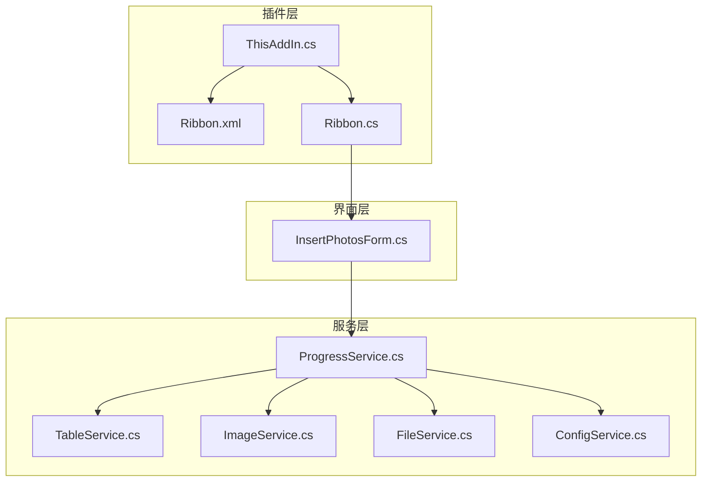
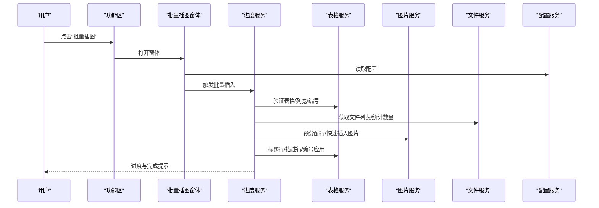
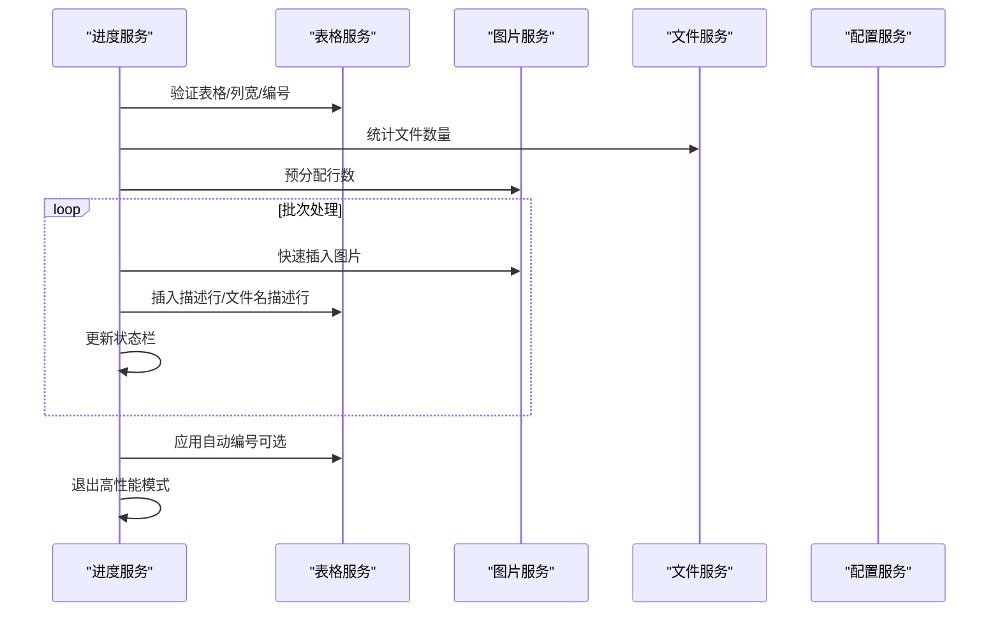
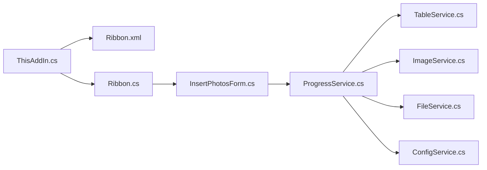

# 智能表格管理系统

<cite>
**本文引用的文件**
- [TableService.cs](file://WordTools/Services/TableService.cs)
- [ProgressService.cs](file://WordTools/Services/ProgressService.cs)
- [ImageService.cs](file://WordTools/Services/ImageService.cs)
- [FileService.cs](file://WordTools/Services/FileService.cs)
- [ConfigService.cs](file://WordTools/Services/ConfigService.cs)
- [InsertPhotosForm.cs](file://WordTools/Forms/InsertPhotosForm.cs)
- [ThisAddIn.cs](file://WordTools/ThisAddIn.cs)
- [Ribbon.cs](file://WordTools/Ribbon.cs)
- [Ribbon.xml](file://WordTools/Ribbon.xml)
- [README.md](file://README.md)
</cite>

## 目录
1. [简介](#简介)
2. [项目结构](#项目结构)
3. [核心组件](#核心组件)
4. [架构概览](#架构概览)
5. [详细组件分析](#详细组件分析)
6. [依赖关系分析](#依赖关系分析)
7. [性能考量](#性能考量)
8. [故障排除指南](#故障排除指南)
9. [结论](#结论)
10. [附录](#附录)

## 简介
本项目是一个基于 Microsoft Office COM 加载项的智能表格管理系统，主要面向 Word 文档中的表格批量图片插入、自动编号与智能管理。系统通过功能区（Ribbon）提供“批量插图”入口，配合后台服务层实现表格结构自动创建、标题行与描述行的智能管理、自动编号系统、列宽固定策略以及表格验证机制。系统还提供了进度监控、性能优化、配置持久化与取消控制等能力，确保在大规模图片插入场景下的稳定性与用户体验。

## 项目结构
项目采用分层设计：
- 插件入口与功能区：ThisAddIn.cs、Ribbon.cs、Ribbon.xml
- 用户界面：InsertPhotosForm.cs（批量插图主窗体）
- 业务服务层：
  - 表格服务：TableService.cs（表格验证、结构管理、编号与列宽）
  - 图片服务：ImageService.cs（图片插入、尺寸调整、批量预分配）
  - 文件服务：FileService.cs（文件选择、验证、自然排序）
  - 配置服务：ConfigService.cs（文档属性与注册表配置）
  - 进度服务：ProgressService.cs（批量处理流程、性能优化、取消控制）

图表来源
- [ThisAddIn.cs:1-157](file://WordTools/ThisAddIn.cs#L1-L157)
- [Ribbon.cs:1-173](file://WordTools/Ribbon.cs#L1-L173)
- [Ribbon.xml:1-39](file://WordTools/Ribbon.xml#L1-L39)
- [InsertPhotosForm.cs:1-618](file://WordTools/Forms/InsertPhotosForm.cs#L1-L618)
- [ProgressService.cs:1-571](file://WordTools/Services/ProgressService.cs#L1-L571)
- [TableService.cs:1-756](file://WordTools/Services/TableService.cs#L1-L756)
- [ImageService.cs:1-325](file://WordTools/Services/ImageService.cs#L1-L325)
- [FileService.cs:1-310](file://WordTools/Services/FileService.cs#L1-L310)
- [ConfigService.cs:1-362](file://WordTools/Services/ConfigService.cs#L1-L362)

章节来源
- [README.md:1-85](file://README.md#L1-L85)

## 核心组件
- 表格服务（TableService）：负责表格验证（选择区域、首列判断）、单元格适配性检查、自动编号清除与应用、标题行与描述行创建、列宽固定策略、行/列调整等。
- 进度服务（ProgressService）：封装批量图片插入流程，提供性能优化（关闭屏幕更新、禁用警告、批量预分配）、进度条更新、内存回收、取消控制（ESC键）。
- 图片服务（ImageService）：提供图片插入、尺寸转换与限制、批量调整、预分配行数等。
- 文件服务（FileService）：文件夹与文件选择、图片格式验证、自然排序、统计等。
- 配置服务（ConfigService）：文档自定义属性与注册表配置读写，支持图片高度、文件夹路径、描述行选项、自动编号与对齐等。
- 界面（InsertPhotosForm）：用户交互，收集参数并触发进度服务执行。
- 插件入口与功能区：ThisAddIn.cs、Ribbon.cs、Ribbon.xml，负责加载与UI展示。

章节来源
- [TableService.cs:11-756](file://WordTools/Services/TableService.cs#L11-L756)
- [ProgressService.cs:14-571](file://WordTools/Services/ProgressService.cs#L14-L571)
- [ImageService.cs:10-325](file://WordTools/Services/ImageService.cs#L10-L325)
- [FileService.cs:13-310](file://WordTools/Services/FileService.cs#L13-L310)
- [ConfigService.cs:11-362](file://WordTools/Services/ConfigService.cs#L11-L362)
- [InsertPhotosForm.cs:18-618](file://WordTools/Forms/InsertPhotosForm.cs#L18-L618)
- [ThisAddIn.cs:17-156](file://WordTools/ThisAddIn.cs#L17-L156)
- [Ribbon.cs:14-173](file://WordTools/Ribbon.cs#L14-L173)
- [Ribbon.xml:2-38](file://WordTools/Ribbon.xml#L2-L38)

## 架构概览
系统采用“插件入口 + 功能区 + 窗体 + 服务层”的分层架构。用户通过功能区按钮打开窗体，窗体收集参数后交由进度服务协调各服务完成批量插入、表格结构调整、编号更新与格式优化。

图表来源
- [Ribbon.xml:12-18](file://WordTools/Ribbon.xml#L12-L18)
- [InsertPhotosForm.cs:525-613](file://WordTools/Forms/InsertPhotosForm.cs#L525-L613)
- [ProgressService.cs:151-306](file://WordTools/Services/ProgressService.cs#L151-L306)
- [TableService.cs:18-40](file://WordTools/Services/TableService.cs#L18-L40)
- [ImageService.cs:287-320](file://WordTools/Services/ImageService.cs#L287-L320)
- [FileService.cs:117-188](file://WordTools/Services/FileService.cs#L117-L188)
- [ConfigService.cs:415-482](file://WordTools/Services/ConfigService.cs#L415-L482)

## 详细组件分析

### 表格服务（TableService）
- 表格验证
  - 选择区域验证：判断当前选择是否在表格内、是否位于首列。
  - 当前表格获取：从选择中提取表格对象。
- 单元格适配性检查与查找
  - 图片插入适配性：检查单元格是否已有图片、是否使用自动编号、是否为空或仅含序号格式文本；必要时清除编号与文本以便复用。
  - 下一个合适单元格查找：在指定范围内按优先列寻找可用单元格，最多向上搜索若干行。
- 表格结构管理
  - 行存在性保障：确保目标行存在，不足则追加。
  - 列数调整：确保表格至少有两列，按需增删列。
  - 列宽固定：检测与设置表格为固定列宽，避免自动调整影响布局。
- 标题行与描述行
  - 标题行创建：合并两列作为标题，居中对齐，自动插入下一行作为内容起始。
  - 描述行插入：根据需要插入空描述行或基于文件名的描述行，自动居中与垂直居中。
  - 空单元格填充：将指定范围内的空单元格填充为占位文本并统一格式。
- 自动编号系统
  - 编号清除：检测并清除原有编号（含列表格式与纯文本序号），保留原对齐方式。
  - 描述行编号应用：识别包含图片的最后一行，定位描述行区间，创建或复用列表模板，应用连续编号并设置对齐方式（靠左/居中）。

图表来源
- [TableService.cs:18-40](file://WordTools/Services/TableService.cs#L18-L40)
- [TableService.cs:128-196](file://WordTools/Services/TableService.cs#L128-L196)
- [TableService.cs:205-229](file://WordTools/Services/TableService.cs#L205-L229)
- [TableService.cs:234-263](file://WordTools/Services/TableService.cs#L234-L263)
- [TableService.cs:268-295](file://WordTools/Services/TableService.cs#L268-L295)
- [TableService.cs:304-357](file://WordTools/Services/TableService.cs#L304-L357)
- [TableService.cs:362-407](file://WordTools/Services/TableService.cs#L362-L407)
- [TableService.cs:412-434](file://WordTools/Services/TableService.cs#L412-L434)
- [TableService.cs:446-559](file://WordTools/Services/TableService.cs#L446-L559)
- [TableService.cs:564-737](file://WordTools/Services/TableService.cs#L564-L737)

章节来源
- [TableService.cs:18-737](file://WordTools/Services/TableService.cs#L18-L737)

### 进度服务（ProgressService）
- 取消控制：检测 ESC 键，支持中途取消。
- 性能优化：进入/退出高性能模式（关闭屏幕更新、禁用警告、文档拼写/语法检查标记），减少UI刷新与警告弹窗带来的开销。
- 批量处理流程：
  - 参数校验与表格准备：验证选择、定位首列、固定列宽、清除编号。
  - 文件统计与预分配：统计图片总数，按行/列与描述行需求预分配行数，提升批量插入效率。
  - 文件批处理：按批次处理文件，动态定位合适单元格、快速插入图片、按需插入描述行、更新状态栏。
  - 结束阶段：应用自动编号（若启用），退出高性能模式，清理状态栏。
- 进度与内存：根据文件数量动态调整刷新间隔、内存清理与保存间隔，平衡流畅度与性能。

图表来源
- [ProgressService.cs:151-306](file://WordTools/Services/ProgressService.cs#L151-L306)
- [ProgressService.cs:315-403](file://WordTools/Services/ProgressService.cs#L315-L403)
- [ProgressService.cs:412-533](file://WordTools/Services/ProgressService.cs#L412-L533)
- [ImageService.cs:287-320](file://WordTools/Services/ImageService.cs#L287-L320)
- [TableService.cs:284-295](file://WordTools/Services/TableService.cs#L284-L295)

章节来源
- [ProgressService.cs:14-571](file://WordTools/Services/ProgressService.cs#L14-L571)

### 图片服务（ImageService）
- 尺寸转换：厘米与磅之间的双向转换，支持最小高度限制。
- 图片插入：支持锁定纵横比、按单元格边界限制宽高、按最小高度调整，提供快速插入与批量调整两种模式。
- 批量操作：批量预分配行数、批量调整图片尺寸，提升大批量场景下的性能。

章节来源
- [ImageService.cs:10-325](file://WordTools/Services/ImageService.cs#L10-L325)

### 文件服务（FileService）
- 文件夹与文件选择：提供文件夹选择与多文件选择对话框。
- 图片验证：支持的图片扩展名验证。
- 文件列表获取：支持根目录与子目录扫描、自然排序（类似资源管理器）。
- 统计：统计总图片数量。

章节来源
- [FileService.cs:13-310](file://WordTools/Services/FileService.cs#L13-L310)

### 配置服务（ConfigService）
- 文档自定义属性与注册表双通道存储：优先使用文档自定义属性，回退到注册表。
- 支持配置项：最后图片高度、最后文件夹路径、是否需要描述行、是否使用文件名作为描述、包含根目录/子目录、自动编号开关、编号对齐方式。
- 特殊值处理：空值使用特殊标记避免 Word COM 不接受空字符串。

章节来源
- [ConfigService.cs:11-362](file://WordTools/Services/ConfigService.cs#L11-L362)

### 界面（InsertPhotosForm）
- 用户交互：文件夹选择、图片高度输入、范围选择（根目录/子目录）、描述行选项（手动/无/文件名）、自动编号与对齐方式。
- 参数保存与加载：从配置服务读取上次设置，保存当前设置。
- 事件处理：按钮点击触发进度服务执行，异常提示与取消控制。

章节来源
- [InsertPhotosForm.cs:18-618](file://WordTools/Forms/InsertPhotosForm.cs#L18-L618)

### 插件入口与功能区（ThisAddIn、Ribbon）
- 插件入口：实现 IDTExtensibility2 与 IRibbonExtensibility，加载 Ribbon XML 并提供回调。
- 功能区：定义“Word工具箱”选项卡、“图片工具”组与“关于”组，按钮绑定回调。

章节来源
- [ThisAddIn.cs:17-156](file://WordTools/ThisAddIn.cs#L17-L156)
- [Ribbon.cs:14-173](file://WordTools/Ribbon.cs#L14-L173)
- [Ribbon.xml:2-38](file://WordTools/Ribbon.xml#L2-L38)

## 依赖关系分析
- 插件层依赖功能区资源与窗体；窗体依赖配置服务与进度服务；进度服务协调表格、图片、文件服务。
- 表格服务与图片服务均依赖 Microsoft.Office.Interop.Word；文件服务依赖系统 IO 与 WinForms；配置服务依赖 Word 文档属性与注册表。

图表来源
- [ThisAddIn.cs:17-156](file://WordTools/ThisAddIn.cs#L17-L156)
- [Ribbon.cs:14-173](file://WordTools/Ribbon.cs#L14-L173)
- [Ribbon.xml:2-38](file://WordTools/Ribbon.xml#L2-L38)
- [InsertPhotosForm.cs:525-613](file://WordTools/Forms/InsertPhotosForm.cs#L525-L613)
- [ProgressService.cs:151-306](file://WordTools/Services/ProgressService.cs#L151-L306)
- [TableService.cs:18-40](file://WordTools/Services/TableService.cs#L18-L40)
- [ImageService.cs:287-320](file://WordTools/Services/ImageService.cs#L287-L320)
- [FileService.cs:117-188](file://WordTools/Services/FileService.cs#L117-L188)
- [ConfigService.cs:415-482](file://WordTools/Services/ConfigService.cs#L415-L482)

## 性能考量
- 高性能模式：关闭屏幕更新与警告，减少 UI 刷新与弹窗开销。
- 批量预分配：根据图片数量与描述行需求预分配表格行数，避免频繁追加行导致的性能抖动。
- 批量插入：快速插入图片，仅做必要的宽高限制与最小高度约束，降低内存占用。
- 进度与刷新：根据文件数量动态调整刷新间隔、内存清理与保存间隔，兼顾实时性与性能。
- 取消控制：支持 ESC 键取消，及时释放资源与恢复状态。

章节来源
- [ProgressService.cs:73-142](file://WordTools/Services/ProgressService.cs#L73-L142)
- [ProgressService.cs:215-216](file://WordTools/Services/ProgressService.cs#L215-L216)
- [ImageService.cs:287-320](file://WordTools/Services/ImageService.cs#L287-L320)
- [ProgressService.cs:542-566](file://WordTools/Services/ProgressService.cs#L542-L566)

## 故障排除指南
- 无法打开窗体或功能区不可用
  - 确认插件已正确注册，查看注册与卸载说明。
  - 检查 Word 是否为受支持版本。
- 无法选中表格或提示不在首列
  - 确保光标位于表格首列单元格，重新选择。
- 插入图片后布局错乱
  - 系统默认设置固定列宽，若仍出现错乱，可手动调整表格属性。
- 自动编号未生效
  - 确认启用了“自动编号”，并确保描述行处于正确的图片行之后。
- 插入过程卡顿或耗时较长
  - 使用“高性能模式”（系统自动启用），避免同时运行其他大型任务。
- 取消操作无效
  - 按住 ESC 键直至状态栏显示取消提示，等待当前批次处理完成。

章节来源
- [README.md:62-75](file://README.md#L62-L75)
- [ProgressService.cs:43-64](file://WordTools/Services/ProgressService.cs#L43-L64)
- [TableService.cs:284-295](file://WordTools/Services/TableService.cs#L284-L295)

## 结论
本智能表格管理系统通过严谨的服务分层与完善的性能优化策略，在 Word 中实现了高效、稳定的批量图片插入与表格管理。其核心优势在于：
- 表格结构的自动创建与智能管理，确保插入流程顺畅。
- 自动编号系统与描述行机制，满足报告与展示场景的格式一致性需求。
- 列宽固定策略与批量预分配，显著提升大规模插入的性能与稳定性。
- 完善的验证与容错机制，结合取消控制与进度反馈，提供良好的用户体验。

## 附录

### 表格验证机制
- 选择区域验证：确保当前选择在表格内且位于首列。
- 单元格适配性：检查是否已有图片、是否使用自动编号、是否为空或仅含序号格式文本。
- 行/列调整：确保目标行存在并至少有两列，按需增删列。
- 列宽固定：检测与设置固定列宽，避免后续自动调整破坏布局。

章节来源
- [TableService.cs:18-40](file://WordTools/Services/TableService.cs#L18-L40)
- [TableService.cs:205-229](file://WordTools/Services/TableService.cs#L205-L229)
- [TableService.cs:234-263](file://WordTools/Services/TableService.cs#L234-L263)
- [TableService.cs:268-295](file://WordTools/Services/TableService.cs#L268-L295)

### 自动编号系统实现逻辑
- 编号清除：检测并清除原有编号（含列表格式与纯文本序号），保留原对齐方式。
- 描述行识别：通过图片存在性与连续空行阈值识别描述行区间。
- 列表模板：首次创建自定义列表模板，后续复用以保证连续编号。
- 对齐设置：根据配置设置编号对齐方式（靠左/居中）。

章节来源
- [TableService.cs:446-559](file://WordTools/Services/TableService.cs#L446-L559)
- [TableService.cs:564-737](file://WordTools/Services/TableService.cs#L564-L737)

### 列宽固定功能的实现原理与使用场景
- 实现原理：通过表格对象的列宽自动调整属性进行检测与设置，确保插入图片后列宽不被自动调整。
- 使用场景：批量插入图片时，固定列宽可避免因图片尺寸变化导致的布局错乱，保证视觉一致性。

章节来源
- [TableService.cs:268-295](file://WordTools/Services/TableService.cs#L268-L295)

### 表格操作实际示例
- 批量插入后的表格结构调整
  - 预分配行数：根据图片数量与描述行需求预分配，减少追加行的开销。
  - 标题行与描述行：按文件夹/子文件夹创建标题行，按行插入描述行或文件名描述行。
  - 空单元格填充：当行不满时，填充占位文本并统一格式。
- 编号更新与格式优化
  - 清除旧编号：在插入前清除原有编号，避免冲突。
  - 应用新编号：在描述行区间应用连续编号，设置对齐方式。
  - 固定列宽：确保插入后布局稳定。

章节来源
- [ProgressService.cs:215-216](file://WordTools/Services/ProgressService.cs#L215-L216)
- [TableService.cs:304-357](file://WordTools/Services/TableService.cs#L304-L357)
- [TableService.cs:362-407](file://WordTools/Services/TableService.cs#L362-L407)
- [TableService.cs:412-434](file://WordTools/Services/TableService.cs#L412-L434)
- [TableService.cs:446-559](file://WordTools/Services/TableService.cs#L446-L559)
- [TableService.cs:564-737](file://WordTools/Services/TableService.cs#L564-L737)
- [TableService.cs:284-295](file://WordTools/Services/TableService.cs#L284-L295)

### 最佳实践
- 先固定列宽再插入图片，确保布局稳定。
- 批量插入前预估图片数量并预分配行数，减少追加行的性能损耗。
- 启用自动编号时，确保描述行位于图片行之后，避免编号错位。
- 使用“高性能模式”与合理的刷新间隔，平衡进度反馈与性能。
- 在长流程中定期清理内存，避免长时间运行导致内存压力。

### 常见问题与解决方案
- 插入后表格错乱：确认已设置固定列宽，必要时手动调整。
- 编号不连续：检查描述行识别逻辑与列表模板复用情况。
- 插入缓慢：启用高性能模式、增大刷新间隔、减少不必要的 UI 更新。
- 取消无效：按住 ESC 键直至状态栏提示取消，等待当前批次处理完成。