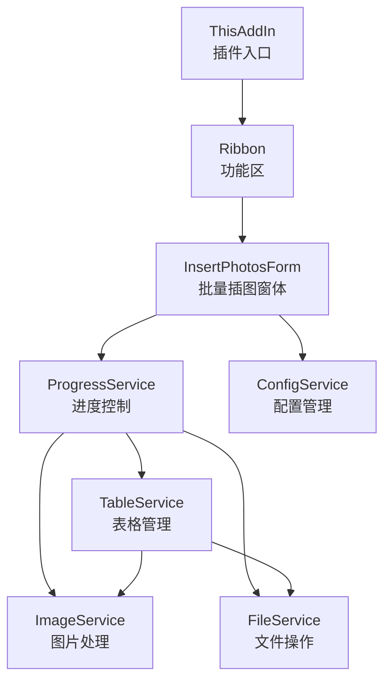
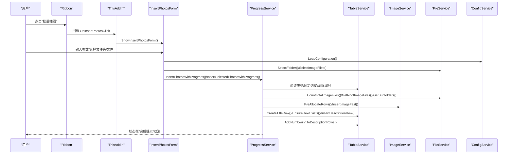
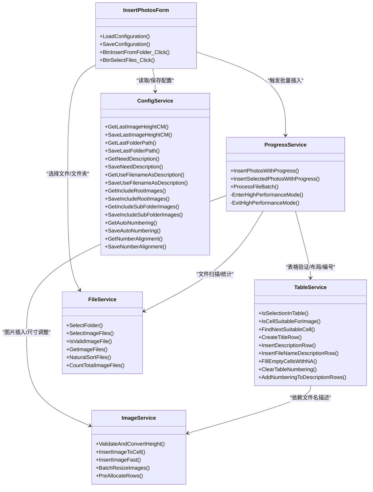

# 核心功能

<cite>
**本文引用的文件**
- [README.md](file://README.md)
- [WordTools/ThisAddIn.cs](file://WordTools/ThisAddIn.cs)
- [WordTools/Ribbon.cs](file://WordTools/Ribbon.cs)
- [WordTools/Forms/InsertPhotosForm.cs](file://WordTools/Forms/InsertPhotosForm.cs)
- [WordTools/Services/ConfigService.cs](file://WordTools/Services/ConfigService.cs)
- [WordTools/Services/FileService.cs](file://WordTools/Services/FileService.cs)
- [WordTools/Services/ImageService.cs](file://WordTools/Services/ImageService.cs)
- [WordTools/Services/TableService.cs](file://WordTools/Services/TableService.cs)
- [WordTools/Services/ProgressService.cs](file://WordTools/Services/ProgressService.cs)
</cite>

## 目录
1. [简介](#简介)
2. [项目结构](#项目结构)
3. [核心组件](#核心组件)
4. [架构总览](#架构总览)
5. [详细组件分析](#详细组件分析)
6. [依赖关系分析](#依赖关系分析)
7. [性能考量](#性能考量)
8. [故障排查指南](#故障排查指南)
9. [结论](#结论)
10. [附录](#附录)

## 简介
本文件聚焦 WordTools 的核心功能，围绕“批量图片插入”展开，系统性阐述用户界面设计、图片处理流程、表格管理机制、智能表格管理（自动编号、标题行与描述行）、配置管理服务的存储策略与用户偏好设置、文件操作服务的文件验证与自然排序、进度控制服务的性能优化与用户体验设计，并给出使用示例、配置选项与最佳实践，以及功能间的协作关系与数据流。

## 项目结构
- 插件入口与功能区
  - 插件入口：ThisAddIn.cs 实现 COM 加载项生命周期与 Ribbon 资源加载。
  - 功能区：Ribbon.cs 提供 Ribbon XML 资源与按钮回调，承载“批量插图”入口。
- 用户界面
  - InsertPhotosForm.cs：批量插图主窗体，负责参数收集、配置加载/保存、触发批量插入流程。
- 服务层
  - ConfigService.cs：配置管理，文档级自定义属性与注册表双通道存储。
  - FileService.cs：文件选择、验证、自然排序与统计。
  - ImageService.cs：图片插入、尺寸转换与批量调整、预分配行。
  - TableService.cs：表格验证、单元格适配、标题/描述行、自动编号。
  - ProgressService.cs：进度控制、取消机制、性能优化、状态栏更新。

图表来源
- [WordTools/ThisAddIn.cs:104-150](file://WordTools/ThisAddIn.cs#L104-L150)
- [WordTools/Ribbon.cs:104-111](file://WordTools/Ribbon.cs#L104-L111)
- [WordTools/Forms/InsertPhotosForm.cs:525-613](file://WordTools/Forms/InsertPhotosForm.cs#L525-L613)
- [WordTools/Services/ProgressService.cs:148-306](file://WordTools/Services/ProgressService.cs#L148-L306)
- [WordTools/Services/TableService.cs:11-756](file://WordTools/Services/TableService.cs#L11-L756)
- [WordTools/Services/ImageService.cs:10-325](file://WordTools/Services/ImageService.cs#L10-L325)
- [WordTools/Services/FileService.cs:13-310](file://WordTools/Services/FileService.cs#L13-L310)
- [WordTools/Services/ConfigService.cs:11-362](file://WordTools/Services/ConfigService.cs#L11-L362)

章节来源
- [README.md:1-85](file://README.md#L1-L85)
- [WordTools/ThisAddIn.cs:1-157](file://WordTools/ThisAddIn.cs#L1-L157)
- [WordTools/Ribbon.cs:1-173](file://WordTools/Ribbon.cs#L1-L173)

## 核心组件
- 批量图片插入主流程
  - 窗体收集参数（文件夹/文件、高度、范围、描述选项、对齐方式、自动编号）。
  - 配置加载与保存（ConfigService）。
  - 文件扫描与自然排序（FileService）。
  - 表格预分配与布局（TableService + ImageService）。
  - 图片插入与尺寸调整（ImageService）。
  - 进度与取消（ProgressService）。
  - 自动编号与标题/描述行（TableService）。
- 智能表格管理
  - 单元格适配、标题行合并、描述行插入、空单元格填充、自动编号模板与对齐。
- 配置管理
  - 文档自定义属性（随文档持久化）与注册表（全局偏好）双通道。
- 文件操作
  - 文件夹/文件选择、图片格式校验、自然排序、统计。
- 进度控制
  - 高性能模式、动态刷新间隔、内存回收、ESC 取消、状态栏反馈。

章节来源
- [WordTools/Forms/InsertPhotosForm.cs:525-613](file://WordTools/Forms/InsertPhotosForm.cs#L525-L613)
- [WordTools/Services/ProgressService.cs:148-306](file://WordTools/Services/ProgressService.cs#L148-L306)
- [WordTools/Services/TableService.cs:11-756](file://WordTools/Services/TableService.cs#L11-L756)
- [WordTools/Services/ConfigService.cs:11-362](file://WordTools/Services/ConfigService.cs#L11-L362)
- [WordTools/Services/FileService.cs:13-310](file://WordTools/Services/FileService.cs#L13-L310)
- [WordTools/Services/ImageService.cs:10-325](file://WordTools/Services/ImageService.cs#L10-L325)

## 架构总览
批量图片插入的端到端流程如下：

图表来源
- [WordTools/Ribbon.cs:104-111](file://WordTools/Ribbon.cs#L104-L111)
- [WordTools/ThisAddIn.cs:133-150](file://WordTools/ThisAddIn.cs#L133-L150)
- [WordTools/Forms/InsertPhotosForm.cs:525-613](file://WordTools/Forms/InsertPhotosForm.cs#L525-L613)
- [WordTools/Services/ProgressService.cs:148-306](file://WordTools/Services/ProgressService.cs#L148-L306)
- [WordTools/Services/TableService.cs:11-756](file://WordTools/Services/TableService.cs#L11-L756)
- [WordTools/Services/ImageService.cs:287-320](file://WordTools/Services/ImageService.cs#L287-L320)
- [WordTools/Services/FileService.cs:117-188](file://WordTools/Services/FileService.cs#L117-L188)
- [WordTools/Services/ConfigService.cs:415-482](file://WordTools/Services/ConfigService.cs#L415-L482)

## 详细组件分析

### 用户界面设计（InsertPhotosForm）
- 设计要点
  - 窗体尺寸与 DPI 缩放，控件分组与颜色方案，布局常量统一。
  - 参数区域：文件夹路径、图片高度（厘米）、范围（根目录/子目录）、描述选项（手动/无/文件名）、自动编号、对齐方式（靠左/居中）。
  - 操作按钮：插入文件夹、选择文件、取消。
- 配置加载与保存
  - 启动时从 ConfigService 读取上次设置；提交时保存当前设置。
  - 描述选项变化联动自动编号可用性。
- 事件处理
  - 浏览文件夹：调用 FileService.SelectFolder 并保存路径。
  - 插入文件夹：参数校验后隐藏窗体并交由 ProgressService 执行。
  - 选择文件：同上，但针对选定文件集合。

章节来源
- [WordTools/Forms/InsertPhotosForm.cs:59-105](file://WordTools/Forms/InsertPhotosForm.cs#L59-L105)
- [WordTools/Forms/InsertPhotosForm.cs:109-356](file://WordTools/Forms/InsertPhotosForm.cs#L109-L356)
- [WordTools/Forms/InsertPhotosForm.cs:415-482](file://WordTools/Forms/InsertPhotosForm.cs#L415-L482)
- [WordTools/Forms/InsertPhotosForm.cs:509-613](file://WordTools/Forms/InsertPhotosForm.cs#L509-L613)

### 图片处理流程（ImageService）
- 尺寸转换
  - 厘米与磅互转，输入校验与转换。
- 图片插入
  - InsertImageToCell：按单元格尺寸与边距计算目标宽高，保持纵横比，可设置最小高度。
  - InsertImageFast：快速插入，仅检查宽度限制与最小高度。
- 批量操作
  - BatchResizeImages：批量调整已插入图片尺寸。
  - BatchAddRows：批量添加行并周期性更新状态栏。
  - PreAllocateRows：基于预估图片数量与每行图片数预分配行，支持描述行翻倍与上限保护。

章节来源
- [WordTools/Services/ImageService.cs:12-62](file://WordTools/Services/ImageService.cs#L12-L62)
- [WordTools/Services/ImageService.cs:73-134](file://WordTools/Services/ImageService.cs#L73-L134)
- [WordTools/Services/ImageService.cs:142-180](file://WordTools/Services/ImageService.cs#L142-L180)
- [WordTools/Services/ImageService.cs:193-239](file://WordTools/Services/ImageService.cs#L193-L239)
- [WordTools/Services/ImageService.cs:247-277](file://WordTools/Services/ImageService.cs#L247-L277)
- [WordTools/Services/ImageService.cs:287-320](file://WordTools/Services/ImageService.cs#L287-L320)

### 表格管理机制（TableService）
- 表格验证
  - IsSelectionInTable、IsSelectionInFirstColumn、GetCurrentTable。
- 单元格适配
  - IsCellSuitableForImage：检查已有图片、自动编号、空白与序号格式，必要时清除编号与文本。
  - FindNextSuitableCell：在限定范围内寻找合适单元格，支持优先列。
- 表格操作
  - EnsureRowExists、AdjustTableColumns、固定列宽开关。
- 标题行与描述行
  - CreateTitleRow：合并两列作为标题，居中对齐，移动到下一行。
  - InsertDescriptionRow：占位描述行。
  - InsertFileNameDescriptionRow：按文件名写入，居中对齐，不足时第二列留空。
  - FillEmptyCellsWithNA：空单元格填充 N/A。
- 自动编号
  - ClearTableNumbering：检测并清除原有编号及对齐方式记录。
  - AddNumberingToDescriptionRows：识别图片行后的描述行，应用自定义列表模板并设置对齐。

章节来源
- [WordTools/Services/TableService.cs:18-40](file://WordTools/Services/TableService.cs#L18-L40)
- [WordTools/Services/TableService.cs:45-123](file://WordTools/Services/TableService.cs#L45-L123)
- [WordTools/Services/TableService.cs:128-196](file://WordTools/Services/TableService.cs#L128-L196)
- [WordTools/Services/TableService.cs:205-229](file://WordTools/Services/TableService.cs#L205-L229)
- [WordTools/Services/TableService.cs:234-263](file://WordTools/Services/TableService.cs#L234-L263)
- [WordTools/Services/TableService.cs:304-357](file://WordTools/Services/TableService.cs#L304-L357)
- [WordTools/Services/TableService.cs:362-407](file://WordTools/Services/TableService.cs#L362-L407)
- [WordTools/Services/TableService.cs:412-434](file://WordTools/Services/TableService.cs#L412-L434)
- [WordTools/Services/TableService.cs:446-559](file://WordTools/Services/TableService.cs#L446-L559)
- [WordTools/Services/TableService.cs:564-737](file://WordTools/Services/TableService.cs#L564-L737)

### 配置管理服务（ConfigService）
- 存储策略
  - 文档自定义属性：随文档持久化，优先读取。
  - 注册表：HKCU 路径，用于全局偏好。
- 用户偏好设置
  - 最后图片高度（厘米，支持空值标记）、最后文件夹路径、是否需要描述行、是否使用文件名作为描述、是否包含根/子目录、自动编号开关、编号对齐（1=靠左，2=居中）。
- 读写逻辑
  - GetDocumentProperty/SetDocumentProperty：遍历自定义属性，若不存在则新增。
  - GetRegistryValue/SetRegistryValue：读写注册表键值。

章节来源
- [WordTools/Services/ConfigService.cs:13-24](file://WordTools/Services/ConfigService.cs#L13-L24)
- [WordTools/Services/ConfigService.cs:31-54](file://WordTools/Services/ConfigService.cs#L31-L54)
- [WordTools/Services/ConfigService.cs:59-92](file://WordTools/Services/ConfigService.cs#L59-L92)
- [WordTools/Services/ConfigService.cs:101-119](file://WordTools/Services/ConfigService.cs#L101-L119)
- [WordTools/Services/ConfigService.cs:169-178](file://WordTools/Services/ConfigService.cs#L169-L178)
- [WordTools/Services/ConfigService.cs:187-207](file://WordTools/Services/ConfigService.cs#L187-L207)
- [WordTools/Services/ConfigService.cs:216-235](file://WordTools/Services/ConfigService.cs#L216-L235)
- [WordTools/Services/ConfigService.cs:240-259](file://WordTools/Services/ConfigService.cs#L240-L259)
- [WordTools/Services/ConfigService.cs:268-287](file://WordTools/Services/ConfigService.cs#L268-L287)
- [WordTools/Services/ConfigService.cs:292-311](file://WordTools/Services/ConfigService.cs#L292-L311)
- [WordTools/Services/ConfigService.cs:320-331](file://WordTools/Services/ConfigService.cs#L320-L331)
- [WordTools/Services/ConfigService.cs:340-357](file://WordTools/Services/ConfigService.cs#L340-L357)

### 文件操作服务（FileService）
- 文件夹选择：FolderBrowserDialog，支持初始路径。
- 图片文件选择：OpenFileDialog 多选，过滤 .jpg/.jpeg/.png。
- 文件验证：扩展名校验、文件存在性。
- 文件列表获取
  - GetImageFiles：支持根目录与子目录，返回自然排序数组。
  - GetRootImageFiles：仅根目录。
  - GetSubfolders：返回自然排序子文件夹。
  - CountTotalImageFiles：统计总图片数量。
- 自然排序
  - NaturalCompare：数字片段数值比较，字符片段不区分大小写。
  - NaturalSortFiles/NaturalSortFolders：按文件名进行自然排序。
- 辅助方法：文件名/扩展名/文件夹名/父目录。

章节来源
- [WordTools/Services/FileService.cs:26-45](file://WordTools/Services/FileService.cs#L26-L45)
- [WordTools/Services/FileService.cs:57-78](file://WordTools/Services/FileService.cs#L57-L78)
- [WordTools/Services/FileService.cs:89-105](file://WordTools/Services/FileService.cs#L89-L105)
- [WordTools/Services/FileService.cs:117-134](file://WordTools/Services/FileService.cs#L117-L134)
- [WordTools/Services/FileService.cs:139-142](file://WordTools/Services/FileService.cs#L139-L142)
- [WordTools/Services/FileService.cs:149-158](file://WordTools/Services/FileService.cs#L149-L158)
- [WordTools/Services/FileService.cs:163-188](file://WordTools/Services/FileService.cs#L163-L188)
- [WordTools/Services/FileService.cs:197-236](file://WordTools/Services/FileService.cs#L197-L236)
- [WordTools/Services/FileService.cs:254-269](file://WordTools/Services/FileService.cs#L254-L269)
- [WordTools/Services/FileService.cs:278-305](file://WordTools/Services/FileService.cs#L278-L305)

### 进度控制服务（ProgressService）
- 取消控制
  - ESC 键检测，DoEvents 触发，及时响应取消。
- 性能优化
  - EnterHighPerformanceMode/ExitHighPerformanceMode：关闭屏幕更新、禁用提示、标记拼写/语法检查。
  - 动态刷新间隔：根据文件总数调整刷新频率，降低 UI 开销。
  - 定期内存回收：DoEvents + GC，缓解大文件批量插入内存压力。
- 批量插入流程
  - InsertPhotosWithProgress：从文件夹批量插入，支持根/子目录，预分配行，标题行与描述行，自动编号。
  - InsertSelectedPhotosWithProgress：从选定文件批量插入。
  - ProcessFileBatch：逐文件处理，行/列定位，单元格适配，插入图片，描述行写入，末尾补 NA。
- 状态栏更新
  - 当前进度、百分比、已用时间、剩余时间、当前文件名截断显示。

章节来源
- [WordTools/Services/ProgressService.cs:43-64](file://WordTools/Services/ProgressService.cs#L43-L64)
- [WordTools/Services/ProgressService.cs:73-112](file://WordTools/Services/ProgressService.cs#L73-L112)
- [WordTools/Services/ProgressService.cs:117-125](file://WordTools/Services/ProgressService.cs#L117-L125)
- [WordTools/Services/ProgressService.cs:130-142](file://WordTools/Services/ProgressService.cs#L130-L142)
- [WordTools/Services/ProgressService.cs:151-306](file://WordTools/Services/ProgressService.cs#L151-L306)
- [WordTools/Services/ProgressService.cs:315-403](file://WordTools/Services/ProgressService.cs#L315-L403)
- [WordTools/Services/ProgressService.cs:412-533](file://WordTools/Services/ProgressService.cs#L412-L533)
- [WordTools/Services/ProgressService.cs:542-566](file://WordTools/Services/ProgressService.cs#L542-L566)

### 智能表格管理系统工作原理
- 自动编号
  - ClearTableNumbering：检测并清除原有编号，记录原对齐方式，以便后续恢复。
  - AddNumberingToDescriptionRows：识别图片行后的描述行，创建或复用列表模板，设置对齐方式。
- 标题行与描述行
  - CreateTitleRow：合并两列标题，居中对齐，移动到下一行。
  - InsertDescriptionRow：占位描述行。
  - InsertFileNameDescriptionRow：按文件名写入，不足时第二列留空。
  - FillEmptyCellsWithNA：末尾补 N/A，保持表格整洁。
- 单元格适配
  - IsCellSuitableForImage：检查已有图片、自动编号、空白与序号格式，必要时清除以复用。
  - FindNextSuitableCell：在限定范围内寻找合适单元格，支持优先列。

章节来源
- [WordTools/Services/TableService.cs:446-559](file://WordTools/Services/TableService.cs#L446-L559)
- [WordTools/Services/TableService.cs:564-737](file://WordTools/Services/TableService.cs#L564-L737)
- [WordTools/Services/TableService.cs:304-357](file://WordTools/Services/TableService.cs#L304-L357)
- [WordTools/Services/TableService.cs:362-407](file://WordTools/Services/TableService.cs#L362-L407)
- [WordTools/Services/TableService.cs:412-434](file://WordTools/Services/TableService.cs#L412-L434)
- [WordTools/Services/TableService.cs:45-123](file://WordTools/Services/TableService.cs#L45-L123)
- [WordTools/Services/TableService.cs:128-196](file://WordTools/Services/TableService.cs#L128-L196)

### 使用示例与最佳实践
- 批量插入文件夹图片
  - 步骤：在“批量插图”窗体中选择文件夹，设置图片高度（可选），勾选范围（根目录/子目录），选择描述方式（手动/无/文件名），选择对齐方式，勾选自动编号（需非“无描述”），点击“插入文件夹”。插入完成后可查看状态栏与完成提示。
  - 最佳实践：
    - 先选中表格左上角单元格，确保在第一列。
    - 合理设置图片高度，避免过大导致单元格拥挤。
    - 大批量插入时建议开启“自动编号”，便于后续审阅。
- 批量插入选定文件
  - 步骤：点击“选择文件”，多选图片，其余参数与上述一致。
  - 最佳实践：多选文件时注意自然排序，确保图片按预期顺序排列。
- 配置管理
  - 首次使用会保留上次设置；可在窗体中修改并保存。
  - 若希望全局生效（如自动编号与对齐），可直接在窗体中勾选/更改。

章节来源
- [WordTools/Forms/InsertPhotosForm.cs:525-613](file://WordTools/Forms/InsertPhotosForm.cs#L525-L613)
- [WordTools/Services/ProgressService.cs:151-306](file://WordTools/Services/ProgressService.cs#L151-L306)
- [WordTools/Services/ProgressService.cs:315-403](file://WordTools/Services/ProgressService.cs#L315-L403)

## 依赖关系分析

图表来源
- [WordTools/Forms/InsertPhotosForm.cs:415-482](file://WordTools/Forms/InsertPhotosForm.cs#L415-L482)
- [WordTools/Services/ProgressService.cs:148-306](file://WordTools/Services/ProgressService.cs#L148-L306)
- [WordTools/Services/TableService.cs:11-756](file://WordTools/Services/TableService.cs#L11-L756)
- [WordTools/Services/ImageService.cs:10-325](file://WordTools/Services/ImageService.cs#L10-L325)
- [WordTools/Services/FileService.cs:13-310](file://WordTools/Services/FileService.cs#L13-L310)
- [WordTools/Services/ConfigService.cs:11-362](file://WordTools/Services/ConfigService.cs#L11-L362)

章节来源
- [WordTools/Forms/InsertPhotosForm.cs:415-482](file://WordTools/Forms/InsertPhotosForm.cs#L415-L482)
- [WordTools/Services/ProgressService.cs:148-306](file://WordTools/Services/ProgressService.cs#L148-L306)
- [WordTools/Services/TableService.cs:11-756](file://WordTools/Services/TableService.cs#L11-L756)
- [WordTools/Services/ImageService.cs:10-325](file://WordTools/Services/ImageService.cs#L10-L325)
- [WordTools/Services/FileService.cs:13-310](file://WordTools/Services/FileService.cs#L13-L310)
- [WordTools/Services/ConfigService.cs:11-362](file://WordTools/Services/ConfigService.cs#L11-L362)

## 性能考量
- 高性能模式
  - 关闭屏幕更新、禁用提示、标记拼写/语法检查，显著减少 UI 开销。
- 动态刷新间隔
  - 根据文件总数调整刷新频率，避免频繁状态栏更新造成卡顿。
- 内存回收
  - 定期执行 DoEvents + GC，缓解大批量插入的内存压力。
- 批量预分配
  - 预先添加行，减少运行时动态扩容带来的性能损耗。
- 快速插入
  - InsertImageFast 仅做宽度限制与最小高度约束，降低计算成本。

章节来源
- [WordTools/Services/ProgressService.cs:73-112](file://WordTools/Services/ProgressService.cs#L73-L112)
- [WordTools/Services/ProgressService.cs:117-125](file://WordTools/Services/ProgressService.cs#L117-L125)
- [WordTools/Services/ProgressService.cs:130-142](file://WordTools/Services/ProgressService.cs#L130-L142)
- [WordTools/Services/ImageService.cs:287-320](file://WordTools/Services/ImageService.cs#L287-L320)
- [WordTools/Services/ImageService.cs:142-180](file://WordTools/Services/ImageService.cs#L142-L180)

## 故障排查指南
- 常见问题
  - 未选中表格或不在第一列：窗体会提示“请先选中一个表格”或“请将光标置于表格左侧单元格”，请重新选择。
  - 未找到图片：若文件夹内无支持格式图片，会提示“未找到任何图片文件”，请检查扩展名与范围。
  - 插入失败：单个文件插入失败不会中断整体流程，最终统计会包含失败计数。
  - 取消操作：插入过程中按 ESC 键可取消，状态栏会提示“检测到ESC键，正在取消操作...”。
- 建议
  - 大批量插入时建议开启“自动编号”，便于后续审阅与定位。
  - 若出现内存占用过高，可适当减少同时处理的文件数量或关闭不必要的 Word 功能区提示。
  - 配置异常时，可重置相关设置（通过窗体或删除注册表键值）。

章节来源
- [WordTools/Services/ProgressService.cs:168-201](file://WordTools/Services/ProgressService.cs#L168-L201)
- [WordTools/Services/ProgressService.cs:421-421](file://WordTools/Services/ProgressService.cs#L421-L421)
- [WordTools/Forms/InsertPhotosForm.cs:531-543](file://WordTools/Forms/InsertPhotosForm.cs#L531-L543)

## 结论
WordTools 通过清晰的服务分层与完善的用户体验设计，实现了从界面交互到后台处理的完整闭环。批量图片插入流程在保证稳定性的同时，兼顾性能与可扩展性；智能表格管理提供了灵活的布局与编号能力；配置管理与文件操作服务则确保了用户偏好的持久化与数据的有序组织。建议在实际使用中结合最佳实践，合理设置参数与范围，以获得更佳的使用体验。

## 附录
- 功能协作关系与数据流
  - 窗体收集参数并触发进度服务；
  - 进度服务协调文件扫描、表格布局、图片插入与编号；
  - 配置服务贯穿读取与保存；
  - 表格与图片服务相互依赖，共同完成单元格适配与视觉呈现。

章节来源
- [WordTools/Forms/InsertPhotosForm.cs:525-613](file://WordTools/Forms/InsertPhotosForm.cs#L525-L613)
- [WordTools/Services/ProgressService.cs:148-306](file://WordTools/Services/ProgressService.cs#L148-L306)
- [WordTools/Services/TableService.cs:11-756](file://WordTools/Services/TableService.cs#L11-L756)
- [WordTools/Services/ImageService.cs:10-325](file://WordTools/Services/ImageService.cs#L10-L325)
- [WordTools/Services/FileService.cs:13-310](file://WordTools/Services/FileService.cs#L13-L310)
- [WordTools/Services/ConfigService.cs:11-362](file://WordTools/Services/ConfigService.cs#L11-L362)