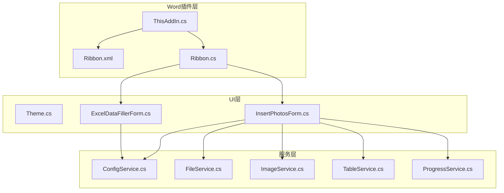
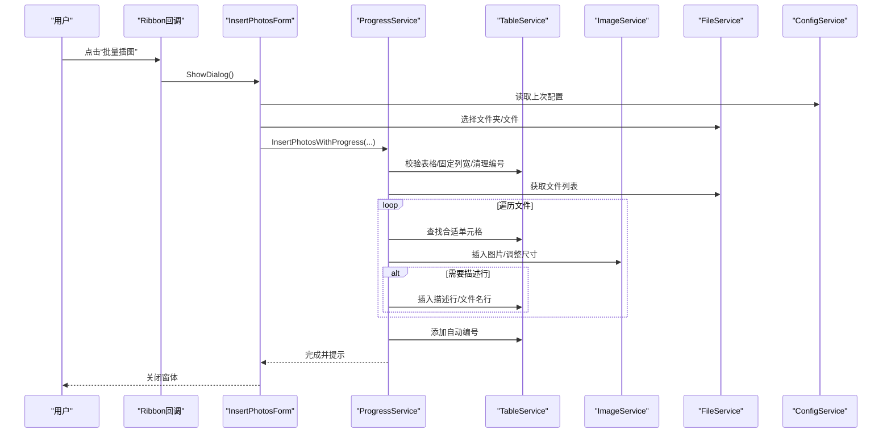
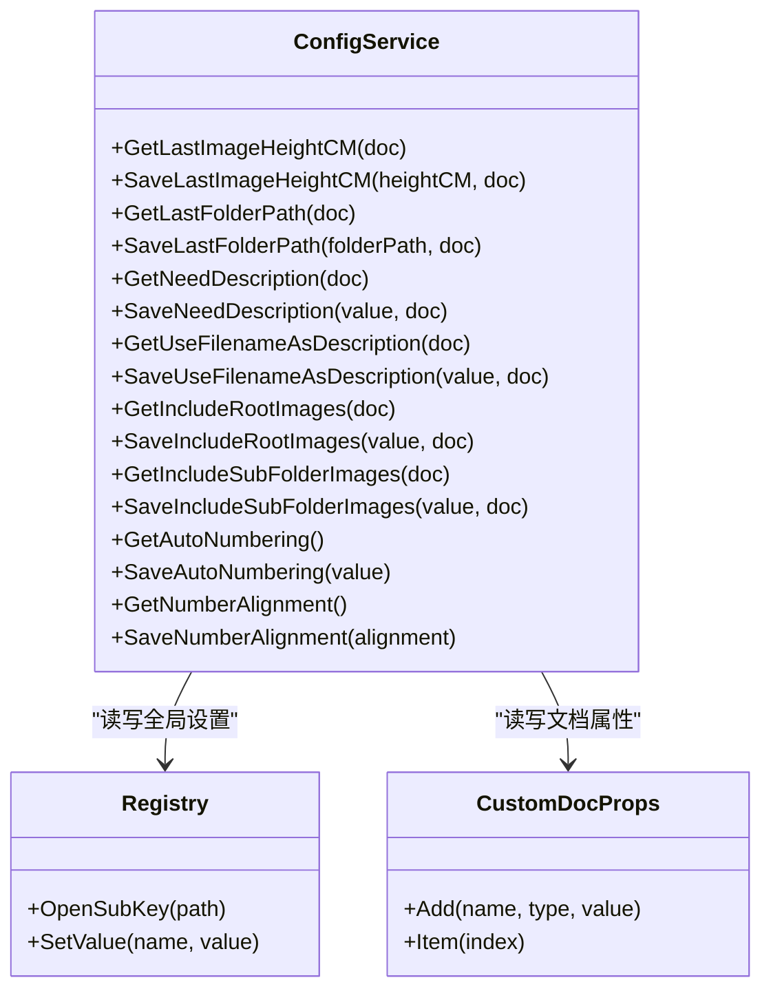
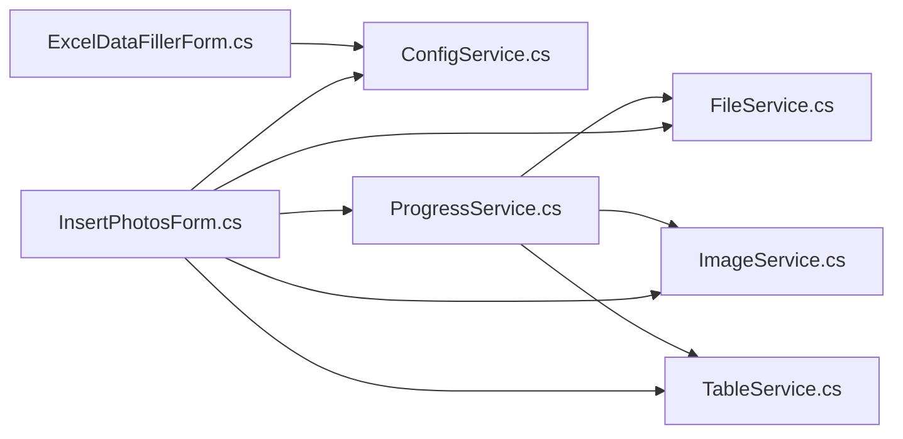

# 核心功能

<cite>
**本文引用的文件**
- [WordTools.csproj](file://WordTools/WordTools.csproj)
- [README.md](file://README.md)
- [ThisAddIn.cs](file://WordTools/ThisAddIn.cs)
- [Ribbon.cs](file://WordTools/Ribbon.cs)
- [Ribbon.xml](file://WordTools/Ribbon.xml)
- [Theme.cs](file://WordTools/Theme.cs)
- [InsertPhotosForm.cs](file://WordTools/Forms/InsertPhotosForm.cs)
- [ExcelDataFillerForm.cs](file://WordTools/Forms/ExcelDataFillerForm.cs)
- [ConfigService.cs](file://WordTools/Services/ConfigService.cs)
- [FileService.cs](file://WordTools/Services/FileService.cs)
- [ImageService.cs](file://WordTools/Services/ImageService.cs)
- [TableService.cs](file://WordTools/Services/TableService.cs)
- [ProgressService.cs](file://WordTools/Services/ProgressService.cs)
</cite>

## 目录
1. [简介](#简介)
2. [项目结构](#项目结构)
3. [核心组件](#核心组件)
4. [架构总览](#架构总览)
5. [详细组件分析](#详细组件分析)
6. [依赖关系分析](#依赖关系分析)
7. [性能考量](#性能考量)
8. [故障排查指南](#故障排查指南)
9. [结论](#结论)
10. [附录](#附录)

## 简介
本文件面向WordTools的核心功能，重点围绕“图片批量插入”展开，涵盖：
- 从文件夹或选择的图片文件批量插入到Word表格的完整流程
- 自动编号系统与描述行功能的工作原理
- 配置管理系统（文档级配置与全局用户设置）
- 用户界面设计与交互模式
- 使用示例、最佳实践、功能协作关系与数据流
- 性能优化建议与常见问题解决方案

## 项目结构
项目采用“COM加载项 + 功能区 + 窗体 + 服务层”的分层架构，核心文件组织如下：
- 入口与功能区：ThisAddIn.cs、Ribbon.cs、Ribbon.xml
- UI主题与窗体：Theme.cs、Forms/InsertPhotosForm.cs、Forms/ExcelDataFillerForm.cs
- 服务层：Services/ConfigService.cs、FileService.cs、ImageService.cs、TableService.cs、ProgressService.cs

图表来源
- [ThisAddIn.cs:1-175](file://WordTools/ThisAddIn.cs#L1-L175)
- [Ribbon.xml:1-53](file://WordTools/Ribbon.xml#L1-L53)
- [Ribbon.cs:1-190](file://WordTools/Ribbon.cs#L1-L190)
- [Theme.cs:1-358](file://WordTools/Theme.cs#L1-L358)
- [InsertPhotosForm.cs:1-574](file://WordTools/Forms/InsertPhotosForm.cs#L1-L574)
- [ExcelDataFillerForm.cs:1-432](file://WordTools/Forms/ExcelDataFillerForm.cs#L1-L432)
- [ConfigService.cs:1-463](file://WordTools/Services/ConfigService.cs#L1-L463)
- [FileService.cs:1-310](file://WordTools/Services/FileService.cs#L1-L310)
- [ImageService.cs:1-325](file://WordTools/Services/ImageService.cs#L1-L325)
- [TableService.cs:1-756](file://WordTools/Services/TableService.cs#L1-L756)
- [ProgressService.cs:1-571](file://WordTools/Services/ProgressService.cs#L1-L571)

章节来源
- [WordTools.csproj:1-149](file://WordTools/WordTools.csproj#L1-L149)
- [README.md:1-85](file://README.md#L1-L85)

## 核心组件
- 功能区与入口：ThisAddIn.cs负责COM加载项生命周期与Ribbon回调；Ribbon.xml定义功能区UI；Ribbon.cs提供本地化与回调。
- 窗体与主题：Theme.cs统一UI风格；InsertPhotosForm.cs承载批量插图主界面；ExcelDataFillerForm.cs承载Excel数据填充。
- 服务层：
  - ConfigService.cs：文档级自定义属性与注册表配置读写
  - FileService.cs：文件夹/文件选择、图片文件筛选与自然排序
  - ImageService.cs：图片插入、尺寸调整、批量预分配与快速插入
  - TableService.cs：表格校验、标题/描述行、自动编号与编号清理
  - ProgressService.cs：批量处理进度、性能优化（关闭屏幕更新、禁用警告、内存回收）

章节来源
- [ThisAddIn.cs:1-175](file://WordTools/ThisAddIn.cs#L1-L175)
- [Ribbon.cs:1-190](file://WordTools/Ribbon.cs#L1-L190)
- [Ribbon.xml:1-53](file://WordTools/Ribbon.xml#L1-L53)
- [Theme.cs:1-358](file://WordTools/Theme.cs#L1-L358)
- [InsertPhotosForm.cs:1-574](file://WordTools/Forms/InsertPhotosForm.cs#L1-L574)
- [ExcelDataFillerForm.cs:1-432](file://WordTools/Forms/ExcelDataFillerForm.cs#L1-L432)
- [ConfigService.cs:1-463](file://WordTools/Services/ConfigService.cs#L1-L463)
- [FileService.cs:1-310](file://WordTools/Services/FileService.cs#L1-L310)
- [ImageService.cs:1-325](file://WordTools/Services/ImageService.cs#L1-L325)
- [TableService.cs:1-756](file://WordTools/Services/TableService.cs#L1-L756)
- [ProgressService.cs:1-571](file://WordTools/Services/ProgressService.cs#L1-L571)

## 架构总览
批量插图从功能区按钮触发，经ThisAddIn与Ribbon回调打开InsertPhotosForm，随后通过ProgressService协调FileService、ImageService、TableService与ConfigService完成批量插入、自动编号与描述行生成，并在完成后恢复Word性能模式。

图表来源
- [ThisAddIn.cs:108-111](file://WordTools/ThisAddIn.cs#L108-L111)
- [InsertPhotosForm.cs:481-524](file://WordTools/Forms/InsertPhotosForm.cs#L481-L524)
- [ProgressService.cs:146-306](file://WordTools/Services/ProgressService.cs#L146-L306)
- [TableService.cs:18-40](file://WordTools/Services/TableService.cs#L18-L40)
- [ImageService.cs:73-134](file://WordTools/Services/ImageService.cs#L73-L134)
- [FileService.cs:117-134](file://WordTools/Services/FileService.cs#L117-L134)
- [ConfigService.cs:370-387](file://WordTools/Services/ConfigService.cs#L370-L387)

## 详细组件分析

### 图片批量插入（文件夹/文件）
- 触发路径：功能区按钮 -> ThisAddIn回调 -> InsertPhotosForm -> ProgressService
- 关键流程：
  - 表格校验与准备：确保选中表格、位于首列、固定列宽、清理编号
  - 文件收集：支持根目录与子目录组合，自然排序
  - 批量插入：逐文件插入图片，自动换行至下一行，支持描述行
  - 进度与取消：状态栏实时更新，支持ESC取消
  - 结束处理：根据配置添加自动编号

图表来源
- [ProgressService.cs:146-306](file://WordTools/Services/ProgressService.cs#L146-L306)
- [TableService.cs:18-40](file://WordTools/Services/TableService.cs#L18-L40)
- [ImageService.cs:142-180](file://WordTools/Services/ImageService.cs#L142-L180)
- [FileService.cs:117-134](file://WordTools/Services/FileService.cs#L117-L134)

章节来源
- [InsertPhotosForm.cs:481-524](file://WordTools/Forms/InsertPhotosForm.cs#L481-L524)
- [ProgressService.cs:146-306](file://WordTools/Services/ProgressService.cs#L146-L306)
- [ImageService.cs:73-134](file://WordTools/Services/ImageService.cs#L73-L134)
- [TableService.cs:18-40](file://WordTools/Services/TableService.cs#L18-L40)
- [FileService.cs:117-134](file://WordTools/Services/FileService.cs#L117-L134)

### 自动编号系统与描述行
- 自动编号：
  - 清理原有编号：检测并移除表格编号，记录原对齐方式
  - 识别描述行：在图片行后识别连续空行，确定编号范围
  - 创建列表模板：基于文档创建自定义编号模板，起始值延续历史
  - 应用编号：对描述行应用编号，设置对齐方式（左/居中/右）
- 描述行：
  - 手动描述：插入空行作为描述行
  - 文件名描述：插入文件名行，自动居中与垂直居中
  - N/A填充：当行不满时，将右侧单元格填充为N/A

图表来源
- [TableService.cs:446-559](file://WordTools/Services/TableService.cs#L446-L559)
- [TableService.cs:564-737](file://WordTools/Services/TableService.cs#L564-L737)
- [TableService.cs:362-407](file://WordTools/Services/TableService.cs#L362-L407)
- [TableService.cs:412-434](file://WordTools/Services/TableService.cs#L412-L434)

章节来源
- [TableService.cs:446-737](file://WordTools/Services/TableService.cs#L446-L737)

### 配置管理系统
- 文档级配置（自定义属性）：
  - 优先从当前文档自定义属性读取，若不存在回退到注册表
  - 支持图片高度、文件夹路径、是否需要描述行、是否使用文件名描述、包含根/子目录、自动编号、编号对齐等
- 全局用户设置（注册表）：
  - 仅保存全局开关与偏好（如自动编号开关、编号对齐）
- 读写策略：
  - 读取：优先文档属性，不存在则注册表
  - 保存：同时写入文档属性与注册表，空值使用特殊标记避免Word COM限制

图表来源
- [ConfigService.cs:144-359](file://WordTools/Services/ConfigService.cs#L144-L359)

章节来源
- [ConfigService.cs:144-359](file://WordTools/Services/ConfigService.cs#L144-L359)

### 用户界面设计与交互
- 主题系统（Theme.cs）：
  - 统一颜色、字体、布局常量与控件样式
  - DPI缩放适配，控件尺寸与垂直居中
- 批量插图窗体（InsertPhotosForm.cs）：
  - 文件夹路径、图片高度、范围选择（根目录/子目录）
  - 描述行选项（手动/无/文件名）、自动编号开关、编号对齐（靠左/居中）
  - 操作按钮：插入文件夹、选择文件、取消
  - 配置加载/保存：启动时读取，操作后保存
- Excel数据填充窗体（ExcelDataFillerForm.cs）：
  - Excel路径、锚定字段、目标列、Sample Size替换等配置
  - 状态显示区域与执行/取消按钮

章节来源
- [Theme.cs:1-358](file://WordTools/Theme.cs#L1-L358)
- [InsertPhotosForm.cs:19-574](file://WordTools/Forms/InsertPhotosForm.cs#L19-L574)
- [ExcelDataFillerForm.cs:1-432](file://WordTools/Forms/ExcelDataFillerForm.cs#L1-L432)

### 使用示例与最佳实践
- 示例场景
  - 从文件夹批量插入：在表格首列选择任意单元格，打开“批量插图”，勾选根目录/子目录，设置图片高度，选择“手动/无/文件名”描述行，勾选自动编号，点击“插入文件夹”
  - 从选择文件插入：与上述流程相同，但点击“选择文件”后直接传入所选文件数组
- 最佳实践
  - 先在表格中固定列宽，避免插入后自动调整导致布局混乱
  - 大量图片时建议开启自动编号，便于后续维护
  - 使用文件名描述行时，确保文件名具有可读性
  - 插入过程中可按ESC取消，避免长时间阻塞

章节来源
- [InsertPhotosForm.cs:481-524](file://WordTools/Forms/InsertPhotosForm.cs#L481-L524)
- [ProgressService.cs:146-306](file://WordTools/Services/ProgressService.cs#L146-L306)

### 功能协作关系与数据流
- 数据流
  - UI层接收用户输入，调用服务层
  - FileService负责文件枚举与排序
  - ImageService负责图片插入与尺寸调整
  - TableService负责表格结构与编号/描述行
  - ConfigService负责配置持久化
  - ProgressService负责进度、性能优化与取消控制
- 协作关系
  - ProgressService串联各服务，统一异常与状态
  - InsertPhotosForm负责UI与配置读写
  - Theme.cs统一外观，减少UI重复逻辑

章节来源
- [ProgressService.cs:146-306](file://WordTools/Services/ProgressService.cs#L146-L306)
- [FileService.cs:117-134](file://WordTools/Services/FileService.cs#L117-L134)
- [ImageService.cs:73-134](file://WordTools/Services/ImageService.cs#L73-L134)
- [TableService.cs:18-40](file://WordTools/Services/TableService.cs#L18-L40)
- [ConfigService.cs:144-359](file://WordTools/Services/ConfigService.cs#L144-L359)

## 依赖关系分析
- 组件耦合
  - ProgressService对FileService、ImageService、TableService、ConfigService依赖较强，承担协调职责
  - InsertPhotosForm对ConfigService、FileService、ImageService、TableService、ProgressService均有调用
  - Theme.cs被窗体广泛使用，降低UI重复
- 外部依赖
  - Microsoft.Office.Interop.Word用于Word对象模型
  - Windows Forms用于UI
  - 注册表用于全局用户设置

图表来源
- [InsertPhotosForm.cs:371-438](file://WordTools/Forms/InsertPhotosForm.cs#L371-L438)
- [ProgressService.cs:146-306](file://WordTools/Services/ProgressService.cs#L146-L306)
- [ExcelDataFillerForm.cs:240-252](file://WordTools/Forms/ExcelDataFillerForm.cs#L240-L252)

章节来源
- [WordTools.csproj:60-98](file://WordTools/WordTools.csproj#L60-L98)

## 性能考量
- 性能优化策略
  - 关闭屏幕更新与警告，减少UI闪烁与提示弹窗
  - 定期内存回收，避免长时间批量处理导致内存增长
  - 动态刷新间隔：根据文件总数动态调整状态栏刷新频率
  - 批量预分配行数，减少频繁AddRows带来的开销
- 用户体验
  - ESC取消：异步检测ESC键，及时响应取消
  - 状态栏：显示百分比、剩余时间、当前文件名，提升可控感

章节来源
- [ProgressService.cs:73-142](file://WordTools/Services/ProgressService.cs#L73-L142)
- [ProgressService.cs:117-125](file://WordTools/Services/ProgressService.cs#L117-L125)
- [ImageService.cs:287-320](file://WordTools/Services/ImageService.cs#L287-L320)

## 故障排查指南
- 常见问题
  - “未找到任何图片文件”：确认文件夹路径正确、包含.jpg/.jpeg/.png，勾选了根目录或子目录
  - “请先选中一个表格/请将光标置于表格左侧单元格”：确保在表格首列任意单元格内
  - “插入过程中按ESC取消”：操作可随时取消，不会破坏现有内容
  - “图片插入失败”：检查文件是否损坏、磁盘权限、Word文档是否被占用
- 建议步骤
  - 先在小规模测试，确认流程无误后再进行大批量
  - 若出现内存占用过高，可分批处理或重启Word
  - 配置重置：删除文档自定义属性或注册表相关项，重新打开窗体加载默认值

章节来源
- [ProgressService.cs:194-201](file://WordTools/Services/ProgressService.cs#L194-L201)
- [InsertPhotosForm.cs:488-499](file://WordTools/Forms/InsertPhotosForm.cs#L488-L499)

## 结论
WordTools通过清晰的分层架构与完善的配置管理，实现了从文件夹/文件到Word表格的高效批量图片插入，并提供了自动编号与描述行能力。配合性能优化与交互设计，既满足用户日常使用，也为开发者提供了良好的扩展点（如新增服务、UI定制、配置项扩展）。

## 附录
- 安装与卸载
  - 构建后以管理员身份注册插件，或在Word加载项中启用
  - 卸载时反向注册或在Word加载项中禁用
- 技术说明
  - 采用COM加载项（非VSTO），减少运行时依赖，需手动注册

章节来源
- [README.md:21-85](file://README.md#L21-L85)