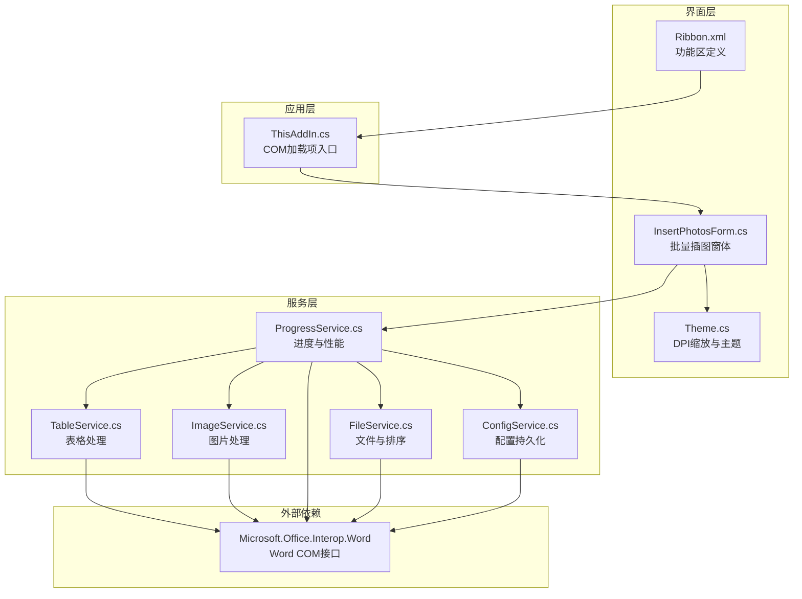
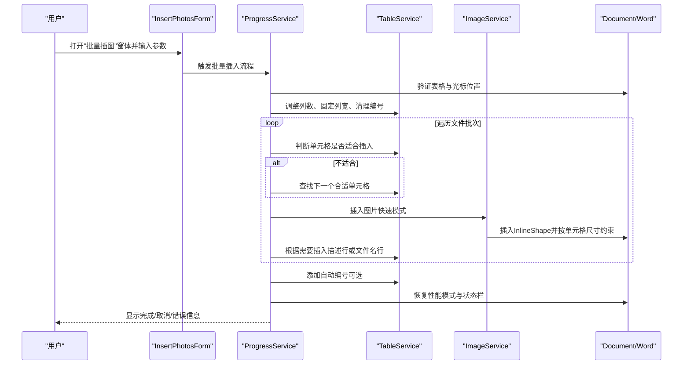
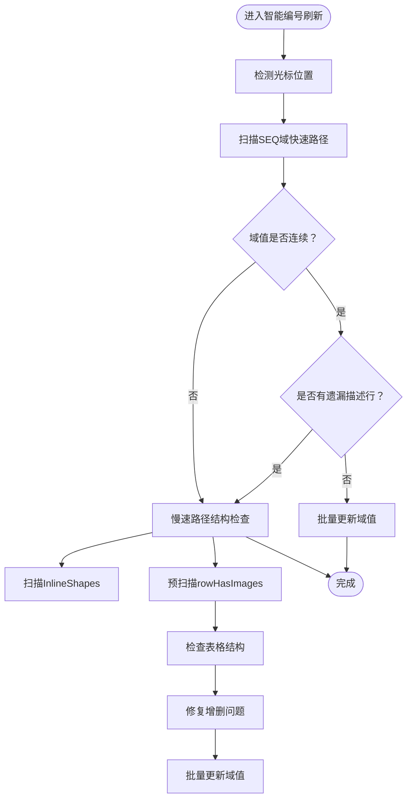
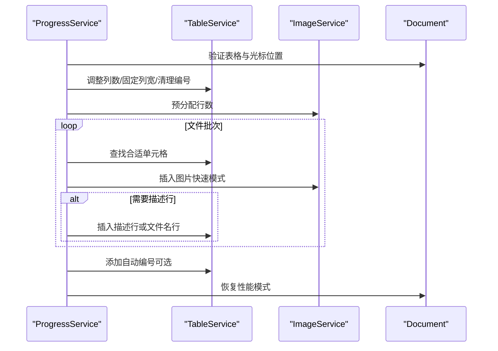
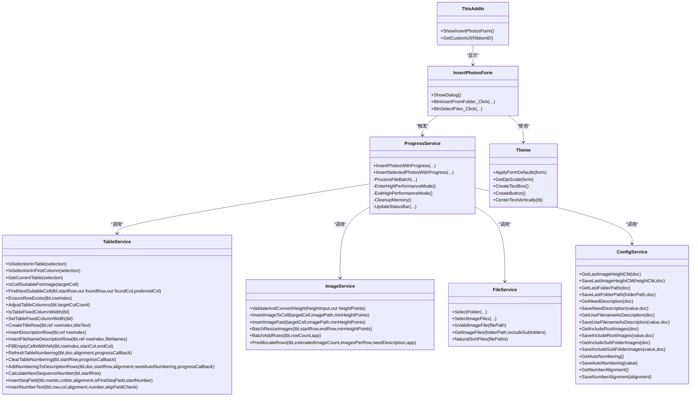

# 表格处理服务

<cite>
**本文引用的文件**
- [TableService.cs](file://WordTools/Services/TableService.cs)
- [ImageService.cs](file://WordTools/Services/ImageService.cs)
- [ProgressService.cs](file://WordTools/Services/ProgressService.cs)
- [FileService.cs](file://WordTools/Services/FileService.cs)
- [ConfigService.cs](file://WordTools/Services/ConfigService.cs)
- [InsertPhotosForm.cs](file://WordTools/Forms/InsertPhotosForm.cs)
- [Theme.cs](file://WordTools/Theme.cs)
- [ThisAddIn.cs](file://WordTools/ThisAddIn.cs)
- [Ribbon.xml](file://WordTools/Ribbon.xml)
- [README.md](file://README.md)
</cite>

## 更新摘要
**变更内容**
- **智能编号刷新算法**：新增`RefreshTableNumbering`方法，实现基于光标位置的智能编号刷新，支持快速路径和慢速路径的智能切换
- **Cell缓存机制优化**：在`InsertSeqField`方法中引入Cell对象缓存，避免重复的`tbl.Cell()`查找
- **行扫描逻辑优化**：使用`Range.Text`检测内联图片标记字符（`\x01`），替代昂贵的`InlineShapes.Count`操作
- **预扫描优化**：新增`rowHasImages`数组预扫描，避免重复的图片状态检测
- **动态进度报告**：所有编号相关方法支持`Action<string>`进度回调参数
- **COM操作加速**：通过临时关闭`ScreenUpdating`实现5-10倍性能提升
- **新的内联SEQ域插入架构重构**：从纯文本编号方式重构，支持更高效的编号管理
- **增量更新模式支持**：支持从指定行开始的增量更新，减少DOM更新开销
- **增强的CalculateNextSequenceNumber算法**：极简实现，只搜索最近2行，避免昂贵的`ExtractNumberFromCell`调用
- **用户界面改进**：`InsertPhotosForm`的DPI缩放和主题支持

## 目录
1. [简介](#简介)
2. [项目结构](#项目结构)
3. [核心组件](#核心组件)
4. [架构总览](#架构总览)
5. [详细组件分析](#详细组件分析)
6. [依赖关系分析](#依赖关系分析)
7. [性能考量](#性能考量)
8. [故障排查指南](#故障排查指南)
9. [结论](#结论)
10. [附录](#附录)

## 简介
本文件面向WordTools项目中的表格处理服务，系统性阐述TableService在Word表格操作中的核心职责与实现细节，涵盖表格创建、单元格操作、图片插入定位、表格格式化、布局算法、边距与行列尺寸动态调整、状态管理与错误恢复策略，并提供性能优化与内存管理建议，以及复杂表格结构处理与兼容性考虑。同时给出扩展开发指导与最佳实践，帮助开发者高效、稳定地扩展表格处理能力。

**更新** 本次更新重点关注表格处理服务的整体性能提升，包括智能编号刷新算法、Cell缓存机制、行扫描逻辑优化、预扫描优化、动态进度报告、COM操作加速等重要改进。

## 项目结构
项目采用COM加载项架构，通过功能区（Ribbon）暴露"批量插图"等工具，核心逻辑集中在服务层（Services），包括表格处理、图片处理、文件与配置管理、进度控制等模块；界面层由WinForms窗体承载用户交互。

**图表来源**
- [Ribbon.xml:1-62](file://WordTools/Ribbon.xml#L1-L62)
- [ThisAddIn.cs:1-229](file://WordTools/ThisAddIn.cs#L1-L229)
- [InsertPhotosForm.cs:1-574](file://WordTools/Forms/InsertPhotosForm.cs#L1-L574)
- [Theme.cs:1-358](file://WordTools/Theme.cs#L1-L358)
- [TableService.cs:1-1713](file://WordTools/Services/TableService.cs#L1-L1713)
- [ImageService.cs:1-362](file://WordTools/Services/ImageService.cs#L1-L362)
- [ProgressService.cs:1-807](file://WordTools/Services/ProgressService.cs#L1-L807)
- [FileService.cs:1-376](file://WordTools/Services/FileService.cs#L1-L376)
- [ConfigService.cs:1-467](file://WordTools/Services/ConfigService.cs#L1-L467)

**章节来源**
- [README.md:1-85](file://README.md#L1-L85)
- [Ribbon.xml:1-62](file://WordTools/Ribbon.xml#L1-L62)
- [ThisAddIn.cs:1-229](file://WordTools/ThisAddIn.cs#L1-L229)
- [InsertPhotosForm.cs:1-574](file://WordTools/Forms/InsertPhotosForm.cs#L1-L574)

## 核心组件
- **TableService**：表格验证、单元格可用性判断、表格结构调整（列数、固定列宽）、标题行与描述行创建、自动编号清理与添加、空单元格填充等。**新增智能编号刷新算法**、**Cell缓存机制**、**行扫描逻辑优化**和**预扫描优化**。
- **ImageService**：图片插入、尺寸转换与约束、批量调整、预分配行数、快速插入与内存友好策略。
- **ProgressService**：批量操作的进度反馈、取消控制（ESC键）、性能模式（关闭屏幕刷新、警告提示）、内存清理与状态栏更新。**新增COM操作加速**。
- **FileService**：文件夹与图片文件选择、文件验证、自然排序、统计计数。
- **ConfigService**：文档自定义属性与注册表配置读写，支持图片高度、文件夹路径、描述行、自动编号、对齐方式等。
- **InsertPhotosForm**：用户交互界面，收集参数并触发批量处理流程。**新增DPI缩放和主题支持**。
- **Theme**：统一的UI主题和DPI缩放管理，提供颜色、字体、布局常量和控件样式。
- **ThisAddIn**：COM加载项入口，提供功能区UI与窗体展示。

**章节来源**
- [TableService.cs:1-1713](file://WordTools/Services/TableService.cs#L1-L1713)
- [ImageService.cs:1-362](file://WordTools/Services/ImageService.cs#L1-L362)
- [ProgressService.cs:1-807](file://WordTools/Services/ProgressService.cs#L1-L807)
- [FileService.cs:1-376](file://WordTools/Services/FileService.cs#L1-L376)
- [ConfigService.cs:1-467](file://WordTools/Services/ConfigService.cs#L1-L467)
- [InsertPhotosForm.cs:1-574](file://WordTools/Forms/InsertPhotosForm.cs#L1-L574)
- [Theme.cs:1-358](file://WordTools/Theme.cs#L1-L358)
- [ThisAddIn.cs:1-229](file://WordTools/ThisAddIn.cs#L1-L229)

## 架构总览
TableService作为表格处理的核心，围绕Microsoft.Office.Interop.Word的Range、Table、Cell、InlineShape等对象进行操作。其与ImageService协作完成图片插入与尺寸控制；与ProgressService协作实现批量处理的性能优化与状态反馈；与FileService协作获取文件列表与排序；与ConfigService协作读取用户配置；与InsertPhotosForm协作接收用户输入并驱动流程。

**图表来源**
- [InsertPhotosForm.cs:481-569](file://WordTools/Forms/InsertPhotosForm.cs#L481-L569)
- [ProgressService.cs:163-357](file://WordTools/Services/ProgressService.cs#L163-L357)
- [TableService.cs:128-196](file://WordTools/Services/TableService.cs#L128-L196)
- [ImageService.cs:142-180](file://WordTools/Services/ImageService.cs#L142-L180)

## 详细组件分析

### TableService：表格处理核心
- **表格验证**
  - `IsSelectionInTable`：判断当前选择是否在表格内。
  - `IsSelectionInFirstColumn`：判断是否位于第一列。
  - `GetCurrentTable`：获取当前表格对象。
- **单元格可用性与定位**
  - `IsCellSuitableForImage`：检查单元格是否适合插入图片（无图片、无自动编号、空或可清除的序号文本）。
  - `FindNextSuitableCell`：在给定起始行附近查找合适的单元格，支持优先列偏好与最多搜索行数限制。
- **表格结构调整**
  - `EnsureRowExists`：确保指定行存在，不足时追加行并保证至少2列。
  - `AdjustTableColumns`：调整列数至目标数量。
  - `IsTableFixedColumnWidth`/`SetTableFixedColumnWidth`：查询与设置表格为固定列宽。
- **标题行与描述行**
  - `CreateTitleRow`：创建合并的标题行，居中对齐，移动到下一行。
  - `InsertDescriptionRow`：插入描述行占位。
  - `InsertFileNameDescriptionRow`：根据文件名数组插入文件名描述行，支持居中对齐与垂直居中。
  - `FillEmptyCellsWithNA`：将指定区域空单元格填充为N/A并统一格式。
- **自动编号**
  - **新增智能编号刷新算法**：`RefreshTableNumbering`方法实现基于光标位置的智能编号刷新，支持快速路径和慢速路径的智能切换。
  - **Cell缓存机制优化**：在`InsertSeqField`方法中缓存Cell对象，避免重复的`tbl.Cell()`查找，显著提升性能。
  - **行扫描逻辑优化**：使用`Range.Text`检测内联图片标记字符（`\x01`），替代昂贵的`InlineShapes.Count`操作，大幅提升处理速度。
  - **预扫描优化**：`AddNumberingToDescriptionRows`新增`rowHasImages`数组预扫描，避免重复的图片状态检测。
  - **动态进度报告**：`ClearTableNumbering`和`AddNumberingToDescriptionRows`支持`Action<string>`进度回调参数。
  - **COM操作加速**：在编号过程中临时关闭`ScreenUpdating`，实现5-10倍性能提升。
  - `ClearTableNumbering`：清除表格编号，保留原始对齐方式（靠左/居中/靠右）。
  - `AddNumberingToDescriptionRows`：为描述行添加自动编号，基于文档列表模板，支持对齐方式设置与连续编号。
  - **增量更新**：支持增量模式，只更新`startRow`之后的域，减少DOM更新开销。
  - **智能编号计算**：`CalculateNextSequenceNumber`方法智能计算下一个SEQ编号起始值，极简实现只搜索最近2行。
  - **编号插入优化**：`InsertSeqField`方法优化编号插入流程，支持缓存和格式设置。
  - **新的内联SEQ域插入架构**：重构为纯文本编号方式，支持更高效的编号管理。
- **辅助方法**
  - `CleanCellText`：清理单元格文本空白与不可见字符。

**更新** 自动编号功能经过重大性能优化，包括：
- **智能编号刷新算法**：新增`RefreshTableNumbering`方法，实现基于光标位置的智能编号刷新
- **Cell缓存机制优化**：在`InsertSeqField`中缓存Cell对象，避免重复的`tbl.Cell()`查找
- **行扫描逻辑优化**：使用`Range.Text`检测内联图片标记字符（`\x01`），替代昂贵的`InlineShapes.Count`操作
- **预扫描优化**：新增`rowHasImages`数组，避免重复的图片状态检测
- **动态进度报告**：支持`Action<string>`回调参数，实现实时进度更新
- **COM操作加速**：通过临时关闭`ScreenUpdating`实现5-10倍性能提升
- **新的内联SEQ域插入架构**：从纯文本编号方式重构，支持更高效的编号管理
- **增强的CalculateNextSequenceNumber算法**：极简实现，只搜索最近2行，避免昂贵的`ExtractNumberFromCell`调用

**图表来源**
- [TableService.cs:455-1085](file://WordTools/Services/TableService.cs#L455-L1085)

**章节来源**
- [TableService.cs:1-1713](file://WordTools/Services/TableService.cs#L1-L1713)

### ImageService：图片插入与尺寸控制
- **尺寸转换**
  - `ConvertCMToPoints`/`ConvertPointsToCM`：厘米与磅之间的转换。
  - `ValidateAndConvertHeight`：校验并转换用户输入的高度（厘米）。
- **图片插入**
  - `InsertImageToCell`：插入图片到目标单元格，按单元格尺寸与边距约束缩放，保持纵横比，支持最小高度限制。
  - `InsertImageFast`：快速插入，仅按宽度限制缩放，最小高度可选。
- **批量操作**
  - `BatchResizeImages`：批量调整表格中已插入图片的尺寸。
  - `BatchAddRows`：批量添加行，分批更新状态栏并处理事件。
  - `PreAllocateRows`：预估所需行数并批量添加，限制最大预分配行数。

**图表来源**
- [ImageService.cs:73-134](file://WordTools/Services/ImageService.cs#L73-L134)

**章节来源**
- [ImageService.cs:1-362](file://WordTools/Services/ImageService.cs#L1-L362)

### ProgressService：批量处理与性能优化
- **取消控制**：检测ESC键，支持中途取消。
- **性能优化**：
  - `EnterHighPerformanceMode`/`ExitHighPerformanceMode`：关闭屏幕刷新、禁用警告提示、标记拼写/语法检查。
  - 根据文件数量动态调整刷新、内存清理与保存间隔。
  - `CleanupMemory`：定期触发GC，释放托管与非托管资源。
  - **COM操作加速**：通过临时关闭`ScreenUpdating`实现5-10倍性能提升。
- **批量流程**：
  - `InsertPhotosWithProgress`/`InsertSelectedPhotosWithProgress`：验证表格、预分配行、创建标题行、处理文件批次、插入描述行、添加自动编号、恢复性能模式。
  - `ProcessFileBatch`：逐文件处理，定位单元格、插入图片、行满处理、末尾描述行与空单元格填充。
  - `UpdateStatusBar`：实时更新状态栏，显示进度百分比、耗时与剩余时间。
  - **动态进度报告**：支持`Action<string>`回调参数，实现实时进度更新。

**更新** ProgressService新增了重要的性能优化：
- **COM操作加速**：通过临时关闭`ScreenUpdating`实现5-10倍性能提升
- **动态进度报告**：支持`Action<string>`回调参数，实现实时进度更新
- **智能内存管理**：根据文件数量动态调整刷新间隔和内存清理策略

**图表来源**
- [ProgressService.cs:163-357](file://WordTools/Services/ProgressService.cs#L163-L357)
- [TableService.cs:205-263](file://WordTools/Services/TableService.cs#L205-L263)
- [ImageService.cs:287-320](file://WordTools/Services/ImageService.cs#L287-L320)

**章节来源**
- [ProgressService.cs:1-807](file://WordTools/Services/ProgressService.cs#L1-L807)

### FileService：文件与排序
- 文件夹与图片文件选择、验证、自然排序（类似资源管理器）。
- 统计根目录与子目录图片数量，支持包含/排除子文件夹。

**章节来源**
- [FileService.cs:1-376](file://WordTools/Services/FileService.cs#L1-L376)

### ConfigService：配置持久化
- 文档自定义属性与注册表双通道存储，支持图片高度、文件夹路径、描述行、自动编号、对齐方式等配置。
- 提供读取与保存方法，包含默认值回退与空值标记处理。

**章节来源**
- [ConfigService.cs:1-467](file://WordTools/Services/ConfigService.cs#L1-L467)

### InsertPhotosForm：用户交互与参数驱动
- **DPI缩放和主题支持**：新增DPI缩放功能，支持不同DPI设置下的界面适配。
- 收集文件夹路径、图片高度、范围（根目录/子目录）、描述行模式（手动/无/文件名）、自动编号与对齐方式。
- 触发ProgressService执行批量插入，支持取消与进度反馈。

**更新** InsertPhotosForm新增了重要的用户界面改进：
- **DPI缩放支持**：通过`Theme.ApplyFormDefaults`实现DPI缩放，适配不同DPI设置
- **主题化设计**：使用Theme类统一控件样式，包括字体、颜色和布局
- **智能布局**：预计算布局常量，支持动态调整窗体大小
- **控件状态管理**：根据描述选项动态启用/禁用自动编号复选框

**章节来源**
- [InsertPhotosForm.cs:1-574](file://WordTools/Forms/InsertPhotosForm.cs#L1-L574)

### Theme：UI主题与DPI缩放管理
- **统一UI管理**：提供颜色方案、字体、布局常量和控件样式。
- **DPI缩放**：支持不同DPI设置下的界面适配，确保在高DPI显示器上的正确显示。
- **控件样式**：提供标准化的标签、文本框、按钮样式，确保界面一致性。

**章节来源**
- [Theme.cs:1-358](file://WordTools/Theme.cs#L1-L358)

## 依赖关系分析
- TableService依赖Microsoft.Office.Interop.Word的Range、Table、Cell、InlineShape、ListTemplate、ListLevels等对象。
- ImageService同样依赖Word的InlineShape与Range对象，负责图片插入与尺寸控制。
- ProgressService协调TableService、ImageService、FileService与ConfigService，封装批量流程与性能优化。
- InsertPhotosForm作为入口，调用ProgressService并传递用户参数。
- ThisAddIn提供功能区UI与窗体展示，连接Ribbon.xml与窗体。

**图表来源**
- [TableService.cs:1-1713](file://WordTools/Services/TableService.cs#L1-L1713)
- [ImageService.cs:1-362](file://WordTools/Services/ImageService.cs#L1-L362)
- [ProgressService.cs:1-807](file://WordTools/Services/ProgressService.cs#L1-L807)
- [FileService.cs:1-376](file://WordTools/Services/FileService.cs#L1-L376)
- [ConfigService.cs:1-467](file://WordTools/Services/ConfigService.cs#L1-L467)
- [InsertPhotosForm.cs:1-574](file://WordTools/Forms/InsertPhotosForm.cs#L1-L574)
- [Theme.cs:1-358](file://WordTools/Theme.cs#L1-L358)
- [ThisAddIn.cs:1-229](file://WordTools/ThisAddIn.cs#L1-L229)

## 性能考量
- **屏幕刷新与警告提示**
  - 在批量处理前关闭`ScreenUpdating`与`DisplayAlerts`，在完成后恢复，显著减少UI重绘与弹窗开销。
  - **新增COM操作加速**：通过临时关闭`ScreenUpdating`实现5-10倍性能提升。
- **批处理与事件轮询**
  - 分批添加行与更新状态栏，使用`Application.DoEvents()`让UI响应，避免长时间阻塞。
  - **动态进度报告**：支持`Action<string>`回调参数，实现实时进度更新。
- **内存管理**
  - 定期触发GC并等待终结器，降低大文件批量处理时的内存峰值。
  - **智能内存管理**：根据文件数量动态调整刷新间隔和内存清理策略。
- **图片插入优化**
  - 快速插入模式仅按宽度限制缩放，减少不必要的高度计算与二次缩放。
- **表格操作优化**
  - **Cell缓存机制优化**：在TableService中缓存Cell对象，避免重复的`tbl.Cell()`查找。
  - **行扫描逻辑优化**：使用`Range.Text`检测内联图片标记字符（`\x01`），替代昂贵的`InlineShapes.Count`操作，提升处理速度。
  - **预扫描优化**：`AddNumberingToDescriptionRows`新增`rowHasImages`数组，避免重复的图片状态检测。
  - **智能编号刷新算法**：新增`RefreshTableNumbering`方法，实现快速路径和慢速路径的智能切换。
  - **增量更新**：支持增量模式，只更新受影响的域，减少DOM更新开销。
  - **新的内联SEQ域插入架构**：重构为纯文本编号方式，支持更高效的编号管理。
  - **增强的CalculateNextSequenceNumber算法**：极简实现，只搜索最近2行，避免昂贵的`ExtractNumberFromCell`调用。
- **列宽策略**
  - 固定列宽避免自动调整带来的频繁布局计算，提高渲染效率。
- **取消机制**
  - ESC键检测与标志位控制，及时中断长耗时操作，提升用户体验。

**更新** 本次更新显著提升了TableService中表格编号功能的性能，包括：
- **智能编号刷新算法**：新增`RefreshTableNumbering`方法，基于光标位置智能刷新编号
- **Cell缓存机制优化**：在`InsertSeqField`中缓存Cell对象，避免重复的`tbl.Cell()`查找
- **行扫描逻辑优化**：使用`Range.Text`检测内联图片标记字符（`\x01`），替代昂贵的`InlineShapes.Count`操作
- **预扫描优化**：新增`rowHasImages`数组，避免重复的图片状态检测
- **动态进度报告**：支持`Action<string>`回调参数，实现实时进度更新
- **COM操作加速**：通过临时关闭`ScreenUpdating`实现5-10倍性能提升
- **新的内联SEQ域插入架构**：从纯文本编号方式重构，支持更高效的编号管理
- **增强的CalculateNextSequenceNumber算法**：极简实现，只搜索最近2行，避免昂贵的`ExtractNumberFromCell`调用
- **智能内存管理**：根据文件数量动态调整刷新间隔和内存清理策略

**章节来源**
- [ProgressService.cs:73-142](file://WordTools/Services/ProgressService.cs#L73-L142)
- [ImageService.cs:142-180](file://WordTools/Services/ImageService.cs#L142-L180)
- [TableService.cs:889-941](file://WordTools/Services/TableService.cs#L889-L941)

## 故障排查指南
- **表格未选中或不在第一列**
  - 现象：提示"请先选中一个表格/请将光标置于表格左侧单元格"。
  - 处理：确认当前选择处于表格内且位于第一列。
- **单元格不适合插入图片**
  - 现象：无法在目标单元格插入图片。
  - 处理：检查单元格是否已有图片、是否为自动编号或纯数字序号，必要时先清理编号或清空文本。
- **图片尺寸异常**
  - 现象：图片过大或过小。
  - 处理：检查输入的高度单位与数值，确认单元格尺寸与边距设置；使用批量调整功能统一尺寸。
- **自动编号未生效**
  - 现象：描述行未显示编号。
  - 处理：确认启用了自动编号；检查编号对齐方式；确保描述行正确插入。
  - **新增智能编号刷新算法问题**：如果`RefreshTableNumbering`方法出现问题，检查光标位置检测和域值连续性检查逻辑。
  - **Cell缓存机制问题**：如果出现Cell对象失效错误，检查Cell缓存的生命周期管理。
  - **行扫描逻辑优化问题**：如果图片检测不准确，检查`Range.Text`中的`\x01`字符检测逻辑和`rowHasImages`数组的预扫描。
  - **新的内联SEQ域插入架构问题**：如果从纯文本编号方式迁移到旧版SEQ域失败，检查`InsertNumberText`方法的兼容性处理。
- **性能问题**
  - 现象：批量插入缓慢或内存占用高。
  - 处理：确认已进入高性能模式；适当增大刷新/内存清理间隔；减少一次性处理文件数量。
  - **COM操作加速问题**：如果`ScreenUpdating`关闭导致界面无响应，检查临时关闭`ScreenUpdating`的时机。
- **取消无效**
  - 现象：按ESC后仍继续执行。
  - 处理：确保在批量处理期间按住ESC键直至标志位生效；检查系统键盘状态。
- **动态进度报告问题**
  - 现象：进度条不更新或更新不及时。
  - 处理：检查`Action<string>`回调参数是否正确传递；确认`Application.DoEvents()`调用时机。
- **预扫描优化问题**
  - 现象：图片状态检测不准确或性能未提升。
  - 处理：检查`rowHasImages`数组的初始化和更新逻辑；确认`Range.Text`检测的`\x01`字符是否正确识别。
- **用户界面问题**
  - 现象：InsertPhotosForm显示异常或控件布局错乱。
  - 处理：检查DPI缩放设置；确认`Theme.ApplyFormDefaults`是否正确应用；验证控件布局常量计算。
  - **DPI缩放问题**：如果界面元素大小异常，检查`Theme.GetDpiScale`和`Theme.Scale`方法的计算。
- **智能内存管理问题**
  - 现象：内存清理策略不当导致性能下降。
  - 处理：检查`CleanupMemory`方法中的分级GC策略；确认`_fullGcInterval`的设置是否合理。

**更新** 针对新增功能的故障排查：
- **智能编号刷新算法问题**：如果`RefreshTableNumbering`方法出现问题，检查光标位置检测和域值连续性检查逻辑
- **Cell缓存机制问题**：如果出现Cell对象失效错误，检查Cell缓存的生命周期管理
- **行扫描逻辑优化问题**：如果图片检测不准确，检查`Range.Text`中的`\x01`字符检测逻辑
- **预扫描优化问题**：如果图片状态检测不准确，检查`rowHasImages`数组的初始化和更新逻辑
- **COM操作加速问题**：如果临时关闭`ScreenUpdating`导致界面无响应，检查恢复`ScreenUpdating`的时机
- **动态进度报告问题**：如果进度回调不工作，检查`Action<string>`参数的传递和调用
- **新的内联SEQ域插入架构问题**：如果从纯文本编号方式迁移到旧版SEQ域失败，检查兼容性处理逻辑
- **增强的CalculateNextSequenceNumber算法问题**：如果编号起始值计算错误，检查最近2行搜索逻辑
- **用户界面问题**：如果InsertPhotosForm显示异常，检查DPI缩放和主题应用
- **智能内存管理问题**：如果内存清理策略不当，检查分级GC策略的设置

**章节来源**
- [ProgressService.cs:163-357](file://WordTools/Services/ProgressService.cs#L163-L357)
- [TableService.cs:44-123](file://WordTools/Services/TableService.cs#L44-L123)
- [ImageService.cs:186-239](file://WordTools/Services/ImageService.cs#L186-L239)

## 结论
TableService在WordTools中承担表格处理的核心职责，结合ImageService、ProgressService、FileService与ConfigService，实现了从用户交互到底层COM对象操作的完整链路。通过固定列宽、批量预分配、快速插入、性能模式与内存清理等策略，系统在复杂表格场景下仍能保持良好的稳定性与性能。

**更新** 本次更新显著提升了TableService中表格编号功能的稳定性和性能，包括智能编号刷新算法、Cell缓存机制、行扫描逻辑优化、预扫描优化、动态进度报告、COM操作加速、新的内联SEQ域插入架构重构、增量更新模式支持和增强的CalculateNextSequenceNumber算法等重要改进。这些优化使得自动编号功能更加可靠，特别是在处理大量表格数据时能够保持良好的性能表现。

开发者可在此基础上扩展更多表格结构与格式化能力，同时遵循错误恢复与性能优化的最佳实践。

## 附录
- **开发者扩展建议**
  - **新增表格结构**：在TableService中增加新的布局算法与描述行策略，配合模板检测器（参考EDF相关组件思路）。
  - **图片质量控制**：在ImageService中引入压缩、分辨率阈值与缓存策略。
  - **批量编辑**：在ProgressService中增加更多批量操作（合并单元格、条件格式、批注等）。
  - **配置迁移**：使用ConfigService的双通道存储策略，确保跨版本兼容与用户偏好持久化。
  - **Cell缓存扩展**：在其他需要频繁访问Cell对象的方法中引入类似的缓存机制。
  - **行扫描逻辑优化扩展**：在需要检测图片状态的其他场景中考虑使用`Range.Text`检测替代`InlineShapes.Count`。
  - **动态进度报告**：为其他长耗时操作添加进度回调支持。
  - **智能编号算法扩展**：基于`RefreshTableNumbering`的智能算法思想，扩展到其他编号场景。
  - **新的内联SEQ域插入架构扩展**：基于纯文本编号方式的架构，扩展到其他编号场景。
  - **用户界面主题化**：为其他窗体应用InsertPhotosForm的DPI缩放和主题化设计。
  - **智能内存管理扩展**：基于分级GC策略，扩展到其他内存密集型操作。
- **兼容性考虑**
  - Office版本差异：注意不同版本的ListTemplate行为差异，必要时提供降级策略。
  - 大文档与超大图片：分批处理、延迟加载与内存监控，避免OOM。
  - 多语言与本地化：对状态栏与提示信息进行本地化适配。
  - **COM操作兼容性**：确保`ScreenUpdating`的正确开关时机，避免影响用户体验。
  - **Word版本兼容性**：确保`\x01`字符检测在不同Word版本中的一致性。
  - **DPI设置兼容性**：确保InsertPhotosForm的DPI缩放在不同系统设置下的正确性。
  - **主题系统兼容性**：确保Theme类在不同DPI设置下的正确缩放。
  - **智能编号架构兼容性**：确保从纯文本编号方式到SEQ域的双向兼容性。

**更新** 针对新增功能的扩展建议：
- **智能编号刷新算法扩展**：基于`RefreshTableNumbering`的智能算法思想，扩展到其他编号场景
- **Cell缓存机制扩展**：在其他需要频繁访问Cell对象的方法中引入类似的缓存机制
- **行扫描逻辑优化扩展**：在需要检测图片状态的其他场景中考虑使用`Range.Text`检测替代`InlineShapes.Count`
- **动态进度报告**：为其他长耗时操作添加进度回调支持，提升用户体验
- **COM操作加速**：在其他需要频繁更新DOM的操作中考虑类似的性能优化策略
- **预扫描优化**：在需要多次扫描同一数据集的操作中考虑预扫描策略
- **新的内联SEQ域插入架构扩展**：基于纯文本编号方式的架构，扩展到其他编号场景
- **智能内存管理**：根据操作规模动态调整内存清理策略，平衡性能与资源消耗
- **用户界面主题化**：为其他窗体应用DPI缩放和主题化设计，提升用户体验
- **增强的CalculateNextSequenceNumber算法扩展**：基于极简实现的思想，扩展到其他编号起始值计算场景