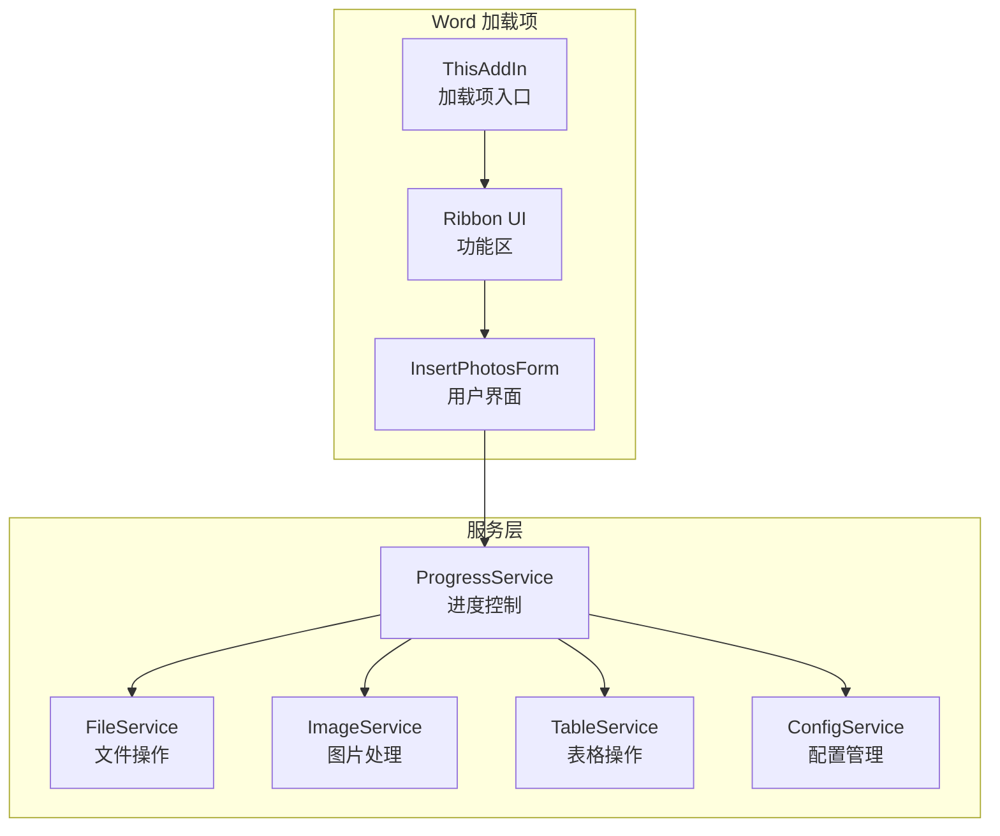
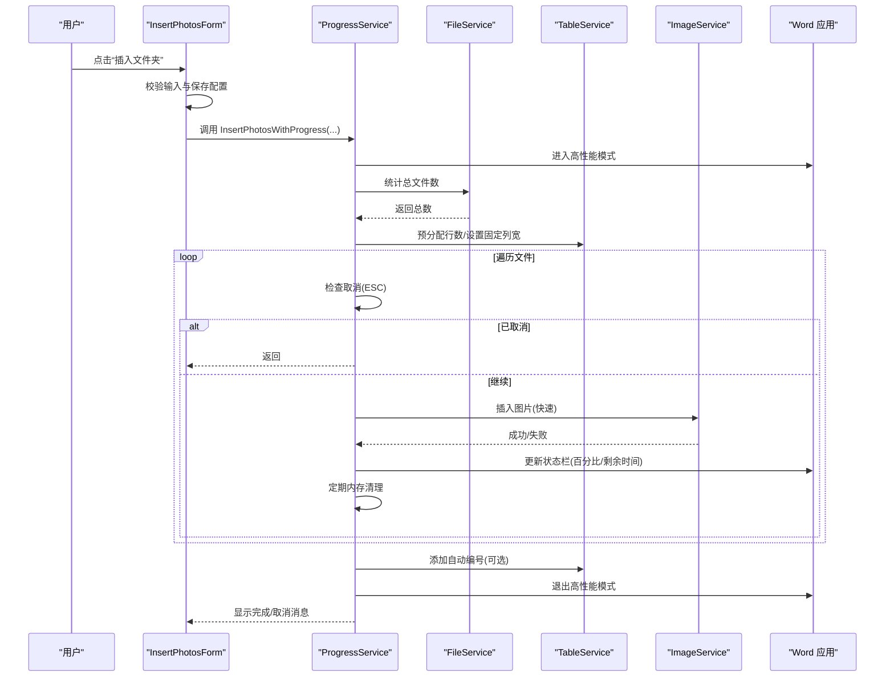
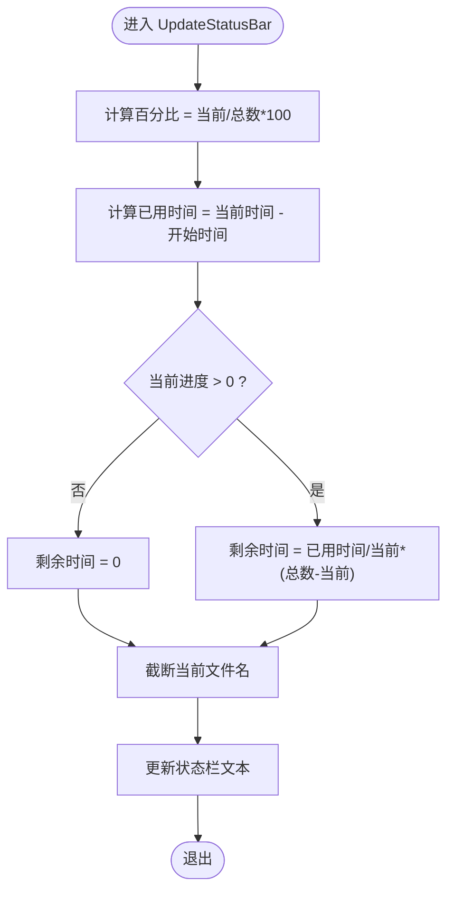
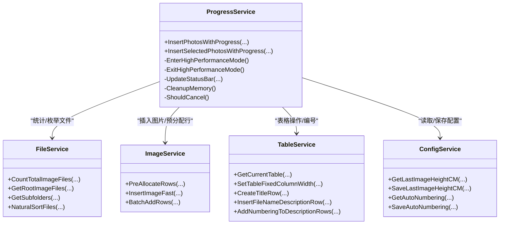

# 进度控制服务

<cite>
**本文引用的文件**
- [ProgressService.cs](file://WordTools/Services/ProgressService.cs)
- [FileService.cs](file://WordTools/Services/FileService.cs)
- [ImageService.cs](file://WordTools/Services/ImageService.cs)
- [TableService.cs](file://WordTools/Services/TableService.cs)
- [ConfigService.cs](file://WordTools/Services/ConfigService.cs)
- [InsertPhotosForm.cs](file://WordTools/Forms/InsertPhotosForm.cs)
- [ThisAddIn.cs](file://WordTools/ThisAddIn.cs)
- [README.md](file://README.md)
</cite>

## 目录
1. [简介](#简介)
2. [项目结构](#项目结构)
3. [核心组件](#核心组件)
4. [架构概览](#架构概览)
5. [详细组件分析](#详细组件分析)
6. [依赖关系分析](#依赖关系分析)
7. [性能考量](#性能考量)
8. [故障排除指南](#故障排除指南)
9. [结论](#结论)
10. [附录](#附录)

## 简介
本文件针对 Word 工具箱项目中的进度控制服务进行深入技术文档化，重点围绕 ProgressService 的设计理念、实现机制与最佳实践展开。内容涵盖：
- 长时间操作的进度显示与用户体验设计
- 性能优化策略（刷新频率、内存管理、Word 性能模式）
- 进度计算算法（总任务统计、已完成跟踪、剩余时间估算）
- 大文件处理策略与资源释放机制
- 用户取消支持（ESC 键检测、异步中断、状态检查与清理）
- 最佳实践、性能监控与故障诊断

## 项目结构
该项目采用 COM 加载项架构，通过 Ribbon 扩展 Word 功能区，提供批量图片插入与自动编号等功能。进度控制服务位于 Services 层，与文件系统、图片处理、表格操作以及配置管理协同工作。

图表来源
- [ThisAddIn.cs:17-156](file://WordTools/ThisAddIn.cs#L17-L156)
- [InsertPhotosForm.cs:18-618](file://WordTools/Forms/InsertPhotosForm.cs#L18-L618)
- [ProgressService.cs:14-571](file://WordTools/Services/ProgressService.cs#L14-L571)
- [FileService.cs:13-310](file://WordTools/Services/FileService.cs#L13-L310)
- [ImageService.cs:10-325](file://WordTools/Services/ImageService.cs#L10-L325)
- [TableService.cs:11-756](file://WordTools/Services/TableService.cs#L11-L756)
- [ConfigService.cs:11-362](file://WordTools/Services/ConfigService.cs#L11-L362)

章节来源
- [README.md:1-85](file://README.md#L1-L85)
- [ThisAddIn.cs:17-156](file://WordTools/ThisAddIn.cs#L17-L156)
- [InsertPhotosForm.cs:18-618](file://WordTools/Forms/InsertPhotosForm.cs#L18-L618)

## 核心组件
- ProgressService：负责批量图片插入的进度控制、性能优化、内存管理与用户取消支持。提供两种入口：从文件夹批量插入与从选中文件批量插入。
- FileService：提供文件夹选择、图片文件筛选、自然排序、文件计数等基础能力。
- ImageService：提供图片插入、尺寸转换、快速插入与批量尺寸调整等图片处理能力。
- TableService：提供表格验证、单元格适配、标题行/描述行插入、自动编号等表格操作。
- ConfigService：提供文档自定义属性与注册表的配置读写，用于持久化用户偏好。

章节来源
- [ProgressService.cs:14-571](file://WordTools/Services/ProgressService.cs#L14-L571)
- [FileService.cs:13-310](file://WordTools/Services/FileService.cs#L13-L310)
- [ImageService.cs:10-325](file://WordTools/Services/ImageService.cs#L10-L325)
- [TableService.cs:11-756](file://WordTools/Services/TableService.cs#L11-L756)
- [ConfigService.cs:11-362](file://WordTools/Services/ConfigService.cs#L11-L362)

## 架构概览
ProgressService 作为协调者，串联文件扫描、表格准备、图片插入与状态栏更新，并在关键节点执行性能优化与内存清理。其取消逻辑基于 ESC 键检测，确保长耗时操作可中断。

图表来源
- [InsertPhotosForm.cs:525-561](file://WordTools/Forms/InsertPhotosForm.cs#L525-L561)
- [ProgressService.cs:151-306](file://WordTools/Services/ProgressService.cs#L151-L306)
- [FileService.cs:163-188](file://WordTools/Services/FileService.cs#L163-L188)
- [TableService.cs:284-295](file://WordTools/Services/TableService.cs#L284-L295)
- [ImageService.cs:142-180](file://WordTools/Services/ImageService.cs#L142-L180)

## 详细组件分析

### ProgressService 设计理念与实现机制
- 取消控制：通过 Windows API 检测 ESC 键状态，结合内部标志位实现即时取消；在检测到取消后立即更新状态栏并触发 UI 事件派发。
- 性能优化：
  - 高性能模式：关闭屏幕更新与警告弹窗，减少 UI 刷新与对话框干扰，提升批量操作吞吐。
  - 动态刷新间隔：根据总文件数动态调整刷新频率，避免频繁 UI 更新造成性能损耗。
  - 内存清理：周期性触发垃圾回收与事件派发，降低内存峰值。
  - 预分配行数：根据预计图片数量提前增加表格行数，减少逐行追加带来的性能抖动。
- 进度计算：基于当前处理数与总文件数计算百分比，结合起始时间估算剩余秒数，实时更新状态栏。
- 用户体验：在操作前提示用户可按 ESC 取消；完成后根据成功/失败/取消情况给出不同提示。

章节来源
- [ProgressService.cs:14-36](file://WordTools/Services/ProgressService.cs#L14-L36)
- [ProgressService.cs:40-64](file://WordTools/Services/ProgressService.cs#L40-L64)
- [ProgressService.cs:73-112](file://WordTools/Services/ProgressService.cs#L73-L112)
- [ProgressService.cs:117-125](file://WordTools/Services/ProgressService.cs#L117-L125)
- [ProgressService.cs:130-142](file://WordTools/Services/ProgressService.cs#L130-L142)
- [ProgressService.cs:208-210](file://WordTools/Services/ProgressService.cs#L208-L210)
- [ProgressService.cs:542-566](file://WordTools/Services/ProgressService.cs#L542-L566)

### 进度计算算法
- 百分比：当前进度除以总任务数乘以 100，保留整数。
- 已用时间：当前时间减去起始时间。
- 剩余时间：若当前进度大于 0，则按平均速率估算剩余秒数；否则为 0。
- 当前文件名截断：超过长度阈值时截断显示，便于状态栏阅读。

图表来源
- [ProgressService.cs:542-566](file://WordTools/Services/ProgressService.cs#L542-L566)

章节来源
- [ProgressService.cs:542-566](file://WordTools/Services/ProgressService.cs#L542-L566)

### 内存管理优化措施
- 周期性清理：根据动态刷新间隔的倍数定期触发内存清理，派发 UI 事件并强制垃圾回收。
- 大文件处理策略：通过快速插入与固定列宽减少图片渲染开销；预分配行数避免频繁表格扩展。
- 资源释放：在 finally 块中恢复 Word 性能模式、清空状态栏，确保异常场景下的资源回收。

章节来源
- [ProgressService.cs:130-142](file://WordTools/Services/ProgressService.cs#L130-L142)
- [ProgressService.cs:208-210](file://WordTools/Services/ProgressService.cs#L208-L210)
- [ProgressService.cs:302-305](file://WordTools/Services/ProgressService.cs#L302-L305)

### 用户取消支持
- ESC 键检测：通过 Windows API 实时检测 ESC 键状态，一旦检测到立即标记取消并更新状态栏。
- 状态检查：在每个文件处理循环中检查取消标志，确保及时响应。
- 清理流程：取消后仍执行必要的收尾（如自动编号、恢复性能模式），并在最终提示用户取消信息。

章节来源
- [ProgressService.cs:40-64](file://WordTools/Services/ProgressService.cs#L40-L64)
- [ProgressService.cs:421](file://WordTools/Services/ProgressService.cs#L421)
- [ProgressService.cs:265-279](file://WordTools/Services/ProgressService.cs#L265-L279)

### 与文件系统、图片与表格服务的协作
- 文件统计：根据用户选择的根目录/子目录选项，统计图片总数，决定刷新与清理频率。
- 表格准备：固定列宽、预分配行数、标题行与描述行插入，确保布局稳定。
- 图片插入：快速插入保证性能，同时支持最小高度约束与单元格适配。

章节来源
- [ProgressService.cs:194-216](file://WordTools/Services/ProgressService.cs#L194-L216)
- [ProgressService.cs:412-533](file://WordTools/Services/ProgressService.cs#L412-L533)
- [FileService.cs:163-188](file://WordTools/Services/FileService.cs#L163-L188)
- [TableService.cs:284-295](file://WordTools/Services/TableService.cs#L284-L295)
- [ImageService.cs:142-180](file://WordTools/Services/ImageService.cs#L142-L180)

## 依赖关系分析
ProgressService 依赖多个服务模块，形成清晰的职责分离与低耦合设计。

图表来源
- [ProgressService.cs:14-571](file://WordTools/Services/ProgressService.cs#L14-L571)
- [FileService.cs:13-310](file://WordTools/Services/FileService.cs#L13-L310)
- [ImageService.cs:10-325](file://WordTools/Services/ImageService.cs#L10-L325)
- [TableService.cs:11-756](file://WordTools/Services/TableService.cs#L11-L756)
- [ConfigService.cs:11-362](file://WordTools/Services/ConfigService.cs#L11-L362)

章节来源
- [ProgressService.cs:14-571](file://WordTools/Services/ProgressService.cs#L14-L571)
- [FileService.cs:13-310](file://WordTools/Services/FileService.cs#L13-L310)
- [ImageService.cs:10-325](file://WordTools/Services/ImageService.cs#L10-L325)
- [TableService.cs:11-756](file://WordTools/Services/TableService.cs#L11-L756)
- [ConfigService.cs:11-362](file://WordTools/Services/ConfigService.cs#L11-L362)

## 性能考量
- 刷新频率自适应：根据总文件数动态调整刷新间隔，避免小规模任务过度刷新、大规模任务频繁 UI 更新。
- 内存压力控制：定期触发垃圾回收与事件派发，防止长时间批量操作导致内存持续增长。
- Word 性能模式：关闭屏幕更新与警告弹窗，显著提升批量插入吞吐。
- 表格预分配：减少逐行追加的开销，提高布局稳定性。
- 图片插入优化：快速插入仅做宽度限制与最小高度约束，避免复杂尺寸计算。

章节来源
- [ProgressService.cs:117-125](file://WordTools/Services/ProgressService.cs#L117-L125)
- [ProgressService.cs:130-142](file://WordTools/Services/ProgressService.cs#L130-L142)
- [ProgressService.cs:212-213](file://WordTools/Services/ProgressService.cs#L212-L213)
- [ImageService.cs:287-320](file://WordTools/Services/ImageService.cs#L287-L320)

## 故障排除指南
- ESC 取消无效
  - 检查是否在 UI 线程中执行，确保 Application.DoEvents() 能够派发事件。
  - 确认未在非 UI 线程中直接修改状态栏。
- 状态栏不更新
  - 确认刷新间隔设置合理，避免过于稀疏导致感知延迟。
  - 检查是否处于高性能模式下，必要时临时降低刷新频率。
- 内存占用过高
  - 确认已启用定期内存清理，检查清理间隔是否过长。
  - 大批量任务建议分批处理，避免一次性处理过多文件。
- 图片插入失败
  - 检查文件路径有效性与权限。
  - 确认目标单元格为空且适合插入图片。
- 自动编号异常
  - 检查表格中是否存在混合编号与文本，必要时先清理编号再重新应用。

章节来源
- [ProgressService.cs:40-64](file://WordTools/Services/ProgressService.cs#L40-L64)
- [ProgressService.cs:542-566](file://WordTools/Services/ProgressService.cs#L542-L566)
- [ProgressService.cs:130-142](file://WordTools/Services/ProgressService.cs#L130-L142)
- [TableService.cs:44-123](file://WordTools/Services/TableService.cs#L44-L123)

## 结论
ProgressService 通过取消控制、性能优化、内存管理与进度计算，为 Word 批量图片插入提供了稳健的用户体验。其自适应刷新、预分配与快速插入策略在保证流畅度的同时兼顾了准确性与可维护性。建议在实际部署中结合业务规模调整刷新与清理间隔，并在异常场景下加强日志记录以便诊断。

## 附录
- 最佳实践
  - 输入校验：在 UI 层对高度、路径等输入进行严格校验，避免无效参数进入服务层。
  - 分批处理：对于超大文件集合，建议分批执行并提示用户进度。
  - 配置持久化：利用 ConfigService 保存用户偏好，提升复用体验。
  - 异常隔离：在服务层捕获并分类异常，向 UI 层提供明确的错误提示。
- 性能监控
  - 记录每次批量操作的总耗时、平均耗时与峰值内存，辅助优化参数。
  - 观察状态栏更新频率与 UI 卡顿现象，调整刷新间隔。
- 故障诊断
  - 启用详细日志，记录关键步骤（统计、预分配、插入、清理、编号）的时间戳。
  - 在取消路径中确保资源释放与状态恢复，避免残留状态影响后续操作。