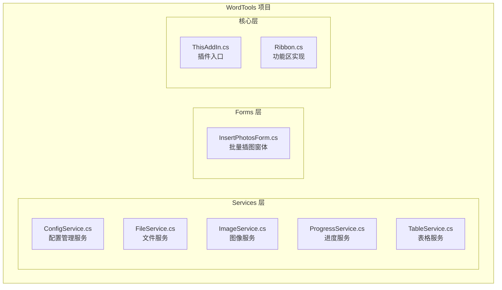
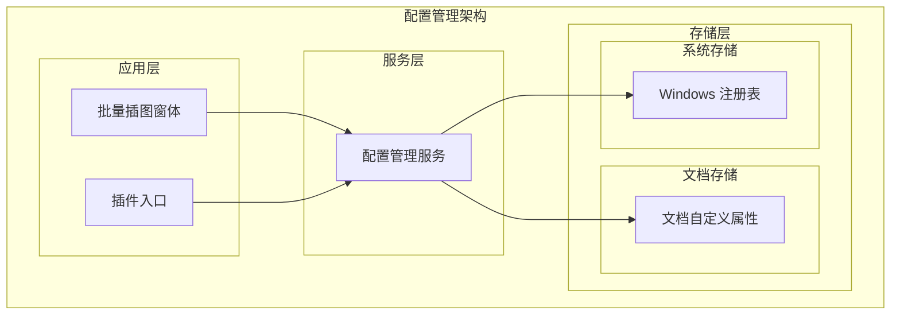
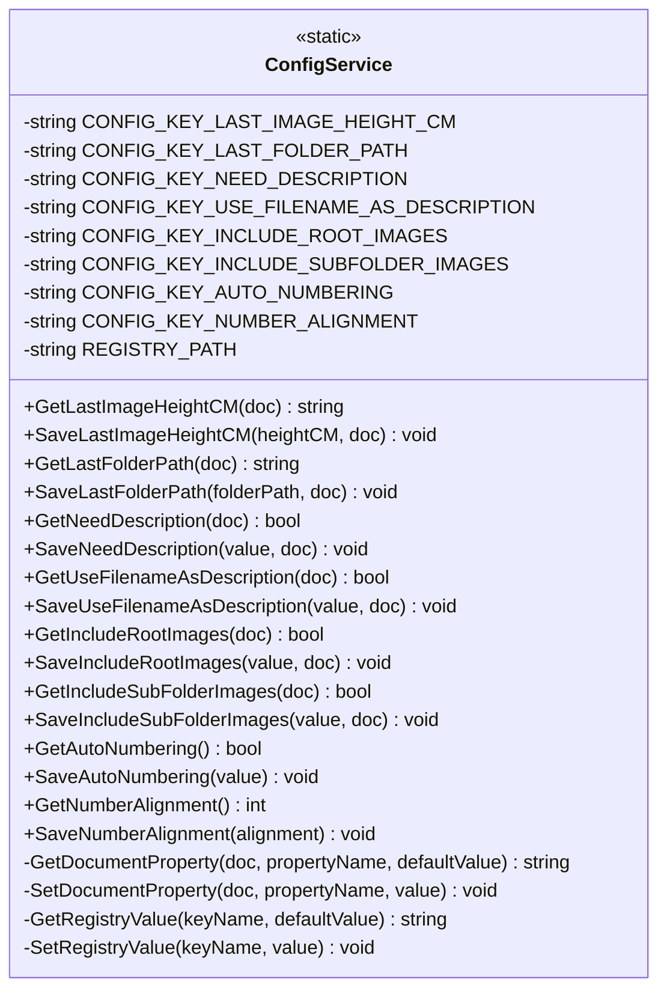
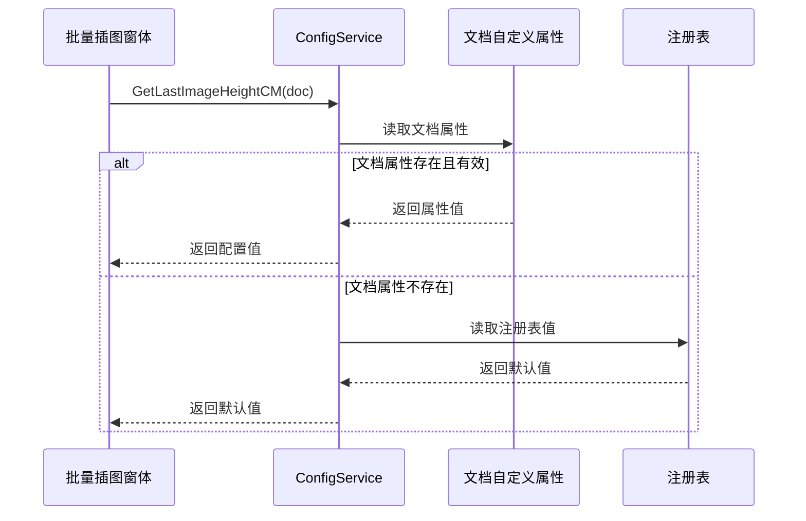
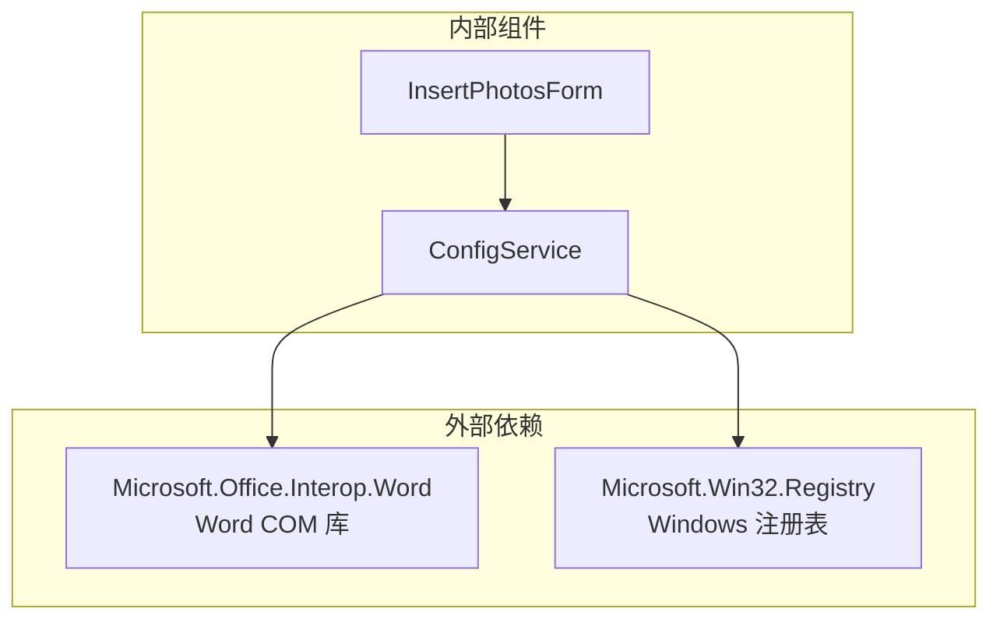

# 配置管理服务

<cite>
**本文档引用的文件**
- [ConfigService.cs](file://WordTools/Services/ConfigService.cs)
- [InsertPhotosForm.cs](file://WordTools/Forms/InsertPhotosForm.cs)
- [ThisAddIn.cs](file://WordTools/ThisAddIn.cs)
- [README.md](file://README.md)
</cite>

## 目录
1. [简介](#简介)
2. [项目结构](#项目结构)
3. [核心组件](#核心组件)
4. [架构概览](#架构概览)
5. [详细组件分析](#详细组件分析)
6. [依赖关系分析](#依赖关系分析)
7. [性能考虑](#性能考虑)
8. [故障排除指南](#故障排除指南)
9. [结论](#结论)

## 简介

配置管理服务是 Word 工具箱插件的核心组件，负责管理用户的各种偏好设置和配置选项。该服务采用多层次的配置存储策略，确保配置数据能够在不同场景下可靠地保存和恢复。

本服务主要管理以下类型的配置：
- **文档级自定义属性存储**：针对特定文档的个性化设置
- **注册表配置备份**：全局应用程序设置
- **用户偏好记忆机制**：跨文档的用户偏好设置

## 项目结构

Word 工具箱项目采用模块化的架构设计，配置管理服务位于专门的服务层中：

**图表来源**
- [ConfigService.cs:1-362](file://WordTools/Services/ConfigService.cs#L1-L362)
- [InsertPhotosForm.cs:1-618](file://WordTools/Forms/InsertPhotosForm.cs#L1-L618)
- [ThisAddIn.cs:1-157](file://WordTools/ThisAddIn.cs#L1-L157)

**章节来源**
- [README.md:47-60](file://README.md#L47-L60)

## 核心组件

配置管理服务的核心是一个静态类，提供了统一的配置访问接口。该服务实现了以下关键特性：

### 多层次存储策略

服务采用"文档级优先，全局回退"的存储策略：

1. **文档级存储**：优先从当前文档的自定义属性中读取配置
2. **全局存储**：当文档级配置不存在时，从注册表中读取全局配置
3. **容错机制**：所有操作都包含异常处理，确保配置服务的稳定性

### 配置键值管理

服务定义了以下配置键值常量：

| 配置键 | 数据类型 | 描述 |
|--------|----------|------|
| LastImageHeightCM | 字符串 | 最后使用的图片高度（厘米） |
| LastFolderPath | 字符串 | 最后使用的文件夹路径 |
| NeedDescription | 布尔值 | 是否需要描述行 |
| UseFilenameAsDescription | 布尔值 | 是否使用文件名作为描述 |
| IncludeRootImages | 布尔值 | 是否包含根目录图片 |
| IncludeSubFolderImages | 布尔值 | 是否包含子目录图片 |
| AutoNumbering | 布尔值 | 是否启用自动编号 |
| NumberAlignment | 整数值 | 编号对齐方式（1=靠左, 2=居中） |

**章节来源**
- [ConfigService.cs:13-24](file://WordTools/Services/ConfigService.cs#L13-L24)

## 架构概览

配置管理服务的整体架构采用分层设计，确保了良好的内聚性和低耦合性：

**图表来源**
- [ConfigService.cs:11-361](file://WordTools/Services/ConfigService.cs#L11-L361)
- [InsertPhotosForm.cs:52-57](file://WordTools/Forms/InsertPhotosForm.cs#L52-L57)

## 详细组件分析

### ConfigService 类结构

ConfigService 是一个静态类，提供了完整的配置管理功能。其设计遵循单一职责原则，将配置操作封装在独立的方法中。

**图表来源**
- [ConfigService.cs:11-361](file://WordTools/Services/ConfigService.cs#L11-L361)

### 配置存储策略详解

#### 文档级自定义属性存储

文档级存储提供了针对特定文档的个性化配置，这些配置只影响当前文档：

**图表来源**
- [ConfigService.cs:149-178](file://WordTools/Services/ConfigService.cs#L149-L178)

#### 注册表全局存储

注册表存储提供了全局的应用程序设置，这些设置适用于所有文档：

| 配置项 | 默认值 | 作用域 |
|--------|--------|--------|
| LastImageHeightCM | 空字符串 | 文档级 |
| LastFolderPath | 空字符串 | 文档级 |
| NeedDescription | False | 文档级 |
| UseFilenameAsDescription | False | 文档级 |
| IncludeRootImages | True | 文档级 |
| IncludeSubFolderImages | True | 文档级 |
| AutoNumbering | False | 全局 |
| NumberAlignment | 2 | 全局 |

**图表来源**
- [ConfigService.cs:268-297](file://WordTools/Services/ConfigService.cs#L268-L297)
- [ConfigService.cs:340-349](file://WordTools/Services/ConfigService.cs#L340-L349)

### 配置项管理详解

#### 图片高度配置

图片高度配置支持两种存储方式：文档级和全局级。服务使用特殊标记来处理空值：

**图表来源**
- [ConfigService.cs:149-178](file://WordTools/Services/ConfigService.cs#L149-L178)

#### 文件夹路径配置

文件夹路径配置同样支持文档级和全局级存储，主要用于记住用户上次选择的文件夹位置：

**章节来源**
- [ConfigService.cs:187-207](file://WordTools/Services/ConfigService.cs#L187-L207)

#### 描述选项配置

描述选项配置包括三个相关设置：
- 是否需要描述行
- 是否使用文件名作为描述
- 描述行的显示方式

**章节来源**
- [ConfigService.cs:216-259](file://WordTools/Services/ConfigService.cs#L216-L259)

#### 文件范围配置

文件范围配置控制图片扫描的范围：
- 根目录图片包含选项
- 子目录图片包含选项

默认情况下，这两个选项都设置为包含（True），以提供最全面的图片扫描体验。

**章节来源**
- [ConfigService.cs:268-311](file://WordTools/Services/ConfigService.cs#L268-L311)

#### 自动编号配置

自动编号配置控制是否启用自动编号功能：
- AutoNumbering：布尔值，控制自动编号的启用状态

**章节来源**
- [ConfigService.cs:320-331](file://WordTools/Services/ConfigService.cs#L320-L331)

#### 编号对齐配置

编号对齐配置控制编号的对齐方式：
- NumberAlignment：整数值，1=靠左，2=居中（默认）

**章节来源**
- [ConfigService.cs:340-357](file://WordTools/Services/ConfigService.cs#L340-L357)

## 依赖关系分析

配置管理服务的依赖关系相对简单，主要依赖于两个外部系统：

**图表来源**
- [ConfigService.cs:1-3](file://WordTools/Services/ConfigService.cs#L1-L3)
- [InsertPhotosForm.cs:4-6](file://WordTools/Forms/InsertPhotosForm.cs#L4-L6)

### 组件耦合分析

配置服务与业务逻辑的耦合度较低，通过清晰的接口设计实现了良好的解耦：

- **低耦合**：ConfigService 仅依赖于 COM 和注册表 API
- **高内聚**：所有配置相关的操作都集中在单个类中
- **易测试**：静态类设计便于单元测试

**章节来源**
- [ConfigService.cs:1-3](file://WordTools/Services/ConfigService.cs#L1-L3)

## 性能考虑

配置管理服务在设计时充分考虑了性能因素：

### 异步操作
- 所有配置操作都是同步执行，避免了异步操作带来的复杂性
- 配置读取操作通常很快，不会影响用户体验

### 错误处理
- 所有配置操作都包含异常处理，确保服务的稳定性
- 即使配置读取失败，也不会影响主程序的正常运行

### 内存管理
- 使用静态类设计，避免了不必要的对象创建
- 配置数据通常很小，内存占用可以忽略不计

## 故障排除指南

### 常见问题及解决方案

#### 配置无法保存

**症状**：用户修改配置后重启软件发现设置丢失

**可能原因**：
1. 注册表权限不足
2. Word COM 对象访问失败
3. 文档自定义属性写入失败

**解决方案**：
1. 确保以管理员权限运行 Word
2. 检查注册表权限设置
3. 验证文档对象的可用性

#### 配置读取错误

**症状**：配置读取返回默认值而非实际值

**可能原因**：
1. 文档自定义属性不存在
2. 注册表中没有对应的配置项
3. 数据格式不正确

**解决方案**：
1. 检查文档是否已保存
2. 验证注册表中的配置项
3. 清除损坏的配置数据

#### 权限问题

**症状**：配置保存失败或权限不足

**解决方案**：
1. 以管理员身份运行 Word
2. 检查用户账户控制设置
3. 验证注册表访问权限

**章节来源**
- [ConfigService.cs:88-92](file://WordTools/Services/ConfigService.cs#L88-L92)
- [ConfigService.cs:136-140](file://WordTools/Services/ConfigService.cs#L136-L140)

## 结论

配置管理服务为 Word 工具箱插件提供了强大而灵活的配置管理能力。通过采用多层次的存储策略，该服务能够满足不同场景下的配置需求，同时确保配置数据的可靠性和一致性。

### 主要优势

1. **多层次存储**：文档级和全局级配置的结合提供了最大的灵活性
2. **容错设计**：完善的异常处理确保了服务的稳定性
3. **易于使用**：简洁的 API 设计降低了使用复杂度
4. **性能优化**：静态类设计和高效的存储策略保证了良好的性能

### 未来改进方向

1. **配置版本管理**：可以考虑添加配置版本控制机制
2. **配置导入导出**：提供配置的批量导入导出功能
3. **配置验证**：增加配置值的有效性验证机制
4. **配置同步**：支持多设备间的配置同步功能

配置管理服务的设计体现了良好的软件工程实践，为 Word 工具箱插件的成功运行奠定了坚实的基础。