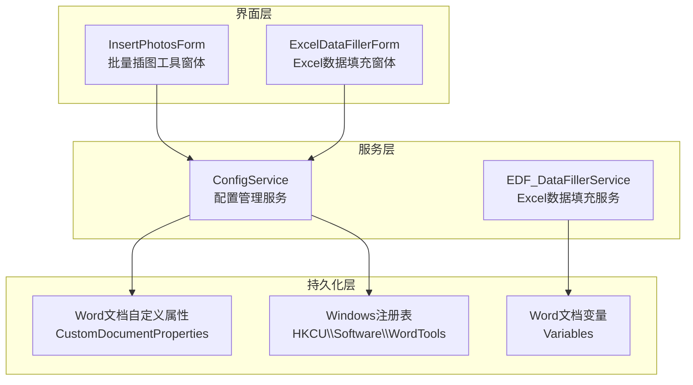
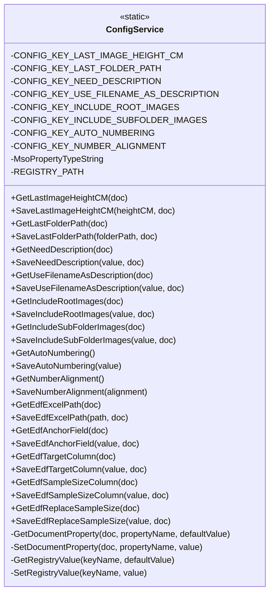
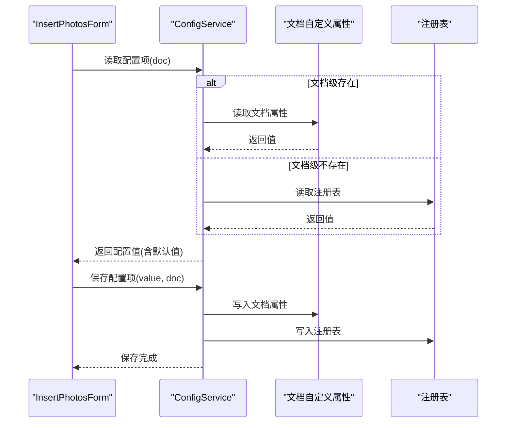
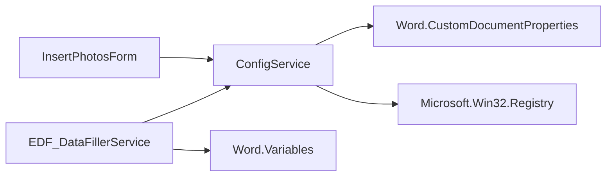

# 配置管理系统

<cite>
**本文引用的文件**
- [ConfigService.cs](file://WordTools/Services/ConfigService.cs)
- [InsertPhotosForm.cs](file://WordTools/Forms/InsertPhotosForm.cs)
- [EDF_DataFillerService.cs](file://WordTools/Services/EDF_DataFillerService.cs)
- [README.md](file://README.md)
</cite>

## 更新摘要
**变更内容**
- 更新了文档属性处理的安全性改进，包括更安全的字符串比较机制
- 新增了Office属性类型常量的详细说明
- 增强了配置加载和保存的实现细节分析
- 完善了异常处理和默认值机制的说明

## 目录
1. [简介](#简介)
2. [项目结构](#项目结构)
3. [核心组件](#核心组件)
4. [架构总览](#架构总览)
5. [详细组件分析](#详细组件分析)
6. [依赖关系分析](#依赖关系分析)
7. [性能考量](#性能考量)
8. [故障排除指南](#故障排除指南)
9. [结论](#结论)
10. [附录](#附录)

## 简介
本文件系统性阐述 WordTools 的配置管理系统，重点解析 ConfigService 的实现原理与工作机制，涵盖文档级配置存储与全局用户设置的双存储机制、配置数据的持久化策略、各类配置项的管理与应用、配置加载与保存的实现细节、异常处理与默认值机制、配置迁移与兼容性处理、配置备份与恢复最佳实践，以及为开发者扩展新配置项的指导与注意事项。该系统通过"文档自定义属性 + 注册表"的双层持久化策略，确保配置既能在文档内独立保存，又能作为全局用户偏好进行跨文档共享。

**更新** 本版本增强了文档属性处理的安全性，包括更安全的字符串比较和Office属性类型常量的使用。

## 项目结构
WordTools 采用 COM 加载项架构，配置管理位于 Services 目录下的 ConfigService.cs，UI 交互由 Forms 目录中的窗体负责调用。核心流程是：窗体读取配置项并展示给用户，用户操作后调用 ConfigService 保存；当需要恢复上次设置时，窗体再次调用 ConfigService 读取。

**图表来源**
- [ConfigService.cs:11-467](file://WordTools/Services/ConfigService.cs#L11-L467)
- [InsertPhotosForm.cs:1-200](file://WordTools/Forms/InsertPhotosForm.cs#L1-L200)
- [EDF_DataFillerService.cs:1-200](file://WordTools/Services/EDF_DataFillerService.cs#L1-L200)

**章节来源**
- [README.md:1-85](file://README.md#L1-L85)
- [ConfigService.cs:11-467](file://WordTools/Services/ConfigService.cs#L11-L467)
- [InsertPhotosForm.cs:1-200](file://WordTools/Forms/InsertPhotosForm.cs#L1-L200)
- [EDF_DataFillerService.cs:1-200](file://WordTools/Services/EDF_DataFillerService.cs#L1-L200)

## 核心组件
- ConfigService：静态类，提供统一的配置读写接口，内部封装文档自定义属性与注册表两种持久化方式。
- InsertPhotosForm：批量插图工具窗体，负责展示与收集用户配置，并调用 ConfigService 保存/读取。
- EDF_DataFillerService：Excel 数据填充服务，使用 Word 文档变量存储特定配置，实现与 ConfigService 的互补。

**章节来源**
- [ConfigService.cs:11-467](file://WordTools/Services/ConfigService.cs#L11-L467)
- [InsertPhotosForm.cs:1-200](file://WordTools/Forms/InsertPhotosForm.cs#L1-L200)
- [EDF_DataFillerService.cs:1-200](file://WordTools/Services/EDF_DataFillerService.cs#L1-L200)

## 架构总览
ConfigService 采用"文档级配置 + 全局用户配置"的双存储机制：
- 文档级配置：通过 Word 文档自定义属性（CustomDocumentProperties）保存，键名以配置项常量命名，适合与文档绑定的个性化设置。
- 全局用户配置：通过 Windows 注册表（HKCU\Software\WordTools）保存，键名与文档级配置相同，适合跨文档共享的用户偏好。
- 读取策略：优先从文档自定义属性读取，若不存在则回退到注册表；保存时同时写入文档与注册表，确保一致性。
- 特殊值处理：对于空字符串的场景，使用特殊标记（如"__EMPTY__"）进行区分，避免 Word COM 对空字符串的不兼容问题。

**更新** 新增了Office属性类型常量的支持，确保文档属性的类型安全性。

**图表来源**
- [ConfigService.cs:11-467](file://WordTools/Services/ConfigService.cs#L11-L467)

## 详细组件分析

### 文档级配置存储与全局用户设置的双存储机制
- 文档级配置：通过 GetDocumentProperty/SetDocumentProperty 读写 Word 文档自定义属性，键名来自配置项常量。适用于与文档绑定的个性化设置，如最后使用的文件夹路径、图片高度、描述选项、包含范围等。
- 全局用户配置：通过 GetRegistryValue/SetRegistryValue 读写注册表（HKCU\Software\WordTools），键名与文档级配置相同。适用于跨文档共享的用户偏好，如自动编号开关、编号对齐方式等。
- 读取优先级：优先从文档自定义属性读取，若不存在则回退到注册表；保存时同时写入文档与注册表，确保一致性。
- 异常处理：读写过程均使用 try/catch 包裹，忽略异常以保证稳定性；默认值在读取失败时返回。
- 特殊值处理：空字符串使用"__EMPTY__"标记，保存前转换，读取后还原为空字符串，避免 Word COM 对空字符串的不兼容问题。

**更新** 文档属性处理现在使用更安全的字符串比较机制，通过 `prop.Name?.ToString()` 避免空引用异常。

**章节来源**
- [ConfigService.cs:26-94](file://WordTools/Services/ConfigService.cs#L26-L94)
- [ConfigService.cs:96-142](file://WordTools/Services/ConfigService.cs#L96-L142)
- [ConfigService.cs:149-178](file://WordTools/Services/ConfigService.cs#L149-L178)
- [ConfigService.cs:187-207](file://WordTools/Services/ConfigService.cs#L187-L207)

### 配置数据的持久化策略
- ActiveDocument 级别配置：用于与当前文档绑定的个性化设置，如最后使用的文件夹路径、图片高度、描述选项、包含范围等。这些配置在文档关闭后仍可通过文档自定义属性保留，便于下次打开时恢复。
- 用户全局配置：用于跨文档共享的用户偏好，如自动编号开关、编号对齐方式等。这些配置存储在注册表中，适用于不同文档的统一行为。
- 应用场景：
  - 文档级：当用户希望在不同文档中保持不同的图片插入偏好时，使用文档级配置。
  - 全局级：当用户希望在所有文档中统一自动编号行为时，使用全局配置。

**章节来源**
- [ConfigService.cs:149-178](file://WordTools/Services/ConfigService.cs#L149-L178)
- [ConfigService.cs:187-207](file://WordTools/Services/ConfigService.cs#L187-L207)
- [ConfigService.cs:320-331](file://WordTools/Services/ConfigService.cs#L320-L331)
- [ConfigService.cs:340-357](file://WordTools/Services/ConfigService.cs#L340-L357)

### 各种配置项的管理
- 最后使用的文件夹路径：支持文档级与全局级存储，读取时优先文档级，保存时同时写入文档与注册表。
- 图片高度：支持文档级存储，空值使用"__EMPTY__"标记，读取后还原为空字符串。
- 描述选项：包括"是否需要描述行"和"是否使用文件名作为描述"，均为布尔值，支持文档级与全局级存储。
- 包含范围：包括"是否包含根目录图片"和"是否包含子目录图片"，均为布尔值，支持文档级与全局级存储。
- 自动编号设置：布尔值，仅支持全局级存储（注册表）。
- 对齐方式：整数（1=靠左，2=居中），默认值为2，仅支持全局级存储（注册表）。
- Excel 数据填充配置：包括 Excel 文件路径、锚定字段、目标列、Sample Size 列、是否替换 Sample Size 等，支持文档级与全局级存储。

**章节来源**
- [ConfigService.cs:14-21](file://WordTools/Services/ConfigService.cs#L14-L21)
- [ConfigService.cs:149-178](file://WordTools/Services/ConfigService.cs#L149-L178)
- [ConfigService.cs:187-207](file://WordTools/Services/ConfigService.cs#L187-L207)
- [ConfigService.cs:216-235](file://WordTools/Services/ConfigService.cs#L216-L235)
- [ConfigService.cs:240-259](file://WordTools/Services/ConfigService.cs#L240-L259)
- [ConfigService.cs:268-311](file://WordTools/Services/ConfigService.cs#L268-L311)
- [ConfigService.cs:320-331](file://WordTools/Services/ConfigService.cs#L320-L331)
- [ConfigService.cs:340-357](file://WordTools/Services/ConfigService.cs#L340-L357)
- [ConfigService.cs:363-460](file://WordTools/Services/ConfigService.cs#L363-L460)

### 配置加载和保存的实现细节
- 加载流程：窗体初始化时调用 ConfigService 的读取方法，优先从文档自定义属性读取，若不存在则回退到注册表；遇到异常或空值时使用默认值。
- 保存流程：用户操作完成后，窗体调用 ConfigService 的保存方法，同时写入文档自定义属性与注册表；空值使用"__EMPTY__"标记进行处理。
- 异常处理：读写过程均使用 try/catch 包裹，忽略异常以保证稳定性；默认值在读取失败时返回。
- 默认值机制：针对不同配置项设置合理的默认值，如编号对齐默认居中、包含根目录默认开启等。

**更新** 文档属性处理现在使用更安全的字符串比较机制，通过 `prop.Name?.ToString()` 避免空引用异常。

**图表来源**
- [InsertPhotosForm.cs:387-438](file://WordTools/Forms/InsertPhotosForm.cs#L387-L438)
- [ConfigService.cs:149-178](file://WordTools/Services/ConfigService.cs#L149-L178)
- [ConfigService.cs:187-207](file://WordTools/Services/ConfigService.cs#L187-L207)
- [ConfigService.cs:216-235](file://WordTools/Services/ConfigService.cs#L216-L235)
- [ConfigService.cs:240-259](file://WordTools/Services/ConfigService.cs#L240-L259)
- [ConfigService.cs:268-311](file://WordTools/Services/ConfigService.cs#L268-L311)
- [ConfigService.cs:320-331](file://WordTools/Services/ConfigService.cs#L320-L331)
- [ConfigService.cs:340-357](file://WordTools/Services/ConfigService.cs#L340-L357)

**章节来源**
- [InsertPhotosForm.cs:387-438](file://WordTools/Forms/InsertPhotosForm.cs#L387-L438)
- [ConfigService.cs:28-92](file://WordTools/Services/ConfigService.cs#L28-L92)
- [ConfigService.cs:101-140](file://WordTools/Services/ConfigService.cs#L101-L140)

### 配置迁移和兼容性处理
- 版本升级兼容：新增配置项时，应提供默认值，确保旧版本文档或未设置的用户能正常工作。
- 数据类型迁移：对于数值型配置，使用 Parse 并限定有效范围（如编号对齐仅接受1或2），无效值回退到默认值。
- 空值处理：统一使用"__EMPTY__"标记区分空值，避免 Word COM 对空字符串的不兼容问题。
- 注册表路径：固定在 HKCU\Software\WordTools，避免多用户环境下的冲突。

**章节来源**
- [ConfigService.cs:340-357](file://WordTools/Services/ConfigService.cs#L340-L357)
- [ConfigService.cs:149-178](file://WordTools/Services/ConfigService.cs#L149-L178)
- [ConfigService.cs:187-207](file://WordTools/Services/ConfigService.cs#L187-L207)

### 配置备份与恢复最佳实践
- 备份策略：
  - 注册表备份：导出 HKCU\Software\WordTools 下的配置项，作为全局配置的备份。
  - 文档级备份：将包含自定义属性的文档作为模板保存，以便在新文档中继承配置。
- 恢复策略：
  - 注册表恢复：导入之前导出的注册表文件，恢复全局配置。
  - 文档级恢复：复制包含自定义属性的文档，或从备份文档中提取配置项。
- 注意事项：
  - 备份前确认当前配置状态，避免覆盖重要设置。
  - 恢复后测试关键功能，确保配置生效且不影响文档内容。

**章节来源**
- [ConfigService.cs:24-24](file://WordTools/Services/ConfigService.cs#L24-L24)
- [ConfigService.cs:31-54](file://WordTools/Services/ConfigService.cs#L31-L54)
- [ConfigService.cs:101-140](file://WordTools/Services/ConfigService.cs#L101-L140)

### 开发者扩展新配置项的指导与注意事项
- 新增配置项步骤：
  1. 在 ConfigService 中添加新的配置键常量。
  2. 实现 GetXxx 和 SaveXxx 方法，遵循"文档级优先 + 注册表回退"的读取策略。
  3. 对于布尔值，使用"True/False"字符串存储；对于数值，使用 Parse 并限定有效范围。
  4. 对于空值场景，使用"__EMPTY__"标记进行处理。
  5. 在 UI 窗体中调用新增的读取/保存方法，确保用户交互与配置同步。
- 注意事项：
  - 保持键名一致性，避免重复或冲突。
  - 提供合理的默认值，确保向后兼容。
  - 异常处理要稳健，避免影响主流程。
  - 对于全局配置，仅使用注册表存储；对于文档级配置，同时写入文档与注册表。

**章节来源**
- [ConfigService.cs:14-21](file://WordTools/Services/ConfigService.cs#L14-L21)
- [ConfigService.cs:320-331](file://WordTools/Services/ConfigService.cs#L320-L331)
- [ConfigService.cs:340-357](file://WordTools/Services/ConfigService.cs#L340-L357)
- [InsertPhotosForm.cs:387-438](file://WordTools/Forms/InsertPhotosForm.cs#L387-L438)

### Office属性类型常量的使用
ConfigService 现在使用 Office 属性类型常量来确保文档属性的类型安全性：

- **MsoPropertyTypeString = 4**：表示字符串类型的文档属性，用于明确指定属性的数据类型。
- **类型安全的属性创建**：在 SetDocumentProperty 方法中，使用 `MsoPropertyTypeString` 常量确保新创建的文档属性具有正确的数据类型。
- **向后兼容性**：此常量的引入不会影响现有配置的读取和保存，但为未来的扩展提供了类型安全保障。

**更新** 新增了Office属性类型常量的详细说明和使用场景。

**章节来源**
- [ConfigService.cs:26-28](file://WordTools/Services/ConfigService.cs#L26-L28)
- [ConfigService.cs:89](file://WordTools/Services/ConfigService.cs#L89)

## 依赖关系分析
- ConfigService 依赖：
  - Word Interop：通过 CustomDocumentProperties 与 Variables 访问文档属性与变量。
  - Windows 注册表：通过 Microsoft.Win32.Registry 访问用户配置。
- UI 窗体依赖：
  - ConfigService：用于读取与保存配置。
  - Services：如 ImageService、FileService 等，用于业务逻辑处理。
- EDF_DataFillerService 依赖：
  - Word Interop：通过 Variables 存储 Excel 数据填充配置。
  - ConfigService：用于读取通用配置项。

**图表来源**
- [ConfigService.cs:1-467](file://WordTools/Services/ConfigService.cs#L1-L467)
- [InsertPhotosForm.cs:1-200](file://WordTools/Forms/InsertPhotosForm.cs#L1-L200)
- [EDF_DataFillerService.cs:1-200](file://WordTools/Services/EDF_DataFillerService.cs#L1-L200)

**章节来源**
- [ConfigService.cs:1-467](file://WordTools/Services/ConfigService.cs#L1-L467)
- [InsertPhotosForm.cs:1-200](file://WordTools/Forms/InsertPhotosForm.cs#L1-L200)
- [EDF_DataFillerService.cs:1-200](file://WordTools/Services/EDF_DataFillerService.cs#L1-L200)

## 性能考量
- 文档变量与自定义属性：读写频率较高时，建议减少不必要的重复读取，可在窗体初始化时一次性加载并缓存。
- 注册表访问：注册表读写相对轻量，但频繁写入可能影响性能，建议在用户确认操作后再批量保存。
- 异常吞吐：try/catch 包裹避免了异常传播，但过多的异常可能掩盖潜在问题，建议在开发阶段记录日志以便排查。
- 字符串比较优化：使用安全的字符串比较机制（`prop.Name?.ToString()`）避免空引用异常，提高代码稳定性。

**更新** 新增了字符串比较优化的性能考量。

## 故障排除指南
- 配置无法读取：
  - 检查文档自定义属性是否存在，必要时回退到注册表。
  - 确认注册表路径 HKCU\Software\WordTools 是否存在且可访问。
- 配置保存失败：
  - 检查权限问题，确保当前用户对注册表有写入权限。
  - 确认 Word 文档未被保护或只读。
- 空值显示异常：
  - 确认使用"__EMPTY__"标记进行区分，读取后正确还原为空字符串。
- 默认值不符合预期：
  - 检查默认值设置是否合理，必要时调整默认值逻辑。
- 文档属性访问异常：
  - 确保使用安全的字符串比较机制，避免空引用异常。
  - 检查 Office 属性类型常量的正确使用。

**更新** 新增了文档属性访问异常的故障排除指导。

**章节来源**
- [ConfigService.cs:28-92](file://WordTools/Services/ConfigService.cs#L28-L92)
- [ConfigService.cs:101-140](file://WordTools/Services/ConfigService.cs#L101-L140)
- [ConfigService.cs:149-178](file://WordTools/Services/ConfigService.cs#L149-L178)
- [ConfigService.cs:187-207](file://WordTools/Services/ConfigService.cs#L187-L207)

## 结论
ConfigService 通过"文档自定义属性 + 注册表"的双存储机制，实现了灵活而稳定的配置管理。它不仅满足了文档级个性化配置的需求，也提供了全局用户偏好的统一管理。完善的异常处理与默认值机制确保了系统的健壮性，而清晰的扩展指导为后续功能增强奠定了基础。结合备份与恢复的最佳实践，开发者可以安全地维护与演进配置体系。

**更新** 本版本的改进包括更安全的文档属性处理和Office属性类型常量的使用，进一步提升了系统的稳定性和类型安全性。

## 附录
- 相关文件路径与用途：
  - ConfigService.cs：配置管理的核心实现，提供统一的读写接口。
  - InsertPhotosForm.cs：批量插图工具窗体，负责配置的展示与保存。
  - EDF_DataFillerService.cs：Excel 数据填充服务，使用文档变量存储特定配置。
  - README.md：项目概述与技术说明，便于理解整体架构。

**章节来源**
- [README.md:1-85](file://README.md#L1-L85)
- [ConfigService.cs:1-467](file://WordTools/Services/ConfigService.cs#L1-L467)
- [InsertPhotosForm.cs:1-200](file://WordTools/Forms/InsertPhotosForm.cs#L1-L200)
- [EDF_DataFillerService.cs:1-200](file://WordTools/Services/EDF_DataFillerService.cs#L1-L200)